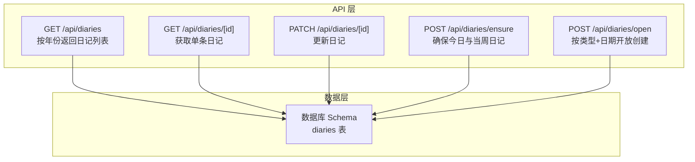
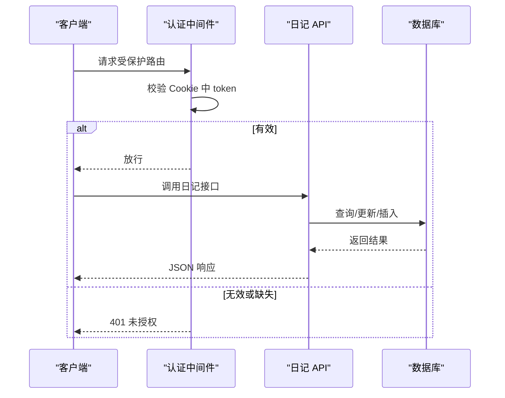
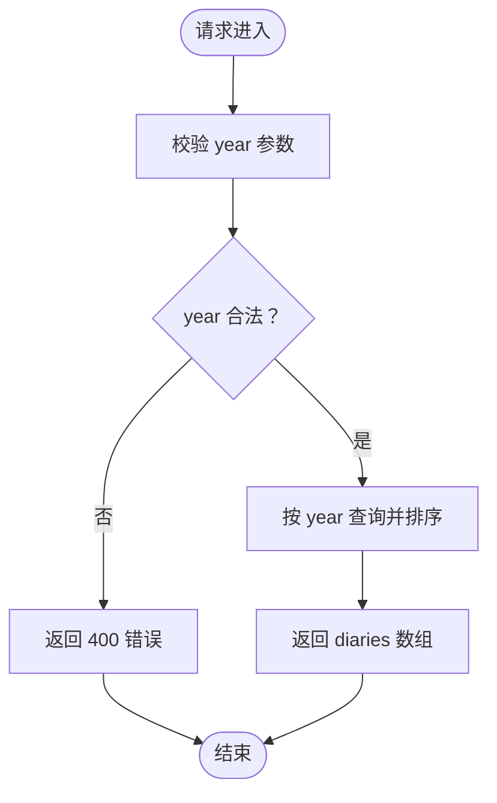
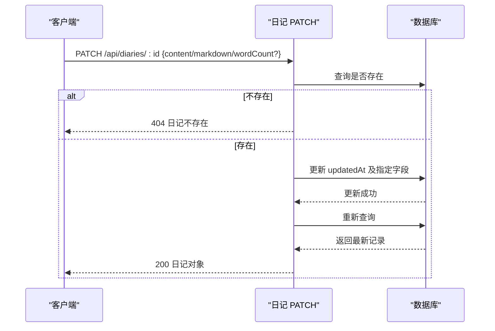
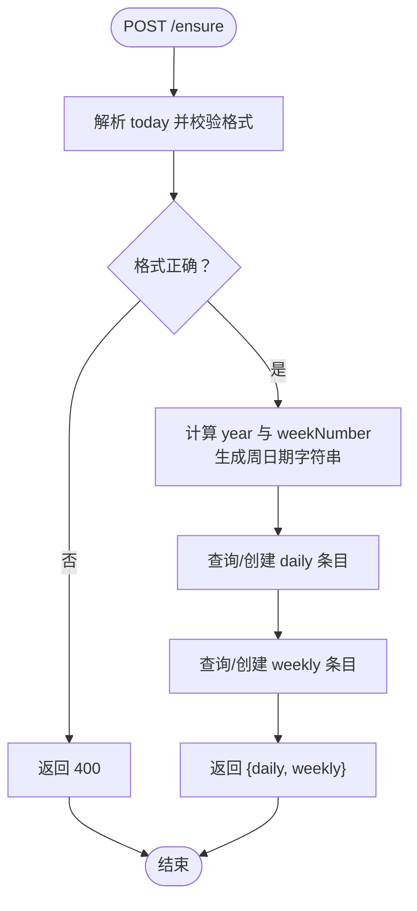
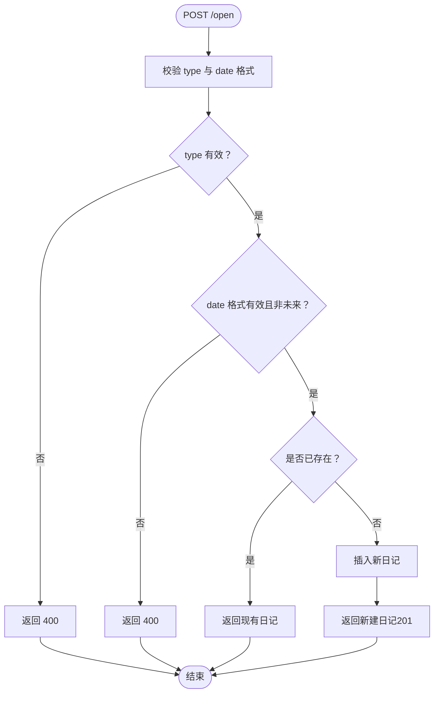
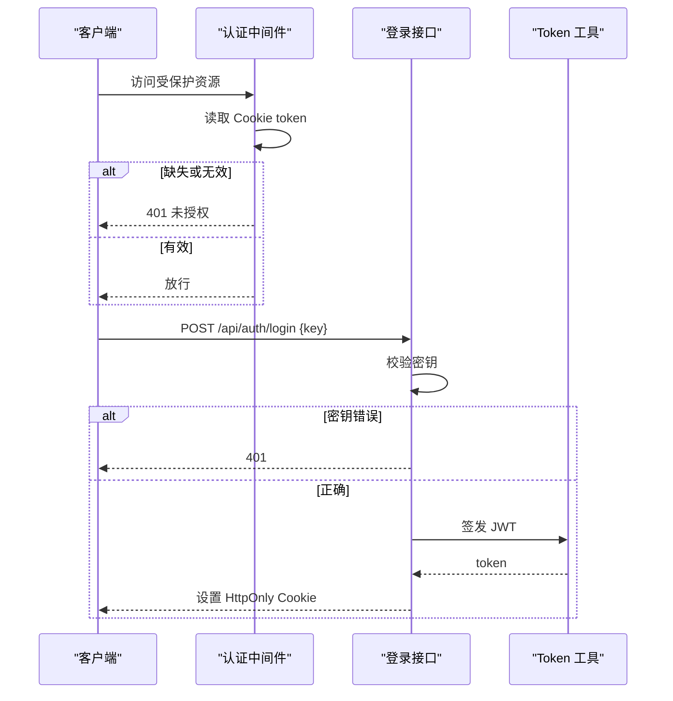
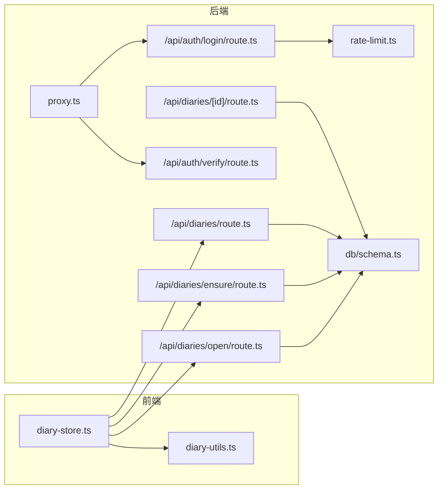
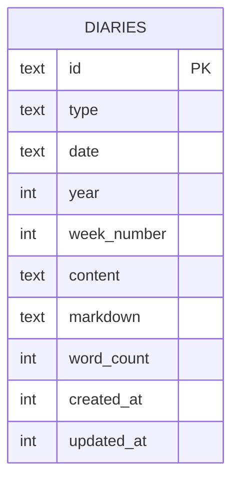

# 日记 API 接口

<cite>
**本文档引用的文件**
- [src/app/api/diaries/route.ts](file://src/app/api/diaries/route.ts)
- [src/app/api/diaries/[id]/route.ts](file://src/app/api/diaries/[id]/route.ts)
- [src/app/api/diaries/ensure/route.ts](file://src/app/api/diaries/ensure/route.ts)
- [src/app/api/diaries/open/route.ts](file://src/app/api/diaries/open/route.ts)
- [src/db/schema.ts](file://src/db/schema.ts)
- [src/lib/auth.ts](file://src/lib/auth.ts)
- [src/app/api/auth/login/route.ts](file://src/app/api/auth/login/route.ts)
- [src/app/api/auth/verify/route.ts](file://src/app/api/auth/verify/route.ts)
- [src/proxy.ts](file://src/proxy.ts)
- [src/lib/rate-limit.ts](file://src/lib/rate-limit.ts)
- [src/stores/diary-store.ts](file://src/stores/diary-store.ts)
- [src/lib/diary-utils.ts](file://src/lib/diary-utils.ts)
- [src/types/index.ts](file://src/types/index.ts)
- [package.json](file://package.json)
</cite>

## 目录
1. [简介](#简介)
2. [项目结构](#项目结构)
3. [核心组件](#核心组件)
4. [架构总览](#架构总览)
5. [详细组件分析](#详细组件分析)
6. [依赖关系分析](#依赖关系分析)
7. [性能考量](#性能考量)
8. [故障排除指南](#故障排除指南)
9. [结论](#结论)
10. [附录](#附录)

## 简介
本文件为日记 API 接口的完整技术文档，覆盖以下能力：
- 日记列表获取：支持按年份查询与多字段排序
- 单个日记条目 CRUD：GET 获取详情；PATCH 更新内容、Markdown 和字数统计
- 日记确保创建：自动为当天与当周创建条目，避免重复
- 开放访问接口：允许外部以类型+日期创建日记，含存在性检查与未来日期限制
- 认证与权限：基于 Cookie 的 JWT 验证中间件，公开路径白名单
- 错误处理：统一的错误响应与状态码
- 版本控制与兼容性：Next.js App Router 路由约定即版本控制（v0.1.0）
- 限流策略：登录接口防暴力破解
- 客户端集成：前端 Store 使用示例与最佳实践

## 项目结构
日记 API 位于 Next.js App Router 的 `/src/app/api/diaries` 下，采用“按资源分组”的组织方式：
- 列表接口：`/api/diaries?year=YYYY`
- 单条接口：`/api/diaries/[id]`
- 确保创建：`/api/diaries/ensure`
- 开放访问：`/api/diaries/open`

图表来源
- [src/app/api/diaries/route.ts:6-44](file://src/app/api/diaries/route.ts#L6-L44)
- [src/app/api/diaries/[id]/route.ts](file://src/app/api/diaries/[id]/route.ts#L6-L62)
- [src/app/api/diaries/ensure/route.ts:8-126](file://src/app/api/diaries/ensure/route.ts#L8-L126)
- [src/app/api/diaries/open/route.ts:14-129](file://src/app/api/diaries/open/route.ts#L14-L129)
- [src/db/schema.ts:93-104](file://src/db/schema.ts#L93-L104)

章节来源
- [src/app/api/diaries/route.ts:1-45](file://src/app/api/diaries/route.ts#L1-L45)
- [src/app/api/diaries/[id]/route.ts](file://src/app/api/diaries/[id]/route.ts#L1-L63)
- [src/app/api/diaries/ensure/route.ts:1-127](file://src/app/api/diaries/ensure/route.ts#L1-L127)
- [src/app/api/diaries/open/route.ts:1-130](file://src/app/api/diaries/open/route.ts#L1-L130)
- [src/db/schema.ts:1-105](file://src/db/schema.ts#L1-L105)

## 核心组件
- 数据模型：日记实体包含类型、日期、年份、周序号、内容、Markdown、字数统计及时间戳
- 认证中间件：通过 Cookie 中的 token 进行验证，公开路径白名单
- 登录接口：校验密钥并签发 JWT，带速率限制
- 前端 Store：负责调用日记 API 并管理状态

章节来源
- [src/db/schema.ts:93-104](file://src/db/schema.ts#L93-L104)
- [src/lib/auth.ts:1-26](file://src/lib/auth.ts#L1-L26)
- [src/proxy.ts:1-49](file://src/proxy.ts#L1-L49)
- [src/app/api/auth/login/route.ts:1-63](file://src/app/api/auth/login/route.ts#L1-L63)
- [src/stores/diary-store.ts:1-234](file://src/stores/diary-store.ts#L1-L234)

## 架构总览

图表来源
- [src/proxy.ts:7-45](file://src/proxy.ts#L7-L45)
- [src/lib/auth.ts:18-25](file://src/lib/auth.ts#L18-L25)
- [src/app/api/diaries/route.ts:6-44](file://src/app/api/diaries/route.ts#L6-L44)

## 详细组件分析

### 日记列表获取接口
- 路径：`GET /api/diaries?year=YYYY`
- 功能：按年份筛选日记，返回包含关键元信息的列表
- 排序规则：
  - 先按周序号降序
  - 再按类型升序（weekly 在 daily 之前）
  - 最后按日期降序
- 参数：
  - year：必填，必须为合法数字
- 成功响应：包含 `diaries` 数组
- 错误：
  - 缺少或非法 year：400
  - 服务器异常：500

图表来源
- [src/app/api/diaries/route.ts:6-44](file://src/app/api/diaries/route.ts#L6-L44)

章节来源
- [src/app/api/diaries/route.ts:6-44](file://src/app/api/diaries/route.ts#L6-L44)

### 单个日记条目 CRUD 接口
- 获取详情：`GET /api/diaries/[id]`
  - 不存在：404
  - 成功：返回完整日记对象
- 更新内容：`PATCH /api/diaries/[id]`
  - 支持更新字段：content、markdown、wordCount
  - 总会更新 updatedAt
  - 不存在：404
  - 成功：返回更新后的日记对象

图表来源
- [src/app/api/diaries/[id]/route.ts](file://src/app/api/diaries/[id]/route.ts#L26-L62)

章节来源
- [src/app/api/diaries/[id]/route.ts](file://src/app/api/diaries/[id]/route.ts#L6-L62)

### 日记确保创建接口
- 路径：`POST /api/diaries/ensure`
- 功能：确保当天与当周的日记存在，若不存在则自动创建
- 请求体：
  - today：必填，格式 YYYY-MM-DD
- 返回：
  - daily：当天日记元信息
  - weekly：当周日记元信息
- 业务逻辑：
  - 计算 ISO 周年份与周序号，生成周日期字符串
  - 分别查询 daily 与 weekly 条目，不存在则插入空内容的条目
- 错误：
  - 缺少或格式不正确 today：400
  - 服务器异常：500

图表来源
- [src/app/api/diaries/ensure/route.ts:8-126](file://src/app/api/diaries/ensure/route.ts#L8-L126)

章节来源
- [src/app/api/diaries/ensure/route.ts:8-126](file://src/app/api/diaries/ensure/route.ts#L8-L126)

### 开放访问接口
- 路径：`POST /api/diaries/open`
- 功能：根据类型与日期开放创建日记，包含存在性检查与未来日期限制
- 请求体：
  - type：必填，"daily" 或 "weekly"
  - date：必填，daily 为 YYYY-MM-DD，weekly 为 YYYY-Www
- 业务逻辑：
  - 校验 type 与 date 格式
  - 限制不能创建未来的日记（按日或按周）
  - 若已存在则直接返回现有记录
  - 不存在则创建新条目并返回
- 返回：
  - 已存在：返回现有日记对象
  - 新建：返回新建日记对象（201）

图表来源
- [src/app/api/diaries/open/route.ts:14-129](file://src/app/api/diaries/open/route.ts#L14-L129)

章节来源
- [src/app/api/diaries/open/route.ts:14-129](file://src/app/api/diaries/open/route.ts#L14-L129)

### 认证与权限控制
- 中间件：`/src/proxy.ts`
  - 公开路径白名单：`/login`, `/api/auth/login`
  - 其他 API 路由需携带有效 token
  - 无 token 或 token 无效时：
    - 对 API 路由返回 401
    - 对页面路由重定向到登录页并删除失效 token
- 登录接口：`POST /api/auth/login`
  - 校验密钥并比对哈希
  - 成功后签发 JWT 并写入 HttpOnly Cookie
  - 登录尝试次数限制：15 分钟内最多 5 次，超过返回 429
- Token 签发与校验：`src/lib/auth.ts`
  - HS256 签名，默认过期时间可配置

图表来源
- [src/proxy.ts:7-45](file://src/proxy.ts#L7-L45)
- [src/app/api/auth/login/route.ts:9-62](file://src/app/api/auth/login/route.ts#L9-L62)
- [src/lib/auth.ts:10-25](file://src/lib/auth.ts#L10-L25)

章节来源
- [src/proxy.ts:1-49](file://src/proxy.ts#L1-L49)
- [src/app/api/auth/login/route.ts:1-63](file://src/app/api/auth/login/route.ts#L1-L63)
- [src/lib/auth.ts:1-26](file://src/lib/auth.ts#L1-L26)

### 限流策略与性能考虑
- 登录接口限流：15 分钟窗口内最多 5 次尝试，超过返回 429，并设置 Retry-After 与剩余次数头
- 数据库索引：按 `(type, date)`、`year`、`year, week_number` 建有索引，优化查询性能
- 前端集成：Store 自动调用 `/api/diaries?year=YYYY` 获取列表，调用 `/api/diaries/ensure` 确保当日与当周条目

章节来源
- [src/lib/rate-limit.ts:1-41](file://src/lib/rate-limit.ts#L1-L41)
- [src/db/schema.ts:127-129](file://src/db/schema.ts#L127-L129)
- [src/stores/diary-store.ts:69-82](file://src/stores/diary-store.ts#L69-L82)

## 依赖关系分析

图表来源
- [src/stores/diary-store.ts:1-234](file://src/stores/diary-store.ts#L1-L234)
- [src/app/api/diaries/route.ts:1-45](file://src/app/api/diaries/route.ts#L1-L45)
- [src/app/api/diaries/[id]/route.ts](file://src/app/api/diaries/[id]/route.ts#L1-L63)
- [src/app/api/diaries/ensure/route.ts:1-127](file://src/app/api/diaries/ensure/route.ts#L1-L127)
- [src/app/api/diaries/open/route.ts:1-130](file://src/app/api/diaries/open/route.ts#L1-L130)
- [src/app/api/auth/login/route.ts:1-63](file://src/app/api/auth/login/route.ts#L1-L63)
- [src/app/api/auth/verify/route.ts:1-7](file://src/app/api/auth/verify/route.ts#L1-L7)
- [src/proxy.ts:1-49](file://src/proxy.ts#L1-L49)
- [src/lib/rate-limit.ts:1-41](file://src/lib/rate-limit.ts#L1-L41)
- [src/db/schema.ts:1-105](file://src/db/schema.ts#L1-L105)

## 性能考量
- 数据库层面：
  - 已建立复合索引，建议按 year、week_number 与 (type, date) 查询
  - 列表接口使用多字段排序，建议结合索引优化
- 接口层面：
  - 列表接口仅返回必要字段，减少传输体积
  - 确保创建与开放访问接口均进行存在性检查，避免重复写入
- 前端层面：
  - Store 统一管理年份切换与初始化流程，减少不必要的重复请求

[本节为通用性能建议，无需特定文件引用]

## 故障排除指南
- 400 错误
  - 列表接口缺少或非法 year 参数
  - 确保接口缺少或格式不正确的 today
  - 开放访问接口缺少或格式不正确的 type/date
- 401 未授权
  - 缺少 token 或 token 无效；页面路由将重定向至登录页
- 404 日记不存在
  - PATCH 或 GET 指定的日记 ID 不存在
- 429 登录过于频繁
  - 登录接口在 15 分钟窗口内超过 5 次尝试
- 500 服务器内部错误
  - 数据库查询或写入异常

章节来源
- [src/app/api/diaries/route.ts:11-16](file://src/app/api/diaries/route.ts#L11-L16)
- [src/app/api/diaries/ensure/route.ts:13-18](file://src/app/api/diaries/ensure/route.ts#L13-L18)
- [src/app/api/diaries/open/route.ts:19-31](file://src/app/api/diaries/open/route.ts#L19-L31)
- [src/app/api/diaries/[id]/route.ts](file://src/app/api/diaries/[id]/route.ts#L15-L17)
- [src/app/api/auth/login/route.ts:14-25](file://src/app/api/auth/login/route.ts#L14-L25)
- [src/proxy.ts:26-42](file://src/proxy.ts#L26-L42)

## 结论
该日记 API 提供了从列表到单条 CRUD 的完整能力，并通过“确保创建”和“开放访问”两种模式满足不同使用场景。配合认证中间件与登录限流，保证了安全性与可用性。前端 Store 将这些接口整合到日常使用流程中，形成闭环。

[本节为总结性内容，无需特定文件引用]

## 附录

### API 版本控制与向后兼容性
- 版本标识：项目版本号为 0.1.0
- 控制方式：Next.js App Router 路由约定即版本控制，当前为 v0.1.0
- 兼容性建议：
  - 新增字段时保持向后兼容
  - 修改现有字段前评估影响范围

章节来源
- [package.json:3-3](file://package.json#L3-L3)

### 数据模型定义

图表来源
- [src/db/schema.ts:93-104](file://src/db/schema.ts#L93-L104)

### 前端类型定义
- DiaryEntry：包含完整日记字段
- DiaryMeta：去除 content 与 markdown 的元信息版本

章节来源
- [src/types/index.ts:60-74](file://src/types/index.ts#L60-L74)

### 客户端集成指南与最佳实践
- 初始化流程
  - 调用 `/api/diaries/ensure` 确保当日与当周日记存在
  - 调用 `/api/diaries?year=YYYY` 获取当年日记列表
- 打开日记
  - 使用 `/api/diaries/open` 创建或获取指定类型与日期的日记
  - 前端 Store 会自动将新日记加入本地列表并切换编辑器
- 最佳实践
  - 在页面加载时先确保当日条目，再拉取当年列表
  - 对 PATCH 请求仅传入需要更新的字段，避免不必要的写入
  - 处理 404 场景时提示用户刷新或重新选择日期

章节来源
- [src/stores/diary-store.ts:84-142](file://src/stores/diary-store.ts#L84-L142)
- [src/lib/diary-utils.ts:31-112](file://src/lib/diary-utils.ts#L31-L112)