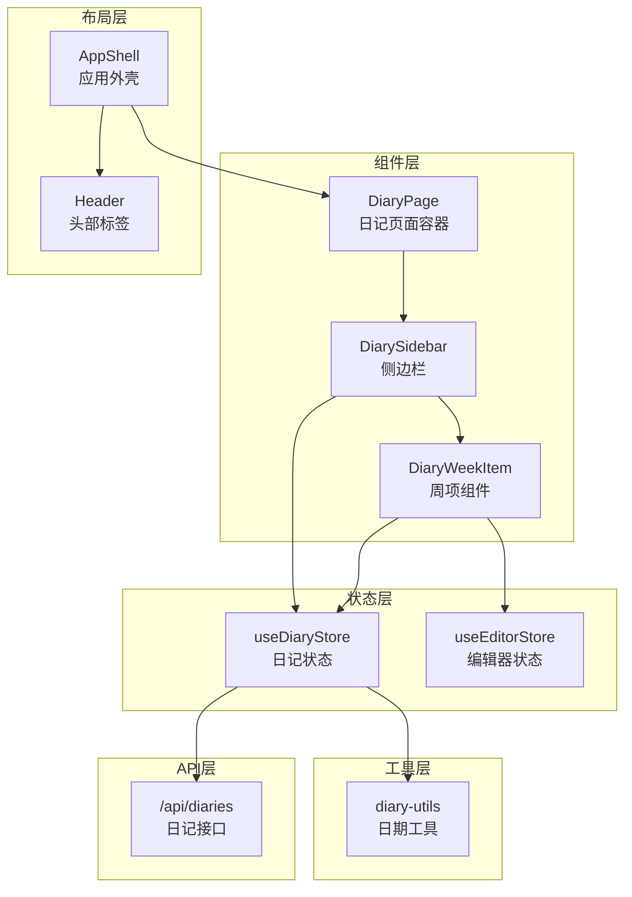
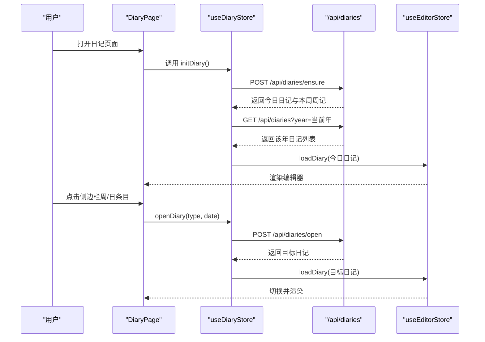
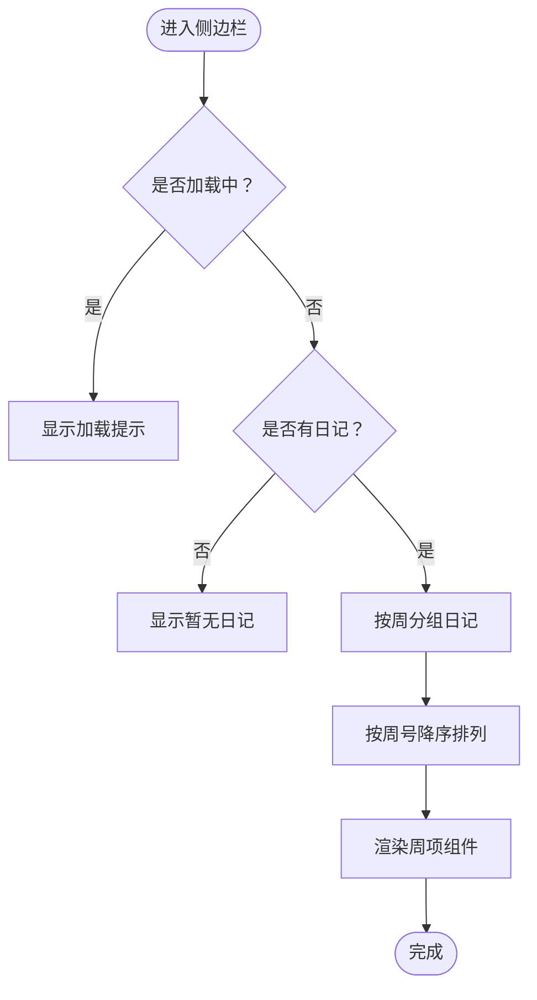
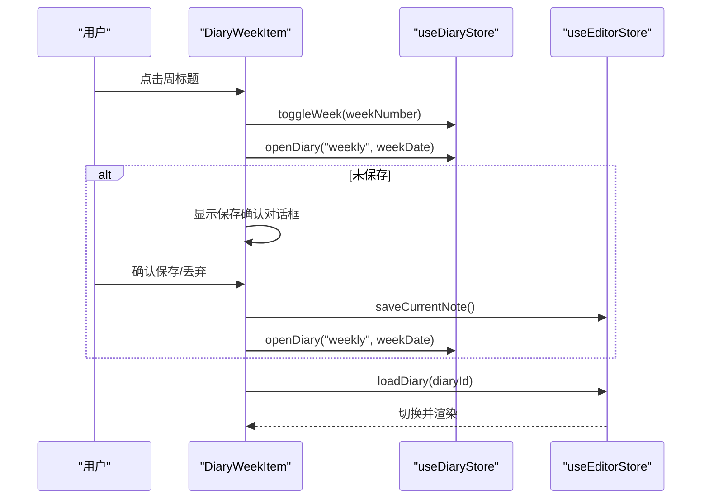
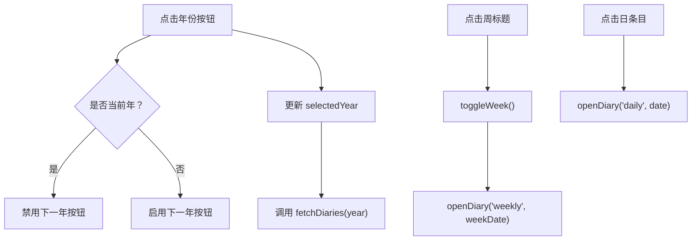
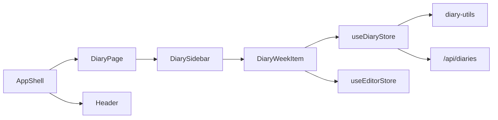

# 日记导航系统

<cite>
**本文档引用的文件**
- [src/components/diary/diary-sidebar.tsx](file://src/components/diary/diary-sidebar.tsx)
- [src/components/diary/diary-week-item.tsx](file://src/components/diary/diary-week-item.tsx)
- [src/components/diary/diary-page.tsx](file://src/components/diary/diary-page.tsx)
- [src/stores/diary-store.ts](file://src/stores/diary-store.ts)
- [src/lib/diary-utils.ts](file://src/lib/diary-utils.ts)
- [src/app/api/diaries/route.ts](file://src/app/api/diaries/route.ts)
- [src/stores/editor-store.ts](file://src/stores/editor-store.ts)
- [src/components/layout/header.tsx](file://src/components/layout/header.tsx)
- [src/components/layout/app-shell.tsx](file://src/components/layout/app-shell.tsx)
- [src/app/layout.tsx](file://src/app/layout.tsx)
- [src/types/index.ts](file://src/types/index.ts)
</cite>

## 目录
1. [简介](#简介)
2. [项目结构](#项目结构)
3. [核心组件](#核心组件)
4. [架构总览](#架构总览)
5. [详细组件分析](#详细组件分析)
6. [依赖关系分析](#依赖关系分析)
7. [性能考虑](#性能考虑)
8. [故障排除指南](#故障排除指南)
9. [结论](#结论)
10. [附录](#附录)

## 简介
本文件为日记导航系统的全面技术文档，重点覆盖以下方面：
- 侧边栏导航：年份选择器与周数列表的实现与交互
- 日期选择器交互设计与用户操作流程
- 日记条目快速跳转：键盘快捷键与鼠标操作
- 导航状态的持久化与恢复机制
- 导航历史记录与书签功能
- 响应式设计与移动端适配
- 性能优化：虚拟滚动与懒加载
- 与其他功能模块（搜索、筛选）的集成
- 可访问性设计与辅助功能

## 项目结构
日记导航系统位于前端组件与状态管理层，采用模块化组织：
- 组件层：日记页面容器、侧边栏、周项组件
- 状态层：日记状态管理（Zustand）、编辑器状态管理
- 工具层：日期工具函数
- API层：日记数据接口
- 布局层：应用外壳与头部标签切换

**图表来源**
- [src/components/diary/diary-page.tsx:1-29](file://src/components/diary/diary-page.tsx#L1-L29)
- [src/components/diary/diary-sidebar.tsx:1-116](file://src/components/diary/diary-sidebar.tsx#L1-L116)
- [src/components/diary/diary-week-item.tsx:1-122](file://src/components/diary/diary-week-item.tsx#L1-L122)
- [src/stores/diary-store.ts:1-234](file://src/stores/diary-store.ts#L1-L234)
- [src/stores/editor-store.ts:1-281](file://src/stores/editor-store.ts#L1-L281)
- [src/lib/diary-utils.ts:1-113](file://src/lib/diary-utils.ts#L1-L113)
- [src/app/api/diaries/route.ts:1-45](file://src/app/api/diaries/route.ts#L1-L45)
- [src/components/layout/app-shell.tsx:1-43](file://src/components/layout/app-shell.tsx#L1-L43)
- [src/components/layout/header.tsx:44-83](file://src/components/layout/header.tsx#L44-L83)

**章节来源**
- [src/components/diary/diary-page.tsx:1-29](file://src/components/diary/diary-page.tsx#L1-L29)
- [src/components/layout/app-shell.tsx:1-43](file://src/components/layout/app-shell.tsx#L1-L43)
- [src/components/layout/header.tsx:44-83](file://src/components/layout/header.tsx#L44-L83)

## 核心组件
- DiaryPage：日记页面容器，负责初始化日记状态并渲染侧边栏与编辑器
- DiarySidebar：侧边栏，包含年份选择器与周数列表，支持展开/折叠
- DiaryWeekItem：周项组件，展示周标题与每日条目，支持点击打开日记
- useDiaryStore：Zustand状态管理，维护选中年份、日记列表、展开周、加载状态等
- useEditorStore：编辑器状态管理，负责内容加载、保存、缓存与切换
- diary-utils：日期工具函数，提供周数计算、标签格式化、当前周判断等
- /api/diaries：后端接口，按年份返回日记元数据并排序

**章节来源**
- [src/components/diary/diary-page.tsx:1-29](file://src/components/diary/diary-page.tsx#L1-L29)
- [src/components/diary/diary-sidebar.tsx:1-116](file://src/components/diary/diary-sidebar.tsx#L1-L116)
- [src/components/diary/diary-week-item.tsx:1-122](file://src/components/diary/diary-week-item.tsx#L1-L122)
- [src/stores/diary-store.ts:1-234](file://src/stores/diary-store.ts#L1-L234)
- [src/stores/editor-store.ts:1-281](file://src/stores/editor-store.ts#L1-L281)
- [src/lib/diary-utils.ts:1-113](file://src/lib/diary-utils.ts#L1-L113)
- [src/app/api/diaries/route.ts:1-45](file://src/app/api/diaries/route.ts#L1-L45)

## 架构总览
日记导航系统采用“组件 + 状态 + 工具 + 接口”的分层架构：
- 组件层负责UI与交互
- 状态层通过Zustand集中管理日记与编辑器状态
- 工具层提供日期与标签格式化能力
- API层提供数据获取与写入能力
- 布局层控制页面整体结构与标签切换

**图表来源**
- [src/components/diary/diary-page.tsx:8-13](file://src/components/diary/diary-page.tsx#L8-L13)
- [src/stores/diary-store.ts:153-185](file://src/stores/diary-store.ts#L153-L185)
- [src/app/api/diaries/route.ts:6-44](file://src/app/api/diaries/route.ts#L6-L44)
- [src/stores/editor-store.ts:157-198](file://src/stores/editor-store.ts#L157-L198)

## 详细组件分析

### 侧边栏导航：年份选择器与周数列表
- 年份选择器
  - 支持上一年与下一年按钮，下一年按钮在当前年份禁用
  - 通过 useDiaryStore 的 prevYear/nextYear 控制年份并触发数据拉取
- 周数列表
  - 将日记按周号分组，每周包含周记与日记条目
  - 当前周显示从周一到今天的完整日期；历史周仅显示有条目的日期
  - 展开/折叠由 expandedWeeks 控制，点击周标题切换
  - 活跃条目高亮显示，今日日期以特殊标记标识

**图表来源**
- [src/components/diary/diary-sidebar.tsx:17-61](file://src/components/diary/diary-sidebar.tsx#L17-L61)
- [src/stores/diary-store.ts:187-232](file://src/stores/diary-store.ts#L187-L232)

**章节来源**
- [src/components/diary/diary-sidebar.tsx:75-93](file://src/components/diary/diary-sidebar.tsx#L75-L93)
- [src/components/diary/diary-sidebar.tsx:95-112](file://src/components/diary/diary-sidebar.tsx#L95-L112)
- [src/stores/diary-store.ts:48-67](file://src/stores/diary-store.ts#L48-L67)

### 周项组件：交互与状态
- 周标题点击
  - 切换周展开状态
  - 打开对应周记（weekly）
- 每日条目点击
  - 打开对应日记（daily）
- 安全操作
  - 若编辑器处于未保存状态，弹出确认对话框，允许保存或丢弃后再执行跳转
- 活跃态与今日态
  - 活跃日记高亮，今日日期带特殊标记

**图表来源**
- [src/components/diary/diary-week-item.tsx:27-46](file://src/components/diary/diary-week-item.tsx#L27-L46)
- [src/stores/diary-store.ts:102-142](file://src/stores/diary-store.ts#L102-L142)
- [src/stores/editor-store.ts:204-275](file://src/stores/editor-store.ts#L204-L275)

**章节来源**
- [src/components/diary/diary-week-item.tsx:38-46](file://src/components/diary/diary-week-item.tsx#L38-L46)
- [src/components/diary/diary-week-item.tsx:70-99](file://src/components/diary/diary-week-item.tsx#L70-L99)

### 日期选择器交互设计与用户操作流程
- 年份选择器
  - 上一年：直接减少年份并刷新数据
  - 下一年：若已为当前年则禁用；否则增加年份并刷新数据
- 周/日点击
  - 自动处理未保存内容的确认流程
  - 成功打开后更新编辑器内容并切换到对应日记
- 当前周特殊处理
  - 仅显示周一至今天的日期，避免未来日期被渲染

**图表来源**
- [src/components/diary/diary-sidebar.tsx:77-92](file://src/components/diary/diary-sidebar.tsx#L77-L92)
- [src/stores/diary-store.ts:53-67](file://src/stores/diary-store.ts#L53-L67)
- [src/stores/diary-store.ts:144-151](file://src/stores/diary-store.ts#L144-L151)
- [src/stores/diary-store.ts:102-142](file://src/stores/diary-store.ts#L102-L142)

**章节来源**
- [src/components/diary/diary-sidebar.tsx:63-63](file://src/components/diary/diary-sidebar.tsx#L63-L63)
- [src/lib/diary-utils.ts:67-91](file://src/lib/diary-utils.ts#L67-L91)

### 日记条目快速跳转：键盘快捷键与鼠标操作
- 鼠标操作
  - 点击周标题：展开/折叠周并打开周记
  - 点击日条目：打开对应日记
- 键盘快捷键
  - 当前实现未提供专用键盘快捷键；可在现有交互基础上扩展（例如使用组合键切换周/日）
- 安全跳转
  - 未保存内容时弹出确认对话框，确保数据安全

**章节来源**
- [src/components/diary/diary-week-item.tsx:27-46](file://src/components/diary/diary-week-item.tsx#L27-L46)
- [src/components/diary/diary-week-item.tsx:102-118](file://src/components/diary/diary-week-item.tsx#L102-L118)

### 导航状态的持久化与恢复机制
- 状态范围
  - 选中年份、展开周集合、日记列表、加载状态等
- 恢复策略
  - 页面初始化时调用 initDiary，自动确保今日与本周日记存在，并加载当前年数据
  - 未保存状态通过编辑器状态管理进行保护，避免跳转丢失
- 数据来源
  - 年度日记列表来自后端接口，按周号降序、日期降序返回

**章节来源**
- [src/stores/diary-store.ts:153-185](file://src/stores/diary-store.ts#L153-L185)
- [src/app/api/diaries/route.ts:20-36](file://src/app/api/diaries/route.ts#L20-L36)

### 导航历史记录与书签功能
- 历史记录
  - 通过点击周/日条目实现“前进”式浏览；当前实现未提供显式的“后退”历史栈
- 书签
  - 未发现专门的书签功能实现
- 建议
  - 可引入浏览器历史API或自建历史栈，支持前进/后退
  - 可在周项组件中添加“收藏/取消收藏”按钮，结合本地存储实现书签

[本节为概念性建议，不直接分析具体文件，故无章节来源]

### 响应式设计与移动端适配
- 布局结构
  - 侧边栏固定宽度，主内容区自适应
  - 应用外壳根据活动标签隐藏/显示对应区域
- 移动端适配
  - 当前结构未见针对移动端的断点调整；建议在小屏设备上将侧边栏改为抽屉式或顶部标签切换
  - 头部标签在小屏下可简化图标与文字

**章节来源**
- [src/components/layout/app-shell.tsx:20-40](file://src/components/layout/app-shell.tsx#L20-L40)
- [src/components/layout/header.tsx:44-83](file://src/components/layout/header.tsx#L44-L83)

### 性能优化：虚拟滚动与懒加载
- 现状
  - 周列表使用普通滚动，未实现虚拟滚动
  - 内容加载采用懒加载：编辑器首次打开时才请求内容，且具备LRU缓存
- 优化建议
  - 对周列表实现虚拟滚动，仅渲染可视区域内的周项
  - 对日条目列表实现懒加载，按需渲染
  - 缓存策略可扩展：支持按周/日维度的独立缓存

**章节来源**
- [src/stores/editor-store.ts:114-198](file://src/stores/editor-store.ts#L114-L198)

### 与其他功能模块的集成
- 头部标签切换
  - 通过 AppShell 控制日记、笔记、想法三个模块的显示/隐藏
- 编辑器集成
  - 打开日记后，编辑器状态管理负责内容加载与保存
- 类型定义
  - DiaryMeta 提供日记元数据结构，用于状态与API交互

**章节来源**
- [src/components/layout/app-shell.tsx:12-40](file://src/components/layout/app-shell.tsx#L12-L40)
- [src/stores/editor-store.ts:157-198](file://src/stores/editor-store.ts#L157-L198)
- [src/types/index.ts:60-74](file://src/types/index.ts#L60-L74)

### 可访问性设计与辅助功能
- 现状
  - 使用语义化HTML与图标，提供基础可访问性
  - 未发现专门的ARIA属性或键盘导航增强
- 建议
  - 为年份按钮、周标题、日条目添加 aria-label
  - 支持键盘导航：Tab切换、Enter激活
  - 为加载状态提供屏幕阅读器提示

[本节为概念性建议，不直接分析具体文件，故无章节来源]

## 依赖关系分析
- 组件依赖
  - DiaryPage 依赖 DiarySidebar
  - DiarySidebar 依赖 DiaryWeekItem 与 useDiaryStore
  - DiaryWeekItem 依赖 useDiaryStore 与 useEditorStore
- 状态依赖
  - useDiaryStore 依赖 diary-utils 与 API 接口
  - useEditorStore 依赖 LRU 缓存与序列化器
- 布局依赖
  - AppShell 控制日记模块的可见性
  - Header 提供标签切换

**图表来源**
- [src/components/diary/diary-page.tsx:3-19](file://src/components/diary/diary-page.tsx#L3-L19)
- [src/components/diary/diary-sidebar.tsx:4-6](file://src/components/diary/diary-sidebar.tsx#L4-L6)
- [src/components/diary/diary-week-item.tsx:10-13](file://src/components/diary/diary-week-item.tsx#L10-L13)
- [src/stores/diary-store.ts:1-10](file://src/stores/diary-store.ts#L1-L10)
- [src/stores/editor-store.ts:1-3](file://src/stores/editor-store.ts#L1-L3)
- [src/components/layout/app-shell.tsx:7](file://src/components/layout/app-shell.tsx#L7)
- [src/components/layout/header.tsx:60](file://src/components/layout/header.tsx#L60)

**章节来源**
- [src/stores/diary-store.ts:1-10](file://src/stores/diary-store.ts#L1-L10)
- [src/stores/editor-store.ts:1-3](file://src/stores/editor-store.ts#L1-L3)

## 性能考虑
- 状态计算缓存
  - 使用 useMemo 缓存周分组结果，避免重复计算
- 数据获取
  - 年度日记列表按周号降序、日期降序返回，便于前端高效渲染
- 编辑器缓存
  - LRU 缓存最近编辑的内容，减少重复请求
- 建议
  - 对周列表实现虚拟滚动，降低DOM节点数量
  - 对日条目实现懒加载，提升首屏性能

**章节来源**
- [src/components/diary/diary-sidebar.tsx:17-61](file://src/components/diary/diary-sidebar.tsx#L17-L61)
- [src/app/api/diaries/route.ts:30-36](file://src/app/api/diaries/route.ts#L30-L36)
- [src/stores/editor-store.ts:66-77](file://src/stores/editor-store.ts#L66-L77)

## 故障排除指南
- 初始化失败
  - 检查 initDiary 是否正确调用 ensureToday 与 fetchDiaries
  - 查看控制台错误日志，确认网络请求状态码
- 打开日记失败
  - 确认 /api/diaries/open 返回有效日记对象
  - 检查编辑器状态是否成功切换
- 加载异常
  - 年度接口参数 year 缺失或无效时会返回 400
  - 建议在前端校验 year 参数并在异常时提示用户

**章节来源**
- [src/stores/diary-store.ts:153-185](file://src/stores/diary-store.ts#L153-L185)
- [src/app/api/diaries/route.ts:9-16](file://src/app/api/diaries/route.ts#L9-L16)

## 结论
日记导航系统通过清晰的组件分层与状态管理，实现了年份选择、周/日跳转、内容加载与保存等核心功能。当前实现注重可用性与性能，具备良好的扩展空间。建议后续引入历史栈、书签、虚拟滚动与更完善的可访问性支持，以进一步提升用户体验。

## 附录
- API端点
  - GET /api/diaries?year={year}：按年份返回日记列表
  - POST /api/diaries/ensure：确保今日与本周日记存在
  - POST /api/diaries/open：打开指定类型与日期的日记
- 关键类型
  - DiaryMeta：日记元数据（不含内容）
  - DiaryEntry：日记实体（含内容）

**章节来源**
- [src/app/api/diaries/route.ts:6-44](file://src/app/api/diaries/route.ts#L6-L44)
- [src/types/index.ts:60-74](file://src/types/index.ts#L60-L74)