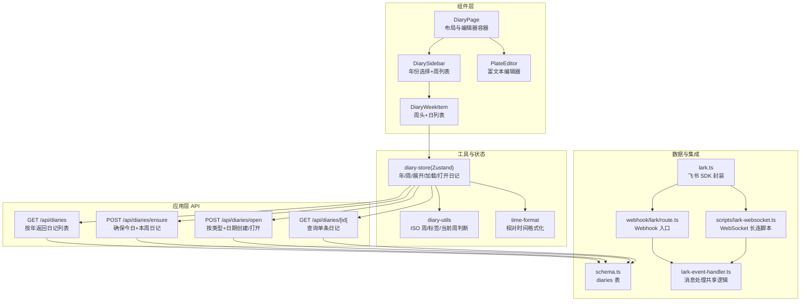
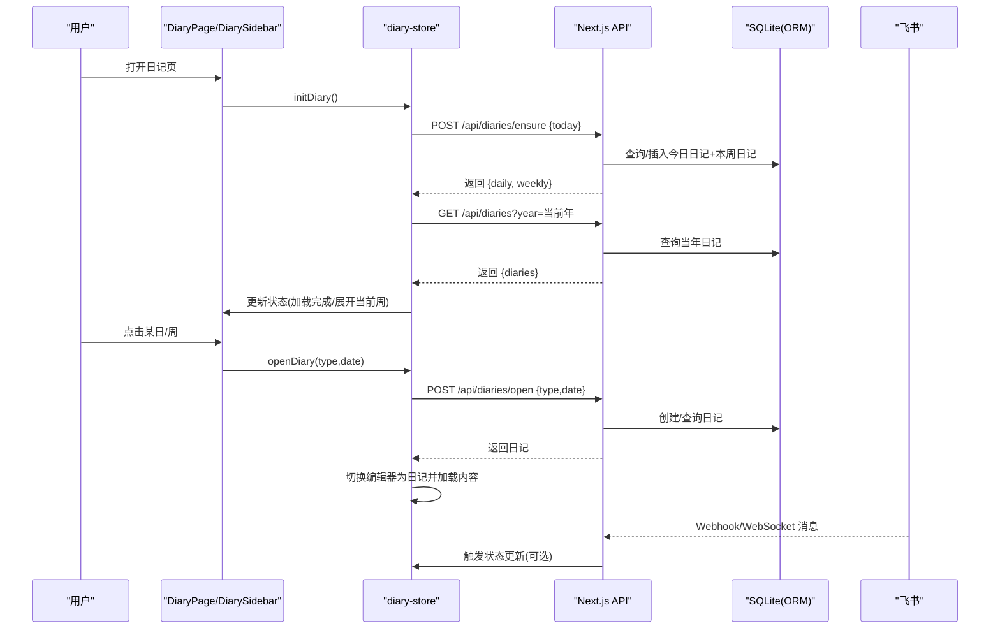
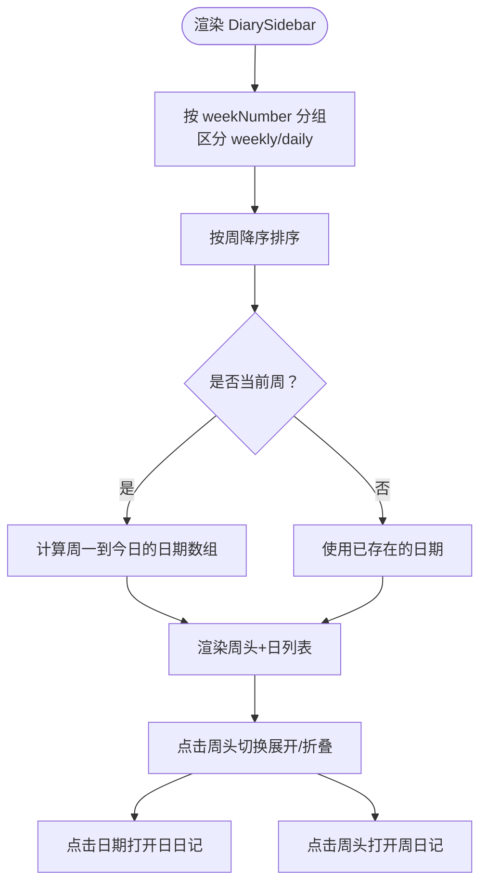
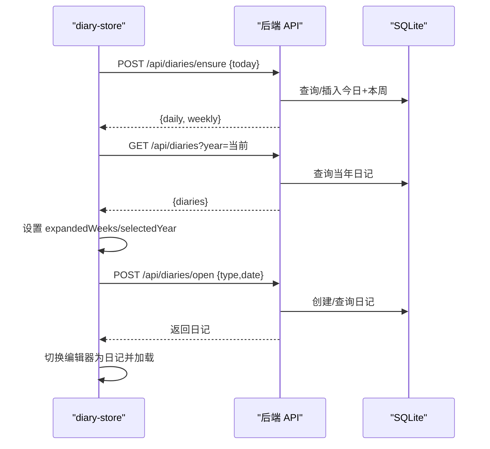
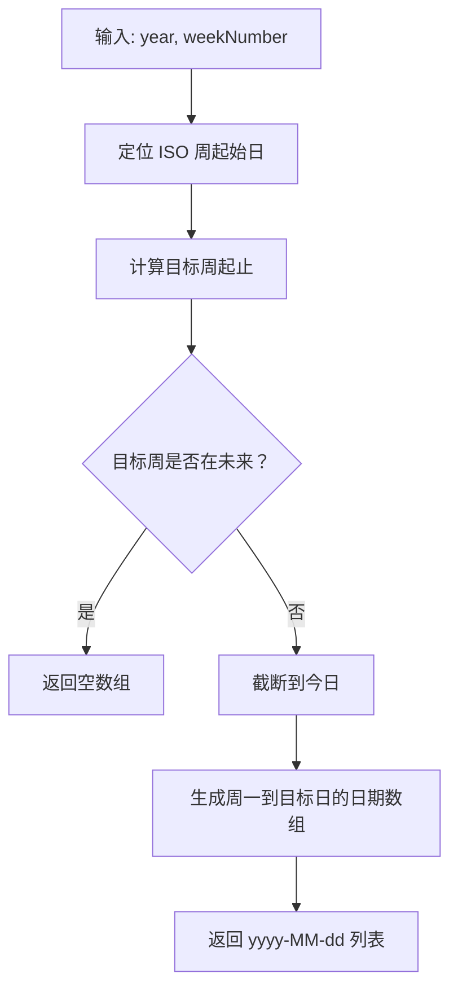
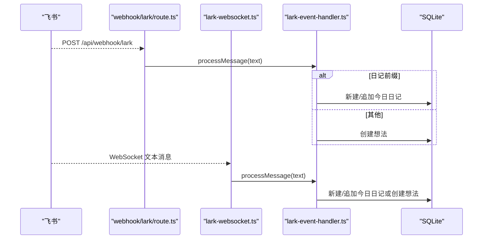
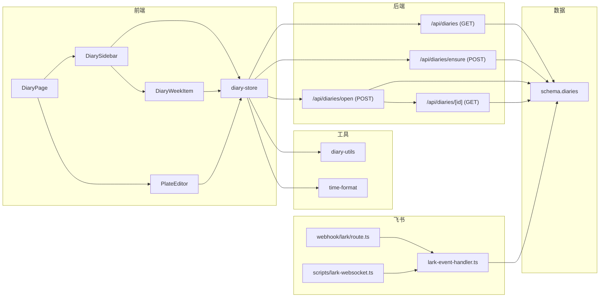

# 日记系统

<cite>
**本文引用的文件**
- [README.md](file://README.md)
- [diaries 路由（列表）](file://src/app/api/diaries/route.ts)
- [日记条目路由（单个）](file://src/app/api/diaries/[id]/route.ts)
- [日记确保路由（创建今日与本周）](file://src/app/api/diaries/ensure/route.ts)
- [日记打开路由（按类型与日期创建）](file://src/app/api/diaries/open/route.ts)
- [日记工具函数](file://src/lib/diary-utils.ts)
- [时间格式化工具](file://src/lib/time-format.ts)
- [日记页面组件](file://src/components/diary/diary-page.tsx)
- [日记侧边栏组件](file://src/components/diary/diary-sidebar.tsx)
- [日记周项组件](file://src/components/diary/diary-week-item.tsx)
- [日记状态存储（Zustand）](file://src/stores/diary-store.ts)
- [数据库模式（含日记表）](file://src/db/schema.ts)
- [类型定义（日记元数据）](file://src/types/index.ts)
- [飞书客户端封装](file://src/lib/lark.ts)
- [飞书 Webhook 处理器](file://src/app/api/webhook/lark/route.ts)
- [飞书事件处理器（共享）](file://src/lib/lark-event-handler.ts)
- [飞书 WebSocket 客户端脚本](file://scripts/lark-websocket.ts)
- [富文本编辑器组件](file://src/components/editor/plate-editor.tsx)
</cite>

## 目录
1. [简介](#简介)
2. [项目结构](#项目结构)
3. [核心组件](#核心组件)
4. [架构总览](#架构总览)
5. [详细组件分析](#详细组件分析)
6. [依赖关系分析](#依赖关系分析)
7. [性能考虑](#性能考虑)
8. [故障排查指南](#故障排查指南)
9. [结论](#结论)
10. [附录](#附录)

## 简介
本系统围绕“日记”这一核心功能构建，提供每日日记与每周总结的完整工作流：自动确保今日与本周的日记条目存在、侧边栏按 ISO 周组织展示、支持按日/周打开编辑、通过富文本编辑器进行创作，并提供与飞书（Lark/Feishu）的双向集成（Webhook/WebSocket）。系统还包含时间工具函数、相对时间格式化、以及基于 Zustand 的状态管理。

## 项目结构
- 应用层 API：提供日记的 CRUD 与辅助接口（列表、确保、打开、查询单条）
- 组件层：日记页面、侧边栏、周项、富文本编辑器
- 工具层：日期与周计算、时间格式化、飞书 SDK 封装与事件处理
- 状态层：Zustand 日记状态存储，负责年份切换、加载、展开/折叠、打开日记等
- 数据层：Drizzle ORM + SQLite，日记表包含类型、日期、ISO 年/周、字数、内容等字段

图表来源
- [日记页面组件:1-29](file://src/components/diary/diary-page.tsx#L1-L29)
- [日记侧边栏组件:1-116](file://src/components/diary/diary-sidebar.tsx#L1-L116)
- [日记周项组件:1-122](file://src/components/diary/diary-week-item.tsx#L1-L122)
- [日记状态存储（Zustand）:1-234](file://src/stores/diary-store.ts#L1-L234)
- [日记工具函数:1-113](file://src/lib/diary-utils.ts#L1-L113)
- [时间格式化工具:1-27](file://src/lib/time-format.ts#L1-L27)
- [日记条目路由（单个）:1-63](file://src/app/api/diaries/[id]/route.ts#L1-L63)
- [日记确保路由（创建今日与本周）:1-127](file://src/app/api/diaries/ensure/route.ts#L1-L127)
- [日记打开路由（按类型与日期创建）:1-130](file://src/app/api/diaries/open/route.ts#L1-L130)
- [数据库模式（含日记表）:93-104](file://src/db/schema.ts#L93-L104)
- [飞书 Webhook 处理器:1-106](file://src/app/api/webhook/lark/route.ts#L1-L106)
- [飞书事件处理器（共享）:1-126](file://src/lib/lark-event-handler.ts#L1-L126)
- [飞书客户端封装:1-96](file://src/lib/lark.ts#L1-L96)
- [飞书 WebSocket 客户端脚本:1-109](file://scripts/lark-websocket.ts#L1-L109)

章节来源
- [README.md:1-37](file://README.md#L1-L37)
- [diaries 路由（列表）:1-45](file://src/app/api/diaries/route.ts#L1-L45)
- [日记状态存储（Zustand）:1-234](file://src/stores/diary-store.ts#L1-L234)

## 核心组件
- 日记侧边栏：按 ISO 周分组展示，支持年份上下翻页、当前周高亮、展开/折叠、按日打开
- 日记周项：周头点击打开周记；展开后显示当周从周一到今日的所有日期，支持今日标记
- 日记状态存储：负责初始化、确保今日与本周条目、拉取当年日记、打开指定日记、切换年份
- 时间工具：ISO 周字符串生成、周标签、日标签、星期标签、周内天数（至今日）、是否当前周/今天、当前周年与周号
- 相对时间格式化：秒/分钟/小时/天前，跨年显示具体日期时间
- 飞书集成：Webhook 与 WebSocket 双通道接收消息，按前缀路由到日记或想法处理

章节来源
- [日记侧边栏组件:1-116](file://src/components/diary/diary-sidebar.tsx#L1-L116)
- [日记周项组件:1-122](file://src/components/diary/diary-week-item.tsx#L1-L122)
- [日记状态存储（Zustand）:1-234](file://src/stores/diary-store.ts#L1-L234)
- [日记工具函数:1-113](file://src/lib/diary-utils.ts#L1-L113)
- [时间格式化工具:1-27](file://src/lib/time-format.ts#L1-L27)
- [飞书 Webhook 处理器:1-106](file://src/app/api/webhook/lark/route.ts#L1-L106)
- [飞书事件处理器（共享）:1-126](file://src/lib/lark-event-handler.ts#L1-L126)

## 架构总览
系统采用“前端组件 + Zustand 状态 + 后端 API + 数据库”的分层设计。前端通过 API 进行日记的创建、打开与查询；后端使用 Drizzle ORM 访问 SQLite；时间与周计算由 date-fns 提供；飞书通过 Webhook 或 WebSocket 接入，统一走共享事件处理器。

图表来源
- [日记状态存储（Zustand）:153-185](file://src/stores/diary-store.ts#L153-L185)
- [日记确保路由（创建今日与本周）:8-127](file://src/app/api/diaries/ensure/route.ts#L8-L127)
- [diaries 路由（列表）:6-45](file://src/app/api/diaries/route.ts#L6-L45)
- [日记打开路由（按类型与日期创建）:14-130](file://src/app/api/diaries/open/route.ts#L14-L130)
- [飞书 Webhook 处理器:28-106](file://src/app/api/webhook/lark/route.ts#L28-L106)

## 详细组件分析

### 日记侧边栏与周视图
- 功能要点
  - 年份选择：上一年/下一年按钮，禁用未来年份
  - 分组：按 weekNumber 分组，区分 weekly 与 daily 条目
  - 当前周：根据 selectedYear 与当前 ISO 周高亮；展开时显示周一到今日的全部日期
  - 历史周：仅显示已有条目的日期
  - 展开/折叠：记忆 expandedWeeks，点击周头切换
- 性能与交互
  - 使用 useMemo 缓存分组结果，避免重复计算
  - 点击日/周时先检查编辑器保存状态，必要时弹出确认对话框

图表来源
- [日记侧边栏组件:18-61](file://src/components/diary/diary-sidebar.tsx#L18-L61)
- [日记周项组件:38-46](file://src/components/diary/diary-week-item.tsx#L38-L46)

章节来源
- [日记侧边栏组件:1-116](file://src/components/diary/diary-sidebar.tsx#L1-L116)
- [日记周项组件:1-122](file://src/components/diary/diary-week-item.tsx#L1-L122)

### 日记状态存储（Zustand）
- 初始化流程
  - 调用 ensureToday，确保今日与本周日记存在
  - 拉取当前年份所有日记
  - 展开当前周，自动打开今日日日记
- 关键动作
  - 年份切换：prevYear/nextYear/setSelectedYear
  - 打开日记：openDiary(type,date)，内部处理去重与编辑器切换
  - 确保今日：ensureToday，返回今日与本周条目
  - 获取周分组：getWeekGroups，用于 UI 渲染

图表来源
- [日记状态存储（Zustand）:153-185](file://src/stores/diary-store.ts#L153-L185)
- [日记确保路由（创建今日与本周）:8-127](file://src/app/api/diaries/ensure/route.ts#L8-L127)
- [diaries 路由（列表）:6-45](file://src/app/api/diaries/route.ts#L6-L45)
- [日记打开路由（按类型与日期创建）:14-130](file://src/app/api/diaries/open/route.ts#L14-L130)

章节来源
- [日记状态存储（Zustand）:1-234](file://src/stores/diary-store.ts#L1-L234)

### 日记工具函数与时间处理
- ISO 周与标签
  - 生成 ISO 周字符串（如 2026-W12）
  - 生成周标签（第 N 周）
  - 生成日/星期标签（中文）
- 周内天数
  - 计算给定 ISO 周（年+周号）的周一到周日，若为未来周则返回空数组；若在当前周，则限制到今日
- 当前周判断与今日判断
  - isCurrentWeek/isToday
  - getCurrentISOWeekYear/getCurrentISOWeek

图表来源
- [日记工具函数:67-91](file://src/lib/diary-utils.ts#L67-L91)

章节来源
- [日记工具函数:1-113](file://src/lib/diary-utils.ts#L1-L113)

### 飞书同步与消息处理
- Webhook 模式
  - URL 校验、验证令牌、去重（5 分钟 TTL）、仅处理 im.message.receive_v1 文本消息
  - 解析消息内容，按前缀路由到日记或想法处理
- WebSocket 模式
  - 独立脚本启动长连接，事件分发器仅处理文本消息，支持白名单用户过滤
- 共享处理器
  - handleDiaryMessage：今日日记不存在则新建，存在则追加段落，更新 markdown 与字数
  - handleIdeaMessage：创建想法
  - processMessage：按前缀路由

图表来源
- [飞书 Webhook 处理器:28-106](file://src/app/api/webhook/lark/route.ts#L28-L106)
- [飞书事件处理器（共享）:104-126](file://src/lib/lark-event-handler.ts#L104-L126)
- [飞书 WebSocket 客户端脚本:1-109](file://scripts/lark-websocket.ts#L1-L109)

章节来源
- [飞书 Webhook 处理器:1-106](file://src/app/api/webhook/lark/route.ts#L1-L106)
- [飞书事件处理器（共享）:1-126](file://src/lib/lark-event-handler.ts#L1-L126)
- [飞书客户端封装:1-96](file://src/lib/lark.ts#L1-L96)
- [飞书 WebSocket 客户端脚本:1-109](file://scripts/lark-websocket.ts#L1-L109)

### 富文本编辑器与保存状态
- 编辑器
  - 使用 PlateJS + 自定义 EditorKit，支持插件化扩展
  - 快速比较编辑值变化，避免不必要的序列化与保存
- 保存状态
  - 未保存、保存中、已保存、错误
  - 与日记状态联动，打开新日记时清空历史并滚动到顶部

章节来源
- [富文本编辑器组件:1-175](file://src/components/editor/plate-editor.tsx#L1-L175)
- [日记状态存储（Zustand）:102-142](file://src/stores/diary-store.ts#L102-L142)

## 依赖关系分析

图表来源
- [日记页面组件:1-29](file://src/components/diary/diary-page.tsx#L1-L29)
- [日记侧边栏组件:1-116](file://src/components/diary/diary-sidebar.tsx#L1-L116)
- [日记周项组件:1-122](file://src/components/diary/diary-week-item.tsx#L1-L122)
- [日记状态存储（Zustand）:1-234](file://src/stores/diary-store.ts#L1-L234)
- [日记工具函数:1-113](file://src/lib/diary-utils.ts#L1-L113)
- [时间格式化工具:1-27](file://src/lib/time-format.ts#L1-L27)
- [diaries 路由（列表）:1-45](file://src/app/api/diaries/route.ts#L1-L45)
- [日记确保路由（创建今日与本周）:1-127](file://src/app/api/diaries/ensure/route.ts#L1-L127)
- [日记打开路由（按类型与日期创建）:1-130](file://src/app/api/diaries/open/route.ts#L1-L130)
- [日记条目路由（单个）:1-63](file://src/app/api/diaries/[id]/route.ts#L1-L63)
- [数据库模式（含日记表）:93-104](file://src/db/schema.ts#L93-L104)
- [飞书 Webhook 处理器:1-106](file://src/app/api/webhook/lark/route.ts#L1-L106)
- [飞书事件处理器（共享）:1-126](file://src/lib/lark-event-handler.ts#L1-L126)
- [飞书 WebSocket 客户端脚本:1-109](file://scripts/lark-websocket.ts#L1-L109)

章节来源
- [日记状态存储（Zustand）:1-234](file://src/stores/diary-store.ts#L1-L234)
- [数据库模式（含日记表）:93-104](file://src/db/schema.ts#L93-L104)

## 性能考虑
- 前端
  - 使用 useMemo 缓存周分组与日期集合，减少渲染成本
  - 快速比较编辑值差异，避免频繁序列化与保存
  - 编辑器切换时清空历史与选区，防止跨笔记状态污染
- 后端
  - 列表查询按 weekNumber、type、date 排序，便于前端直接消费
  - Webhook/WebSocket 去重（5 分钟），降低重复处理风险
- 存储
  - 日记表包含 year、weekNumber、wordCount 等字段，便于快速聚合与统计

## 故障排查指南
- Webhook/WebSocket 未生效
  - 检查环境变量：LARK_APP_ID、LARK_APP_SECRET、LARK_VERIFICATION_TOKEN、LARK_ALLOWED_USER_IDS、LARK_ENCRYPT_KEY、LARK_EVENT_MODE
  - Webhook：确认平台回调地址与验证通过；WebSocket：确认独立进程运行且未被 SIGINT/SIGTERM 中断
- 无法打开未来日期/周的日记
  - open 接口会校验日期不得晚于今日；周格式需为 YYYY-Www，且不得晚于当前周
- 重复事件
  - Webhook 使用内存去重（5 分钟），重启后失效；建议配合外部去重或幂等写入
- 保存冲突
  - 打开新日记前检查编辑器保存状态，必要时提示保存或丢弃

章节来源
- [日记打开路由（按类型与日期创建）:14-73](file://src/app/api/diaries/open/route.ts#L14-L73)
- [飞书 Webhook 处理器:28-106](file://src/app/api/webhook/lark/route.ts#L28-L106)
- [日记周项组件:27-36](file://src/components/diary/diary-week-item.tsx#L27-L36)

## 结论
该日记系统以 ISO 周为核心组织方式，结合自动确保、侧边栏周视图与富文本编辑器，提供了流畅的日常记录体验。通过飞书 Webhook/WebSocket 实现即时同步，满足多场景输入需求。状态管理与工具函数清晰分离，具备良好的可维护性与扩展性。

## 附录

### API 接口规范
- 获取日记列表
  - 方法：GET
  - 路径：/api/diaries
  - 查询参数：year（必填，数字）
  - 成功响应：{ diaries: 数组 }
  - 错误：400（缺少 year）、500（内部错误）
- 查询单条日记
  - 方法：GET
  - 路径：/api/diaries/[id]
  - 成功响应：日记对象
  - 错误：404（不存在）、500（内部错误）
- 确保今日与本周日记
  - 方法：POST
  - 路径：/api/diaries/ensure
  - 请求体：{ today: "YYYY-MM-DD" }
  - 成功响应：{ daily, weekly }
  - 错误：400（参数无效）、500（内部错误）
- 打开/创建日记（按类型与日期）
  - 方法：POST
  - 路径：/api/diaries/open
  - 请求体：{ type: "daily|weekly", date: "YYYY-MM-DD|YYYY-Www" }
  - 成功响应：日记对象（201 若新建）
  - 错误：400（参数无效/未来日期/未来周）、500（内部错误）
- 更新日记
  - 方法：PATCH
  - 路径：/api/diaries/[id]
  - 请求体：{ content?: string, markdown?: string, wordCount?: number }
  - 成功响应：更新后的日记对象
  - 错误：404（不存在）、500（内部错误）

章节来源
- [diaries 路由（列表）:6-45](file://src/app/api/diaries/route.ts#L6-L45)
- [日记条目路由（单个）:6-63](file://src/app/api/diaries/[id]/route.ts#L6-L63)
- [日记确保路由（创建今日与本周）:8-127](file://src/app/api/diaries/ensure/route.ts#L8-L127)
- [日记打开路由（按类型与日期创建）:14-130](file://src/app/api/diaries/open/route.ts#L14-L130)

### 数据模型与元数据
- 日记表（schema.diaries）
  - 字段：id、type、date、year、weekNumber、content、markdown、wordCount、createdAt、updatedAt
  - 约束：type 为 'daily' 或 'weekly'；date 对应 'YYYY-MM-DD' 或 'YYYY-Www'

章节来源
- [数据库模式（含日记表）:93-104](file://src/db/schema.ts#L93-L104)
- [类型定义（日记元数据）:60-74](file://src/types/index.ts#L60-L74)

### 模板与格式化选项
- 日记模板
  - 默认为空内容，首次打开即创建；周记默认以 ISO 周标识
- 格式化选项
  - 侧边栏：周标签（第 N 周）、日标签（月日）、星期标签（中文）
  - 时间：相对时间（秒/分钟/小时/天前）、绝对时间（跨年显示）

章节来源
- [日记工具函数:31-60](file://src/lib/diary-utils.ts#L31-L60)
- [时间格式化工具:1-27](file://src/lib/time-format.ts#L1-L27)

### 用户体验优化建议
- 预加载：初始化时提前确保今日与本周条目，减少首屏等待
- 滚动同步：打开新日记时滚动到顶部，避免旧内容影响阅读
- 保存提示：未保存时禁止切换日记，避免内容丢失
- 历史周优化：仅渲染已有条目的日期，减少 DOM 节点

章节来源
- [日记状态存储（Zustand）:153-185](file://src/stores/diary-store.ts#L153-L185)
- [日记周项组件:27-36](file://src/components/diary/diary-week-item.tsx#L27-L36)
- [富文本编辑器组件:102-136](file://src/components/editor/plate-editor.tsx#L102-L136)

### 数据备份策略
- 建议定期导出 SQLite 文件作为快照
- 在生产环境启用只读副本与增量备份
- 对于飞书消息，建议保留事件 ID 与去重窗口，便于审计与重放

[本节为通用建议，无需特定文件引用]