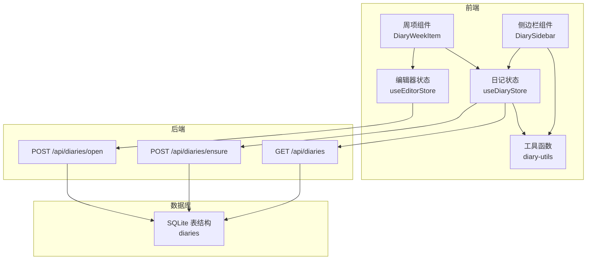
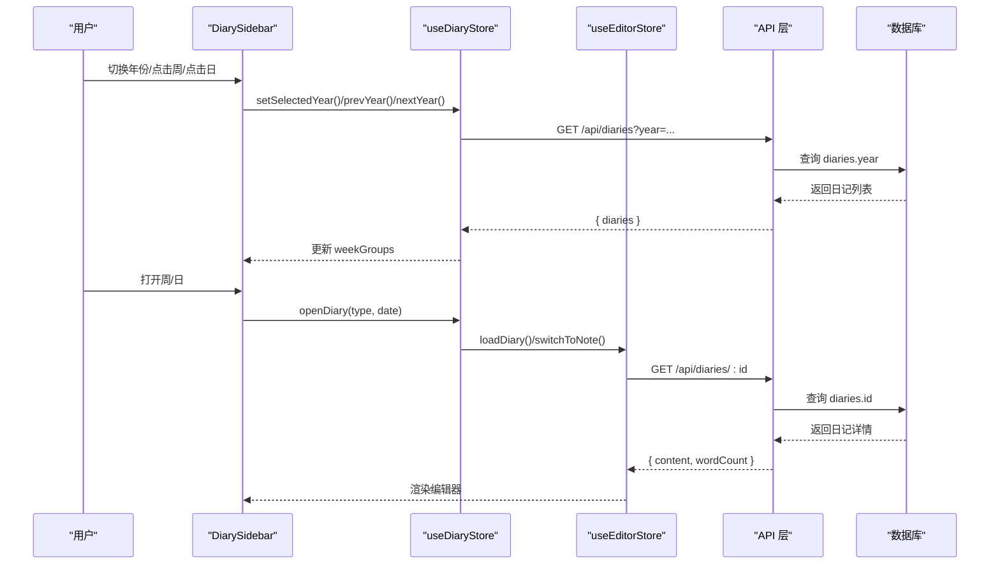
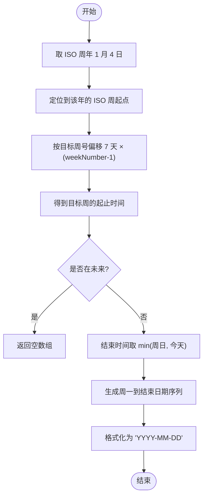
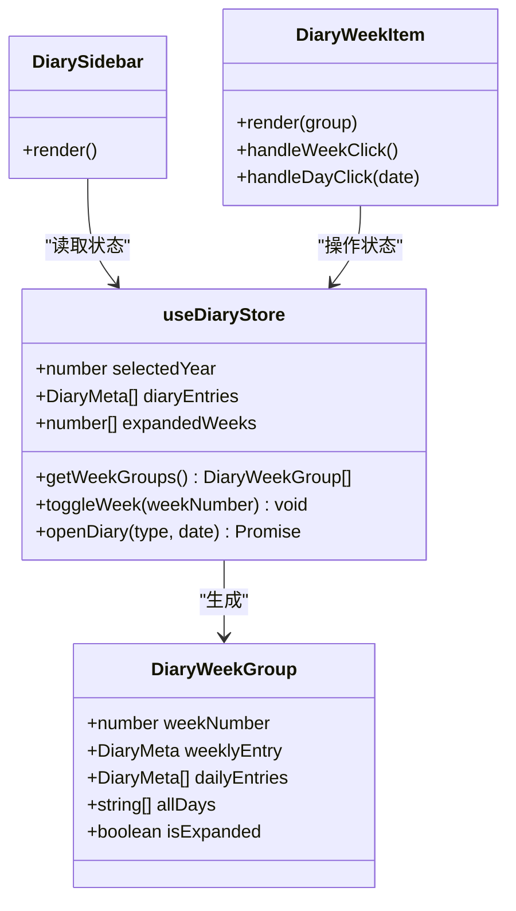
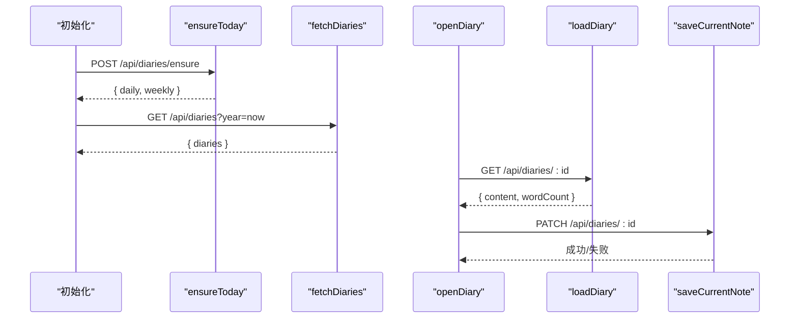
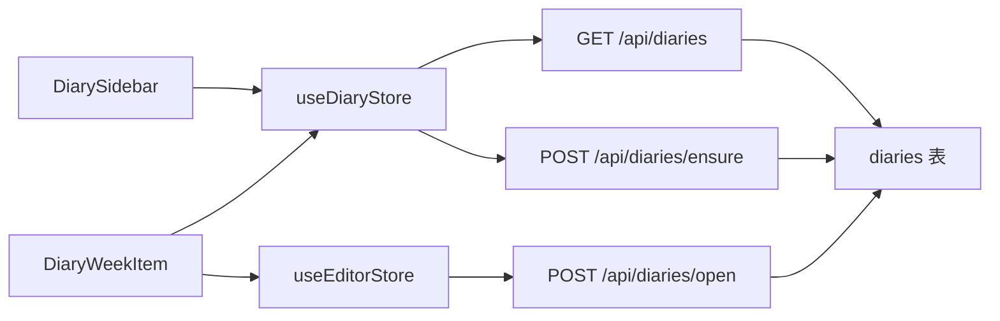
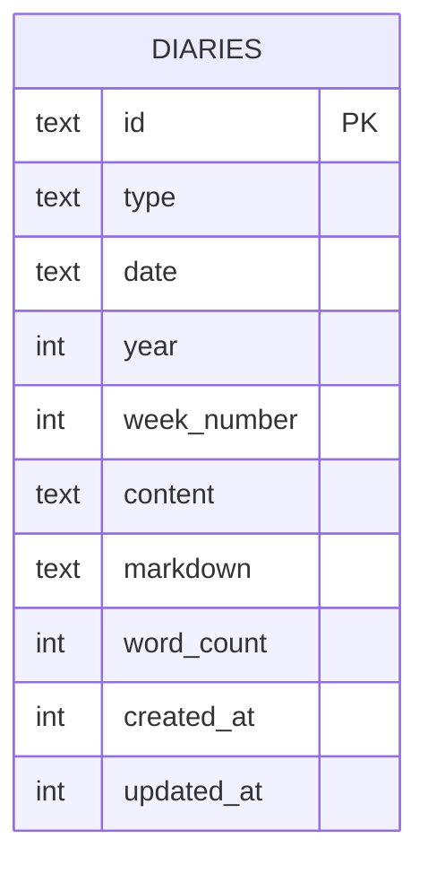

# 每周总结系统

<cite>
**本文引用的文件**
- [src/stores/diary-store.ts](file://src/stores/diary-store.ts)
- [src/components/diary/diary-sidebar.tsx](file://src/components/diary/diary-sidebar.tsx)
- [src/components/diary/diary-week-item.tsx](file://src/components/diary/diary-week-item.tsx)
- [src/lib/diary-utils.ts](file://src/lib/diary-utils.ts)
- [src/app/api/diaries/route.ts](file://src/app/api/diaries/route.ts)
- [src/app/api/diaries/ensure/route.ts](file://src/app/api/diaries/ensure/route.ts)
- [src/app/api/diaries/open/route.ts](file://src/app/api/diaries/open/route.ts)
- [src/db/schema.ts](file://src/db/schema.ts)
- [src/stores/editor-store.ts](file://src/stores/editor-store.ts)
- [src/hooks/use-mobile.ts](file://src/hooks/use-mobile.ts)
- [src/hooks/use-is-touch-device.ts](file://src/hooks/use-is-touch-device.ts)
- [src/components/layout/app-shell.tsx](file://src/components/layout/app-shell.tsx)
- [src/app/layout.tsx](file://src/app/layout.tsx)
- [src/app/globals.css](file://src/app/globals.css)
</cite>

## 目录
1. [简介](#简介)
2. [项目结构](#项目结构)
3. [核心组件](#核心组件)
4. [架构总览](#架构总览)
5. [详细组件分析](#详细组件分析)
6. [依赖关系分析](#依赖关系分析)
7. [性能考量](#性能考量)
8. [故障排查指南](#故障排查指南)
9. [结论](#结论)
10. [附录](#附录)

## 简介
本文件面向“每周总结系统”，围绕以下目标进行系统化文档化：
- ISO 周计算算法与周数生成逻辑
- 周视图的数据结构与展示方式
- 按周聚合的日记条目处理流程
- 周总结的统计信息（字数统计与内容分析）
- 周导航功能（上一周、下一周）
- 周视图的筛选与排序选项
- 周数据的缓存策略与性能优化
- 年份选择器联动机制
- 周视图的响应式设计与移动端适配

## 项目结构
该系统采用前端状态管理 + 后端 API 的分层架构：
- 前端使用 Zustand 管理日记与编辑器状态，组件负责渲染与交互
- 工具函数封装 ISO 周计算与本地化标签
- 后端通过 Next.js 路由提供日记列表、确保今日与本周存在、打开日记等接口
- 数据库存储在 SQLite 中，使用 Drizzle ORM 映射

图表来源
- [src/components/diary/diary-sidebar.tsx:1-115](file://src/components/diary/diary-sidebar.tsx#L1-L115)
- [src/components/diary/diary-week-item.tsx:1-122](file://src/components/diary/diary-week-item.tsx#L1-L122)
- [src/stores/diary-store.ts:1-233](file://src/stores/diary-store.ts#L1-L233)
- [src/stores/editor-store.ts:1-281](file://src/stores/editor-store.ts#L1-L281)
- [src/lib/diary-utils.ts:1-112](file://src/lib/diary-utils.ts#L1-L112)
- [src/app/api/diaries/route.ts:1-45](file://src/app/api/diaries/route.ts#L1-L45)
- [src/app/api/diaries/ensure/route.ts:1-126](file://src/app/api/diaries/ensure/route.ts#L1-L126)
- [src/app/api/diaries/open/route.ts:1-33](file://src/app/api/diaries/open/route.ts#L1-L33)
- [src/db/schema.ts:93-105](file://src/db/schema.ts#L93-L105)

章节来源
- [src/components/layout/app-shell.tsx:1-43](file://src/components/layout/app-shell.tsx#L1-L43)
- [src/app/layout.tsx:1-38](file://src/app/layout.tsx#L1-L38)
- [src/app/globals.css:1-200](file://src/app/globals.css#L1-L200)

## 核心组件
- 日记状态管理：负责年份选择、周分组、展开状态、加载与初始化
- 周视图组件：渲染年份选择器、周列表、每日条目，并处理点击与保存确认
- 工具函数：ISO 周计算、周内日期生成、标签格式化、当前周判断
- 编辑器状态：内容缓存、手动保存、字数统计、序列化
- API 接口：日记列表、确保今日与本周存在、打开日记

章节来源
- [src/stores/diary-store.ts:1-233](file://src/stores/diary-store.ts#L1-L233)
- [src/components/diary/diary-sidebar.tsx:1-115](file://src/components/diary/diary-sidebar.tsx#L1-L115)
- [src/components/diary/diary-week-item.tsx:1-122](file://src/components/diary/diary-week-item.tsx#L1-L122)
- [src/lib/diary-utils.ts:1-112](file://src/lib/diary-utils.ts#L1-L112)
- [src/stores/editor-store.ts:1-281](file://src/stores/editor-store.ts#L1-L281)
- [src/app/api/diaries/route.ts:1-45](file://src/app/api/diaries/route.ts#L1-L45)
- [src/app/api/diaries/ensure/route.ts:1-126](file://src/app/api/diaries/ensure/route.ts#L1-L126)
- [src/app/api/diaries/open/route.ts:1-33](file://src/app/api/diaries/open/route.ts#L1-L33)

## 架构总览
系统以“周”为中心组织数据，前端通过状态管理与工具函数完成周分组与展示，后端提供持久化与检索能力。

图表来源
- [src/components/diary/diary-sidebar.tsx:1-115](file://src/components/diary/diary-sidebar.tsx#L1-L115)
- [src/stores/diary-store.ts:48-100](file://src/stores/diary-store.ts#L48-L100)
- [src/stores/editor-store.ts:157-198](file://src/stores/editor-store.ts#L157-L198)
- [src/app/api/diaries/route.ts:1-45](file://src/app/api/diaries/route.ts#L1-L45)
- [src/app/api/diaries/open/route.ts:1-33](file://src/app/api/diaries/open/route.ts#L1-L33)
- [src/db/schema.ts:93-105](file://src/db/schema.ts#L93-L105)

## 详细组件分析

### ISO 周计算与周数生成
- 使用 ISO 周标准：ISO 周起源于包含当年 1 月 4 日的那一周；通过“ISO 周年 + ISO 周号”唯一标识一周
- 关键实现要点
  - 计算给定年份的 ISO 周范围：从该 ISO 周年的 1 月 4 日出发，定位到该年的第一个 ISO 周，再偏移至目标周
  - 当前周判断：比较当前日期的 ISO 周年与周号
  - 当前周显示策略：仅展示从周一到“今天”的日期；历史周仅展示有条目的日期
- 本地化标签：周标签“第 N 周”、日标签“X月X日”、星期标签“周一/周二...”

图表来源
- [src/lib/diary-utils.ts:67-91](file://src/lib/diary-utils.ts#L67-L91)
- [src/lib/diary-utils.ts:94-97](file://src/lib/diary-utils.ts#L94-L97)

章节来源
- [src/lib/diary-utils.ts:1-112](file://src/lib/diary-utils.ts#L1-L112)

### 周视图数据结构与展示
- 周分组模型
  - DiaryWeekGroup：包含周号、周总结条目 weeklyEntry、当日条目数组 dailyEntries、要展示的所有日期 allDays、是否展开 isExpanded
- 分组与排序
  - 按周号降序排列
  - 每周内的日条目按日期降序（最新在前）
- 展示策略
  - 当前周：显示从周一到“今天”的所有日期
  - 历史周：仅显示存在条目的日期
- 组件交互
  - 点击周标题：切换展开状态并打开对应周的周总结
  - 点击具体日期：打开该日的日记

图表来源
- [src/stores/diary-store.ts:12-38](file://src/stores/diary-store.ts#L12-L38)
- [src/stores/diary-store.ts:187-233](file://src/stores/diary-store.ts#L187-L233)
- [src/components/diary/diary-sidebar.tsx:1-115](file://src/components/diary/diary-sidebar.tsx#L1-L115)
- [src/components/diary/diary-week-item.tsx:1-122](file://src/components/diary/diary-week-item.tsx#L1-L122)

章节来源
- [src/stores/diary-store.ts:12-38](file://src/stores/diary-store.ts#L12-L38)
- [src/stores/diary-store.ts:187-233](file://src/stores/diary-store.ts#L187-L233)
- [src/components/diary/diary-sidebar.tsx:1-115](file://src/components/diary/diary-sidebar.tsx#L1-L115)
- [src/components/diary/diary-week-item.tsx:1-122](file://src/components/diary/diary-week-item.tsx#L1-L122)

### 按周聚合的日记条目处理流程
- 初始化
  - 确保今日日记与本周周总结存在（若不存在则创建）
  - 拉取当前年份全部日记，按周号分组
- 打开日记
  - 若为周：打开对应的周总结条目
  - 若为日：打开对应日期的日日记
- 编辑与保存
  - 编辑器支持手动保存，计算字数并更新缓存

图表来源
- [src/stores/diary-store.ts:84-100](file://src/stores/diary-store.ts#L84-L100)
- [src/stores/diary-store.ts:69-82](file://src/stores/diary-store.ts#L69-L82)
- [src/stores/diary-store.ts:32-37](file://src/stores/diary-store.ts#L32-L37)
- [src/stores/editor-store.ts:157-198](file://src/stores/editor-store.ts#L157-L198)
- [src/stores/editor-store.ts:204-275](file://src/stores/editor-store.ts#L204-L275)
- [src/app/api/diaries/ensure/route.ts:1-126](file://src/app/api/diaries/ensure/route.ts#L1-L126)
- [src/app/api/diaries/route.ts:1-45](file://src/app/api/diaries/route.ts#L1-L45)
- [src/app/api/diaries/open/route.ts:1-33](file://src/app/api/diaries/open/route.ts#L1-L33)

章节来源
- [src/stores/diary-store.ts:84-100](file://src/stores/diary-store.ts#L84-L100)
- [src/stores/diary-store.ts:69-82](file://src/stores/diary-store.ts#L69-L82)
- [src/stores/editor-store.ts:157-198](file://src/stores/editor-store.ts#L157-L198)
- [src/stores/editor-store.ts:204-275](file://src/stores/editor-store.ts#L204-L275)
- [src/app/api/diaries/ensure/route.ts:1-126](file://src/app/api/diaries/ensure/route.ts#L1-L126)
- [src/app/api/diaries/route.ts:1-45](file://src/app/api/diaries/route.ts#L1-L45)
- [src/app/api/diaries/open/route.ts:1-33](file://src/app/api/diaries/open/route.ts#L1-L33)

### 周导航与年份联动
- 年份选择器
  - 上一年：减少年份并拉取新年的日记
  - 下一年：限制不能超过当前年份；可点击启用
- 周展开状态
  - 仅当前周默认展开，其他周需手动点击展开
- 交互细节
  - 年份变化会触发重新分组与渲染
  - 当前周按钮禁用“下一年”以防止未来周浏览

章节来源
- [src/components/diary/diary-sidebar.tsx:75-93](file://src/components/diary/diary-sidebar.tsx#L75-L93)
- [src/stores/diary-store.ts:48-67](file://src/stores/diary-store.ts#L48-L67)
- [src/stores/diary-store.ts:144-151](file://src/stores/diary-store.ts#L144-L151)

### 周视图筛选与排序
- 排序规则
  - 周：按周号降序
  - 日：按日期降序（最新在前）
- 筛选策略
  - 当前周：显示从周一到“今天”的所有日期
  - 历史周：仅显示存在条目的日期
- 交互行为
  - 展开/收起周
  - 点击周标题打开周总结
  - 点击日期打开日日记

章节来源
- [src/stores/diary-store.ts:187-233](file://src/stores/diary-store.ts#L187-L233)
- [src/components/diary/diary-sidebar.tsx:17-61](file://src/components/diary/diary-sidebar.tsx#L17-L61)
- [src/components/diary/diary-week-item.tsx:70-99](file://src/components/diary/diary-week-item.tsx#L70-L99)

### 统计信息：字数统计与内容分析
- 字数统计
  - 保存时递归提取编辑器内容中的文本，去除空白字符后计算字数
  - 将 wordCount 写入后端并更新缓存
- 内容分析
  - 可通过 markdown 序列化回调生成 markdown 文本（如可用），用于进一步分析或导出
- 编辑器缓存
  - LRU 缓存最近访问的日记内容，提升切换与重载性能

章节来源
- [src/stores/editor-store.ts:204-275](file://src/stores/editor-store.ts#L204-L275)
- [src/stores/editor-store.ts:47-77](file://src/stores/editor-store.ts#L47-L77)

### 响应式设计与移动端适配
- 响应式断点
  - 移动端断点为 768px，用于控制布局与交互
- 设备检测
  - 触摸设备检测，便于调整交互体验
- 页面布局
  - 应用壳根据当前 Tab 隐藏非活动区域，日记页在激活时才渲染

章节来源
- [src/hooks/use-mobile.ts:1-20](file://src/hooks/use-mobile.ts#L1-L20)
- [src/hooks/use-is-touch-device.ts:1-26](file://src/hooks/use-is-touch-device.ts#L1-L26)
- [src/components/layout/app-shell.tsx:1-43](file://src/components/layout/app-shell.tsx#L1-L43)
- [src/app/layout.tsx:1-38](file://src/app/layout.tsx#L1-L38)
- [src/app/globals.css:1-200](file://src/app/globals.css#L1-L200)

## 依赖关系分析
- 组件依赖
  - DiarySidebar 依赖 useDiaryStore 与本地化工具
  - DiaryWeekItem 依赖 useDiaryStore 与 useEditorStore
- 状态依赖
  - useDiaryStore 聚合日记列表并生成周分组
  - useEditorStore 提供内容缓存与保存
- 数据依赖
  - API 层依赖数据库表 diaries，字段包含 year、weekNumber、wordCount 等

图表来源
- [src/components/diary/diary-sidebar.tsx:1-115](file://src/components/diary/diary-sidebar.tsx#L1-L115)
- [src/components/diary/diary-week-item.tsx:1-122](file://src/components/diary/diary-week-item.tsx#L1-L122)
- [src/stores/diary-store.ts:1-233](file://src/stores/diary-store.ts#L1-L233)
- [src/stores/editor-store.ts:1-281](file://src/stores/editor-store.ts#L1-L281)
- [src/app/api/diaries/route.ts:1-45](file://src/app/api/diaries/route.ts#L1-L45)
- [src/app/api/diaries/ensure/route.ts:1-126](file://src/app/api/diaries/ensure/route.ts#L1-L126)
- [src/app/api/diaries/open/route.ts:1-33](file://src/app/api/diaries/open/route.ts#L1-L33)
- [src/db/schema.ts:93-105](file://src/db/schema.ts#L93-L105)

章节来源
- [src/db/schema.ts:93-105](file://src/db/schema.ts#L93-L105)

## 性能考量
- 前端缓存
  - 编辑器内容缓存（LRU）：限制最大缓存数量，淘汰最久未使用项
  - 周分组计算使用 useMemo 缓存，避免重复分组
- 后端查询
  - 按年份过滤，排序为“周号降序 + 类型 + 日期降序”，减少前端排序成本
- 交互优化
  - 保存前统一弹窗确认，避免误操作导致频繁请求
  - 当前周按钮禁用“下一年”，避免无效网络请求

章节来源
- [src/stores/editor-store.ts:47-77](file://src/stores/editor-store.ts#L47-L77)
- [src/stores/editor-store.ts:88-155](file://src/stores/editor-store.ts#L88-L155)
- [src/stores/diary-store.ts:17-61](file://src/stores/diary-store.ts#L17-L61)
- [src/app/api/diaries/route.ts:33-33](file://src/app/api/diaries/route.ts#L33-L33)

## 故障排查指南
- 年份参数缺失
  - 现象：后端返回错误提示“缺少 year 参数”
  - 处理：确保调用 /api/diaries 时传入合法 year
- 今日/本周未创建
  - 现象：打开周视图无条目
  - 处理：调用 /api/diaries/ensure 自动创建今日与本周条目
- 保存失败
  - 现象：保存状态变为 error
  - 处理：检查网络请求与后端返回；确认编辑器内容有效
- 未来周不可见
  - 现象：未来周不显示日期
  - 处理：这是预期行为；仅当前周显示到“今天”的日期

章节来源
- [src/app/api/diaries/route.ts:11-16](file://src/app/api/diaries/route.ts#L11-L16)
- [src/app/api/diaries/ensure/route.ts:13-18](file://src/app/api/diaries/ensure/route.ts#L13-L18)
- [src/stores/editor-store.ts:268-270](file://src/stores/editor-store.ts#L268-L270)

## 结论
每周总结系统以 ISO 周为核心组织单元，结合前端状态管理与后端 API，实现了高效、直观的周视图与日记编辑体验。通过合理的缓存策略、排序与筛选逻辑，以及响应式设计，系统在易用性与性能之间取得良好平衡。后续可在内容分析与导出方面扩展统计维度，进一步完善周总结能力。

## 附录
- 数据模型概览（节选）

图表来源
- [src/db/schema.ts:93-105](file://src/db/schema.ts#L93-L105)