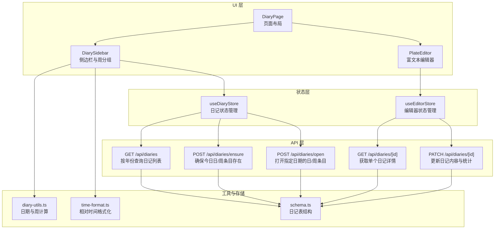
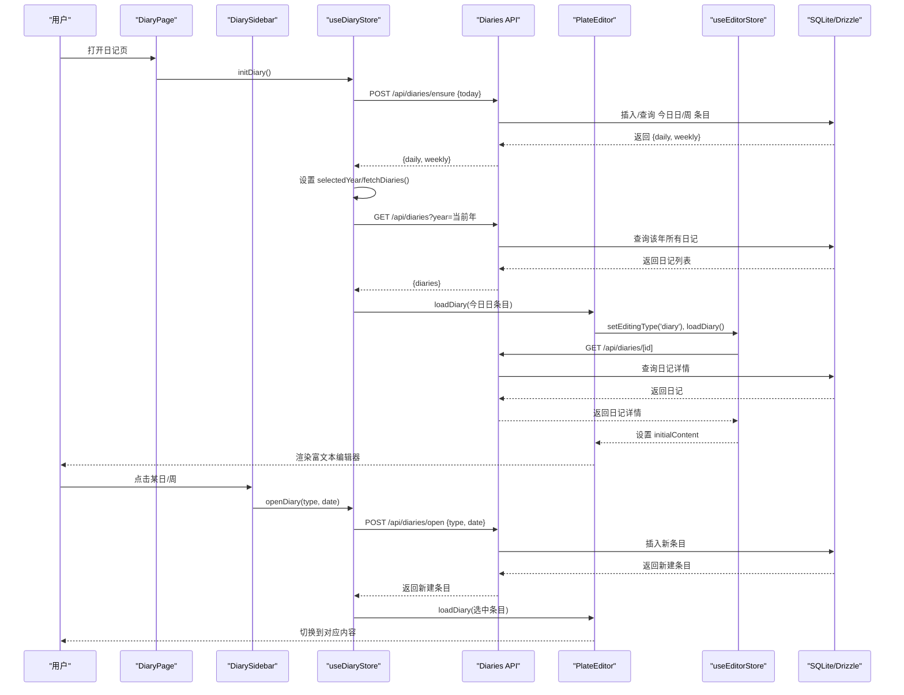
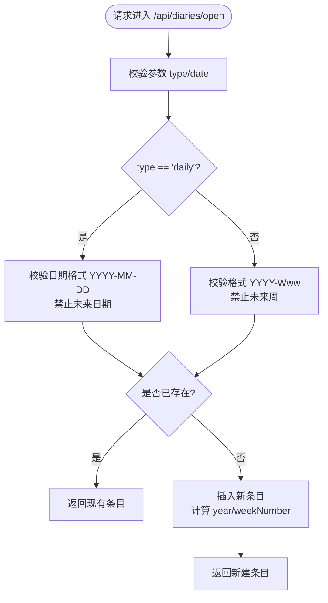
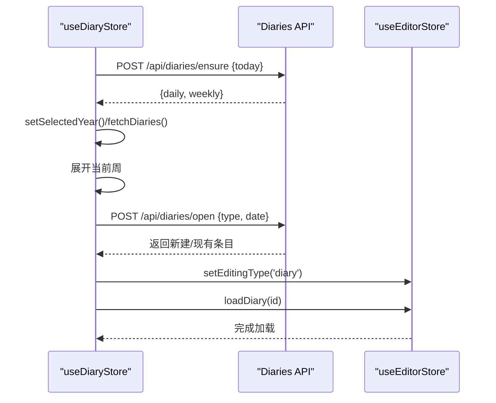
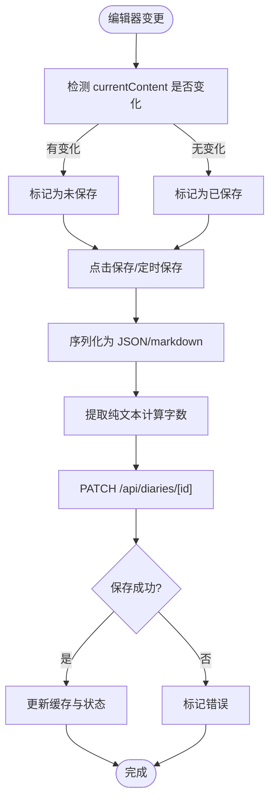
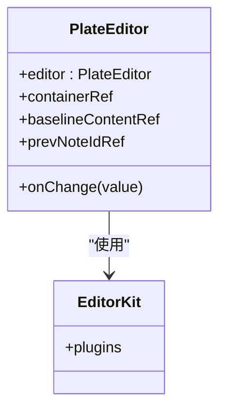
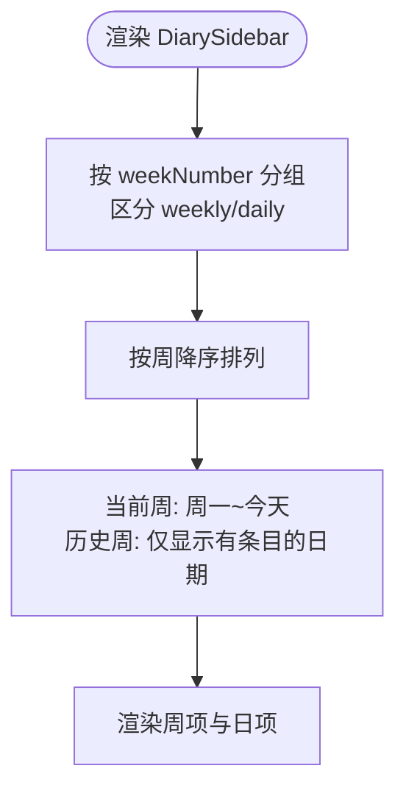
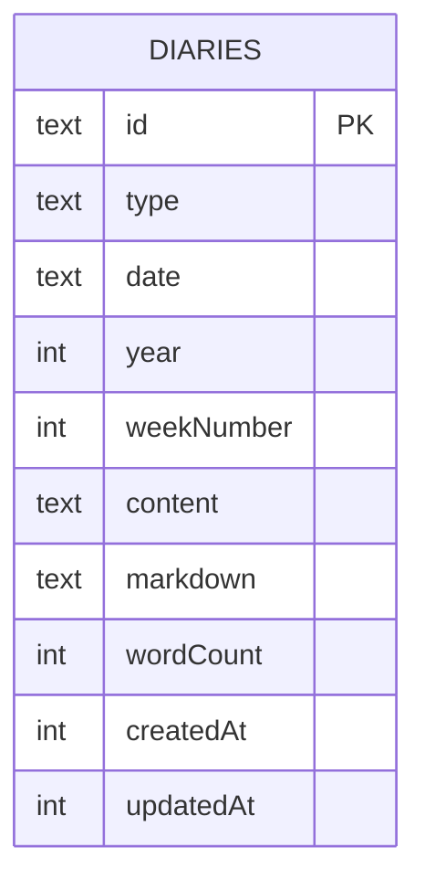
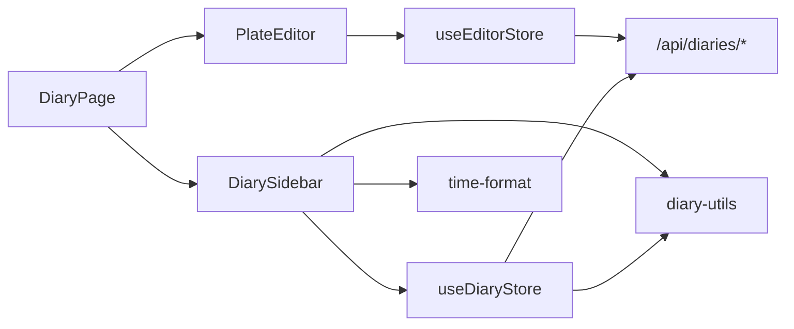

# 每日日记功能

<cite>
**本文档引用的文件**
- [src/app/api/diaries/route.ts](file://src/app/api/diaries/route.ts)
- [src/app/api/diaries/[id]/route.ts](file://src/app/api/diaries/[id]/route.ts)
- [src/app/api/diaries/ensure/route.ts](file://src/app/api/diaries/ensure/route.ts)
- [src/app/api/diaries/open/route.ts](file://src/app/api/diaries/open/route.ts)
- [src/components/diary/diary-page.tsx](file://src/components/diary/diary-page.tsx)
- [src/components/diary/diary-sidebar.tsx](file://src/components/diary/diary-sidebar.tsx)
- [src/components/diary/diary-week-item.tsx](file://src/components/diary/diary-week-item.tsx)
- [src/components/editor/plate-editor.tsx](file://src/components/editor/plate-editor.tsx)
- [src/stores/diary-store.ts](file://src/stores/diary-store.ts)
- [src/stores/editor-store.ts](file://src/stores/editor-store.ts)
- [src/lib/diary-utils.ts](file://src/lib/diary-utils.ts)
- [src/lib/time-format.ts](file://src/lib/time-format.ts)
- [src/lib/storage/index.ts](file://src/lib/storage/index.ts)
- [src/db/schema.ts](file://src/db/schema.ts)
- [src/types/index.ts](file://src/types/index.ts)
- [src/components/ui/calendar.tsx](file://src/components/ui/calendar.tsx)
</cite>

## 目录
1. [简介](#简介)
2. [项目结构](#项目结构)
3. [核心组件](#核心组件)
4. [架构总览](#架构总览)
5. [详细组件分析](#详细组件分析)
6. [依赖关系分析](#依赖关系分析)
7. [性能考虑](#性能考虑)
8. [故障排除指南](#故障排除指南)
9. [结论](#结论)
10. [附录](#附录)

## 简介
本文件面向“每日日记”功能，系统性说明日记条目的创建、编辑与查看流程；文档化日记内容的存储结构（文本内容、元数据与时间戳）；解释日记条目的 CRUD 实现（API 接口与前端组件）；描述编辑器集成与富文本处理；提供日期选择器使用方法与时间格式化；包含搜索与过滤思路；解释与编辑器系统的集成（内容序列化与反序列化）；并给出用户体验优化建议（自动保存与撤销重做）。

## 项目结构
日记功能由三层组成：API 层负责数据持久化与查询；状态层负责日记与编辑器的状态管理；UI 层负责侧边栏、页面布局与编辑器渲染。数据库采用 SQLite + Drizzle ORM，日记表支持“日”和“周”两种类型，按 ISO 周进行分组与排序。

**图表来源**
- [src/app/api/diaries/route.ts:1-45](file://src/app/api/diaries/route.ts#L1-L45)
- [src/app/api/diaries/ensure/route.ts:1-127](file://src/app/api/diaries/ensure/route.ts#L1-L127)
- [src/app/api/diaries/open/route.ts:1-130](file://src/app/api/diaries/open/route.ts#L1-L130)
- [src/app/api/diaries/[id]/route.ts](file://src/app/api/diaries/[id]/route.ts#L1-L63)
- [src/stores/diary-store.ts:1-234](file://src/stores/diary-store.ts#L1-L234)
- [src/stores/editor-store.ts:1-281](file://src/stores/editor-store.ts#L1-L281)
- [src/components/diary/diary-page.tsx:1-29](file://src/components/diary/diary-page.tsx#L1-L29)
- [src/components/diary/diary-sidebar.tsx:1-116](file://src/components/diary/diary-sidebar.tsx#L1-L116)
- [src/components/editor/plate-editor.tsx:1-175](file://src/components/editor/plate-editor.tsx#L1-L175)
- [src/lib/diary-utils.ts:1-113](file://src/lib/diary-utils.ts#L1-L113)
- [src/lib/time-format.ts:1-27](file://src/lib/time-format.ts#L1-L27)
- [src/db/schema.ts:93-104](file://src/db/schema.ts#L93-L104)

**章节来源**
- [src/components/diary/diary-page.tsx:1-29](file://src/components/diary/diary-page.tsx#L1-L29)
- [src/components/diary/diary-sidebar.tsx:1-116](file://src/components/diary/diary-sidebar.tsx#L1-L116)
- [src/components/editor/plate-editor.tsx:1-175](file://src/components/editor/plate-editor.tsx#L1-L175)
- [src/stores/diary-store.ts:1-234](file://src/stores/diary-store.ts#L1-L234)
- [src/stores/editor-store.ts:1-281](file://src/stores/editor-store.ts#L1-L281)
- [src/lib/diary-utils.ts:1-113](file://src/lib/diary-utils.ts#L1-L113)
- [src/lib/time-format.ts:1-27](file://src/lib/time-format.ts#L1-L27)
- [src/db/schema.ts:93-104](file://src/db/schema.ts#L93-L104)

## 核心组件
- 日记 API：提供按年查询、确保今日条目、打开指定条目、读取与更新日记。
- 日记状态管理：负责年份切换、周展开/折叠、条目加载与初始化。
- 编辑器状态管理：负责内容缓存、手动保存、Markdown 序列化与撤销重做隔离。
- 富文本编辑器：基于 Plate.js，提供节点级值比较、初始内容注入与滚动复位。
- 工具函数：ISO 周计算、周内天数生成、中文标签与相对时间格式化。
- 数据模型：日记条目包含类型、日期、年份、周号、内容、字数与时间戳。

**章节来源**
- [src/app/api/diaries/route.ts:1-45](file://src/app/api/diaries/route.ts#L1-L45)
- [src/app/api/diaries/ensure/route.ts:1-127](file://src/app/api/diaries/ensure/route.ts#L1-L127)
- [src/app/api/diaries/open/route.ts:1-130](file://src/app/api/diaries/open/route.ts#L1-L130)
- [src/app/api/diaries/[id]/route.ts](file://src/app/api/diaries/[id]/route.ts#L1-L63)
- [src/stores/diary-store.ts:1-234](file://src/stores/diary-store.ts#L1-L234)
- [src/stores/editor-store.ts:1-281](file://src/stores/editor-store.ts#L1-L281)
- [src/components/editor/plate-editor.tsx:1-175](file://src/components/editor/plate-editor.tsx#L1-L175)
- [src/lib/diary-utils.ts:1-113](file://src/lib/diary-utils.ts#L1-L113)
- [src/lib/time-format.ts:1-27](file://src/lib/time-format.ts#L1-L27)
- [src/types/index.ts:60-74](file://src/types/index.ts#L60-L74)
- [src/db/schema.ts:93-104](file://src/db/schema.ts#L93-L104)

## 架构总览
下图展示从用户交互到数据库写入的完整链路，涵盖初始化、打开条目、编辑保存与缓存更新。

**图表来源**
- [src/components/diary/diary-page.tsx:1-29](file://src/components/diary/diary-page.tsx#L1-L29)
- [src/components/diary/diary-sidebar.tsx:1-116](file://src/components/diary/diary-sidebar.tsx#L1-L116)
- [src/stores/diary-store.ts:153-185](file://src/stores/diary-store.ts#L153-L185)
- [src/stores/editor-store.ts:157-198](file://src/stores/editor-store.ts#L157-L198)
- [src/app/api/diaries/ensure/route.ts:1-127](file://src/app/api/diaries/ensure/route.ts#L1-L127)
- [src/app/api/diaries/open/route.ts:1-130](file://src/app/api/diaries/open/route.ts#L1-L130)
- [src/app/api/diaries/[id]/route.ts](file://src/app/api/diaries/[id]/route.ts#L1-L63)

## 详细组件分析

### 日记 API 设计
- GET /api/diaries?year=YYYY  
  功能：按年份返回所有日记条目，字段包含 id、type、date、year、weekNumber、wordCount、createdAt、updatedAt，并按周序、类型与日期排序。
- POST /api/diaries/ensure  
  功能：确保当天“日”与当周“周”条目存在，若不存在则创建，返回两条新记录。
- POST /api/diaries/open  
  功能：打开指定日期的“日”或“周”条目，校验日期不为未来，插入后返回新建条目。
- GET /api/diaries/[id]  
  功能：返回指定日记详情。
- PATCH /api/diaries/[id]  
  功能：更新 content、markdown 与 wordCount，同时更新 updatedAt。

**图表来源**
- [src/app/api/diaries/open/route.ts:14-130](file://src/app/api/diaries/open/route.ts#L14-L130)

**章节来源**
- [src/app/api/diaries/route.ts:1-45](file://src/app/api/diaries/route.ts#L1-L45)
- [src/app/api/diaries/ensure/route.ts:1-127](file://src/app/api/diaries/ensure/route.ts#L1-L127)
- [src/app/api/diaries/open/route.ts:1-130](file://src/app/api/diaries/open/route.ts#L1-L130)
- [src/app/api/diaries/[id]/route.ts](file://src/app/api/diaries/[id]/route.ts#L1-L63)

### 日记状态管理（useDiaryStore）
- 负责：年份选择与切换、周展开/折叠、日记列表拉取、确保今日条目、打开条目、初始化流程。
- 初始化流程：ensureToday → fetchDiaries → 展开当前周 → 自动打开今日日条目 → 切换编辑器为日记模式并加载内容。
- 打开条目：调用 openDiary(type, date)，若新条目不在本地列表则追加，然后通过编辑器状态加载。

**图表来源**
- [src/stores/diary-store.ts:153-185](file://src/stores/diary-store.ts#L153-L185)
- [src/stores/editor-store.ts:157-198](file://src/stores/editor-store.ts#L157-L198)

**章节来源**
- [src/stores/diary-store.ts:1-234](file://src/stores/diary-store.ts#L1-L234)

### 编辑器状态管理（useEditorStore）
- 负责：当前编辑条目 ID、初始内容、当前变更内容、Markdown 序列化回调、保存状态、字数统计、内容缓存（LRU）。
- 内容保存：序列化为 JSON，提取纯文本计算字数，调用 PATCH /api/diaries/[id] 更新；成功后更新缓存与保存状态。
- 缓存策略：LRU，最大容量 20；命中缓存直接设置 initialContent，未命中则走 API 拉取并写入缓存。

**图表来源**
- [src/stores/editor-store.ts:204-275](file://src/stores/editor-store.ts#L204-L275)
- [src/app/api/diaries/[id]/route.ts](file://src/app/api/diaries/[id]/route.ts#L26-L62)

**章节来源**
- [src/stores/editor-store.ts:1-281](file://src/stores/editor-store.ts#L1-L281)
- [src/app/api/diaries/[id]/route.ts](file://src/app/api/diaries/[id]/route.ts#L1-L63)

### 富文本编辑器（PlateEditor）
- 使用 Plate.js，插件由 EditorKit 提供；支持节点级值比较以避免不必要的保存。
- 切换条目时清空历史与选区，滚动至顶部，防止跨条目撤销与选区残留。
- 注册 Markdown 序列化器，供编辑器状态统一生成 markdown 字段。

**图表来源**
- [src/components/editor/plate-editor.tsx:63-175](file://src/components/editor/plate-editor.tsx#L63-L175)

**章节来源**
- [src/components/editor/plate-editor.tsx:1-175](file://src/components/editor/plate-editor.tsx#L1-L175)

### 侧边栏与周分组（DiarySidebar）
- 按周分组显示“周”与“日”条目，当前周仅显示周一到今天的日期，历史周仅显示有条目的日期。
- 支持年份切换与周展开/折叠；加载状态与空态提示。
- 通过 useMemo 缓存分组结果，避免重复计算。

**图表来源**
- [src/components/diary/diary-sidebar.tsx:18-61](file://src/components/diary/diary-sidebar.tsx#L18-L61)

**章节来源**
- [src/components/diary/diary-sidebar.tsx:1-116](file://src/components/diary/diary-sidebar.tsx#L1-L116)
- [src/lib/diary-utils.ts:67-91](file://src/lib/diary-utils.ts#L67-L91)

### 日期选择器与时间格式化
- 日期选择器：使用 react-day-picker 的 Calendar 组件，支持导航、焦点与样式定制。
- 时间格式化：相对时间（刚刚/分钟前/小时前/天前），非近期按年/月/日/时:分显示。

**章节来源**
- [src/components/ui/calendar.tsx:1-220](file://src/components/ui/calendar.tsx#L1-L220)
- [src/lib/time-format.ts:1-27](file://src/lib/time-format.ts#L1-L27)

### 存储结构与数据模型
- 表结构：日记表包含 id、type、date、year、weekNumber、content、markdown、wordCount、createdAt、updatedAt。
- 类型定义：DiaryEntry 与 DiaryMeta 区分详情与元数据（不含 content/markdown）。

**图表来源**
- [src/db/schema.ts:93-104](file://src/db/schema.ts#L93-L104)
- [src/types/index.ts:60-74](file://src/types/index.ts#L60-L74)

**章节来源**
- [src/db/schema.ts:93-104](file://src/db/schema.ts#L93-L104)
- [src/types/index.ts:60-74](file://src/types/index.ts#L60-L74)

## 依赖关系分析
- 组件耦合：DiaryPage 依赖 DiarySidebar 与 PlateEditor；DiarySidebar 依赖 useDiaryStore；PlateEditor 依赖 useEditorStore。
- 状态耦合：useDiaryStore 与 useEditorStore 协作，前者负责日记生命周期，后者负责内容与保存。
- 外部依赖：date-fns（ISO 周计算）、react-day-picker（日期选择）、Plate.js（富文本编辑）。

**图表来源**
- [src/components/diary/diary-page.tsx:1-29](file://src/components/diary/diary-page.tsx#L1-L29)
- [src/components/diary/diary-sidebar.tsx:1-116](file://src/components/diary/diary-sidebar.tsx#L1-L116)
- [src/stores/diary-store.ts:1-234](file://src/stores/diary-store.ts#L1-L234)
- [src/stores/editor-store.ts:1-281](file://src/stores/editor-store.ts#L1-L281)
- [src/lib/diary-utils.ts:1-113](file://src/lib/diary-utils.ts#L1-L113)
- [src/lib/time-format.ts:1-27](file://src/lib/time-format.ts#L1-L27)

**章节来源**
- [src/components/diary/diary-page.tsx:1-29](file://src/components/diary/diary-page.tsx#L1-L29)
- [src/components/diary/diary-sidebar.tsx:1-116](file://src/components/diary/diary-sidebar.tsx#L1-L116)
- [src/stores/diary-store.ts:1-234](file://src/stores/diary-store.ts#L1-L234)
- [src/stores/editor-store.ts:1-281](file://src/stores/editor-store.ts#L1-L281)

## 性能考虑
- 节流与防抖：在高频输入场景可引入防抖（例如使用 debounce hook）减少保存频率。
- 内容缓存：编辑器状态已实现 LRU 缓存，建议结合路由切换与条目切换进行失效控制。
- 初次渲染：PlateEditor 在切换条目时清空历史与选区，避免跨条目状态污染，提升稳定性。
- 数据查询：后端按年份查询并排序，前端侧边栏按周分组，减少前端排序成本。

[本节为通用指导，无需具体文件引用]

## 故障排除指南
- 打开未来日期/周：open 接口会拒绝未来日期，检查客户端传参与日期格式。
- 保存失败：编辑器保存时会设置“保存中/错误”状态，检查网络与后端响应。
- 侧边栏空白：确认 useDiaryStore.fetchDiaries 成功返回数据，检查 loading 状态。
- 编辑器无法切换：确认 useEditorStore.loadDiary 成功返回内容，检查 contentCache 命中情况。

**章节来源**
- [src/app/api/diaries/open/route.ts:33-73](file://src/app/api/diaries/open/route.ts#L33-L73)
- [src/stores/editor-store.ts:204-275](file://src/stores/editor-store.ts#L204-L275)
- [src/stores/diary-store.ts:69-82](file://src/stores/diary-store.ts#L69-L82)

## 结论
该日记功能以清晰的分层架构实现了“创建—打开—编辑—保存”的完整闭环：API 层提供稳定的 CRUD 能力，状态层协调日记与编辑器行为，UI 层通过侧边栏与富文本编辑器提供直观体验。通过 ISO 周分组与缓存机制，系统在可用性与性能上取得平衡。后续可在自动保存、撤销重做与搜索过滤方面进一步增强。

[本节为总结性内容，无需具体文件引用]

## 附录

### CRUD 操作与接口一览
- 创建
  - 确保今日条目：POST /api/diaries/ensure
  - 打开指定条目：POST /api/diaries/open
- 查看
  - 列表：GET /api/diaries?year=YYYY
  - 详情：GET /api/diaries/[id]
- 更新
  - PATCH /api/diaries/[id]（更新 content/markdown/wordCount）

**章节来源**
- [src/app/api/diaries/ensure/route.ts:1-127](file://src/app/api/diaries/ensure/route.ts#L1-L127)
- [src/app/api/diaries/open/route.ts:1-130](file://src/app/api/diaries/open/route.ts#L1-L130)
- [src/app/api/diaries/route.ts:1-45](file://src/app/api/diaries/route.ts#L1-L45)
- [src/app/api/diaries/[id]/route.ts](file://src/app/api/diaries/[id]/route.ts#L1-L63)

### 日期选择器使用方法
- 引入 Calendar 组件，配置导航按钮、样式类名与格式化器。
- 可通过外部状态控制当前月份与选中日期，结合业务逻辑限制未来日期。

**章节来源**
- [src/components/ui/calendar.tsx:1-220](file://src/components/ui/calendar.tsx#L1-L220)

### 时间格式化
- 相对时间：formatRelativeTime，支持“刚刚/分钟前/小时前/天前”等。
- 非近期：按年/月/日/时:分显示，区分当年与跨年。

**章节来源**
- [src/lib/time-format.ts:1-27](file://src/lib/time-format.ts#L1-L27)

### 搜索与过滤建议
- 前端过滤：在 useDiaryStore 中增加关键词过滤逻辑，基于 wordCount 或 content（需后端支持）。
- 后端扩展：在 GET /api/diaries 增加查询参数（如 keyword、startDate、endDate），并在 SQL 中添加 WHERE 条件。

[本小节为概念性建议，无需具体文件引用]

### 编辑器集成与富文本处理
- 内容序列化：编辑器注册 Markdown 序列化器，保存时自动生成 markdown 字段。
- 反序列化：加载时将 content 字段解析为 Plate.js Value 结构。
- 撤销重做：切换条目时清空历史，避免跨条目状态污染。

**章节来源**
- [src/components/editor/plate-editor.tsx:146-153](file://src/components/editor/plate-editor.tsx#L146-L153)
- [src/stores/editor-store.ts:79-86](file://src/stores/editor-store.ts#L79-L86)
- [src/stores/editor-store.ts:104-105](file://src/stores/editor-store.ts#L104-L105)

### 用户体验优化建议
- 自动保存：在用户停止输入一段时间后触发保存，减少手动操作。
- 撤销重做：保留每个条目的独立历史栈，切换条目时清空历史。
- 离线草稿：本地存储临时草稿，网络恢复后同步。
- 快捷键：提供常用快捷键（如 Cmd+S 保存）提升效率。

[本小节为通用建议，无需具体文件引用]