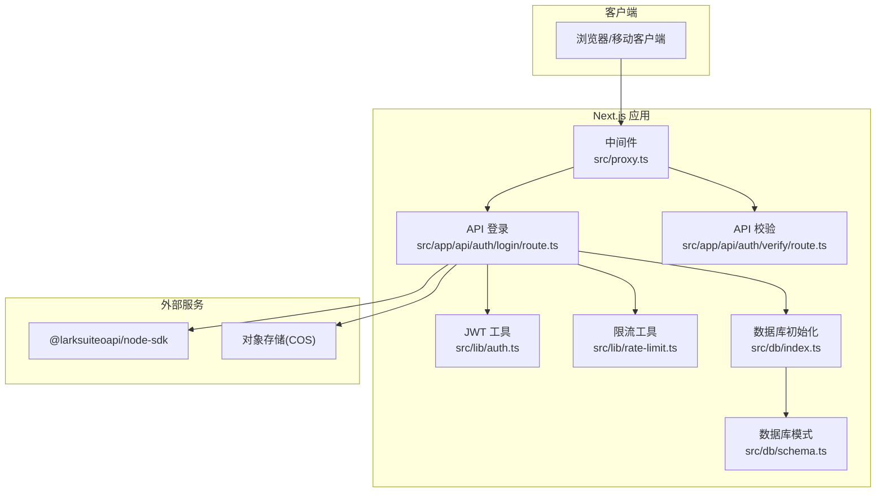
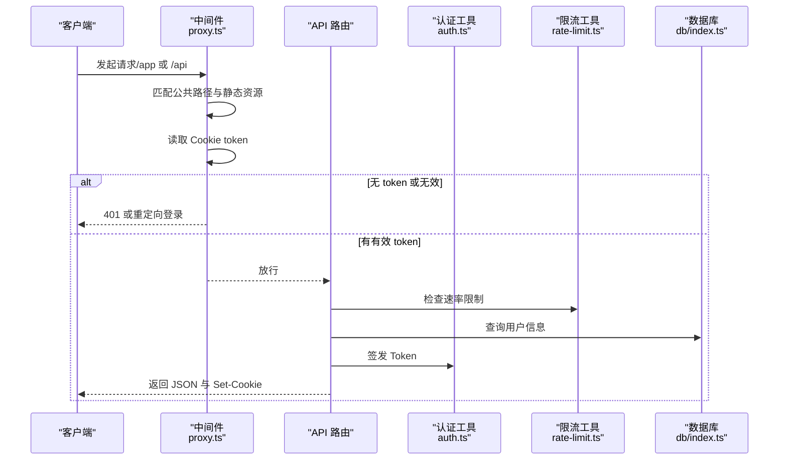
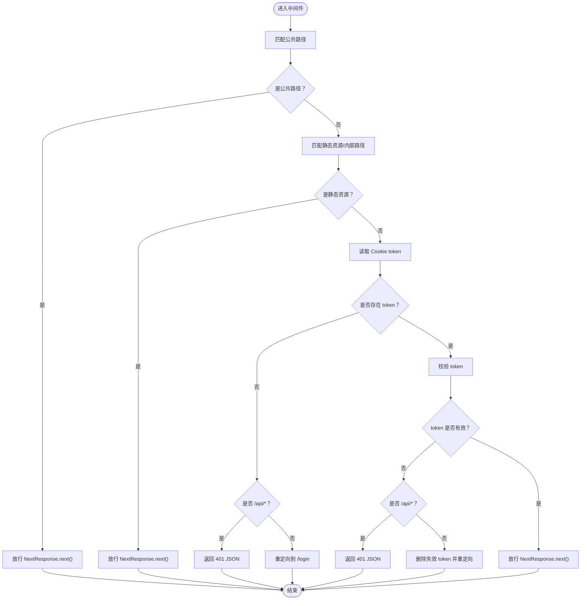
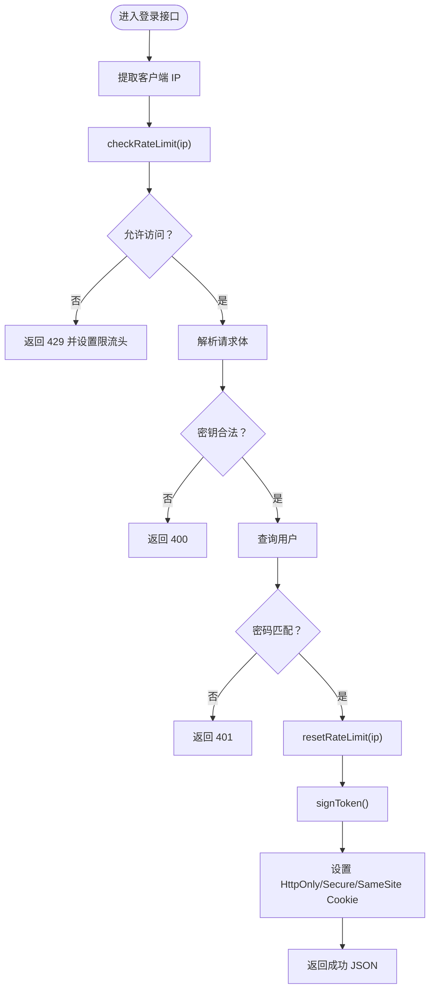
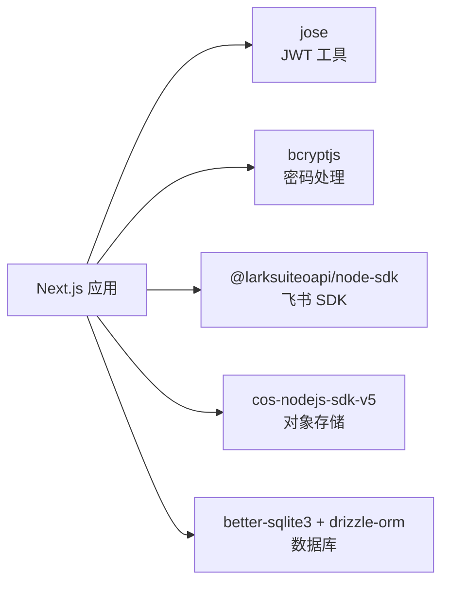

# 中间件集成

<cite>
**本文引用的文件**
- [src/proxy.ts](file://src/proxy.ts)
- [next.config.ts](file://next.config.ts)
- [src/app/api/auth/login/route.ts](file://src/app/api/auth/login/route.ts)
- [src/app/api/auth/verify/route.ts](file://src/app/api/auth/verify/route.ts)
- [src/lib/auth.ts](file://src/lib/auth.ts)
- [src/lib/rate-limit.ts](file://src/lib/rate-limit.ts)
- [src/db/index.ts](file://src/db/index.ts)
- [src/db/schema.ts](file://src/db/schema.ts)
- [package.json](file://package.json)
</cite>

## 目录
1. [简介](#简介)
2. [项目结构](#项目结构)
3. [核心组件](#核心组件)
4. [架构总览](#架构总览)
5. [详细组件分析](#详细组件分析)
6. [依赖分析](#依赖分析)
7. [性能考虑](#性能考虑)
8. [故障排查指南](#故障排查指南)
9. [结论](#结论)
10. [附录](#附录)

## 简介
本文件系统性梳理 YNote v2 的中间件与代理集成方案，重点覆盖以下方面：
- 代理服务器的配置与请求转发机制
- 中间件执行顺序与拦截策略
- 请求预处理与响应后处理的实现方式
- CORS 与安全头设置现状与建议
- 缓存中间件与性能优化策略
- 错误处理与日志记录机制
- 中间件扩展与自定义开发指南
- 生产环境的中间件部署与监控策略

## 项目结构
YNote v2 基于 Next.js 16，采用 App Router 路由模型。中间件与代理主要通过以下文件组织：
- 代理与鉴权：src/proxy.ts（Next.js 中间件）
- 安全令牌签发与校验：src/lib/auth.ts
- 登录限流：src/lib/rate-limit.ts
- 数据库初始化与模式：src/db/index.ts、src/db/schema.ts
- Next.js 配置：next.config.ts
- 登录与验证 API：src/app/api/auth/login/route.ts、src/app/api/auth/verify/route.ts
- 依赖声明：package.json



图表来源
- [src/proxy.ts:1-49](file://src/proxy.ts#L1-L49)
- [src/app/api/auth/login/route.ts:1-63](file://src/app/api/auth/login/route.ts#L1-L63)
- [src/app/api/auth/verify/route.ts:1-7](file://src/app/api/auth/verify/route.ts#L1-L7)
- [src/lib/auth.ts:1-26](file://src/lib/auth.ts#L1-L26)
- [src/lib/rate-limit.ts:1-41](file://src/lib/rate-limit.ts#L1-L41)
- [src/db/index.ts:1-171](file://src/db/index.ts#L1-L171)
- [src/db/schema.ts:1-105](file://src/db/schema.ts#L1-L105)

章节来源
- [src/proxy.ts:1-49](file://src/proxy.ts#L1-L49)
- [next.config.ts:1-17](file://next.config.ts#L1-L17)

## 核心组件
- 中间件代理（src/proxy.ts）：负责对 /app 与 /api 下的请求进行统一鉴权与放行控制；对未携带有效 Token 的请求返回 401 或重定向至登录页。
- 认证工具（src/lib/auth.ts）：基于 jose 实现 HS256 的签发与校验，支持从环境变量读取密钥与过期时间。
- 登录限流（src/lib/rate-limit.ts）：基于内存 Map 的滑动窗口限流，周期清理过期条目，用于保护登录接口。
- 登录 API（src/app/api/auth/login/route.ts）：接收密钥，校验速率限制，查询数据库用户，成功后签发 Cookie 并返回 Token。
- 校验 API（src/app/api/auth/verify/route.ts）：在中间件放行后，用于前端确认 Token 有效性。
- 数据库（src/db/index.ts、src/db/schema.ts）：初始化 SQLite 表结构与索引，确保用户表存在并可迁移。

章节来源
- [src/proxy.ts:1-49](file://src/proxy.ts#L1-L49)
- [src/lib/auth.ts:1-26](file://src/lib/auth.ts#L1-L26)
- [src/lib/rate-limit.ts:1-41](file://src/lib/rate-limit.ts#L1-L41)
- [src/app/api/auth/login/route.ts:1-63](file://src/app/api/auth/login/route.ts#L1-L63)
- [src/app/api/auth/verify/route.ts:1-7](file://src/app/api/auth/verify/route.ts#L1-L7)
- [src/db/index.ts:1-171](file://src/db/index.ts#L1-L171)
- [src/db/schema.ts:1-105](file://src/db/schema.ts#L1-L105)

## 架构总览
下图展示从客户端到后端 API 的请求路径与中间件拦截点：



图表来源
- [src/proxy.ts:7-45](file://src/proxy.ts#L7-L45)
- [src/app/api/auth/login/route.ts:9-62](file://src/app/api/auth/login/route.ts#L9-L62)
- [src/lib/auth.ts:10-25](file://src/lib/auth.ts#L10-L25)
- [src/lib/rate-limit.ts:21-40](file://src/lib/rate-limit.ts#L21-L40)
- [src/db/index.ts:160-168](file://src/db/index.ts#L160-L168)

## 详细组件分析

### 中间件代理（proxy.ts）
- 执行顺序与拦截策略
  - 公共路径优先放行：如 /login、/api/auth/login。
  - 静态资源与 Next 内部路径直接放行。
  - 对 /api 与 /app 下的受保护路径：
    - 若无 token，/api 返回 401 JSON，否则重定向到 /login。
    - 校验 token 失败时，删除失效 cookie 并重定向。
    - 校验通过则放行。
  - 匹配器仅作用于 /app/:path* 与 /api/:path*。
- 请求预处理
  - 读取 Cookie token，作为后续鉴权依据。
- 响应后处理
  - 本中间件不修改响应体，仅做放行或重定向/拒绝。
- 安全头与 CORS
  - 当前中间件未显式设置安全头或 CORS 头；如需跨域访问，应在具体 API 层面补充。



图表来源
- [src/proxy.ts:7-45](file://src/proxy.ts#L7-L45)

章节来源
- [src/proxy.ts:5-49](file://src/proxy.ts#L5-L49)

### 认证工具（auth.ts）
- 功能要点
  - 使用 HS256 签发 JWT，默认过期时间来自环境变量。
  - 使用相同密钥进行校验，异常即视为无效。
- 与中间件协作
  - 中间件调用 verifyToken 校验请求中的 token。
  - 登录 API 成功后使用 signToken 生成 token 并写入 Cookie。

```mermaid
classDiagram
class AuthUtil {
+signToken(payload) Promise~string~
+verifyToken(token) Promise~{valid,payload?}~
}
class ProxyMiddleware {
+proxy(request) Promise
}
class LoginRoute {
+POST(request) Promise
}
ProxyMiddleware --> AuthUtil : "verifyToken()"
LoginRoute --> AuthUtil : "signToken()"
```

图表来源
- [src/lib/auth.ts:10-25](file://src/lib/auth.ts#L10-L25)
- [src/proxy.ts:33](file://src/proxy.ts#L33)
- [src/app/api/auth/login/route.ts:47](file://src/app/api/auth/login/route.ts#L47)

章节来源
- [src/lib/auth.ts:1-26](file://src/lib/auth.ts#L1-L26)

### 登录限流（rate-limit.ts）
- 算法与数据结构
  - 滑动窗口：Map 存储每个 IP 的计数与重置时间。
  - 定时清理：每分钟清理过期条目，避免内存膨胀。
- 复杂度
  - 检查/更新均为 O(1)，空间复杂度随活跃 IP 数增长。
- 在登录流程中的作用
  - 登录接口在每次请求检查限流，超过阈值返回 429 并附带 Retry-After 与剩余次数头。
  - 成功登录后重置该 IP 的限流状态。



图表来源
- [src/lib/rate-limit.ts:21-40](file://src/lib/rate-limit.ts#L21-L40)
- [src/app/api/auth/login/route.ts:9-62](file://src/app/api/auth/login/route.ts#L9-L62)

章节来源
- [src/lib/rate-limit.ts:1-41](file://src/lib/rate-limit.ts#L1-L41)
- [src/app/api/auth/login/route.ts:1-63](file://src/app/api/auth/login/route.ts#L1-L63)

### 登录与验证 API
- 登录 API（/api/auth/login）
  - 限流检查 → 解析请求体 → 查询用户 → 密码比对 → 成功后签发 token 并设置 Cookie。
  - 异常场景：参数缺失/格式错误、密钥错误、数据库异常等，均返回相应状态码与错误信息。
- 校验 API（/api/auth/verify）
  - 仅在中间件放行后可用，用于前端主动确认 token 有效性。

章节来源
- [src/app/api/auth/login/route.ts:1-63](file://src/app/api/auth/login/route.ts#L1-L63)
- [src/app/api/auth/verify/route.ts:1-7](file://src/app/api/auth/verify/route.ts#L1-L7)

### 数据库初始化与模式
- 初始化逻辑
  - 自动创建目录与数据库文件，启用 WAL 模式与外键约束。
  - 初始化用户、文件附件、想法、标签、日记等表及索引。
  - 支持迁移：向现有表添加列并初始化管理员用户（若提供 AUTH_SECRET_KEY）。
- 单例连接
  - 提供 getDatabase 单例，避免重复连接。

章节来源
- [src/db/index.ts:1-171](file://src/db/index.ts#L1-L171)
- [src/db/schema.ts:1-105](file://src/db/schema.ts#L1-L105)

## 依赖分析
- 外部依赖与打包
  - next.config.ts 声明 serverExternalPackages，包含 better-sqlite3、sharp、cos-nodejs-sdk-v5、bcryptjs、@larksuiteoapi/node-sdk，以减少构建体积并按需加载原生模块。
- 关键运行时依赖
  - jose：JWT 签发与校验
  - bcryptjs：密码哈希与比对
  - better-sqlite3 + drizzle-orm：本地数据库访问
  - @larksuiteoapi/node-sdk：飞书相关能力
  - cos-nodejs-sdk-v5：对象存储（COS）



图表来源
- [package.json:13-99](file://package.json#L13-L99)
- [next.config.ts:4-10](file://next.config.ts#L4-L10)

章节来源
- [package.json:1-119](file://package.json#L1-L119)
- [next.config.ts:1-17](file://next.config.ts#L1-L17)

## 性能考虑
- 代理与鉴权
  - 中间件仅做轻量级判断（路径匹配、Cookie 读取、JWT 校验），开销极低。
- 限流策略
  - 内存 Map + 定时清理，适合单实例部署；多实例需共享存储（Redis）以保证全局一致性。
- 数据库
  - WAL 模式提升并发写入性能；索引覆盖常见查询字段（如日记的 year/week_number）。
- 上传与代理
  - next.config.ts 设置 proxyClientMaxBodySize 为 100MB，满足较大文件上传需求。
- 缓存中间件
  - 当前未实现专用缓存中间件。建议在只读 API（如日记列表、标签查询）引入内存/Redis 缓存，并结合 ETag/Last-Modified 实现条件请求。

章节来源
- [src/lib/rate-limit.ts:11-19](file://src/lib/rate-limit.ts#L11-L19)
- [src/db/index.ts:17-18](file://src/db/index.ts#L17-L18)
- [next.config.ts:11-13](file://next.config.ts#L11-L13)

## 故障排查指南
- 401 未授权
  - 检查客户端是否携带有效 Cookie token；确认中间件未拦截公共路径；核对 JWT 密钥与过期时间。
- 重定向循环
  - 确认 /login 与 /api/auth/login 为公共路径且未被其他规则覆盖。
- 登录频繁 429
  - 检查限流窗口与阈值；确认客户端 IP 正确（x-forwarded-for/x-real-ip）；查看 Retry-After 与 X-RateLimit-Remaining 头。
- 数据库初始化失败
  - 检查 DATABASE_PATH 权限与磁盘空间；确认 AUTH_SECRET_KEY 是否正确设置以初始化管理员账户。
- CORS 问题
  - 当前中间件未设置 CORS 头；如前端跨域访问，需在具体 API 层设置 Access-Control-Allow-* 头。

章节来源
- [src/proxy.ts:24-44](file://src/proxy.ts#L24-L44)
- [src/app/api/auth/login/route.ts:12-25](file://src/app/api/auth/login/route.ts#L12-L25)
- [src/db/index.ts:8-25](file://src/db/index.ts#L8-L25)

## 结论
YNote v2 的中间件与代理以最小侵入的方式实现了统一鉴权与基础防护。通过中间件 + 登录限流 + JWT 的组合，既保障了安全性，又保持了良好的性能与可维护性。后续可在以下方向演进：引入跨域与安全头策略、扩展缓存中间件、在多实例环境下替换限流存储为 Redis，并完善日志与监控体系。

## 附录

### CORS 与安全头设置建议
- CORS
  - 在 API 层设置 Access-Control-Allow-Origin、Access-Control-Allow-Credentials 等头，避免在中间件中硬编码。
- 安全头
  - Content-Security-Policy、Strict-Transport-Security、X-Content-Type-Options、X-Frame-Options、Referrer-Policy 等，建议在反向代理或边缘层统一注入。

### 中间件扩展与自定义开发指南
- 新增拦截规则
  - 在中间件中新增路径白名单或黑名单；注意与现有公共路径逻辑的兼容性。
- 自定义限流策略
  - 将内存 Map 替换为 Redis，实现多实例共享；支持更细粒度的限流维度（用户 ID、IP、UA）。
- 缓存中间件
  - 为只读 API 添加缓存层，结合 ETag/Cache-Control；对写操作进行失效广播。
- 日志与审计
  - 在中间件与关键 API 中埋点请求链路日志（traceId）、耗时、状态码与异常信息，便于定位问题。

### 生产环境部署与监控策略
- 部署
  - 使用 serverExternalPackages 降低冷启动与包体积；确保数据库目录权限与持久化。
  - 反向代理统一注入安全头与 CORS；根据流量规模选择单实例或多实例并启用限流共享。
- 监控
  - 指标：请求量、错误率、P95/P99 延迟、限流触发次数、数据库连接数。
  - 告警：4xx/5xx 异常突增、限流命中率过高、数据库慢查询。
  - 日志：结构化日志、请求上下文追踪、敏感信息脱敏。