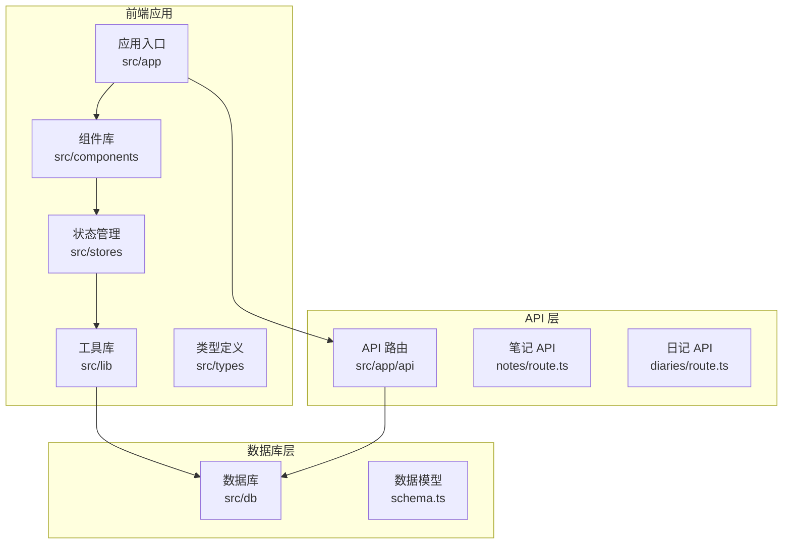
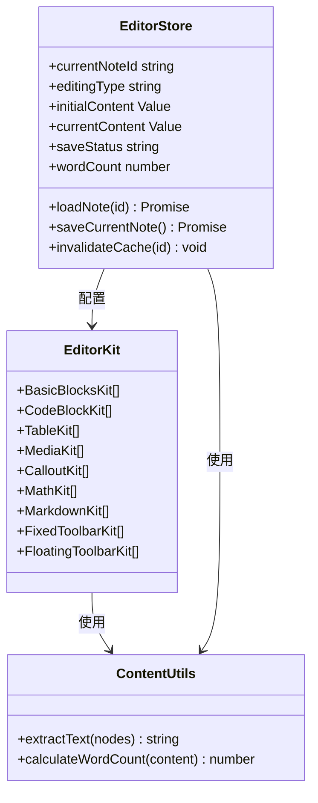
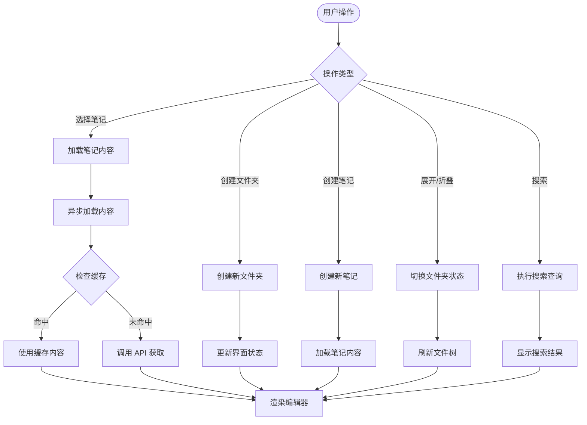
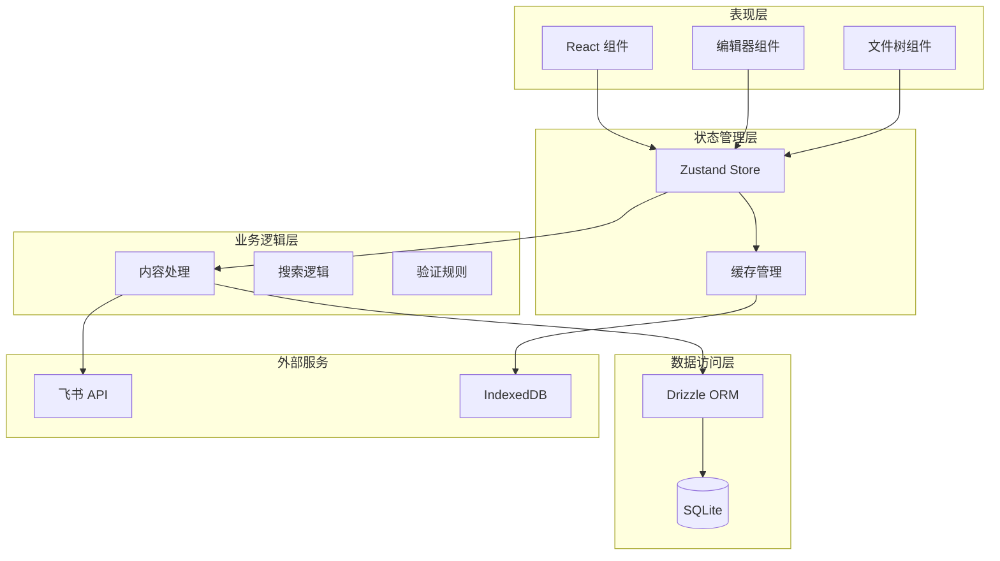
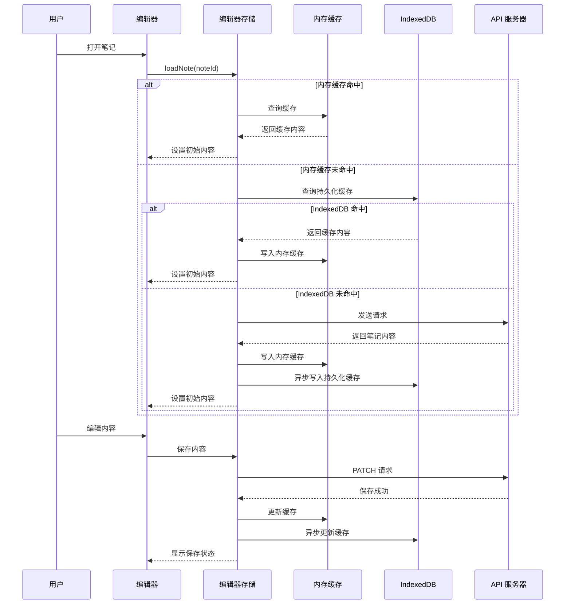
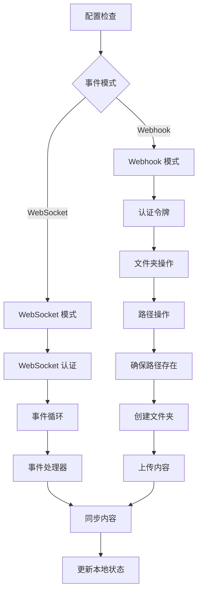
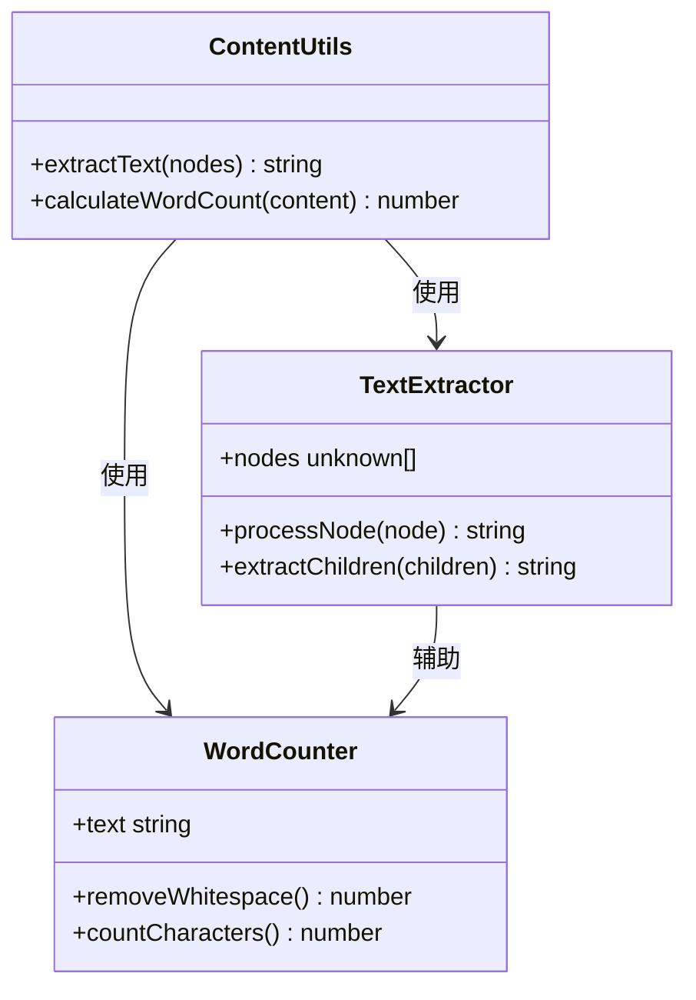

# 内容分析工具

<cite>
**本文档引用的文件**
- [README.md](file://README.md)
- [package.json](file://package.json)
- [src/app/layout.tsx](file://src/app/layout.tsx)
- [src/app/page.tsx](file://src/app/page.tsx)
- [src/lib/utils.ts](file://src/lib/utils.ts)
- [src/db/schema.ts](file://src/db/schema.ts)
- [src/components/editor/editor-kit.tsx](file://src/components/editor/editor-kit.tsx)
- [src/lib/content-utils.ts](file://src/lib/content-utils.ts)
- [src/stores/editor-store.ts](file://src/stores/editor-store.ts)
- [src/types/index.ts](file://src/types/index.ts)
- [src/app/api/notes/route.ts](file://src/app/api/notes/route.ts)
- [src/app/api/diaries/route.ts](file://src/app/api/diaries/route.ts)
- [src/components/file-tree/file-tree.tsx](file://src/components/file-tree/file-tree.tsx)
- [src/lib/editor-cache.ts](file://src/lib/editor-cache.ts)
- [src/lib/lark.ts](file://src/lib/lark.ts)
</cite>

## 目录
1. [简介](#简介)
2. [项目结构](#项目结构)
3. [核心组件](#核心组件)
4. [架构概览](#架构概览)
5. [详细组件分析](#详细组件分析)
6. [依赖关系分析](#依赖关系分析)
7. [性能考虑](#性能考虑)
8. [故障排除指南](#故障排除指南)
9. [结论](#结论)

## 简介

内容分析工具是一个基于 Next.js 构建的个人 Markdown 笔记应用，专注于提供高效的内容创作、管理和分析体验。该系统集成了强大的编辑器功能、智能缓存机制、多层级文件组织以及与飞书云空间的深度集成。

该项目采用现代化的技术栈，包括 TypeScript、React 19、Zustand 状态管理、Drizzle ORM 数据库抽象层，以及丰富的编辑器插件生态系统。系统支持笔记、日记、想法等多种内容类型的创建和管理，并提供了完整的全文搜索功能。

## 项目结构

项目采用基于功能的模块化组织方式，主要分为以下几个核心部分：



**图表来源**
- [src/app/layout.tsx:1-38](file://src/app/layout.tsx#L1-L38)
- [src/db/schema.ts:1-105](file://src/db/schema.ts#L1-L105)

**章节来源**
- [README.md:1-37](file://README.md#L1-L37)
- [package.json:1-107](file://package.json#L1-L107)

## 核心组件

### 编辑器系统

编辑器系统是整个应用的核心组件，基于 Plate.js 构建，提供了丰富的富文本编辑功能。系统集成了 20+ 个专业编辑器插件，涵盖基础块元素、样式标记、媒体处理、数学公式、表格等各个方面。



**图表来源**
- [src/components/editor/editor-kit.tsx:1-83](file://src/components/editor/editor-kit.tsx#L1-L83)
- [src/lib/content-utils.ts:1-37](file://src/lib/content-utils.ts#L1-L37)
- [src/stores/editor-store.ts:1-343](file://src/stores/editor-store.ts#L1-L343)

### 文件树管理系统

文件树组件提供了直观的层次化文件浏览体验，支持文件夹的展开/折叠、笔记的快速导航、全文搜索等功能。系统实现了智能的缓存策略，确保用户操作的流畅性。



**图表来源**
- [src/components/file-tree/file-tree.tsx:1-326](file://src/components/file-tree/file-tree.tsx#L1-L326)

### 数据库架构

系统采用 Drizzle ORM 进行数据库抽象，支持 SQLite 后端。数据模型设计遵循关系型数据库最佳实践，支持复杂的关联查询和事务处理。

**章节来源**
- [src/db/schema.ts:1-105](file://src/db/schema.ts#L1-L105)
- [src/stores/editor-store.ts:1-343](file://src/stores/editor-store.ts#L1-L343)

## 架构概览

系统采用分层架构设计，清晰分离了表现层、业务逻辑层、数据访问层和外部服务集成层。



**图表来源**
- [src/lib/editor-cache.ts:1-271](file://src/lib/editor-cache.ts#L1-L271)
- [src/lib/lark.ts:1-367](file://src/lib/lark.ts#L1-L367)

## 详细组件分析

### 编辑器缓存系统

编辑器缓存系统实现了多层缓存策略，结合内存缓存和 IndexedDB 持久化存储，确保内容加载的高性能和可靠性。



**图表来源**
- [src/stores/editor-store.ts:129-199](file://src/stores/editor-store.ts#L129-L199)
- [src/lib/editor-cache.ts:78-105](file://src/lib/editor-cache.ts#L78-L105)

#### 缓存策略实现

缓存系统采用了 LRU（最近最少使用）淘汰算法，通过时间戳索引实现高效的缓存管理：

| 缓存层级 | 存储介质 | 特点 | 容量限制 |
|---------|---------|------|---------|
| 内存缓存 | JavaScript Map | 快速访问，进程内 | 20 个条目 |
| IndexedDB | 浏览器数据库 | 持久化存储，跨会话 | 50 个条目 |
| API 缓存 | 服务器端 | 可扩展，支持共享 | 无限制 |

**章节来源**
- [src/stores/editor-store.ts:14-84](file://src/stores/editor-store.ts#L14-L84)
- [src/lib/editor-cache.ts:202-245](file://src/lib/editor-cache.ts#L202-L245)

### 飞书集成系统

系统集成了飞书云空间的完整功能，包括文件夹管理、内容同步、事件监听等高级特性。



**图表来源**
- [src/lib/lark.ts:51-57](file://src/lib/lark.ts#L51-L57)
- [src/lib/lark.ts:278-334](file://src/lib/lark.ts#L278-L334)

#### 飞书 API 功能

系统支持以下飞书云空间功能：

- **文件夹管理**: 自动创建和管理多层级文件夹结构
- **内容同步**: 实时同步笔记内容到云端存储
- **事件监听**: 支持 Webhook 和 WebSocket 两种事件接收模式
- **安全认证**: 支持多种认证方式和权限控制

**章节来源**
- [src/lib/lark.ts:1-367](file://src/lib/lark.ts#L1-L367)

### 内容分析工具

内容分析工具提供了强大的文本处理能力，包括智能文本提取、字数统计、内容解析等功能。



**图表来源**
- [src/lib/content-utils.ts:11-36](file://src/lib/content-utils.ts#L11-L36)

#### 文本处理算法

系统实现了高效的文本处理算法：

1. **递归文本提取**: 遍历 Plate/Slate 节点树，提取纯文本内容
2. **智能字数统计**: 移除空白字符后计算有效字符数
3. **内容验证**: 确保解析的 JSON 结构符合预期格式

**章节来源**
- [src/lib/content-utils.ts:1-37](file://src/lib/content-utils.ts#L1-L37)

## 依赖关系分析

项目依赖关系展现了现代化前端开发的最佳实践，各模块间保持松耦合的设计原则。

```mermaid
graph TB
subgraph "运行时依赖"
NEXT[next.js 16.1.6]
REACT[react 19.2.3]
ZUSTAND[zustand 5.0.11]
DRIZZLE[drizzle-orm 0.45.1]
PLATEJS[platejs 52.3.4]
end
subgraph "编辑器插件"
BASIC_BLOCKS[@platejs/basic-nodes]
CODE_BLOCK[@platejs/code-block]
TABLE[@platejs/table]
MEDIA[@platejs/media]
MATH[@platejs/math]
MARKDOWN[@platejs/markdown]
end
subgraph "UI 组件库"
RADIX_UI[@radix-ui/react-*]
LUCIDE[lucide-react]
SONNER[sonner]
end
subgraph "工具库"
BCRYPT[bcryptjs]
DATEFNS[date-fns]
CLSX[clsx/tailwind-merge]
NANOID[nanoid]
end
NEXT --> REACT
REACT --> ZUSTAND
ZUSTAND --> PLATEJS
PLATEJS --> BASIC_BLOCKS
PLATEJS --> CODE_BLOCK
PLATEJS --> TABLE
PLATEJS --> MEDIA
PLATEJS --> MATH
PLATEJS --> MARKDOWN
REACT --> RADIX_UI
REACT --> LUCIDE
REACT --> SONNER
```

**图表来源**
- [package.json:13-88](file://package.json#L13-L88)

### 开发依赖

开发环境依赖提供了完整的现代化开发工具链：

- **构建工具**: Next.js 16.1.6 + TypeScript 5
- **代码质量**: ESLint 9 + TailwindCSS 4
- **测试工具**: concurrently 9.2.1 + tsx 4.21.0
- **数据库工具**: drizzle-kit 0.31.9 + better-sqlite3 12.8.0

**章节来源**
- [package.json:89-107](file://package.json#L89-L107)

## 性能考虑

系统在多个层面实现了性能优化策略，确保在大数据量场景下的流畅体验。

### 缓存优化策略

1. **多层缓存架构**: 内存缓存 + IndexedDB 持久化缓存 + API 缓存
2. **LRU 淘汰算法**: 自动清理最久未使用的缓存条目
3. **异步缓存更新**: 避免阻塞主线程的缓存写入操作

### 数据库优化

1. **索引优化**: 为常用查询字段建立索引
2. **批量操作**: 支持批量插入和更新操作
3. **连接池管理**: 优化数据库连接复用

### 网络优化

1. **请求去重**: 避免重复的相同请求
2. **分页加载**: 大数据集的分页处理
3. **压缩传输**: Gzip 压缩减少网络传输量

## 故障排除指南

### 常见问题诊断

#### 编辑器缓存问题

**症状**: 笔记内容无法正确加载或显示过期内容

**解决方案**:
1. 检查浏览器 IndexedDB 是否可用
2. 清理缓存数据：`localStorage.clear()` + `IndexedDB 清空`
3. 验证网络连接和 API 服务状态

#### 飞书集成问题

**症状**: 无法连接飞书或同步失败

**解决方案**:
1. 验证环境变量配置
   - `LARK_APP_ID`: 飞书应用 ID
   - `LARK_APP_SECRET`: 飞书应用密钥
   - `LARK_EVENT_MODE`: webhook 或 websocket
2. 检查飞书权限配置
3. 验证网络防火墙设置

#### 数据库连接问题

**症状**: 数据库操作失败或连接超时

**解决方案**:
1. 检查 SQLite 文件权限
2. 验证数据库文件完整性
3. 重启数据库服务

**章节来源**
- [src/lib/editor-cache.ts:28-73](file://src/lib/editor-cache.ts#L28-L73)
- [src/lib/lark.ts:8-27](file://src/lib/lark.ts#L8-L27)

### 性能监控

建议使用以下指标监控系统性能：

- **编辑器响应时间**: < 100ms
- **缓存命中率**: > 80%
- **数据库查询延迟**: < 50ms
- **API 响应时间**: < 200ms

## 结论

内容分析工具是一个功能完整、架构清晰的现代化笔记应用。系统通过精心设计的多层缓存策略、强大的编辑器插件体系、以及与飞书云空间的深度集成，为用户提供了卓越的内容创作和管理体验。

项目的模块化设计和清晰的依赖关系，使得系统具有良好的可维护性和扩展性。无论是个人用户还是团队协作场景，该工具都能提供稳定可靠的服务。

未来的发展方向包括：
- 增强 AI 辅助写作功能
- 扩展更多外部服务集成
- 优化移动端用户体验
- 加强数据备份和恢复机制