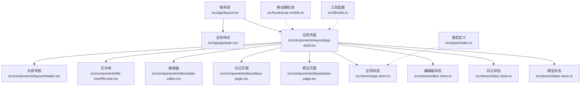
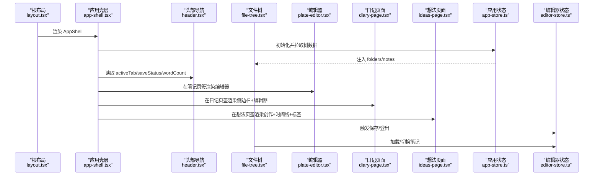
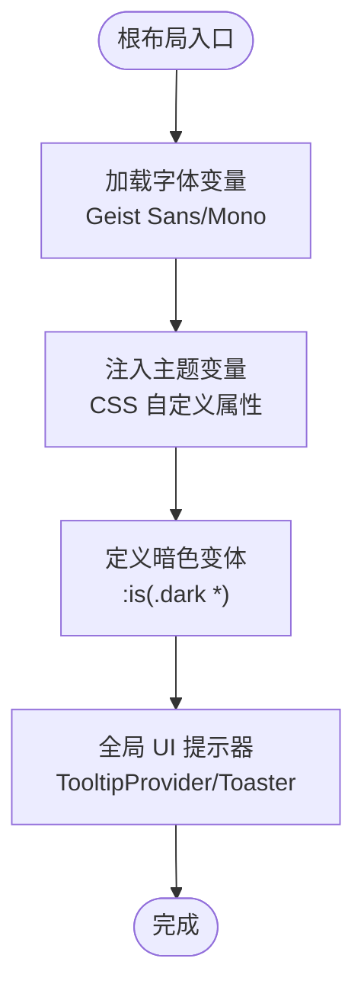
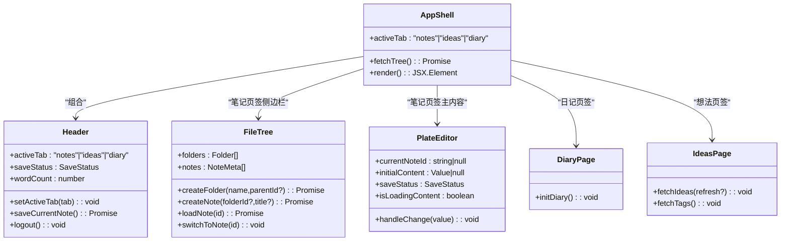
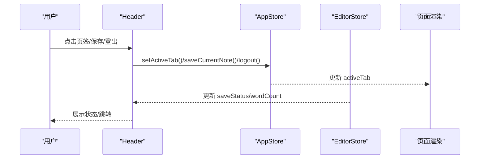
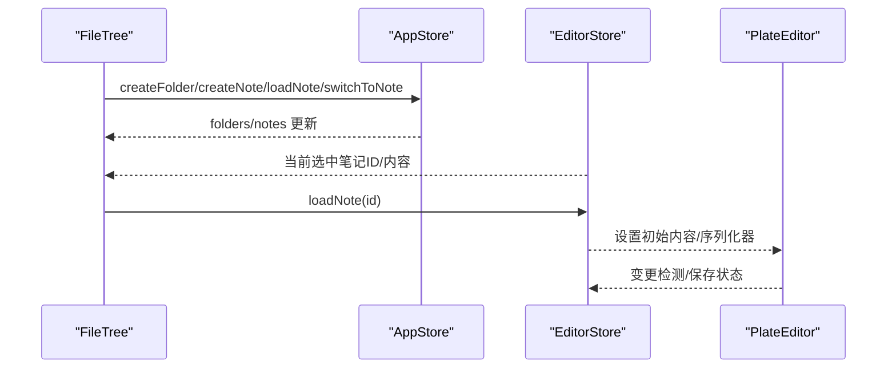
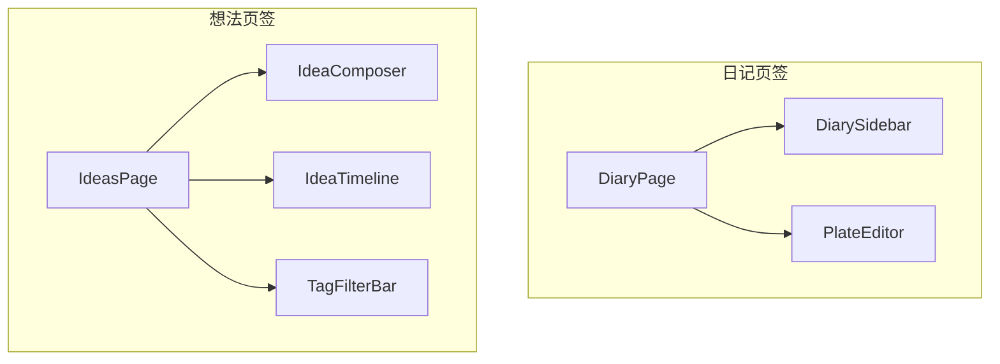
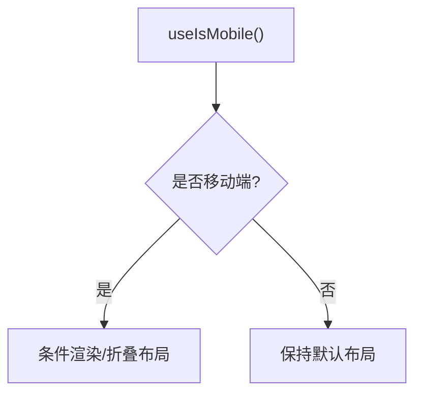
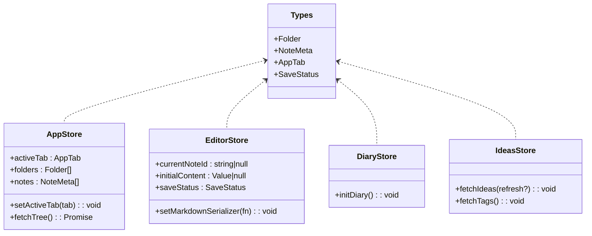
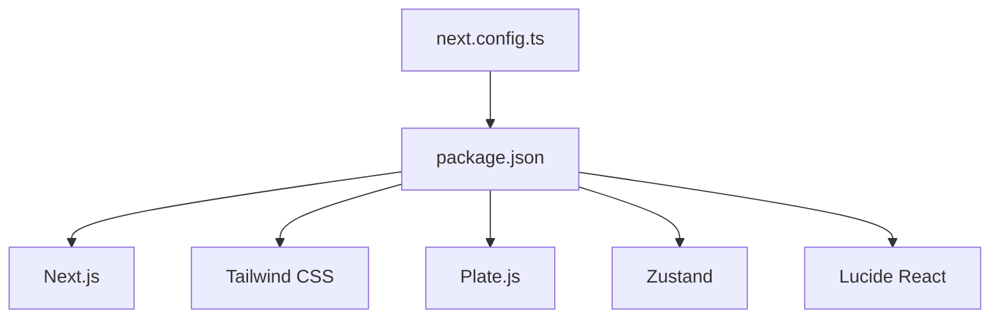

# 应用布局架构

<cite>
**本文引用的文件**
- [src/app/layout.tsx](file://src/app/layout.tsx)
- [src/app/globals.css](file://src/app/globals.css)
- [src/components/layout/app-shell.tsx](file://src/components/layout/app-shell.tsx)
- [src/components/layout/header.tsx](file://src/components/layout/header.tsx)
- [src/components/file-tree/file-tree.tsx](file://src/components/file-tree/file-tree.tsx)
- [src/components/editor/plate-editor.tsx](file://src/components/editor/plate-editor.tsx)
- [src/components/diary/diary-page.tsx](file://src/components/diary/diary-page.tsx)
- [src/components/ideas/ideas-page.tsx](file://src/components/ideas/ideas-page.tsx)
- [src/stores/app-store.ts](file://src/stores/app-store.ts)
- [src/stores/editor-store.ts](file://src/stores/editor-store.ts)
- [src/stores/diary-store.ts](file://src/stores/diary-store.ts)
- [src/stores/ideas-store.ts](file://src/stores/ideas-store.ts)
- [src/types/index.ts](file://src/types/index.ts)
- [src/hooks/use-mobile.ts](file://src/hooks/use-mobile.ts)
- [src/lib/utils.ts](file://src/lib/utils.ts)
- [package.json](file://package.json)
- [next.config.ts](file://next.config.ts)
</cite>

## 目录
1. [引言](#引言)
2. [项目结构](#项目结构)
3. [核心组件](#核心组件)
4. [架构总览](#架构总览)
5. [详细组件分析](#详细组件分析)
6. [依赖分析](#依赖分析)
7. [性能考虑](#性能考虑)
8. [故障排除指南](#故障排除指南)
9. [结论](#结论)
10. [附录](#附录)

## 引言
本文件系统性梳理 YNote v2 的应用布局架构，围绕 Next.js App Router 的根布局设计、全局样式与主题系统、AppShell 主容器模式、头部导航与侧边栏组织、主内容区编排、响应式与移动端适配、布局组件的职责分离与层次关系、Props 接口定义与状态管理集成，以及布局定制化最佳实践与扩展指南进行深入解析。

## 项目结构
YNote v2 采用 Next.js App Router 的 app 目录结构，根布局负责注入全局样式、字体变量与全局 UI 提示器；应用主容器 AppShell 负责组织头部、侧边栏与主内容区，并通过 Zustand 状态管理驱动不同功能页签（笔记、日记、想法）的切换与数据加载。

**图表来源**
- [src/app/layout.tsx:1-38](file://src/app/layout.tsx#L1-L38)
- [src/app/globals.css:1-227](file://src/app/globals.css#L1-L227)
- [src/components/layout/app-shell.tsx:1-43](file://src/components/layout/app-shell.tsx#L1-L43)
- [src/components/layout/header.tsx:1-116](file://src/components/layout/header.tsx#L1-L116)
- [src/components/file-tree/file-tree.tsx:1-326](file://src/components/file-tree/file-tree.tsx#L1-L326)
- [src/components/editor/plate-editor.tsx:1-175](file://src/components/editor/plate-editor.tsx#L1-L175)
- [src/components/diary/diary-page.tsx:1-29](file://src/components/diary/diary-page.tsx#L1-L29)
- [src/components/ideas/ideas-page.tsx:1-43](file://src/components/ideas/ideas-page.tsx#L1-L43)
- [src/stores/app-store.ts:1-318](file://src/stores/app-store.ts#L1-L318)
- [src/stores/editor-store.ts](file://src/stores/editor-store.ts)
- [src/stores/diary-store.ts](file://src/stores/diary-store.ts)
- [src/stores/ideas-store.ts](file://src/stores/ideas-store.ts)
- [src/types/index.ts:1-74](file://src/types/index.ts#L1-L74)
- [src/hooks/use-mobile.ts:1-21](file://src/hooks/use-mobile.ts#L1-L21)
- [src/lib/utils.ts:1-7](file://src/lib/utils.ts#L1-L7)

**章节来源**
- [src/app/layout.tsx:1-38](file://src/app/layout.tsx#L1-L38)
- [src/app/globals.css:1-227](file://src/app/globals.css#L1-L227)
- [src/components/layout/app-shell.tsx:1-43](file://src/components/layout/app-shell.tsx#L1-L43)

## 核心组件
- 根布局与主题系统：在根布局中引入 Google Fonts 变量字体并注入全局 CSS 变量，统一在全局样式中定义暗色变体与品牌色系，确保全站一致的主题与可定制性。
- AppShell 主容器：集中管理头部、侧边栏与主内容区的布局与可见性，基于活动页签控制不同区域的显示。
- 头部导航：提供页签切换、保存状态展示、字数统计与登出操作，连接编辑器状态与应用状态。
- 文件树与编辑器：文件树负责笔记与文件夹的增删改查与搜索，编辑器负责内容渲染与变更检测。
- 日记与想法页面：分别承载日记侧边栏与想法创作、时间线、标签过滤等子组件。

**章节来源**
- [src/app/layout.tsx:17-38](file://src/app/layout.tsx#L17-L38)
- [src/app/globals.css:6-103](file://src/app/globals.css#L6-L103)
- [src/components/layout/app-shell.tsx:12-42](file://src/components/layout/app-shell.tsx#L12-L42)
- [src/components/layout/header.tsx:10-115](file://src/components/layout/header.tsx#L10-L115)
- [src/components/file-tree/file-tree.tsx:22-326](file://src/components/file-tree/file-tree.tsx#L22-L326)
- [src/components/editor/plate-editor.tsx:63-175](file://src/components/editor/plate-editor.tsx#L63-L175)
- [src/components/diary/diary-page.tsx:8-28](file://src/components/diary/diary-page.tsx#L8-L28)
- [src/components/ideas/ideas-page.tsx:9-42](file://src/components/ideas/ideas-page.tsx#L9-L42)

## 架构总览
下图展示了从根布局到各功能页签的整体交互流程，包括状态初始化、数据加载与内容渲染路径。

**图表来源**
- [src/app/layout.tsx:22-38](file://src/app/layout.tsx#L22-L38)
- [src/components/layout/app-shell.tsx:12-42](file://src/components/layout/app-shell.tsx#L12-L42)
- [src/components/layout/header.tsx:10-115](file://src/components/layout/header.tsx#L10-L115)
- [src/components/file-tree/file-tree.tsx:22-326](file://src/components/file-tree/file-tree.tsx#L22-L326)
- [src/components/editor/plate-editor.tsx:63-175](file://src/components/editor/plate-editor.tsx#L63-L175)
- [src/components/diary/diary-page.tsx:8-28](file://src/components/diary/diary-page.tsx#L8-L28)
- [src/components/ideas/ideas-page.tsx:9-42](file://src/components/ideas/ideas-page.tsx#L9-L42)
- [src/stores/app-store.ts:49-82](file://src/stores/app-store.ts#L49-L82)
- [src/stores/editor-store.ts](file://src/stores/editor-store.ts)

## 详细组件分析

### 根布局与全局样式、字体与主题系统
- 字体配置：使用 next/font-google 注入 Geist Sans 与 Geist Mono 字体变量，根布局将字体变量类名绑定到 body，确保全局文本一致性。
- 全局样式：在全局 CSS 中定义 Tailwind 主题变量映射与暗色变体，统一背景、前景、卡片、输入、边框、品牌色等；同时内置代码块语法高亮的明暗两套规则。
- 全局提示：根布局包裹 TooltipProvider 并挂载全局通知组件，保证跨路由的交互反馈。

**图表来源**
- [src/app/layout.tsx:7-34](file://src/app/layout.tsx#L7-L34)
- [src/app/globals.css:6-103](file://src/app/globals.css#L6-L103)

**章节来源**
- [src/app/layout.tsx:7-34](file://src/app/layout.tsx#L7-L34)
- [src/app/globals.css:6-103](file://src/app/globals.css#L6-L103)

### AppShell 设计模式与职责分离
- 主容器职责：集中管理头部、侧边栏与主内容区的布局与可见性；根据活动页签切换显示不同的内容区域。
- 数据加载：在挂载时触发树数据拉取，确保文件树与笔记列表可用。
- 布局组织：使用 Flex 布局与高度约束，确保头部固定、内容自适应填充剩余空间；侧边栏宽度固定，主编辑器自适应。

**图表来源**
- [src/components/layout/app-shell.tsx:12-42](file://src/components/layout/app-shell.tsx#L12-L42)
- [src/components/layout/header.tsx:10-115](file://src/components/layout/header.tsx#L10-L115)
- [src/components/file-tree/file-tree.tsx:22-326](file://src/components/file-tree/file-tree.tsx#L22-L326)
- [src/components/editor/plate-editor.tsx:63-175](file://src/components/editor/plate-editor.tsx#L63-L175)
- [src/components/diary/diary-page.tsx:8-28](file://src/components/diary/diary-page.tsx#L8-L28)
- [src/components/ideas/ideas-page.tsx:9-42](file://src/components/ideas/ideas-page.tsx#L9-L42)

**章节来源**
- [src/components/layout/app-shell.tsx:12-42](file://src/components/layout/app-shell.tsx#L12-L42)

### 头部导航与页签切换
- 页签控制：通过应用状态切换 activeTab，影响 AppShell 中各区域的显示隐藏。
- 编辑器联动：当处于笔记或日记页签且存在选中条目时，显示字数统计、保存状态与保存按钮；保存按钮仅在“未保存”状态下显示。
- 登出逻辑：清除 token 后跳转登录页。

**图表来源**
- [src/components/layout/header.tsx:10-115](file://src/components/layout/header.tsx#L10-L115)
- [src/stores/app-store.ts:49-51](file://src/stores/app-store.ts#L49-L51)
- [src/stores/editor-store.ts](file://src/stores/editor-store.ts)

**章节来源**
- [src/components/layout/header.tsx:10-115](file://src/components/layout/header.tsx#L10-L115)
- [src/stores/app-store.ts:49-51](file://src/stores/app-store.ts#L49-L51)

### 文件树与编辑器协作
- 文件树职责：维护文件夹与笔记列表、支持创建/重命名/删除/展开/折叠、批量操作、归档/解档、搜索与结果展示；与编辑器状态联动以加载/切换笔记。
- 编辑器职责：基于 Plate.js 渲染富文本，提供变更检测、快照对比、序列化为 Markdown、滚动复位与历史清空等行为；在笔记切换时重置状态并更新基线内容。

**图表来源**
- [src/components/file-tree/file-tree.tsx:22-326](file://src/components/file-tree/file-tree.tsx#L22-L326)
- [src/stores/app-store.ts:84-100](file://src/stores/app-store.ts#L84-L100)
- [src/stores/editor-store.ts](file://src/stores/editor-store.ts)
- [src/components/editor/plate-editor.tsx:63-175](file://src/components/editor/plate-editor.tsx#L63-L175)

**章节来源**
- [src/components/file-tree/file-tree.tsx:22-326](file://src/components/file-tree/file-tree.tsx#L22-L326)
- [src/components/editor/plate-editor.tsx:63-175](file://src/components/editor/plate-editor.tsx#L63-L175)

### 日记与想法页面组织
- 日记页面：左侧为日记侧边栏，右侧为主编辑器，遵循与笔记页签相同的布局结构。
- 想法页面：左侧为创作区与时间线，右侧为标签筛选栏，支持按标签过滤与刷新数据。

**图表来源**
- [src/components/diary/diary-page.tsx:8-28](file://src/components/diary/diary-page.tsx#L8-L28)
- [src/components/ideas/ideas-page.tsx:9-42](file://src/components/ideas/ideas-page.tsx#L9-L42)

**章节来源**
- [src/components/diary/diary-page.tsx:8-28](file://src/components/diary/diary-page.tsx#L8-L28)
- [src/components/ideas/ideas-page.tsx:9-42](file://src/components/ideas/ideas-page.tsx#L9-L42)

### 响应式设计与移动端适配
- 移动端断点：通过自定义 Hook 暴露移动端断点判断，便于在组件内进行条件渲染或布局调整。
- 布局适配：当前布局以桌面优先为主，侧边栏宽度固定；如需移动端优化，可在组件内部结合断点进行折叠/抽屉化处理。

**图表来源**
- [src/hooks/use-mobile.ts:5-20](file://src/hooks/use-mobile.ts#L5-L20)

**章节来源**
- [src/hooks/use-mobile.ts:5-20](file://src/hooks/use-mobile.ts#L5-L20)

### Props 接口定义与状态管理集成
- 类型定义：通过统一的类型文件定义 Folder、NoteMeta、AppTab、SaveStatus 等核心类型，确保状态与组件 Props 的一致性。
- 状态集成：AppStore 负责树数据与页签状态；EditorStore 负责当前笔记内容、保存状态与序列化器；DiaryStore/IdeasStore 分别管理日记与想法的数据流。

**图表来源**
- [src/types/index.ts:1-74](file://src/types/index.ts#L1-L74)
- [src/stores/app-store.ts:49-82](file://src/stores/app-store.ts#L49-L82)
- [src/stores/editor-store.ts](file://src/stores/editor-store.ts)
- [src/stores/diary-store.ts](file://src/stores/diary-store.ts)
- [src/stores/ideas-store.ts](file://src/stores/ideas-store.ts)

**章节来源**
- [src/types/index.ts:1-74](file://src/types/index.ts#L1-L74)
- [src/stores/app-store.ts:49-82](file://src/stores/app-store.ts#L49-L82)

## 依赖分析
- 外部依赖：Next.js、Tailwind CSS、Plate.js、Lucide React、Zustand 等。
- 配置项：Next.config 中声明外部包与客户端请求体大小限制，确保服务端与构建环境稳定运行。

**图表来源**
- [package.json:13-99](file://package.json#L13-L99)
- [next.config.ts:3-14](file://next.config.ts#L3-L14)

**章节来源**
- [package.json:13-99](file://package.json#L13-L99)
- [next.config.ts:3-14](file://next.config.ts#L3-L14)

## 性能考虑
- 快速比较：编辑器变更检测采用结构化快照对比，避免昂贵的 JSON 序列化开销。
- 批量更新：文件树支持批量展开/折叠，前端乐观更新后异步同步至服务端。
- 内容缓存：删除笔记时清理编辑器缓存并重置当前笔记 ID，减少无效渲染。
- 体积控制：通过外部包配置与客户端体限制，平衡功能与性能。

**章节来源**
- [src/components/editor/plate-editor.tsx:16-61](file://src/components/editor/plate-editor.tsx#L16-L61)
- [src/components/file-tree/file-tree.tsx:159-187](file://src/components/file-tree/file-tree.tsx#L159-L187)
- [src/stores/app-store.ts:298-316](file://src/stores/app-store.ts#L298-L316)

## 故障排除指南
- 保存状态异常：检查编辑器状态中的 saveStatus 与当前笔记 ID 是否匹配；确认 handleChange 流程与序列化器设置。
- 树数据不更新：确认 AppStore 的 fetchTree 是否被调用；检查网络请求与错误日志。
- 登出后仍显示内容：确认 Cookie 清除与路由跳转逻辑；检查全局状态是否重置。
- 移动端布局错乱：结合 useIsMobile 判断进行条件渲染或布局调整。

**章节来源**
- [src/components/layout/header.tsx:20-27](file://src/components/layout/header.tsx#L20-L27)
- [src/stores/app-store.ts:69-82](file://src/stores/app-store.ts#L69-L82)
- [src/hooks/use-mobile.ts:5-20](file://src/hooks/use-mobile.ts#L5-L20)

## 结论
YNote v2 的布局架构以 Next.js App Router 为基础，通过根布局统一注入字体与主题，AppShell 实现头部、侧边栏与主内容区的清晰分层与职责分离；配合 Zustand 状态管理，实现笔记、日记、想法三大功能域的独立扩展与高效协作。全局样式与暗色变体提供一致的视觉体验，响应式与移动端检测为未来适配奠定基础。

## 附录
- 最佳实践
  - 将布局相关的样式与变量集中在全局 CSS 中，避免重复定义。
  - 使用 cn 工具函数合并条件样式，提升可读性与可维护性。
  - 对于复杂交互，优先在状态层抽象逻辑，组件层专注渲染。
- 扩展指南
  - 新增页签：在 AppShell 中添加区域渲染与状态联动；在 Header 中增加页签按钮。
  - 移动端优化：结合 useIsMobile 进行侧边栏折叠或抽屉化；调整栅格与间距。
  - 主题定制：通过 CSS 变量覆盖全局主题值，保持一致性与可替换性。

**章节来源**
- [src/lib/utils.ts:4-6](file://src/lib/utils.ts#L4-L6)
- [src/app/globals.css:59-103](file://src/app/globals.css#L59-L103)
- [src/hooks/use-mobile.ts:5-20](file://src/hooks/use-mobile.ts#L5-L20)