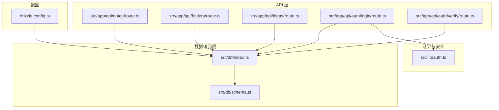
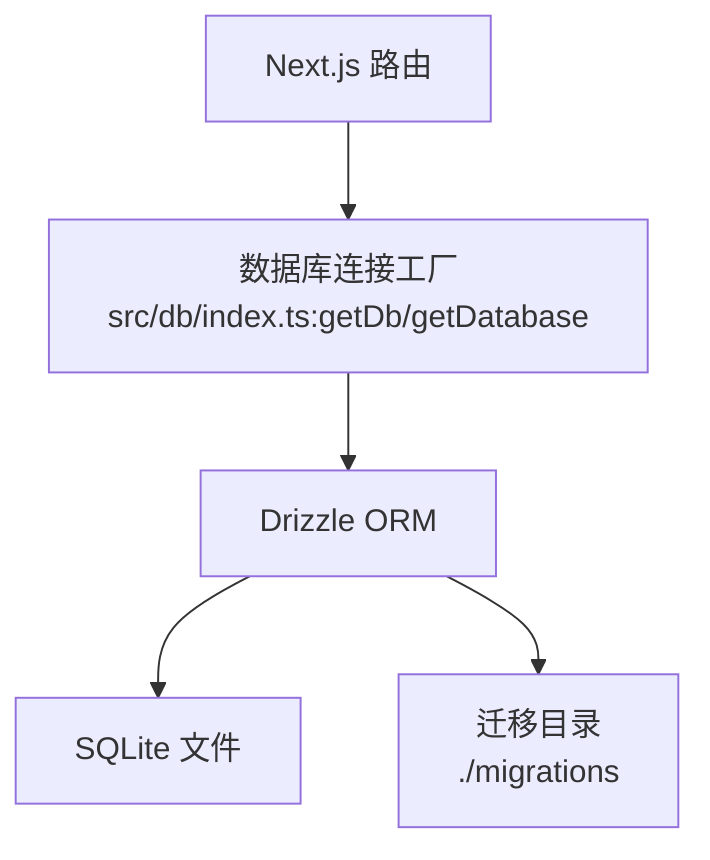
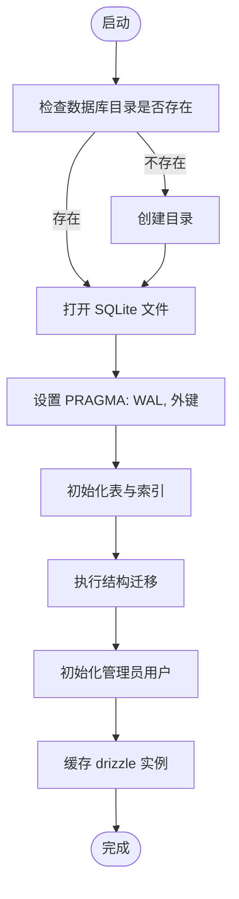
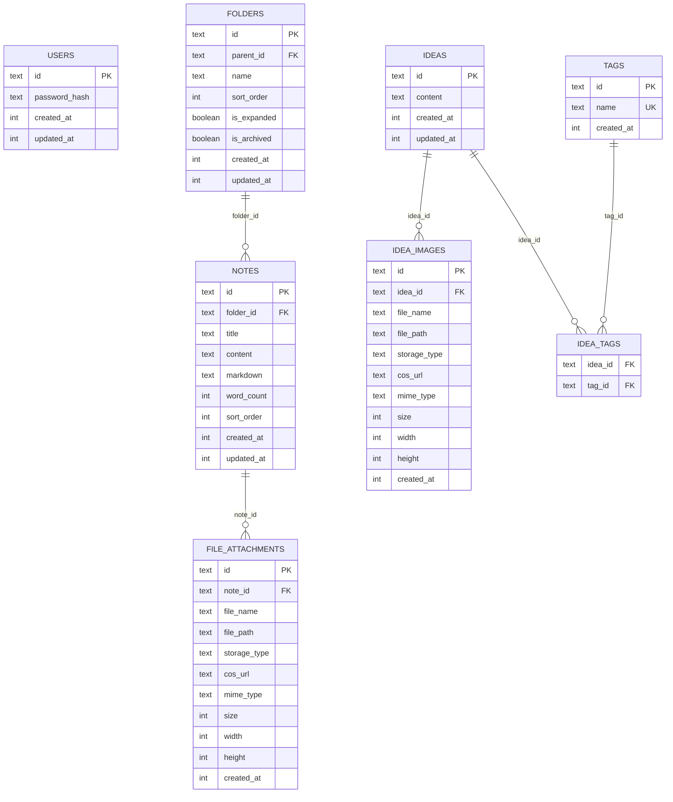
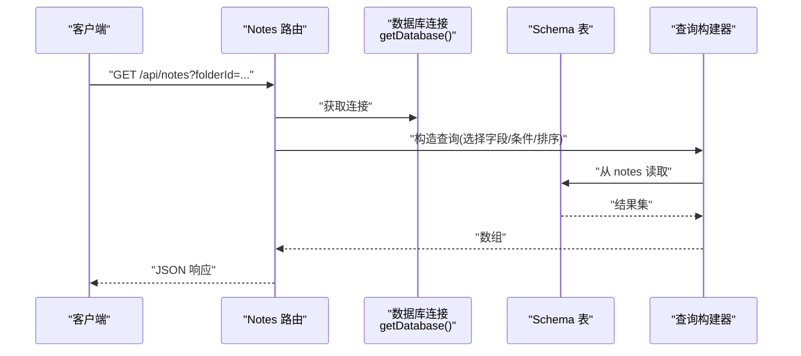
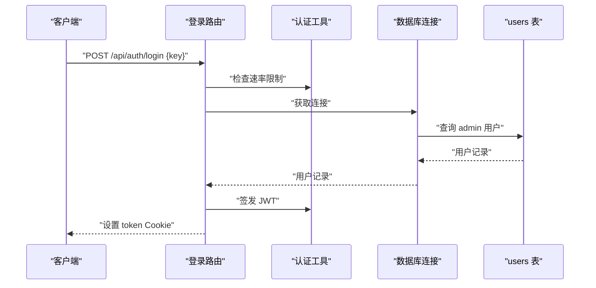
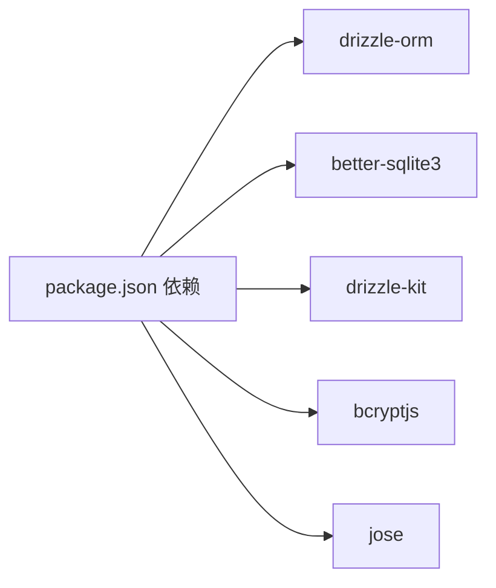

# 数据访问层

<cite>
**本文引用的文件**
- [drizzle.config.ts](file://drizzle.config.ts)
- [src/db/index.ts](file://src/db/index.ts)
- [src/db/schema.ts](file://src/db/schema.ts)
- [package.json](file://package.json)
- [src/app/api/notes/route.ts](file://src/app/api/notes/route.ts)
- [src/app/api/folders/route.ts](file://src/app/api/folders/route.ts)
- [src/app/api/ideas/route.ts](file://src/app/api/ideas/route.ts)
- [src/app/api/auth/login/route.ts](file://src/app/api/auth/login/route.ts)
- [src/app/api/auth/verify/route.ts](file://src/app/api/auth/verify/route.ts)
- [src/lib/auth.ts](file://src/lib/auth.ts)
</cite>

## 目录
1. [简介](#简介)
2. [项目结构](#项目结构)
3. [核心组件](#核心组件)
4. [架构总览](#架构总览)
5. [详细组件分析](#详细组件分析)
6. [依赖分析](#依赖分析)
7. [性能考虑](#性能考虑)
8. [故障排除指南](#故障排除指南)
9. [结论](#结论)
10. [附录](#附录)

## 简介
本文件系统性梳理 YNote v2 的数据访问层，重点覆盖以下方面：
- Drizzle ORM 集成与查询构建器使用模式
- 数据库连接管理、事务与连接池现状
- 数据模型设计与表关系映射
- 查询优化策略与索引设计原则
- 数据验证与约束检查机制
- 数据迁移策略与版本管理方案
- 数据库性能监控与故障排除
- 数据安全与备份恢复策略

## 项目结构
数据访问层由“配置 + 连接管理 + 模式定义 + API 使用”四部分组成：
- 配置：drizzle.config.ts 定义方言、模式入口与迁移输出目录
- 连接管理：src/db/index.ts 负责 SQLite 初始化、WAL/外键等 PRAGMA 设置、索引与迁移、单例连接
- 模式定义：src/db/schema.ts 使用 Drizzle SQLite 核心类型声明各表字段与关系
- API 使用：各路由通过 getDatabase 获取连接，使用 Drizzle 查询构建器执行 CRUD

图表来源
- [drizzle.config.ts:1-8](file://drizzle.config.ts#L1-L8)
- [src/db/index.ts:1-171](file://src/db/index.ts#L1-L171)
- [src/db/schema.ts:1-105](file://src/db/schema.ts#L1-L105)
- [src/app/api/notes/route.ts:1-86](file://src/app/api/notes/route.ts#L1-L86)
- [src/app/api/folders/route.ts:1-75](file://src/app/api/folders/route.ts#L1-L75)
- [src/app/api/ideas/route.ts:1-151](file://src/app/api/ideas/route.ts#L1-L151)
- [src/app/api/auth/login/route.ts:1-63](file://src/app/api/auth/login/route.ts#L1-L63)
- [src/app/api/auth/verify/route.ts:1-7](file://src/app/api/auth/verify/route.ts#L1-L7)
- [src/lib/auth.ts:1-26](file://src/lib/auth.ts#L1-L26)

章节来源
- [drizzle.config.ts:1-8](file://drizzle.config.ts#L1-L8)
- [src/db/index.ts:1-171](file://src/db/index.ts#L1-L171)
- [src/db/schema.ts:1-105](file://src/db/schema.ts#L1-L105)

## 核心组件
- Drizzle 配置：指定 SQLite 方言、模式入口与迁移输出目录，便于生成与应用迁移
- 数据库连接与初始化：集中于 getDb，设置 WAL、外键、索引、迁移与管理员用户初始化；通过单例避免重复连接
- 模式定义：以 sqliteTable + sqlite-core 类型声明字段、主键、默认值、外键约束与唯一性
- API 使用：在路由中调用 getDatabase 获取连接，使用 Drizzle 查询构建器进行选择、插入、更新、联接与排序

章节来源
- [drizzle.config.ts:1-8](file://drizzle.config.ts#L1-L8)
- [src/db/index.ts:10-25](file://src/db/index.ts#L10-L25)
- [src/db/index.ts:27-158](file://src/db/index.ts#L27-L158)
- [src/db/schema.ts:1-105](file://src/db/schema.ts#L1-L105)
- [src/app/api/notes/route.ts:10-40](file://src/app/api/notes/route.ts#L10-L40)
- [src/app/api/folders/route.ts:19-32](file://src/app/api/folders/route.ts#L19-L32)
- [src/app/api/ideas/route.ts:7-84](file://src/app/api/ideas/route.ts#L7-L84)

## 架构总览
Drizzle 在本项目中的角色是“本地 SQLite 的 ORM 抽象层”，通过 better-sqlite3 提供驱动，配合 WAL 模式与外键约束，实现高性能与一致性。API 层通过统一的 getDatabase 单例获取连接，减少资源开销。

图表来源
- [src/db/index.ts:10-25](file://src/db/index.ts#L10-L25)
- [src/db/index.ts:160-168](file://src/db/index.ts#L160-L168)
- [drizzle.config.ts:3-7](file://drizzle.config.ts#L3-L7)

## 详细组件分析

### 数据库连接与初始化（src/db/index.ts）
- 连接路径与目录：根据环境变量确定数据库文件路径，若目录不存在则自动创建
- PRAGMA 设置：启用 WAL 日志模式与外键约束，提升并发写入与参照完整性
- 表与索引初始化：一次性创建所有业务表及必要索引，确保查询效率
- 迁移与兼容：检测表结构变更（如新增归档字段），自动执行 ALTER；初始化管理员用户（基于环境变量）
- 单例模式：全局缓存 drizzle 实例，避免重复初始化

图表来源
- [src/db/index.ts:8-25](file://src/db/index.ts#L8-L25)
- [src/db/index.ts:27-158](file://src/db/index.ts#L27-L158)
- [src/db/index.ts:160-168](file://src/db/index.ts#L160-L168)

章节来源
- [src/db/index.ts:8-25](file://src/db/index.ts#L8-L25)
- [src/db/index.ts:27-158](file://src/db/index.ts#L27-L158)
- [src/db/index.ts:160-168](file://src/db/index.ts#L160-L168)

### 数据模型与关系映射（src/db/schema.ts）
- 用户表 users：主键 id，默认 admin，密码哈希，时间戳
- 文件夹表 folders：自引用外键 parent_id，支持层级结构；新增 isArchived 字段用于归档
- 笔记表 notes：folder_id 外键，可为空（根级笔记）；字段含标题、内容、字数、排序等
- 附件表 file_attachments：与笔记一对多，支持多种存储类型与元信息
- 想法表 ideas：内容与时间戳
- 想法图片表 idea_images：与 ideas 一对多
- 标签表 tags：唯一约束 name
- 想法标签关联表 idea_tags：复合主键 idea_id + tag_id，实现多对多

图表来源
- [src/db/schema.ts:3-104](file://src/db/schema.ts#L3-L104)

章节来源
- [src/db/schema.ts:1-105](file://src/db/schema.ts#L1-L105)

### 查询构建器使用模式（API 层）
- 基础查询：GET 请求中按 folderId 或根级条件筛选，排序后返回精简字段
- 插入与校验：POST 请求中对标题长度与非法字符进行校验，生成唯一 id，插入新记录
- 关联查询与分页：IDEAS 列表支持按标签过滤、游标分页与联接查询标签与图片
- 条件与排序：广泛使用 eq、lt、asc、desc、isNull 等谓词与排序组合

图表来源
- [src/app/api/notes/route.ts:10-40](file://src/app/api/notes/route.ts#L10-L40)
- [src/db/index.ts:163-168](file://src/db/index.ts#L163-L168)
- [src/db/schema.ts:27-39](file://src/db/schema.ts#L27-L39)

章节来源
- [src/app/api/notes/route.ts:10-40](file://src/app/api/notes/route.ts#L10-L40)
- [src/app/api/folders/route.ts:19-32](file://src/app/api/folders/route.ts#L19-L32)
- [src/app/api/ideas/route.ts:7-84](file://src/app/api/ideas/route.ts#L7-L84)

### 认证与令牌（登录与校验）
- 登录接口：校验速率限制，查询用户记录并比对密码哈希，成功后签发 JWT 并设置 HttpOnly Cookie
- 校验接口：仅用于确认中间件已验证令牌
- 令牌工具：使用 HS256 签发与验证，支持过期时间配置

图表来源
- [src/app/api/auth/login/route.ts:9-62](file://src/app/api/auth/login/route.ts#L9-L62)
- [src/lib/auth.ts:10-25](file://src/lib/auth.ts#L10-L25)
- [src/db/index.ts:163-168](file://src/db/index.ts#L163-L168)
- [src/db/schema.ts:3-8](file://src/db/schema.ts#L3-L8)

章节来源
- [src/app/api/auth/login/route.ts:1-63](file://src/app/api/auth/login/route.ts#L1-L63)
- [src/app/api/auth/verify/route.ts:1-7](file://src/app/api/auth/verify/route.ts#L1-L7)
- [src/lib/auth.ts:1-26](file://src/lib/auth.ts#L1-L26)

## 依赖分析
- Drizzle ORM 与 better-sqlite3：ORM 与驱动版本均来自依赖清单
- Drizzle Kit：用于生成迁移与模式同步
- bcryptjs：密码哈希与校验
- jose：JWT 签发与验证

图表来源
- [package.json:57-99](file://package.json#L57-L99)

章节来源
- [package.json:57-99](file://package.json#L57-L99)

## 性能考虑
- WAL 模式：提升并发写入吞吐，降低锁竞争
- 外键约束：保证参照完整性，避免脏数据
- 索引策略：
  - folders(parent_id)：支持层级查询
  - notes(folder_id)：支持按文件夹检索
  - file_attachments(note_id)：支持按笔记检索附件
  - idea_images(idea_id)、idea_tags(idea_id, tag_id)：支持想法与其标签/图片的快速联接
  - diaries(type, date)、diaries(year)、diaries(year, week_number)：支持按日/周统计与范围查询
- 查询优化建议：
  - 优先使用带索引的过滤条件（如 folder_id、idea_id、tag_id）
  - 分页采用游标（createdAt 小于）避免 OFFSET
  - 批量更新/插入时尽量合并为单次事务（当前未使用显式事务，可按需引入）

章节来源
- [src/db/index.ts:17-18](file://src/db/index.ts#L17-L18)
- [src/db/index.ts:73-75](file://src/db/index.ts#L73-L75)
- [src/db/index.ts:110-112](file://src/db/index.ts#L110-L112)
- [src/db/index.ts:127-129](file://src/db/index.ts#L127-L129)
- [src/app/api/ideas/route.ts:17-42](file://src/app/api/ideas/route.ts#L17-L42)

## 故障排除指南
- 连接失败或权限问题
  - 检查 DATABASE_PATH 是否可写，目录是否已创建
  - 确认 WAL 与外键 PRAGMA 已生效
- 表结构不一致
  - 使用 drizzle-kit 生成迁移并应用
  - 若缺少 is_archived 字段，初始化逻辑会自动添加
- 密码初始化失败
  - 确保 AUTH_SECRET_KEY 环境变量存在且有效
- 查询异常
  - 确认过滤条件与排序字段存在对应索引
  - 对大结果集使用游标分页
- 登录限流触发
  - 检查速率限制配置与 IP 头部传递情况

章节来源
- [src/db/index.ts:8-25](file://src/db/index.ts#L8-L25)
- [src/db/index.ts:132-158](file://src/db/index.ts#L132-L158)
- [drizzle.config.ts:3-7](file://drizzle.config.ts#L3-L7)
- [src/app/api/auth/login/route.ts:9-25](file://src/app/api/auth/login/route.ts#L9-L25)

## 结论
YNote v2 的数据访问层以 Drizzle ORM + better-sqlite3 为核心，结合 WAL 与外键、完善的索引与迁移机制，提供了稳定高效的本地数据库能力。API 层通过统一连接工厂与查询构建器，实现了清晰的数据访问模式。后续可在事务封装、游标分页与性能监控方面进一步增强。

## 附录

### 数据迁移策略与版本管理
- 使用 drizzle-kit 生成迁移脚本，输出到 ./migrations
- 在初始化阶段执行结构迁移（如新增列），保证运行时表结构一致
- 建议在部署前先生成并预览迁移，再应用到生产环境

章节来源
- [drizzle.config.ts:3-7](file://drizzle.config.ts#L3-L7)
- [src/db/index.ts:132-140](file://src/db/index.ts#L132-L140)

### 数据安全与备份恢复
- 访问控制：登录接口使用速率限制与强密码哈希；令牌使用 HttpOnly Cookie
- 传输安全：生产环境启用 secure Cookie
- 备份策略：定期复制 SQLite 文件；在 WAL 模式下可考虑关闭应用后进行一致性备份
- 恢复流程：停止服务 -> 替换数据库文件 -> 启动服务；验证关键查询与登录功能

章节来源
- [src/app/api/auth/login/route.ts:45-58](file://src/app/api/auth/login/route.ts#L45-L58)
- [src/lib/auth.ts:10-25](file://src/lib/auth.ts#L10-L25)
- [src/db/index.ts:17-18](file://src/db/index.ts#L17-L18)