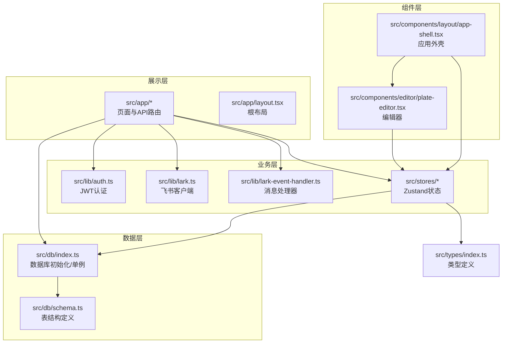
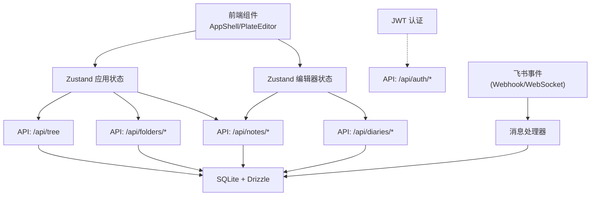
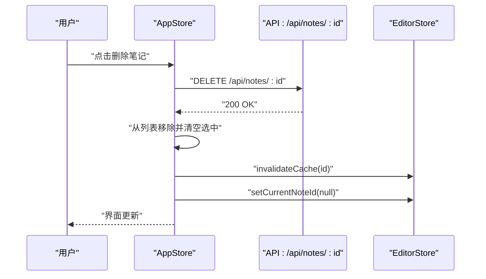
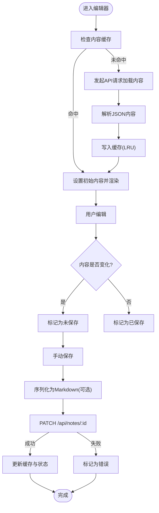
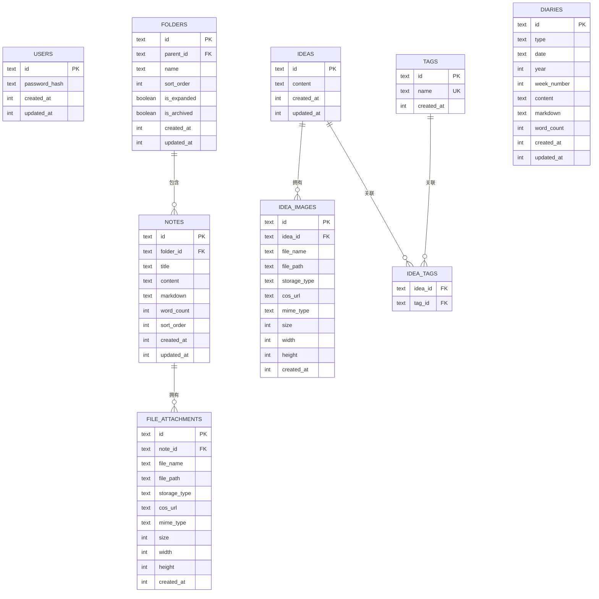
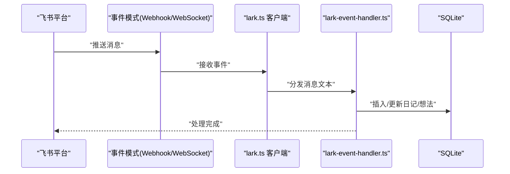
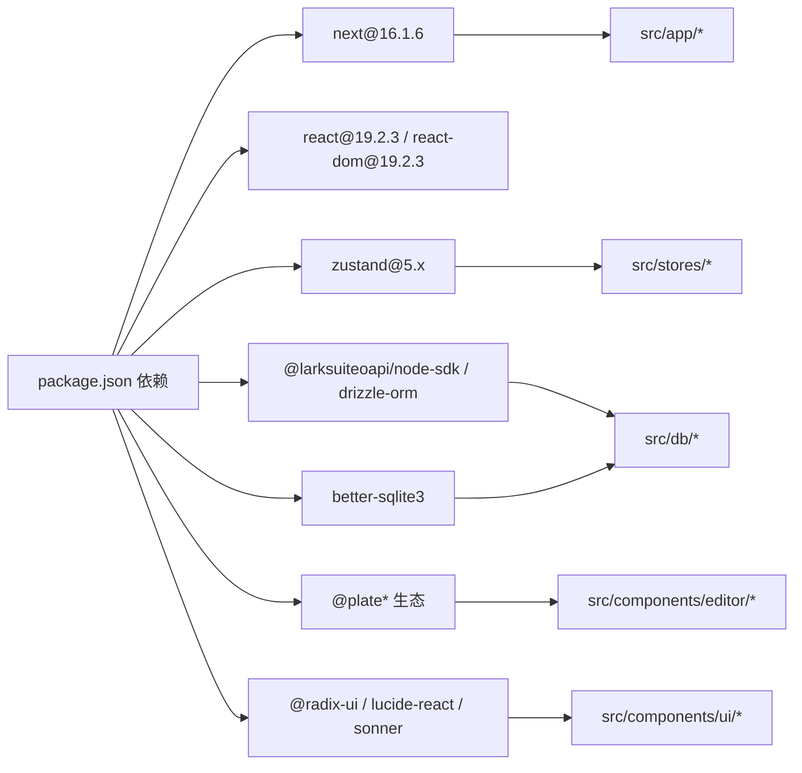

# 核心架构

<cite>
**本文引用的文件**
- [README.md](file://README.md)
- [package.json](file://package.json)
- [next.config.ts](file://next.config.ts)
- [src/app/layout.tsx](file://src/app/layout.tsx)
- [src/app/api/tree/route.ts](file://src/app/api/tree/route.ts)
- [src/lib/auth.ts](file://src/lib/auth.ts)
- [src/lib/lark.ts](file://src/lib/lark.ts)
- [src/lib/lark-event-handler.ts](file://src/lib/lark-event-handler.ts)
- [src/db/schema.ts](file://src/db/schema.ts)
- [src/db/index.ts](file://src/db/index.ts)
- [src/stores/app-store.ts](file://src/stores/app-store.ts)
- [src/stores/editor-store.ts](file://src/stores/editor-store.ts)
- [src/components/layout/app-shell.tsx](file://src/components/layout/app-shell.tsx)
- [src/components/editor/plate-editor.tsx](file://src/components/editor/plate-editor.tsx)
- [src/types/index.ts](file://src/types/index.ts)
</cite>

## 目录
1. [引言](#引言)
2. [项目结构](#项目结构)
3. [核心组件](#核心组件)
4. [架构总览](#架构总览)
5. [详细组件分析](#详细组件分析)
6. [依赖关系分析](#依赖关系分析)
7. [性能考量](#性能考量)
8. [故障排查指南](#故障排查指南)
9. [结论](#结论)
10. [附录](#附录)

## 引言
本文件为 YNote v2 的核心架构文档，聚焦于系统分层架构、组件化与状态管理、Next.js App Router 的使用与路由组织、目录结构与职责分离、数据流设计（从用户操作到状态更新再到 API 调用）、组件间通信与状态同步策略，并给出安全、监控与灾难恢复等跨领域关注点的建议与依据。同时，文档记录了技术栈选择与版本兼容性考量。

## 项目结构
YNote v2 基于 Next.js App Router 构建，采用“按功能域分层 + 组件化”的组织方式：
- 展示层：src/app 下的页面与 API 路由，负责渲染与请求处理
- 业务层：src/lib 与 src/stores 中的状态与工具逻辑
- 数据层：src/db 提供数据库初始化、Schema 定义与访问入口
- 组件层：src/components 提供可复用 UI 与业务组件
- 类型层：src/types 定义统一的数据模型与枚举

图表来源
- [src/app/layout.tsx:1-38](file://src/app/layout.tsx#L1-L38)
- [src/stores/app-store.ts:1-318](file://src/stores/app-store.ts#L1-L318)
- [src/stores/editor-store.ts:1-281](file://src/stores/editor-store.ts#L1-L281)
- [src/db/index.ts:1-171](file://src/db/index.ts#L1-L171)
- [src/db/schema.ts:1-105](file://src/db/schema.ts#L1-L105)
- [src/lib/auth.ts:1-26](file://src/lib/auth.ts#L1-L26)
- [src/lib/lark.ts:1-96](file://src/lib/lark.ts#L1-L96)
- [src/lib/lark-event-handler.ts:1-126](file://src/lib/lark-event-handler.ts#L1-L126)
- [src/components/layout/app-shell.tsx:1-43](file://src/components/layout/app-shell.tsx#L1-L43)
- [src/components/editor/plate-editor.tsx:1-175](file://src/components/editor/plate-editor.tsx#L1-L175)
- [src/types/index.ts:1-74](file://src/types/index.ts#L1-L74)

章节来源
- [src/app/layout.tsx:1-38](file://src/app/layout.tsx#L1-L38)
- [src/stores/app-store.ts:1-318](file://src/stores/app-store.ts#L1-L318)
- [src/stores/editor-store.ts:1-281](file://src/stores/editor-store.ts#L1-L281)
- [src/db/index.ts:1-171](file://src/db/index.ts#L1-L171)
- [src/db/schema.ts:1-105](file://src/db/schema.ts#L1-L105)
- [src/lib/auth.ts:1-26](file://src/lib/auth.ts#L1-L26)
- [src/lib/lark.ts:1-96](file://src/lib/lark.ts#L1-L96)
- [src/lib/lark-event-handler.ts:1-126](file://src/lib/lark-event-handler.ts#L1-L126)
- [src/components/layout/app-shell.tsx:1-43](file://src/components/layout/app-shell.tsx#L1-L43)
- [src/components/editor/plate-editor.tsx:1-175](file://src/components/editor/plate-editor.tsx#L1-L175)
- [src/types/index.ts:1-74](file://src/types/index.ts#L1-L74)

## 核心组件
- 应用外壳与路由组织：App Shell 负责根据当前标签页切换显示内容；页面级路由通过 Next.js App Router 管理。
- 状态管理：采用 Zustand 将应用状态（标签页、文件树、选中项、搜索）与编辑器状态（当前笔记、保存状态、缓存）解耦。
- 数据访问：Drizzle ORM + better-sqlite3 访问本地 SQLite 数据库，支持迁移与索引优化。
- 编辑器：基于 Plate.js 的富文本编辑器，提供插件化能力与序列化导出。
- 飞书集成：提供 Webhook/WebSocket 两种事件接入模式，统一消息处理与持久化。

章节来源
- [src/components/layout/app-shell.tsx:1-43](file://src/components/layout/app-shell.tsx#L1-L43)
- [src/stores/app-store.ts:1-318](file://src/stores/app-store.ts#L1-L318)
- [src/stores/editor-store.ts:1-281](file://src/stores/editor-store.ts#L1-L281)
- [src/db/index.ts:1-171](file://src/db/index.ts#L1-L171)
- [src/db/schema.ts:1-105](file://src/db/schema.ts#L1-L105)
- [src/components/editor/plate-editor.tsx:1-175](file://src/components/editor/plate-editor.tsx#L1-L175)
- [src/lib/lark.ts:1-96](file://src/lib/lark.ts#L1-L96)
- [src/lib/lark-event-handler.ts:1-126](file://src/lib/lark-event-handler.ts#L1-L126)

## 架构总览
系统采用分层架构：
- 表现层：Next.js App Router 页面与 API 路由，负责请求入口与渲染
- 业务层：状态管理（Zustand）、认证（JWT）、飞书事件处理
- 数据层：SQLite + Drizzle ORM，提供强一致与高性能读写
- 组件层：UI 组件与业务组件，通过状态驱动渲染

图表来源
- [src/components/layout/app-shell.tsx:1-43](file://src/components/layout/app-shell.tsx#L1-L43)
- [src/components/editor/plate-editor.tsx:1-175](file://src/components/editor/plate-editor.tsx#L1-L175)
- [src/stores/app-store.ts:1-318](file://src/stores/app-store.ts#L1-L318)
- [src/stores/editor-store.ts:1-281](file://src/stores/editor-store.ts#L1-L281)
- [src/app/api/tree/route.ts:1-36](file://src/app/api/tree/route.ts#L1-L36)
- [src/db/index.ts:1-171](file://src/db/index.ts#L1-L171)
- [src/lib/auth.ts:1-26](file://src/lib/auth.ts#L1-L26)
- [src/lib/lark-event-handler.ts:1-126](file://src/lib/lark-event-handler.ts#L1-L126)

## 详细组件分析

### 状态管理与数据流（App Store）
- 职责：维护应用级状态（标签页、文件树、选中项、搜索），封装对文件夹与笔记的增删改查 API 调用，并进行乐观更新与回滚。
- 关键流程：用户操作触发 store 方法，store 发起 fetch 请求，成功后更新内存状态；部分操作采用乐观更新提升体验，失败时回滚。
- 与编辑器协作：删除笔记时清理编辑器缓存并重置当前笔记 ID，确保状态一致性。

图表来源
- [src/stores/app-store.ts:298-316](file://src/stores/app-store.ts#L298-L316)
- [src/stores/editor-store.ts:277-279](file://src/stores/editor-store.ts#L277-L279)

章节来源
- [src/stores/app-store.ts:1-318](file://src/stores/app-store.ts#L1-L318)
- [src/stores/editor-store.ts:1-281](file://src/stores/editor-store.ts#L1-L281)

### 编辑器状态与内容缓存（Editor Store）
- 职责：管理当前编辑内容、保存状态、字数统计、内容缓存（LRU），以及手动保存流程。
- 内容比较：使用结构化比较避免全量 JSON 比较带来的性能问题。
- 缓存策略：命中缓存直接渲染；未命中则拉取 API 并写入缓存；超过容量时淘汰最久未使用条目。
- 保存流程：序列化为 Markdown（若可用），计算字数，调用 PATCH 接口，成功后更新缓存与状态。

图表来源
- [src/stores/editor-store.ts:114-155](file://src/stores/editor-store.ts#L114-L155)
- [src/stores/editor-store.ts:204-275](file://src/stores/editor-store.ts#L204-L275)
- [src/components/editor/plate-editor.tsx:84-99](file://src/components/editor/plate-editor.tsx#L84-L99)

章节来源
- [src/stores/editor-store.ts:1-281](file://src/stores/editor-store.ts#L1-L281)
- [src/components/editor/plate-editor.tsx:1-175](file://src/components/editor/plate-editor.tsx#L1-L175)

### 数据层与数据库设计
- 数据库：SQLite + better-sqlite3，WAL 模式与外键约束开启，保证一致性与并发稳定性。
- Schema：users、folders、notes、file_attachments、ideas、idea_images、tags、idea_tags、diaries。
- 初始化：自动创建缺失表与索引，支持迁移（如为 folders 新增 is_archived 字段），并按需初始化管理员账户。
- 访问：通过 Drizzle ORM 进行类型化查询与更新。

图表来源
- [src/db/schema.ts:1-105](file://src/db/schema.ts#L1-L105)
- [src/db/index.ts:27-158](file://src/db/index.ts#L27-L158)

章节来源
- [src/db/schema.ts:1-105](file://src/db/schema.ts#L1-L105)
- [src/db/index.ts:1-171](file://src/db/index.ts#L1-L171)

### 飞书集成与事件处理
- 客户端：支持 Webhook 与 WebSocket 两种模式，默认 Webhook；可配置加密密钥与校验令牌。
- 事件处理：统一的消息处理器根据前缀路由到日记或想法处理逻辑，分别持久化到 diaries 或 ideas 表。
- 安全：环境变量校验，未配置则抛错；可限制允许的用户 OpenID 集合。

图表来源
- [src/lib/lark.ts:1-96](file://src/lib/lark.ts#L1-L96)
- [src/lib/lark-event-handler.ts:1-126](file://src/lib/lark-event-handler.ts#L1-L126)
- [src/db/index.ts:1-171](file://src/db/index.ts#L1-L171)

章节来源
- [src/lib/lark.ts:1-96](file://src/lib/lark.ts#L1-L96)
- [src/lib/lark-event-handler.ts:1-126](file://src/lib/lark-event-handler.ts#L1-L126)

### 认证与安全
- JWT：使用 jose 实现 HS256 签名与校验，支持自定义过期时间与密钥。
- 环境变量：密钥、过期时间、飞书相关配置均来自环境变量，避免硬编码。
- 安全建议：生产环境务必替换默认密钥与过期时间；对敏感接口增加鉴权中间件。

章节来源
- [src/lib/auth.ts:1-26](file://src/lib/auth.ts#L1-L26)

### Next.js App Router 与路由组织
- 页面路由：src/app 下的 page.tsx 作为页面入口；API 路由位于 src/app/api/*，遵循 App Router 的约定式路由。
- 根布局：src/app/layout.tsx 提供全局样式与 Provider 包装。
- 配置：next.config.ts 声明外部依赖包与客户端最大请求体大小。

章节来源
- [src/app/layout.tsx:1-38](file://src/app/layout.tsx#L1-L38)
- [next.config.ts:1-17](file://next.config.ts#L1-L17)
- [src/app/api/tree/route.ts:1-36](file://src/app/api/tree/route.ts#L1-L36)

## 依赖关系分析

图表来源
- [package.json:13-99](file://package.json#L13-L99)
- [src/components/editor/plate-editor.tsx:1-10](file://src/components/editor/plate-editor.tsx#L1-L10)
- [src/stores/app-store.ts:1-3](file://src/stores/app-store.ts#L1-L3)
- [src/stores/editor-store.ts:1-3](file://src/stores/editor-store.ts#L1-L3)
- [src/db/index.ts:1-2](file://src/db/index.ts#L1-L2)

章节来源
- [package.json:1-119](file://package.json#L1-L119)

## 性能考量
- 状态更新策略：App Store 对部分操作采用乐观更新并批量异步提交，减少 UI 卡顿；失败时回滚，保障一致性。
- 编辑器性能：内容比较采用结构化对比，避免昂贵的 JSON 比较；编辑器在笔记切换时重置历史与选择，防止跨笔记状态污染。
- 缓存策略：编辑器实现 LRU 缓存，控制最大容量，命中缓存直接渲染，降低网络与解析开销。
- 数据库优化：WAL 模式与外键约束、索引（如 diaries 的复合索引）提升读写性能与查询效率。
- 资源体积：next.config.ts 允许较大的上传体，结合前端分页与懒加载策略，避免一次性加载过多数据。

章节来源
- [src/stores/app-store.ts:133-191](file://src/stores/app-store.ts#L133-L191)
- [src/stores/editor-store.ts:66-77](file://src/stores/editor-store.ts#L66-L77)
- [src/components/editor/plate-editor.tsx:16-61](file://src/components/editor/plate-editor.tsx#L16-L61)
- [src/db/index.ts:17-18](file://src/db/index.ts#L17-L18)
- [next.config.ts:11-13](file://next.config.ts#L11-L13)

## 故障排查指南
- 飞书事件未生效
  - 检查 LARK_APP_ID/LARK_APP_SECRET 是否正确配置
  - 确认事件模式（Webhook/WebSocket）与回调地址配置一致
  - 查看日志输出，确认消息前缀识别与处理分支
- 笔记保存失败
  - 检查网络与 API 返回码；编辑器保存状态会标记为 error
  - 确认 Markdown 序列化器可用，或显式传入 markdown 参数
- 文件树不刷新
  - 删除/重命名/归档等操作后，App Store 会触发 fetchTree 刷新；若失败，检查 /api/tree 的返回与异常日志
- 编辑器内容不同步
  - 切换笔记时会重置编辑器状态与历史；确认 currentNoteId 已更新且缓存命中

章节来源
- [src/lib/lark.ts:10-27](file://src/lib/lark.ts#L10-L27)
- [src/lib/lark-event-handler.ts:104-125](file://src/lib/lark-event-handler.ts#L104-L125)
- [src/stores/editor-store.ts:204-275](file://src/stores/editor-store.ts#L204-L275)
- [src/stores/app-store.ts:69-82](file://src/stores/app-store.ts#L69-L82)

## 结论
YNote v2 通过清晰的分层架构、组件化与状态管理、以及 SQLite + Drizzle ORM 的本地化数据方案，实现了高效、可扩展的个人知识管理应用。App Router 的约定式路由与 API 路由配合 Zustand 状态管理，使数据流从用户操作到状态更新再到 API 调用具备明确路径。飞书事件处理提供了与外部系统的无缝集成。后续可在安全、监控与灾难恢复方面进一步完善，以满足生产环境需求。

## 附录

### 技术栈与版本兼容性
- 运行时与框架：Next.js 16.1.6、React 19.2.3、TypeScript
- 状态管理：Zustand 5.x
- 数据库：better-sqlite3 + drizzle-orm
- 富文本：Plate.js 生态（@plate*）
- UI 组件：Radix UI、Lucide、Sonner
- 飞书 SDK：@larksuiteoapi/node-sdk
- 其他：bcryptjs、date-fns、sharp、cos-nodejs-sdk-v5、jose

章节来源
- [package.json:72-99](file://package.json#L72-L99)
- [next.config.ts:4-10](file://next.config.ts#L4-L10)