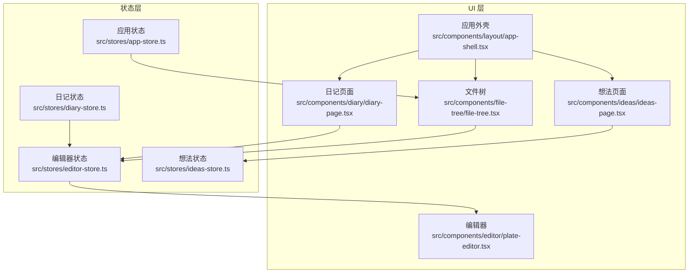
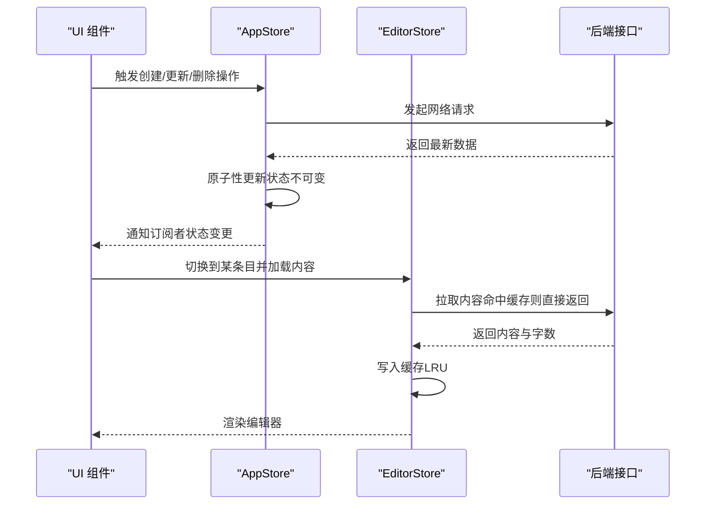
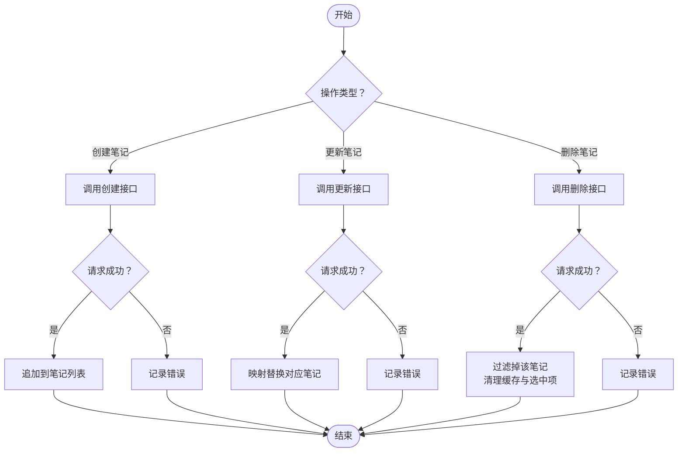
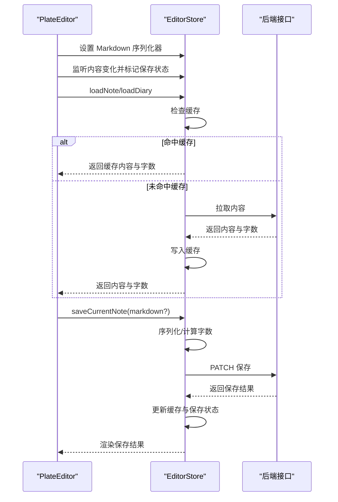
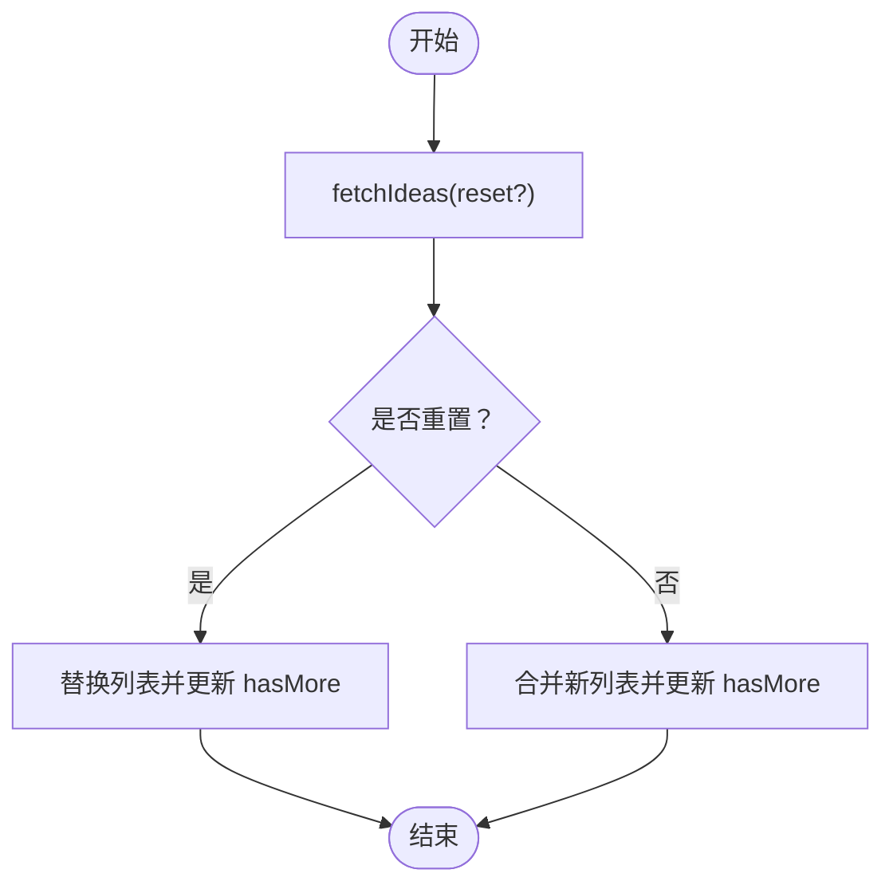
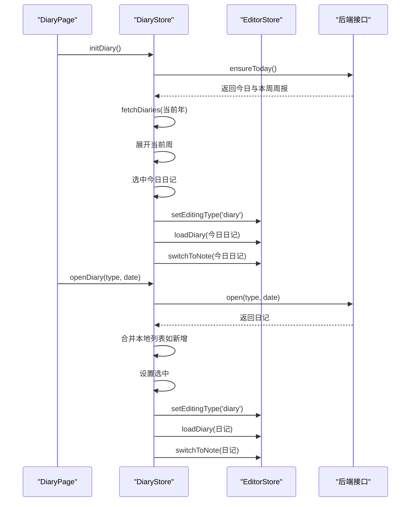
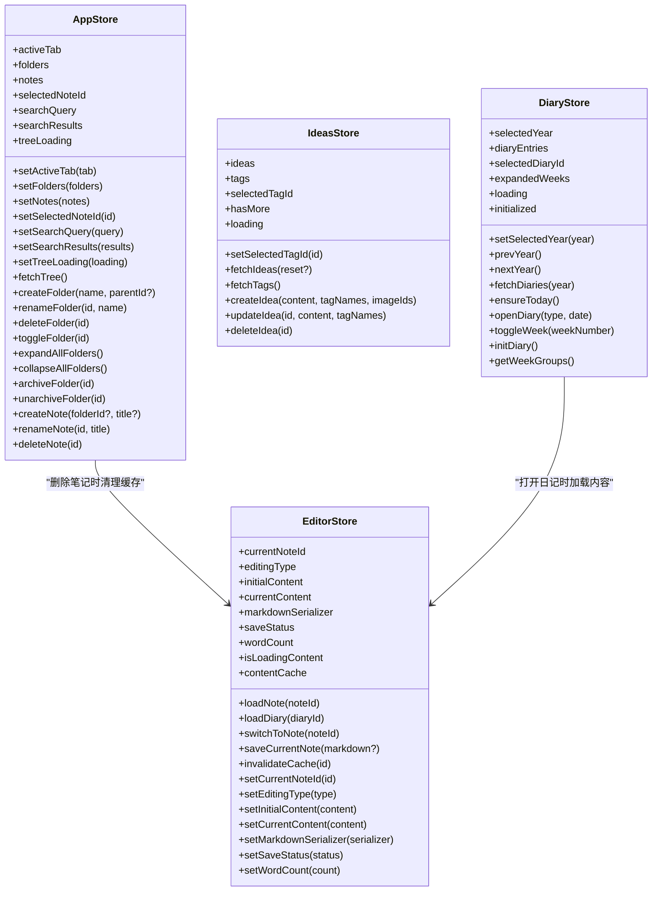
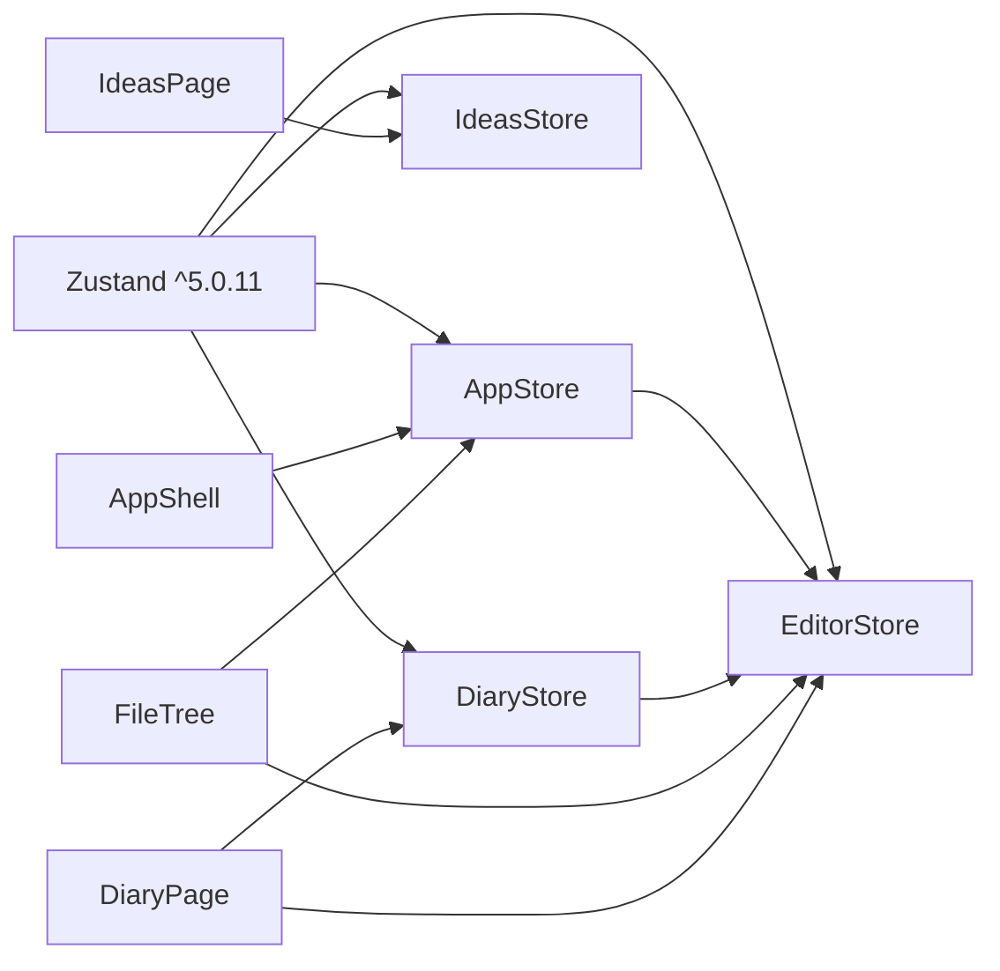

# 状态管理架构

<cite>
**本文引用的文件**
- [src/stores/app-store.ts](file://src/stores/app-store.ts)
- [src/stores/editor-store.ts](file://src/stores/editor-store.ts)
- [src/stores/ideas-store.ts](file://src/stores/ideas-store.ts)
- [src/stores/diary-store.ts](file://src/stores/diary-store.ts)
- [src/types/index.ts](file://src/types/index.ts)
- [src/components/editor/plate-editor.tsx](file://src/components/editor/plate-editor.tsx)
- [src/components/file-tree/file-tree.tsx](file://src/components/file-tree/file-tree.tsx)
- [src/components/layout/app-shell.tsx](file://src/components/layout/app-shell.tsx)
- [src/components/diary/diary-page.tsx](file://src/components/diary/diary-page.tsx)
- [src/components/ideas/ideas-page.tsx](file://src/components/ideas/ideas-page.tsx)
- [package.json](file://package.json)
</cite>

## 目录
1. [引言](#引言)
2. [项目结构](#项目结构)
3. [核心组件](#核心组件)
4. [架构总览](#架构总览)
5. [详细组件分析](#详细组件分析)
6. [依赖关系分析](#依赖关系分析)
7. [性能考量](#性能考量)
8. [故障排查指南](#故障排查指南)
9. [结论](#结论)
10. [附录](#附录)

## 引言
本文件系统性梳理 YNote v2 的状态管理架构，重点围绕 Zustand 状态库的选择与实现，阐述全局状态的设计模式（应用状态、编辑器状态、想法状态、日记状态），并覆盖状态持久化策略、跨组件同步机制、原子性与不可变性原则、订阅与副作用最佳实践、调试与性能监控策略，以及扩展与重构建议。目标是帮助开发者在不深入源码细节的前提下，快速理解并高效维护该状态体系。

## 项目结构
YNote v2 将状态管理集中在 src/stores 目录下，采用“按功能域划分”的 Store 设计：应用层（文件树、标签页切换、搜索）、编辑器层（内容缓存、保存状态、序列化）、想法层（想法列表、标签过滤）、日记层（周分组、选中日记、初始化）。UI 组件通过自定义 Hook 订阅对应 Store，实现解耦与高内聚。

图表来源
- [src/stores/app-store.ts:1-318](file://src/stores/app-store.ts#L1-L318)
- [src/stores/editor-store.ts:1-281](file://src/stores/editor-store.ts#L1-L281)
- [src/stores/ideas-store.ts:1-126](file://src/stores/ideas-store.ts#L1-L126)
- [src/stores/diary-store.ts:1-234](file://src/stores/diary-store.ts#L1-L234)
- [src/components/layout/app-shell.tsx:1-43](file://src/components/layout/app-shell.tsx#L1-L43)
- [src/components/file-tree/file-tree.tsx:1-326](file://src/components/file-tree/file-tree.tsx#L1-L326)
- [src/components/editor/plate-editor.tsx:1-175](file://src/components/editor/plate-editor.tsx#L1-L175)
- [src/components/ideas/ideas-page.tsx:1-43](file://src/components/ideas/ideas-page.tsx#L1-L43)
- [src/components/diary/diary-page.tsx:1-29](file://src/components/diary/diary-page.tsx#L1-L29)

章节来源
- [src/stores/app-store.ts:1-318](file://src/stores/app-store.ts#L1-L318)
- [src/stores/editor-store.ts:1-281](file://src/stores/editor-store.ts#L1-L281)
- [src/stores/ideas-store.ts:1-126](file://src/stores/ideas-store.ts#L1-L126)
- [src/stores/diary-store.ts:1-234](file://src/stores/diary-store.ts#L1-L234)
- [src/components/layout/app-shell.tsx:1-43](file://src/components/layout/app-shell.tsx#L1-L43)
- [src/components/file-tree/file-tree.tsx:1-326](file://src/components/file-tree/file-tree.tsx#L1-L326)
- [src/components/editor/plate-editor.tsx:1-175](file://src/components/editor/plate-editor.tsx#L1-L175)
- [src/components/ideas/ideas-page.tsx:1-43](file://src/components/ideas/ideas-page.tsx#L1-L43)
- [src/components/diary/diary-page.tsx:1-29](file://src/components/diary/diary-page.tsx#L1-L29)

## 核心组件
- 应用状态（AppStore）
  - 负责标签页切换、文件树数据、选中笔记、搜索查询与结果、文件夹/笔记的增删改查等。
  - 提供批量展开/折叠、归档/取消归档等交互优化，采用乐观更新与回滚策略提升体验。
- 编辑器状态（EditorStore）
  - 负责当前编辑条目、初始内容、当前编辑内容、Markdown 序列化回调、保存状态、字数统计、内容缓存（LRU）。
  - 支持笔记与日记两种编辑类型，并在保存后更新缓存与字数。
- 想法状态（IdeasStore）
  - 负责想法列表、标签集合、加载更多、筛选标签、创建/更新/删除想法。
  - 通过游标分页与重置刷新，保持列表增量与一致性。
- 日记状态（DiaryStore）
  - 负责年份切换、日记列表、选中日记、周分组展开/折叠、初始化今日日记与周报。
  - 与编辑器状态联动，打开日记时自动切换编辑类型并加载内容。

章节来源
- [src/stores/app-store.ts:5-47](file://src/stores/app-store.ts#L5-L47)
- [src/stores/editor-store.ts:15-64](file://src/stores/editor-store.ts#L15-L64)
- [src/stores/ideas-store.ts:4-18](file://src/stores/ideas-store.ts#L4-L18)
- [src/stores/diary-store.ts:21-38](file://src/stores/diary-store.ts#L21-L38)

## 架构总览
Zustand 在本项目中的定位是轻量、直观且高性能的状态容器。各 Store 以函数式方式导出 Hook，UI 组件通过选择器订阅所需字段，避免不必要的重渲染；同时通过跨 Store 调用（如 DiaryStore 调用 EditorStore）实现业务协同。

图表来源
- [src/stores/app-store.ts:69-131](file://src/stores/app-store.ts#L69-L131)
- [src/stores/editor-store.ts:114-198](file://src/stores/editor-store.ts#L114-L198)
- [src/components/file-tree/file-tree.tsx:65-77](file://src/components/file-tree/file-tree.tsx#L65-L77)
- [src/components/diary/diary-page.tsx:11-13](file://src/components/diary/diary-page.tsx#L11-L13)

## 详细组件分析

### 应用状态（AppStore）分析
- 设计要点
  - 使用原子更新函数 set 保证状态变更的原子性；对数组/对象采用浅拷贝与映射，遵循不可变更新。
  - 文件夹/笔记的增删改查均通过一次网络请求完成，成功后在本地进行最小化更新。
  - 批量展开/折叠采用乐观更新：UI 先立即响应，随后并发更新后端；失败时回滚。
  - 删除文件夹会触发树刷新，确保级联删除与笔记重新分配后的数据一致性。
- 关键流程（创建/更新/删除笔记）
  - 创建：调用后端接口，成功后将新笔记追加至列表。
  - 更新：PATCH 请求后，使用映射替换对应笔记。
  - 删除：DELETE 请求后，过滤掉该笔记，并清理编辑器缓存与当前选中项。
- 搜索与树加载
  - 搜索通过防抖触发，避免频繁请求；树加载时设置 loading 标志，统一 UI 反馈。

图表来源
- [src/stores/app-store.ts:263-316](file://src/stores/app-store.ts#L263-L316)

章节来源
- [src/stores/app-store.ts:69-131](file://src/stores/app-store.ts#L69-L131)
- [src/stores/app-store.ts:263-316](file://src/stores/app-store.ts#L263-L316)

### 编辑器状态（EditorStore）分析
- 设计要点
  - LRU 内容缓存：Map 存储 {content, wordCount, timestamp}，超过阈值时淘汰最久未访问项。
  - 快速比较：提供节点级相等性判断，避免 JSON 序列化带来的性能损耗。
  - 保存流程：序列化为 JSON 与 Markdown，计算字数，PATCH 接口保存；成功后更新缓存与保存状态。
  - 与 Plate 编辑器集成：设置 Markdown 序列化器，监听内容变化并标记保存状态。
- 关键流程（加载/保存）
  - 加载：优先从缓存读取；缓存缺失则拉取接口，解析内容并写入缓存。
  - 保存：根据编辑类型选择不同接口，生成 Markdown（若可用），提交后更新缓存与字数。

图表来源
- [src/stores/editor-store.ts:114-198](file://src/stores/editor-store.ts#L114-L198)
- [src/stores/editor-store.ts:204-275](file://src/stores/editor-store.ts#L204-L275)
- [src/components/editor/plate-editor.tsx:84-99](file://src/components/editor/plate-editor.tsx#L84-L99)
- [src/components/editor/plate-editor.tsx:146-153](file://src/components/editor/plate-editor.tsx#L146-L153)

章节来源
- [src/stores/editor-store.ts:15-64](file://src/stores/editor-store.ts#L15-L64)
- [src/stores/editor-store.ts:114-198](file://src/stores/editor-store.ts#L114-L198)
- [src/stores/editor-store.ts:204-275](file://src/stores/editor-store.ts#L204-L275)
- [src/components/editor/plate-editor.tsx:84-99](file://src/components/editor/plate-editor.tsx#L84-L99)
- [src/components/editor/plate-editor.tsx:146-153](file://src/components/editor/plate-editor.tsx#L146-L153)

### 想法状态（IdeasStore）分析
- 设计要点
  - 标签筛选：通过 selectedTagId 控制过滤；每次筛选触发重置刷新。
  - 分页策略：首次加载 reset=true，后续增量加载；使用游标（createdAt）控制下一页。
  - 标签计数：创建/更新/删除想法后刷新标签列表，保持计数准确。
- 关键流程（加载/创建/更新/删除）
  - 加载：根据是否重置决定合并或替换列表；hasMore 控制是否还有下一页。
  - 创建/更新/删除：成功后更新列表并刷新标签。

图表来源
- [src/stores/ideas-store.ts:29-59](file://src/stores/ideas-store.ts#L29-L59)

章节来源
- [src/stores/ideas-store.ts:4-18](file://src/stores/ideas-store.ts#L4-L18)
- [src/stores/ideas-store.ts:29-59](file://src/stores/ideas-store.ts#L29-L59)
- [src/stores/ideas-store.ts:73-124](file://src/stores/ideas-store.ts#L73-L124)

### 日记状态（DiaryStore）分析
- 设计要点
  - 年份导航：prevYear/nextYear/selectedYear 协同工作，切换时自动拉取当年日记。
  - 初始化流程：ensureToday 确保今日日记与本周周报存在，随后拉取当年列表、展开当前周并自动打开今日日记。
  - 周分组：按周号聚合日/周条目，当前周显示至今日的所有日期，历史周仅显示有条目的日期。
  - 与编辑器联动：openDiary 成功后更新本地列表、设置选中项、切换编辑类型并加载内容。
- 关键流程（初始化/打开日记）
  - 初始化：ensureToday → fetchDiaries → 展开当前周 → 自动打开今日日记。
  - 打开：POST 获取/创建日记 → 合并本地列表 → 设置选中 → 切换编辑类型 → 加载内容。

图表来源
- [src/stores/diary-store.ts:153-184](file://src/stores/diary-store.ts#L153-L184)
- [src/stores/diary-store.ts:102-142](file://src/stores/diary-store.ts#L102-L142)
- [src/components/diary/diary-page.tsx:11-13](file://src/components/diary/diary-page.tsx#L11-L13)

章节来源
- [src/stores/diary-store.ts:21-38](file://src/stores/diary-store.ts#L21-L38)
- [src/stores/diary-store.ts:69-82](file://src/stores/diary-store.ts#L69-L82)
- [src/stores/diary-store.ts:153-184](file://src/stores/diary-store.ts#L153-L184)
- [src/stores/diary-store.ts:102-142](file://src/stores/diary-store.ts#L102-L142)

### 类图：状态模型与依赖

图表来源
- [src/stores/app-store.ts:5-47](file://src/stores/app-store.ts#L5-L47)
- [src/stores/editor-store.ts:15-64](file://src/stores/editor-store.ts#L15-L64)
- [src/stores/ideas-store.ts:4-18](file://src/stores/ideas-store.ts#L4-L18)
- [src/stores/diary-store.ts:21-38](file://src/stores/diary-store.ts#L21-L38)

## 依赖关系分析
- 外部依赖
  - Zustand 版本：^5.0.11，提供轻量、易用的状态容器能力。
- 内部依赖
  - AppStore 依赖 EditorStore（删除笔记时清理缓存与当前选中项）。
  - DiaryStore 依赖 EditorStore（打开日记时切换编辑类型并加载内容）。
  - UI 组件通过选择器订阅 Store，减少耦合度与重渲染范围。

图表来源
- [package.json:99-99](file://package.json#L99-L99)
- [src/stores/app-store.ts:3-3](file://src/stores/app-store.ts#L3-L3)
- [src/stores/diary-store.ts:3-3](file://src/stores/diary-store.ts#L3-L3)
- [src/components/layout/app-shell.tsx:8-8](file://src/components/layout/app-shell.tsx#L8-L8)
- [src/components/file-tree/file-tree.tsx:4-5](file://src/components/file-tree/file-tree.tsx#L4-L5)
- [src/components/diary/diary-page.tsx:5-5](file://src/components/diary/diary-page.tsx#L5-L5)
- [src/components/ideas/ideas-page.tsx:4-4](file://src/components/ideas/ideas-page.tsx#L4-L4)

章节来源
- [package.json:99-99](file://package.json#L99-L99)
- [src/stores/app-store.ts:3-3](file://src/stores/app-store.ts#L3-L3)
- [src/stores/diary-store.ts:3-3](file://src/stores/diary-store.ts#L3-L3)
- [src/components/layout/app-shell.tsx:8-8](file://src/components/layout/app-shell.tsx#L8-L8)
- [src/components/file-tree/file-tree.tsx:4-5](file://src/components/file-tree/file-tree.tsx#L4-L5)
- [src/components/diary/diary-page.tsx:5-5](file://src/components/diary/diary-page.tsx#L5-L5)
- [src/components/ideas/ideas-page.tsx:4-4](file://src/components/ideas/ideas-page.tsx#L4-L4)

## 性能考量
- 原子性与不可变性
  - 使用 set 与函数式更新，避免中间态污染；对数组/对象采用浅拷贝与映射，确保不可变更新。
- 缓存与去抖
  - 编辑器采用 LRU 缓存，限制最大容量；文件树搜索使用防抖，降低请求频率。
- 乐观更新与回滚
  - 批量展开/折叠与归档/取消归档采用乐观更新，失败时回滚，提升交互流畅度。
- 订阅粒度
  - UI 通过选择器订阅所需字段，避免无关状态导致的重渲染。
- 序列化与比较
  - 编辑器使用节点级相等性判断，避免昂贵的 JSON 比较。

章节来源
- [src/stores/editor-store.ts:66-77](file://src/stores/editor-store.ts#L66-L77)
- [src/stores/editor-store.ts:204-275](file://src/stores/editor-store.ts#L204-L275)
- [src/components/file-tree/file-tree.tsx:111-122](file://src/components/file-tree/file-tree.tsx#L111-L122)
- [src/stores/app-store.ts:149-191](file://src/stores/app-store.ts#L149-L191)
- [src/stores/app-store.ts:193-261](file://src/stores/app-store.ts#L193-L261)
- [src/components/editor/plate-editor.tsx:16-61](file://src/components/editor/plate-editor.tsx#L16-L61)

## 故障排查指南
- 常见问题
  - 网络请求失败：各异步操作均包含 try/catch 与错误日志输出，检查控制台与网络面板。
  - 状态不一致：删除/归档等操作后需刷新树或标签列表，确保本地状态与服务端一致。
  - 编辑器内容未更新：确认保存状态已变为 saved，且缓存已更新；必要时调用 invalidateCache。
- 调试建议
  - 在开发环境开启严格模式与 React DevTools，观察组件重渲染次数。
  - 对关键状态（如 contentCache、diaryEntries）进行断点或日志输出，验证更新路径。
- 性能监控
  - 使用浏览器性能面板观察编辑器输入时的渲染耗时；对高频更新（如搜索）增加节流/去抖。
  - 监控缓存命中率与大小，避免内存膨胀。

章节来源
- [src/stores/app-store.ts:77-79](file://src/stores/app-store.ts#L77-L79)
- [src/stores/editor-store.ts:150-154](file://src/stores/editor-store.ts#L150-L154)
- [src/stores/ideas-store.ts:54-58](file://src/stores/ideas-store.ts#L54-L58)
- [src/stores/diary-store.ts:180-184](file://src/stores/diary-store.ts#L180-L184)

## 结论
YNote v2 的状态管理以 Zustand 为核心，结合清晰的功能域划分与严格的原子性/不可变性原则，实现了高可维护性的前端状态体系。通过 LRU 缓存、乐观更新、细粒度订阅与序列化优化，兼顾了性能与用户体验。未来可在以下方面持续演进：引入更完善的调试工具链、增强类型安全与边界校验、探索状态快照与时间旅行调试能力。

## 附录
- 类型定义概览
  - 文件夹、笔记、想法、日记等核心实体类型集中于类型文件，确保 Store 与 UI 的契约清晰。
- 组件与 Store 的绑定
  - AppShell 作为壳层协调三个功能区；FileTree、DiaryPage、IdeasPage 分别驱动对应 Store 的初始化与刷新。

章节来源
- [src/types/index.ts:1-74](file://src/types/index.ts#L1-L74)
- [src/components/layout/app-shell.tsx:12-18](file://src/components/layout/app-shell.tsx#L12-L18)
- [src/components/file-tree/file-tree.tsx:16-18](file://src/components/file-tree/file-tree.tsx#L16-L18)
- [src/components/ideas/ideas-page.tsx:14-23](file://src/components/ideas/ideas-page.tsx#L14-L23)
- [src/components/diary/diary-page.tsx:11-13](file://src/components/diary/diary-page.tsx#L11-L13)