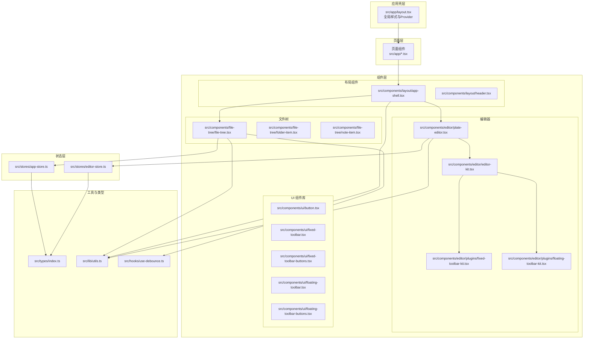
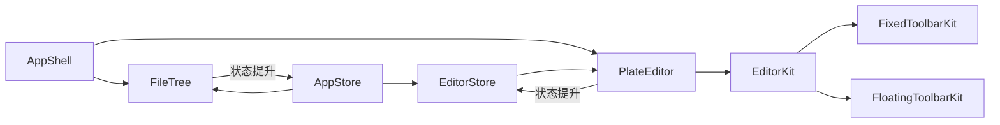
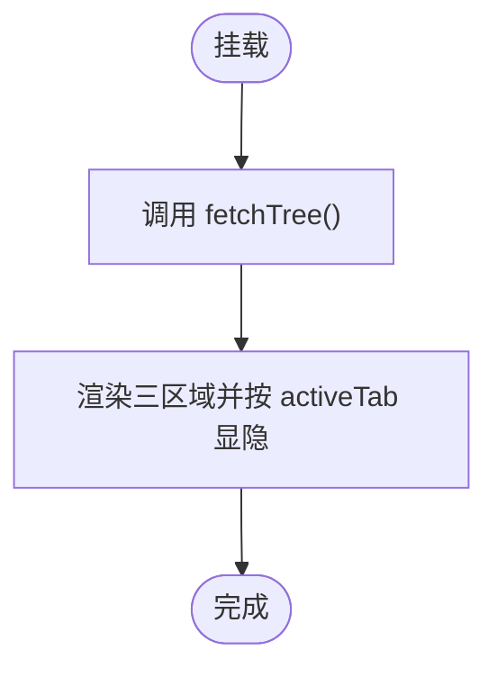
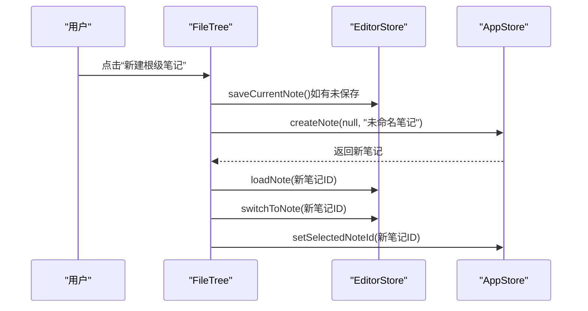
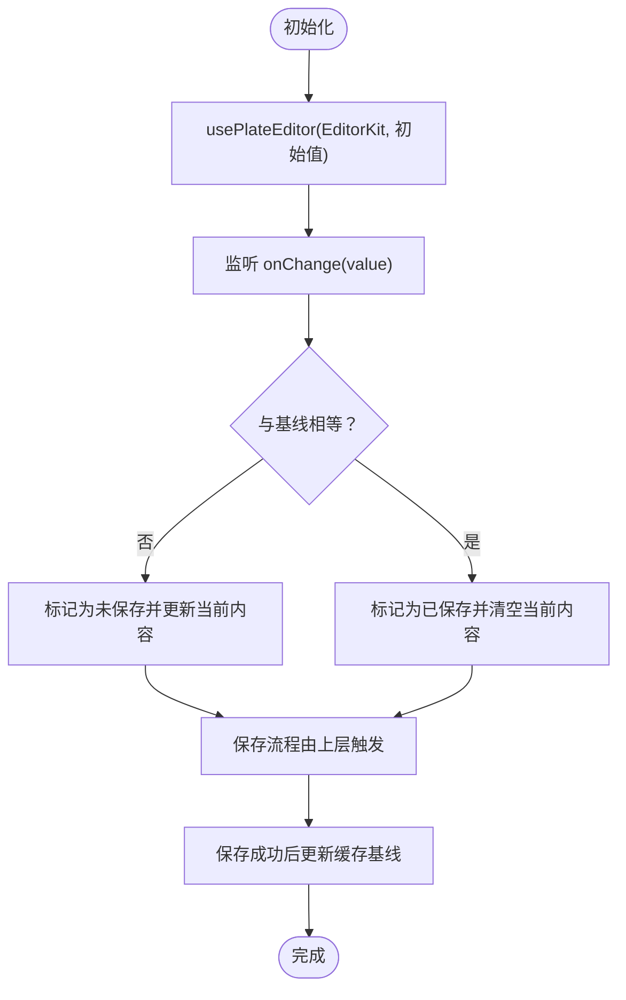
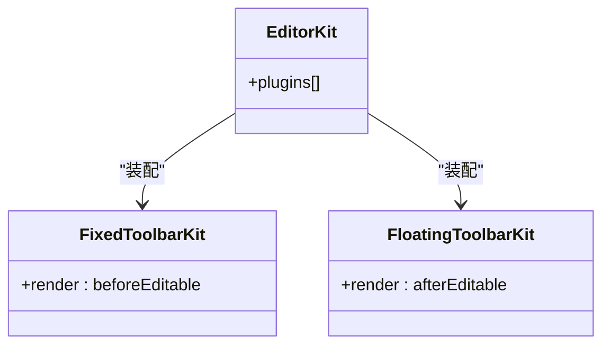
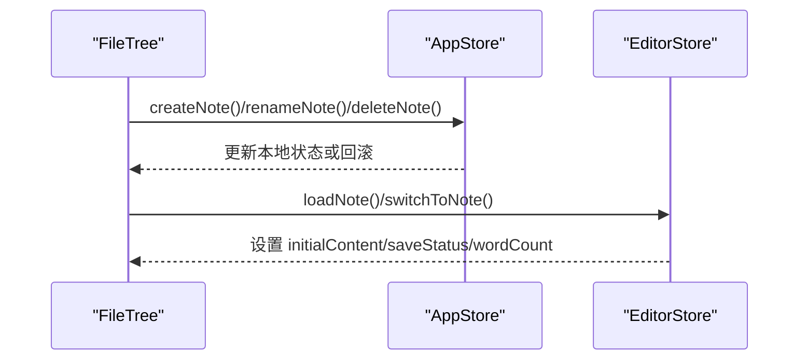
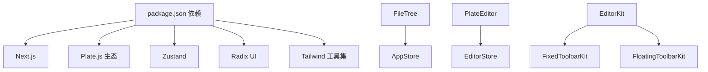

# 组件架构设计

<cite>
**本文引用的文件**
- [README.md](file://README.md)
- [package.json](file://package.json)
- [src/app/layout.tsx](file://src/app/layout.tsx)
- [src/components/layout/app-shell.tsx](file://src/components/layout/app-shell.tsx)
- [src/components/file-tree/file-tree.tsx](file://src/components/file-tree/file-tree.tsx)
- [src/components/editor/plate-editor.tsx](file://src/components/editor/plate-editor.tsx)
- [src/components/editor/editor-kit.tsx](file://src/components/editor/editor-kit.tsx)
- [src/components/editor/plugins/fixed-toolbar-kit.tsx](file://src/components/editor/plugins/fixed-toolbar-kit.tsx)
- [src/components/editor/plugins/floating-toolbar-kit.tsx](file://src/components/editor/plugins/floating-toolbar-kit.tsx)
- [src/stores/app-store.ts](file://src/stores/app-store.ts)
- [src/stores/editor-store.ts](file://src/stores/editor-store.ts)
- [src/types/index.ts](file://src/types/index.ts)
- [src/hooks/use-debounce.ts](file://src/hooks/use-debounce.ts)
- [src/lib/utils.ts](file://src/lib/utils.ts)
</cite>

## 目录
1. [引言](#引言)
2. [项目结构](#项目结构)
3. [核心组件](#核心组件)
4. [架构总览](#架构总览)
5. [组件详解](#组件详解)
6. [依赖关系分析](#依赖关系分析)
7. [性能考量](#性能考量)
8. [故障排查指南](#故障排查指南)
9. [结论](#结论)
10. [附录](#附录)

## 引言
本文件面向 YNote v2 的组件架构设计，系统性阐述其组件化设计原则与分层架构模式，覆盖 UI 组件、业务组件与容器组件的职责划分；文档化组件间通信机制（Props 传递、事件冒泡与状态提升）；解释组合模式与高阶组件的使用场景；说明生命周期管理与性能优化策略；提供测试与调试建议，并总结扩展与定制的最佳实践。

## 项目结构
YNote v2 基于 Next.js App Router 架构，采用“按功能域分层 + 组件模块化”的组织方式：
- 应用壳层：全局布局与 Provider 包裹
- 页面层：路由页面与入口
- 组件层：UI 组件、业务组件、容器组件
- 状态层：Zustand Store（应用态与编辑态）
- 工具层：通用工具函数与类型定义
- 钩子层：自定义 Hook（如防抖）

图表来源
- [src/app/layout.tsx:1-38](file://src/app/layout.tsx#L1-L38)
- [src/components/layout/app-shell.tsx:1-43](file://src/components/layout/app-shell.tsx#L1-L43)
- [src/components/file-tree/file-tree.tsx:1-326](file://src/components/file-tree/file-tree.tsx#L1-L326)
- [src/components/editor/plate-editor.tsx:1-175](file://src/components/editor/plate-editor.tsx#L1-L175)
- [src/components/editor/editor-kit.tsx:1-83](file://src/components/editor/editor-kit.tsx#L1-L83)
- [src/stores/app-store.ts:1-318](file://src/stores/app-store.ts#L1-L318)
- [src/stores/editor-store.ts:1-281](file://src/stores/editor-store.ts#L1-L281)
- [src/types/index.ts:1-74](file://src/types/index.ts#L1-L74)
- [src/hooks/use-debounce.ts:1-19](file://src/hooks/use-debounce.ts#L1-L19)
- [src/lib/utils.ts:1-7](file://src/lib/utils.ts#L1-L7)

章节来源
- [README.md:1-37](file://README.md#L1-L37)
- [package.json:1-119](file://package.json#L1-L119)

## 核心组件
- 应用壳 AppShell：负责多标签页切换、侧边栏与主编辑区的布局与可见性控制，统一调度数据加载与状态同步。
- 文件树 FileTree：负责目录与笔记的展示、搜索、批量展开/折叠、归档/解档等操作，并与编辑器进行内容切换与保存联动。
- 编辑器 PlateEditor：基于 Plate.js 的富文本编辑器容器，负责内容变更检测、快照对比、序列化回调注册、加载态与空态提示。
- 编辑器套件 EditorKit：集中声明式装配编辑器插件集合，形成可组合的编辑能力矩阵。
- 固定/浮动工具栏插件：通过 Plate 插件机制注入 UI 层，实现编辑器内工具条的渲染与交互。
- 应用状态 AppStore：管理活动标签、树形数据、选中项、搜索、文件夹/笔记 CRUD 等应用级状态。
- 编辑状态 EditorStore：管理当前编辑对象、初始内容、当前变更内容、保存状态、缓存与序列化回调等编辑态状态。
- 类型系统与工具：统一的数据模型与通用工具函数，保障组件间契约一致与样式合并。

章节来源
- [src/components/layout/app-shell.tsx:12-42](file://src/components/layout/app-shell.tsx#L12-L42)
- [src/components/file-tree/file-tree.tsx:22-300](file://src/components/file-tree/file-tree.tsx#L22-L300)
- [src/components/editor/plate-editor.tsx:63-174](file://src/components/editor/plate-editor.tsx#L63-L174)
- [src/components/editor/editor-kit.tsx:36-78](file://src/components/editor/editor-kit.tsx#L36-L78)
- [src/stores/app-store.ts:49-317](file://src/stores/app-store.ts#L49-L317)
- [src/stores/editor-store.ts:88-280](file://src/stores/editor-store.ts#L88-L280)
- [src/types/index.ts:1-74](file://src/types/index.ts#L1-L74)

## 架构总览
YNote v2 采用“容器-组件-插件”三层架构：
- 容器层：AppShell、FileTree、PlateEditor 负责编排与状态协调
- 组件层：UI 组件（Button、Toolbar 等）与业务组件（节点、菜单、对话框等）
- 插件层：EditorKit 将多种编辑能力以插件形式装配到 Plate 编辑器
- 状态层：Zustand Store 提供跨组件共享的状态，避免深层 Props 下传
- 通信机制：Props 向下传递、事件向上冒泡、状态在 Store 中提升与订阅

图表来源
- [src/components/layout/app-shell.tsx:12-42](file://src/components/layout/app-shell.tsx#L12-L42)
- [src/components/file-tree/file-tree.tsx:22-300](file://src/components/file-tree/file-tree.tsx#L22-L300)
- [src/components/editor/plate-editor.tsx:63-174](file://src/components/editor/plate-editor.tsx#L63-L174)
- [src/components/editor/editor-kit.tsx:36-78](file://src/components/editor/editor-kit.tsx#L36-L78)
- [src/stores/app-store.ts:49-317](file://src/stores/app-store.ts#L49-L317)
- [src/stores/editor-store.ts:88-280](file://src/stores/editor-store.ts#L88-L280)

## 组件详解

### 容器组件：AppShell
- 职责：根据活动标签控制三个区域的显示/隐藏；初始化文件树数据；承载头部与编辑器区域。
- 关键点：通过 Store 订阅 activeTab 并在挂载时触发 fetchTree；使用 cn 合并条件类名实现区域显隐。
- 依赖：Header、FileTree、PlateEditor、AppStore。

图表来源
- [src/components/layout/app-shell.tsx:12-42](file://src/components/layout/app-shell.tsx#L12-L42)
- [src/stores/app-store.ts:69-82](file://src/stores/app-store.ts#L69-L82)

章节来源
- [src/components/layout/app-shell.tsx:12-42](file://src/components/layout/app-shell.tsx#L12-L42)

### 容器组件：FileTree
- 职责：展示文件树、支持新建文件夹/笔记、搜索、批量展开/折叠、归档/解档、与编辑器联动。
- 关键点：使用 EditorStore 的 loadNote/switchToNote 实现内容切换；使用 AppStore 的 createFolder/createNote 实现资源创建；使用 useDebounce 防抖搜索。
- 通信：向下传递 props（folder、notes、childFolders 等），向上通过回调触发状态更新。

图表来源
- [src/components/file-tree/file-tree.tsx:65-77](file://src/components/file-tree/file-tree.tsx#L65-L77)
- [src/stores/editor-store.ts:204-202](file://src/stores/editor-store.ts#L204-L202)
- [src/stores/app-store.ts:263-279](file://src/stores/app-store.ts#L263-L279)

章节来源
- [src/components/file-tree/file-tree.tsx:22-300](file://src/components/file-tree/file-tree.tsx#L22-L300)
- [src/hooks/use-debounce.ts:1-19](file://src/hooks/use-debounce.ts#L1-L19)

### 容器组件：PlateEditor
- 职责：承载 Plate 编辑器实例，处理内容变更检测、快照对比、序列化回调注册、加载态与空态提示。
- 关键点：自定义结构化相等比较函数，避免深度 JSON 比较带来的性能损耗；在笔记切换时重置编辑器状态并清理历史；保存后更新缓存基线。
- 通信：通过 EditorStore 的回调设置与状态读取实现与上层的解耦。

图表来源
- [src/components/editor/plate-editor.tsx:63-174](file://src/components/editor/plate-editor.tsx#L63-L174)

章节来源
- [src/components/editor/plate-editor.tsx:63-174](file://src/components/editor/plate-editor.tsx#L63-L174)

### 插件与工具条：EditorKit 与 Toolbar 插件
- EditorKit：集中装配基础块、代码块、表格、切换、目录、媒体、标注、列布局、数学公式、日期、链接、提及等元素与样式插件，以及 Markdown/DOCX 解析、占位符、固定/浮动工具条等 UI 插件。
- 固定/浮动工具条插件：通过 Plate 插件机制在编辑器前后注入对应 UI 组件，实现所见即所得的格式化与插入操作。

图表来源
- [src/components/editor/editor-kit.tsx:36-78](file://src/components/editor/editor-kit.tsx#L36-L78)
- [src/components/editor/plugins/fixed-toolbar-kit.tsx:8-19](file://src/components/editor/plugins/fixed-toolbar-kit.tsx#L8-L19)
- [src/components/editor/plugins/floating-toolbar-kit.tsx:8-19](file://src/components/editor/plugins/floating-toolbar-kit.tsx#L8-L19)

章节来源
- [src/components/editor/editor-kit.tsx:1-83](file://src/components/editor/editor-kit.tsx#L1-L83)
- [src/components/editor/plugins/fixed-toolbar-kit.tsx:1-20](file://src/components/editor/plugins/fixed-toolbar-kit.tsx#L1-L20)
- [src/components/editor/plugins/floating-toolbar-kit.tsx:1-20](file://src/components/editor/plugins/floating-toolbar-kit.tsx#L1-L20)

### 状态层：AppStore 与 EditorStore
- AppStore：管理活动标签、文件树、笔记列表、选中项、搜索、树加载状态，以及文件夹/笔记的增删改查与批量操作。
- EditorStore：管理当前编辑对象、初始内容、当前变更内容、保存状态、字数统计、内容缓存（LRU）、序列化回调注册、手动保存与缓存失效。
- 设计要点：将副作用（网络请求）集中在 Store 内部，组件仅负责订阅与触发；通过回调注入（如 setMarkdownSerializer）实现跨组件协作。

图表来源
- [src/stores/app-store.ts:49-317](file://src/stores/app-store.ts#L49-L317)
- [src/stores/editor-store.ts:88-280](file://src/stores/editor-store.ts#L88-L280)

章节来源
- [src/stores/app-store.ts:1-318](file://src/stores/app-store.ts#L1-L318)
- [src/stores/editor-store.ts:1-281](file://src/stores/editor-store.ts#L1-L281)

### UI 组件与组合模式
- Button：通过 Variants 与 Slot 支持多种尺寸与外观，满足不同上下文的按钮需求。
- Toolbar：固定/浮动工具条分别通过插件注入，按钮集合按需组合，体现“插件即组件”的组合思想。
- 组合模式：容器组件通过 Props 向下传递数据与行为，UI 组件通过变体与组合实现复用；复杂交互通过插件机制扩展。

章节来源
- [src/components/ui/button.tsx:1-65](file://src/components/ui/button.tsx#L1-L65)

## 依赖关系分析
- 外部依赖：Next.js、Plate.js 生态、Radix UI、Zustand、Tailwind 工具集等。
- 内部依赖：组件之间通过 Store 解耦；UI 组件依赖工具函数（cn）；编辑器依赖插件集合；容器组件依赖业务 Store。
- 循环依赖：当前结构未见循环依赖迹象，容器与 UI 分离清晰，Store 作为中心枢纽。

图表来源
- [package.json:13-99](file://package.json#L13-L99)
- [src/components/file-tree/file-tree.tsx:22-300](file://src/components/file-tree/file-tree.tsx#L22-L300)
- [src/components/editor/plate-editor.tsx:63-174](file://src/components/editor/plate-editor.tsx#L63-L174)
- [src/components/editor/editor-kit.tsx:36-78](file://src/components/editor/editor-kit.tsx#L36-L78)

章节来源
- [package.json:1-119](file://package.json#L1-L119)

## 性能考量
- 结构化相等比较：在编辑器中使用自定义比较函数替代 JSON 深度比较，降低大内容变更时的计算开销。
- 缓存策略：EditorStore 使用 LRU 缓存最近编辑的笔记内容，命中时直接设置 initialContent，减少网络请求与解析成本。
- 防抖搜索：对搜索关键词使用防抖 Hook，降低频繁请求带来的压力。
- 条件渲染与显隐：通过 activeTab 与 cn 控制区域显隐，避免不必要的渲染。
- 优化建议：对大型列表（文件树）可考虑虚拟滚动；对编辑器内容序列化可做节流；对批量操作（展开/折叠）可使用并发限制与进度反馈。

章节来源
- [src/components/editor/plate-editor.tsx:16-61](file://src/components/editor/plate-editor.tsx#L16-L61)
- [src/stores/editor-store.ts:66-77](file://src/stores/editor-store.ts#L66-L77)
- [src/hooks/use-debounce.ts:1-19](file://src/hooks/use-debounce.ts#L1-L19)
- [src/lib/utils.ts:4-6](file://src/lib/utils.ts#L4-L6)

## 故障排查指南
- 编辑器未保存提示异常
  - 检查 onChange 流程中的相等比较逻辑与基线更新时机
  - 确认笔记切换时是否正确重置 editor 状态与历史
- 保存失败或状态不一致
  - 核对保存流程中的序列化回调是否注册、wordCount 计算是否正确
  - 检查缓存写入与回滚逻辑
- 文件树搜索无响应
  - 确认防抖时间与请求路径
  - 检查搜索结果渲染与清空逻辑
- 批量展开/折叠无效
  - 核对乐观更新与服务端同步的回滚策略
- 全局样式与主题
  - 确认根布局 Provider 是否包裹完整

章节来源
- [src/components/editor/plate-editor.tsx:84-144](file://src/components/editor/plate-editor.tsx#L84-L144)
- [src/stores/editor-store.ts:204-275](file://src/stores/editor-store.ts#L204-L275)
- [src/components/file-tree/file-tree.tsx:87-122](file://src/components/file-tree/file-tree.tsx#L87-L122)
- [src/stores/app-store.ts:149-191](file://src/stores/app-store.ts#L149-L191)
- [src/app/layout.tsx:22-37](file://src/app/layout.tsx#L22-L37)

## 结论
YNote v2 的组件架构以“容器-组件-插件”为核心，结合 Zustand Store 实现状态提升与跨组件协作，通过 EditorKit 将丰富的编辑能力以插件形式组合，既保证了可扩展性，也维持了良好的可维护性。在性能方面，通过结构化比较、LRU 缓存与防抖等策略有效降低了开销。建议在后续迭代中进一步引入虚拟化与节流优化，并完善单元测试与集成测试覆盖。

## 附录
- 组件测试策略
  - 单元测试：针对 EditorStore 的缓存与保存逻辑、AppStore 的 CRUD 与批量操作进行断言
  - 集成测试：模拟 FileTree 与 EditorStore 的交互，验证内容切换与保存链路
  - UI 测试：使用组件测试框架对 PlateEditor 的渲染与工具条交互进行快照与行为测试
- 调试技巧
  - 在 Store 中打印关键动作与状态变化，定位异步副作用问题
  - 使用浏览器开发者工具观察组件渲染次数与重绘热点
  - 对编辑器内容变更使用日志记录，配合快照比对定位异常
- 扩展与定制最佳实践
  - 新增编辑器能力优先以插件形式封装，遵循 EditorKit 的装配规范
  - 通过 Store 注入回调扩展编辑器行为（如序列化、导出）
  - 对 UI 组件保持单一职责，通过变体与组合实现差异化