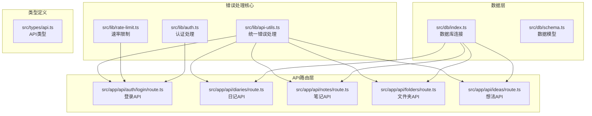
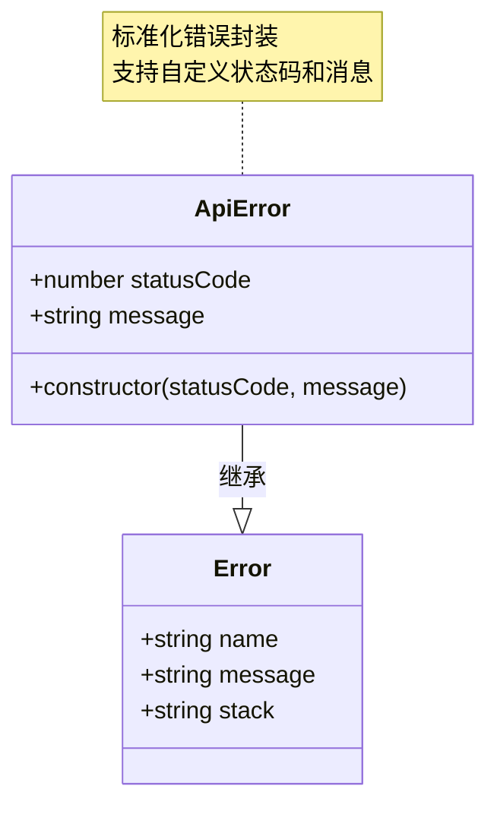
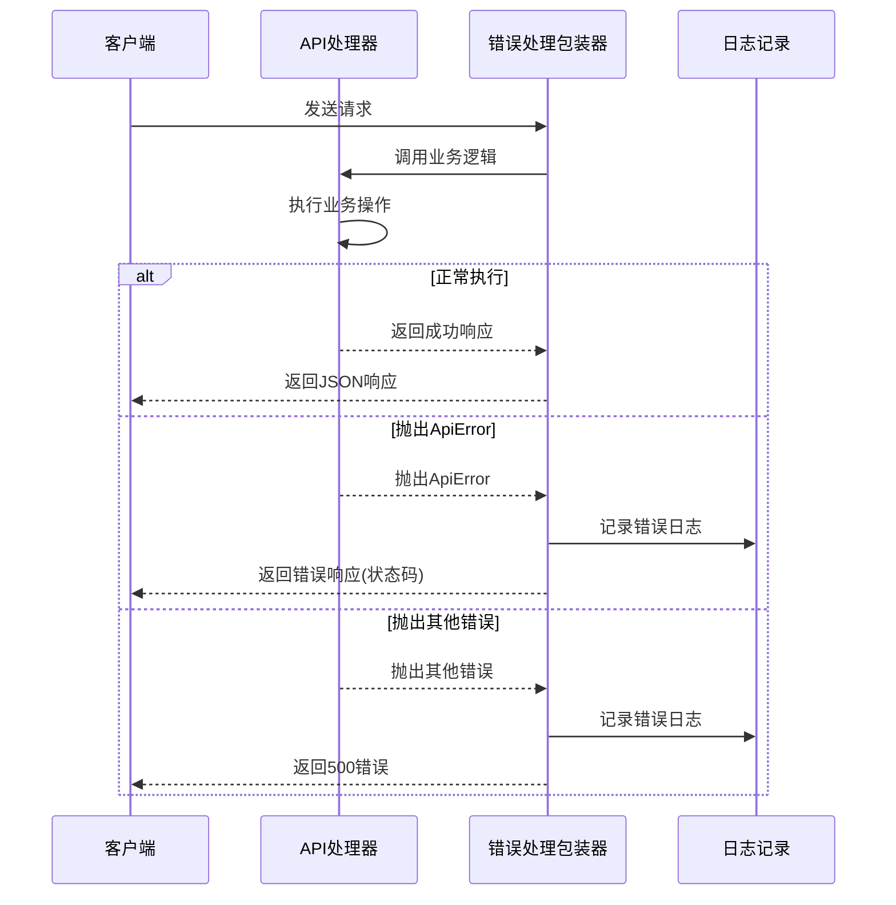
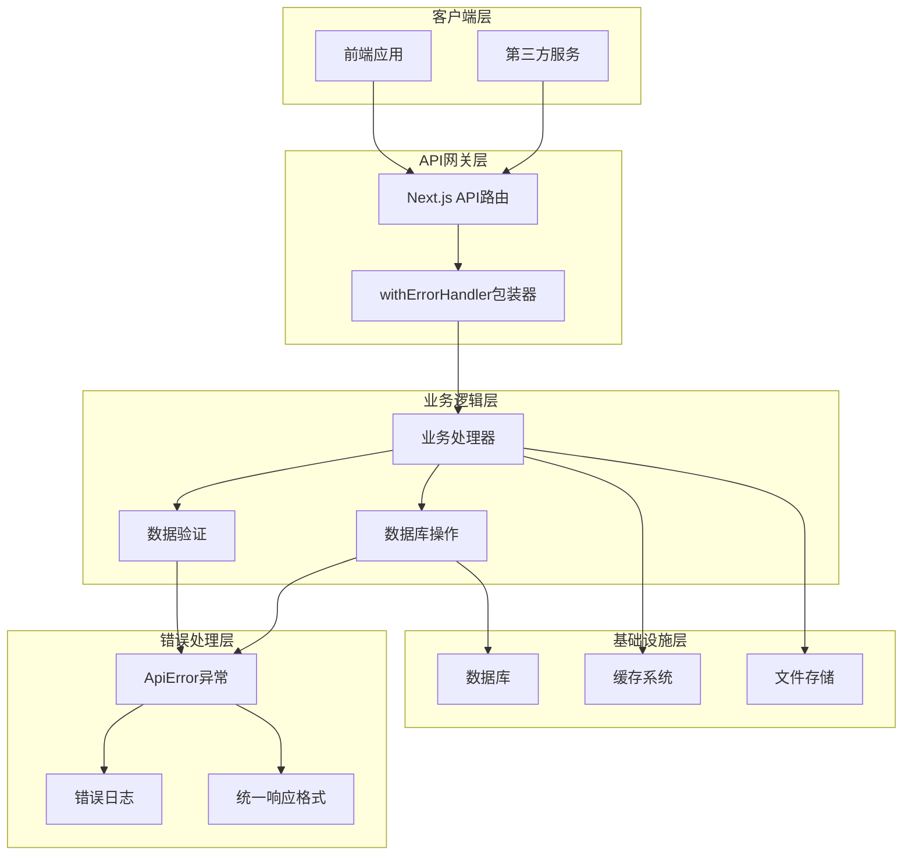
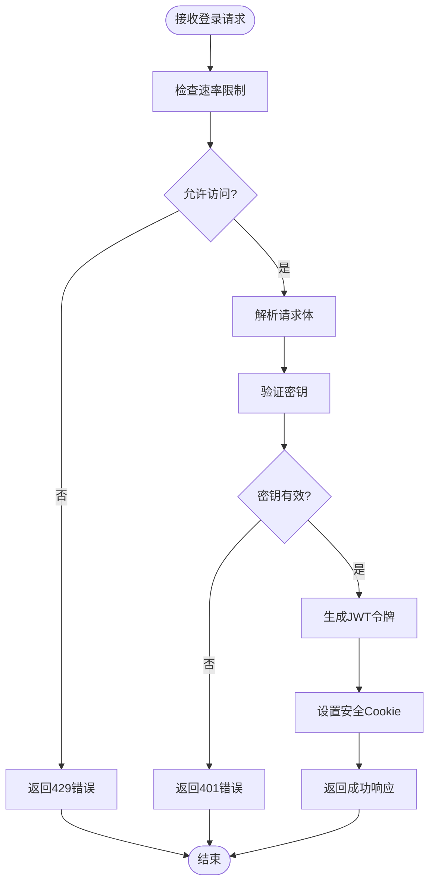
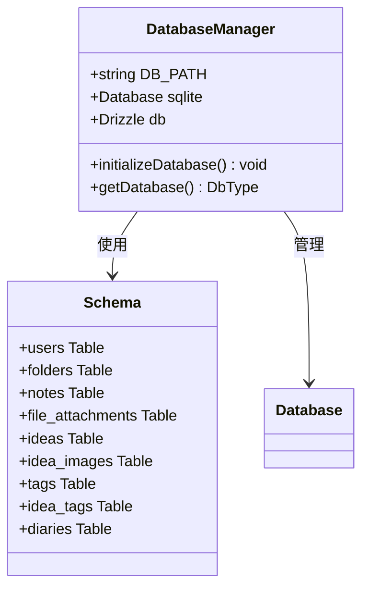
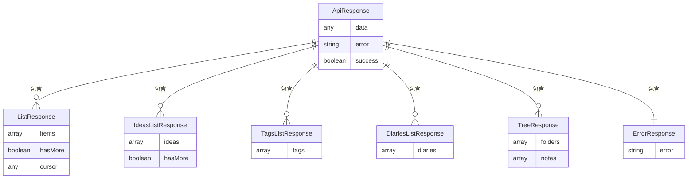
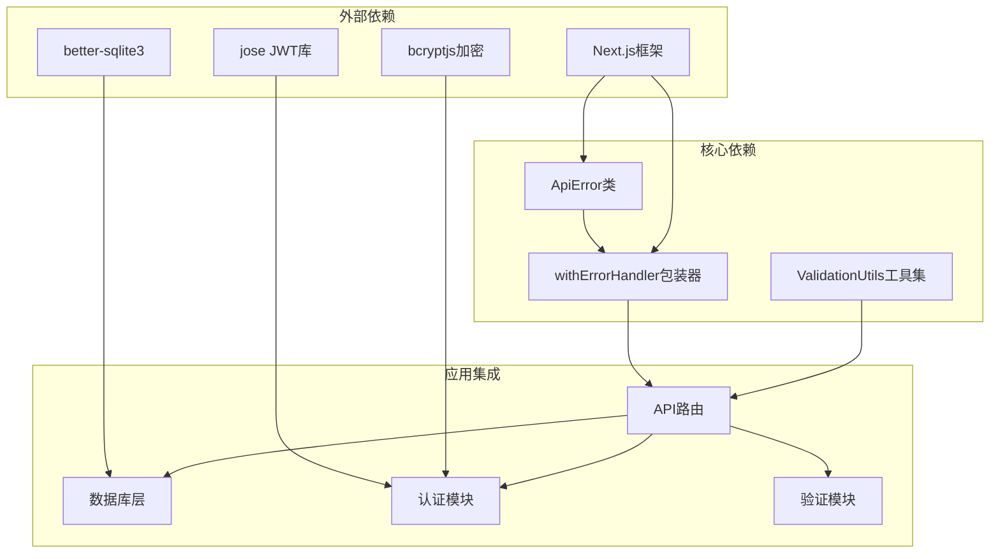

# 统一错误处理框架

<cite>
**本文档引用的文件**
- [src/lib/api-utils.ts](file://src/lib/api-utils.ts)
- [src/lib/rate-limit.ts](file://src/lib/rate-limit.ts)
- [src/app/api/auth/login/route.ts](file://src/app/api/auth/login/route.ts)
- [src/app/api/diaries/route.ts](file://src/app/api/diaries/route.ts)
- [src/app/api/notes/route.ts](file://src/app/api/notes/route.ts)
- [src/app/api/folders/route.ts](file://src/app/api/folders/route.ts)
- [src/app/api/ideas/route.ts](file://src/app/api/ideas/route.ts)
- [src/lib/auth.ts](file://src/lib/auth.ts)
- [src/db/index.ts](file://src/db/index.ts)
- [src/db/schema.ts](file://src/db/schema.ts)
- [src/types/api.ts](file://src/types/api.ts)
</cite>

## 目录
1. [简介](#简介)
2. [项目结构](#项目结构)
3. [核心组件](#核心组件)
4. [架构概览](#架构概览)
5. [详细组件分析](#详细组件分析)
6. [依赖关系分析](#依赖关系分析)
7. [性能考虑](#性能考虑)
8. [故障排除指南](#故障排除指南)
9. [结论](#结论)

## 简介

本项目实现了一个完整的统一错误处理框架，通过标准化的错误处理机制、统一的API响应格式和完善的验证工具，为整个应用提供了可靠、一致的错误管理方案。该框架主要包含以下核心功能：

- 统一的ApiError异常类
- withErrorHandler错误处理包装器
- 标准化的API响应格式
- 输入验证工具集
- 速率限制机制
- 完整的错误处理流程

## 项目结构

项目采用Next.js应用架构，错误处理框架主要分布在以下目录结构中：

**图表来源**
- [src/lib/api-utils.ts:1-46](file://src/lib/api-utils.ts#L1-L46)
- [src/lib/rate-limit.ts:1-41](file://src/lib/rate-limit.ts#L1-L41)
- [src/app/api/auth/login/route.ts:1-63](file://src/app/api/auth/login/route.ts#L1-L63)

**章节来源**
- [src/lib/api-utils.ts:1-46](file://src/lib/api-utils.ts#L1-L46)
- [src/lib/rate-limit.ts:1-41](file://src/lib/rate-limit.ts#L1-L41)
- [src/app/api/auth/login/route.ts:1-63](file://src/app/api/auth/login/route.ts#L1-L63)

## 核心组件

### ApiError统一异常类

ApiError是整个错误处理框架的核心，提供标准化的错误封装：

**图表来源**
- [src/lib/api-utils.ts:4-8](file://src/lib/api-utils.ts#L4-L8)

### withErrorHandler错误处理包装器

统一的错误处理包装器，为所有API路由提供一致的错误处理逻辑：

**图表来源**
- [src/lib/api-utils.ts:11-28](file://src/lib/api-utils.ts#L11-L28)

### ValidationUtils验证工具集

提供标准化的数据验证功能：

| 验证规则 | 最大长度 | 非法字符 | 错误码 |
|---------|---------|---------|--------|
| 名称验证 | 100字符 | `/ \ : * ? " < > \|` | 400 |
| 标题验证 | 100字符 | 同上 | 400 |
| 文件名验证 | 255字符 | 同上 | 400 |

**章节来源**
- [src/lib/api-utils.ts:31-45](file://src/lib/api-utils.ts#L31-L45)

## 架构概览

统一错误处理框架的整体架构如下：

**图表来源**
- [src/lib/api-utils.ts:1-46](file://src/lib/api-utils.ts#L1-L46)
- [src/lib/rate-limit.ts:1-41](file://src/lib/rate-limit.ts#L1-L41)

## 详细组件分析

### 登录API错误处理

登录API实现了完整的错误处理流程，包括速率限制和认证验证：

**图表来源**
- [src/app/api/auth/login/route.ts:9-62](file://src/app/api/auth/login/route.ts#L9-L62)

**章节来源**
- [src/app/api/auth/login/route.ts:1-63](file://src/app/api/auth/login/route.ts#L1-L63)

### 数据库错误处理

数据库层实现了自动初始化和错误处理机制：

**图表来源**
- [src/db/index.ts:10-171](file://src/db/index.ts#L10-L171)
- [src/db/schema.ts:1-105](file://src/db/schema.ts#L1-L105)

**章节来源**
- [src/db/index.ts:1-171](file://src/db/index.ts#L1-L171)
- [src/db/schema.ts:1-105](file://src/db/schema.ts#L1-L105)

### API类型定义

统一的API响应类型定义确保了前后端数据交换的一致性：

**图表来源**
- [src/types/api.ts:6-44](file://src/types/api.ts#L6-L44)

**章节来源**
- [src/types/api.ts:1-45](file://src/types/api.ts#L1-L45)

## 依赖关系分析

错误处理框架的依赖关系图：

**图表来源**
- [src/lib/api-utils.ts:1-46](file://src/lib/api-utils.ts#L1-L46)
- [src/lib/auth.ts:1-28](file://src/lib/auth.ts#L1-L28)
- [src/db/index.ts:1-171](file://src/db/index.ts#L1-L171)

**章节来源**
- [src/lib/api-utils.ts:1-46](file://src/lib/api-utils.ts#L1-L46)
- [src/lib/auth.ts:1-28](file://src/lib/auth.ts#L1-L28)
- [src/db/index.ts:1-171](file://src/db/index.ts#L1-L171)

## 性能考虑

### 错误处理性能优化

1. **异步错误处理**: 使用async/await模式避免阻塞
2. **错误缓存**: 速率限制使用Map进行快速查找
3. **最小化日志开销**: 只在catch块中记录错误
4. **及时清理**: 速率限制条目定期清理

### 内存管理

- 使用单例模式管理数据库连接
- Map结构用于速率限制存储
- 避免在错误处理中创建大量临时对象

### 网络优化

- 统一的错误响应格式减少客户端处理复杂度
- 标准化状态码便于缓存和代理处理

## 故障排除指南

### 常见错误类型及解决方案

| 错误类型 | 状态码 | 触发条件 | 解决方案 |
|---------|--------|---------|---------|
| ApiError | 400 | 参数验证失败 | 检查输入数据格式 |
| ApiError | 401 | 认证失败 | 验证凭据有效性 |
| ApiError | 404 | 资源不存在 | 检查资源ID |
| ApiError | 429 | 请求过于频繁 | 实现指数退避重试 |
| 服务器错误 | 500 | 未捕获异常 | 检查服务器日志 |

### 调试技巧

1. **启用详细日志**: 在开发环境中查看详细的错误堆栈
2. **使用浏览器开发者工具**: 监控网络请求和响应
3. **检查环境变量**: 确保JWT_SECRET等配置正确
4. **验证数据库连接**: 确认数据库文件路径和权限

**章节来源**
- [src/lib/api-utils.ts:11-28](file://src/lib/api-utils.ts#L11-L28)
- [src/lib/rate-limit.ts:21-36](file://src/lib/rate-limit.ts#L21-L36)

## 结论

本统一错误处理框架通过标准化的设计和实现，为Next.js应用提供了完整、可靠的错误管理解决方案。主要特点包括：

1. **一致性**: 所有API路由都使用相同的错误处理模式
2. **可扩展性**: 易于添加新的验证规则和错误类型
3. **可维护性**: 清晰的代码结构和文档
4. **性能**: 优化的错误处理流程和内存管理
5. **安全性**: 完善的输入验证和速率限制机制

该框架不仅提高了代码质量，还为未来的功能扩展奠定了坚实的基础。通过持续的监控和优化，可以进一步提升系统的稳定性和用户体验。