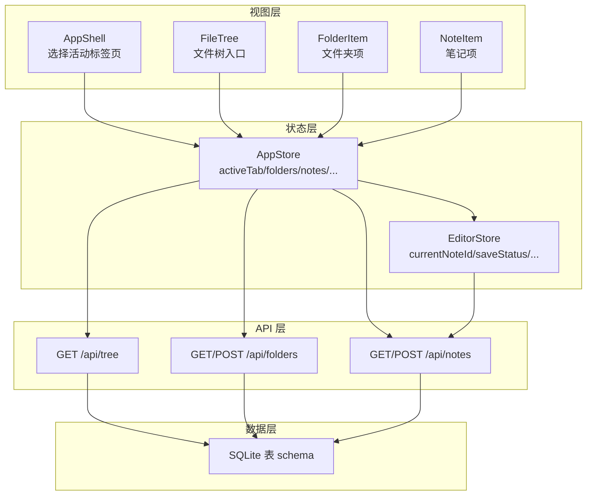
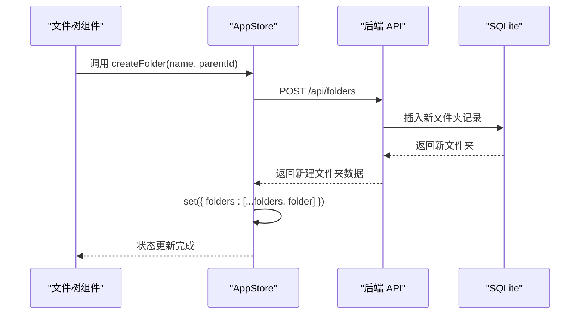
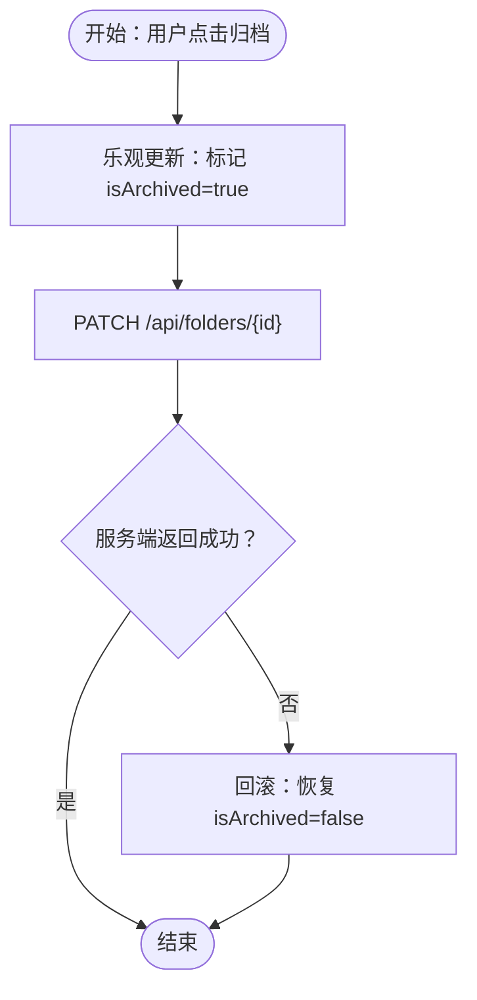
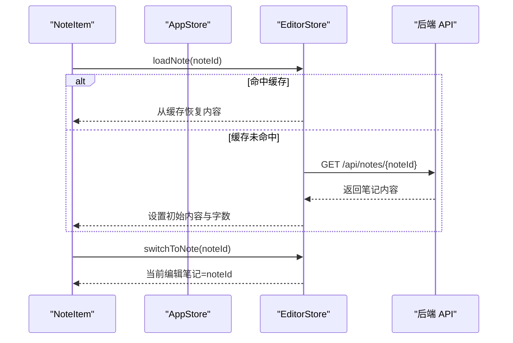
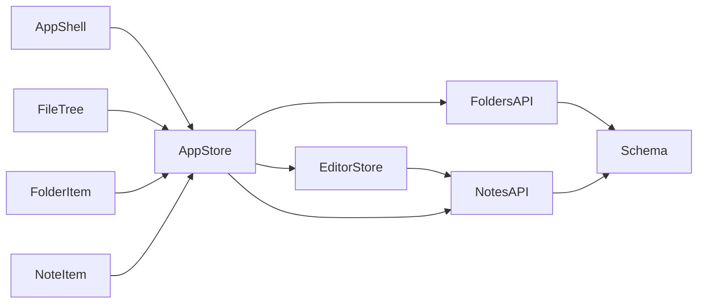

# 全局应用状态

<cite>
**本文引用的文件**
- [src/stores/app-store.ts](file://src/stores/app-store.ts)
- [src/types/index.ts](file://src/types/index.ts)
- [src/components/file-tree/file-tree.tsx](file://src/components/file-tree/file-tree.tsx)
- [src/components/file-tree/folder-item.tsx](file://src/components/file-tree/folder-item.tsx)
- [src/components/file-tree/note-item.tsx](file://src/components/file-tree/note-item.tsx)
- [src/components/layout/app-shell.tsx](file://src/components/layout/app-shell.tsx)
- [src/stores/editor-store.ts](file://src/stores/editor-store.ts)
- [src/app/api/tree/route.ts](file://src/app/api/tree/route.ts)
- [src/app/api/folders/route.ts](file://src/app/api/folders/route.ts)
- [src/app/api/notes/route.ts](file://src/app/api/notes/route.ts)
- [src/db/schema.ts](file://src/db/schema.ts)
</cite>

## 目录
1. [简介](#简介)
2. [项目结构](#项目结构)
3. [核心组件](#核心组件)
4. [架构总览](#架构总览)
5. [详细组件分析](#详细组件分析)
6. [依赖分析](#依赖分析)
7. [性能考量](#性能考量)
8. [故障排查指南](#故障排查指南)
9. [结论](#结论)

## 简介
本文件系统性阐述全局应用状态的设计与实现，重点围绕 AppStore 的状态结构与更新机制，覆盖应用标签页管理、文件树状态、选择状态、搜索状态、以及与编辑器状态的协同。同时说明异步操作（如拉取树数据、创建/重命名/删除文件夹与笔记）的调用流程、乐观更新与回滚策略、错误处理与状态同步，并给出状态持久化与恢复建议。

## 项目结构
- 状态层：使用 Zustand 管理全局状态与异步操作，集中于 AppStore 与 EditorStore。
- 视图层：通过 React 组件订阅状态，驱动 UI 更新；文件树组件负责文件夹与笔记的交互。
- API 层：Next.js 路由作为后端接口，提供树数据、文件夹与笔记的 CRUD 操作。
- 数据层：Drizzle ORM SQLite 表定义，支撑文件夹与笔记的数据模型。

图表来源
- [src/components/layout/app-shell.tsx:12-42](file://src/components/layout/app-shell.tsx#L12-L42)
- [src/components/file-tree/file-tree.tsx:22-38](file://src/components/file-tree/file-tree.tsx#L22-L38)
- [src/stores/app-store.ts:49-82](file://src/stores/app-store.ts#L49-L82)
- [src/stores/editor-store.ts:88-112](file://src/stores/editor-store.ts#L88-L112)
- [src/app/api/tree/route.ts:6-36](file://src/app/api/tree/route.ts#L6-L36)
- [src/app/api/folders/route.ts:19-75](file://src/app/api/folders/route.ts#L19-L75)
- [src/app/api/notes/route.ts:10-86](file://src/app/api/notes/route.ts#L10-L86)
- [src/db/schema.ts:10-39](file://src/db/schema.ts#L10-L39)

章节来源
- [src/stores/app-store.ts:49-82](file://src/stores/app-store.ts#L49-L82)
- [src/components/layout/app-shell.tsx:12-42](file://src/components/layout/app-shell.tsx#L12-L42)
- [src/components/file-tree/file-tree.tsx:22-38](file://src/components/file-tree/file-tree.tsx#L22-L38)

## 核心组件
- AppStore：集中管理应用标签页、文件树、选择状态、搜索状态、树加载状态，以及与后端的异步操作。
- EditorStore：管理当前编辑内容、保存状态、缓存与切换逻辑，与 AppStore 协同工作。
- 文件树组件：订阅 AppStore 并触发状态更新，实现文件夹与笔记的增删改查交互。
- API 路由：提供树数据、文件夹与笔记的读写接口，返回标准化数据结构。

章节来源
- [src/stores/app-store.ts:5-47](file://src/stores/app-store.ts#L5-L47)
- [src/stores/editor-store.ts:15-64](file://src/stores/editor-store.ts#L15-L64)
- [src/components/file-tree/file-tree.tsx:22-38](file://src/components/file-tree/file-tree.tsx#L22-L38)

## 架构总览
AppStore 以“状态 + 动作”的形式组织，动作内部封装了与后端的网络请求与本地状态同步。UI 通过订阅状态进行渲染，用户交互触发动作，动作再通过 fetch 或数据库操作更新状态，形成闭环。

图表来源
- [src/stores/app-store.ts:84-100](file://src/stores/app-store.ts#L84-L100)
- [src/app/api/folders/route.ts:34-75](file://src/app/api/folders/route.ts#L34-L75)
- [src/db/schema.ts:10-25](file://src/db/schema.ts#L10-L25)

## 详细组件分析

### AppStore 状态结构与职责
- 应用标签页管理
  - activeTab：当前激活的主标签页（notes/ideas/diary）
  - setActiveTab：切换标签页
- 文件树状态
  - folders：文件夹列表，包含排序、展开、归档等元信息
  - notes：笔记列表，包含所属文件夹、排序、字数等
  - setFolders/setNotes：直接替换列表
- 选择状态
  - selectedNoteId：当前选中笔记 ID，用于高亮与编辑器切换
  - setSelectedNoteId：设置当前选中笔记
- 搜索状态
  - searchQuery：搜索关键词
  - searchResults：搜索结果集
  - setSearchQuery/setSearchResults：更新查询与结果
- 树加载状态
  - treeLoading：树数据加载中标志
  - setTreeLoading：切换加载状态
- 异步操作
  - fetchTree：拉取树数据并填充 folders 与 notes
  - 文件夹操作：createFolder、renameFolder、deleteFolder、toggleFolder、expandAllFolders、collapseAllFolders、archiveFolder、unarchiveFolder
  - 笔记操作：createNote、renameNote、deleteNote

章节来源
- [src/stores/app-store.ts:5-47](file://src/stores/app-store.ts#L5-L47)
- [src/types/index.ts:1-25](file://src/types/index.ts#L1-L25)

### 状态更新方法与行为
- setActiveTab：切换 activeTab，影响 AppShell 中的布局显示
- setFolders/setNotes：直接替换列表，适用于从服务器刷新后的全量替换
- setSelectedNoteId：更新当前选中笔记，驱动编辑器切换
- setSearchQuery/setSearchResults：更新搜索词与结果
- setTreeLoading：控制树加载指示器
- fetchTree：发起请求 /api/tree，成功后合并 folders 与 notes，最后关闭加载态
- createFolder：POST /api/folders，成功后乐观地追加到 folders 列表
- renameFolder：PATCH /api/folders/{id}，成功后乐观地更新对应文件夹
- deleteFolder：DELETE /api/folders/{id}，成功后调用 fetchTree 以确保级联删除与重新分配的一致性
- toggleFolder：本地立即切换 isExpanded，随后异步 PATCH 更新服务端
- expandAllFolders/collapseAllFolders：对非归档文件夹执行批量乐观更新，再并发 PATCH
- archiveFolder/unarchiveFolder：乐观更新 isArchived，若服务端失败则回滚

章节来源
- [src/stores/app-store.ts:49-318](file://src/stores/app-store.ts#L49-L318)

### 异步状态操作与状态同步机制
- 树数据同步：AppStore 在 AppShell 首次挂载时调用 fetchTree，确保 UI 初始化即有数据
- 笔记删除同步：deleteNote 成功后，除更新 notes 外，还会清理 EditorStore 缓存并重置当前编辑笔记
- 批量操作：expandAllFolders/collapseAllFolders 使用 Promise.all 并发更新所有折叠/展开状态，提升响应速度
- 乐观更新：toggleFolder、archiveFolder/unarchiveFolder、expandAllFolders/collapseAllFolders 在发起网络请求前先更新本地状态，改善交互体验
- 回滚机制：archiveFolder/unarchiveFolder 在服务端失败或异常时回滚本地状态，保证一致性

图表来源
- [src/stores/app-store.ts:193-261](file://src/stores/app-store.ts#L193-L261)

章节来源
- [src/stores/app-store.ts:133-261](file://src/stores/app-store.ts#L133-L261)

### 与编辑器状态的协作
- 选中笔记切换：NoteItem 点击时，若存在未保存内容会弹出确认对话框；确认后通过 EditorStore.loadNote 与 switchToNote 完成切换
- 内容加载与缓存：EditorStore 提供 LRU 缓存，首次加载走网络请求，命中则直接从缓存恢复
- 删除笔记联动：AppStore.deleteNote 成功后调用 EditorStore.invalidateCache 清理缓存，并在必要时重置当前编辑笔记

图表来源
- [src/components/file-tree/note-item.tsx:52-82](file://src/components/file-tree/note-item.tsx#L52-L82)
- [src/stores/editor-store.ts:114-155](file://src/stores/editor-store.ts#L114-L155)
- [src/stores/editor-store.ts:200-202](file://src/stores/editor-store.ts#L200-L202)

章节来源
- [src/components/file-tree/note-item.tsx:24-98](file://src/components/file-tree/note-item.tsx#L24-L98)
- [src/stores/editor-store.ts:88-112](file://src/stores/editor-store.ts#L88-L112)

### 状态持久化与恢复策略
- 本地持久化建议
  - 使用浏览器存储（localStorage/sessionStorage）保存 selectedNoteId、activeTab、searchQuery 等轻量状态，页面刷新后恢复
  - 对于大体量的笔记内容，采用 EditorStore 的 LRU 缓存策略，避免重复加载
- 服务端持久化
  - 文件夹与笔记数据由 SQLite 存储，AppStore 的 fetchTree 与 CRUD 操作均基于此
- 恢复流程
  - 页面初始化时，AppShell 调用 fetchTree 获取最新树数据
  - 若存在上次选中的笔记 ID，则尝试恢复编辑器状态

章节来源
- [src/stores/editor-store.ts:79-86](file://src/stores/editor-store.ts#L79-L86)
- [src/stores/editor-store.ts:112-112](file://src/stores/editor-store.ts#L112-L112)
- [src/components/layout/app-shell.tsx:16-18](file://src/components/layout/app-shell.tsx#L16-L18)

### 错误处理与回滚机制
- 网络错误：所有异步动作在 try/catch 中捕获错误并打印日志，避免 UI 崩溃
- 乐观更新失败回滚：archiveFolder/unarchiveFolder 在服务端失败时立即回滚本地状态
- 删除操作一致性：deleteFolder 成功后调用 fetchTree，确保级联删除与笔记重新分配的最终一致性

章节来源
- [src/stores/app-store.ts:78-79](file://src/stores/app-store.ts#L78-L79)
- [src/stores/app-store.ts:115-117](file://src/stores/app-store.ts#L115-L117)
- [src/stores/app-store.ts:124-127](file://src/stores/app-store.ts#L124-L127)
- [src/stores/app-store.ts:210-217](file://src/stores/app-store.ts#L210-L217)
- [src/stores/app-store.ts:244-252](file://src/stores/app-store.ts#L244-L252)

### 乐观更新模式在批量操作中的应用
- 批量展开/折叠：对非归档文件夹先乐观更新本地状态，再并发 PATCH，减少等待时间
- 交互即时反馈：用户点击后立即看到 UI 变化，提升感知速度

章节来源
- [src/stores/app-store.ts:149-191](file://src/stores/app-store.ts#L149-L191)

## 依赖分析
- 组件与状态
  - AppShell 订阅 activeTab 与 fetchTree，负责初始化树数据
  - FileTree 订阅 folders/notes 与创建动作，承载文件夹/笔记交互
  - FolderItem/NoteItem 订阅具体操作，触发 AppStore 与 EditorStore 的动作
- 状态与 API
  - AppStore 的动作通过 fetch 请求与后端路由对接，后端路由访问 Drizzle ORM 的 SQLite 表
- 状态间耦合
  - AppStore 与 EditorStore 通过 selectedNoteId 与 loadNote/switchToNote 协作
  - 删除笔记时，AppStore 调用 EditorStore.invalidateCache 保持缓存一致性

图表来源
- [src/components/layout/app-shell.tsx:12-18](file://src/components/layout/app-shell.tsx#L12-L18)
- [src/components/file-tree/file-tree.tsx:22-38](file://src/components/file-tree/file-tree.tsx#L22-L38)
- [src/stores/app-store.ts:49-82](file://src/stores/app-store.ts#L49-L82)
- [src/stores/editor-store.ts:88-112](file://src/stores/editor-store.ts#L88-L112)
- [src/app/api/folders/route.ts:19-75](file://src/app/api/folders/route.ts#L19-L75)
- [src/app/api/notes/route.ts:10-86](file://src/app/api/notes/route.ts#L10-L86)
- [src/db/schema.ts:10-39](file://src/db/schema.ts#L10-L39)

章节来源
- [src/stores/app-store.ts:49-82](file://src/stores/app-store.ts#L49-L82)
- [src/stores/editor-store.ts:88-112](file://src/stores/editor-store.ts#L88-L112)

## 性能考量
- 批量操作并发：expandAllFolders/collapseAllFolders 使用 Promise.all 并发更新，显著降低等待时间
- 乐观更新：减少网络往返延迟，提升交互流畅度
- 缓存策略：EditorStore 的 LRU 缓存避免重复加载，提高内容切换速度
- 列表更新：setFolders/setNotes 直接替换，适合全量刷新场景；局部更新使用映射替换，避免不必要的重渲染

## 故障排查指南
- 树数据不显示
  - 检查 AppShell 是否调用 fetchTree
  - 查看 /api/tree 是否返回正确数据
- 文件夹/笔记操作无响应
  - 检查对应 API 路由是否报错
  - 确认前端动作是否抛出异常
- 归档/取消归档失败
  - 观察服务端返回码，确认是否触发回滚
- 删除文件夹后子项未移动至根目录
  - 确认 deleteFolder 成功后是否调用了 fetchTree

章节来源
- [src/components/layout/app-shell.tsx:16-18](file://src/components/layout/app-shell.tsx#L16-L18)
- [src/app/api/tree/route.ts:6-36](file://src/app/api/tree/route.ts#L6-L36)
- [src/stores/app-store.ts:120-131](file://src/stores/app-store.ts#L120-L131)
- [src/stores/app-store.ts:193-261](file://src/stores/app-store.ts#L193-L261)

## 结论
AppStore 通过清晰的状态划分与动作封装，实现了文件树、选择与搜索等核心功能的统一管理。配合 EditorStore 的内容缓存与切换机制，以及后端 API 的数据持久化，形成了稳定、可扩展且具备良好用户体验的状态体系。批量操作的乐观更新与回滚策略进一步提升了交互效率与一致性保障。