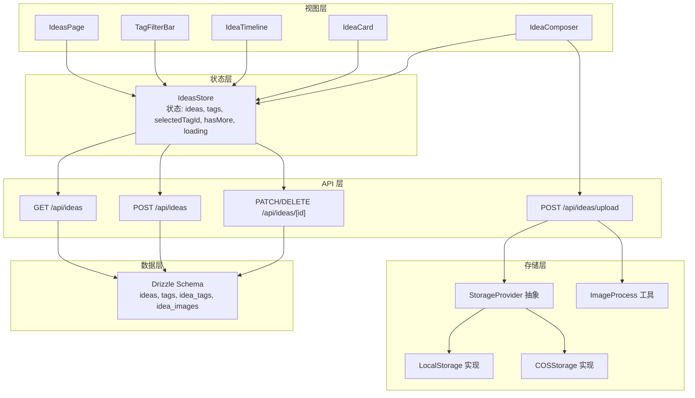
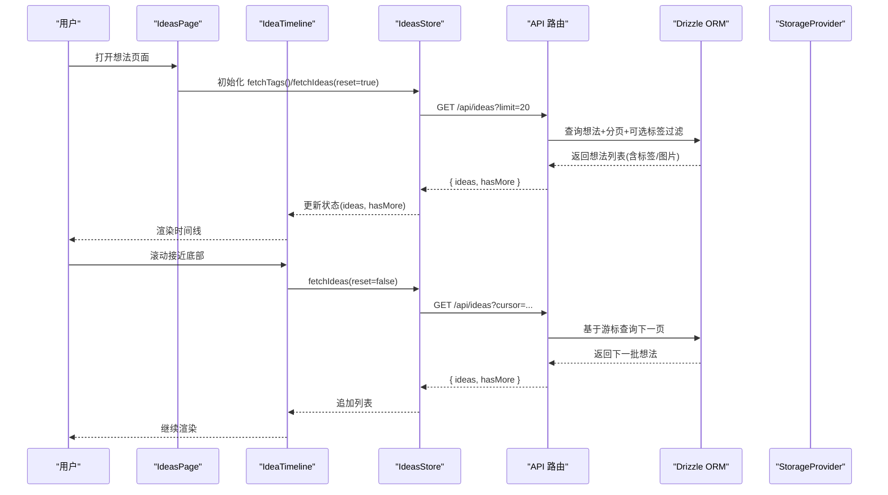
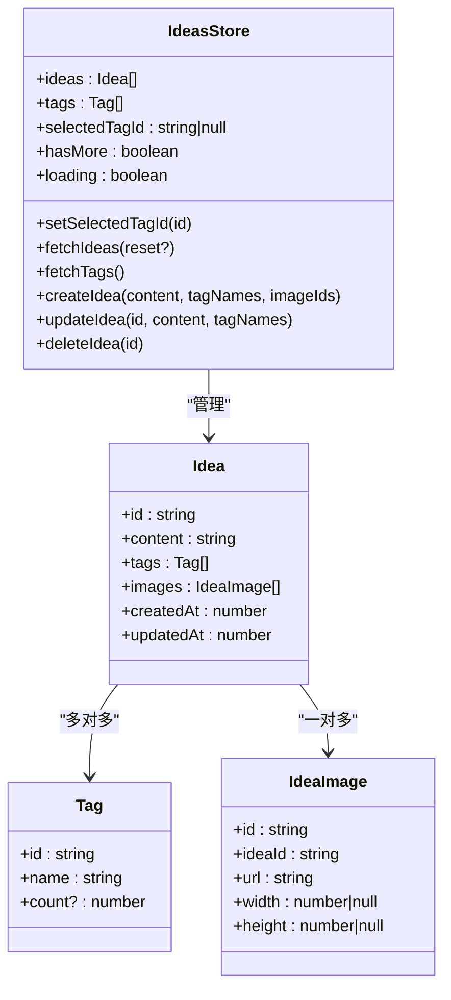
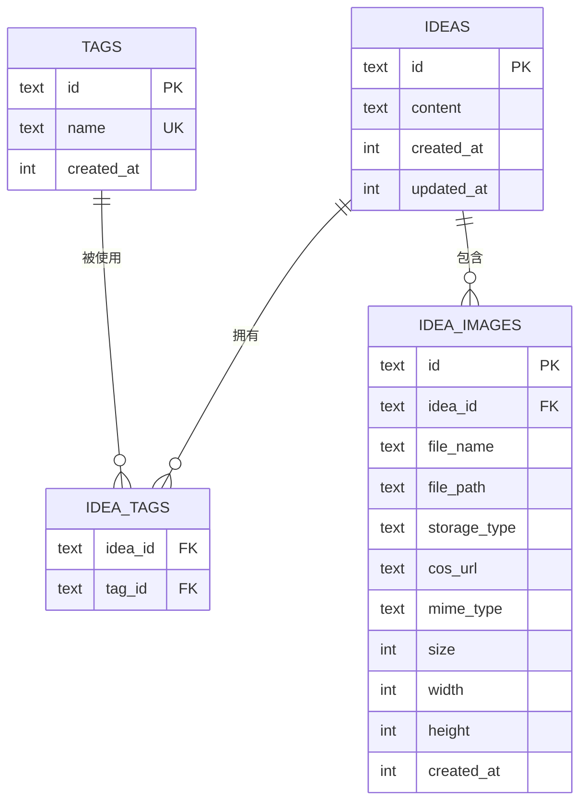
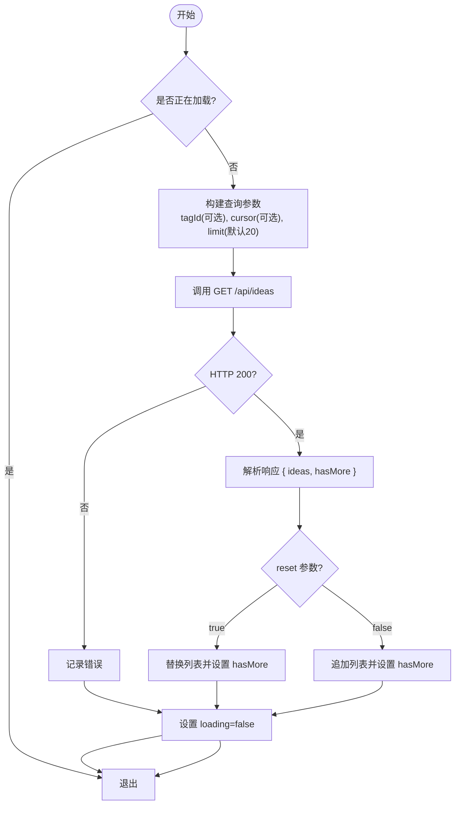
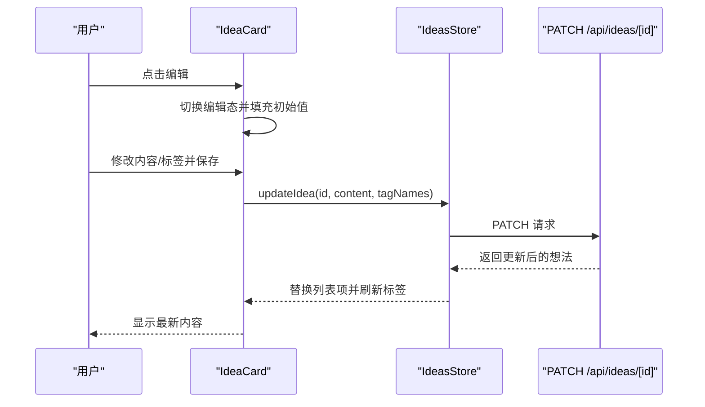
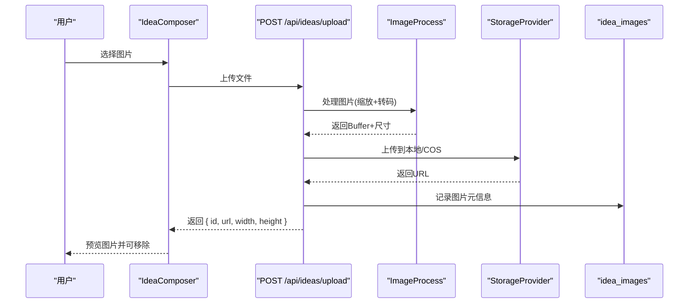
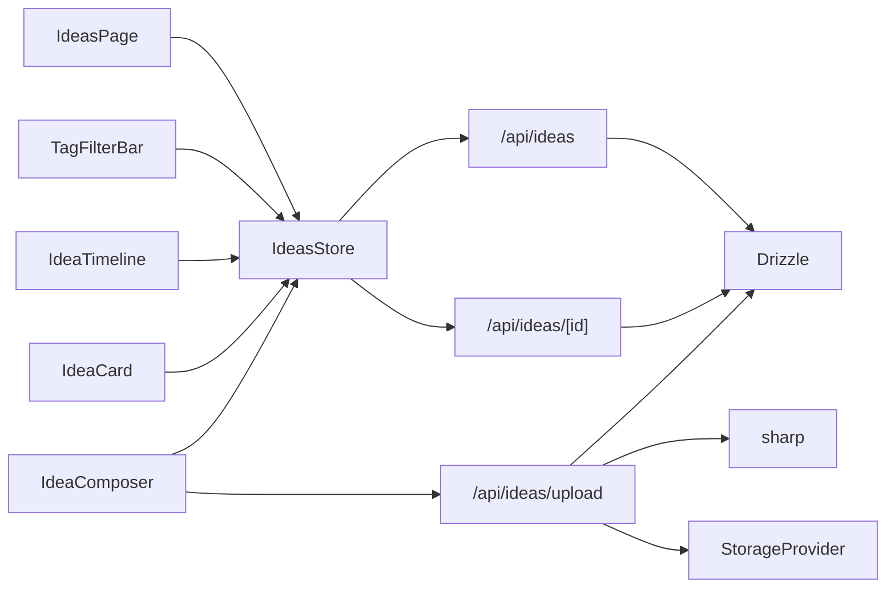

# 想法状态

<cite>
**本文引用的文件**
- [src/stores/ideas-store.ts](file://src/stores/ideas-store.ts)
- [src/components/ideas/ideas-page.tsx](file://src/components/ideas/ideas-page.tsx)
- [src/components/ideas/tag-filter-bar.tsx](file://src/components/ideas/tag-filter-bar.tsx)
- [src/components/ideas/idea-composer.tsx](file://src/components/ideas/idea-composer.tsx)
- [src/components/ideas/idea-timeline.tsx](file://src/components/ideas/idea-timeline.tsx)
- [src/components/ideas/idea-card.tsx](file://src/components/ideas/idea-card.tsx)
- [src/app/api/ideas/route.ts](file://src/app/api/ideas/route.ts)
- [src/app/api/ideas/[id]/route.ts](file://src/app/api/ideas/[id]/route.ts)
- [src/app/api/ideas/upload/route.ts](file://src/app/api/ideas/upload/route.ts)
- [src/types/index.ts](file://src/types/index.ts)
- [src/db/schema.ts](file://src/db/schema.ts)
- [src/lib/storage/index.ts](file://src/lib/storage/index.ts)
- [src/lib/storage/local.ts](file://src/lib/storage/local.ts)
- [src/lib/storage/cos.ts](file://src/lib/storage/cos.ts)
- [src/lib/image-process.ts](file://src/lib/image-process.ts)
- [src/hooks/use-upload-file.ts](file://src/hooks/use-upload-file.ts)
</cite>

## 目录
1. [简介](#简介)
2. [项目结构](#项目结构)
3. [核心组件](#核心组件)
4. [架构总览](#架构总览)
5. [详细组件分析](#详细组件分析)
6. [依赖关系分析](#依赖关系分析)
7. [性能考虑](#性能考虑)
8. [故障排查指南](#故障排查指南)
9. [结论](#结论)
10. [附录](#附录)

## 简介
本文件系统性阐述“想法状态”的设计与实现，围绕 IdeasStore 的状态模型（想法列表、标签筛选、加载与分页、上传与媒体处理）展开，并结合前端组件与后端 API、数据库与存储层，给出端到端的数据流与控制流说明。文档还覆盖缓存策略、性能优化建议以及调试与监控要点，帮助开发者快速理解与扩展该模块。

## 项目结构
想法状态相关代码主要分布在以下区域：
- 状态层：Zustand Store（想法列表、标签、筛选、加载状态）
- 视图层：想法页面、时间线、标签筛选条、想法编辑卡片、想法撰写器
- API 层：想法列表/增删改、单个想法详情、图片上传
- 数据层：Drizzle ORM 表结构（想法、标签、想法-标签关联、想法图片）
- 存储层：本地存储与腾讯云 COS 的抽象与实现，配合图片处理

图表来源
- [src/stores/ideas-store.ts:1-126](file://src/stores/ideas-store.ts#L1-L126)
- [src/components/ideas/ideas-page.tsx:1-43](file://src/components/ideas/ideas-page.tsx#L1-L43)
- [src/components/ideas/tag-filter-bar.tsx:1-52](file://src/components/ideas/tag-filter-bar.tsx#L1-L52)
- [src/components/ideas/idea-timeline.tsx:1-69](file://src/components/ideas/idea-timeline.tsx#L1-L69)
- [src/components/ideas/idea-card.tsx:1-190](file://src/components/ideas/idea-card.tsx#L1-L190)
- [src/components/ideas/idea-composer.tsx:1-202](file://src/components/ideas/idea-composer.tsx#L1-L202)
- [src/app/api/ideas/route.ts:1-151](file://src/app/api/ideas/route.ts#L1-L151)
- [src/app/api/ideas/[id]/route.ts](file://src/app/api/ideas/[id]/route.ts#L1-L117)
- [src/app/api/ideas/upload/route.ts:1-66](file://src/app/api/ideas/upload/route.ts#L1-L66)
- [src/db/schema.ts:57-91](file://src/db/schema.ts#L57-L91)
- [src/lib/storage/index.ts:1-30](file://src/lib/storage/index.ts#L1-L30)
- [src/lib/storage/local.ts:1-29](file://src/lib/storage/local.ts#L1-L29)
- [src/lib/storage/cos.ts:1-62](file://src/lib/storage/cos.ts#L1-L62)
- [src/lib/image-process.ts:1-21](file://src/lib/image-process.ts#L1-L21)

章节来源
- [src/stores/ideas-store.ts:1-126](file://src/stores/ideas-store.ts#L1-L126)
- [src/components/ideas/ideas-page.tsx:1-43](file://src/components/ideas/ideas-page.tsx#L1-L43)
- [src/components/ideas/tag-filter-bar.tsx:1-52](file://src/components/ideas/tag-filter-bar.tsx#L1-L52)
- [src/components/ideas/idea-timeline.tsx:1-69](file://src/components/ideas/idea-timeline.tsx#L1-L69)
- [src/components/ideas/idea-card.tsx:1-190](file://src/components/ideas/idea-card.tsx#L1-L190)
- [src/components/ideas/idea-composer.tsx:1-202](file://src/components/ideas/idea-composer.tsx#L1-L202)
- [src/app/api/ideas/route.ts:1-151](file://src/app/api/ideas/route.ts#L1-L151)
- [src/app/api/ideas/[id]/route.ts](file://src/app/api/ideas/[id]/route.ts#L1-L117)
- [src/app/api/ideas/upload/route.ts:1-66](file://src/app/api/ideas/upload/route.ts#L1-L66)
- [src/db/schema.ts:57-91](file://src/db/schema.ts#L57-L91)
- [src/lib/storage/index.ts:1-30](file://src/lib/storage/index.ts#L1-L30)
- [src/lib/storage/local.ts:1-29](file://src/lib/storage/local.ts#L1-L29)
- [src/lib/storage/cos.ts:1-62](file://src/lib/storage/cos.ts#L1-L62)
- [src/lib/image-process.ts:1-21](file://src/lib/image-process.ts#L1-L21)

## 核心组件
- IdeasStore：集中管理想法列表、标签、筛选、分页与加载状态；提供增删改查与上传调用。
- 视图组件：想法页面负责初始化与筛选联动；时间线负责无限滚动；标签筛选条负责标签选择；想法卡片负责编辑与删除；想法撰写器负责输入、标签与图片上传。
- API 层：提供想法列表、创建、更新、删除、图片上传接口；后端聚合标签与图片信息返回。
- 数据层：Drizzle 定义想法、标签、关联表与图片表，确保数据一致性。
- 存储层：根据环境自动选择本地或 COS 存储，统一上传、删除与 URL 获取接口；图片上传前进行压缩与尺寸处理。

章节来源
- [src/stores/ideas-store.ts:1-126](file://src/stores/ideas-store.ts#L1-L126)
- [src/components/ideas/ideas-page.tsx:1-43](file://src/components/ideas/ideas-page.tsx#L1-L43)
- [src/components/ideas/idea-timeline.tsx:1-69](file://src/components/ideas/idea-timeline.tsx#L1-L69)
- [src/components/ideas/tag-filter-bar.tsx:1-52](file://src/components/ideas/tag-filter-bar.tsx#L1-L52)
- [src/components/ideas/idea-card.tsx:1-190](file://src/components/ideas/idea-card.tsx#L1-L190)
- [src/components/ideas/idea-composer.tsx:1-202](file://src/components/ideas/idea-composer.tsx#L1-L202)
- [src/app/api/ideas/route.ts:1-151](file://src/app/api/ideas/route.ts#L1-L151)
- [src/app/api/ideas/[id]/route.ts](file://src/app/api/ideas/[id]/route.ts#L1-L117)
- [src/app/api/ideas/upload/route.ts:1-66](file://src/app/api/ideas/upload/route.ts#L1-L66)
- [src/db/schema.ts:57-91](file://src/db/schema.ts#L57-L91)
- [src/lib/storage/index.ts:1-30](file://src/lib/storage/index.ts#L1-L30)
- [src/lib/storage/local.ts:1-29](file://src/lib/storage/local.ts#L1-L29)
- [src/lib/storage/cos.ts:1-62](file://src/lib/storage/cos.ts#L1-L62)
- [src/lib/image-process.ts:1-21](file://src/lib/image-process.ts#L1-L21)

## 架构总览
下面以序列图展示“想法列表加载与无限滚动”的端到端流程，体现前端状态、API、数据库与存储之间的交互。

图表来源
- [src/components/ideas/ideas-page.tsx:14-23](file://src/components/ideas/ideas-page.tsx#L14-L23)
- [src/components/ideas/idea-timeline.tsx:15-35](file://src/components/ideas/idea-timeline.tsx#L15-L35)
- [src/stores/ideas-store.ts:29-59](file://src/stores/ideas-store.ts#L29-L59)
- [src/app/api/ideas/route.ts:7-84](file://src/app/api/ideas/route.ts#L7-L84)
- [src/db/schema.ts:57-91](file://src/db/schema.ts#L57-L91)

## 详细组件分析

### IdeasStore 设计与状态模型
- 状态字段
  - ideas：当前时间线上的想法数组（按创建时间倒序）
  - tags：标签集合（含名称与可选计数）
  - selectedTagId：当前选中的标签 ID 或空（表示全部）
  - hasMore：是否存在更多数据
  - loading：是否正在加载
- 关键动作
  - setSelectedTagId：切换标签筛选
  - fetchIdeas(reset?)：加载想法列表，支持重置或追加；通过 cursor 实现无感分页
  - fetchTags：加载标签
  - createIdea/content/tagNames/imageIds：创建想法并刷新标签
  - updateIdea/id/content/tagNames：更新想法并刷新标签
  - deleteIdea/id：删除想法并刷新标签

图表来源
- [src/stores/ideas-store.ts:4-18](file://src/stores/ideas-store.ts#L4-L18)
- [src/types/index.ts:43-58](file://src/types/index.ts#L43-L58)
- [src/types/index.ts:37-41](file://src/types/index.ts#L37-L41)
- [src/types/index.ts:52-58](file://src/types/index.ts#L52-L58)

章节来源
- [src/stores/ideas-store.ts:1-126](file://src/stores/ideas-store.ts#L1-L126)
- [src/types/index.ts:37-58](file://src/types/index.ts#L37-L58)

### 想法数据结构与字段管理
- Idea：包含内容、标签数组、图片数组、创建/更新时间戳
- Tag：标签名与可选计数
- IdeaImage：图片唯一标识、所属想法、URL、宽高、存储元信息
- 数据库表
  - ideas：主表，记录想法内容与时间戳
  - tags：标签表，唯一约束保证去重
  - idea_tags：想法-标签关联表，支持多标签
  - idea_images：图片表，记录文件路径、存储类型、尺寸与时间戳

图表来源
- [src/db/schema.ts:57-91](file://src/db/schema.ts#L57-L91)

章节来源
- [src/types/index.ts:43-58](file://src/types/index.ts#L43-L58)
- [src/db/schema.ts:57-91](file://src/db/schema.ts#L57-L91)

### 想法列表加载与分页（懒加载与无限滚动）
- 分页参数
  - limit：默认 20，最大 50
  - cursor：基于最后一条想法的 createdAt 时间戳，作为上界条件
  - tagId：可选标签过滤
- 加载策略
  - reset=true：重置列表并设置 hasMore
  - reset=false：追加新数据并更新 hasMore
- 无限滚动
  - 使用 IntersectionObserver 在底部哨兵元素进入视口时触发 fetchIdeas(false)
  - 支持 rootMargin 提前触发，提升体验

图表来源
- [src/stores/ideas-store.ts:29-59](file://src/stores/ideas-store.ts#L29-L59)
- [src/app/api/ideas/route.ts:7-84](file://src/app/api/ideas/route.ts#L7-L84)
- [src/components/ideas/idea-timeline.tsx:15-35](file://src/components/ideas/idea-timeline.tsx#L15-L35)

章节来源
- [src/stores/ideas-store.ts:29-59](file://src/stores/ideas-store.ts#L29-L59)
- [src/app/api/ideas/route.ts:7-84](file://src/app/api/ideas/route.ts#L7-L84)
- [src/components/ideas/idea-timeline.tsx:1-69](file://src/components/ideas/idea-timeline.tsx#L1-L69)

### 想法筛选与搜索（标签过滤）
- 标签筛选
  - TagFilterBar 提供标签按钮组，点击切换 selectedTagId
  - IdeasPage 中监听 selectedTagId 变化，触发 fetchIdeas(true) 重载列表
- 搜索
  - 当前实现为标签过滤；如需全文搜索，可在 API 层增加 content 模糊匹配并在 Store 中暴露搜索关键词状态

章节来源
- [src/components/ideas/tag-filter-bar.tsx:1-52](file://src/components/ideas/tag-filter-bar.tsx#L1-L52)
- [src/components/ideas/ideas-page.tsx:14-23](file://src/components/ideas/ideas-page.tsx#L14-L23)
- [src/stores/ideas-store.ts:27-27](file://src/stores/ideas-store.ts#L27-L27)

### 想法详情状态（编辑模式与内容同步）
- 编辑模式
  - IdeaCard 内部维护 editing/editContent/editTagNames 等本地状态
  - Enter+Ctrl/Cmd 保存；Esc 取消
- 状态同步
  - updateIdea 调用后，Store 以映射方式替换对应想法，保持 UI 即时反馈
  - 同步刷新标签统计

图表来源
- [src/components/ideas/idea-card.tsx:26-76](file://src/components/ideas/idea-card.tsx#L26-L76)
- [src/stores/ideas-store.ts:93-112](file://src/stores/ideas-store.ts#L93-L112)
- [src/app/api/ideas/[id]/route.ts](file://src/app/api/ideas/[id]/route.ts#L40-L94)

章节来源
- [src/components/ideas/idea-card.tsx:1-190](file://src/components/ideas/idea-card.tsx#L1-L190)
- [src/stores/ideas-store.ts:93-112](file://src/stores/ideas-store.ts#L93-L112)
- [src/app/api/ideas/[id]/route.ts](file://src/app/api/ideas/[id]/route.ts#L40-L94)

### 想法上传与媒体处理状态
- 媒体上传
  - IdeaComposer 触发 /api/ideas/upload，逐张上传并收集返回的图片元信息
  - Store 在创建想法时将图片 ID 一并提交
- 图片处理
  - 服务端使用 sharp 将图片缩放至最大宽度 1920 并转为 WebP，保留宽高
  - 存储层根据环境选择本地或 COS，返回统一 URL
- 状态管理
  - 上传期间显示 loading，成功后加入 pending 图片列表，提交后清空

图表来源
- [src/components/ideas/idea-composer.tsx:45-81](file://src/components/ideas/idea-composer.tsx#L45-L81)
- [src/app/api/ideas/upload/route.ts:11-66](file://src/app/api/ideas/upload/route.ts#L11-L66)
- [src/lib/image-process.ts:3-20](file://src/lib/image-process.ts#L3-L20)
- [src/lib/storage/index.ts:12-29](file://src/lib/storage/index.ts#L12-L29)
- [src/lib/storage/local.ts:8-16](file://src/lib/storage/local.ts#L8-L16)
- [src/lib/storage/cos.ts:25-40](file://src/lib/storage/cos.ts#L25-L40)
- [src/db/schema.ts:64-76](file://src/db/schema.ts#L64-L76)

章节来源
- [src/components/ideas/idea-composer.tsx:1-202](file://src/components/ideas/idea-composer.tsx#L1-L202)
- [src/app/api/ideas/upload/route.ts:1-66](file://src/app/api/ideas/upload/route.ts#L1-L66)
- [src/lib/image-process.ts:1-21](file://src/lib/image-process.ts#L1-L21)
- [src/lib/storage/index.ts:1-30](file://src/lib/storage/index.ts#L1-L30)
- [src/lib/storage/local.ts:1-29](file://src/lib/storage/local.ts#L1-L29)
- [src/lib/storage/cos.ts:1-62](file://src/lib/storage/cos.ts#L1-L62)
- [src/db/schema.ts:64-76](file://src/db/schema.ts#L64-L76)

### 想法状态与文件系统的集成机制
- 本地开发：LocalStorage 将文件写入本地 data/uploads 目录，返回 /api/files/{key}
- 生产环境：COSStorage 上传至指定桶与目录，返回公网 URL
- 文件路由：/api/files/{key} 由文件系统提供静态访问
- 图片上传：统一走 /api/ideas/upload，内部完成处理与入库

章节来源
- [src/lib/storage/local.ts:8-16](file://src/lib/storage/local.ts#L8-L16)
- [src/lib/storage/cos.ts:25-40](file://src/lib/storage/cos.ts#L25-L40)
- [src/app/api/ideas/upload/route.ts:40-60](file://src/app/api/ideas/upload/route.ts#L40-L60)

### 缓存策略与性能优化
- 前端缓存
  - Store 内部缓存已加载的想法列表与标签，避免重复请求
  - 通过 reset=false 的追加模式实现“无限滚动”增量加载
- 后端缓存
  - Drizzle 查询使用 limit+1 与游标，减少全量扫描
  - 标签与图片关联查询一次性拉取，降低 N+1 风险
- 图片优化
  - 服务端统一压缩与格式转换，减小传输体积
- 交互优化
  - IntersectionObserver 提前触发加载，rootMargin 提升感知速度
  - loading 状态避免重复请求

章节来源
- [src/stores/ideas-store.ts:29-59](file://src/stores/ideas-store.ts#L29-L59)
- [src/app/api/ideas/route.ts:13-46](file://src/app/api/ideas/route.ts#L13-L46)
- [src/lib/image-process.ts:8-10](file://src/lib/image-process.ts#L8-L10)
- [src/components/ideas/idea-timeline.tsx:29-31](file://src/components/ideas/idea-timeline.tsx#L29-L31)

## 依赖关系分析
- 组件耦合
  - IdeasPage 依赖 Store 的 fetchTags 与 fetchIdeas，并监听 selectedTagId 变化
  - IdeaTimeline 仅依赖 Store 的列表与分页状态，解耦具体加载逻辑
  - IdeaCard 与 IdeaComposer 通过 Store 的 CRUD 动作与 API 通信
- 外部依赖
  - Zustand：轻量状态管理
  - Drizzle：SQLite ORM，提供类型安全的查询
  - sharp：图片处理
  - COS SDK：对象存储

图表来源
- [src/components/ideas/ideas-page.tsx:9-23](file://src/components/ideas/ideas-page.tsx#L9-L23)
- [src/components/ideas/tag-filter-bar.tsx:6-15](file://src/components/ideas/tag-filter-bar.tsx#L6-L15)
- [src/components/ideas/idea-timeline.tsx:8-12](file://src/components/ideas/idea-timeline.tsx#L8-L12)
- [src/components/ideas/idea-card.tsx:14-24](file://src/components/ideas/idea-card.tsx#L14-L24)
- [src/components/ideas/idea-composer.tsx:25-25](file://src/components/ideas/idea-composer.tsx#L25-L25)
- [src/stores/ideas-store.ts:13-17](file://src/stores/ideas-store.ts#L13-L17)
- [src/app/api/ideas/route.ts:1-151](file://src/app/api/ideas/route.ts#L1-L151)
- [src/app/api/ideas/[id]/route.ts](file://src/app/api/ideas/[id]/route.ts#L1-L117)
- [src/app/api/ideas/upload/route.ts:1-66](file://src/app/api/ideas/upload/route.ts#L1-L66)
- [src/lib/image-process.ts:1-21](file://src/lib/image-process.ts#L1-L21)
- [src/db/schema.ts:57-91](file://src/db/schema.ts#L57-L91)
- [src/lib/storage/index.ts:1-30](file://src/lib/storage/index.ts#L1-L30)

章节来源
- [src/components/ideas/ideas-page.tsx:1-43](file://src/components/ideas/ideas-page.tsx#L1-L43)
- [src/components/ideas/tag-filter-bar.tsx:1-52](file://src/components/ideas/tag-filter-bar.tsx#L1-L52)
- [src/components/ideas/idea-timeline.tsx:1-69](file://src/components/ideas/idea-timeline.tsx#L1-L69)
- [src/components/ideas/idea-card.tsx:1-190](file://src/components/ideas/idea-card.tsx#L1-L190)
- [src/components/ideas/idea-composer.tsx:1-202](file://src/components/ideas/idea-composer.tsx#L1-L202)
- [src/stores/ideas-store.ts:1-126](file://src/stores/ideas-store.ts#L1-L126)
- [src/app/api/ideas/route.ts:1-151](file://src/app/api/ideas/route.ts#L1-L151)
- [src/app/api/ideas/[id]/route.ts](file://src/app/api/ideas/[id]/route.ts#L1-L117)
- [src/app/api/ideas/upload/route.ts:1-66](file://src/app/api/ideas/upload/route.ts#L1-L66)
- [src/lib/image-process.ts:1-21](file://src/lib/image-process.ts#L1-L21)
- [src/db/schema.ts:57-91](file://src/db/schema.ts#L57-L91)
- [src/lib/storage/index.ts:1-30](file://src/lib/storage/index.ts#L1-L30)

## 性能考虑
- 分页与游标
  - 使用 cursor 限制查询范围，避免全表扫描
  - limit+1 策略提前判断 hasMore，减少多余请求
- 前端渲染
  - 仅渲染可见区域，结合虚拟列表可进一步优化长列表
- 图片处理
  - 服务端统一压缩与编码，减少带宽占用
- 并发控制
  - Store 中 loading 标志防止重复请求
- 缓存与去重
  - Store 内部缓存已加载数据，避免重复网络请求

## 故障排查指南
- 列表加载失败
  - 检查 /api/ideas 的返回结构与 hasMore 字段
  - 确认 selectedTagId 与 cursor 参数传递正确
- 无限滚动无效
  - 确认哨兵元素存在且 IntersectionObserver 配置合理
  - 检查 hasMore 与 loading 状态
- 图片上传失败
  - 检查 /api/ideas/upload 的文件类型与大小限制
  - 查看 sharp 处理日志与存储上传结果
- 标签统计异常
  - 确认创建/更新想法后调用了 fetchTags
  - 检查 idea_tags 关联表是否正确写入

章节来源
- [src/stores/ideas-store.ts:54-58](file://src/stores/ideas-store.ts#L54-L58)
- [src/components/ideas/idea-timeline.tsx:15-35](file://src/components/ideas/idea-timeline.tsx#L15-L35)
- [src/app/api/ideas/upload/route.ts:17-27](file://src/app/api/ideas/upload/route.ts#L17-L27)
- [src/lib/image-process.ts:8-10](file://src/lib/image-process.ts#L8-L10)
- [src/stores/ideas-store.ts:83-84](file://src/stores/ideas-store.ts#L83-L84)

## 结论
IdeasStore 以简洁的状态模型承载了想法列表、标签筛选、分页与媒体上传等核心能力，配合 Drizzle 与存储抽象实现了前后端一体化的数据流。通过游标分页、IntersectionObserver 与图片处理等手段，系统在可用性与性能之间取得良好平衡。后续可扩展内容搜索、标签计数统计与虚拟列表渲染等能力，持续优化用户体验。

## 附录
- 相关 Hook
  - use-upload-file：通用文件上传 Hook（非想法专用），可参考其进度与错误处理模式
- 类型定义
  - Idea/Tag/IdeaImage：统一的数据契约，便于跨组件共享

章节来源
- [src/hooks/use-upload-file.ts:1-53](file://src/hooks/use-upload-file.ts#L1-L53)
- [src/types/index.ts:37-58](file://src/types/index.ts#L37-L58)