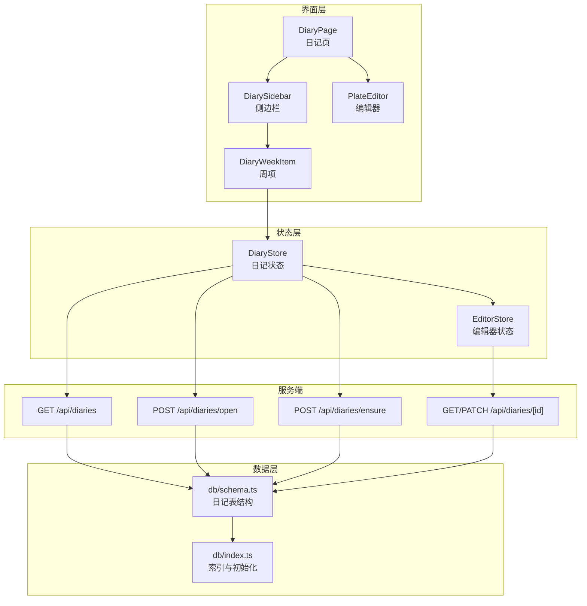
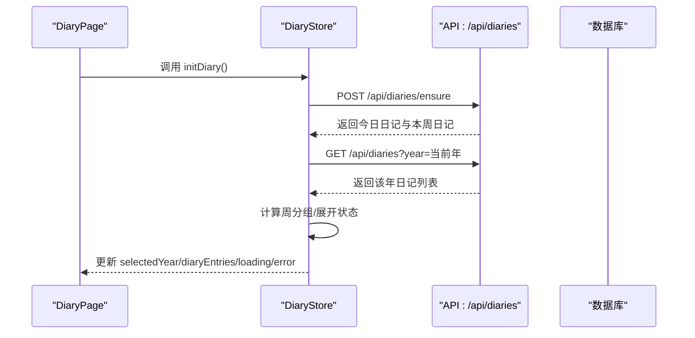
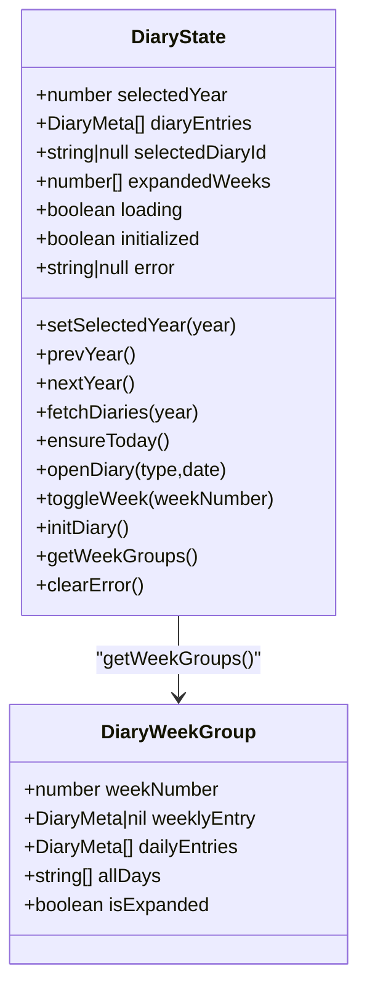
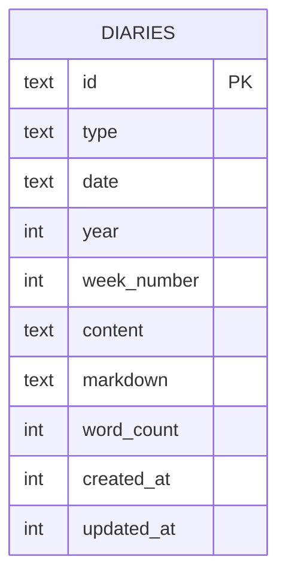
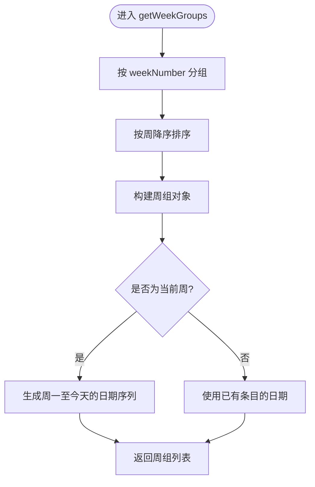
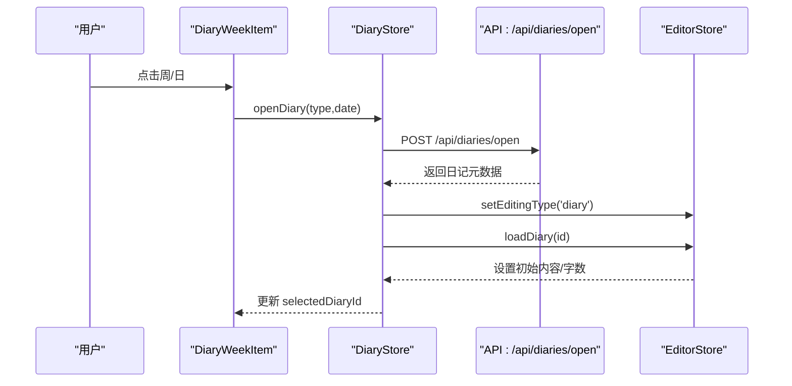
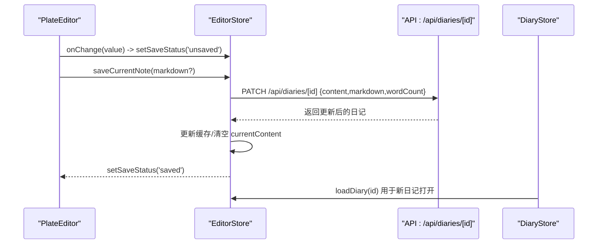
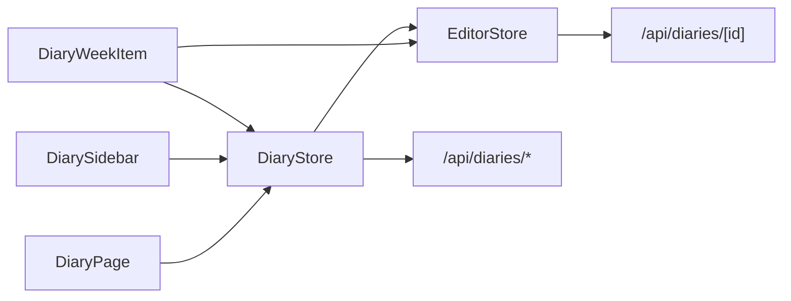

# 日记状态

<cite>
**本文引用的文件**
- [src/stores/diary-store.ts](file://src/stores/diary-store.ts)
- [src/lib/diary-utils.ts](file://src/lib/diary-utils.ts)
- [src/components/diary/diary-page.tsx](file://src/components/diary/diary-page.tsx)
- [src/components/diary/diary-sidebar.tsx](file://src/components/diary/diary-sidebar.tsx)
- [src/components/diary/diary-week-item.tsx](file://src/components/diary/diary-week-item.tsx)
- [src/components/editor/plate-editor.tsx](file://src/components/editor/plate-editor.tsx)
- [src/stores/editor-store.ts](file://src/stores/editor-store.ts)
- [src/db/schema.ts](file://src/db/schema.ts)
- [src/app/api/diaries/route.ts](file://src/app/api/diaries/route.ts)
- [src/app/api/diaries/[id]/route.ts](file://src/app/api/diaries/[id]/route.ts)
- [src/app/api/diaries/ensure/route.ts](file://src/app/api/diaries/ensure/route.ts)
- [src/app/api/diaries/open/route.ts](file://src/app/api/diaries/open/route.ts)
- [src/types/index.ts](file://src/types/index.ts)
- [src/db/index.ts](file://src/db/index.ts)
</cite>

## 更新摘要
**所做更改**
- 新增错误状态管理机制，包括错误解析、错误清除和错误显示
- 改进日记初始化流程，增强错误处理和状态同步
- 优化编辑器与日记状态的联动机制
- 完善日记列表的加载状态管理
- 增强日记打开操作的原子性和一致性保证

## 目录
1. [简介](#简介)
2. [项目结构](#项目结构)
3. [核心组件](#核心组件)
4. [架构总览](#架构总览)
5. [详细组件分析](#详细组件分析)
6. [依赖关系分析](#依赖关系分析)
7. [性能考量](#性能考量)
8. [故障排查指南](#故障排查指南)
9. [结论](#结论)
10. [附录](#附录)

## 简介
本文件系统性阐述日记状态管理的设计与实现，围绕 DiaryStore 的架构与职责展开，覆盖以下主题：
- 日记列表状态、日期导航状态与编辑状态的组织方式
- 日记数据结构（日期索引、内容存储、字数统计）与数据库模型映射
- 时间轴渲染状态（周视图、月视图、年视图）的管理策略
- 导航机制（年份切换、周/日跳转、快速定位、历史浏览）
- 编辑状态管理（草稿保存、实时预览、未保存提示）
- 搜索与筛选（当前仓库未实现，但可基于现有状态扩展）
- 导入导出（当前仓库未实现，提供扩展建议）
- 本地缓存与同步（编辑器内容缓存与服务端持久化）
- 统计与可视化（基于现有字段与时间轴结构的扩展路径）

## 项目结构
本项目采用"按功能域分层"的组织方式：页面组件位于 components/ 下，状态逻辑位于 stores/，数据访问位于 app/api/ 与 db/，类型定义位于 types/。

**图表来源**
- [src/components/diary/diary-page.tsx:1-29](file://src/components/diary/diary-page.tsx#L1-L29)
- [src/components/diary/diary-sidebar.tsx:1-116](file://src/components/diary/diary-sidebar.tsx#L1-L116)
- [src/components/diary/diary-week-item.tsx:1-122](file://src/components/diary/diary-week-item.tsx#L1-L122)
- [src/components/editor/plate-editor.tsx:1-175](file://src/components/editor/plate-editor.tsx#L1-L175)
- [src/stores/diary-store.ts:1-266](file://src/stores/diary-store.ts#L1-L266)
- [src/stores/editor-store.ts:1-343](file://src/stores/editor-store.ts#L1-L343)
- [src/app/api/diaries/route.ts:1-35](file://src/app/api/diaries/route.ts#L1-L35)
- [src/app/api/diaries/open/route.ts:1-105](file://src/app/api/diaries/open/route.ts#L1-L105)
- [src/app/api/diaries/ensure/route.ts:1-117](file://src/app/api/diaries/ensure/route.ts#L1-L117)
- [src/app/api/diaries/[id]/route.ts:1-54](file://src/app/api/diaries/[id]/route.ts#L1-L54)
- [src/db/schema.ts:93-104](file://src/db/schema.ts#L93-L104)
- [src/db/index.ts:127-170](file://src/db/index.ts#L127-L170)

**章节来源**
- [src/stores/diary-store.ts:1-266](file://src/stores/diary-store.ts#L1-L266)
- [src/stores/editor-store.ts:1-343](file://src/stores/editor-store.ts#L1-L343)
- [src/db/schema.ts:93-104](file://src/db/schema.ts#L93-L104)

## 核心组件
- DiaryStore：负责日记列表、年份导航、周展开/收起、当前选中日记、初始化流程与周分组计算，**新增错误状态管理**。
- EditorStore：负责编辑器内容加载/切换、保存状态、字数统计、内容缓存与序列化。
- DiaryUtils：提供日期/周/日标签生成、当前周判断、周内天数集合等工具。
- 页面与组件：DiaryPage 初始化日记；DiarySidebar 渲染年份与周列表；DiaryWeekItem 处理周/日点击与未保存确认；PlateEditor 提供实时编辑与保存状态反馈。

**章节来源**
- [src/stores/diary-store.ts:21-38](file://src/stores/diary-store.ts#L21-L38)
- [src/stores/editor-store.ts:15-64](file://src/stores/editor-store.ts#L15-L64)
- [src/lib/diary-utils.ts:1-113](file://src/lib/diary-utils.ts#L1-L113)
- [src/components/diary/diary-page.tsx:1-29](file://src/components/diary/diary-page.tsx#L1-L29)
- [src/components/diary/diary-sidebar.tsx:1-116](file://src/components/diary/diary-sidebar.tsx#L1-L116)
- [src/components/diary/diary-week-item.tsx:1-122](file://src/components/diary/diary-week-item.tsx#L1-L122)
- [src/components/editor/plate-editor.tsx:1-175](file://src/components/editor/plate-editor.tsx#L1-L175)

## 架构总览
DiaryStore 作为状态中心，协调 UI 与后端 API；EditorStore 负责编辑器内容与持久化；数据库通过 Drizzle ORM 映射到 SQLite 表结构，并在启动时建立必要索引。

**图表来源**
- [src/components/diary/diary-page.tsx:8-13](file://src/components/diary/diary-page.tsx#L8-L13)
- [src/stores/diary-store.ts:183-217](file://src/stores/diary-store.ts#L183-L217)
- [src/app/api/diaries/ensure/route.ts:9-116](file://src/app/api/diaries/ensure/route.ts#L9-L116)
- [src/app/api/diaries/route.ts:7-34](file://src/app/api/diaries/route.ts#L7-L34)

## 详细组件分析

### DiaryStore 设计与状态
- 关键状态
  - selectedYear：当前选中的年份
  - diaryEntries：年度日记元数据列表
  - selectedDiaryId：当前选中日记 ID
  - expandedWeeks：已展开的周号数组
  - loading：加载状态
  - initialized：初始化完成标志
  - **error：错误状态，用于显示和管理API调用错误**
- 关键方法
  - 年份导航：setSelectedYear/prevYear/nextYear
  - 列表拉取：fetchDiaries（**新增错误处理**）
  - 初始化：ensureToday/initDiary（**增强错误处理和状态同步**）
  - 打开日记：openDiary（含新建/打开、更新列表、联动编辑器）
  - 周展开：toggleWeek
  - 周分组：getWeekGroups（按周聚合、生成 allDays、控制当前周显示范围）
  - **错误管理：clearError（清除错误状态）**

**图表来源**
- [src/stores/diary-store.ts:32-51](file://src/stores/diary-store.ts#L32-L51)
- [src/stores/diary-store.ts:23-30](file://src/stores/diary-store.ts#L23-L30)

**章节来源**
- [src/stores/diary-store.ts:53-266](file://src/stores/diary-store.ts#L53-L266)

### 日记数据结构与数据库映射
- 类型定义
  - DiaryMeta：不包含 content/markdown 的日记元信息
  - DiaryEntry：包含 content/markdown 的日记详情
- 数据库表
  - diaries：主表，包含 id、type、date、year、weekNumber、content、markdown、wordCount、createdAt、updatedAt
- 索引
  - type+date 唯一索引
  - year 单列索引
  - year+week_number 复合索引

**图表来源**
- [src/db/schema.ts:93-104](file://src/db/schema.ts#L93-L104)
- [src/db/index.ts:127-130](file://src/db/index.ts#L127-L130)
- [src/types/index.ts:55-69](file://src/types/index.ts#L55-L69)

**章节来源**
- [src/types/index.ts:55-69](file://src/types/index.ts#L55-L69)
- [src/db/schema.ts:93-104](file://src/db/schema.ts#L93-L104)
- [src/db/index.ts:127-130](file://src/db/index.ts#L127-L130)

### 时间轴渲染状态（周/日视图）
- 周分组
  - 按 weekNumber 聚合 weekly 与 daily 条目
  - 当前周：allDays 为从周一到"今天"的完整日期序列
  - 历史周：allDays 仅包含已有条目的日期
- 展开/收起
  - expandedWeeks 控制周项展开状态
- 标签与样式
  - 周标题、日标签、星期标签、今日标记

**图表来源**
- [src/stores/diary-store.ts:219-264](file://src/stores/diary-store.ts#L219-L264)
- [src/lib/diary-utils.ts:62-97](file://src/lib/diary-utils.ts#L62-L97)

**章节来源**
- [src/stores/diary-store.ts:219-264](file://src/stores/diary-store.ts#L219-L264)
- [src/lib/diary-utils.ts:62-97](file://src/lib/diary-utils.ts#L62-L97)

### 导航机制（年份切换、周/日跳转、历史浏览）
- 年份切换
  - prevYear/nextYear 限制不可超过当前年
  - 切换后自动拉取对应年的日记列表
- 周/日跳转
  - Weekly：点击周标题打开对应周的 weekly 日记
  - Daily：点击具体日期打开对应日的 daily 日记
- 历史浏览
  - 通过 expandedWeeks 控制周展开，结合 allDays 实现历史日期的快速定位

**图表来源**
- [src/components/diary/diary-week-item.tsx:38-46](file://src/components/diary/diary-week-item.tsx#L38-L46)
- [src/stores/diary-store.ts:127-172](file://src/stores/diary-store.ts#L127-L172)
- [src/app/api/diaries/open/route.ts:15-104](file://src/app/api/diaries/open/route.ts#L15-L104)
- [src/stores/editor-store.ts:201-271](file://src/stores/editor-store.ts#L201-L271)

**章节来源**
- [src/components/diary/diary-sidebar.tsx:75-93](file://src/components/diary/diary-sidebar.tsx#L75-L93)
- [src/components/diary/diary-week-item.tsx:38-46](file://src/components/diary/diary-week-item.tsx#L38-L46)
- [src/stores/diary-store.ts:62-81](file://src/stores/diary-store.ts#L62-L81)
- [src/stores/diary-store.ts:127-172](file://src/stores/diary-store.ts#L127-L172)

### 编辑状态管理（草稿保存与实时预览）
- 内容缓存
  - EditorStore 维护 LRU 缓存，按 noteId/diaryId 缓存内容与字数
  - 首次加载命中缓存则直接设置初始内容，否则走 API 拉取并写入缓存
- 保存流程
  - PlateEditor 使用结构化比较检测变更，更新 saveStatus 与 currentContent
  - 保存时序列化为 markdown，调用 PATCH /api/diaries/[id] 更新内容与字数
  - 成功后刷新缓存并更新 baselineContent
- 未保存提示
  - DiaryWeekItem 在切换日记前检查 saveStatus，若为 unsaved 弹出确认对话框

**图表来源**
- [src/components/editor/plate-editor.tsx:84-99](file://src/components/editor/plate-editor.tsx#L84-L99)
- [src/stores/editor-store.ts:277-333](file://src/stores/editor-store.ts#L277-L333)
- [src/app/api/diaries/[id]/route.ts:22-53](file://src/app/api/diaries/[id]/route.ts#L22-L53)
- [src/stores/diary-store.ts:163-166](file://src/stores/diary-store.ts#L163-L166)

**章节来源**
- [src/stores/editor-store.ts:16-71](file://src/stores/editor-store.ts#L16-L71)
- [src/stores/editor-store.ts:201-271](file://src/stores/editor-store.ts#L201-L271)
- [src/components/editor/plate-editor.tsx:84-99](file://src/components/editor/plate-editor.tsx#L84-L99)
- [src/components/diary/diary-week-item.tsx:27-36](file://src/components/diary/diary-week-item.tsx#L27-L36)

### 错误状态管理机制
- 错误解析
  - parseErrorResponse 函数统一解析 API 错误响应，提取错误信息
  - 支持 JSON 格式的错误对象和默认错误消息
- 错误传播
  - fetchDiaries、ensureToday、openDiary 方法在捕获错误时设置 error 状态
  - 错误消息通过 console.error 输出便于调试
- 错误清除
  - clearError 方法提供手动清除错误状态的能力
- 错误显示
  - DiarySidebar 和 DiaryWeekItem 组件根据 error 状态显示相应的错误信息
  - PlateEditor 在保存失败时显示错误状态

**更新** 新增完整的错误状态管理机制，包括错误解析、传播、清除和显示

**章节来源**
- [src/stores/diary-store.ts:13-21](file://src/stores/diary-store.ts#L13-L21)
- [src/stores/diary-store.ts:85-102](file://src/stores/diary-store.ts#L85-L102)
- [src/stores/diary-store.ts:104-125](file://src/stores/diary-store.ts#L104-L125)
- [src/stores/diary-store.ts:127-172](file://src/stores/diary-store.ts#L127-L172)
- [src/stores/diary-store.ts:83](file://src/stores/diary-store.ts#L83)

### 搜索与筛选（当前实现与扩展建议）
- 当前实现
  - 未提供关键词搜索与标签过滤的状态管理
- 扩展建议
  - 在 DiaryStore 中新增搜索词与标签过滤状态
  - 在 getWeekGroups 中增加过滤逻辑，或在渲染层进行二次过滤
  - 与 API 结合时可新增查询参数（如 /api/diaries?year&tag&keyword）

**本节为概念性扩展说明，不直接分析具体文件**

### 导入导出（当前实现与扩展建议）
- 当前实现
  - 未提供导入导出接口与状态处理
- 扩展建议
  - 新增导入：解析外部格式（如 Markdown/JSON），批量创建 diaries 记录，触发 DiaryStore 刷新
  - 新增导出：按年/周/日维度导出，支持多格式（Markdown/JSON/ZIP）
  - 导入导出状态：loading、进度、错误提示

**本节为概念性扩展说明，不直接分析具体文件**

### 本地缓存与同步机制
- 编辑器缓存
  - EditorStore 使用 Map 存储最近访问的日记内容，避免重复请求
  - 缓存淘汰：超过阈值时移除最久未使用的条目
- 同步策略
  - 打开日记：先确保存在再加载，保证 UI 与数据一致
  - 保存：服务端更新后刷新缓存，避免脏读
- 数据库索引
  - 通过 year/year+week_number 等索引优化查询性能

**章节来源**
- [src/stores/editor-store.ts:14-20](file://src/stores/editor-store.ts#L14-L20)
- [src/stores/diary-store.ts:127-172](file://src/stores/diary-store.ts#L127-L172)
- [src/db/index.ts:127-130](file://src/db/index.ts#L127-L130)

### 统计分析与可视化支持
- 可用字段
  - wordCount：可用于字数统计
  - createdAt/updatedAt：可用于时间分布
  - year/weekNumber/date：可用于按周/日/年聚合
- 建议
  - 在 DiaryStore 或独立统计模块中按周/月/年聚合 wordCount
  - 与图表库集成，展示趋势图与热力图

**本节为概念性扩展说明，不直接分析具体文件**

## 依赖关系分析
- 组件依赖
  - DiaryPage 依赖 DiaryStore 的初始化
  - DiarySidebar/DiaryWeekItem 依赖 DiaryStore 的年份、列表、展开状态和**错误状态**
  - PlateEditor 依赖 EditorStore 的内容与保存状态
- 状态耦合
  - DiaryStore 与 EditorStore 通过 openDiary/loadDiary 进行联动
- 后端依赖
  - DiaryStore 依赖 /api/diaries/* 接口
  - EditorStore 依赖 /api/diaries/[id] 接口

**图表来源**
- [src/components/diary/diary-page.tsx:8-13](file://src/components/diary/diary-page.tsx#L8-L13)
- [src/components/diary/diary-sidebar.tsx:10-15](file://src/components/diary/diary-sidebar.tsx#L10-L15)
- [src/components/diary/diary-week-item.tsx:18-23](file://src/components/diary/diary-week-item.tsx#L18-L23)
- [src/stores/diary-store.ts:127-172](file://src/stores/diary-store.ts#L127-L172)
- [src/stores/editor-store.ts:201-271](file://src/stores/editor-store.ts#L201-L271)

**章节来源**
- [src/stores/diary-store.ts:127-172](file://src/stores/diary-store.ts#L127-L172)
- [src/stores/editor-store.ts:201-271](file://src/stores/editor-store.ts#L201-L271)

## 性能考量
- 查询优化
  - 使用 year/year+week_number 索引减少排序与过滤成本
- 缓存策略
  - EditorStore 的 LRU 缓存降低重复加载开销
- 渲染优化
  - DiarySidebar 使用 useMemo 对周分组进行缓存，避免重复计算
- 网络请求
  - initDiary 串行执行 ensureToday 与 fetchDiaries，避免并发竞争
- **错误处理优化**
  - 统一的错误解析和状态管理，避免重复的错误处理逻辑

**本节提供通用指导，不直接分析具体文件**

## 故障排查指南
- 打开日记失败
  - 检查 /api/diaries/open 的参数校验（type/date 格式、不可为未来时间）
  - 查看返回状态码与错误信息
  - **检查 DiaryStore 的 error 状态是否被正确设置**
- 列表为空
  - 确认 /api/diaries?year 参数有效且数据库中存在对应记录
  - **检查 fetchDiaries 方法的错误处理和状态更新**
- 保存失败
  - 检查 /api/diaries/[id] PATCH 请求体字段（content/markdown/wordCount）
  - 确认 EditorStore 的 saveStatus 流程是否正确更新
- 缓存异常
  - 检查 EditorStore 的 contentCache 是否正确写入与淘汰
- **错误状态问题**
  - **检查 parseErrorResponse 函数是否正确解析错误**
  - **确认 clearError 方法是否正常工作**

**章节来源**
- [src/app/api/diaries/open/route.ts:15-55](file://src/app/api/diaries/open/route.ts#L15-L55)
- [src/app/api/diaries/route.ts:7-34](file://src/app/api/diaries/route.ts#L7-L34)
- [src/app/api/diaries/[id]/route.ts:22-53](file://src/app/api/diaries/[id]/route.ts#L22-L53)
- [src/stores/editor-store.ts:14-20](file://src/stores/editor-store.ts#L14-L20)
- [src/stores/diary-store.ts:13-21](file://src/stores/diary-store.ts#L13-L21)
- [src/stores/diary-store.ts:83](file://src/stores/diary-store.ts#L83)

## 结论
DiaryStore 将"年-周-日"三层时间轴与"列表-展开-选中"三类状态有机结合，配合 EditorStore 的内容缓存与保存流程，形成了清晰、可维护的日记状态管理方案。**新增的错误状态管理机制进一步增强了系统的健壮性，提供了统一的错误处理和显示能力**。通过数据库索引与渲染层缓存，系统在性能与体验上取得平衡。未来可在搜索/筛选、导入导出、统计可视化等方面进一步扩展。

**本节为总结性内容，不直接分析具体文件**

## 附录
- API 接口概览
  - GET /api/diaries?year：按年返回日记列表
  - POST /api/diaries/open：创建或打开指定类型的日记
  - POST /api/diaries/ensure：确保今日与本周日记存在
  - GET/PATCH /api/diaries/[id]：获取与更新日记详情

**章节来源**
- [src/app/api/diaries/route.ts:7-34](file://src/app/api/diaries/route.ts#L7-L34)
- [src/app/api/diaries/open/route.ts:15-104](file://src/app/api/diaries/open/route.ts#L15-L104)
- [src/app/api/diaries/ensure/route.ts:9-116](file://src/app/api/diaries/ensure/route.ts#L9-L116)
- [src/app/api/diaries/[id]/route.ts:7-53](file://src/app/api/diaries/[id]/route.ts#L7-L53)