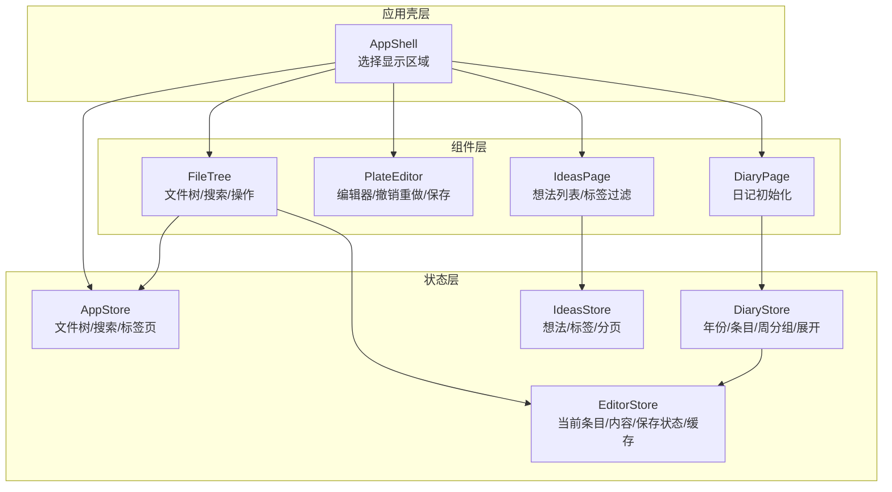
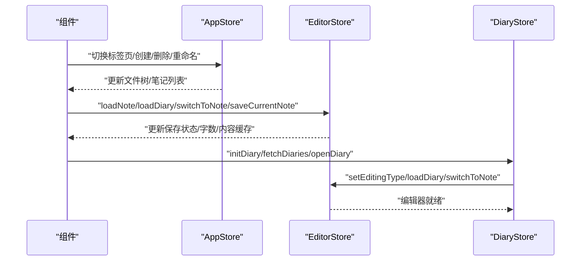
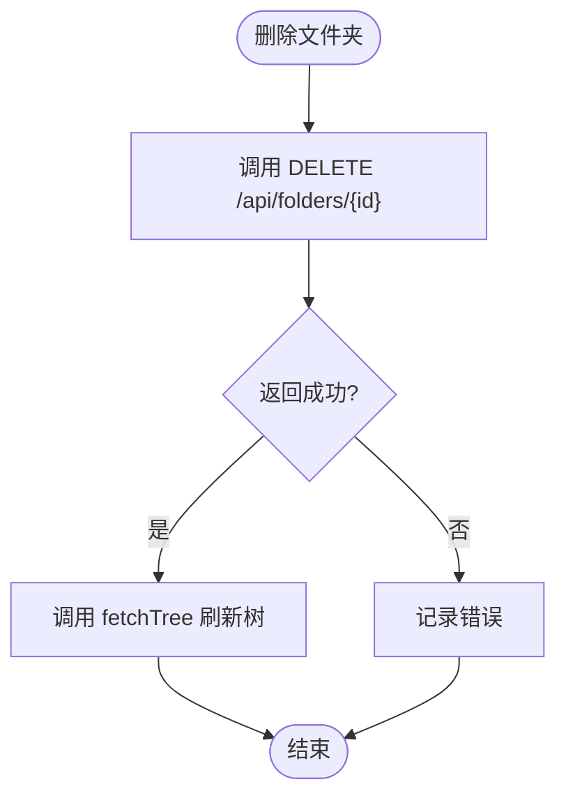
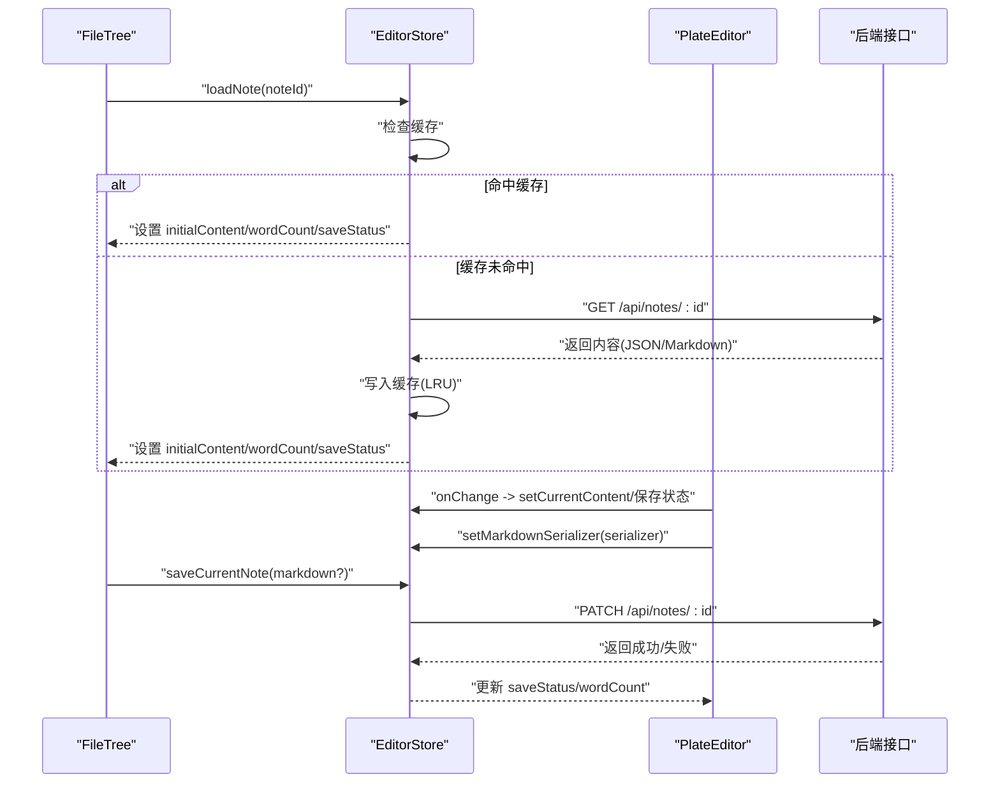
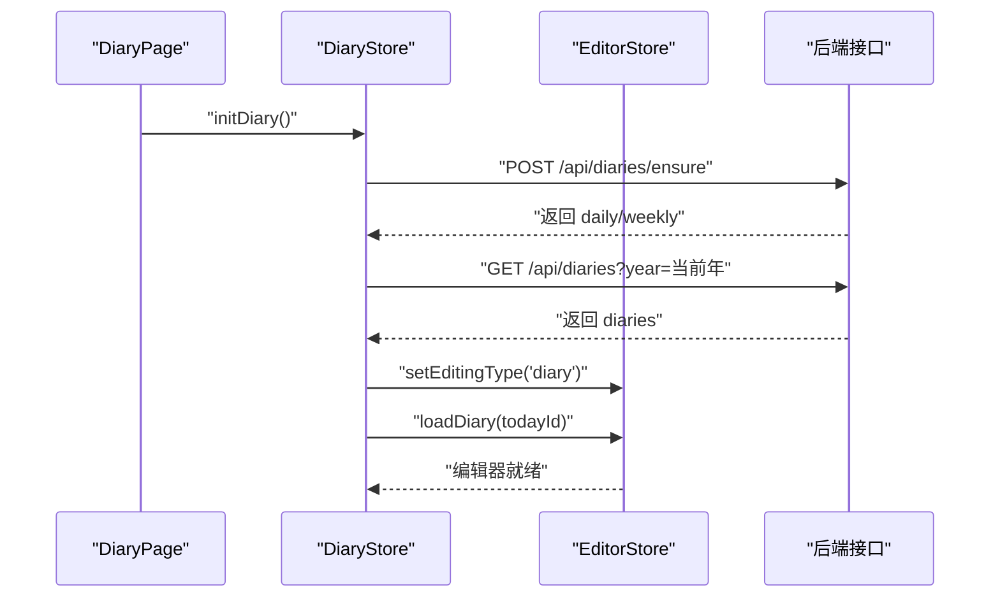
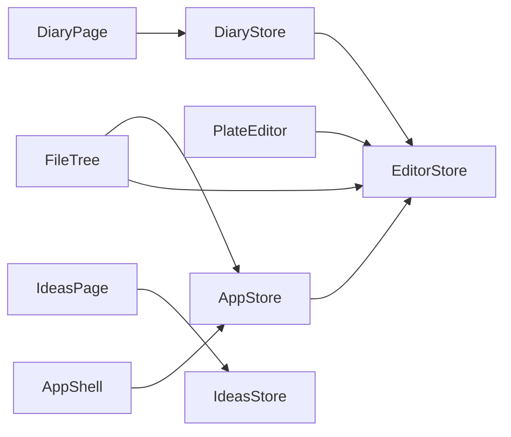

# 状态管理

<cite>
**本文引用的文件**
- [src/stores/app-store.ts](file://src/stores/app-store.ts)
- [src/stores/editor-store.ts](file://src/stores/editor-store.ts)
- [src/stores/diary-store.ts](file://src/stores/diary-store.ts)
- [src/stores/ideas-store.ts](file://src/stores/ideas-store.ts)
- [src/types/index.ts](file://src/types/index.ts)
- [src/lib/diary-utils.ts](file://src/lib/diary-utils.ts)
- [src/components/editor/plate-editor.tsx](file://src/components/editor/plate-editor.tsx)
- [src/components/file-tree/file-tree.tsx](file://src/components/file-tree/file-tree.tsx)
- [src/components/layout/app-shell.tsx](file://src/components/layout/app-shell.tsx)
- [src/components/diary/diary-page.tsx](file://src/components/diary/diary-page.tsx)
- [src/components/ideas/ideas-page.tsx](file://src/components/ideas/ideas-page.tsx)
- [package.json](file://package.json)
</cite>

## 目录
1. [简介](#简介)
2. [项目结构](#项目结构)
3. [核心组件](#核心组件)
4. [架构总览](#架构总览)
5. [详细组件分析](#详细组件分析)
6. [依赖关系分析](#依赖关系分析)
7. [性能考量](#性能考量)
8. [故障排查指南](#故障排查指南)
9. [结论](#结论)
10. [附录](#附录)

## 简介
本文件系统性地文档化基于 Zustand 的状态管理架构与实现，覆盖以下方面：
- Store 设计模式与状态组织结构
- 全局应用状态设计（分层与模块化）
- 编辑器状态管理（内容同步、撤销重做机制）
- 想法状态管理（列表与详情）
- 日记状态管理（时间轴与导航）
- 订阅与更新最佳实践
- 状态持久化与恢复机制
- 状态间依赖关系与同步策略
- 异步更新与错误处理
- 调试工具与开发辅助

## 项目结构
状态管理采用“按功能域划分”的模块化组织方式，每个领域一个 Store：
- 应用层：文件树、标签页切换、搜索等全局状态
- 编辑器层：当前编辑条目、内容缓存、保存状态、序列化回调
- 日记层：年份选择、日记条目、周分组、展开状态
- 想法层：想法列表、标签过滤、分页游标

图表来源
- [src/components/layout/app-shell.tsx:12-42](file://src/components/layout/app-shell.tsx#L12-L42)
- [src/stores/app-store.ts:49-317](file://src/stores/app-store.ts#L49-L317)
- [src/stores/editor-store.ts:88-280](file://src/stores/editor-store.ts#L88-L280)
- [src/stores/diary-store.ts:40-233](file://src/stores/diary-store.ts#L40-L233)
- [src/stores/ideas-store.ts:20-125](file://src/stores/ideas-store.ts#L20-L125)

章节来源
- [src/components/layout/app-shell.tsx:12-42](file://src/components/layout/app-shell.tsx#L12-L42)
- [src/stores/app-store.ts:49-317](file://src/stores/app-store.ts#L49-L317)
- [src/stores/editor-store.ts:88-280](file://src/stores/editor-store.ts#L88-L280)
- [src/stores/diary-store.ts:40-233](file://src/stores/diary-store.ts#L40-L233)
- [src/stores/ideas-store.ts:20-125](file://src/stores/ideas-store.ts#L20-L125)

## 核心组件
- AppStore：负责文件树、笔记元数据、搜索、标签页切换以及文件夹/笔记的增删改操作。支持乐观更新与失败回滚，提供批量展开/折叠。
- EditorStore：负责当前编辑条目、初始内容、当前编辑内容、保存状态、字数统计、内容缓存（LRU），以及笔记/日记内容加载与手动保存。
- DiaryStore：负责日记年份导航、日记条目拉取、确保今日日记存在、打开日记、周分组与展开状态、初始化流程。
- IdeasStore：负责想法列表（含分页游标）、标签列表、筛选、创建/更新/删除。

章节来源
- [src/stores/app-store.ts:49-317](file://src/stores/app-store.ts#L49-L317)
- [src/stores/editor-store.ts:88-280](file://src/stores/editor-store.ts#L88-L280)
- [src/stores/diary-store.ts:40-233](file://src/stores/diary-store.ts#L40-L233)
- [src/stores/ideas-store.ts:20-125](file://src/stores/ideas-store.ts#L20-L125)

## 架构总览
Zustand Store 通过函数式更新与不可变更新策略组合实现高效状态管理；组件通过选择器订阅所需字段，避免不必要渲染；跨 Store 协作通过 getState() 获取其他 Store 实例，实现松耦合同步。

图表来源
- [src/stores/app-store.ts:49-317](file://src/stores/app-store.ts#L49-L317)
- [src/stores/editor-store.ts:88-280](file://src/stores/editor-store.ts#L88-L280)
- [src/stores/diary-store.ts:40-233](file://src/stores/diary-store.ts#L40-L233)

## 详细组件分析

### 应用状态管理（AppStore）
- 职责边界
  - 文件树与笔记元数据：folders、notes
  - 选中项：selectedNoteId
  - 搜索：searchQuery、searchResults
  - 加载状态：treeLoading
  - 标签页：activeTab
- 关键能力
  - 文件夹：创建、重命名、删除、展开/折叠、全展开/全折叠、归档/解档（乐观更新 + 失败回滚）
  - 笔记：创建、重命名、删除（删除后清理编辑器缓存与当前编辑项）
  - 树刷新：统一从 /api/tree 拉取最新数据
- 错误处理
  - 所有网络请求均包裹 try/catch 并记录错误
  - 删除文件夹后强制刷新树以保证级联删除与重新分配正确性
- 性能优化
  - 展开/折叠使用批量 Promise.all 提升响应速度
  - 归档/解档乐观更新，失败时回滚到原状态

图表来源
- [src/stores/app-store.ts:120-131](file://src/stores/app-store.ts#L120-L131)

章节来源
- [src/stores/app-store.ts:49-317](file://src/stores/app-store.ts#L49-L317)

### 编辑器状态管理（EditorStore）
- 职责边界
  - 当前编辑条目：currentNoteId
  - 编辑类型：editingType（note/diary）
  - 内容：initialContent（来自缓存/接口）、currentContent（当前编辑）
  - 保存状态：saveStatus（saved/saving/unsaved/error）
  - 字数统计：wordCount
  - 内容缓存：contentCache（LRU，最大容量 20）
  - Markdown 序列化回调：markdownSerializer
- 关键能力
  - loadNote/loadDiary：优先命中缓存，否则从 /api/notes/:id 或 /api/diaries/:id 拉取
  - saveCurrentNote：序列化为 JSON 与 Markdown，计算字数，PATCH 更新
  - invalidateCache：按需失效缓存
  - 与 PlateEditor 协作：设置/清除 markdownSerializer，比较编辑值变化决定保存状态
- 撤销重做机制
  - PlateEditor 在笔记切换时清空历史（undos、redos）并取消选择，防止跨笔记状态污染
  - 保存后以当前编辑值作为基线，避免“已保存”状态误判

图表来源
- [src/stores/editor-store.ts:114-155](file://src/stores/editor-store.ts#L114-L155)
- [src/stores/editor-store.ts:204-275](file://src/stores/editor-store.ts#L204-L275)
- [src/components/editor/plate-editor.tsx:63-174](file://src/components/editor/plate-editor.tsx#L63-L174)

章节来源
- [src/stores/editor-store.ts:88-280](file://src/stores/editor-store.ts#L88-L280)
- [src/components/editor/plate-editor.tsx:63-174](file://src/components/editor/plate-editor.tsx#L63-L174)

### 日记状态管理（DiaryStore）
- 职责边界
  - 年份选择：selectedYear
  - 条目列表：diaryEntries
  - 选中日记：selectedDiaryId
  - 展开周：expandedWeeks
  - 初始化标志：initialized
  - 加载状态：loading
- 关键能力
  - 年份导航：prevYear/nextYear/setSelectedYear（自动触发拉取）
  - 拉取：fetchDiaries(year)
  - 确保：ensureToday（确保今日日记与本周日记存在）
  - 打开：openDiary(type, date)（更新本地列表、设置选中、切换编辑器类型并加载）
  - 周分组：getWeekGroups（按周聚合，区分当前周与历史周的展示逻辑）
  - 初始化：initDiary（确保今日日记、拉取当年条目、展开当前周、自动打开今日日记）

图表来源
- [src/stores/diary-store.ts:153-184](file://src/stores/diary-store.ts#L153-L184)
- [src/stores/diary-store.ts:102-142](file://src/stores/diary-store.ts#L102-L142)

章节来源
- [src/stores/diary-store.ts:40-233](file://src/stores/diary-store.ts#L40-L233)
- [src/lib/diary-utils.ts:67-91](file://src/lib/diary-utils.ts#L67-L91)
- [src/components/diary/diary-page.tsx:8-13](file://src/components/diary/diary-page.tsx#L8-L13)

### 想法状态管理（IdeasStore）
- 职责边界
  - 想法列表：ideas
  - 标签列表：tags
  - 选中标签：selectedTagId
  - 分页：hasMore、loading
- 关键能力
  - 列表：fetchIdeas(reset?)（支持游标分页与重置）
  - 标签：fetchTags
  - 创建/更新/删除：createIdea/updateIdea/deleteIdea（更新后刷新标签统计）
- 同步策略
  - 与 AppStore 的协作：在创建/更新/删除后主动刷新标签列表，保持计数一致

章节来源
- [src/stores/ideas-store.ts:20-125](file://src/stores/ideas-store.ts#L20-L125)

### 类型与数据模型
- 类型定义涵盖文件夹、笔记元数据、保存状态、标签、想法、日记条目等，用于约束 Store 与组件的数据结构。

章节来源
- [src/types/index.ts:1-74](file://src/types/index.ts#L1-L74)

## 依赖关系分析
- 组件对 Store 的依赖
  - AppShell 依赖 AppStore 进行标签页切换与树初始化
  - FileTree 依赖 AppStore（文件夹/笔记操作）与 EditorStore（加载/切换/保存）
  - PlateEditor 依赖 EditorStore（内容、保存状态、序列化回调）
  - DiaryPage 依赖 DiaryStore（初始化）
  - IdeasPage 依赖 IdeasStore（列表/标签）
- Store 间的协作
  - AppStore 在删除笔记后调用 EditorStore.invalidateCache 与 setCurrentNoteId，确保编辑器状态一致性
  - DiaryStore.openDiary 会设置 EditorStore.editingType 并加载对应日记内容
  - IdeasStore 在创建/更新/删除后主动刷新标签列表

图表来源
- [src/components/layout/app-shell.tsx:12-42](file://src/components/layout/app-shell.tsx#L12-L42)
- [src/components/file-tree/file-tree.tsx:22-34](file://src/components/file-tree/file-tree.tsx#L22-L34)
- [src/components/editor/plate-editor.tsx:63-72](file://src/components/editor/plate-editor.tsx#L63-L72)
- [src/components/diary/diary-page.tsx:8-13](file://src/components/diary/diary-page.tsx#L8-L13)
- [src/stores/app-store.ts:308-311](file://src/stores/app-store.ts#L308-L311)
- [src/stores/diary-store.ts:112-138](file://src/stores/diary-store.ts#L112-L138)
- [src/stores/ideas-store.ts:83-84](file://src/stores/ideas-store.ts#L83-L84)

## 性能考量
- 缓存策略
  - EditorStore 使用 LRU 缓存（最大容量 20），命中时直接设置 initialContent，避免重复网络请求
  - AppStore 在删除笔记后主动失效 EditorStore 缓存，防止脏数据
- 批量更新
  - 展开/折叠文件夹使用 Promise.all 并发更新，显著提升交互响应
- 比较算法
  - PlateEditor 使用结构化比较（不依赖 JSON.stringify）判断编辑值是否变化，减少不必要的保存状态切换
- 防抖搜索
  - FileTree 对搜索关键词变更使用防抖（默认 300ms），降低频繁请求压力

章节来源
- [src/stores/editor-store.ts:66-77](file://src/stores/editor-store.ts#L66-L77)
- [src/stores/editor-store.ts:114-155](file://src/stores/editor-store.ts#L114-L155)
- [src/components/editor/plate-editor.tsx:16-61](file://src/components/editor/plate-editor.tsx#L16-L61)
- [src/components/file-tree/file-tree.tsx:110-122](file://src/components/file-tree/file-tree.tsx#L110-L122)

## 故障排查指南
- 网络错误
  - 所有异步操作均包裹 try/catch 并打印错误日志，便于定位问题
  - 建议在组件层增加错误提示与重试按钮
- 状态不一致
  - 删除/归档文件夹失败时，AppStore 已实现回滚；若 UI 未更新，检查网络响应码与错误日志
  - 删除笔记后，确认 EditorStore.invalidateCache 与 setCurrentNoteId 是否被调用
- 编辑器历史污染
  - 切换笔记时应清空撤销/重做历史；如发现跨笔记历史，检查 PlateEditor 的历史清理逻辑
- 分页与游标
  - IdeasStore 使用 createdAt 作为游标，确保服务端按时间排序；若出现重复或遗漏，请检查服务端分页实现

章节来源
- [src/stores/app-store.ts:193-261](file://src/stores/app-store.ts#L193-L261)
- [src/stores/app-store.ts:298-316](file://src/stores/app-store.ts#L298-L316)
- [src/components/editor/plate-editor.tsx:110-120](file://src/components/editor/plate-editor.tsx#L110-L120)
- [src/stores/ideas-store.ts:35-58](file://src/stores/ideas-store.ts#L35-L58)

## 结论
该状态管理方案以 Zustand 为核心，结合模块化 Store 与组件选择器订阅，实现了清晰的职责分离与高效的更新路径。通过缓存、批量更新、结构化比较与乐观更新/回滚策略，系统在可用性与性能之间取得良好平衡。建议后续可引入持久化（如 IndexedDB 或本地存储）与调试工具（如 Zustand Devtools）进一步增强开发体验与稳定性。

## 附录

### 状态订阅与更新最佳实践
- 使用选择器订阅：仅订阅需要的字段，避免不必要的重渲染
- 合理拆分 Store：按功能域划分，降低耦合度
- 乐观更新 + 回滚：在网络请求失败时快速恢复 UI，提升交互流畅度
- 防抖与节流：对高频输入与滚动事件进行节流/防抖，减少请求次数

### 状态持久化与恢复机制
- 当前实现
  - EditorStore 使用内存缓存（Map）；AppStore 未实现持久化
- 建议方案
  - 引入本地存储（localStorage/sessionStorage 或 IndexedDB）保存关键状态（如当前编辑条目、最近访问列表）
  - 在应用启动时读取持久化数据并恢复 EditorStore 的 contentCache 与 currentNoteId
  - 注意：敏感信息不应持久化，需遵循最小化原则

### 异步状态更新与错误处理
- 统一捕获异常并记录日志
- 对于可回滚的操作（归档/删除），在失败时立即回滚到原状态
- 对于批量操作（展开/折叠），使用 Promise.all 并处理部分失败场景

### 调试工具与开发辅助
- 开发依赖
  - Zustand 版本：参见依赖声明
- 建议
  - 引入 Zustand Devtools（浏览器扩展或 React Devtools 插件）以观察状态变化与订阅情况
  - 在 Store 中添加 action 日志（仅限开发环境），便于追踪异步流程

章节来源
- [package.json:99-99](file://package.json#L99-L99)