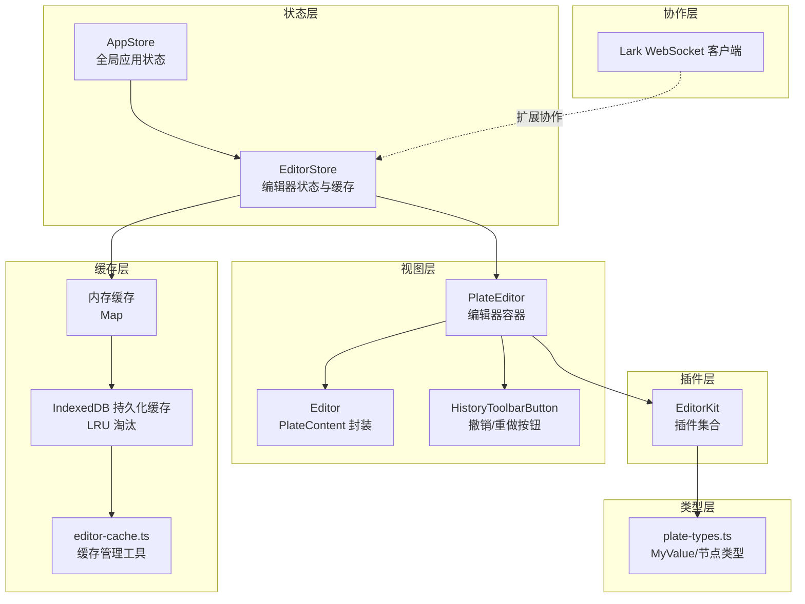
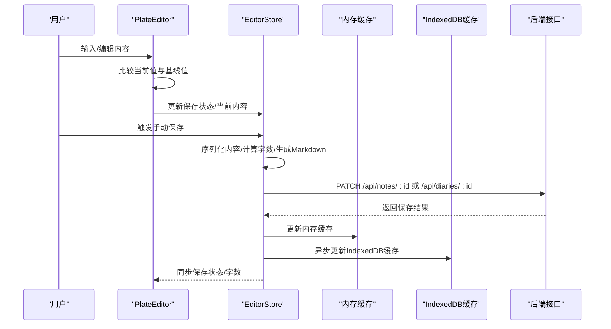
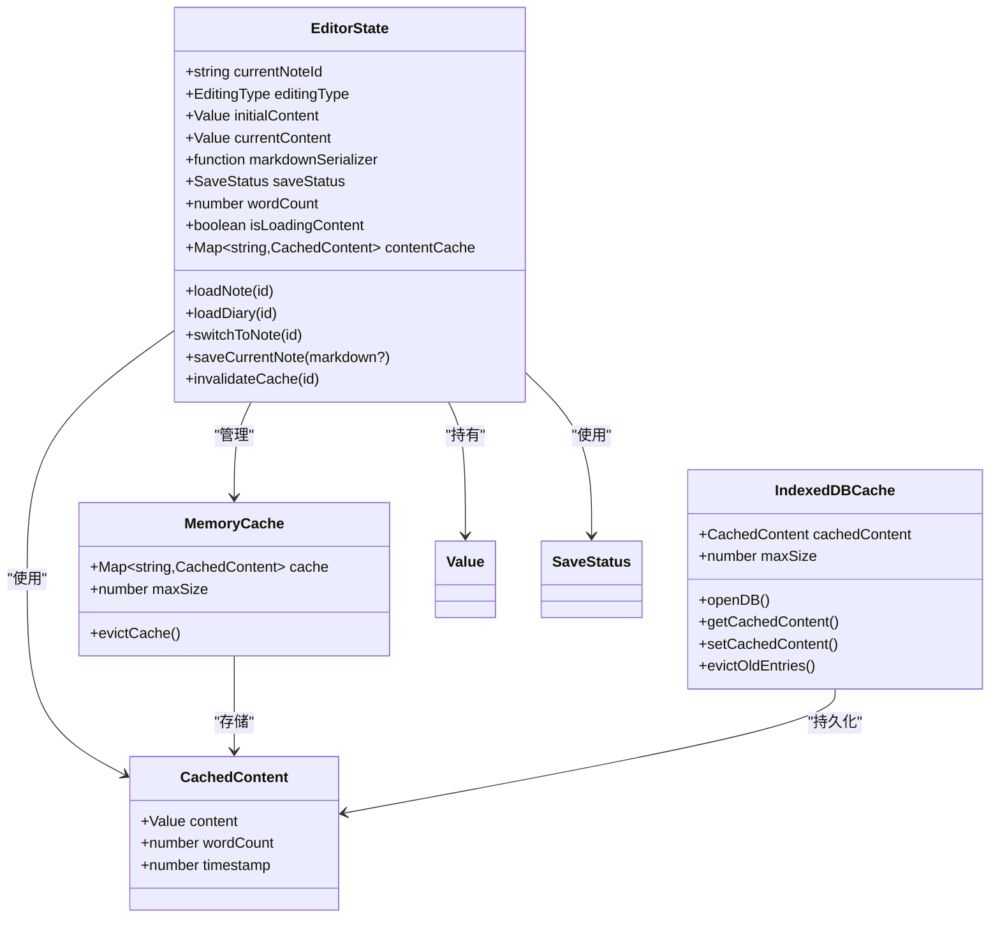
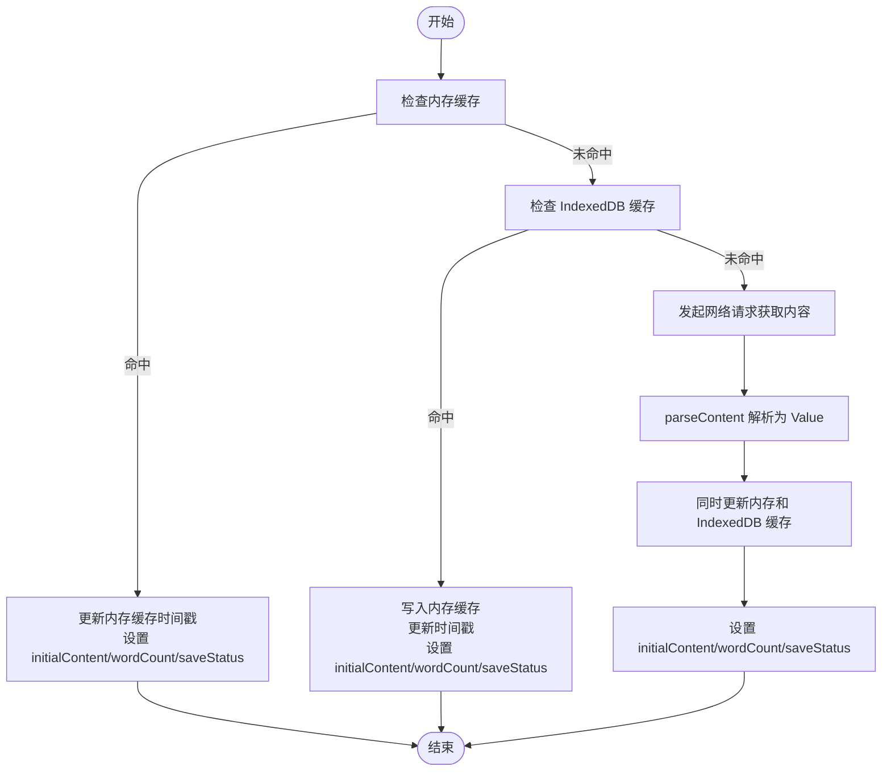
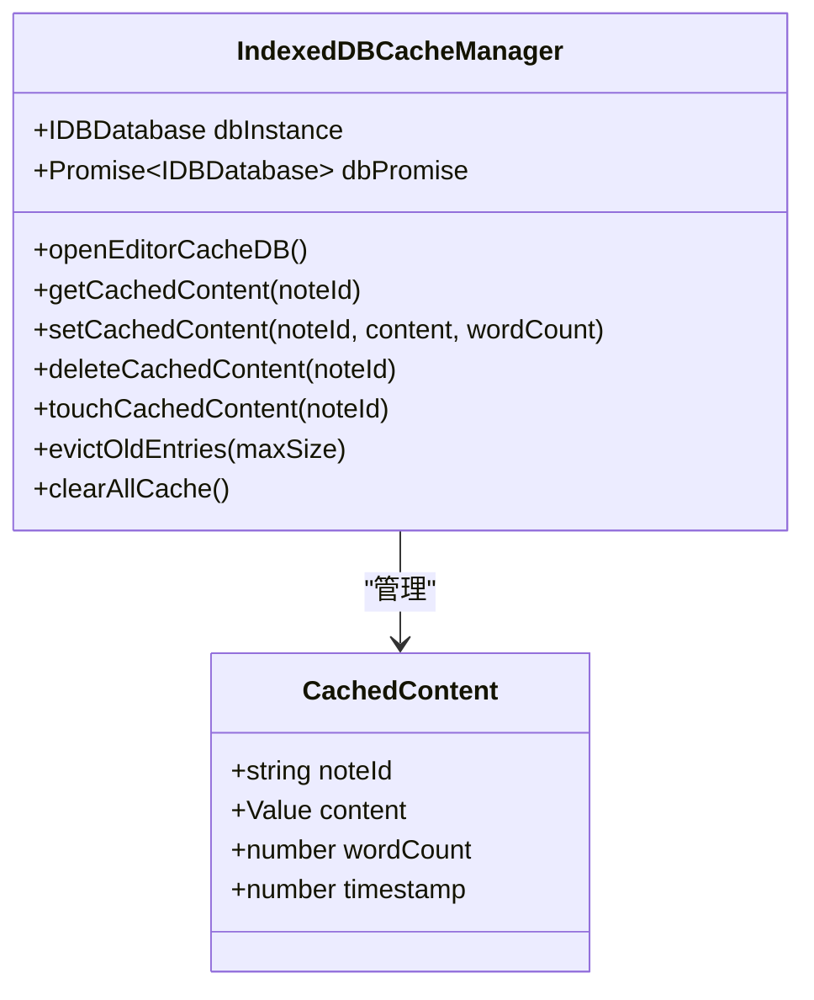
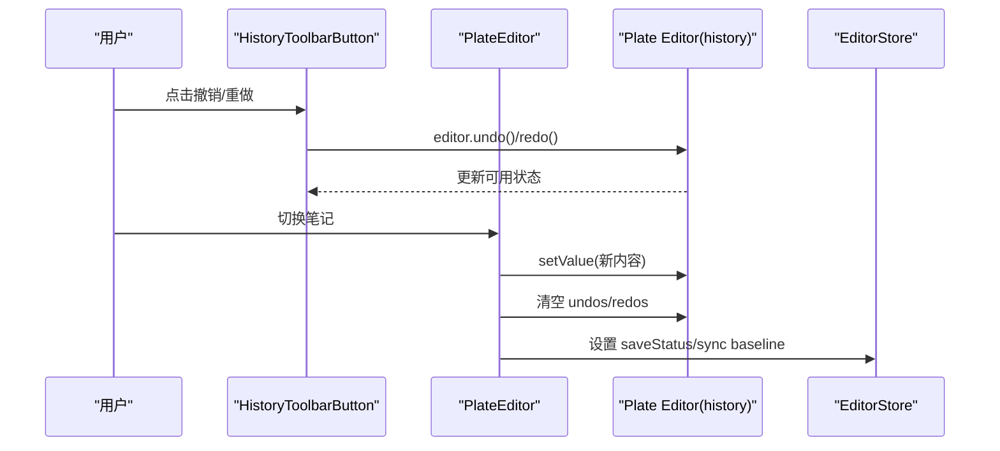
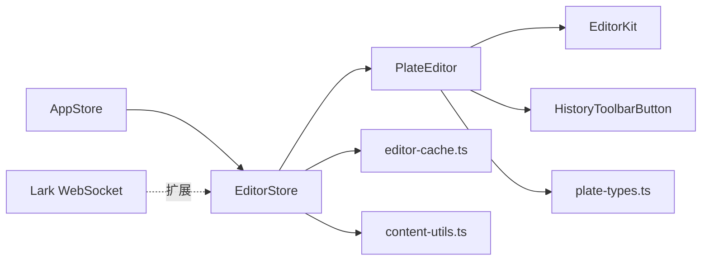

# 编辑器状态

<cite>
**本文引用的文件**
- [editor-store.ts](file://src/stores/editor-store.ts)
- [editor-cache.ts](file://src/lib/editor-cache.ts)
- [content-utils.ts](file://src/lib/content-utils.ts)
- [plate-editor.tsx](file://src/components/editor/plate-editor.tsx)
- [transforms.ts](file://src/components/editor/transforms.ts)
- [plate-types.ts](file://src/components/editor/plate-types.ts)
- [history-toolbar-button.tsx](file://src/components/ui/history-toolbar-button.tsx)
- [editor-kit.tsx](file://src/components/editor/editor-kit.tsx)
- [editor.tsx](file://src/components/ui/editor.tsx)
- [app-store.ts](file://src/stores/app-store.ts)
- [index.ts](file://src/types/index.ts)
- [lark-websocket.ts](file://scripts/lark-websocket.ts)
- [lark.ts](file://src/lib/lark.ts)
- [use-debounce.ts](file://src/hooks/use-debounce.ts)
</cite>

## 更新摘要
**变更内容**
- 集成新的双层缓存系统（内存缓存 + IndexedDB 持久化缓存）
- 增强内容解析和字数统计功能
- 改进缓存淘汰策略和性能优化
- 新增 IndexedDB 数据库管理和 LRU 淘汰机制

## 目录
1. [简介](#简介)
2. [项目结构](#项目结构)
3. [核心组件](#核心组件)
4. [架构总览](#架构总览)
5. [详细组件分析](#详细组件分析)
6. [依赖关系分析](#依赖关系分析)
7. [性能考量](#性能考量)
8. [故障排查指南](#故障排查指南)
9. [结论](#结论)
10. [附录](#附录)

## 简介
本文件系统性阐述编辑器状态管理的设计与实现，重点围绕 EditorStore 的职责边界与数据流，覆盖以下主题：
- 编辑器内容状态、光标与选区、保存状态与字数统计
- **双层缓存系统**（内存缓存 + IndexedDB 持久化缓存）与序列化/反序列化、版本时间戳
- 撤销/重做机制（基于 Plate 历史栈）与手动保存流程
- 实时协作与冲突处理现状与扩展建议
- 编辑器状态与全局应用状态的同步
- 性能优化策略（增量比较、去抖、缓存淘汰）
- 持久化与恢复（本地缓存 + 服务端同步）
- 调试与开发辅助能力

## 项目结构
编辑器状态相关的核心模块分布如下：
- 状态层：Zustand 编辑器状态存储（EditorStore）
- **缓存层**：双层缓存系统（内存缓存 + IndexedDB 持久化缓存）
- 视图层：Plate 编辑器容器与 UI 组件（PlateEditor、Editor、History 工具栏）
- 插件层：编辑器功能插件集合（EditorKit 及其子插件）
- 类型层：编辑器值类型定义（MyValue、节点类型）
- 应用层：与全局状态交互（AppStore 对 EditorStore 的清理与联动）
- 协作层：Lark WebSocket（事件通道，用于协作扩展）
- 工具层：去抖动 Hook、存储抽象

**图表来源**
- [editor-store.ts:88-280](file://src/stores/editor-store.ts#L88-L280)
- [editor-cache.ts:1-271](file://src/lib/editor-cache.ts#L1-L271)
- [plate-editor.tsx:63-174](file://src/components/editor/plate-editor.tsx#L63-L174)
- [editor-kit.tsx:36-78](file://src/components/editor/editor-kit.tsx#L36-L78)
- [plate-types.ts:148-164](file://src/components/editor/plate-types.ts#L148-L164)
- [history-toolbar-button.tsx:9-51](file://src/components/ui/history-toolbar-button.tsx#L9-L51)
- [app-store.ts:281-317](file://src/stores/app-store.ts#L281-L317)
- [lark-websocket.ts:1-109](file://scripts/lark-websocket.ts#L1-L109)

**章节来源**
- [editor-store.ts:88-280](file://src/stores/editor-store.ts#L88-L280)
- [editor-cache.ts:1-271](file://src/lib/editor-cache.ts#L1-L271)
- [plate-editor.tsx:63-174](file://src/components/editor/plate-editor.tsx#L63-L174)
- [editor-kit.tsx:36-78](file://src/components/editor/editor-kit.tsx#L36-L78)
- [plate-types.ts:148-164](file://src/components/editor/plate-types.ts#L148-L164)
- [history-toolbar-button.tsx:9-51](file://src/components/ui/history-toolbar-button.tsx#L9-L51)
- [app-store.ts:281-317](file://src/stores/app-store.ts#L281-L317)
- [lark-websocket.ts:1-109](file://scripts/lark-websocket.ts#L1-L109)

## 核心组件
- **EditorStore**：集中管理当前笔记 ID、编辑类型（笔记/日记）、初始内容、当前编辑内容、Markdown 序列化器回调、保存状态、字数统计、加载状态、**双层内容缓存**（内存缓存 + IndexedDB 持久化缓存），并提供加载、切换、手动保存、缓存失效等方法。
- **内存缓存**：基于 Map 的快速访问缓存，支持 LRU 淘汰策略
- **IndexedDB 缓存**：持久化缓存，支持跨页面刷新的数据保持
- **缓存管理工具**：提供完整的缓存 CRUD 操作、LRU 淘汰、数据库连接管理
- **内容解析器**：改进的 JSON 解析和验证机制，支持错误回退
- **字数统计工具**：递归提取文本内容，准确计算字数（去除空白字符）
- PlateEditor：基于 Plate 的编辑器容器，负责将 Store 中的内容注入编辑器、监听变更进行增量比较、设置保存状态、维护基线内容、初始化与切换时的历史清空与选区清理，并注册 Markdown 序列化器。
- EditorKit：编辑器插件集合，包含块级元素、内联样式、列表、表格、媒体、数学公式、日期、链接、提及、固定/浮动工具栏、自动格式化、光标覆盖等插件。
- HistoryToolbarButton：撤销/重做按钮，绑定 Plate 的 editor.history。
- AppStore：与编辑器状态联动，删除笔记时清理对应缓存并重置当前笔记 ID。

**章节来源**
- [editor-store.ts:15-64](file://src/stores/editor-store.ts#L15-L64)
- [editor-cache.ts:1-271](file://src/lib/editor-cache.ts#L1-L271)
- [content-utils.ts:1-37](file://src/lib/content-utils.ts#L1-L37)
- [plate-editor.tsx:63-174](file://src/components/editor/plate-editor.tsx#L63-L174)
- [editor-kit.tsx:36-78](file://src/components/editor/editor-kit.tsx#L36-L78)
- [history-toolbar-button.tsx:9-51](file://src/components/ui/history-toolbar-button.tsx#L9-L51)
- [app-store.ts:281-317](file://src/stores/app-store.ts#L281-L317)

## 架构总览
编辑器状态管理采用"状态驱动视图"的单向数据流，**新增双层缓存架构**：
- Store 提供状态与动作（加载、保存、缓存管理）
- **内存缓存优先命中，IndexedDB 作为持久化后备**
- PlateEditor 作为视图层订阅 Store 并通过 onChange 进行增量比较
- EditorKit 注入功能插件，HistoryToolbarButton 使用 Plate 的撤销/重做历史
- AppStore 在应用层面触发对 EditorStore 的清理与联动

**图表来源**
- [plate-editor.tsx:84-99](file://src/components/editor/plate-editor.tsx#L84-L99)
- [editor-store.ts:204-275](file://src/stores/editor-store.ts#L204-L275)
- [editor-cache.ts:110-147](file://src/lib/editor-cache.ts#L110-L147)

**章节来源**
- [plate-editor.tsx:84-99](file://src/components/editor/plate-editor.tsx#L84-L99)
- [editor-store.ts:204-275](file://src/stores/editor-store.ts#L204-L275)
- [editor-cache.ts:110-147](file://src/lib/editor-cache.ts#L110-L147)

## 详细组件分析

### EditorStore 设计与数据结构
- **关键状态字段**
  - currentNoteId：当前正在编辑的条目 ID（笔记/日记）
  - editingType：编辑类型（note/diary）
  - initialContent：从服务端加载的初始内容（JSON 值）
  - currentContent：当前编辑中的变更内容（手动保存前暂存）
  - markdownSerializer：由 PlateEditor 注入的 Markdown 序列化器
  - saveStatus：保存状态（saved/saving/unsaved/error）
  - wordCount：字数统计
  - isLoadingContent：内容加载中标志
  - **contentCache：Map 形式的内存缓存，条目含 content、wordCount、timestamp**
- **核心方法**
  - loadNote/loadDiary：**内存缓存 → IndexedDB 缓存 → API 请求** 的三级缓存策略
  - switchToNote：仅切换当前笔记 ID
  - saveCurrentNote：序列化为 JSON，**使用 calculateWordCount 函数计算字数**，按 editingType 选择接口路径，可选传入 markdown 或使用序列化器生成，成功后更新缓存与保存状态
  - invalidateCache：按 ID 清理内存和 IndexedDB 缓存
- **缓存策略**
  - **内存缓存**：MAX_CACHE_SIZE（默认20）限制，LRU 淘汰
  - **IndexedDB 缓存**：DEFAULT_MAX_SIZE（默认50）限制，基于时间戳的 LRU 淘汰

**图表来源**
- [editor-store.ts:15-64](file://src/stores/editor-store.ts#L15-L64)
- [editor-store.ts:9-13](file://src/stores/editor-store.ts#L9-L13)
- [editor-cache.ts:8-13](file://src/lib/editor-cache.ts#L8-L13)

**章节来源**
- [editor-store.ts:15-64](file://src/stores/editor-store.ts#L15-L64)
- [editor-store.ts:66-86](file://src/stores/editor-store.ts#L66-L86)
- [editor-store.ts:114-155](file://src/stores/editor-store.ts#L114-L155)
- [editor-store.ts:157-198](file://src/stores/editor-store.ts#L157-L198)
- [editor-store.ts:204-275](file://src/stores/editor-store.ts#L204-L275)
- [editor-store.ts:277-280](file://src/stores/editor-store.ts#L277-L280)

### 内容缓存机制（序列化、反序列化与版本管理）
- **反序列化**：parseContent 将服务端返回的字符串解析为 Value，**改进的错误处理**，失败时回退到默认段落结构
- **序列化**：手动保存时将 Value JSON.stringify 存储到服务端
- **版本管理**：缓存条目包含 timestamp，**两级 LRU 淘汰策略**
- **命中优先**：loadNote/loadDiary 首先检查 contentCache，未命中则检查 IndexedDB 缓存，最后发起网络请求
- **缓存写入**：成功加载后同时写入内存和 IndexedDB 缓存

**图表来源**
- [editor-store.ts:79-86](file://src/stores/editor-store.ts#L79-L86)
- [editor-store.ts:114-155](file://src/stores/editor-store.ts#L114-L155)
- [editor-store.ts:157-198](file://src/stores/editor-store.ts#L157-L198)
- [editor-store.ts:66-77](file://src/stores/editor-store.ts#L66-L77)

**章节来源**
- [editor-store.ts:79-86](file://src/stores/editor-store.ts#L79-L86)
- [editor-store.ts:114-155](file://src/stores/editor-store.ts#L114-L155)
- [editor-store.ts:157-198](file://src/stores/editor-store.ts#L157-L198)
- [editor-store.ts:66-77](file://src/stores/editor-store.ts#L66-L77)

### 缓存管理工具（IndexedDB 实现）
- **数据库管理**：openEditorCacheDB 提供数据库连接池管理，支持重复连接复用
- **CRUD 操作**：getCachedContent、setCachedContent、deleteCachedContent 提供完整的缓存操作
- **LRU 淘汰**：evictOldEntries 基于时间戳索引的 LRU 淘汰算法
- **容量控制**：DEFAULT_MAX_SIZE（默认50）限制，超出时自动淘汰最旧条目
- **异步操作**：所有缓存操作都是异步的，不影响主流程性能

**图表来源**
- [editor-cache.ts:28-73](file://src/lib/editor-cache.ts#L28-L73)
- [editor-cache.ts:110-147](file://src/lib/editor-cache.ts#L110-L147)
- [editor-cache.ts:202-245](file://src/lib/editor-cache.ts#L202-L245)

**章节来源**
- [editor-cache.ts:28-73](file://src/lib/editor-cache.ts#L28-L73)
- [editor-cache.ts:110-147](file://src/lib/editor-cache.ts#L110-L147)
- [editor-cache.ts:202-245](file://src/lib/editor-cache.ts#L202-L245)

### 内容解析与字数统计增强
- **内容解析器**：parseContent 函数提供更强的错误处理，支持 JSON 格式验证和回退机制
- **字数统计工具**：calculateWordCount 使用 extractText 递归提取所有文本内容，准确计算字数（去除空白字符）
- **性能优化**：避免重复的 JSON 解析，提高字数统计效率
- **兼容性**：支持多种内容格式，确保编辑器稳定运行

**章节来源**
- [editor-store.ts:86-101](file://src/stores/editor-store.ts#L86-L101)
- [content-utils.ts:33-36](file://src/lib/content-utils.ts#L33-L36)

### 撤销重做机制（操作历史与状态快照）
- 基于 Plate 的 editor.history：撤销/重做历史由编辑器内部维护
- UI 层：HistoryToolbarButton 读取 editor.history 的 undos/redos 数量决定按钮可用性，并调用 editor.undo()/redo()
- 切换笔记时：在 PlateEditor 中重置编辑器值并清空 editor.history 的 undos/redos，避免跨笔记历史污染
- 快照策略：EditorStore 不单独维护操作历史栈，而是依赖 Plate 的历史栈；手动保存成功后以当前内容作为新的基线

**图表来源**
- [history-toolbar-button.tsx:9-51](file://src/components/ui/history-toolbar-button.tsx#L9-L51)
- [plate-editor.tsx:101-136](file://src/components/editor/plate-editor.tsx#L101-L136)

**章节来源**
- [history-toolbar-button.tsx:9-51](file://src/components/ui/history-toolbar-button.tsx#L9-L51)
- [plate-editor.tsx:101-136](file://src/components/editor/plate-editor.tsx#L101-L136)

### 实时协作状态管理（多人编辑冲突与合并策略）
- 当前实现：EditorStore 与 PlateEditor 未内置 CRDT 或 Operational Transform（OT）逻辑，协作能力依赖外部事件通道
- 协作入口：Lark WebSocket 客户端脚本与 SDK 客户端封装，可用于接收事件并驱动应用状态更新
- 冲突解决建议（扩展方向）：
  - 引入协作插件或自定义插件，监听远端变更并应用到本地编辑器
  - 使用 OT/CRDT 算法对变更进行转换与合并
  - 以"光标覆盖层"显示他人位置，避免视觉冲突
  - 服务端统一协调版本号/时间戳，客户端基于版本号进行合并
- 注意：以上为扩展建议，当前仓库未实现具体协作合并逻辑

**章节来源**
- [lark-websocket.ts:1-109](file://scripts/lark-websocket.ts#L1-L109)
- [lark.ts:69-95](file://src/lib/lark.ts#L69-L95)

### 编辑器状态与全局状态的同步
- 删除笔记时，AppStore 调用 EditorStore.invalidateCache(id)，确保缓存一致性
- 若当前编辑的笔记被删除，AppStore 将 EditorStore.setCurrentNoteId(null)，防止后续操作误用已删除 ID
- 该联动保证了"应用层（文件树/笔记列表）—编辑器层（缓存/当前笔记）"的状态一致

**章节来源**
- [app-store.ts:281-317](file://src/stores/app-store.ts#L281-L317)
- [editor-store.ts:277-280](file://src/stores/editor-store.ts#L277-L280)

### 编辑器性能优化策略
- **增量更新与比较**
  - PlateEditor 使用自定义结构化比较函数（不依赖 JSON.stringify），快速判断是否发生变更，仅在变更时标记为 unsaved 并更新 currentContent
  - 切换笔记后清空 editor.history，避免跨笔记历史导致的额外开销
- **两级缓存优化**
  - **内存缓存**：MAX_CACHE_SIZE（默认20）限制，提供毫秒级访问速度
  - **IndexedDB 缓存**：DEFAULT_MAX_SIZE（默认50）限制，支持跨页面刷新的数据保持
  - **缓存预热**：从 IndexedDB 加载的内容会同时写入内存缓存，提升后续访问速度
- **缓存与去抖**
  - LRU 淘汰策略，优先删除最旧条目
  - useDebounce Hook 可用于节流高频操作（如搜索、自动补全等，当前编辑器主流程未直接使用）
- **其他优化点**
  - 初始化阶段使用 requestAnimationFrame 标记就绪，避免首帧抖动
  - 滚动至顶部，避免切换笔记后滚动位置异常

**章节来源**
- [plate-editor.tsx:16-61](file://src/components/editor/plate-editor.tsx#L16-L61)
- [plate-editor.tsx:101-136](file://src/components/editor/plate-editor.tsx#L101-L136)
- [use-debounce.ts:1-19](file://src/hooks/use-debounce.ts#L1-L19)

### 编辑器状态的持久化与恢复
- **服务端持久化**：saveCurrentNote 将内容与字数提交到后端，成功后更新缓存与保存状态
- **客户端恢复**：loadNote/loadDiary 采用三级缓存策略（内存缓存 → IndexedDB 缓存 → API 请求）
- **恢复策略**：切换笔记时清空历史并重置选区，避免旧内容影响新内容的编辑体验
- **缓存同步**：手动保存成功后，同时更新内存和 IndexedDB 缓存，确保数据一致性

**章节来源**
- [editor-store.ts:204-275](file://src/stores/editor-store.ts#L204-L275)
- [editor-store.ts:114-155](file://src/stores/editor-store.ts#L114-L155)
- [editor-store.ts:157-198](file://src/stores/editor-store.ts#L157-L198)
- [plate-editor.tsx:101-136](file://src/components/editor/plate-editor.tsx#L101-L136)

### 调试工具与开发辅助
- 开发模式下的日志与错误输出：保存失败时设置 saveStatus 为 error，并打印错误信息
- **增强的缓存调试**：IndexedDB 缓存操作包含详细的错误日志和警告信息
- Markdown 序列化器：由 PlateEditor 注入，便于在保存时生成 Markdown 文本
- 光标覆盖层：CursorOverlayKit 提供协作场景下的他人光标可视化
- 去抖动 Hook：useDebounce 可用于控制高频更新频率（可按需引入到其他组件）

**章节来源**
- [editor-store.ts:271-274](file://src/stores/editor-store.ts#L271-L274)
- [plate-editor.tsx:146-153](file://src/components/editor/plate-editor.tsx#L146-L153)
- [editor-kit.tsx:15-15](file://src/components/editor/editor-kit.tsx#L15-L15)
- [use-debounce.ts:1-19](file://src/hooks/use-debounce.ts#L1-L19)

## 依赖关系分析
- 组件耦合
  - PlateEditor 依赖 EditorStore（状态订阅）与 EditorKit（插件）
  - HistoryToolbarButton 依赖 Plate 的 editor.history
  - AppStore 依赖 EditorStore（缓存清理与当前笔记 ID 管理）
  - **EditorStore 依赖 editor-cache.ts 进行 IndexedDB 缓存管理**
  - **EditorStore 依赖 content-utils.ts 进行字数统计**
- 外部依赖
  - PlateJS：编辑器内核、历史栈、序列化器
  - Zustand：状态管理
  - **IndexedDB：浏览器原生数据库，用于持久化缓存**
  - Lark SDK：WebSocket 事件通道（协作扩展）

**图表来源**
- [editor-store.ts:88-280](file://src/stores/editor-store.ts#L88-L280)
- [editor-cache.ts:1-271](file://src/lib/editor-cache.ts#L1-L271)
- [content-utils.ts:1-37](file://src/lib/content-utils.ts#L1-L37)
- [plate-editor.tsx:63-174](file://src/components/editor/plate-editor.tsx#L63-L174)
- [editor-kit.tsx:36-78](file://src/components/editor/editor-kit.tsx#L36-L78)
- [plate-types.ts:148-164](file://src/components/editor/plate-types.ts#L148-L164)
- [history-toolbar-button.tsx:9-51](file://src/components/ui/history-toolbar-button.tsx#L9-L51)
- [app-store.ts:281-317](file://src/stores/app-store.ts#L281-L317)
- [lark-websocket.ts:1-109](file://scripts/lark-websocket.ts#L1-L109)

**章节来源**
- [editor-store.ts:88-280](file://src/stores/editor-store.ts#L88-L280)
- [editor-cache.ts:1-271](file://src/lib/editor-cache.ts#L1-L271)
- [content-utils.ts:1-37](file://src/lib/content-utils.ts#L1-L37)
- [plate-editor.tsx:63-174](file://src/components/editor/plate-editor.tsx#L63-L174)
- [editor-kit.tsx:36-78](file://src/components/editor/editor-kit.tsx#L36-L78)
- [plate-types.ts:148-164](file://src/components/editor/plate-types.ts#L148-L164)
- [history-toolbar-button.tsx:9-51](file://src/components/ui/history-toolbar-button.tsx#L9-L51)
- [app-store.ts:281-317](file://src/stores/app-store.ts#L281-L317)
- [lark-websocket.ts:1-109](file://scripts/lark-websocket.ts#L1-L109)

## 性能考量
- **结构化比较**：避免频繁 JSON.stringify，降低比较成本
- **历史栈清空**：切换笔记时清空 editor.history，减少跨笔记历史带来的内存与渲染压力
- **两级缓存策略**：内存缓存提供毫秒级访问速度，IndexedDB 缓存支持持久化存储
- **LRU 淘汰算法**：智能淘汰策略，优先删除最旧条目，保持最佳性能
- **异步缓存更新**：缓存写入采用异步方式，不影响主流程性能
- **初始化优化**：requestAnimationFrame 标记初始化完成，避免首帧抖动
- **去抖策略**：可结合 useDebounce 控制高频更新（如搜索、自动补全等）

## 故障排查指南
- **保存失败**
  - 现象：saveStatus 变为 error
  - 排查：检查网络请求返回码、序列化器是否抛错、Markdown 生成是否异常
  - 处理：重试保存、确认服务端接口路径正确
- **缓存异常**
  - 现象：切换笔记后仍显示旧内容或历史未清空
  - 排查：确认 PlateEditor 在切换时清空 editor.history 并重置选区
  - 处理：重新加载笔记或手动触发缓存失效
- **IndexedDB 缓存问题**
  - 现象：IndexedDB 操作失败或缓存不生效
  - 排查：检查浏览器 IndexedDB 支持、数据库连接状态、LRU 淘汰逻辑
  - 处理：清除缓存、检查数据库权限、查看控制台错误日志
- **协作冲突**
  - 现象：多人编辑时出现光标/内容不一致
  - 排查：确认协作事件通道是否启用、是否实现 OT/CRDT 合并
  - 处理：接入协作插件或自定义合并策略

**章节来源**
- [editor-store.ts:271-274](file://src/stores/editor-store.ts#L271-L274)
- [plate-editor.tsx:101-136](file://src/components/editor/plate-editor.tsx#L101-L136)
- [editor-cache.ts:18-23](file://src/lib/editor-cache.ts#L18-L23)
- [lark-websocket.ts:1-109](file://scripts/lark-websocket.ts#L1-L109)

## 结论
本项目采用 Zustand 驱动的编辑器状态管理，**集成了双层缓存架构**（内存缓存 + IndexedDB 持久化缓存），结合 Plate 的撤销/重做能力和 LRU 淘汰策略，实现了高效、可维护且持久化的编辑体验。新的缓存系统显著提升了性能和用户体验，支持跨页面刷新的数据保持。当前未内置协作合并逻辑，但通过 Lark WebSocket 与插件体系具备良好的扩展空间。建议在协作场景下引入 OT/CRDT 与光标覆盖层，进一步提升多人协作的稳定性与一致性。

## 附录
- 类型定义参考：MyValue 与各节点类型定义，确保编辑器值结构的一致性与可推断性
- 保存状态枚举：保存状态类型定义，便于 UI 与逻辑层统一处理
- **缓存配置**：MAX_CACHE_SIZE（内存缓存，默认20）、DEFAULT_MAX_SIZE（IndexedDB缓存，默认50）

**章节来源**
- [plate-types.ts:148-164](file://src/components/editor/plate-types.ts#L148-L164)
- [index.ts:33](file://src/types/index.ts#L33)
- [editor-store.ts:14](file://src/stores/editor-store.ts#L14)
- [editor-cache.ts:6](file://src/lib/editor-cache.ts#L6)