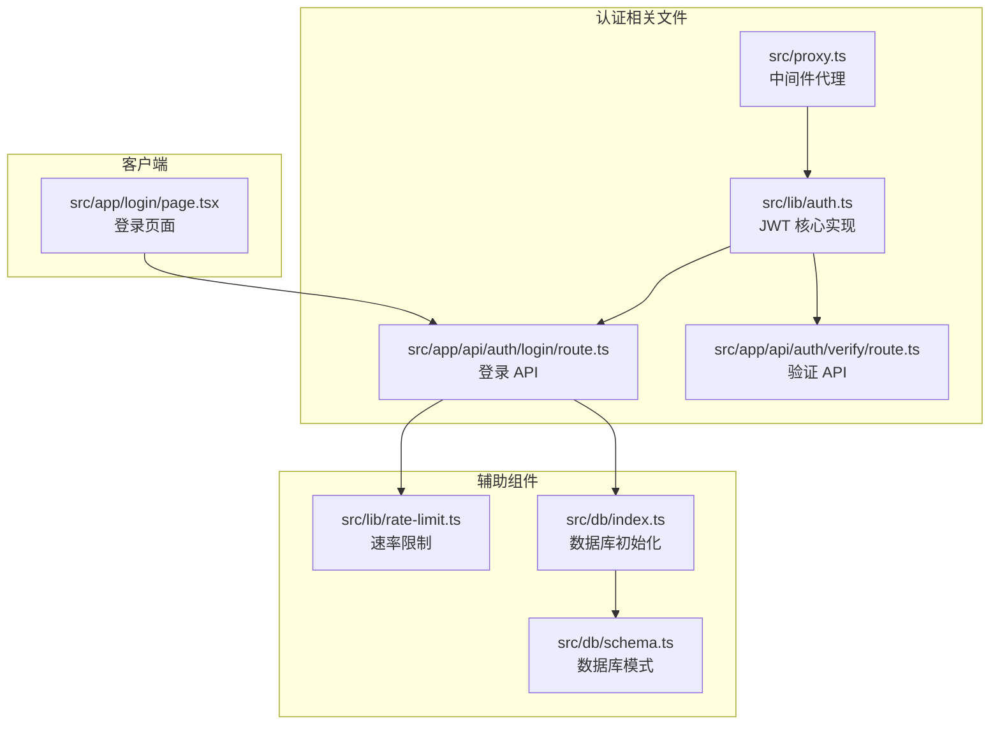
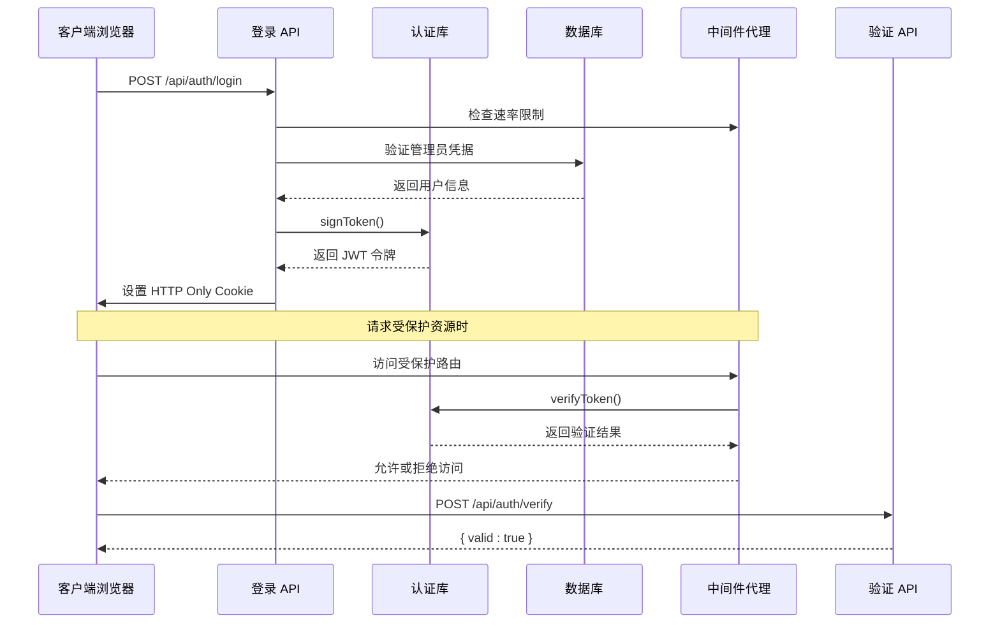
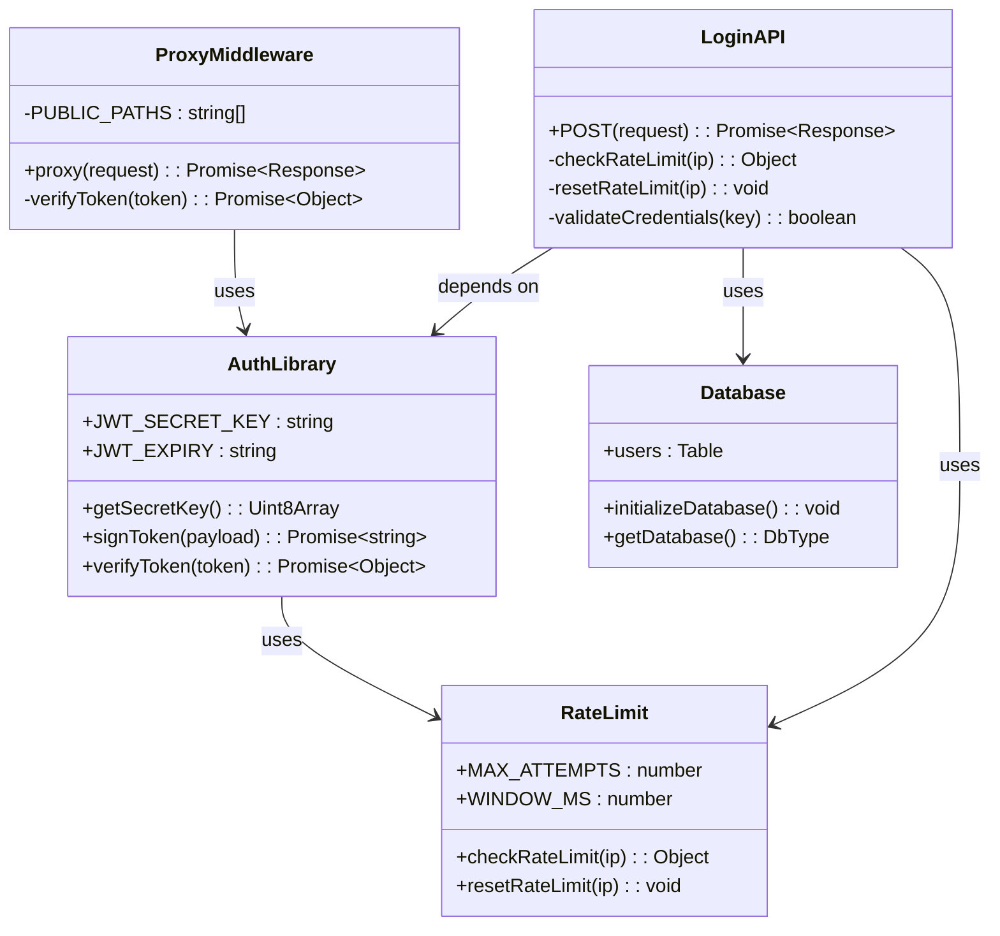
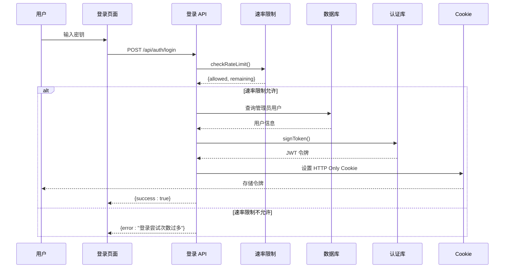
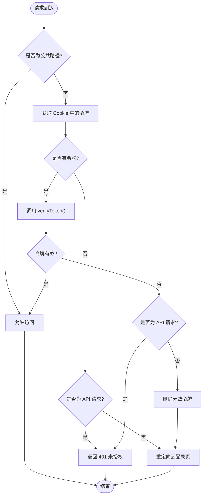
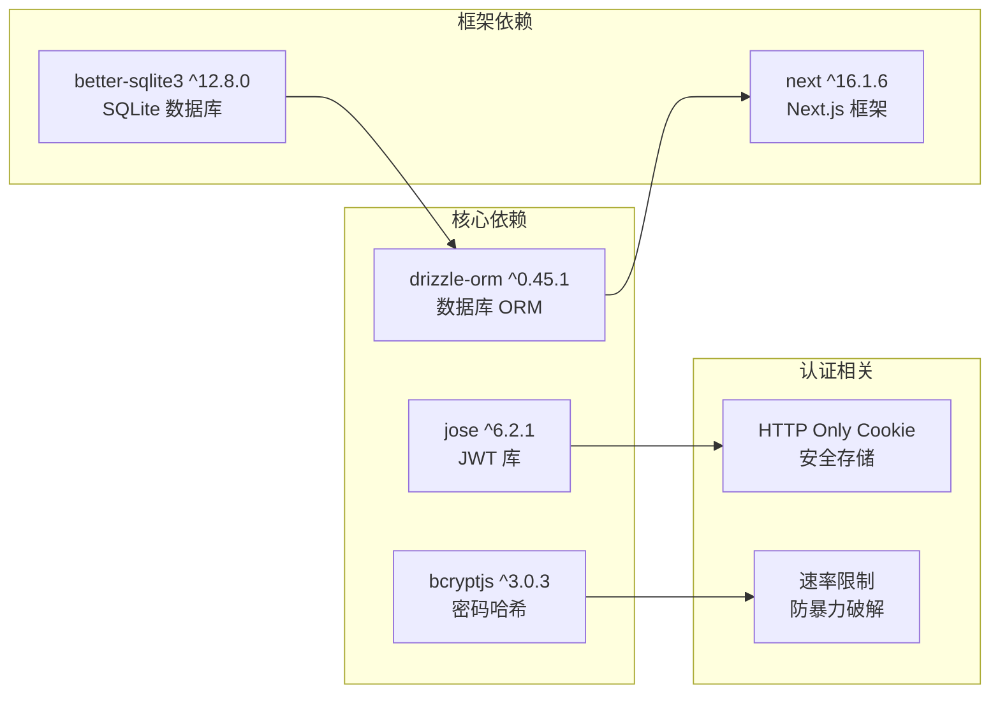
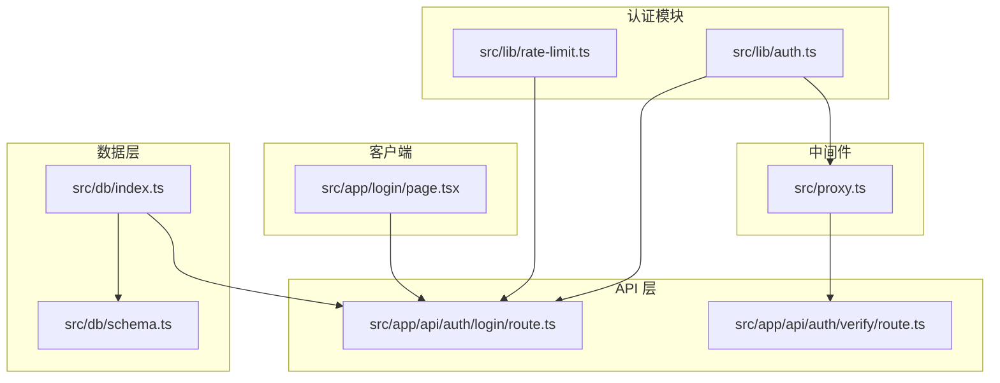
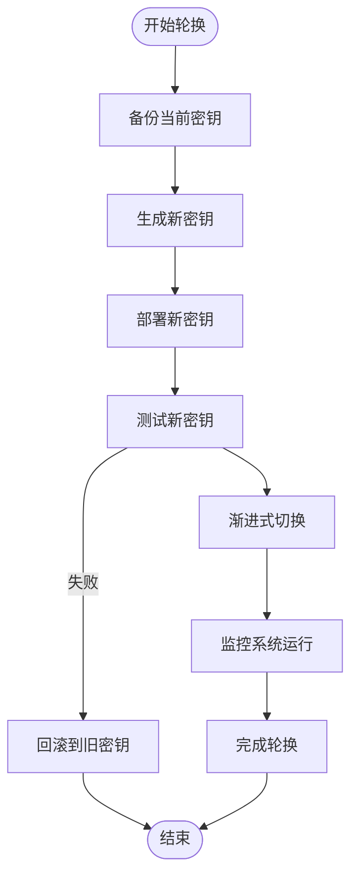
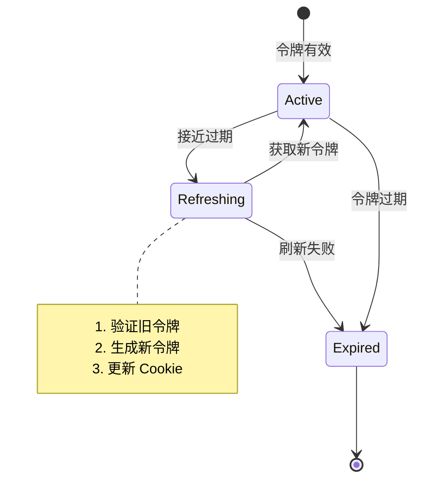

# JWT 令牌管理

<cite>
**本文档引用的文件**
- [src/lib/auth.ts](file://src/lib/auth.ts)
- [src/app/api/auth/login/route.ts](file://src/app/api/auth/login/route.ts)
- [src/app/api/auth/verify/route.ts](file://src/app/api/auth/verify/route.ts)
- [src/proxy.ts](file://src/proxy.ts)
- [src/lib/rate-limit.ts](file://src/lib/rate-limit.ts)
- [src/db/index.ts](file://src/db/index.ts)
- [src/db/schema.ts](file://src/db/schema.ts)
- [src/app/login/page.tsx](file://src/app/login/page.tsx)
- [package.json](file://package.json)
</cite>

## 目录
1. [简介](#简介)
2. [项目结构](#项目结构)
3. [核心组件](#核心组件)
4. [架构概览](#架构概览)
5. [详细组件分析](#详细组件分析)
6. [依赖关系分析](#依赖关系分析)
7. [性能考虑](#性能考虑)
8. [故障排除指南](#故障排除指南)
9. [安全最佳实践](#安全最佳实践)
10. [结论](#结论)

## 简介

本项目实现了基于 jose 库的 JWT 令牌管理系统，采用 HS256 对称加密算法进行令牌签名和验证。系统通过 HTTP Only Cookie 存储令牌，提供完整的认证流程，包括用户身份验证、令牌签发、令牌验证和会话管理。

该实现具有以下特点：
- 基于 jose 库的现代 JWT 实现
- HS256 对称加密算法
- 环境变量驱动的配置
- 速率限制保护
- 完整的错误处理机制

## 项目结构

JWT 令牌管理相关的文件组织如下：

**图表来源**
- [src/lib/auth.ts:1-26](file://src/lib/auth.ts#L1-L26)
- [src/app/api/auth/login/route.ts:1-63](file://src/app/api/auth/login/route.ts#L1-L63)
- [src/proxy.ts:1-49](file://src/proxy.ts#L1-L49)

**章节来源**
- [src/lib/auth.ts:1-26](file://src/lib/auth.ts#L1-L26)
- [src/app/api/auth/login/route.ts:1-63](file://src/app/api/auth/login/route.ts#L1-L63)
- [src/proxy.ts:1-49](file://src/proxy.ts#L1-L49)

## 核心组件

### JWT 核心实现

JWT 核心功能由 `src/lib/auth.ts` 提供，包含以下关键组件：

#### 密钥管理和配置
- **JWT_SECRET_KEY**: 从环境变量读取或使用默认值
- **JWT_EXPIRY**: 令牌过期时间配置，默认 7 天
- **getSecretKey()**: 将字符串密钥转换为 TextEncoder 编码

#### 令牌签名函数
- **signToken()**: 生成新的 JWT 令牌
- 使用 HS256 算法签名
- 固定载荷：`sub: "admin"`
- 设置签发时间戳和过期时间

#### 令牌验证函数
- **verifyToken()**: 验证令牌有效性
- 返回 `{ valid: boolean, payload?: Record }` 结构
- 捕获所有验证异常并返回无效状态

**章节来源**
- [src/lib/auth.ts:1-26](file://src/lib/auth.ts#L1-L26)

### 登录 API 实现

登录流程由 `src/app/api/auth/login/route.ts` 处理：

#### 认证流程
1. **IP 地址获取**: 从请求头提取真实 IP
2. **速率限制检查**: 调用 `checkRateLimit()`
3. **请求体验证**: 检查密钥参数
4. **数据库查询**: 查找管理员用户
5. **密码验证**: 使用 bcryptjs 进行哈希比较
6. **令牌签发**: 成功后生成 JWT 令牌
7. **Cookie 设置**: 通过 HTTP Only Cookie 存储令牌

#### Cookie 配置
- `httpOnly: true`: 防止 XSS 攻击
- `secure: process.env.NODE_ENV === "production"`: 生产环境启用 HTTPS
- `sameSite: "strict"`: 防止 CSRF 攻击
- `maxAge: 7 * 24 * 60 * 60`: 7 天有效期
- `path: "/"`: 全站可用

**章节来源**
- [src/app/api/auth/login/route.ts:1-63](file://src/app/api/auth/login/route.ts#L1-L63)

### 中间件代理

`src/proxy.ts` 实现了全局认证中间件：

#### 访问控制逻辑
1. **公共路径放行**: `/login` 和 `/api/auth/login`
2. **静态资源放行**: Next.js 内部资源
3. **Cookie 令牌获取**: 从请求中提取令牌
4. **令牌验证**: 调用 `verifyToken()`
5. **未授权处理**: 删除无效令牌并重定向到登录页

#### 匹配器配置
- 仅对 `/app/:path*` 和 `/api/:path*` 路径生效
- 自动拦截所有受保护的路由

**章节来源**
- [src/proxy.ts:1-49](file://src/proxy.ts#L1-L49)

## 架构概览

JWT 令牌管理系统的整体架构如下：

**图表来源**
- [src/app/api/auth/login/route.ts:1-63](file://src/app/api/auth/login/route.ts#L1-L63)
- [src/lib/auth.ts:1-26](file://src/lib/auth.ts#L1-L26)
- [src/proxy.ts:1-49](file://src/proxy.ts#L1-L49)
- [src/app/api/auth/verify/route.ts:1-7](file://src/app/api/auth/verify/route.ts#L1-L7)

## 详细组件分析

### JWT 核心类图

**图表来源**
- [src/lib/auth.ts:1-26](file://src/lib/auth.ts#L1-L26)
- [src/app/api/auth/login/route.ts:1-63](file://src/app/api/auth/login/route.ts#L1-L63)
- [src/proxy.ts:1-49](file://src/proxy.ts#L1-L49)
- [src/lib/rate-limit.ts:1-41](file://src/lib/rate-limit.ts#L1-L41)
- [src/db/index.ts:1-171](file://src/db/index.ts#L1-L171)

### 登录流程时序图

**图表来源**
- [src/app/login/page.tsx:1-99](file://src/app/login/page.tsx#L1-L99)
- [src/app/api/auth/login/route.ts:1-63](file://src/app/api/auth/login/route.ts#L1-L63)
- [src/lib/rate-limit.ts:1-41](file://src/lib/rate-limit.ts#L1-L41)
- [src/db/index.ts:142-157](file://src/db/index.ts#L142-L157)
- [src/lib/auth.ts:10-16](file://src/lib/auth.ts#L10-L16)

### 令牌验证流程

**图表来源**
- [src/proxy.ts:1-49](file://src/proxy.ts#L1-L49)
- [src/lib/auth.ts:18-25](file://src/lib/auth.ts#L18-L25)

**章节来源**
- [src/lib/auth.ts:1-26](file://src/lib/auth.ts#L1-L26)
- [src/app/api/auth/login/route.ts:1-63](file://src/app/api/auth/login/route.ts#L1-L63)
- [src/proxy.ts:1-49](file://src/proxy.ts#L1-L49)

## 依赖关系分析

### 外部依赖

项目使用以下与 JWT 相关的关键依赖：

**图表来源**
- [package.json:67](file://package.json#L67)
- [package.json:57](file://package.json#L57)
- [package.json:65](file://package.json#L65)
- [package.json:72](file://package.json#L72)
- [package.json:58](file://package.json#L58)

### 内部模块依赖

**图表来源**
- [src/lib/auth.ts:1-26](file://src/lib/auth.ts#L1-L26)
- [src/app/api/auth/login/route.ts:1-63](file://src/app/api/auth/login/route.ts#L1-L63)
- [src/proxy.ts:1-49](file://src/proxy.ts#L1-L49)
- [src/db/index.ts:1-171](file://src/db/index.ts#L1-L171)
- [src/app/login/page.tsx:1-99](file://src/app/login/page.tsx#L1-L99)

**章节来源**
- [package.json:1-119](file://package.json#L1-L119)
- [src/lib/auth.ts:1-26](file://src/lib/auth.ts#L1-L26)
- [src/app/api/auth/login/route.ts:1-63](file://src/app/api/auth/login/route.ts#L1-L63)
- [src/proxy.ts:1-49](file://src/proxy.ts#L1-L49)

## 性能考虑

### JWT 性能特性

1. **无状态验证**: JWT 令牌包含完整用户信息，服务器无需查询数据库
2. **内存效率**: 令牌大小小，传输开销低
3. **并发处理**: 令牌验证为纯内存操作，响应速度快

### 优化建议

1. **令牌缓存**: 可考虑实现令牌黑名单缓存
2. **批量验证**: 对于高并发场景，可实现令牌预验证机制
3. **压缩策略**: 对大型载荷可考虑压缩（需谨慎）

## 故障排除指南

### 常见问题及解决方案

#### 令牌验证失败
**症状**: API 返回 401 未授权
**原因**: 
- 令牌已过期
- 密钥不匹配
- 令牌被篡改

**解决方法**:
1. 检查 `JWT_SECRET_KEY` 环境变量
2. 验证令牌过期时间设置
3. 确认客户端和服务端使用相同密钥

#### 登录失败
**症状**: 登录接口返回错误
**可能原因**:
- 密钥错误
- 速率限制触发
- 数据库连接问题

**排查步骤**:
1. 检查 `AUTH_SECRET_KEY` 环境变量
2. 查看速率限制日志
3. 验证数据库初始化状态

#### Cookie 问题
**症状**: 登录成功但无法访问受保护资源
**原因**:
- 浏览器阻止 HTTP Only Cookie
- 跨域问题
- Cookie 域名配置错误

**解决方法**:
1. 检查 `NODE_ENV` 环境变量
2. 验证域名和路径配置
3. 确认 SameSite 设置

**章节来源**
- [src/lib/auth.ts:18-25](file://src/lib/auth.ts#L18-L25)
- [src/app/api/auth/login/route.ts:38-43](file://src/app/api/auth/login/route.ts#L38-L43)
- [src/proxy.ts:24-42](file://src/proxy.ts#L24-L42)

## 安全最佳实践

### 密钥管理

#### 环境变量配置
- **JWT_SECRET_KEY**: 必须设置为强随机字符串
- **JWT_EXPIRY**: 建议设置为较短时间（如 15m）
- **AUTH_SECRET_KEY**: 初始化管理员密码

#### 密钥轮换策略

#### 密钥存储安全
- 使用加密存储服务（如 AWS KMS、Azure Key Vault）
- 分离开发和生产密钥
- 定期轮换密钥
- 最小权限原则

### 传输安全

#### HTTPS 强制
- 生产环境必须启用 HTTPS
- 使用现代 TLS 版本
- 配置安全的 SSL/TLS 参数

#### CORS 配置
- 严格限制允许的源
- 仅暴露必要的 API 端点
- 配置适当的预检请求

### 令牌安全

#### 令牌属性
- **HttpOnly**: 防止 XSS 攻击
- **Secure**: 仅通过 HTTPS 传输
- **SameSite**: 防止 CSRF 攻击
- **短生命周期**: 减少令牌泄露风险

#### 刷新策略

#### 令牌泄露防护
- 实现令牌撤销机制
- 监控异常登录行为
- 实施多因素认证
- 定期审计访问日志

### 客户端存储建议

#### Cookie 存储
- 使用 HTTP Only Cookie（已实现）
- 设置 Secure 和 SameSite 属性
- 合理设置过期时间
- 跨域访问时注意域名配置

#### 本地存储替代方案
- **localStorage**: 不推荐用于敏感令牌
- **sessionStorage**: 临时存储，页面关闭即清除
- **IndexedDB**: 适合大量数据存储

### 错误处理最佳实践

#### 安全的错误响应
- 不泄露具体认证细节
- 统一错误格式
- 记录但不暴露敏感信息

#### 日志记录
- 记录认证事件
- 区分成功和失败日志
- 避免记录完整令牌

**章节来源**
- [src/app/api/auth/login/route.ts:50-56](file://src/app/api/auth/login/route.ts#L50-L56)
- [src/lib/auth.ts:3-4](file://src/lib/auth.ts#L3-L4)
- [src/proxy.ts:35-42](file://src/proxy.ts#L35-L42)

## 结论

本项目的 JWT 令牌管理系统基于 jose 库实现了安全可靠的认证机制。系统的主要优势包括：

### 技术优势
- **现代化实现**: 基于标准 jose 库，支持最新 JWT 规范
- **安全性设计**: 采用 HttpOnly Cookie、HTTPS、SameSite 等多重安全措施
- **易用性**: 简洁的 API 设计，易于集成和扩展
- **可维护性**: 清晰的模块分离，便于测试和调试

### 安全特性
- **HS256 对称加密**: 简单高效的签名算法
- **速率限制**: 防止暴力破解攻击
- **环境变量配置**: 灵活的安全配置
- **自动过期**: 防止长期有效的令牌

### 改进建议
1. **实现刷新令牌**: 添加短期访问令牌和长期刷新令牌机制
2. **添加令牌撤销**: 实现黑名单机制
3. **增强审计日志**: 记录详细的认证活动
4. **多因素认证**: 支持更高级别的安全验证

该系统为个人笔记应用提供了坚实的安全基础，可根据实际需求进一步扩展功能。