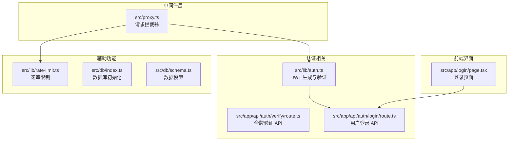
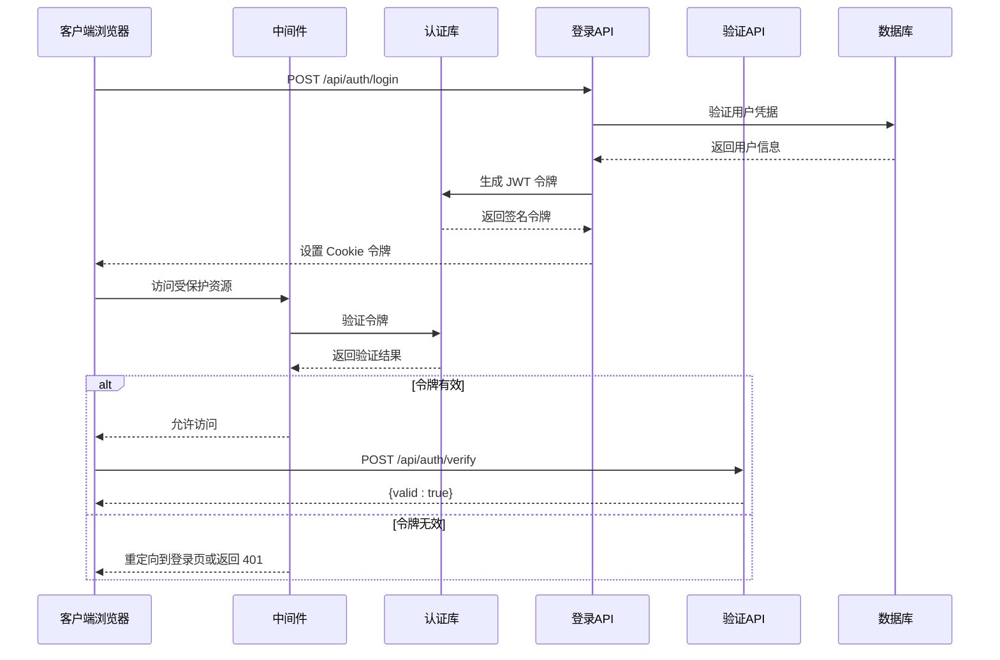
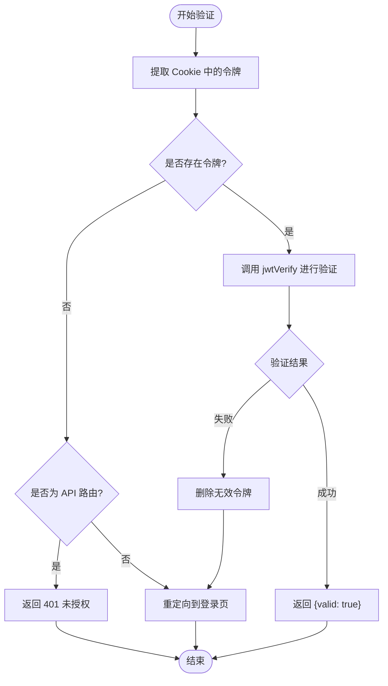
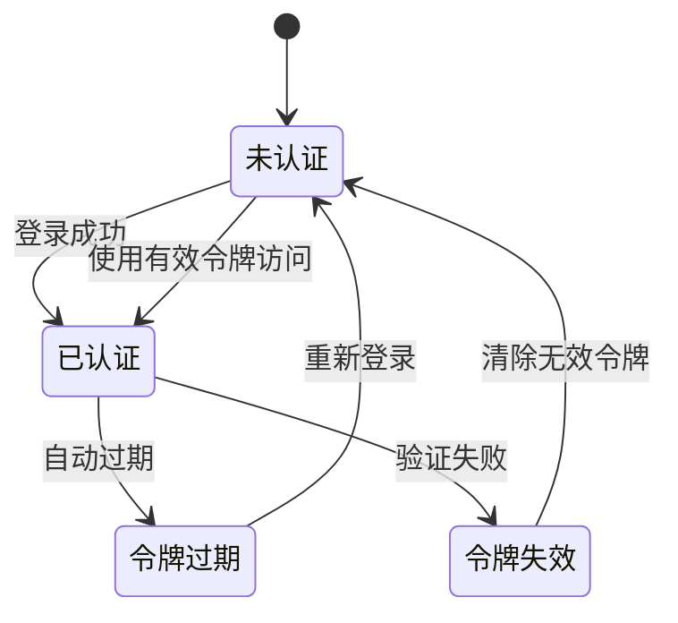
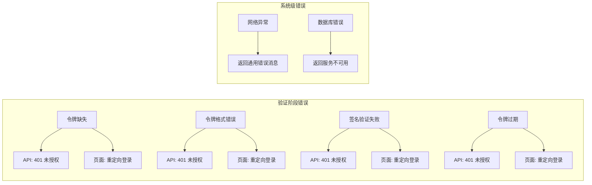

# 令牌验证系统

<cite>
**本文档引用的文件**
- [src/lib/auth.ts](file://src/lib/auth.ts)
- [src/app/api/auth/verify/route.ts](file://src/app/api/auth/verify/route.ts)
- [src/app/api/auth/login/route.ts](file://src/app/api/auth/login/route.ts)
- [src/proxy.ts](file://src/proxy.ts)
- [src/app/login/page.tsx](file://src/app/login/page.tsx)
- [src/lib/rate-limit.ts](file://src/lib/rate-limit.ts)
- [src/db/index.ts](file://src/db/index.ts)
- [src/db/schema.ts](file://src/db/schema.ts)
- [package.json](file://package.json)
- [next.config.ts](file://next.config.ts)
</cite>

## 目录
1. [简介](#简介)
2. [项目结构](#项目结构)
3. [核心组件](#核心组件)
4. [架构概览](#架构概览)
5. [详细组件分析](#详细组件分析)
6. [依赖关系分析](#依赖关系分析)
7. [性能考虑](#性能考虑)
8. [故障排除指南](#故障排除指南)
9. [结论](#结论)
10. [附录](#附录)

## 简介

本项目实现了基于 JWT（JSON Web Token）的令牌验证系统，为 Next.js 应用提供安全的认证机制。系统采用 HTTP Cookie 存储令牌，通过自定义中间件在请求到达时进行验证，确保只有经过身份验证的用户才能访问受保护的资源。

该系统的核心特性包括：
- 基于 HS256 算法的 JWT 签名和验证
- 自动化的令牌过期检查
- 细粒度的访问控制（API 路由 vs 页面路由）
- 集成的速率限制机制
- 完整的错误处理和重定向逻辑

## 项目结构

令牌验证系统主要分布在以下关键目录中：



**图表来源**
- [src/lib/auth.ts:1-26](file://src/lib/auth.ts#L1-L26)
- [src/proxy.ts:1-50](file://src/proxy.ts#L1-L50)
- [src/app/api/auth/login/route.ts:1-63](file://src/app/api/auth/login/route.ts#L1-L63)

**章节来源**
- [src/lib/auth.ts:1-26](file://src/lib/auth.ts#L1-L26)
- [src/proxy.ts:1-50](file://src/proxy.ts#L1-L50)
- [src/app/api/auth/login/route.ts:1-63](file://src/app/api/auth/login/route.ts#L1-L63)

## 核心组件

### JWT 认证库 (src/lib/auth.ts)

JWT 认证库提供了完整的令牌生成功能和验证逻辑：

**主要功能：**
- 令牌签名：使用 HS256 算法对载荷进行签名
- 令牌验证：验证令牌的有效性和完整性
- 密钥管理：动态从环境变量加载加密密钥

**关键特性：**
- 默认过期时间为 7 天
- 支持自定义载荷内容
- 异常安全的验证机制

**章节来源**
- [src/lib/auth.ts:10-25](file://src/lib/auth.ts#L10-L25)

### 请求拦截中间件 (src/proxy.ts)

中间件系统负责在请求到达应用之前进行身份验证：

**验证流程：**
1. 公共路径放行（登录页面和登录 API）
2. 静态资源和内部路由放行
3. 从 Cookie 中提取令牌
4. 执行令牌验证
5. 根据验证结果进行相应处理

**路由匹配规则：**
- `/app/:path*` - 应用页面路由
- `/api/:path*` - API 接口路由

**章节来源**
- [src/proxy.ts:7-45](file://src/proxy.ts#L7-L45)

### 登录 API (src/app/api/auth/login/route.ts)

登录接口处理用户凭据验证和令牌发放：

**认证流程：**
1. IP 地址识别（支持代理环境）
2. 速率限制检查
3. 用户凭据验证
4. 成功后签发 JWT 令牌
5. 设置安全的 Cookie 属性

**安全配置：**
- HttpOnly Cookie 防止 XSS 攻击
- Secure 标志仅在 HTTPS 环境下传输
- SameSite Strict 防止 CSRF 攻击
- 7 天有效期

**章节来源**
- [src/app/api/auth/login/route.ts:9-62](file://src/app/api/auth/login/route.ts#L9-L62)

### 令牌验证 API (src/app/api/auth/verify/route.ts)

验证 API 作为中间件验证成功的确认端点：

**设计目的：**
- 为客户端提供主动验证令牌有效性的能力
- 确保中间件验证流程的完整性
- 提供统一的验证状态查询接口

**响应格式：**
- `{ valid: true }` - 令牌有效
- 仅在中间件验证通过时可达

**章节来源**
- [src/app/api/auth/verify/route.ts:3-6](file://src/app/api/auth/verify/route.ts#L3-L6)

## 架构概览



**图表来源**
- [src/proxy.ts:24-42](file://src/proxy.ts#L24-L42)
- [src/lib/auth.ts:18-25](file://src/lib/auth.ts#L18-L25)
- [src/app/api/auth/login/route.ts:47-58](file://src/app/api/auth/login/route.ts#L47-L58)

## 详细组件分析

### JWT 验证流程



**图表来源**
- [src/proxy.ts:24-42](file://src/proxy.ts#L24-L42)
- [src/lib/auth.ts:18-25](file://src/lib/auth.ts#L18-L25)

### 令牌生命周期管理



**图表来源**
- [src/proxy.ts:35-42](file://src/proxy.ts#L35-L42)
- [src/app/api/auth/login/route.ts:50-56](file://src/app/api/auth/login/route.ts#L50-L56)

### 错误处理机制

系统实现了多层次的错误处理：



**图表来源**
- [src/proxy.ts:26-42](file://src/proxy.ts#L26-L42)
- [src/lib/auth.ts:18-25](file://src/lib/auth.ts#L18-L25)

**章节来源**
- [src/proxy.ts:26-42](file://src/proxy.ts#L26-L42)
- [src/lib/auth.ts:18-25](file://src/lib/auth.ts#L18-L25)

## 依赖关系分析

### 核心依赖关系

```mermaid
graph TB
subgraph "外部依赖"
A[jose@^6.2.1<br/>JWT 库]
B[bcryptjs@^3.0.3<br/>密码哈希]
C[better-sqlite3@^12.8.0<br/>SQLite 数据库]
end
subgraph "Next.js 生态"
D[next@16.1.6<br/>Web 框架]
E[drizzle-orm@^0.45.1<br/>ORM 映射]
end
subgraph "业务模块"
F[src/lib/auth.ts]
G[src/proxy.ts]
H[src/app/api/auth/login/route.ts]
I[src/db/index.ts]
end
A --> F
B --> H
C --> I
D --> G
E --> I
F --> G
F --> H
I --> H
```

**图表来源**
- [package.json:67](file://package.json#L67)
- [package.json:57](file://package.json#L57)
- [package.json:58](file://package.json#L58)
- [package.json:72](file://package.json#L72)
- [package.json:65](file://package.json#L65)

### 环境配置依赖

系统运行需要以下环境变量：

| 环境变量 | 类型 | 必需 | 默认值 | 描述 |
|---------|------|------|--------|------|
| JWT_SECRET | 字符串 | 是 | "default-jwt-secret-change-me-now" | JWT 加密密钥 |
| JWT_EXPIRY | 字符串 | 否 | "7d" | 令牌过期时间 |
| AUTH_SECRET_KEY | 字符串 | 否 | 无 | 系统管理员密钥 |
| DATABASE_PATH | 字符串 | 否 | "./data/ynote.db" | SQLite 数据库路径 |

**章节来源**
- [src/lib/auth.ts:3-4](file://src/lib/auth.ts#L3-L4)
- [src/db/index.ts:8](file://src/db/index.ts#L8)

## 性能考虑

### 缓存策略建议

虽然当前实现没有内置缓存，但可以考虑以下优化方案：

1. **令牌验证缓存**
   - 对于已验证的令牌，在内存中短期缓存验证结果
   - 缓存时间应小于令牌过期时间
   - 使用 LRU 算法管理缓存大小

2. **数据库连接池**
   - 利用现有单例模式避免重复连接
   - 考虑实现连接池以提高并发性能

3. **中间件执行优化**
   - 将验证结果存储在请求对象中避免重复验证
   - 对静态资源请求跳过验证逻辑

### 性能监控指标

建议监控以下关键指标：
- JWT 验证平均响应时间
- 令牌验证成功率
- 中间件执行耗时
- 数据库查询性能

## 故障排除指南

### 常见问题诊断

#### 1. 令牌验证失败

**症状：** API 返回 401 未授权，页面重定向到登录页

**可能原因：**
- 令牌已过期
- 密钥不匹配
- 令牌格式错误
- Cookie 未正确设置

**解决步骤：**
1. 检查服务器时间同步
2. 验证 JWT_SECRET 环境变量
3. 确认 Cookie 设置参数
4. 查看服务器日志

#### 2. 登录失败

**症状：** 登录 API 返回错误信息

**可能原因：**
- 密钥错误
- 账户不存在
- 速率限制触发
- 数据库连接问题

**解决步骤：**
1. 验证 AUTH_SECRET_KEY 环境变量
2. 检查数据库初始化状态
3. 确认速率限制配置
4. 测试数据库连接

#### 3. CORS 或跨域问题

**症状：** 浏览器控制台显示跨域错误

**解决步骤：**
1. 检查 Next.js 配置
2. 验证代理设置
3. 确认 Cookie 属性配置

**章节来源**
- [src/proxy.ts:26-42](file://src/proxy.ts#L26-L42)
- [src/app/api/auth/login/route.ts:38-43](file://src/app/api/auth/login/route.ts#L38-L43)
- [src/lib/rate-limit.ts:21-36](file://src/lib/rate-limit.ts#L21-L36)

### 调试技巧

1. **启用详细日志**
   ```bash
   # 在开发环境中启用调试输出
   DEBUG=1 npm run dev
   ```

2. **检查令牌内容**
   ```javascript
   // 使用 base64 解码查看 JWT 载荷
   const payload = token.split('.')[1];
   console.log(JSON.parse(atob(payload)));
   ```

3. **验证环境变量**
   ```bash
   # 检查必要的环境变量
   echo $JWT_SECRET
   echo $AUTH_SECRET_KEY
   ```

## 结论

本令牌验证系统提供了完整而安全的身份认证解决方案，具有以下优势：

**安全性方面：**
- 使用标准的 JWT 协议和 HS256 算法
- 实现了多层防护机制（速率限制、CSRF 防护、XSS 防护）
- 采用安全的 Cookie 配置

**可维护性方面：**
- 模块化设计，职责清晰
- 完善的错误处理机制
- 易于扩展和定制

**性能方面：**
- 基于中间件的高效验证
- 支持异步处理
- 良好的并发性能

建议在生产环境中进一步增强的功能包括：令牌刷新机制、多设备会话管理、审计日志记录等。

## 附录

### API 使用示例

#### 登录请求
```javascript
// 发送登录请求
const response = await fetch('/api/auth/login', {
  method: 'POST',
  headers: { 'Content-Type': 'application/json' },
  body: JSON.stringify({ key: 'your-secret-key' })
});

const data = await response.json();
// 成功时会设置带有令牌的 Cookie
```

#### 令牌验证
```javascript
// 主动验证令牌
const verifyResponse = await fetch('/api/auth/verify', {
  method: 'POST',
  headers: { 'Content-Type': 'application/json' }
});

const { valid } = await verifyResponse.json();
// valid = true 表示令牌有效
```

#### 错误处理最佳实践
```javascript
try {
  const response = await fetch('/api/protected-resource');
  
  if (response.status === 401) {
    // 处理未授权情况
    window.location.href = '/login';
    return;
  }
  
  const data = await response.json();
  // 处理正常响应
  
} catch (error) {
  // 处理网络错误
  console.error('请求失败:', error);
}
```

### 配置建议

1. **生产环境配置**
   - 设置强随机的 JWT_SECRET
   - 配置 HTTPS 和安全的 Cookie 属性
   - 实施更严格的速率限制

2. **监控和日志**
   - 添加认证事件的日志记录
   - 监控验证失败率
   - 设置告警阈值

3. **备份和恢复**
   - 定期备份数据库
   - 备份 JWT 密钥材料
   - 制定应急响应计划