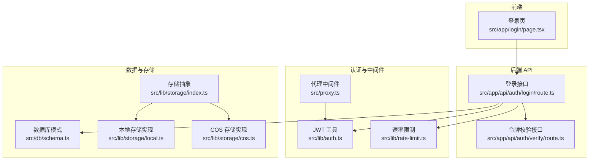
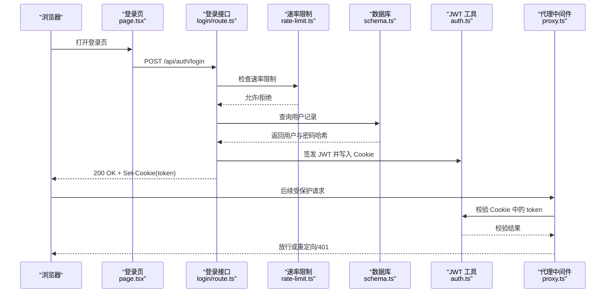
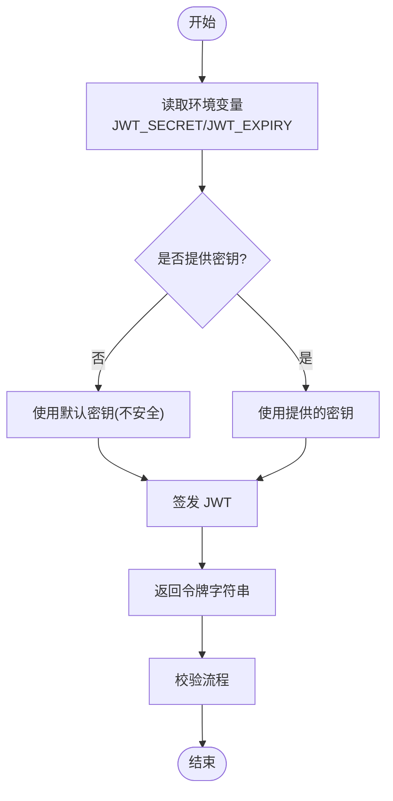
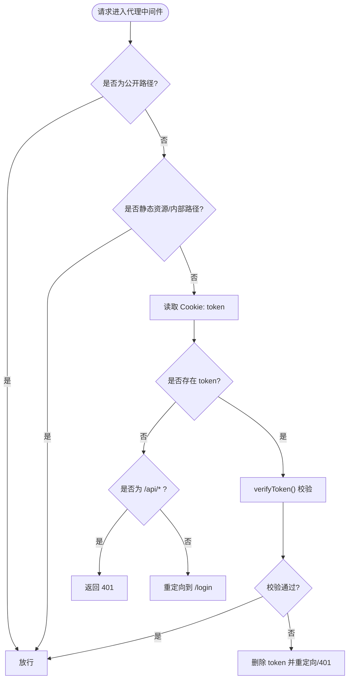
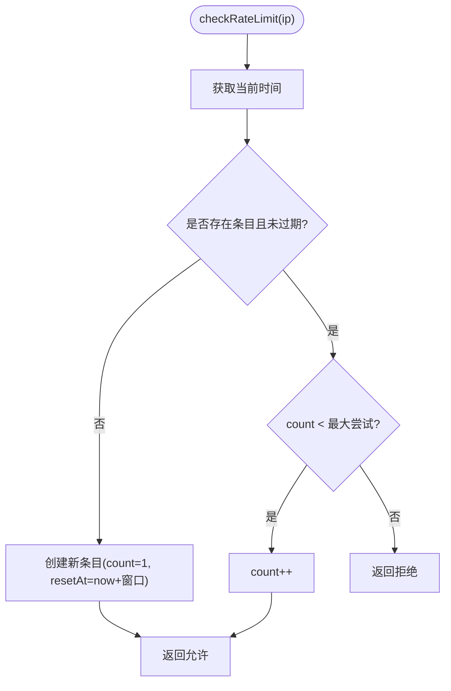
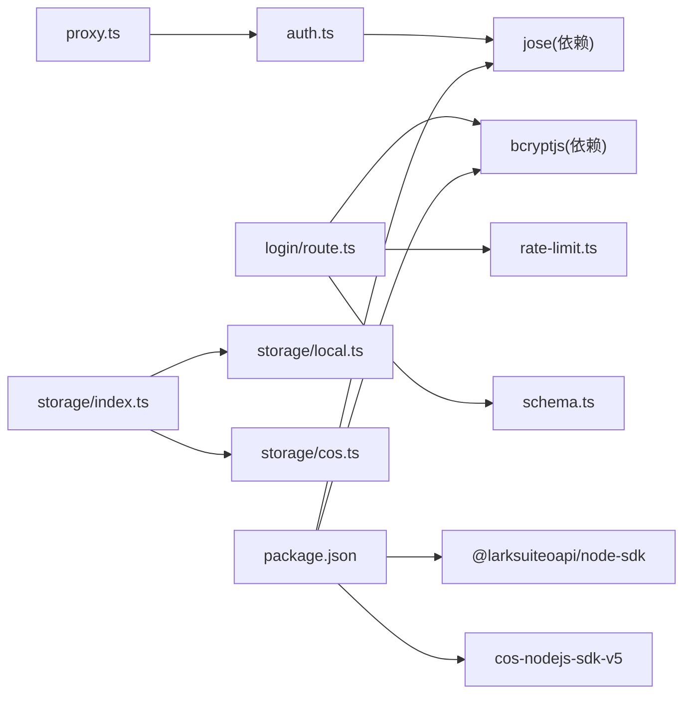

# 安全配置与最佳实践

<cite>
**本文引用的文件**
- [src/lib/auth.ts](file://src/lib/auth.ts)
- [src/app/api/auth/login/route.ts](file://src/app/api/auth/login/route.ts)
- [src/app/api/auth/verify/route.ts](file://src/app/api/auth/verify/route.ts)
- [src/proxy.ts](file://src/proxy.ts)
- [src/lib/rate-limit.ts](file://src/lib/rate-limit.ts)
- [src/app/login/page.tsx](file://src/app/login/page.tsx)
- [src/db/schema.ts](file://src/db/schema.ts)
- [package.json](file://package.json)
- [next.config.ts](file://next.config.ts)
- [src/lib/storage/index.ts](file://src/lib/storage/index.ts)
- [src/lib/storage/local.ts](file://src/lib/storage/local.ts)
- [src/lib/storage/cos.ts](file://src/lib/storage/cos.ts)
</cite>

## 目录
1. [简介](#简介)
2. [项目结构](#项目结构)
3. [核心组件](#核心组件)
4. [架构总览](#架构总览)
5. [详细组件分析](#详细组件分析)
6. [依赖关系分析](#依赖关系分析)
7. [性能考量](#性能考量)
8. [故障排查指南](#故障排查指南)
9. [结论](#结论)
10. [附录：安全配置清单与测试验证](#附录安全配置清单与测试验证)

## 简介
本文件聚焦于本项目的认证系统安全配置与最佳实践，围绕以下主题展开：
- JWT 密钥的安全配置与强度要求
- 令牌过期时间的配置与调整策略
- 安全传输机制（HTTPS 要求与令牌传输安全）
- 会话管理策略（Cookie 安全标志与存储位置建议）
- 常见安全威胁与防护措施（CSRF、令牌泄露、暴力破解）
- 安全审计要点与合规性考虑
- 安全配置的测试方法与验证步骤

## 项目结构
认证相关的关键模块分布如下：
- 认证逻辑与中间件：JWT 生成/校验、路由中间件拦截
- 登录接口：请求解析、速率限制、密码比对、令牌下发
- 前端登录页：表单提交、错误处理
- 数据模型：用户表结构
- 存储抽象：本地与云存储的选择与配置



图表来源
- [src/app/login/page.tsx:1-99](file://src/app/login/page.tsx#L1-L99)
- [src/app/api/auth/login/route.ts:1-63](file://src/app/api/auth/login/route.ts#L1-L63)
- [src/app/api/auth/verify/route.ts:1-7](file://src/app/api/auth/verify/route.ts#L1-L7)
- [src/lib/auth.ts:1-26](file://src/lib/auth.ts#L1-L26)
- [src/proxy.ts:1-49](file://src/proxy.ts#L1-L49)
- [src/lib/rate-limit.ts:1-41](file://src/lib/rate-limit.ts#L1-L41)
- [src/db/schema.ts:1-105](file://src/db/schema.ts#L1-L105)
- [src/lib/storage/index.ts:1-30](file://src/lib/storage/index.ts#L1-L30)
- [src/lib/storage/local.ts:1-29](file://src/lib/storage/local.ts#L1-L29)
- [src/lib/storage/cos.ts:1-62](file://src/lib/storage/cos.ts#L1-L62)

章节来源
- [src/app/login/page.tsx:1-99](file://src/app/login/page.tsx#L1-L99)
- [src/app/api/auth/login/route.ts:1-63](file://src/app/api/auth/login/route.ts#L1-L63)
- [src/app/api/auth/verify/route.ts:1-7](file://src/app/api/auth/verify/route.ts#L1-L7)
- [src/lib/auth.ts:1-26](file://src/lib/auth.ts#L1-L26)
- [src/proxy.ts:1-49](file://src/proxy.ts#L1-L49)
- [src/lib/rate-limit.ts:1-41](file://src/lib/rate-limit.ts#L1-L41)
- [src/db/schema.ts:1-105](file://src/db/schema.ts#L1-L105)
- [src/lib/storage/index.ts:1-30](file://src/lib/storage/index.ts#L1-L30)
- [src/lib/storage/local.ts:1-29](file://src/lib/storage/local.ts#L1-L29)
- [src/lib/storage/cos.ts:1-62](file://src/lib/storage/cos.ts#L1-L62)

## 核心组件
- JWT 工具：负责密钥编码、签发与校验；读取环境变量控制密钥与过期时间
- 登录接口：接收密钥、进行速率限制、比对密码哈希、签发 Cookie 中的 JWT
- 代理中间件：拦截受保护路径，从 Cookie 读取令牌并校验有效性
- 速率限制：基于内存 Map 的简单限流，防止暴力破解
- 前端登录页：表单提交到登录接口，并处理错误与加载状态
- 数据模型：用户表定义，包含密码哈希字段
- 存储抽象：根据环境变量选择本地或 COS 存储

章节来源
- [src/lib/auth.ts:1-26](file://src/lib/auth.ts#L1-L26)
- [src/app/api/auth/login/route.ts:1-63](file://src/app/api/auth/login/route.ts#L1-L63)
- [src/proxy.ts:1-49](file://src/proxy.ts#L1-L49)
- [src/lib/rate-limit.ts:1-41](file://src/lib/rate-limit.ts#L1-L41)
- [src/app/login/page.tsx:1-99](file://src/app/login/page.tsx#L1-L99)
- [src/db/schema.ts:1-105](file://src/db/schema.ts#L1-L105)
- [src/lib/storage/index.ts:1-30](file://src/lib/storage/index.ts#L1-L30)

## 架构总览
下图展示了认证流程：前端提交密钥 → 后端执行速率限制与密码校验 → 成功后签发安全 Cookie → 中间件在后续请求中校验令牌。



图表来源
- [src/app/login/page.tsx:1-99](file://src/app/login/page.tsx#L1-L99)
- [src/app/api/auth/login/route.ts:1-63](file://src/app/api/auth/login/route.ts#L1-L63)
- [src/lib/rate-limit.ts:1-41](file://src/lib/rate-limit.ts#L1-L41)
- [src/db/schema.ts:1-105](file://src/db/schema.ts#L1-L105)
- [src/lib/auth.ts:1-26](file://src/lib/auth.ts#L1-L26)
- [src/proxy.ts:1-49](file://src/proxy.ts#L1-L49)

## 详细组件分析

### JWT 密钥与令牌配置
- 密钥来源：从环境变量读取，若未设置则使用默认值（存在安全风险）
- 过期时间：从环境变量读取，默认为固定时长
- 签发算法：HS256（对称密钥）
- 校验流程：使用相同密钥进行验证



图表来源
- [src/lib/auth.ts:1-26](file://src/lib/auth.ts#L1-L26)

章节来源
- [src/lib/auth.ts:1-26](file://src/lib/auth.ts#L1-L26)

### 登录流程与速率限制
- 请求头提取 IP（支持代理场景）
- 速率限制：每 IP 在时间窗口内最多尝试若干次
- 密码校验：使用同步比对函数比对哈希
- 成功后签发 Cookie，设置 HttpOnly、Secure、SameSite、maxAge、path

```mermaid
sequenceDiagram
participant Client as "客户端"
participant API as "登录接口"
participant RL as "速率限制"
participant DB as "数据库"
participant JWT as "JWT 工具"
Client->>API : POST /api/auth/login
API->>RL : checkRateLimit(ip)
RL-->>API : 允许/拒绝
API->>DB : 查询用户
DB-->>API : 用户与密码哈希
API->>API : 比对密码
API->>JWT : signToken()
JWT-->>API : token
API-->>Client : 200 + Set-Cookie(token; httpOnly; secure; samesite; maxAge)
```

图表来源
- [src/app/api/auth/login/route.ts:1-63](file://src/app/api/auth/login/route.ts#L1-L63)
- [src/lib/rate-limit.ts:1-41](file://src/lib/rate-limit.ts#L1-L41)
- [src/db/schema.ts:1-105](file://src/db/schema.ts#L1-L105)
- [src/lib/auth.ts:1-26](file://src/lib/auth.ts#L1-L26)

章节来源
- [src/app/api/auth/login/route.ts:1-63](file://src/app/api/auth/login/route.ts#L1-L63)
- [src/lib/rate-limit.ts:1-41](file://src/lib/rate-limit.ts#L1-L41)
- [src/db/schema.ts:1-105](file://src/db/schema.ts#L1-L105)
- [src/lib/auth.ts:1-26](file://src/lib/auth.ts#L1-L26)

### 代理中间件与令牌校验
- 白名单路径：允许公开访问
- 受保护路径：从 Cookie 读取 token
- 校验失败：清理无效 token 并重定向至登录页
- API 路径校验失败：返回 401



图表来源
- [src/proxy.ts:1-49](file://src/proxy.ts#L1-L49)
- [src/lib/auth.ts:1-26](file://src/lib/auth.ts#L1-L26)

章节来源
- [src/proxy.ts:1-49](file://src/proxy.ts#L1-L49)
- [src/lib/auth.ts:1-26](file://src/lib/auth.ts#L1-L26)

### 速率限制算法
- 窗口大小与最大尝试次数可配置
- 使用内存 Map 存储每个 IP 的计数与重置时间
- 定期清理过期条目，避免内存泄漏



图表来源
- [src/lib/rate-limit.ts:1-41](file://src/lib/rate-limit.ts#L1-L41)

章节来源
- [src/lib/rate-limit.ts:1-41](file://src/lib/rate-limit.ts#L1-L41)

### 前端登录页交互
- 表单输入与防重复提交
- 发送 JSON 请求到登录接口
- 处理 429（速率限制）、401（凭据错误）、其他网络错误

章节来源
- [src/app/login/page.tsx:1-99](file://src/app/login/page.tsx#L1-L99)

### 数据模型与密码存储
- 用户表包含主键 id、密码哈希、创建/更新时间戳
- 登录接口查询 admin 用户并比对哈希

章节来源
- [src/db/schema.ts:1-105](file://src/db/schema.ts#L1-L105)
- [src/app/api/auth/login/route.ts:1-63](file://src/app/api/auth/login/route.ts#L1-L63)

### 存储抽象与配置
- 根据环境变量决定使用本地存储还是 COS
- 本地存储上传目录位于 data/uploads
- COS 上传路径前缀为 ynote/

章节来源
- [src/lib/storage/index.ts:1-30](file://src/lib/storage/index.ts#L1-L30)
- [src/lib/storage/local.ts:1-29](file://src/lib/storage/local.ts#L1-L29)
- [src/lib/storage/cos.ts:1-62](file://src/lib/storage/cos.ts#L1-L62)

## 依赖关系分析
- 认证工具依赖 jose 进行 JWT 签发与校验
- 登录接口依赖 bcryptjs 进行密码比对
- 代理中间件依赖认证工具进行令牌校验
- 速率限制为独立模块，被登录接口调用
- 存储抽象依赖 dotenv（开发环境）与第三方 SDK（COS）



图表来源
- [src/lib/auth.ts:1-26](file://src/lib/auth.ts#L1-L26)
- [src/app/api/auth/login/route.ts:1-63](file://src/app/api/auth/login/route.ts#L1-L63)
- [src/lib/rate-limit.ts:1-41](file://src/lib/rate-limit.ts#L1-L41)
- [src/db/schema.ts:1-105](file://src/db/schema.ts#L1-L105)
- [src/proxy.ts:1-49](file://src/proxy.ts#L1-L49)
- [src/lib/storage/index.ts:1-30](file://src/lib/storage/index.ts#L1-L30)
- [src/lib/storage/local.ts:1-29](file://src/lib/storage/local.ts#L1-L29)
- [src/lib/storage/cos.ts:1-62](file://src/lib/storage/cos.ts#L1-L62)
- [package.json:1-119](file://package.json#L1-L119)

章节来源
- [package.json:1-119](file://package.json#L1-L119)

## 性能考量
- 速率限制采用内存 Map，适合小规模部署；高并发场景建议迁移到持久化存储（如 Redis）
- JWT 校验为 CPU 密集型操作，建议在网关层或边缘缓存热点用户信息
- 存储上传路径与前缀固定，便于 CDN 缓存与回源优化
- Next.js 实验性配置包含较大的代理客户端体限制，注意与上游网关/负载均衡器的限制保持一致

章节来源
- [src/lib/rate-limit.ts:1-41](file://src/lib/rate-limit.ts#L1-L41)
- [src/lib/storage/cos.ts:1-62](file://src/lib/storage/cos.ts#L1-L62)
- [next.config.ts:1-17](file://next.config.ts#L1-L17)

## 故障排查指南
- 令牌无效或过期
  - 检查 JWT_SECRET 是否正确设置且与签发端一致
  - 检查 JWT_EXPIRY 是否合理，确认客户端未长时间离线
- 登录频繁被限流
  - 检查客户端 IP 是否被正确识别（代理场景需确保请求头传递）
  - 观察速率限制窗口与最大尝试次数配置
- Cookie 无法设置或丢失
  - 确认 Secure 标志在生产环境启用（仅 HTTPS）
  - 检查 SameSite 设置与跨站访问策略
  - 确认 path 与域名范围覆盖目标路径
- 401 未授权
  - 检查代理中间件是否正确读取 Cookie
  - 校验令牌是否被篡改或已过期
- 存储异常
  - 本地存储：确认 data/uploads 目录权限与磁盘空间
  - COS 存储：核对 SecretId/SecretKey/Bucket/Region 配置

章节来源
- [src/lib/auth.ts:1-26](file://src/lib/auth.ts#L1-L26)
- [src/app/api/auth/login/route.ts:1-63](file://src/app/api/auth/login/route.ts#L1-L63)
- [src/proxy.ts:1-49](file://src/proxy.ts#L1-L49)
- [src/lib/storage/local.ts:1-29](file://src/lib/storage/local.ts#L1-L29)
- [src/lib/storage/cos.ts:1-62](file://src/lib/storage/cos.ts#L1-L62)

## 结论
本项目采用轻量级的 JWT 认证方案，结合速率限制与代理中间件实现基础的安全访问控制。为提升安全性与可维护性，建议优先完成以下改进：
- 强制使用强密钥并定期轮换
- 严格区分开发/生产环境的传输与 Cookie 安全标志
- 将速率限制迁移至持久化存储
- 引入 CSRF 防护与更严格的令牌刷新策略
- 增加审计日志与合规性检查

## 附录：安全配置清单与测试验证

### 安全配置清单
- 必需项
  - 设置强 JWT 密钥（长度≥32 字节，随机熵高）
  - 设置合理的 JWT 过期时间（短期有效，配合刷新机制）
  - 生产环境启用 HTTPS，Cookie 设置 Secure 标志
  - 设置 Cookie 的 HttpOnly 与 SameSite=Strict
  - 限制令牌存储位置（避免明文存储于 localStorage）
- 推荐项
  - 引入 CSRF Token 或同源策略强化防护
  - 使用刷新令牌与短令牌组合，降低长期令牌暴露风险
  - 速率限制持久化（Redis），并支持分布式共享
  - 增加登录失败审计与告警
  - 对敏感操作增加二次确认与 MFA

### 常见安全威胁与防护
- CSRF 攻击
  - 防护：SameSite Cookie、CSRF Token、同源策略
- 令牌泄露
  - 防护：HttpOnly Cookie、最小权限、短有效期、撤销机制
- 暴力破解
  - 防护：速率限制、账户锁定、验证码、多因子认证
- 传输安全
  - 防护：强制 HTTPS、HSTS、证书固定（HPKP 可选）

### 安全审计要点
- 环境变量与密钥管理：密钥长度、轮换策略、访问控制
- 传输链路：证书有效性、协议版本、加密套件
- 会话策略：Cookie 安全标志、作用域与生命周期
- 日志与监控：登录事件、失败尝试、异常行为检测
- 合规性：GDPR、等保（如适用）、数据本地化

### 测试方法与验证步骤
- 密钥强度与过期时间
  - 验证：修改 JWT_SECRET 与 JWT_EXPIRY，观察签发与校验行为
  - 参考路径：[src/lib/auth.ts:1-26](file://src/lib/auth.ts#L1-L26)
- 速率限制
  - 验证：短时间内多次登录，确认 429 与 Retry-After 行为
  - 参考路径：[src/app/api/auth/login/route.ts:1-63](file://src/app/api/auth/login/route.ts#L1-L63)、[src/lib/rate-limit.ts:1-41](file://src/lib/rate-limit.ts#L1-L41)
- Cookie 安全标志
  - 验证：在生产环境检查响应头中的 Secure/SameSite；在非 HTTPS 环境确认浏览器拒绝
  - 参考路径：[src/app/api/auth/login/route.ts:50-56](file://src/app/api/auth/login/route.ts#L50-L56)
- 代理中间件
  - 验证：未携带 token 或 token 无效时，受保护路径返回 401 或重定向
  - 参考路径：[src/proxy.ts:1-49](file://src/proxy.ts#L1-L49)
- 存储配置
  - 验证：切换环境变量后，确认使用本地或 COS 存储
  - 参考路径：[src/lib/storage/index.ts:1-30](file://src/lib/storage/index.ts#L1-L30)、[src/lib/storage/local.ts:1-29](file://src/lib/storage/local.ts#L1-L29)、[src/lib/storage/cos.ts:1-62](file://src/lib/storage/cos.ts#L1-L62)