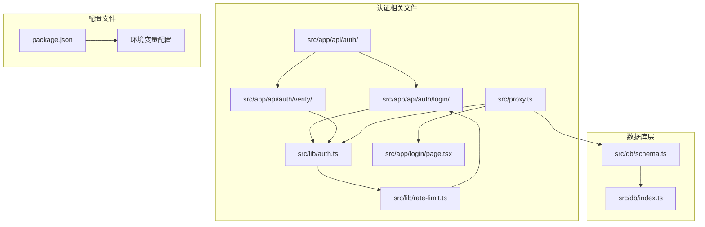
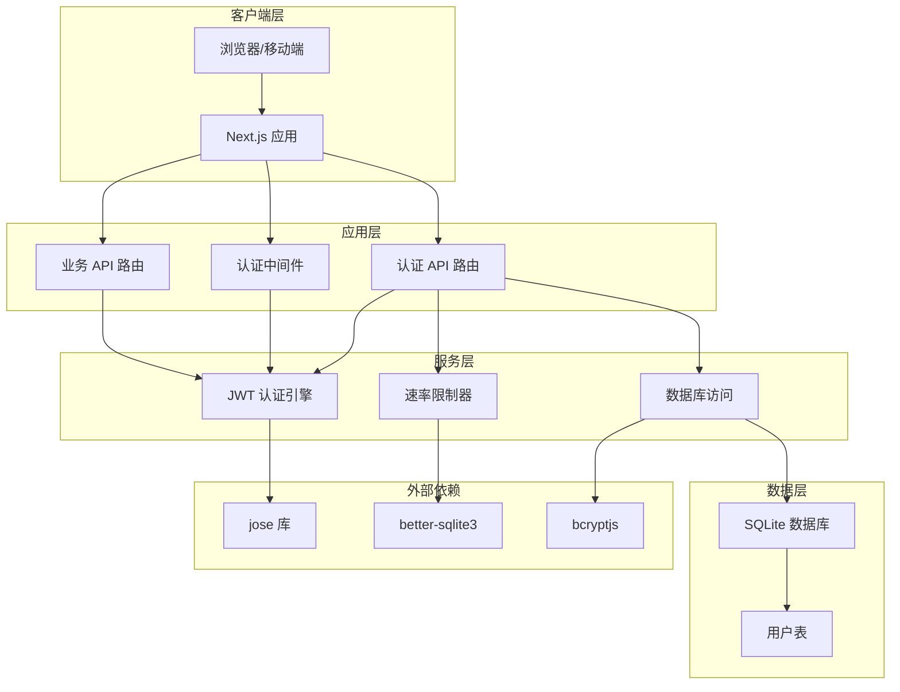
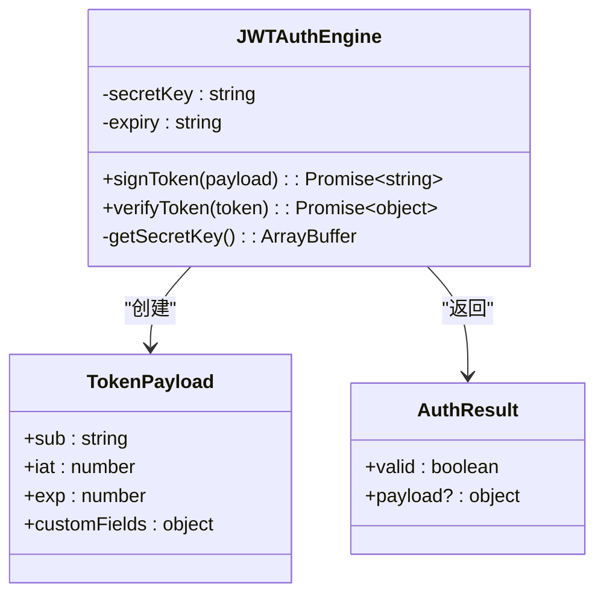
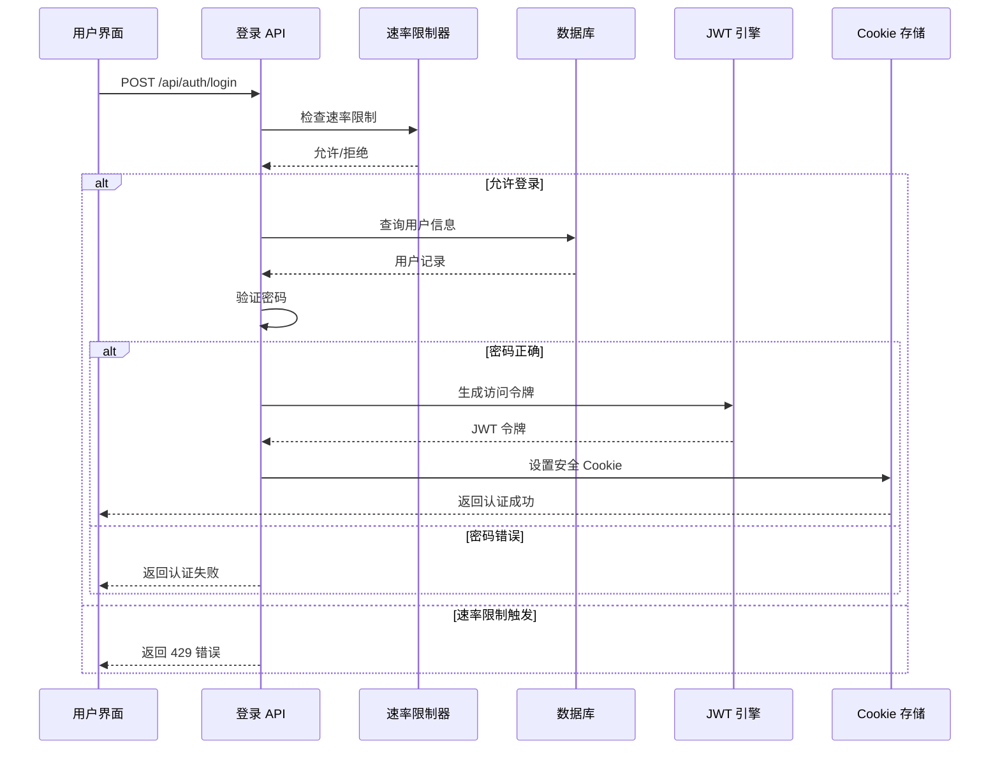
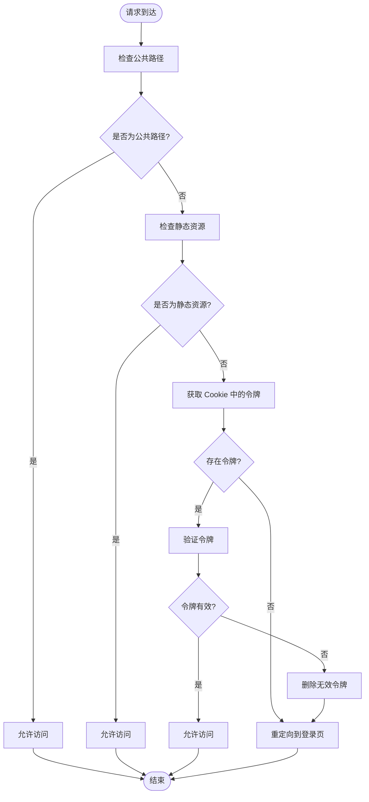
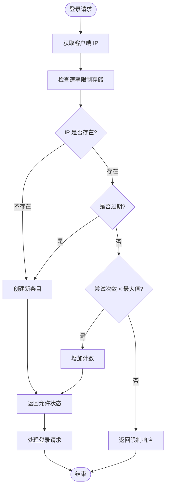
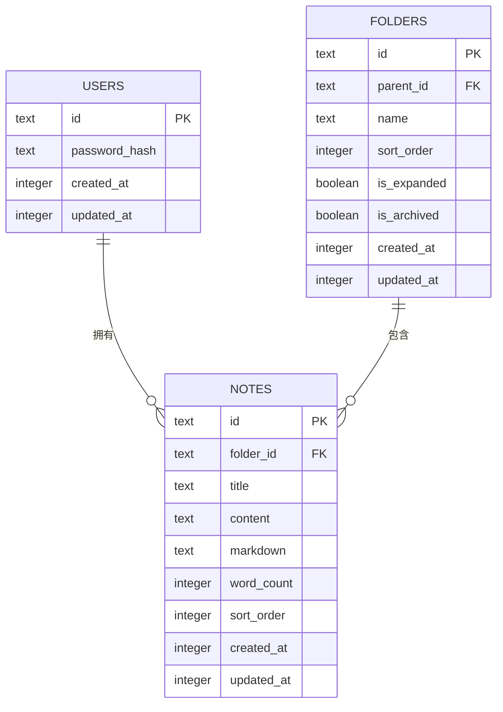
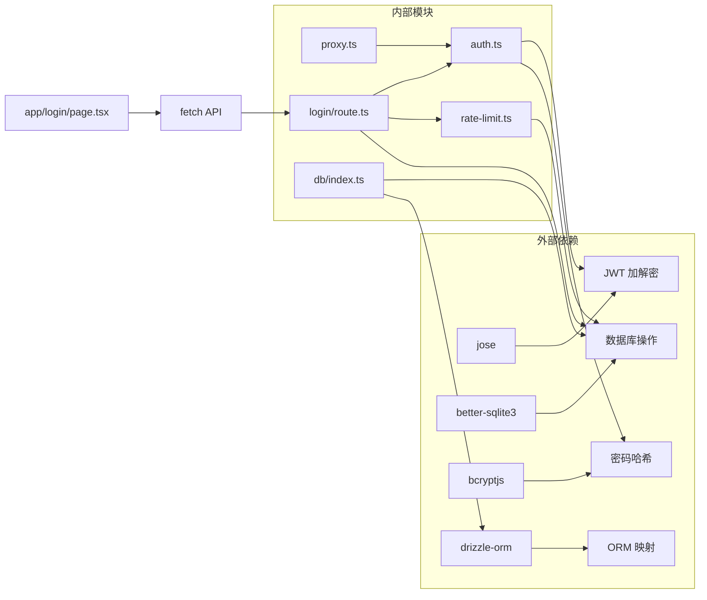

# 用户认证系统

<cite>
**本文档引用的文件**
- [src/app/api/auth/login/route.ts](file://src/app/api/auth/login/route.ts)
- [src/app/api/auth/verify/route.ts](file://src/app/api/auth/verify/route.ts)
- [src/lib/auth.ts](file://src/lib/auth.ts)
- [src/app/login/page.tsx](file://src/app/login/page.tsx)
- [src/proxy.ts](file://src/proxy.ts)
- [src/lib/rate-limit.ts](file://src/lib/rate-limit.ts)
- [src/db/schema.ts](file://src/db/schema.ts)
- [src/db/index.ts](file://src/db/index.ts)
- [package.json](file://package.json)
</cite>

## 目录
1. [简介](#简介)
2. [项目结构](#项目结构)
3. [核心组件](#核心组件)
4. [架构概览](#架构概览)
5. [详细组件分析](#详细组件分析)
6. [依赖关系分析](#依赖关系分析)
7. [性能考虑](#性能考虑)
8. [故障排除指南](#故障排除指南)
9. [结论](#结论)
10. [附录](#附录)

## 简介

本项目实现了一个基于 JWT（JSON Web Token）的简化认证系统。该系统采用单用户模式，使用固定用户名"admin"进行身份验证，并通过环境变量提供的密钥进行密码验证。认证系统的核心特性包括：

- 基于 JWT 的无状态认证机制
- 速率限制保护防止暴力破解
- 安全的 Cookie 存储策略
- 中间件驱动的权限控制
- 完整的登录流程实现

系统设计简洁明了，适合个人使用场景或作为更复杂认证系统的原型。

## 项目结构

认证系统在项目中的组织结构如下：



**图表来源**
- [src/app/api/auth/login/route.ts:1-63](file://src/app/api/auth/login/route.ts#L1-L63)
- [src/lib/auth.ts:1-26](file://src/lib/auth.ts#L1-L26)
- [src/proxy.ts:1-49](file://src/proxy.ts#L1-L49)

**章节来源**
- [src/app/api/auth/login/route.ts:1-63](file://src/app/api/auth/login/route.ts#L1-L63)
- [src/lib/auth.ts:1-26](file://src/lib/auth.ts#L1-L26)
- [src/proxy.ts:1-49](file://src/proxy.ts#L1-L49)

## 核心组件

### JWT 认证引擎

JWT 认证系统的核心是基于 HS256 算法的对称加密机制。系统使用环境变量 `JWT_SECRET` 作为密钥，`JWT_EXPIRY` 控制令牌有效期，默认为 7 天。

### 登录处理器

登录处理器实现了完整的认证流程，包括请求验证、用户查询、密码比较和令牌签发。

### 速率限制器

内置的速率限制器防止暴力破解攻击，每 15 分钟内最多允许 5 次登录尝试。

### 权限中间件

全局中间件负责拦截所有受保护的路由，验证 JWT 令牌的有效性。

**章节来源**
- [src/lib/auth.ts:1-26](file://src/lib/auth.ts#L1-L26)
- [src/app/api/auth/login/route.ts:1-63](file://src/app/api/auth/login/route.ts#L1-L63)
- [src/lib/rate-limit.ts:1-41](file://src/lib/rate-limit.ts#L1-L41)
- [src/proxy.ts:1-49](file://src/proxy.ts#L1-L49)

## 架构概览

认证系统的整体架构采用分层设计，确保关注点分离和代码可维护性。



**图表来源**
- [src/app/api/auth/login/route.ts:1-63](file://src/app/api/auth/login/route.ts#L1-L63)
- [src/lib/auth.ts:1-26](file://src/lib/auth.ts#L1-L26)
- [src/proxy.ts:1-49](file://src/proxy.ts#L1-L49)
- [src/db/index.ts:1-171](file://src/db/index.ts#L1-L171)

## 详细组件分析

### JWT 认证引擎

JWT 认证引擎是整个系统的核心，负责令牌的生成和验证。



**图表来源**
- [src/lib/auth.ts:1-26](file://src/lib/auth.ts#L1-L26)

#### 令牌生成流程

令牌生成过程包含以下步骤：
1. 创建 JWT 对象并设置受保护头部（HS256 算法）
2. 设置发行时间戳（iat）
3. 设置过期时间（基于 JWT_EXPIRY 环境变量）
4. 使用密钥签名生成最终令牌

#### 令牌验证流程

令牌验证过程包括：
1. 使用相同的密钥和算法验证签名
2. 检查过期时间
3. 返回验证结果和载荷信息

**章节来源**
- [src/lib/auth.ts:1-26](file://src/lib/auth.ts#L1-L26)

### 登录流程实现

登录流程是一个端到端的认证过程，从用户输入到令牌返回的完整路径。



**图表来源**
- [src/app/api/auth/login/route.ts:1-63](file://src/app/api/auth/login/route.ts#L1-L63)
- [src/lib/rate-limit.ts:1-41](file://src/lib/rate-limit.ts#L1-L41)
- [src/db/index.ts:142-157](file://src/db/index.ts#L142-L157)

#### 登录请求处理

登录请求处理包含以下关键步骤：
1. 获取客户端 IP 地址（支持代理环境）
2. 检查速率限制状态
3. 解析请求体并验证密钥格式
4. 查询数据库中的用户记录
5. 使用 bcrypt 进行密码验证
6. 成功时重置速率限制并生成 JWT 令牌
7. 通过 HttpOnly Cookie 安全存储令牌

**章节来源**
- [src/app/api/auth/login/route.ts:1-63](file://src/app/api/auth/login/route.ts#L1-L63)

### 权限中间件

权限中间件是系统安全的第二道防线，负责拦截所有受保护的请求。



**图表来源**
- [src/proxy.ts:1-49](file://src/proxy.ts#L1-L49)

#### 中间件执行逻辑

中间件的执行逻辑遵循以下规则：
1. 允许公共路径（登录页面和登录 API）
2. 允许静态资源和框架内部路径
3. 检查 Cookie 中是否存在 token
4. 验证 JWT 令牌的有效性
5. 根据结果决定重定向或放行

**章节来源**
- [src/proxy.ts:1-49](file://src/proxy.ts#L1-L49)

### 速率限制机制

系统内置了智能的速率限制机制，防止暴力破解攻击。



**图表来源**
- [src/lib/rate-limit.ts:1-41](file://src/lib/rate-limit.ts#L1-L41)

#### 速率限制配置

速率限制器采用以下配置：
- 时间窗口：15 分钟
- 最大尝试次数：5 次
- 自动清理：每分钟清理过期条目
- 存储方式：内存 Map 结构

**章节来源**
- [src/lib/rate-limit.ts:1-41](file://src/lib/rate-limit.ts#L1-L41)

### 数据模型

系统使用 SQLite 作为数据存储，采用简单的用户表结构。



**图表来源**
- [src/db/schema.ts:1-105](file://src/db/schema.ts#L1-L105)

**章节来源**
- [src/db/schema.ts:1-105](file://src/db/schema.ts#L1-L105)
- [src/db/index.ts:27-158](file://src/db/index.ts#L27-L158)

## 依赖关系分析

认证系统的依赖关系清晰明确，各组件职责单一且耦合度低。



**图表来源**
- [package.json:57-67](file://package.json#L57-L67)
- [src/lib/auth.ts:1-26](file://src/lib/auth.ts#L1-L26)
- [src/app/api/auth/login/route.ts:1-63](file://src/app/api/auth/login/route.ts#L1-L63)

### 关键依赖说明

- **jose**: 提供 JWT 的生成和验证功能
- **bcryptjs**: 实现密码的安全哈希和比较
- **better-sqlite3**: SQLite 数据库驱动
- **drizzle-orm**: ORM 映射工具

**章节来源**
- [package.json:57-67](file://package.json#L57-L67)
- [src/lib/auth.ts:1-26](file://src/lib/auth.ts#L1-L26)

## 性能考虑

### 内存优化

- 速率限制器使用内存存储，适合单实例部署
- JWT 密钥在内存中缓存，避免重复编码
- 数据库连接采用单例模式，减少连接开销

### 缓存策略

- 已验证的令牌不进行重复验证（可在客户端缓存）
- 速率限制状态在内存中快速查找
- 数据库初始化只在首次访问时执行

### 扩展性建议

对于生产环境，建议考虑：
- 使用 Redis 等分布式缓存替代内存存储
- 实现令牌撤销列表（RTLT）支持
- 添加多因子认证支持
- 实现账户锁定机制

## 故障排除指南

### 常见问题及解决方案

#### 1. 登录失败但密码正确

**症状**: 返回"密钥错误"错误

**可能原因**:
- 环境变量 `AUTH_SECRET_KEY` 未正确设置
- 数据库中没有初始化管理员用户
- 密码哈希不匹配

**解决步骤**:
1. 检查 `.env` 文件中的 `AUTH_SECRET_KEY`
2. 确认数据库中存在 id 为 "admin" 的用户
3. 重新设置环境变量并重启应用

#### 2. 429 错误频繁出现

**症状**: 请求被拒绝，返回 429 状态码

**可能原因**:
- 客户端 IP 被临时限制
- 速率限制器配置过严

**解决步骤**:
1. 等待 15 分钟窗口到期
2. 检查客户端网络环境
3. 调整 `MAX_ATTEMPTS` 和 `WINDOW_MS` 配置

#### 3. 令牌验证失败

**症状**: API 请求返回 401 未授权

**可能原因**:
- Cookie 未正确设置
- JWT 密钥不匹配
- 令牌已过期

**解决步骤**:
1. 检查浏览器 Cookie 设置
2. 确认 `JWT_SECRET` 环境变量一致
3. 重新登录获取新令牌

#### 4. 页面重定向循环

**症状**: 在登录后仍然重定向到登录页

**可能原因**:
- 中间件配置错误
- Cookie 安全设置问题

**解决步骤**:
1. 检查 `proxy.ts` 中的路径匹配规则
2. 验证 Cookie 的 `secure` 和 `sameSite` 设置
3. 清除浏览器缓存和 Cookie

**章节来源**
- [src/app/api/auth/login/route.ts:38-43](file://src/app/api/auth/login/route.ts#L38-L43)
- [src/lib/rate-limit.ts:30-32](file://src/lib/rate-limit.ts#L30-L32)
- [src/proxy.ts:24-42](file://src/proxy.ts#L24-L42)

## 结论

本认证系统实现了简洁而有效的单用户认证机制，具有以下特点：

**优势**:
- 实现简单，易于理解和维护
- 安全性良好，包含多种防护措施
- 性能表现优秀，适合个人使用场景
- 配置灵活，支持多种部署环境

**适用场景**:
- 个人知识管理应用
- 小团队协作工具
- 开发测试环境
- 原型系统认证

**改进建议**:
对于需要更高安全性和扩展性的生产环境，建议：
- 实现多用户支持
- 添加 OAuth 或 SSO 集成
- 实施更严格的会话管理
- 添加审计日志功能

## 附录

### API 接口规范

#### 登录接口

**请求地址**: `POST /api/auth/login`

**请求头**:
```
Content-Type: application/json
```

**请求体**:
```json
{
  "key": "string"
}
```

**响应**:
- 成功: `{ "success": true }` (状态码 200)
- 密钥错误: `{ "error": "密钥错误" }` (状态码 401)
- 频率限制: `{ "error": "登录尝试次数过多，请稍后再试" }` (状态码 429)

**章节来源**
- [src/app/api/auth/login/route.ts:27-61](file://src/app/api/auth/login/route.ts#L27-L61)

### 环境变量配置

| 变量名 | 默认值 | 说明 |
|--------|--------|------|
| `JWT_SECRET` | `"default-jwt-secret-change-me-now"` | JWT 密钥 |
| `JWT_EXPIRY` | `"7d"` | 令牌有效期 |
| `AUTH_SECRET_KEY` | 无 | 初始化管理员密码 |
| `DATABASE_PATH` | `"./data/ynote.db"` | 数据库存储路径 |

### 安全最佳实践

1. **密钥管理**: 生产环境中必须设置强随机的 `JWT_SECRET`
2. **HTTPS**: 在生产环境启用 HTTPS 以保护 Cookie 传输
3. **Cookie 安全**: 启用 `secure` 和 `sameSite` 属性
4. **速率限制**: 合理配置速率限制参数
5. **日志监控**: 添加详细的认证日志用于安全审计

### 客户端集成示例

#### JavaScript 客户端

```javascript
// 登录请求示例
async function login(key) {
  try {
    const response = await fetch('/api/auth/login', {
      method: 'POST',
      headers: {
        'Content-Type': 'application/json',
      },
      body: JSON.stringify({ key })
    });
    
    if (response.ok) {
      // 令牌已通过 Cookie 设置
      window.location.href = '/app';
    } else if (response.status === 429) {
      // 处理频率限制
      const data = await response.json();
      showErrorMessage(data.error);
    }
  } catch (error) {
    showErrorMessage('网络错误');
  }
}
```

#### React 组件

```jsx
function LoginForm() {
  const [key, setKey] = useState('');
  const [error, setError] = useState('');
  const [loading, setLoading] = useState(false);
  
  const handleSubmit = async (e) => {
    e.preventDefault();
    setLoading(true);
    
    try {
      const response = await fetch('/api/auth/login', {
        method: 'POST',
        headers: { 'Content-Type': 'application/json' },
        body: JSON.stringify({ key: key.trim() })
      });
      
      if (response.ok) {
        window.location.href = '/app';
      } else {
        const data = await response.json();
        setError(data.error || '登录失败');
      }
    } catch (err) {
      setError('网络错误');
    } finally {
      setLoading(false);
    }
  };
}
```