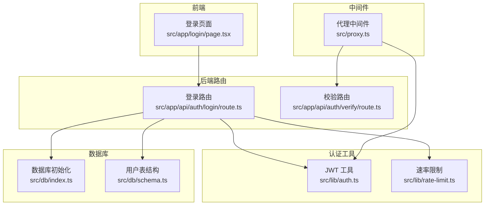
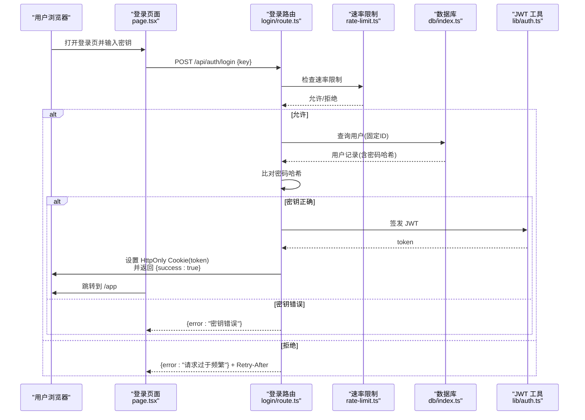
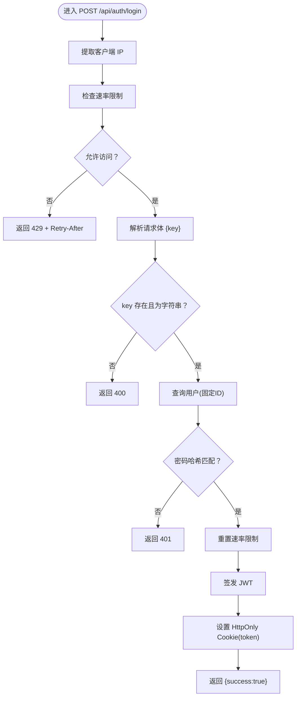
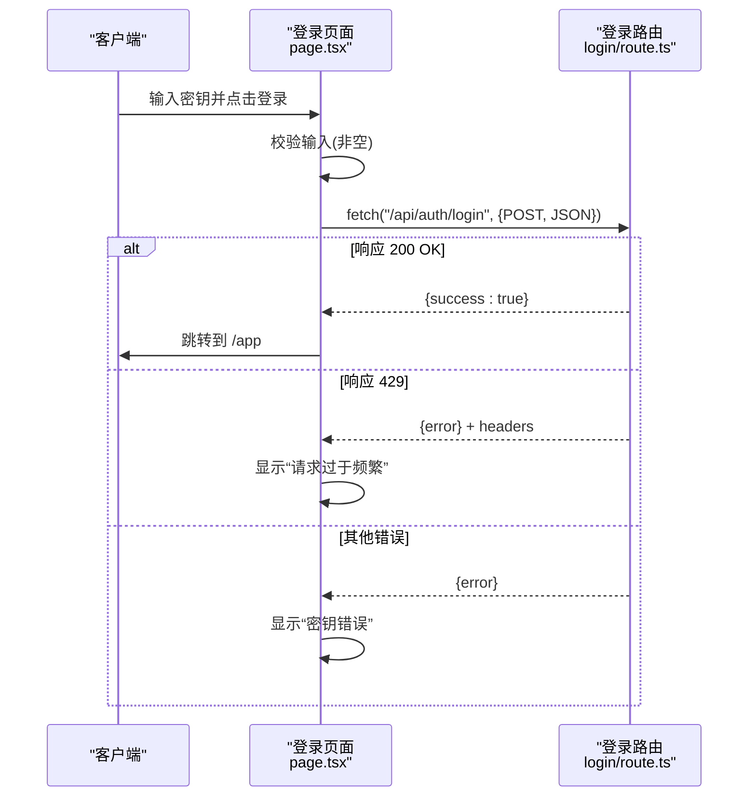
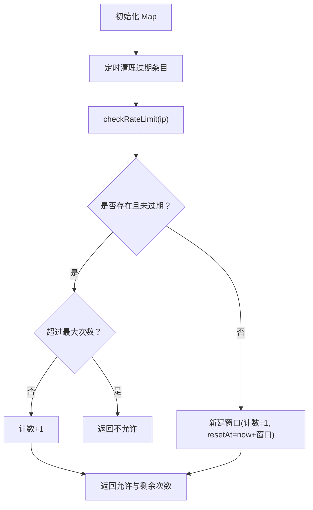
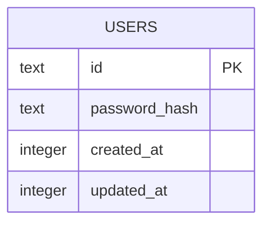
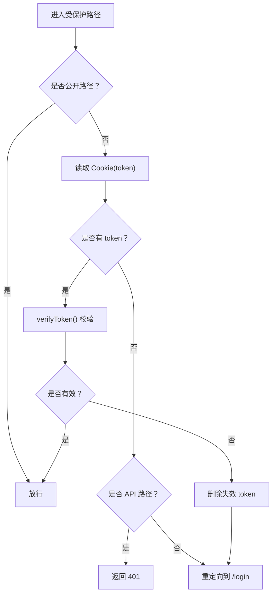
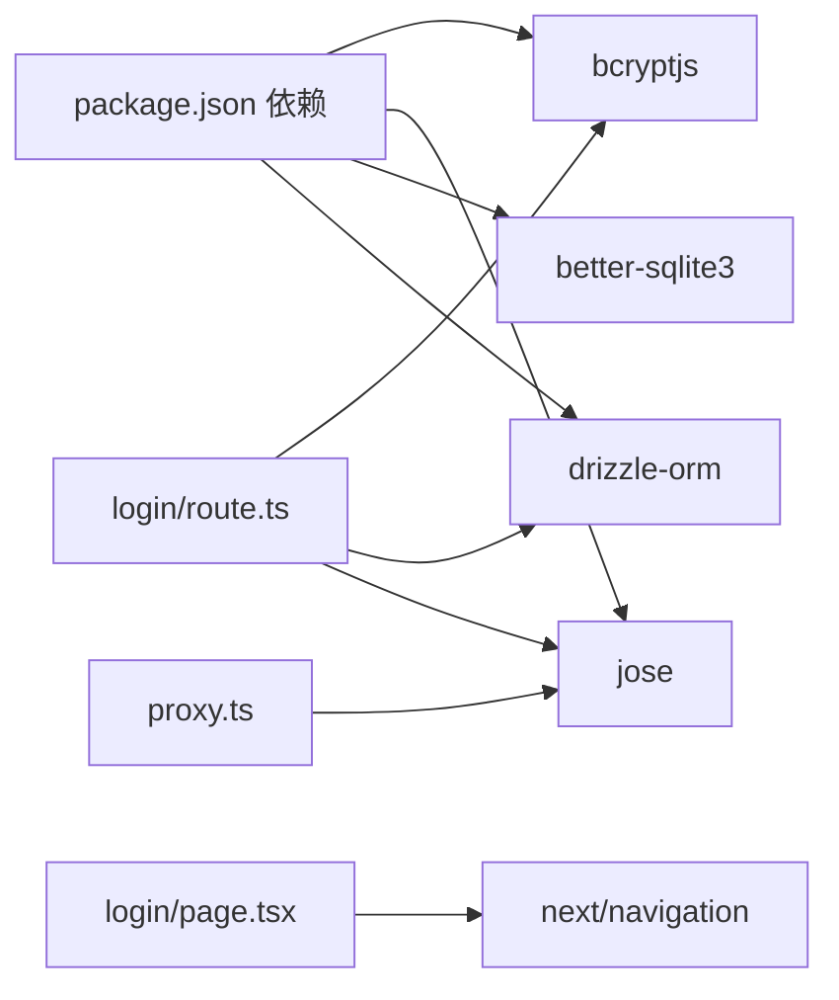

# 登录认证流程

<cite>
**本文档引用的文件**
- [src/app/api/auth/login/route.ts](file://src/app/api/auth/login/route.ts)
- [src/app/login/page.tsx](file://src/app/login/page.tsx)
- [src/lib/auth.ts](file://src/lib/auth.ts)
- [src/app/api/auth/verify/route.ts](file://src/app/api/auth/verify/route.ts)
- [src/lib/rate-limit.ts](file://src/lib/rate-limit.ts)
- [src/db/schema.ts](file://src/db/schema.ts)
- [src/db/index.ts](file://src/db/index.ts)
- [src/proxy.ts](file://src/proxy.ts)
- [package.json](file://package.json)
- [next.config.ts](file://next.config.ts)
</cite>

## 目录
1. [简介](#简介)
2. [项目结构](#项目结构)
3. [核心组件](#核心组件)
4. [架构总览](#架构总览)
5. [详细组件分析](#详细组件分析)
6. [依赖关系分析](#依赖关系分析)
7. [性能考虑](#性能考虑)
8. [故障排除指南](#故障排除指南)
9. [结论](#结论)
10. [附录](#附录)

## 简介
本文件系统性地文档化了登录认证流程，涵盖登录 API 的实现（请求处理、用户验证、令牌签发）、登录页面前端实现（表单验证、用户交互与错误处理）、完整的登录步骤说明、认证失败处理机制、登录 API 使用示例、客户端登录状态管理以及安全最佳实践与常见问题解决方案。该系统采用基于 JWT 的无状态认证，并通过速率限制保护登录接口。

## 项目结构
登录认证相关的核心文件分布如下：
- 路由层：登录 API、认证校验 API
- 前端：登录页面组件
- 认证工具：JWT 签发与校验
- 速率限制：登录尝试频率控制
- 数据库：用户表结构与初始化
- 中间件代理：统一鉴权拦截与重定向



图表来源
- [src/app/login/page.tsx:1-99](file://src/app/login/page.tsx#L1-L99)
- [src/app/api/auth/login/route.ts:1-63](file://src/app/api/auth/login/route.ts#L1-L63)
- [src/app/api/auth/verify/route.ts:1-7](file://src/app/api/auth/verify/route.ts#L1-L7)
- [src/lib/auth.ts:1-26](file://src/lib/auth.ts#L1-L26)
- [src/lib/rate-limit.ts:1-41](file://src/lib/rate-limit.ts#L1-L41)
- [src/db/index.ts:1-171](file://src/db/index.ts#L1-L171)
- [src/db/schema.ts:1-105](file://src/db/schema.ts#L1-L105)
- [src/proxy.ts:1-49](file://src/proxy.ts#L1-L49)

章节来源
- [src/app/login/page.tsx:1-99](file://src/app/login/page.tsx#L1-L99)
- [src/app/api/auth/login/route.ts:1-63](file://src/app/api/auth/login/route.ts#L1-L63)
- [src/lib/auth.ts:1-26](file://src/lib/auth.ts#L1-L26)
- [src/lib/rate-limit.ts:1-41](file://src/lib/rate-limit.ts#L1-L41)
- [src/db/schema.ts:1-105](file://src/db/schema.ts#L1-L105)
- [src/db/index.ts:1-171](file://src/db/index.ts#L1-L171)
- [src/proxy.ts:1-49](file://src/proxy.ts#L1-L49)

## 核心组件
- 登录 API：接收密钥，进行速率限制检查、数据库查询与密码比对、成功时签发 JWT 并设置 HttpOnly Cookie。
- 登录页面：负责表单输入、前端校验、调用登录 API、处理响应与错误提示。
- JWT 工具：签发与校验 JWT，支持过期时间与算法配置。
- 速率限制：基于内存 Map 的滑动窗口限流，防止暴力破解。
- 数据库：SQLite 用户表，初始化 admin 用户与密码哈希。
- 代理中间件：拦截受保护路径，校验 Cookie 中的 token，未登录或无效时重定向到登录页。

章节来源
- [src/app/api/auth/login/route.ts:9-62](file://src/app/api/auth/login/route.ts#L9-L62)
- [src/app/login/page.tsx:13-44](file://src/app/login/page.tsx#L13-L44)
- [src/lib/auth.ts:10-25](file://src/lib/auth.ts#L10-L25)
- [src/lib/rate-limit.ts:21-40](file://src/lib/rate-limit.ts#L21-L40)
- [src/db/schema.ts:3-8](file://src/db/schema.ts#L3-L8)
- [src/db/index.ts:142-157](file://src/db/index.ts#L142-L157)
- [src/proxy.ts:7-45](file://src/proxy.ts#L7-L45)

## 架构总览
登录认证的整体流程如下：
- 客户端在登录页输入密钥并提交。
- 后端路由执行速率限制检查，解析请求体，查询用户记录并比对密码哈希。
- 验证通过后签发 JWT，并通过 HttpOnly Cookie 返回。
- 客户端收到响应后跳转至应用页；后续请求由代理中间件统一校验 token。



图表来源
- [src/app/login/page.tsx:24-43](file://src/app/login/page.tsx#L24-L43)
- [src/app/api/auth/login/route.ts:9-62](file://src/app/api/auth/login/route.ts#L9-L62)
- [src/lib/rate-limit.ts:21-36](file://src/lib/rate-limit.ts#L21-L36)
- [src/db/index.ts:142-157](file://src/db/index.ts#L142-L157)
- [src/lib/auth.ts:10-16](file://src/lib/auth.ts#L10-L16)

## 详细组件分析

### 登录 API 实现（后端）
- 请求处理
  - 提取客户端 IP（优先 x-forwarded-for，其次 x-real-ip）。
  - 速率限制检查：若超过最大尝试次数，返回 429 并携带 Retry-After 与剩余次数头。
  - 解析 JSON 请求体，要求存在字符串类型的 key 字段。
- 用户验证
  - 获取数据库实例，查询固定 ID 的用户记录。
  - 使用同步哈希比较函数比对输入密钥与数据库中的密码哈希。
- 令牌生成与响应
  - 成功时重置速率限制，签发 JWT。
  - 将 token 写入 HttpOnly Cookie（生产环境启用 secure，严格 SameSite，7 天过期），返回成功响应。
- 错误处理
  - 密钥错误返回 401；请求格式错误返回 400；速率限制触发返回 429。



图表来源
- [src/app/api/auth/login/route.ts:9-62](file://src/app/api/auth/login/route.ts#L9-L62)
- [src/lib/rate-limit.ts:21-40](file://src/lib/rate-limit.ts#L21-L40)
- [src/lib/auth.ts:10-16](file://src/lib/auth.ts#L10-L16)
- [src/db/index.ts:142-157](file://src/db/index.ts#L142-L157)

章节来源
- [src/app/api/auth/login/route.ts:9-62](file://src/app/api/auth/login/route.ts#L9-L62)

### 登录页面前端实现
- 表单与状态
  - 状态包括密钥输入、错误信息、加载状态。
  - 输入框为密码类型，自动聚焦，禁用状态随加载变化。
- 表单验证与交互
  - 阻止默认提交；若密钥为空显示错误提示。
  - 发起 POST 请求到 /api/auth/login，发送 JSON {key: trim(key)}。
- 错误处理
  - 成功：跳转到 /app。
  - 429：显示“请求过于频繁”等提示。
  - 其他错误：显示“密钥错误”或“网络错误”。
- 加载态
  - 提交期间按钮禁用并显示加载动画。



图表来源
- [src/app/login/page.tsx:13-44](file://src/app/login/page.tsx#L13-L44)
- [src/app/api/auth/login/route.ts:24-43](file://src/app/api/auth/login/route.ts#L24-L43)

章节来源
- [src/app/login/page.tsx:1-99](file://src/app/login/page.tsx#L1-L99)

### JWT 签发与校验
- 签发
  - 默认主体为固定用户标识，设置签发时间与过期时间，使用 HS256 算法签名。
- 校验
  - 使用相同密钥与算法验证 token，返回有效标志与负载。

```mermaid
classDiagram
class JWT工具 {
+signToken(payload) Promise~string~
+verifyToken(token) Promise~{valid,payload?}~
}
```

图表来源
- [src/lib/auth.ts:10-25](file://src/lib/auth.ts#L10-L25)

章节来源
- [src/lib/auth.ts:1-26](file://src/lib/auth.ts#L1-L26)

### 速率限制机制
- 窗口参数：每 IP 在 15 分钟内最多 5 次尝试。
- 存储：Map 结构保存每个 IP 的计数与重置时间戳。
- 清理：定时器定期清理已过期条目。
- 接口：checkRateLimit 返回是否允许、剩余次数与重置时间；resetRateLimit 用于成功登录后清除记录。



图表来源
- [src/lib/rate-limit.ts:11-36](file://src/lib/rate-limit.ts#L11-L36)

章节来源
- [src/lib/rate-limit.ts:1-41](file://src/lib/rate-limit.ts#L1-L41)

### 数据库与用户模型
- 用户表
  - 固定主键 ID 为 admin，包含密码哈希与时间戳字段。
- 初始化
  - 若存在环境变量提供的密钥，则确保 admin 用户存在并写入哈希。
  - 使用同步哈希函数生成密码哈希，避免阻塞 IO。



图表来源
- [src/db/schema.ts:3-8](file://src/db/schema.ts#L3-L8)
- [src/db/index.ts:142-157](file://src/db/index.ts#L142-L157)

章节来源
- [src/db/schema.ts:1-105](file://src/db/schema.ts#L1-L105)
- [src/db/index.ts:142-157](file://src/db/index.ts#L142-L157)

### 代理中间件与会话保持
- 匹配规则：对 /app/* 与 /api/* 进行拦截。
- 放行路径：登录页与登录 API 可直接访问。
- 校验逻辑：
  - 从 Cookie 读取 token。
  - 若缺失：对 API 请求返回 401，否则重定向到登录页。
  - 校验失败：同样处理并删除失效 token。
  - 校验成功：放行请求。
- 会话保持：通过 HttpOnly Cookie 自动携带 token，无需手动管理。



图表来源
- [src/proxy.ts:7-45](file://src/proxy.ts#L7-L45)

章节来源
- [src/proxy.ts:1-49](file://src/proxy.ts#L1-L49)

## 依赖关系分析
- 外部依赖
  - bcryptjs：密码哈希与比对。
  - jose：JWT 签发与校验。
  - better-sqlite3、drizzle-orm：SQLite 访问与 ORM。
  - lucide-react：UI 图标。
- Next.js 配置
  - serverExternalPackages 列出外部原生模块，确保构建兼容。
- 关键导入关系
  - 登录路由依赖速率限制、数据库、JWT 工具。
  - 代理中间件依赖 JWT 工具与公共路径白名单。
  - 登录页面依赖 Next 导航与 fetch。



图表来源
- [package.json:57-99](file://package.json#L57-L99)
- [src/app/api/auth/login/route.ts:2-6](file://src/app/api/auth/login/route.ts#L2-L6)
- [src/proxy.ts](file://src/proxy.ts#L3)
- [src/app/login/page.tsx](file://src/app/login/page.tsx#L4)

章节来源
- [package.json:1-119](file://package.json#L1-L119)
- [next.config.ts:4-13](file://next.config.ts#L4-L13)

## 性能考虑
- 速率限制
  - 基于内存 Map，时间复杂度 O(1)，适合单实例部署；如需多实例扩展，建议迁移到 Redis。
- 数据库
  - 使用 WAL 模式与外键约束，保证一致性；查询固定 ID 的用户，索引命中良好。
- JWT
  - HS256 为对称算法，计算开销低；注意密钥长度与轮换策略。
- 前端
  - 表单防抖与加载态优化用户体验；避免重复提交。

## 故障排除指南
- 常见错误与处理
  - 400 请求格式错误：检查请求体是否为合法 JSON，包含字符串类型的 key。
  - 401 密钥错误：确认密钥与数据库中哈希一致；查看剩余尝试次数。
  - 429 请求过于频繁：等待重置时间或降低重试频率。
  - 401 未授权：检查 Cookie 是否被正确设置与携带；确认 token 未过期。
- 重试策略
  - 客户端应在 429 时根据 Retry-After 头等待；其他错误可提示用户重试但不盲目快速重试。
- 本地存储与会话
  - 服务端通过 HttpOnly Cookie 管理 token，无需前端本地存储；如需持久化登录，建议改为服务端会话或刷新令牌机制。
- 环境变量
  - 确保 JWT_SECRET 与 AUTH_SECRET_KEY 正确配置；生产环境务必更换默认值。

章节来源
- [src/app/api/auth/login/route.ts:14-25](file://src/app/api/auth/login/route.ts#L14-L25)
- [src/app/api/auth/login/route.ts:38-42](file://src/app/api/auth/login/route.ts#L38-L42)
- [src/app/login/page.tsx:34-40](file://src/app/login/page.tsx#L34-L40)
- [src/proxy.ts:24-42](file://src/proxy.ts#L24-L42)

## 结论
该登录认证系统以简洁的固定用户模型与 JWT 为核心，结合速率限制与代理中间件实现了基础的安全与可用性。前端提供直观的登录体验与错误反馈，后端通过严格的请求校验与安全的 Cookie 管理保障会话安全。建议在生产环境中进一步强化密钥轮换、多实例共享缓存与更细粒度的审计日志。

## 附录

### 登录 API 使用示例
- 请求
  - 方法：POST
  - 路径：/api/auth/login
  - 头部：Content-Type: application/json
  - 请求体：{ "key": "你的访问密钥" }
- 成功响应
  - 状态码：200
  - 响应体：{ "success": true }
  - 响应头：Set-Cookie: token=...; HttpOnly; Secure; SameSite=Strict; Max-Age=604800; Path=/
- 错误响应
  - 400：请求格式错误
  - 401：密钥错误
  - 429：请求过于频繁（包含 Retry-After 与 X-RateLimit-Remaining）

章节来源
- [src/app/api/auth/login/route.ts:24-61](file://src/app/api/auth/login/route.ts#L24-L61)

### 登录流程步骤详解
- 用户输入
  - 在登录页输入密钥并提交。
- 服务器验证
  - 速率限制检查 → 解析请求体 → 查询用户 → 比对密码哈希。
- 令牌签发
  - 成功后签发 JWT 并设置 HttpOnly Cookie。
- 响应返回
  - 返回成功响应并重定向到应用页；后续请求由代理中间件统一校验。

章节来源
- [src/app/login/page.tsx:13-44](file://src/app/login/page.tsx#L13-L44)
- [src/app/api/auth/login/route.ts:9-62](file://src/app/api/auth/login/route.ts#L9-L62)
- [src/proxy.ts:7-45](file://src/proxy.ts#L7-L45)

### 登录状态客户端管理
- 管理方式
  - 通过 HttpOnly Cookie 自动携带 token，无需前端本地存储。
- 会话保持
  - Cookie 设为 HttpOnly、Secure（生产环境）、SameSite=Strict、7 天过期。
- 退出与失效处理
  - 校验失败时删除失效 token 并重定向到登录页。

章节来源
- [src/app/api/auth/login/route.ts:49-56](file://src/app/api/auth/login/route.ts#L49-L56)
- [src/proxy.ts:33-42](file://src/proxy.ts#L33-L42)

### 安全最佳实践
- 强制 HTTPS 与 HttpOnly Cookie
  - 生产环境启用 secure 属性，配合 HSTS。
- 密钥轮换与随机性
  - 使用强随机源生成密钥，定期轮换 JWT_SECRET。
- 速率限制与防护
  - 单实例使用内存 Map；多实例迁移至 Redis；结合 IP 与 UA 维度限制。
- 日志与监控
  - 记录登录尝试、失败原因与 IP；对异常行为触发告警。
- 最小权限原则
  - 当前系统固定用户 admin，生产中建议引入多用户与角色体系。