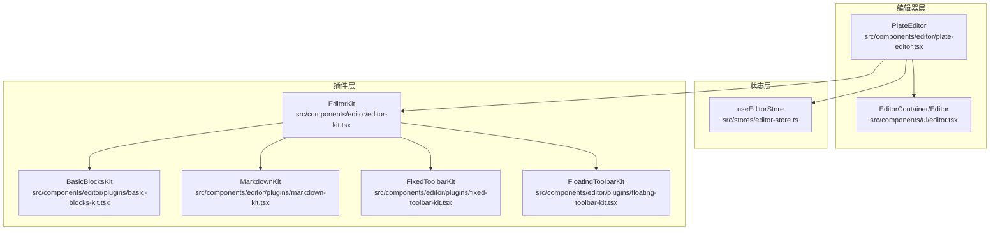
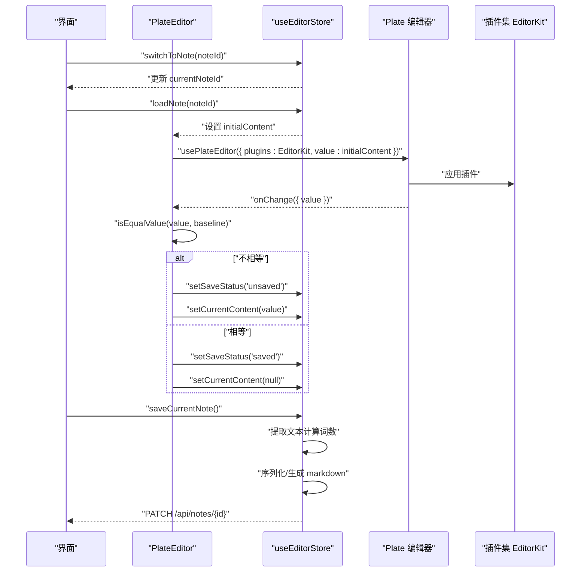
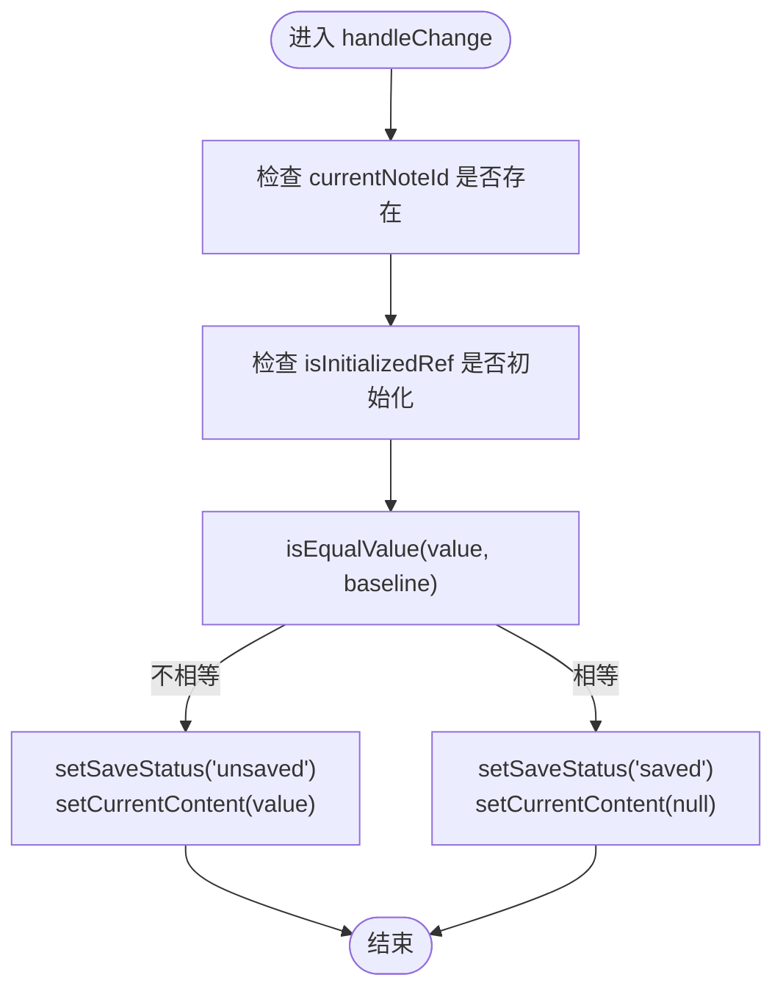
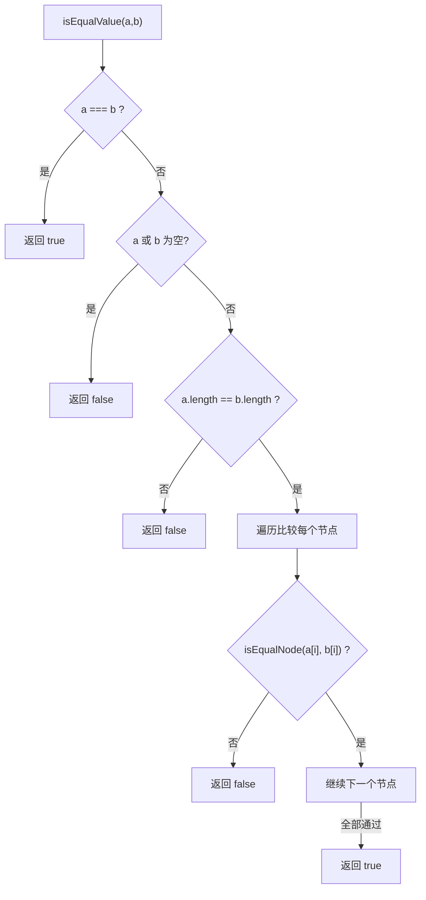
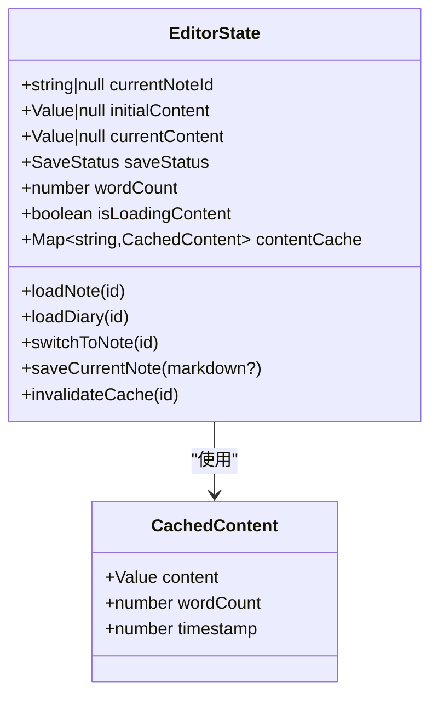
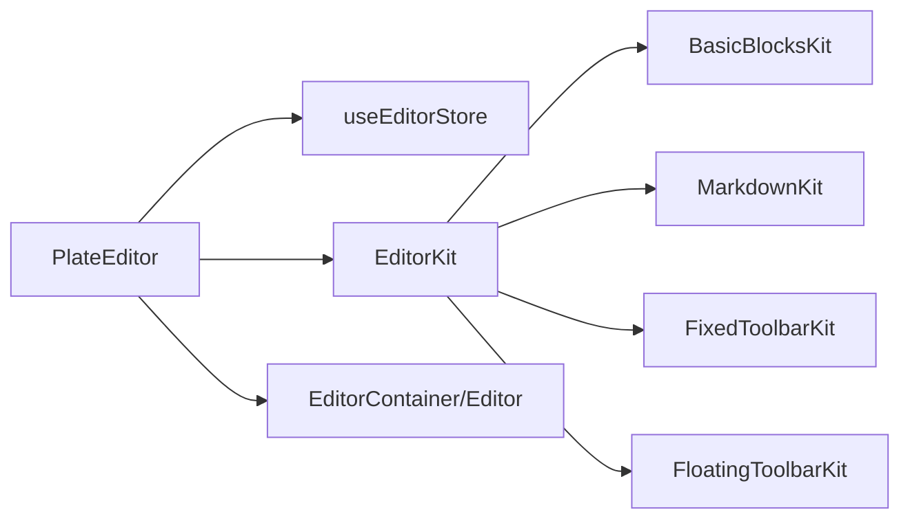

# Plate 编辑器核心

<cite>
**本文引用的文件**
- [plate-editor.tsx](file://src/components/editor/plate-editor.tsx)
- [editor-store.ts](file://src/stores/editor-store.ts)
- [editor-kit.tsx](file://src/components/editor/editor-kit.tsx)
- [plate-types.ts](file://src/components/editor/plate-types.ts)
- [editor.tsx](file://src/components/ui/editor.tsx)
- [basic-blocks-kit.tsx](file://src/components/editor/plugins/basic-blocks-kit.tsx)
- [markdown-kit.tsx](file://src/components/editor/plugins/markdown-kit.tsx)
- [fixed-toolbar-kit.tsx](file://src/components/editor/plugins/fixed-toolbar-kit.tsx)
- [floating-toolbar-kit.tsx](file://src/components/editor/plugins/floating-toolbar-kit.tsx)
- [index.ts](file://src/types/index.ts)
- [note-item.tsx](file://src/components/file-tree/note-item.tsx)
</cite>

## 目录
1. [简介](#简介)
2. [项目结构](#项目结构)
3. [核心组件](#核心组件)
4. [架构总览](#架构总览)
5. [组件详细分析](#组件详细分析)
6. [依赖关系分析](#依赖关系分析)
7. [性能考量](#性能考量)
8. [故障排查指南](#故障排查指南)
9. [结论](#结论)
10. [附录](#附录)

## 简介
本文件系统性地文档化 Plate 编辑器核心组件，聚焦以下主题：
- PlateEditor 组件的架构设计与实现原理
- 编辑器初始化流程、值比较算法与状态管理
- 生命周期管理与内容变更检测
- 快速值比较函数的实现与性能优化策略
- 编辑器重置逻辑与跨笔记切换处理
- 编辑器容器组件与加载状态处理
- 编辑器配置选项与自定义方法
- 实际使用示例与性能调优建议

## 项目结构
围绕编辑器的核心文件组织如下：
- 编辑器容器与生命周期：src/components/editor/plate-editor.tsx
- 全局状态与缓存：src/stores/editor-store.ts
- 插件集合与编辑器类型：src/components/editor/editor-kit.tsx、src/components/editor/plate-types.ts
- UI 容器与视图：src/components/ui/editor.tsx
- 功能插件示例：src/components/editor/plugins/basic-blocks-kit.tsx、markdown-kit.tsx、fixed-toolbar-kit.tsx、floating-toolbar-kit.tsx
- 类型定义：src/types/index.ts
- 跨笔记切换与保存确认：src/components/file-tree/note-item.tsx

图表来源
- [plate-editor.tsx:63-175](file://src/components/editor/plate-editor.tsx#L63-L175)
- [editor.tsx:36-131](file://src/components/ui/editor.tsx#L36-L131)
- [editor-store.ts:88-281](file://src/stores/editor-store.ts#L88-L281)
- [editor-kit.tsx:36-83](file://src/components/editor/editor-kit.tsx#L36-L83)
- [basic-blocks-kit.tsx:27-89](file://src/components/editor/plugins/basic-blocks-kit.tsx#L27-L89)
- [markdown-kit.tsx:5-12](file://src/components/editor/plugins/markdown-kit.tsx#L5-L12)
- [fixed-toolbar-kit.tsx:8-20](file://src/components/editor/plugins/fixed-toolbar-kit.tsx#L8-L20)
- [floating-toolbar-kit.tsx:8-20](file://src/components/editor/plugins/floating-toolbar-kit.tsx#L8-L20)

章节来源
- [plate-editor.tsx:1-175](file://src/components/editor/plate-editor.tsx#L1-L175)
- [editor-store.ts:1-281](file://src/stores/editor-store.ts#L1-L281)
- [editor-kit.tsx:1-83](file://src/components/editor/editor-kit.tsx#L1-L83)
- [plate-types.ts:1-164](file://src/components/editor/plate-types.ts#L1-L164)
- [editor.tsx:1-131](file://src/components/ui/editor.tsx#L1-L131)

## 核心组件
- PlateEditor：负责编辑器实例创建、内容变更检测、跨笔记重置、基线值维护与加载态展示。
- useEditorStore：Zustand 状态存储，管理当前笔记、初始内容、当前编辑内容、保存状态、词数、加载状态与 LRU 内容缓存，并提供加载、保存、缓存失效等方法。
- EditorKit：聚合所有编辑器插件（元素、样式、编辑、解析、UI 等），作为 Plate 的插件入口。
- Editor/EditorContainer：基于 Plate 的容器与内容视图封装，支持多种变体与禁用/聚焦状态。

章节来源
- [plate-editor.tsx:63-175](file://src/components/editor/plate-editor.tsx#L63-L175)
- [editor-store.ts:88-281](file://src/stores/editor-store.ts#L88-L281)
- [editor-kit.tsx:36-83](file://src/components/editor/editor-kit.tsx#L36-L83)
- [editor.tsx:36-131](file://src/components/ui/editor.tsx#L36-L131)

## 架构总览
PlateEditor 通过 usePlateEditor 初始化编辑器，注入 EditorKit 插件集；通过 useEditorStore 提供的 initialContent 设置初始值；通过 handleChange 检测变更并更新保存状态与当前编辑内容；在笔记切换时重置编辑器状态并清理历史记录，确保跨笔记隔离。

图表来源
- [plate-editor.tsx:79-153](file://src/components/editor/plate-editor.tsx#L79-L153)
- [editor-store.ts:204-275](file://src/stores/editor-store.ts#L204-L275)
- [editor-kit.tsx:36-83](file://src/components/editor/editor-kit.tsx#L36-L83)

## 组件详细分析

### PlateEditor 组件
- 初始化与插件装配
  - 使用 usePlateEditor 创建编辑器实例，传入 EditorKit 与 initialContent。
  - 通过 EditorContainer 与 Editor 包裹 Plate，渲染可交互编辑区域。
- 值比较与变更检测
  - 自定义快速比较函数 isEqualValue 与 isEqualNode，避免 JSON.stringify 的高成本开销，按节点结构递归比较，优先短路判断。
  - 在 handleChange 中，仅当值与 baselineContentRef.current 不相等时标记为未保存并写入当前编辑内容，否则标记为已保存且清空当前编辑内容。
- 生命周期与重置逻辑
  - 监听 currentNoteId 变化，若变化则重置 isInitializedRef 并执行重置流程：
    - 将编辑器值设为 initialContent；
    - 清空撤销/重做历史；
    - 清空选区；
    - 更新 baselineContentRef；
    - 滚动到顶部；
    - 使用 requestAnimationFrame 标记初始化完成。
  - 保存成功后，将 baselineContentRef 更新为当前编辑器 children，确保后续比较以最新保存版本为准。
- 加载态与占位提示
  - 无笔记选择时显示提示文案；
  - isLoadingContent 为真时显示旋转加载图标覆盖层。

图表来源
- [plate-editor.tsx:84-99](file://src/components/editor/plate-editor.tsx#L84-L99)

章节来源
- [plate-editor.tsx:63-175](file://src/components/editor/plate-editor.tsx#L63-L175)

### 快速值比较算法
- 设计目标
  - 避免 JSON.stringify 的高复杂度与内存分配，直接结构化比较。
- 实现要点
  - isEqualValue：先进行引用相等、空值、长度等快速路径判断，再逐节点比较。
  - isEqualNode：对对象类型进行字段与子节点递归比较，支持文本节点、块级节点与列表节点等。
- 复杂度
  - 时间复杂度近似 O(N)，N 为节点总数；空间复杂度 O(D)，D 为最大嵌套深度（递归栈）。
- 性能收益
  - 显著降低频繁变更检测的 CPU 占用，提升交互流畅度。

图表来源
- [plate-editor.tsx:16-61](file://src/components/editor/plate-editor.tsx#L16-L61)

章节来源
- [plate-editor.tsx:16-61](file://src/components/editor/plate-editor.tsx#L16-L61)

### 状态管理机制（useEditorStore）
- 关键状态
  - currentNoteId：当前编辑的条目 ID（笔记或日记）
  - initialContent：从后端加载的初始内容
  - currentContent：用户正在编辑但尚未保存的内容
  - saveStatus：保存状态（saved/saving/unsaved/error）
  - wordCount：词数
  - isLoadingContent：内容加载中
  - contentCache：LRU 内容缓存（Map），支持淘汰最久未使用项
- 核心方法
  - loadNote/loadDiary：从 API 获取内容，解析为 Value，写入缓存并更新 initialContent
  - switchToNote：切换当前笔记（仅更新 currentNoteId）
  - saveCurrentNote：序列化内容，提取文本计算词数，调用 PATCH 接口保存，更新缓存与状态
  - invalidateCache：按需失效缓存
- 缓存策略
  - 最大容量固定，采用时间戳驱动的 LRU 淘汰

图表来源
- [editor-store.ts:15-64](file://src/stores/editor-store.ts#L15-L64)
- [editor-store.ts:88-281](file://src/stores/editor-store.ts#L88-L281)

章节来源
- [editor-store.ts:88-281](file://src/stores/editor-store.ts#L88-L281)
- [index.ts:33-33](file://src/types/index.ts#L33-L33)

### 编辑器容器与加载状态
- EditorContainer/Editor
  - EditorContainer 提供容器样式与变体控制，Editor 作为 PlateContent 的封装，支持多种变体（如 default、demo、comment 等）与禁用/聚焦状态。
  - 通过 disableDefaultStyles 与 className 组合，实现主题化与交互态控制。
- 加载态覆盖层
  - PlateEditor 在 isLoadingContent 为真时，使用绝对定位覆盖层显示旋转图标，避免闪烁与误操作。

章节来源
- [editor.tsx:36-131](file://src/components/ui/editor.tsx#L36-L131)
- [plate-editor.tsx:155-173](file://src/components/editor/plate-editor.tsx#L155-L173)

### 插件体系与配置
- EditorKit
  - 聚合基础块、代码块、表格、切换、目录、媒体、标注、列布局、数学公式、日期、链接、提及、样式、字体、列表、对齐、行高、自动格式化、光标覆盖、块菜单、拖拽、表情、退出断行、尾随块、Markdown 解析、占位符与工具栏等插件。
- 基础插件示例
  - BasicBlocksKit：段落、标题 H1-H6、引用块、水平分割线等节点与快捷键配置。
  - MarkdownKit：启用 remark-math、remark-gfm、remark-mdx、remark-mention 等插件。
  - FixedToolbarKit/FloatingToolbarKit：在可编辑区域前后渲染固定/浮动工具栏。

章节来源
- [editor-kit.tsx:36-83](file://src/components/editor/editor-kit.tsx#L36-L83)
- [basic-blocks-kit.tsx:27-89](file://src/components/editor/plugins/basic-blocks-kit.tsx#L27-L89)
- [markdown-kit.tsx:5-12](file://src/components/editor/plugins/markdown-kit.tsx#L5-L12)
- [fixed-toolbar-kit.tsx:8-20](file://src/components/editor/plugins/fixed-toolbar-kit.tsx#L8-L20)
- [floating-toolbar-kit.tsx:8-20](file://src/components/editor/plugins/floating-toolbar-kit.tsx#L8-L20)

### 跨笔记切换与保存确认
- 切换流程
  - 点击笔记项时，若当前为未保存状态，弹出保存确认对话框；确认保存后更新选中笔记、加载内容并切换至该笔记。
- 保存确认对话框
  - 支持“保存”“不保存”“取消”，分别触发保存并切换、直接切换与取消操作。
- 删除与缓存失效
  - 删除笔记时，调用 invalidateCache 清理对应缓存并重置当前笔记 ID。

章节来源
- [note-item.tsx:52-82](file://src/components/file-tree/note-item.tsx#L52-L82)
- [note-item.tsx:200-206](file://src/components/file-tree/note-item.tsx#L200-L206)
- [editor-store.ts:277-279](file://src/stores/editor-store.ts#L277-L279)

## 依赖关系分析
- 组件耦合
  - PlateEditor 依赖 useEditorStore 进行状态读取与更新，依赖 EditorKit 提供插件能力，依赖 Editor/EditorContainer 渲染 UI。
- 插件依赖
  - EditorKit 聚合多个功能插件，形成统一入口；各插件内部依赖 PlateJS 与 UI 组件。
- 外部依赖
  - 使用 PlateJS 作为核心编辑引擎，Zustand 管理全局状态，React Hooks 管理生命周期与引用。

图表来源
- [plate-editor.tsx:63-175](file://src/components/editor/plate-editor.tsx#L63-L175)
- [editor-kit.tsx:36-83](file://src/components/editor/editor-kit.tsx#L36-L83)
- [editor.tsx:36-131](file://src/components/ui/editor.tsx#L36-L131)

章节来源
- [plate-editor.tsx:63-175](file://src/components/editor/plate-editor.tsx#L63-L175)
- [editor-kit.tsx:36-83](file://src/components/editor/editor-kit.tsx#L36-L83)

## 性能考量
- 快速值比较
  - 使用结构化递归比较替代 JSON.stringify，显著降低 CPU 与内存压力，适合高频变更场景。
- 初始化与重置
  - 使用 requestAnimationFrame 标记初始化完成，避免阻塞主线程；重置时清空历史与选区，防止跨笔记状态污染。
- 缓存策略
  - LRU 缓存限制最大容量，按时间戳淘汰最旧项，减少重复网络请求与解析开销。
- 序列化与词数统计
  - 保存前递归提取文本计算词数，避免额外数据库字段；Markdown 序列化由编辑器插件提供，必要时才触发。
- UI 渲染
  - EditorContainer/Editor 支持变体与禁用状态，减少不必要的样式计算；加载态覆盖层仅在需要时显示。

[本节为通用性能建议，无需特定文件引用]

## 故障排查指南
- 未保存状态异常
  - 检查 handleChange 是否被调用、baselineContentRef 是否正确更新、isInitializedRef 是否在重置后被标记为初始化完成。
- 跨笔记切换错乱
  - 确认笔记切换流程中是否调用了重置逻辑（清空历史、选区、滚动到顶部），以及是否正确设置了新的 initialContent。
- 保存失败
  - 查看 saveCurrentNote 的错误分支，确认接口返回状态码与错误日志；检查 markdown 序列化回调是否可用。
- 缓存未生效
  - 确认 loadNote/loadDiary 是否写入缓存并更新 initialContent；检查 invalidateCache 是否按预期移除缓存。
- 加载态不消失
  - 确认 isLoadingContent 在加载前后正确设置为 true/false；检查网络请求与错误处理分支。

章节来源
- [plate-editor.tsx:84-153](file://src/components/editor/plate-editor.tsx#L84-L153)
- [editor-store.ts:114-155](file://src/stores/editor-store.ts#L114-L155)
- [editor-store.ts:157-198](file://src/stores/editor-store.ts#L157-L198)
- [editor-store.ts:204-275](file://src/stores/editor-store.ts#L204-L275)

## 结论
PlateEditor 通过结构化比较、插件化扩展与状态集中管理，实现了高性能、可扩展的富文本编辑体验。其初始化与重置流程确保了跨笔记切换的稳定性，LRU 缓存与序列化策略兼顾了性能与一致性。配合工具栏与基础块插件，满足多场景写作需求。

[本节为总结性内容，无需特定文件引用]

## 附录

### 编辑器配置选项与自定义方法
- 配置选项
  - 初始内容：通过 initialContent 注入
  - 插件集：EditorKit 聚合所有功能插件
  - 工具栏：FixedToolbarKit/FloatingToolbarKit 提供固定/浮动工具栏
  - Markdown 解析：MarkdownKit 配置 remark 插件
- 自定义方法
  - setMarkdownSerializer：由 PlateEditor 注册 Markdown 序列化回调
  - loadNote/loadDiary：异步加载内容并写入缓存
  - saveCurrentNote：保存当前编辑内容并更新缓存
  - invalidateCache：按需失效缓存

章节来源
- [plate-editor.tsx:79-153](file://src/components/editor/plate-editor.tsx#L79-L153)
- [editor-kit.tsx:36-83](file://src/components/editor/editor-kit.tsx#L36-L83)
- [markdown-kit.tsx:5-12](file://src/components/editor/plugins/markdown-kit.tsx#L5-L12)
- [fixed-toolbar-kit.tsx:8-20](file://src/components/editor/plugins/fixed-toolbar-kit.tsx#L8-L20)
- [floating-toolbar-kit.tsx:8-20](file://src/components/editor/plugins/floating-toolbar-kit.tsx#L8-L20)
- [editor-store.ts:51-64](file://src/stores/editor-store.ts#L51-L64)

### 实际使用示例（步骤说明）
- 打开笔记
  - 点击文件树中的笔记项，触发保存确认（如有未保存内容），随后加载内容并切换至该笔记。
- 编辑与保存
  - 编辑器检测到内容变化后，自动标记为未保存；点击保存按钮触发保存流程，更新缓存与状态。
- 切换笔记
  - 切换时自动清理历史与选区，避免跨笔记状态污染；滚动到顶部提升体验。

章节来源
- [note-item.tsx:52-82](file://src/components/file-tree/note-item.tsx#L52-L82)
- [plate-editor.tsx:101-136](file://src/components/editor/plate-editor.tsx#L101-L136)
- [editor-store.ts:204-275](file://src/stores/editor-store.ts#L204-L275)