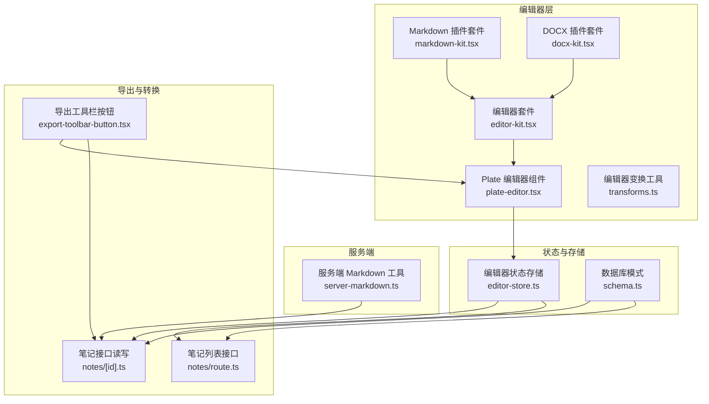
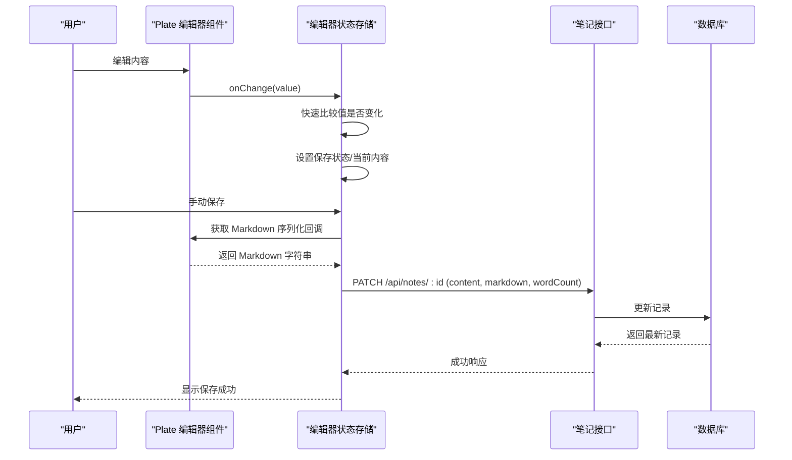
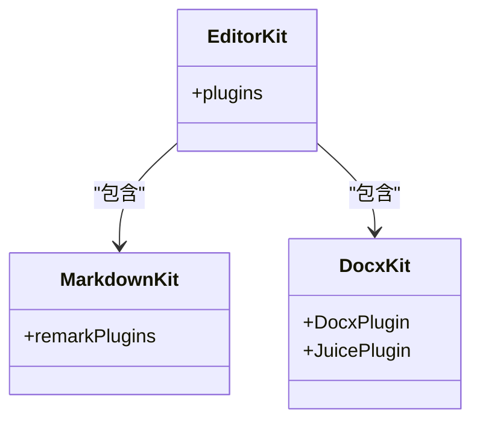
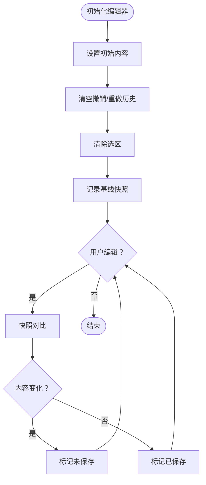
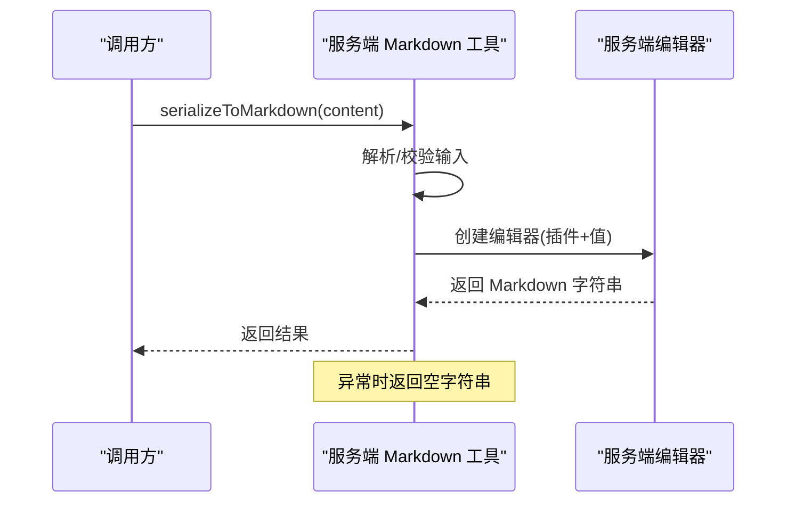
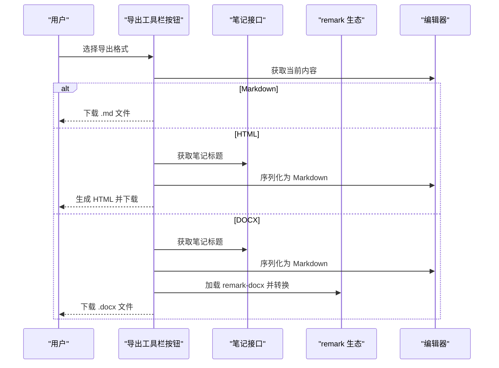
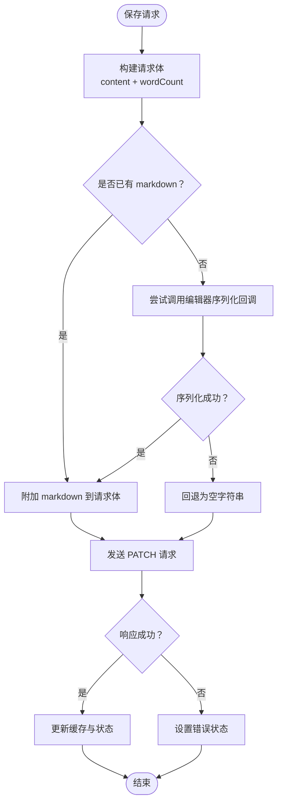
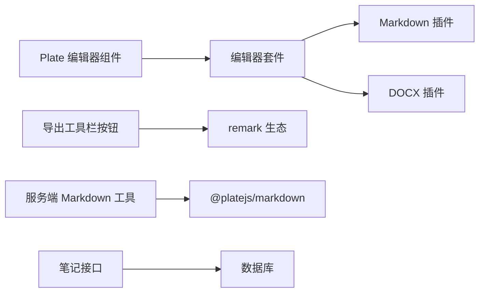

# 内容序列化与转换

<cite>
**本文引用的文件**
- [src/lib/server-markdown.ts](file://src/lib/server-markdown.ts)
- [src/components/editor/plugins/markdown-kit.tsx](file://src/components/editor/plugins/markdown-kit.tsx)
- [src/components/editor/plugins/docx-kit.tsx](file://src/components/editor/plugins/docx-kit.tsx)
- [src/components/editor/editor-kit.tsx](file://src/components/editor/editor-kit.tsx)
- [src/components/editor/editor-base-kit.tsx](file://src/components/editor/editor-base-kit.tsx)
- [src/components/editor/plate-editor.tsx](file://src/components/editor/plate-editor.tsx)
- [src/components/editor/transforms.ts](file://src/components/editor/transforms.ts)
- [src/stores/editor-store.ts](file://src/stores/editor-store.ts)
- [src/components/ui/export-toolbar-button.tsx](file://src/components/ui/export-toolbar-button.tsx)
- [src/app/api/notes/[id]/route.ts](file://src/app/api/notes/[id]/route.ts)
- [src/app/api/notes/route.ts](file://src/app/api/notes/route.ts)
- [src/db/schema.ts](file://src/db/schema.ts)
</cite>

## 目录
1. [简介](#简介)
2. [项目结构](#项目结构)
3. [核心组件](#核心组件)
4. [架构总览](#架构总览)
5. [详细组件分析](#详细组件分析)
6. [依赖关系分析](#依赖关系分析)
7. [性能考量](#性能考量)
8. [故障排查指南](#故障排查指南)
9. [结论](#结论)
10. [附录](#附录)

## 简介
本文件系统性阐述 ynote-v2 的“内容序列化与转换”能力，覆盖以下主题：
- 编辑器内容的序列化机制与数据格式（Plate JSON）
- Markdown 转换的实现原理与双向支持
- 格式兼容性（Markdown、HTML、DOCX）与导出流程
- 序列化性能优化策略与批量处理机制
- 错误处理与回退机制
- 自定义转换规则与扩展方法
- 实际使用示例与最佳实践
- 内容版本管理与迁移策略

## 项目结构
围绕内容序列化与转换的关键目录与文件如下：
- 编辑器内核与插件：编辑器配置、Markdown/DOCX 插件、编辑器实例
- 存储与状态：编辑器状态管理、缓存与持久化
- 服务端工具：服务端 Markdown 序列化
- 导出与转换：导出按钮组件、Markdown/HTML/DOCX 转换逻辑
- 数据模型：数据库表结构（含 content/markdown 字段）

图表来源
- [src/components/editor/editor-kit.tsx:36-78](file://src/components/editor/editor-kit.tsx#L36-L78)
- [src/components/editor/plugins/markdown-kit.tsx:5-11](file://src/components/editor/plugins/markdown-kit.tsx#L5-L11)
- [src/components/editor/plugins/docx-kit.tsx:1-6](file://src/components/editor/plugins/docx-kit.tsx#L1-L6)
- [src/components/editor/plate-editor.tsx:63-174](file://src/components/editor/plate-editor.tsx#L63-L174)
- [src/stores/editor-store.ts:88-280](file://src/stores/editor-store.ts#L88-L280)
- [src/lib/server-markdown.ts:85-137](file://src/lib/server-markdown.ts#L85-L137)
- [src/components/ui/export-toolbar-button.tsx:36-284](file://src/components/ui/export-toolbar-button.tsx#L36-L284)
- [src/app/api/notes/[id]/route.ts:9-103](file://src/app/api/notes/[id]/route.ts#L9-L103)
- [src/app/api/notes/route.ts:10-85](file://src/app/api/notes/route.ts#L10-L85)
- [src/db/schema.ts:27-39](file://src/db/schema.ts#L27-L39)

章节来源
- [src/components/editor/editor-kit.tsx:1-83](file://src/components/editor/editor-kit.tsx#L1-L83)
- [src/components/editor/plugins/markdown-kit.tsx:1-12](file://src/components/editor/plugins/markdown-kit.tsx#L1-L12)
- [src/components/editor/plugins/docx-kit.tsx:1-7](file://src/components/editor/plugins/docx-kit.tsx#L1-L7)
- [src/components/editor/plate-editor.tsx:1-175](file://src/components/editor/plate-editor.tsx#L1-L175)
- [src/stores/editor-store.ts:1-281](file://src/stores/editor-store.ts#L1-L281)
- [src/lib/server-markdown.ts:1-138](file://src/lib/server-markdown.ts#L1-L138)
- [src/components/ui/export-toolbar-button.tsx:1-285](file://src/components/ui/export-toolbar-button.tsx#L1-L285)
- [src/app/api/notes/[id]/route.ts:1-104](file://src/app/api/notes/[id]/route.ts#L1-L104)
- [src/app/api/notes/route.ts:1-86](file://src/app/api/notes/route.ts#L1-L86)
- [src/db/schema.ts:1-105](file://src/db/schema.ts#L1-L105)

## 核心组件
- 编辑器内核与插件
  - 编辑器套件整合基础块、列表、链接、数学公式、表格、媒体、目录等插件，并启用 Markdown/DOCX 解析器。
  - Markdown 插件套件配置 remark 插件链（数学、GFM、MDX、提及）。
  - DOCX 插件套件启用 DOCX 导入与样式处理。
- 编辑器实例与变更检测
  - Plate 编辑器组件负责渲染、变更监听与快照对比，避免不必要的序列化。
  - 变换工具提供块/内联元素插入与类型切换。
- 状态与缓存
  - 编辑器状态存储负责加载/保存内容、维护 LRU 缓存、计算字数、设置 Markdown 序列化回调。
- 服务端 Markdown 序列化
  - 提供服务端专用的 Markdown 序列化函数，支持字符串或数组节点输入。
- 导出与转换
  - 导出工具栏按钮支持导出为 Markdown、HTML、Word（DOCX），内部通过编辑器 API 或 remark 生态完成转换。

章节来源
- [src/components/editor/editor-kit.tsx:36-78](file://src/components/editor/editor-kit.tsx#L36-L78)
- [src/components/editor/plugins/markdown-kit.tsx:5-11](file://src/components/editor/plugins/markdown-kit.tsx#L5-L11)
- [src/components/editor/plugins/docx-kit.tsx:1-6](file://src/components/editor/plugins/docx-kit.tsx#L1-L6)
- [src/components/editor/plate-editor.tsx:63-174](file://src/components/editor/plate-editor.tsx#L63-L174)
- [src/components/editor/transforms.ts:29-208](file://src/components/editor/transforms.ts#L29-L208)
- [src/stores/editor-store.ts:88-280](file://src/stores/editor-store.ts#L88-L280)
- [src/lib/server-markdown.ts:85-137](file://src/lib/server-markdown.ts#L85-L137)
- [src/components/ui/export-toolbar-button.tsx:36-284](file://src/components/ui/export-toolbar-button.tsx#L36-L284)

## 架构总览
内容在客户端以 Plate JSON 表达，编辑器变更时触发序列化生成 Markdown；保存时同时持久化 JSON 与 Markdown；导出时可直接从编辑器 API 获取 Markdown，或通过 remark 生态转换为 HTML/DOCX。

图表来源
- [src/components/editor/plate-editor.tsx:84-99](file://src/components/editor/plate-editor.tsx#L84-L99)
- [src/stores/editor-store.ts:204-275](file://src/stores/editor-store.ts#L204-L275)
- [src/app/api/notes/[id]/route.ts:29-81](file://src/app/api/notes/[id]/route.ts#L29-L81)
- [src/db/schema.ts:27-39](file://src/db/schema.ts#L27-L39)

## 详细组件分析

### 组件 A：编辑器内核与插件
- 编辑器套件整合多种块级/内联/解析器插件，确保编辑体验与序列化一致性。
- Markdown 插件套件启用 remark 数学、GFM、MDX、提及等插件，保证序列化结果符合标准。
- DOCX 插件套件用于导入 DOCX 并进行样式处理。

图表来源
- [src/components/editor/editor-kit.tsx:36-78](file://src/components/editor/editor-kit.tsx#L36-L78)
- [src/components/editor/plugins/markdown-kit.tsx:5-11](file://src/components/editor/plugins/markdown-kit.tsx#L5-L11)
- [src/components/editor/plugins/docx-kit.tsx:1-6](file://src/components/editor/plugins/docx-kit.tsx#L1-L6)

章节来源
- [src/components/editor/editor-kit.tsx:1-83](file://src/components/editor/editor-kit.tsx#L1-L83)
- [src/components/editor/plugins/markdown-kit.tsx:1-12](file://src/components/editor/plugins/markdown-kit.tsx#L1-L12)
- [src/components/editor/plugins/docx-kit.tsx:1-7](file://src/components/editor/plugins/docx-kit.tsx#L1-L7)

### 组件 B：编辑器实例与变更检测
- 使用快照对比算法快速判断内容是否变化，避免重复序列化与保存。
- 初始化后清理历史与选区，防止跨笔记状态污染。
- 注册 Markdown 序列化回调，供保存流程使用。

图表来源
- [src/components/editor/plate-editor.tsx:102-144](file://src/components/editor/plate-editor.tsx#L102-L144)
- [src/components/editor/plate-editor.tsx:146-153](file://src/components/editor/plate-editor.tsx#L146-L153)

章节来源
- [src/components/editor/plate-editor.tsx:63-174](file://src/components/editor/plate-editor.tsx#L63-L174)

### 组件 C：服务端 Markdown 序列化
- 在服务端创建无 UI 的编辑器，基于基础节点插件与 Markdown 插件链，将 Plate JSON 转换为 Markdown。
- 支持字符串或数组节点输入，异常时返回空字符串并记录日志。

图表来源
- [src/lib/server-markdown.ts:85-108](file://src/lib/server-markdown.ts#L85-L108)

章节来源
- [src/lib/server-markdown.ts:1-138](file://src/lib/server-markdown.ts#L1-L138)

### 组件 D：导出与转换（Markdown/HTML/DOCX）
- 导出工具栏按钮支持三种格式：
  - Markdown：直接从编辑器 API 序列化并下载
  - HTML：简单正则替换生成 HTML 文档
  - DOCX：动态加载 remark 生态库，使用 remark-docx 转换
- 动态导入避免 SSR 问题，按需加载第三方库。

图表来源
- [src/components/ui/export-toolbar-button.tsx:41-77](file://src/components/ui/export-toolbar-button.tsx#L41-L77)
- [src/components/ui/export-toolbar-button.tsx:79-192](file://src/components/ui/export-toolbar-button.tsx#L79-L192)
- [src/components/ui/export-toolbar-button.tsx:194-253](file://src/components/ui/export-toolbar-button.tsx#L194-L253)
- [src/app/api/notes/[id]/route.ts:8-27](file://src/app/api/notes/[id]/route.ts#L8-L27)

章节来源
- [src/components/ui/export-toolbar-button.tsx:1-285](file://src/components/ui/export-toolbar-button.tsx#L1-L285)

### 组件 E：保存流程与双向序列化
- 保存时将 Plate JSON 与 Markdown 同步持久化，同时计算字数并更新缓存。
- 若编辑器未提供序列化回调，则尝试使用服务端工具进行序列化（适用于服务端场景）。

图表来源
- [src/stores/editor-store.ts:204-275](file://src/stores/editor-store.ts#L204-L275)
- [src/lib/server-markdown.ts:85-108](file://src/lib/server-markdown.ts#L85-L108)

章节来源
- [src/stores/editor-store.ts:204-275](file://src/stores/editor-store.ts#L204-L275)

## 依赖关系分析
- 编辑器内核依赖插件生态（@platejs/*）与 remark 生态（remark、remark-gfm、remark-docx 等）
- 导出组件依赖动态导入以避免 SSR 问题
- 服务端工具独立于前端运行时，仅依赖 Plate 服务端编辑器与 Markdown 插件
- 接口层负责持久化 JSON 与 Markdown，并提供查询与更新能力

图表来源
- [src/components/editor/plate-editor.tsx:79-82](file://src/components/editor/plate-editor.tsx#L79-L82)
- [src/components/editor/editor-kit.tsx:36-78](file://src/components/editor/editor-kit.tsx#L36-L78)
- [src/components/ui/export-toolbar-button.tsx:25-34](file://src/components/ui/export-toolbar-button.tsx#L25-L34)
- [src/lib/server-markdown.ts:6-10](file://src/lib/server-markdown.ts#L6-L10)
- [src/app/api/notes/[id]/route.ts:29-81](file://src/app/api/notes/[id]/route.ts#L29-L81)

章节来源
- [src/components/editor/editor-kit.tsx:1-83](file://src/components/editor/editor-kit.tsx#L1-L83)
- [src/components/ui/export-toolbar-button.tsx:1-285](file://src/components/ui/export-toolbar-button.tsx#L1-L285)
- [src/lib/server-markdown.ts:1-138](file://src/lib/server-markdown.ts#L1-L138)
- [src/app/api/notes/[id]/route.ts:1-104](file://src/app/api/notes/[id]/route.ts#L1-L104)

## 性能考量
- 快速比较算法
  - 使用结构化递归比较替代 JSON.stringify，显著降低大内容比较成本。
- LRU 缓存
  - 编辑器状态存储维护内容缓存与字数统计，命中时避免网络请求与解析。
- 懒加载与按需导入
  - 导出 DOCX 时动态加载 remark 生态库，减少首屏体积。
- 批量操作
  - 批量更新文件夹展开状态时使用 Promise.all，提升交互响应速度。

章节来源
- [src/components/editor/plate-editor.tsx:16-61](file://src/components/editor/plate-editor.tsx#L16-L61)
- [src/stores/editor-store.ts:66-77](file://src/stores/editor-store.ts#L66-L77)
- [src/components/ui/export-toolbar-button.tsx:25-34](file://src/components/ui/export-toolbar-button.tsx#L25-L34)
- [src/stores/app-store.ts:149-191](file://src/stores/app-store.ts#L149-L191)

## 故障排查指南
- 保存失败
  - 检查接口返回状态码与错误信息；确认 content/markdown 是否正确传入。
  - 若编辑器未提供序列化回调，检查服务端工具是否可用。
- 导出失败
  - DOCX 导出需网络访问 remark 生态库，若失败可改用 Markdown/HTML。
  - HTML 导出依赖正则替换，复杂内容建议使用 Markdown 再转 HTML。
- 服务端序列化异常
  - 输入非数组或空数组时会返回空字符串；检查上游数据格式。
- 缓存不一致
  - 手动保存成功后会更新缓存；若出现旧内容，可主动失效缓存。

章节来源
- [src/stores/editor-store.ts:204-275](file://src/stores/editor-store.ts#L204-L275)
- [src/components/ui/export-toolbar-button.tsx:71-74](file://src/components/ui/export-toolbar-button.tsx#L71-L74)
- [src/lib/server-markdown.ts:104-107](file://src/lib/server-markdown.ts#L104-L107)

## 结论
本系统以 Plate JSON 为核心数据格式，结合编辑器插件与 remark 生态，实现了高效、可扩展的内容序列化与多格式导出能力。通过快照对比、LRU 缓存与按需加载等策略，兼顾了性能与用户体验。接口层同时持久化 JSON 与 Markdown，满足双向转换与版本管理需求。

## 附录

### 数据模型与字段
- notes 表包含 content（JSON）、markdown（文本）、wordCount 等字段，支持双向序列化与检索。
- diaries 表同样包含 content/markdown 字段，便于日记类内容的统一管理。

章节来源
- [src/db/schema.ts:27-39](file://src/db/schema.ts#L27-L39)
- [src/db/schema.ts:93-104](file://src/db/schema.ts#L93-L104)

### 版本管理与迁移策略
- 建议在升级编辑器插件或 remark 插件时：
  - 先在测试环境验证 Markdown 序列化结果一致性
  - 对存量数据执行批处理迁移，生成新的 markdown 字段并回填
  - 保留 content 字段作为回滚与审计依据
- 迁移完成后逐步下线旧解析路径，确保线上稳定性

[本节为通用指导，无需特定文件引用]