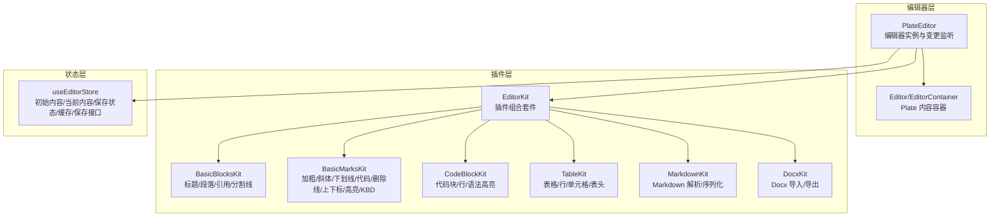
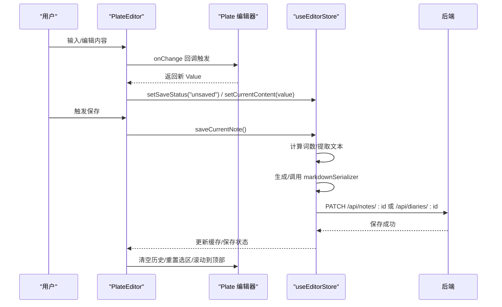
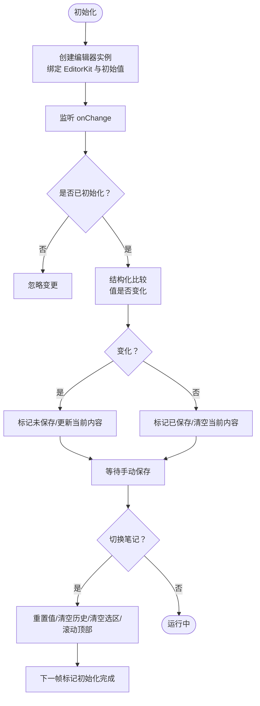
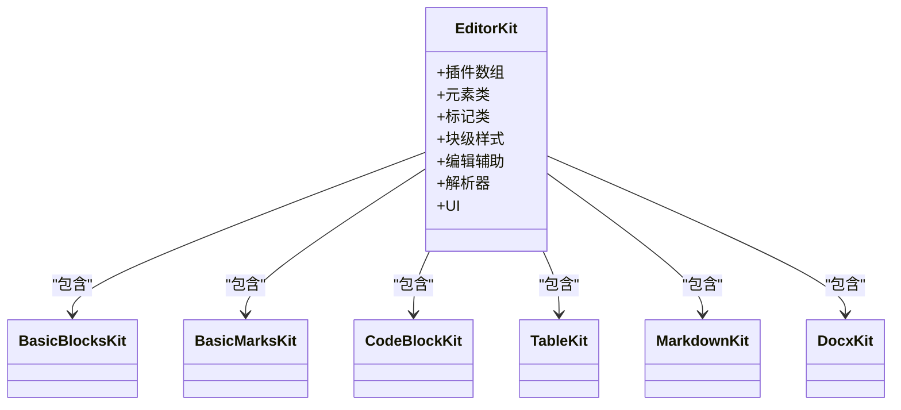
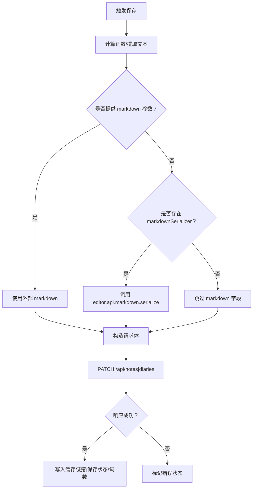
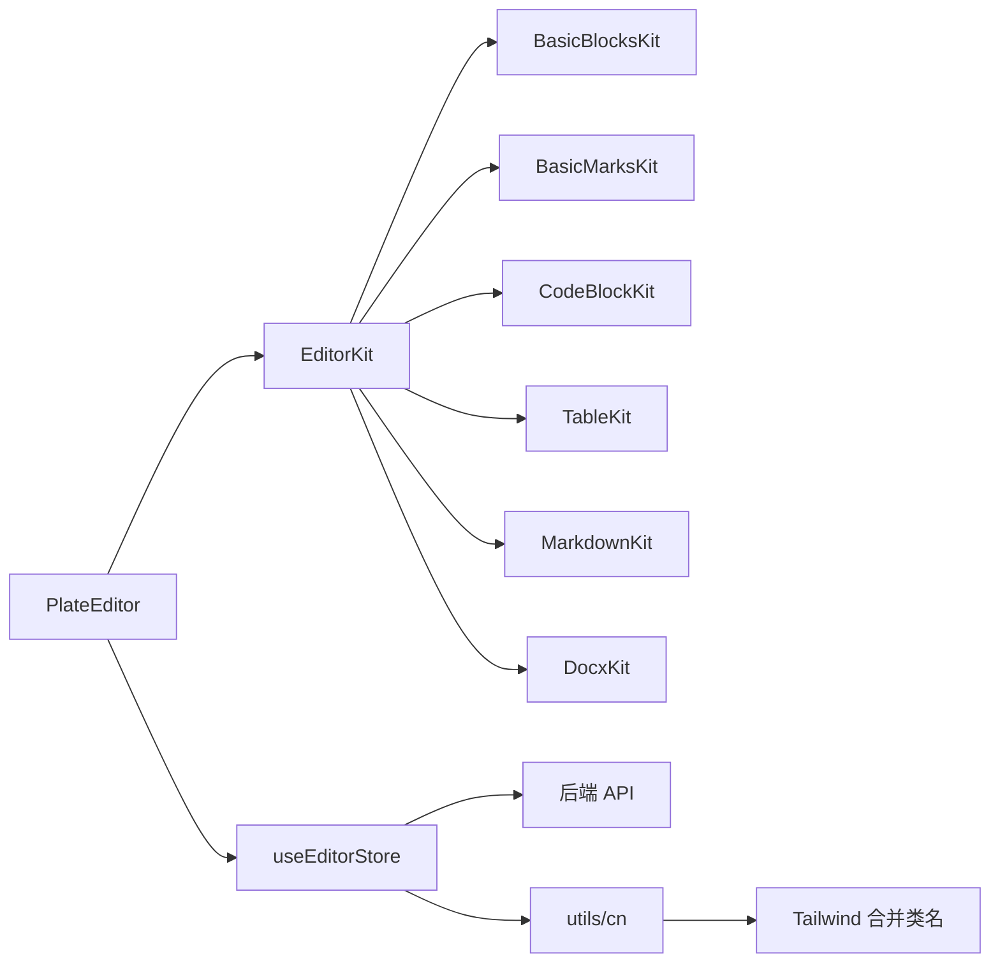

# 富文本编辑器集成

<cite>
**本文引用的文件**
- [src/components/editor/plate-editor.tsx](file://src/components/editor/plate-editor.tsx)
- [src/components/editor/editor-kit.tsx](file://src/components/editor/editor-kit.tsx)
- [src/components/editor/editor-base-kit.tsx](file://src/components/editor/editor-base-kit.tsx)
- [src/components/editor/plate-types.ts](file://src/components/editor/plate-types.ts)
- [src/stores/editor-store.ts](file://src/stores/editor-store.ts)
- [src/components/editor/plugins/markdown-kit.tsx](file://src/components/editor/plugins/markdown-kit.tsx)
- [src/components/editor/plugins/basic-blocks-kit.tsx](file://src/components/editor/plugins/basic-blocks-kit.tsx)
- [src/components/editor/plugins/basic-marks-kit.tsx](file://src/components/editor/plugins/basic-marks-kit.tsx)
- [src/components/editor/plugins/code-block-kit.tsx](file://src/components/editor/plugins/code-block-kit.tsx)
- [src/components/editor/plugins/table-kit.tsx](file://src/components/editor/plugins/table-kit.tsx)
- [src/components/editor/plugins/docx-kit.tsx](file://src/components/editor/plugins/docx-kit.tsx)
- [src/components/ui/editor.tsx](file://src/components/ui/editor.tsx)
- [src/components/ui/editor-static.tsx](file://src/components/ui/editor-static.tsx)
- [src/lib/utils.ts](file://src/lib/utils.ts)
- [package.json](file://package.json)
- [src/types/index.ts](file://src/types/index.ts)
</cite>

## 目录
1. [简介](#简介)
2. [项目结构](#项目结构)
3. [核心组件](#核心组件)
4. [架构总览](#架构总览)
5. [详细组件分析](#详细组件分析)
6. [依赖关系分析](#依赖关系分析)
7. [性能考虑](#性能考虑)
8. [故障排查指南](#故障排查指南)
9. [结论](#结论)
10. [附录](#附录)

## 简介
本文件面向富文本编辑器在本项目的集成与使用，重点覆盖以下方面：
- Plate.js 的集成与配置：如何初始化编辑器、加载插件套件、绑定 UI 组件。
- 编辑器核心组件架构与工作原理：编辑器容器、内容渲染、事件处理与状态同步。
- 插件系统文档化：基础节点插件、内联标记插件、代码块、表格、Markdown 解析与导出、Docx 导入/导出等。
- 内容序列化与反序列化：JSON 值与 Markdown 的双向转换流程。
- Markdown 转换与双向支持：解析与序列化链路、Remark 插件生态。
- 自定义与扩展方法：如何新增节点类型、叶子样式、快捷键与 UI 组件映射。
- 状态管理与持久化：Zustand Store 的内容缓存、保存状态、手动保存与缓存失效。
- 性能优化策略与最佳实践：值比较算法、缓存淘汰、异步加载与防抖。
- 实际使用示例与常见问题解决方案。

## 项目结构
编辑器相关代码主要位于 src/components/editor 与 src/components/ui 下，并通过 Zustand Store 管理状态与持久化。核心文件职责如下：
- 编辑器入口与生命周期：PlateEditor
- 插件组合套件：EditorKit（含基础块、标记、列表/对齐/行高等、编辑辅助、解析器与 UI）
- 类型定义：MyValue、MyTextBlockElement 等
- 状态与持久化：useEditorStore（缓存、保存、加载、序列化回调）
- UI 容器与内容视图：Editor、EditorContainer、EditorView、EditorStatic
- 插件实现：basic-blocks、basic-marks、code-block、table、markdown、docx 等

**图表来源**
- [src/components/editor/plate-editor.tsx:63-174](file://src/components/editor/plate-editor.tsx#L63-L174)
- [src/components/editor/editor-kit.tsx:36-78](file://src/components/editor/editor-kit.tsx#L36-L78)
- [src/stores/editor-store.ts:88-280](file://src/stores/editor-store.ts#L88-L280)

**章节来源**
- [src/components/editor/plate-editor.tsx:63-174](file://src/components/editor/plate-editor.tsx#L63-L174)
- [src/components/editor/editor-kit.tsx:36-78](file://src/components/editor/editor-kit.tsx#L36-L78)
- [src/stores/editor-store.ts:88-280](file://src/stores/editor-store.ts#L88-L280)

## 核心组件
- PlateEditor：负责创建 Plate 编辑器实例、设置插件套件、监听内容变更、更新保存状态、设置 Markdown 序列化器回调、切换笔记时重置编辑器状态。
- EditorKit：聚合所有插件（块级节点、内联标记、块级样式、编辑辅助、解析器、UI），形成完整的编辑能力矩阵。
- useEditorStore：集中管理当前笔记 ID、初始内容、当前编辑内容、保存状态、词数、加载状态、内容缓存、加载/保存/切换/失效缓存等。
- Editor/EditorContainer：基于 Plate 的内容容器与内容视图，提供多种变体与样式控制。
- 类型系统：plate-types 定义了丰富的节点与文本类型，确保编辑器值结构的强类型约束。

**章节来源**
- [src/components/editor/plate-editor.tsx:63-174](file://src/components/editor/plate-editor.tsx#L63-L174)
- [src/components/editor/editor-kit.tsx:36-78](file://src/components/editor/editor-kit.tsx#L36-L78)
- [src/stores/editor-store.ts:88-280](file://src/stores/editor-store.ts#L88-L280)
- [src/components/ui/editor.tsx:36-113](file://src/components/ui/editor.tsx#L36-L113)
- [src/components/editor/plate-types.ts:25-164](file://src/components/editor/plate-types.ts#L25-L164)

## 架构总览
编辑器采用“插件组合 + 强类型值模型 + 状态持久化”的架构：
- 插件组合：EditorKit 将基础块、标记、列表/对齐/行高、编辑辅助、Markdown/Docx 解析器、UI 组件统一装配。
- 值模型：plate-types 定义 MyValue 及其子类型，确保节点类型与属性明确。
- 状态管理：useEditorStore 提供 LRU 缓存、手动保存、加载、切换、序列化回调注册等。
- 运行时：PlateEditor 创建编辑器实例，绑定插件与 UI，处理变更与保存。

**图表来源**
- [src/components/editor/plate-editor.tsx:84-153](file://src/components/editor/plate-editor.tsx#L84-L153)
- [src/stores/editor-store.ts:204-275](file://src/stores/editor-store.ts#L204-L275)

## 详细组件分析

### 组件一：PlateEditor（编辑器主控）
- 初始化：通过 usePlateEditor 创建编辑器实例，传入 EditorKit 与初始值。
- 变更监听：使用结构化比较函数避免 JSON.stringify 的性能开销，仅在内容变化时更新保存状态与当前内容。
- 笔记切换：当 currentNoteId 变化时，重置编辑器值、清空撤销/重做历史、清除选区、滚动到顶部，并在下一帧标记初始化完成。
- 保存后基线更新：保存成功后，将当前编辑器 children 作为新的基线值，用于后续比较。
- Markdown 序列化器：在编辑器就绪后注册 editor.api.markdown.serialize 为全局序列化器，供保存时使用。

**图表来源**
- [src/components/editor/plate-editor.tsx:79-153](file://src/components/editor/plate-editor.tsx#L79-L153)

**章节来源**
- [src/components/editor/plate-editor.tsx:63-174](file://src/components/editor/plate-editor.tsx#L63-L174)

### 组件二：EditorKit（插件套件）
- 元素类：基础块（标题/段落/引用/分割线）、代码块、表格、折叠块、目录、媒体、提示框、分栏、数学公式、日期、链接、提及等。
- 标记类：基础样式（加粗/斜体/下划线/删除线/上/下标/高亮/KBD）与字体相关样式。
- 块级样式：列表、对齐、行高。
- 编辑辅助：斜杠命令、自动格式化、光标覆盖、块菜单、拖拽、表情、回车断行等。
- 解析器：Docx、Markdown。
- UI：占位符、固定工具栏、浮动工具栏。

**图表来源**
- [src/components/editor/editor-kit.tsx:36-78](file://src/components/editor/editor-kit.tsx#L36-L78)

**章节来源**
- [src/components/editor/editor-kit.tsx:36-78](file://src/components/editor/editor-kit.tsx#L36-L78)

### 组件三：基础块插件（BasicBlocksKit）
- 功能：提供标题（H1-H6）、段落、引用、水平分割线等块级节点。
- 配置：每个节点可配置组件映射、快捷键、规则（如空块时重置）。

**章节来源**
- [src/components/editor/plugins/basic-blocks-kit.tsx:27-88](file://src/components/editor/plugins/basic-blocks-kit.tsx#L27-L88)

### 组件四：基础标记插件（BasicMarksKit）
- 功能：提供加粗、斜体、下划线、代码、删除线、上/下标、高亮、KBD 等内联标记。
- 配置：部分标记可配置组件映射与快捷键。

**章节来源**
- [src/components/editor/plugins/basic-marks-kit.tsx:19-41](file://src/components/editor/plugins/basic-marks-kit.tsx#L19-L41)

### 组件五：代码块插件（CodeBlockKit）
- 功能：代码块、代码行、语法高亮（基于 lowlight）。
- 配置：组件映射、快捷键、lowlight 初始化。

**章节来源**
- [src/components/editor/plugins/code-block-kit.tsx:18-26](file://src/components/editor/plugins/code-block-kit.tsx#L18-L26)

### 组件六：表格插件（TableKit）
- 功能：表格、行、单元格、表头。
- 配置：初始宽度等选项。

**章节来源**
- [src/components/editor/plugins/table-kit.tsx:17-26](file://src/components/editor/plugins/table-kit.tsx#L17-L26)

### 组件七：Markdown 插件（MarkdownKit）
- 功能：基于 @platejs/markdown，启用 remark-math、remark-gfm、remark-mdx、remark-mention 等插件，实现 Markdown 的解析与序列化。

**章节来源**
- [src/components/editor/plugins/markdown-kit.tsx:5-11](file://src/components/editor/plugins/markdown-kit.tsx#L5-L11)

### 组件八：Docx 插件（DocxKit）
- 功能：Docx 导入与导出，配合 juice 进行样式内联。

**章节来源**
- [src/components/editor/plugins/docx-kit.tsx:1-6](file://src/components/editor/plugins/docx-kit.tsx#L1-L6)

### 组件九：类型系统（plate-types）
- 定义：块元素、文本块元素、引用、代码块/行、标题、分割线、图片/媒体嵌入、链接、提及、提及输入、表格/行/单元格、折叠块、富文本类型、编辑器值类型等。
- 作用：保证编辑器内部值结构的强类型约束，便于插件与 UI 组件协作。

**章节来源**
- [src/components/editor/plate-types.ts:25-164](file://src/components/editor/plate-types.ts#L25-L164)

### 组件十：状态与持久化（useEditorStore）
- 状态字段：currentNoteId、editingType、initialContent、currentContent、markdownSerializer、saveStatus、wordCount、isLoadingContent、contentCache。
- 加载：loadNote/loadDiary 支持缓存命中与 API 拉取，LRU 淘汰。
- 切换：switchToNote 更新当前笔记 ID。
- 保存：saveCurrentNote 执行 PATCH 请求，计算词数，生成/调用 markdownSerializer，更新缓存与保存状态。
- 缓存：MAX_CACHE_SIZE 控制容量，按时间戳淘汰最旧项。

**图表来源**
- [src/stores/editor-store.ts:204-275](file://src/stores/editor-store.ts#L204-L275)

**章节来源**
- [src/stores/editor-store.ts:88-280](file://src/stores/editor-store.ts#L88-L280)

### 组件十一：UI 容器与视图（Editor/EditorContainer/EditorView/EditorStatic）
- EditorContainer：编辑器容器，支持多种变体（默认/演示/选择/评论等）。
- Editor：内容视图，禁用默认样式，使用自定义样式变量。
- EditorView/EditorStatic：静态渲染场景下的视图组件。

**章节来源**
- [src/components/ui/editor.tsx:36-113](file://src/components/ui/editor.tsx#L36-L113)
- [src/components/ui/editor-static.tsx:41-52](file://src/components/ui/editor-static.tsx#L41-L52)

## 依赖关系分析
- 外部依赖：platejs、@platejs/* 生态（basic-nodes、basic-styles、code-block、table、markdown、docx、emoji、mention、slash-command、math、media、toggle、toc、layout、indent、selection、floating 等）。
- 工具库：lowlight（语法高亮）、remark-*（Markdown 生态）、zustand（状态管理）、class-variance-authority + tailwind-merge（样式组合）。

**图表来源**
- [src/components/editor/editor-kit.tsx:36-78](file://src/components/editor/editor-kit.tsx#L36-L78)
- [src/components/editor/plate-editor.tsx:79-153](file://src/components/editor/plate-editor.tsx#L79-L153)
- [src/stores/editor-store.ts:204-275](file://src/stores/editor-store.ts#L204-L275)
- [src/lib/utils.ts:4-6](file://src/lib/utils.ts#L4-L6)
- [package.json:13-99](file://package.json#L13-L99)

**章节来源**
- [package.json:13-99](file://package.json#L13-L99)
- [src/lib/utils.ts:4-6](file://src/lib/utils.ts#L4-L6)

## 性能考虑
- 结构化值比较：在 PlateEditor 中实现非 JSON stringify 的结构化比较，减少大内容比较成本。
- 缓存策略：useEditorStore 使用 Map 实现 LRU 缓存，按时间戳淘汰最旧条目，降低重复加载成本。
- 异步加载：加载笔记/日记时设置 isLoadingContent，避免 UI 卡顿。
- 低开销渲染：Editor 禁用默认样式，使用自定义样式变量，减少不必要的样式计算。
- 语法高亮：lowlight 按需渲染，避免全量高亮带来的性能压力。
- 保存前计算：保存前提取文本计算词数，避免额外的后处理开销。

**章节来源**
- [src/components/editor/plate-editor.tsx:16-61](file://src/components/editor/plate-editor.tsx#L16-L61)
- [src/stores/editor-store.ts:66-77](file://src/stores/editor-store.ts#L66-L77)
- [src/stores/editor-store.ts:114-155](file://src/stores/editor-store.ts#L114-L155)
- [src/stores/editor-store.ts:204-275](file://src/stores/editor-store.ts#L204-L275)
- [src/components/ui/editor.tsx:99-112](file://src/components/ui/editor.tsx#L99-L112)

## 故障排查指南
- 无法保存或保存状态异常
  - 检查 saveStatus 是否被正确设置为 saving/saved/error。
  - 确认 markdownSerializer 是否已注册，保存时是否能正常序列化。
  - 查看后端返回状态码与错误信息。
  - 参考路径：[src/stores/editor-store.ts:204-275](file://src/stores/editor-store.ts#L204-L275)
- 内容不更新或未触发保存
  - 确认 isInitializedRef 是否在切换笔记后被正确标记为 true。
  - 检查结构化比较逻辑是否误判为相同内容。
  - 参考路径：[src/components/editor/plate-editor.tsx:84-99](file://src/components/editor/plate-editor.tsx#L84-L99)
- 切换笔记后历史残留或选区异常
  - 确认是否调用了 editor.history.undos/redos 清空与 editor.selection=null。
  - 参考路径：[src/components/editor/plate-editor.tsx:102-136](file://src/components/editor/plate-editor.tsx#L102-L136)
- Markdown 导入/导出失败
  - 检查 MarkdownKit 的 remark 插件配置是否正确。
  - 参考路径：[src/components/editor/plugins/markdown-kit.tsx:5-11](file://src/components/editor/plugins/markdown-kit.tsx#L5-L11)
- Docx 导入/导出异常
  - 确认 DocxKit 是否正确引入 DocxPlugin 与 JuicePlugin。
  - 参考路径：[src/components/editor/plugins/docx-kit.tsx:1-6](file://src/components/editor/plugins/docx-kit.tsx#L1-L6)
- 缓存未生效或内存占用过高
  - 检查 MAX_CACHE_SIZE 与 evictCache 逻辑。
  - 参考路径：[src/stores/editor-store.ts:66-77](file://src/stores/editor-store.ts#L66-L77)

## 结论
本项目以 Plate.js 为核心，通过 EditorKit 将丰富插件能力整合，结合自定义类型系统与 Zustand Store，实现了高性能、可扩展、可维护的富文本编辑器。Markdown 与 Docx 的双向支持完善，状态管理具备缓存与手动保存能力，适合在笔记/日记等场景中稳定运行。后续可在节点类型扩展、快捷键定制、UI 组件本地化等方面持续增强。

## 附录

### A. 插件系统清单与用途
- 基础块：标题、段落、引用、分割线
- 基础标记：加粗、斜体、下划线、代码、删除线、上/下标、高亮、KBD
- 代码块：代码块、行、语法高亮
- 表格：表格、行、单元格、表头
- Markdown：解析/序列化（remark-math/GFM/MDX/Mention）
- Docx：导入/导出（配合 juice）

**章节来源**
- [src/components/editor/plugins/basic-blocks-kit.tsx:27-88](file://src/components/editor/plugins/basic-blocks-kit.tsx#L27-L88)
- [src/components/editor/plugins/basic-marks-kit.tsx:19-41](file://src/components/editor/plugins/basic-marks-kit.tsx#L19-L41)
- [src/components/editor/plugins/code-block-kit.tsx:18-26](file://src/components/editor/plugins/code-block-kit.tsx#L18-L26)
- [src/components/editor/plugins/table-kit.tsx:17-26](file://src/components/editor/plugins/table-kit.tsx#L17-L26)
- [src/components/editor/plugins/markdown-kit.tsx:5-11](file://src/components/editor/plugins/markdown-kit.tsx#L5-L11)
- [src/components/editor/plugins/docx-kit.tsx:1-6](file://src/components/editor/plugins/docx-kit.tsx#L1-L6)

### B. Markdown 转换与双向支持
- 解析：MarkdownKit 使用 @platejs/markdown，配置 remark-plugins（数学公式、GFM、MDX、Mention）。
- 序列化：PlateEditor 在编辑器就绪后注册 editor.api.markdown.serialize 为全局序列化器，保存时调用。
- 参考路径：
  - [src/components/editor/plugins/markdown-kit.tsx:5-11](file://src/components/editor/plugins/markdown-kit.tsx#L5-L11)
  - [src/components/editor/plate-editor.tsx:146-153](file://src/components/editor/plate-editor.tsx#L146-L153)

### C. 自定义与扩展方法
- 新增节点类型：在 plate-types 中定义新接口与类型，参考现有类型（如 MyH1Element、MyCodeBlockElement 等）。
- 映射 UI 组件：在对应 Kit 文件中使用 configure/withComponent 将节点映射到 UI 组件。
- 快捷键与规则：在 Kit 中为节点配置 shortcuts 与 rules。
- 示例参考：
  - [src/components/editor/plate-types.ts:25-164](file://src/components/editor/plate-types.ts#L25-L164)
  - [src/components/editor/plugins/basic-blocks-kit.tsx:27-88](file://src/components/editor/plugins/basic-blocks-kit.tsx#L27-L88)
  - [src/components/editor/plugins/basic-marks-kit.tsx:19-41](file://src/components/editor/plugins/basic-marks-kit.tsx#L19-L41)

### D. 状态管理与持久化要点
- 缓存：Map + LRU（按时间戳淘汰），最大容量由常量控制。
- 保存：PATCH 请求，同时计算词数；若无外部 markdown，则调用 editor.api.markdown.serialize。
- 参考路径：
  - [src/stores/editor-store.ts:66-77](file://src/stores/editor-store.ts#L66-L77)
  - [src/stores/editor-store.ts:204-275](file://src/stores/editor-store.ts#L204-L275)

### E. 使用示例与最佳实践
- 在页面中渲染 PlateEditor，即可获得完整编辑体验。
- 通过 useEditorStore 的 switchToNote 切换笔记，编辑器会自动重置并清空历史。
- 通过 saveCurrentNote 主动保存，或依赖 onChange 的自动检测。
- 参考路径：
  - [src/components/editor/plate-editor.tsx:63-174](file://src/components/editor/plate-editor.tsx#L63-L174)
  - [src/stores/editor-store.ts:200-202](file://src/stores/editor-store.ts#L200-L202)