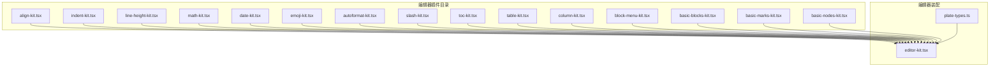
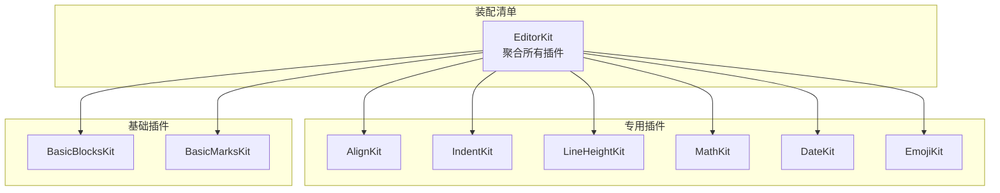
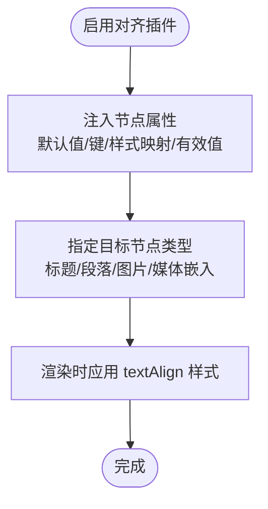
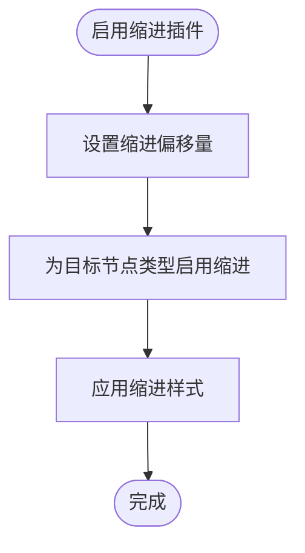
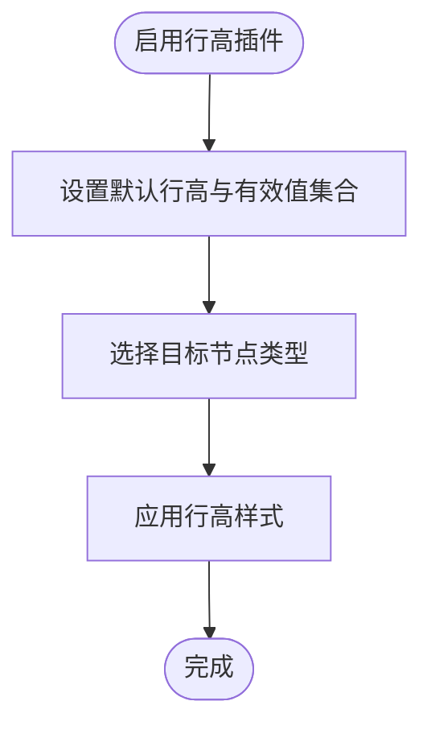
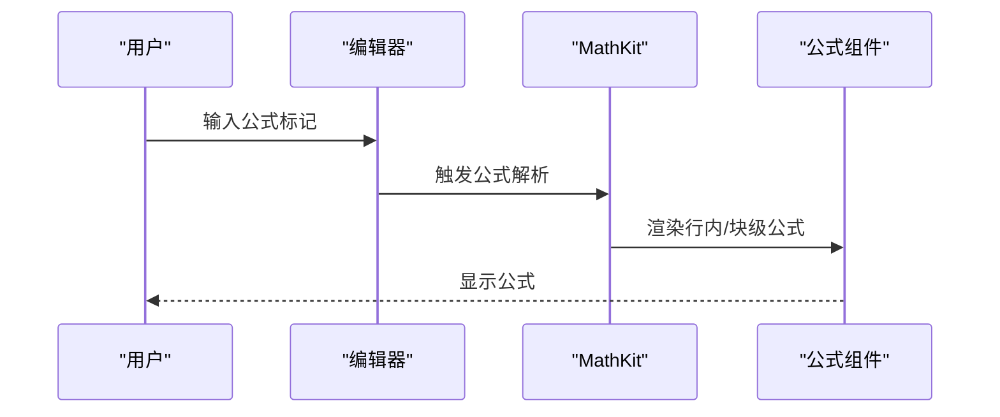
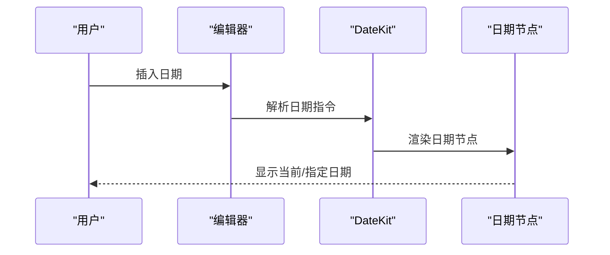
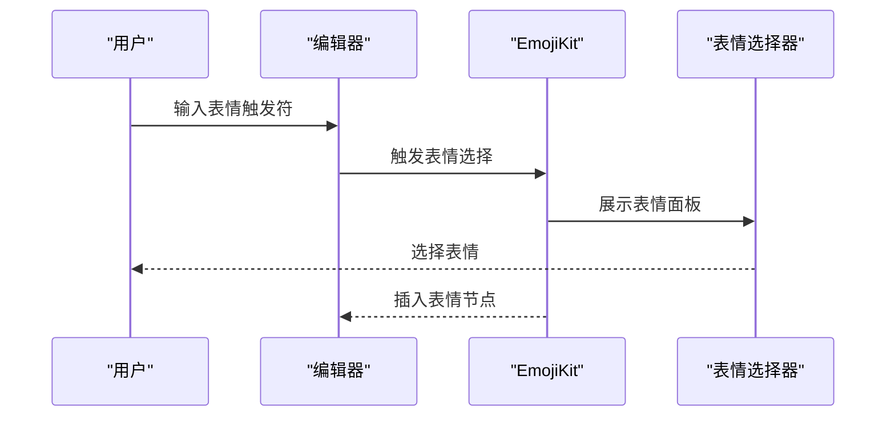
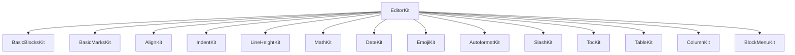

# 专用插件

<cite>
**本文引用的文件**
- [src/components/editor/plugins/align-kit.tsx](file://src/components/editor/plugins/align-kit.tsx)
- [src/components/editor/plugins/indent-kit.tsx](file://src/components/editor/plugins/indent-kit.tsx)
- [src/components/editor/plugins/line-height-kit.tsx](file://src/components/editor/plugins/line-height-kit.tsx)
- [src/components/editor/plugins/math-kit.tsx](file://src/components/editor/plugins/math-kit.tsx)
- [src/components/editor/plugins/date-kit.tsx](file://src/components/editor/plugins/date-kit.tsx)
- [src/components/editor/plugins/emoji-kit.tsx](file://src/components/editor/plugins/emoji-kit.tsx)
- [src/components/editor/plugins/autoformat-kit.tsx](file://src/components/editor/plugins/autoformat-kit.tsx)
- [src/components/editor/plugins/slash-kit.tsx](file://src/components/editor/plugins/slash-kit.tsx)
- [src/components/editor/plugins/toc-kit.tsx](file://src/components/editor/plugins/toc-kit.tsx)
- [src/components/editor/plugins/table-kit.tsx](file://src/components/editor/plugins/table-kit.tsx)
- [src/components/editor/plugins/column-kit.tsx](file://src/components/editor/plugins/column-kit.tsx)
- [src/components/editor/plugins/block-menu-kit.tsx](file://src/components/editor/plugins/block-menu-kit.tsx)
- [src/components/editor/plugins/basic-blocks-kit.tsx](file://src/components/editor/plugins/basic-blocks-kit.tsx)
- [src/components/editor/plugins/basic-marks-kit.tsx](file://src/components/editor/plugins/basic-marks-kit.tsx)
- [src/components/editor/plugins/basic-nodes-kit.tsx](file://src/components/editor/plugins/basic-nodes-kit.tsx)
- [src/components/editor/editor-kit.tsx](file://src/components/editor/editor-kit.tsx)
- [src/components/editor/plate-types.ts](file://src/components/editor/plate-types.ts)
</cite>

## 目录
1. [简介](#简介)
2. [项目结构](#项目结构)
3. [核心组件](#核心组件)
4. [架构总览](#架构总览)
5. [详细组件分析](#详细组件分析)
6. [依赖分析](#依赖分析)
7. [性能考虑](#性能考虑)
8. [故障排查指南](#故障排查指南)
9. [结论](#结论)
10. [附录](#附录)

## 简介
本文件系统化梳理 ynote-v2 编辑器中的“专用插件”能力，重点覆盖以下专业特性与插件实现：
- 对齐（文本对齐样式）
- 缩进（段落缩进与偏移）
- 行高（段落行高设置）
- 数学公式（行内与块级公式节点）
- 日期（日期占位与渲染）
- 表情符号（输入与选择）

同时文档化这些专用插件的配置项、与基础插件的协作关系与兼容性、扩展与自定义方法、最佳实践与性能优化建议，并说明国际化与本地化的支持现状与建议。

## 项目结构
专用插件位于编辑器插件目录中，采用按功能分组的模块化组织方式。编辑器主入口通过一个聚合清单将所有插件装配到编辑器实例中，形成统一的插件集合。

**图表来源**
- [src/components/editor/plugins/align-kit.tsx:1-19](file://src/components/editor/plugins/align-kit.tsx#L1-L19)
- [src/components/editor/plugins/indent-kit.tsx:1-23](file://src/components/editor/plugins/indent-kit.tsx#L1-L23)
- [src/components/editor/plugins/line-height-kit.tsx:1-17](file://src/components/editor/plugins/line-height-kit.tsx#L1-L17)
- [src/components/editor/plugins/math-kit.tsx:1-14](file://src/components/editor/plugins/math-kit.tsx#L1-L14)
- [src/components/editor/plugins/date-kit.tsx:1-8](file://src/components/editor/plugins/date-kit.tsx#L1-L8)
- [src/components/editor/plugins/emoji-kit.tsx:1-14](file://src/components/editor/plugins/emoji-kit.tsx#L1-L14)
- [src/components/editor/plugins/autoformat-kit.tsx:1-237](file://src/components/editor/plugins/autoformat-kit.tsx#L1-L237)
- [src/components/editor/plugins/slash-kit.tsx:1-19](file://src/components/editor/plugins/slash-kit.tsx#L1-L19)
- [src/components/editor/plugins/toc-kit.tsx:1-15](file://src/components/editor/plugins/toc-kit.tsx#L1-L15)
- [src/components/editor/plugins/table-kit.tsx:1-27](file://src/components/editor/plugins/table-kit.tsx#L1-L27)
- [src/components/editor/plugins/column-kit.tsx:1-11](file://src/components/editor/plugins/column-kit.tsx#L1-L11)
- [src/components/editor/plugins/block-menu-kit.tsx:1-15](file://src/components/editor/plugins/block-menu-kit.tsx#L1-L15)
- [src/components/editor/plugins/basic-blocks-kit.tsx:1-89](file://src/components/editor/plugins/basic-blocks-kit.tsx#L1-L89)
- [src/components/editor/plugins/basic-marks-kit.tsx:1-42](file://src/components/editor/plugins/basic-marks-kit.tsx#L1-L42)
- [src/components/editor/plugins/basic-nodes-kit.tsx:1-7](file://src/components/editor/plugins/basic-nodes-kit.tsx#L1-L7)
- [src/components/editor/editor-kit.tsx:1-83](file://src/components/editor/editor-kit.tsx#L1-L83)
- [src/components/editor/plate-types.ts:1-164](file://src/components/editor/plate-types.ts#L1-L164)

**章节来源**
- [src/components/editor/editor-kit.tsx:36-78](file://src/components/editor/editor-kit.tsx#L36-L78)

## 核心组件
本节聚焦于对齐、缩进、行高、数学公式、日期、表情符号等专用插件的职责与配置要点。

- 对齐插件（AlignKit）
  - 职责：为标题、段落、图片、媒体嵌入等节点注入文本对齐属性，支持多种对齐值。
  - 关键配置：默认对齐值、目标节点类型、样式映射键。
  - 参考路径：[src/components/editor/plugins/align-kit.tsx:6-18](file://src/components/editor/plugins/align-kit.tsx#L6-L18)

- 缩进插件（IndentKit）
  - 职责：为标题、段落、引用块、代码块、可切换块、图片等节点提供缩进控制。
  - 关键配置：缩进偏移量（像素）。
  - 参考路径：[src/components/editor/plugins/indent-kit.tsx:6-22](file://src/components/editor/plugins/indent-kit.tsx#L6-L22)

- 行高插件（LineHeightKit）
  - 职责：为标题与段落节点注入行高属性，限定可用行高值集合。
  - 关键配置：默认行高、有效行高集合、目标节点类型。
  - 参考路径：[src/components/editor/plugins/line-height-kit.tsx:6-16](file://src/components/editor/plugins/line-height-kit.tsx#L6-L16)

- 数学公式插件（MathKit）
  - 职责：注册行内公式与块级公式节点组件，提供公式输入与渲染。
  - 关键配置：行内/块级公式组件映射。
  - 参考路径：[src/components/editor/plugins/math-kit.tsx:10-13](file://src/components/editor/plugins/math-kit.tsx#L10-L13)

- 日期插件（DateKit）
  - 职责：注册日期节点组件，支持在内容中插入与显示日期占位。
  - 关键配置：日期节点组件映射。
  - 参考路径：[src/components/editor/plugins/date-kit.tsx:6-7](file://src/components/editor/plugins/date-kit.tsx#L6-L7)

- 表情符号插件（EmojiKit）
  - 职责：集成表情输入与选择，提供数据源与输入组件。
  - 关键配置：表情数据源、输入组件映射。
  - 参考路径：[src/components/editor/plugins/emoji-kit.tsx:8-13](file://src/components/editor/plugins/emoji-kit.tsx#L8-L13)

**章节来源**
- [src/components/editor/plugins/align-kit.tsx:6-18](file://src/components/editor/plugins/align-kit.tsx#L6-L18)
- [src/components/editor/plugins/indent-kit.tsx:6-22](file://src/components/editor/plugins/indent-kit.tsx#L6-L22)
- [src/components/editor/plugins/line-height-kit.tsx:6-16](file://src/components/editor/plugins/line-height-kit.tsx#L6-L16)
- [src/components/editor/plugins/math-kit.tsx:10-13](file://src/components/editor/plugins/math-kit.tsx#L10-L13)
- [src/components/editor/plugins/date-kit.tsx:6-7](file://src/components/editor/plugins/date-kit.tsx#L6-L7)
- [src/components/editor/plugins/emoji-kit.tsx:8-13](file://src/components/editor/plugins/emoji-kit.tsx#L8-L13)

## 架构总览
编辑器通过一个统一的装配清单将基础节点、基础标记、块级样式、编辑增强、解析器与 UI 组件组合成完整的插件集合。专用插件作为独立模块被装配到该清单中，遵循 Plate 的插件配置与组件映射机制。

**图表来源**
- [src/components/editor/editor-kit.tsx:36-78](file://src/components/editor/editor-kit.tsx#L36-L78)
- [src/components/editor/plugins/align-kit.tsx:6-18](file://src/components/editor/plugins/align-kit.tsx#L6-L18)
- [src/components/editor/plugins/indent-kit.tsx:6-22](file://src/components/editor/plugins/indent-kit.tsx#L6-L22)
- [src/components/editor/plugins/line-height-kit.tsx:6-16](file://src/components/editor/plugins/line-height-kit.tsx#L6-L16)
- [src/components/editor/plugins/math-kit.tsx:10-13](file://src/components/editor/plugins/math-kit.tsx#L10-L13)
- [src/components/editor/plugins/date-kit.tsx:6-7](file://src/components/editor/plugins/date-kit.tsx#L6-L7)
- [src/components/editor/plugins/emoji-kit.tsx:8-13](file://src/components/editor/plugins/emoji-kit.tsx#L8-L13)
- [src/components/editor/plugins/basic-blocks-kit.tsx:27-88](file://src/components/editor/plugins/basic-blocks-kit.tsx#L27-L88)
- [src/components/editor/plugins/basic-marks-kit.tsx:19-41](file://src/components/editor/plugins/basic-marks-kit.tsx#L19-L41)

**章节来源**
- [src/components/editor/editor-kit.tsx:36-78](file://src/components/editor/editor-kit.tsx#L36-L78)

## 详细组件分析

### 对齐插件（AlignKit）
- 实现要点
  - 使用文本对齐插件，注入节点属性以支持多种对齐值。
  - 指定目标节点类型，确保对齐样式应用于标题、段落、图片与媒体嵌入等元素。
- 配置项
  - 默认对齐值、节点键、样式键、有效对齐值集合。
- 兼容性
  - 与基础块节点（标题、段落）及媒体节点协同工作。
- 扩展建议
  - 可通过注入节点属性扩展更多对齐策略或与主题系统联动。

**图表来源**
- [src/components/editor/plugins/align-kit.tsx:6-18](file://src/components/editor/plugins/align-kit.tsx#L6-L18)

**章节来源**
- [src/components/editor/plugins/align-kit.tsx:6-18](file://src/components/editor/plugins/align-kit.tsx#L6-L18)

### 缩进插件（IndentKit）
- 实现要点
  - 为多种块级节点提供缩进控制，配置缩进偏移量。
- 配置项
  - 缩进偏移量（像素），目标节点类型列表。
- 兼容性
  - 与标题、段落、引用块、代码块、可切换块、图片等节点兼容。
- 扩展建议
  - 可结合布局与列系统进一步细化缩进策略。

**图表来源**
- [src/components/editor/plugins/indent-kit.tsx:6-22](file://src/components/editor/plugins/indent-kit.tsx#L6-L22)

**章节来源**
- [src/components/editor/plugins/indent-kit.tsx:6-22](file://src/components/editor/plugins/indent-kit.tsx#L6-L22)

### 行高插件（LineHeightKit）
- 实现要点
  - 注入行高属性，限定可用行高值集合，仅作用于标题与段落。
- 配置项
  - 默认行高、有效行高集合、目标节点类型。
- 兼容性
  - 与基础块节点（标题、段落）协同。
- 扩展建议
  - 可根据主题或阅读模式动态调整行高集合。

**图表来源**
- [src/components/editor/plugins/line-height-kit.tsx:6-16](file://src/components/editor/plugins/line-height-kit.tsx#L6-L16)

**章节来源**
- [src/components/editor/plugins/line-height-kit.tsx:6-16](file://src/components/editor/plugins/line-height-kit.tsx#L6-L16)

### 数学公式插件（MathKit）
- 实现要点
  - 注册行内公式与块级公式节点组件，提供公式输入与渲染。
- 配置项
  - 行内/块级公式组件映射。
- 兼容性
  - 与富文本编辑器的节点体系无缝集成。
- 扩展建议
  - 可接入更多公式引擎或渲染库，提升公式编辑体验。

**图表来源**
- [src/components/editor/plugins/math-kit.tsx:10-13](file://src/components/editor/plugins/math-kit.tsx#L10-L13)

**章节来源**
- [src/components/editor/plugins/math-kit.tsx:10-13](file://src/components/editor/plugins/math-kit.tsx#L10-L13)

### 日期插件（DateKit）
- 实现要点
  - 注册日期节点组件，支持在内容中插入与显示日期占位。
- 配置项
  - 日期节点组件映射。
- 兼容性
  - 与基础块节点协同工作。
- 扩展建议
  - 可增加日期格式化规则与本地化支持。

**图表来源**
- [src/components/editor/plugins/date-kit.tsx:6-7](file://src/components/editor/plugins/date-kit.tsx#L6-L7)

**章节来源**
- [src/components/editor/plugins/date-kit.tsx:6-7](file://src/components/editor/plugins/date-kit.tsx#L6-L7)

### 表情符号插件（EmojiKit）
- 实现要点
  - 集成表情输入与选择，提供数据源与输入组件。
- 配置项
  - 表情数据源、输入组件映射。
- 兼容性
  - 与输入法与自动补全机制协同。
- 扩展建议
  - 可接入更多表情包或自定义表情集。

**图表来源**
- [src/components/editor/plugins/emoji-kit.tsx:8-13](file://src/components/editor/plugins/emoji-kit.tsx#L8-L13)

**章节来源**
- [src/components/editor/plugins/emoji-kit.tsx:8-13](file://src/components/editor/plugins/emoji-kit.tsx#L8-L13)

### 自动格式化与快捷命令（AutoformatKit 与 SlashKit）
- 自动格式化（AutoformatKit）
  - 支持多种标记与块级结构的自动格式化，包括数学、标点、引号、法律文本等。
  - 提供规则映射与条件查询，避免在代码块内触发。
  - 参考路径：[src/components/editor/plugins/autoformat-kit.tsx:211-236](file://src/components/editor/plugins/autoformat-kit.tsx#L211-L236)
- 快捷命令（SlashKit）
  - 在非代码块上下文中触发斜杠命令面板，提供快速插入节点的能力。
  - 参考路径：[src/components/editor/plugins/slash-kit.tsx:8-18](file://src/components/editor/plugins/slash-kit.tsx#L8-L18)

**章节来源**
- [src/components/editor/plugins/autoformat-kit.tsx:211-236](file://src/components/editor/plugins/autoformat-kit.tsx#L211-L236)
- [src/components/editor/plugins/slash-kit.tsx:8-18](file://src/components/editor/plugins/slash-kit.tsx#L8-L18)

### 目录与表格（TocKit 与 TableKit）
- 目录（TocKit）
  - 生成与更新目录，支持顶部偏移配置。
  - 参考路径：[src/components/editor/plugins/toc-kit.tsx:7-14](file://src/components/editor/plugins/toc-kit.tsx#L7-L14)
- 表格（TableKit）
  - 提供表格、行、单元格与表头的节点组件与初始宽度配置。
  - 参考路径：[src/components/editor/plugins/table-kit.tsx:17-26](file://src/components/editor/plugins/table-kit.tsx#L17-L26)

**章节来源**
- [src/components/editor/plugins/toc-kit.tsx:7-14](file://src/components/editor/plugins/toc-kit.tsx#L7-L14)
- [src/components/editor/plugins/table-kit.tsx:17-26](file://src/components/editor/plugins/table-kit.tsx#L17-L26)

### 布局与菜单（ColumnKit 与 BlockMenuKit）
- 列布局（ColumnKit）
  - 提供列容器与列项的节点组件映射。
  - 参考路径：[src/components/editor/plugins/column-kit.tsx:7-10](file://src/components/editor/plugins/column-kit.tsx#L7-L10)
- 块菜单（BlockMenuKit）
  - 结合块选择与上下文菜单，提供块级操作入口。
  - 参考路径：[src/components/editor/plugins/block-menu-kit.tsx:9-14](file://src/components/editor/plugins/block-menu-kit.tsx#L9-L14)

**章节来源**
- [src/components/editor/plugins/column-kit.tsx:7-10](file://src/components/editor/plugins/column-kit.tsx#L7-L10)
- [src/components/editor/plugins/block-menu-kit.tsx:9-14](file://src/components/editor/plugins/block-menu-kit.tsx#L9-L14)

## 依赖分析
专用插件与基础插件之间存在清晰的装配关系与依赖链。编辑器装配清单将基础节点与标记、块级样式、编辑增强、解析器与 UI 组件统一装配，专用插件作为独立模块被纳入其中。

**图表来源**
- [src/components/editor/editor-kit.tsx:36-78](file://src/components/editor/editor-kit.tsx#L36-L78)
- [src/components/editor/plugins/basic-blocks-kit.tsx:27-88](file://src/components/editor/plugins/basic-blocks-kit.tsx#L27-L88)
- [src/components/editor/plugins/basic-marks-kit.tsx:19-41](file://src/components/editor/plugins/basic-marks-kit.tsx#L19-L41)

**章节来源**
- [src/components/editor/editor-kit.tsx:36-78](file://src/components/editor/editor-kit.tsx#L36-L78)

## 性能考虑
- 插件粒度与按需加载
  - 将专用插件拆分为独立模块，便于按需引入，减少初始加载体积。
- 渲染与计算开销
  - 对齐、行高、缩进等样式计算应尽量复用，避免重复渲染。
  - 数学公式与表情符号的渲染应限制在必要场景，避免在大量节点中频繁触发。
- 触发条件优化
  - 自动格式化与快捷命令应设置合理的触发条件，避免在代码块等敏感区域误触发。
- 事件与状态管理
  - 通过编辑器上下文与状态管理降低不必要的重绘与回流。

## 故障排查指南
- 对齐/行高/缩进不生效
  - 检查目标节点类型是否正确注入，确认节点键与样式键映射一致。
  - 参考路径：[src/components/editor/plugins/align-kit.tsx:6-18](file://src/components/editor/plugins/align-kit.tsx#L6-L18)、[src/components/editor/plugins/line-height-kit.tsx:6-16](file://src/components/editor/plugins/line-height-kit.tsx#L6-L16)、[src/components/editor/plugins/indent-kit.tsx:6-22](file://src/components/editor/plugins/indent-kit.tsx#L6-L22)
- 数学公式无法渲染
  - 确认公式组件映射正确，检查公式语法与渲染环境。
  - 参考路径：[src/components/editor/plugins/math-kit.tsx:10-13](file://src/components/editor/plugins/math-kit.tsx#L10-L13)
- 日期节点显示异常
  - 检查日期节点组件映射与渲染逻辑。
  - 参考路径：[src/components/editor/plugins/date-kit.tsx:6-7](file://src/components/editor/plugins/date-kit.tsx#L6-L7)
- 表情符号输入无响应
  - 检查表情数据源与输入组件映射。
  - 参考路径：[src/components/editor/plugins/emoji-kit.tsx:8-13](file://src/components/editor/plugins/emoji-kit.tsx#L8-L13)
- 自动格式化误触发
  - 确认规则查询条件，避免在代码块内触发。
  - 参考路径：[src/components/editor/plugins/autoformat-kit.tsx:225-233](file://src/components/editor/plugins/autoformat-kit.tsx#L225-L233)
- 快捷命令不可用
  - 检查触发条件与上下文查询，确保不在代码块中触发。
  - 参考路径：[src/components/editor/plugins/slash-kit.tsx:10-16](file://src/components/editor/plugins/slash-kit.tsx#L10-L16)

**章节来源**
- [src/components/editor/plugins/align-kit.tsx:6-18](file://src/components/editor/plugins/align-kit.tsx#L6-L18)
- [src/components/editor/plugins/line-height-kit.tsx:6-16](file://src/components/editor/plugins/line-height-kit.tsx#L6-L16)
- [src/components/editor/plugins/indent-kit.tsx:6-22](file://src/components/editor/plugins/indent-kit.tsx#L6-L22)
- [src/components/editor/plugins/math-kit.tsx:10-13](file://src/components/editor/plugins/math-kit.tsx#L10-L13)
- [src/components/editor/plugins/date-kit.tsx:6-7](file://src/components/editor/plugins/date-kit.tsx#L6-L7)
- [src/components/editor/plugins/emoji-kit.tsx:8-13](file://src/components/editor/plugins/emoji-kit.tsx#L8-L13)
- [src/components/editor/plugins/autoformat-kit.tsx:225-233](file://src/components/editor/plugins/autoformat-kit.tsx#L225-L233)
- [src/components/editor/plugins/slash-kit.tsx:10-16](file://src/components/editor/plugins/slash-kit.tsx#L10-L16)

## 结论
专用插件围绕对齐、缩进、行高、数学公式、日期与表情符号等专业需求构建，通过明确的配置项与组件映射与基础插件协同工作。编辑器装配清单提供了统一的插件装配与扩展机制，便于按需引入与定制。建议在实际使用中关注触发条件、渲染性能与国际化支持，以获得更佳的用户体验。

## 附录
- 类型定义与节点接口
  - 编辑器类型定义中包含了丰富的节点与属性接口，为专用插件的类型安全与扩展提供支撑。
  - 参考路径：[src/components/editor/plate-types.ts:25-164](file://src/components/editor/plate-types.ts#L25-L164)

**章节来源**
- [src/components/editor/plate-types.ts:25-164](file://src/components/editor/plate-types.ts#L25-L164)