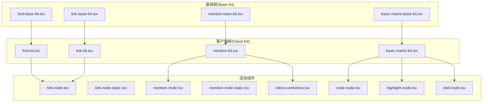
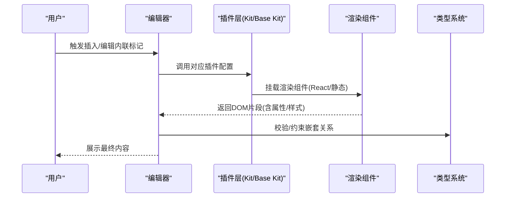
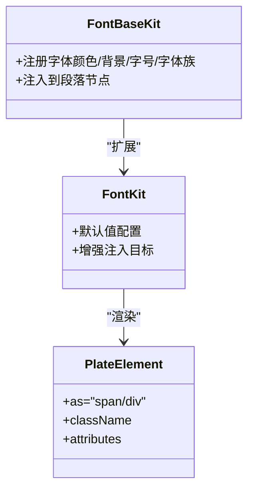
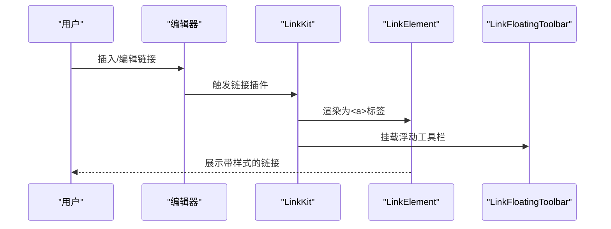
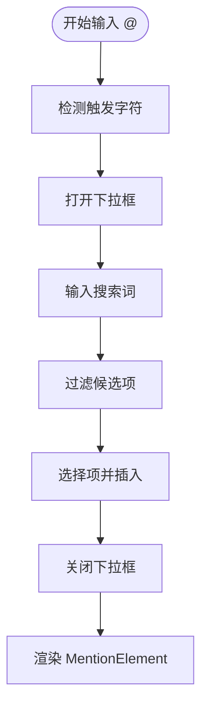
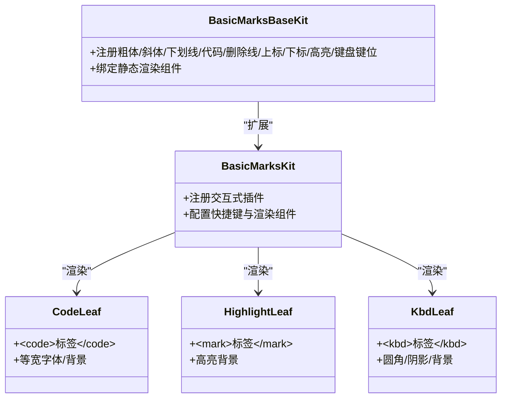
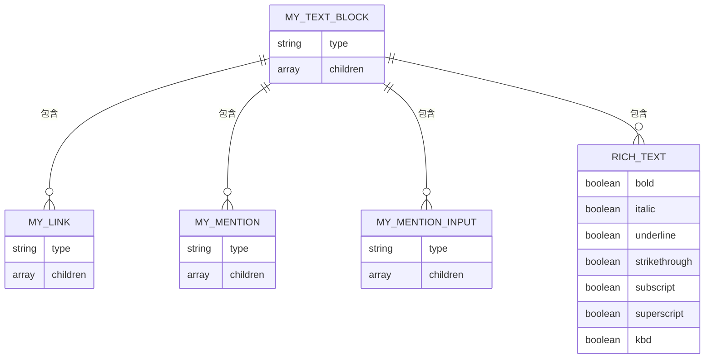
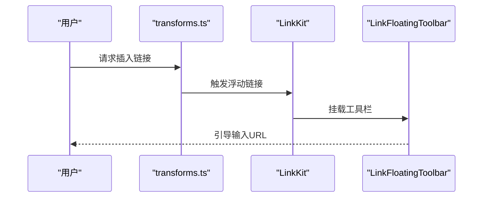
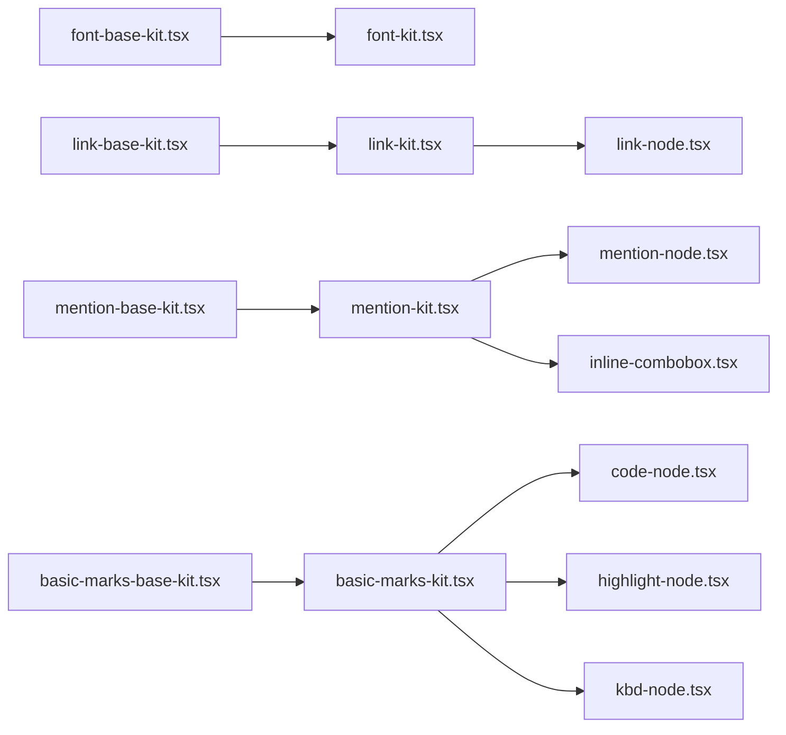

# 内联标记插件

<cite>
**本文引用的文件**
- [font-base-kit.tsx](file://src/components/editor/plugins/font-base-kit.tsx)
- [font-kit.tsx](file://src/components/editor/plugins/font-kit.tsx)
- [link-base-kit.tsx](file://src/components/editor/plugins/link-base-kit.tsx)
- [link-kit.tsx](file://src/components/editor/plugins/link-kit.tsx)
- [mention-base-kit.tsx](file://src/components/editor/plugins/mention-base-kit.tsx)
- [mention-kit.tsx](file://src/components/editor/plugins/mention-kit.tsx)
- [basic-marks-base-kit.tsx](file://src/components/editor/plugins/basic-marks-base-kit.tsx)
- [basic-marks-kit.tsx](file://src/components/editor/plugins/basic-marks-kit.tsx)
- [link-node.tsx](file://src/components/ui/link-node.tsx)
- [link-node-static.tsx](file://src/components/ui/link-node-static.tsx)
- [mention-node.tsx](file://src/components/ui/mention-node.tsx)
- [mention-node-static.tsx](file://src/components/ui/mention-node-static.tsx)
- [code-node.tsx](file://src/components/ui/code-node.tsx)
- [highlight-node.tsx](file://src/components/ui/highlight-node.tsx)
- [kbd-node.tsx](file://src/components/ui/kbd-node.tsx)
- [inline-combobox.tsx](file://src/components/ui/inline-combobox.tsx)
- [plate-types.ts](file://src/components/editor/plate-types.ts)
- [transforms.ts](file://src/components/editor/transforms.ts)
</cite>

## 目录
1. [简介](#简介)
2. [项目结构](#项目结构)
3. [核心组件](#核心组件)
4. [架构总览](#架构总览)
5. [详细组件分析](#详细组件分析)
6. [依赖关系分析](#依赖关系分析)
7. [性能考量](#性能考量)
8. [故障排查指南](#故障排查指南)
9. [结论](#结论)
10. [附录](#附录)

## 简介
本文件系统性地文档化了 ynote-v2 编辑器中的“内联标记”插件体系，涵盖字体（颜色、背景色、字号、字体族）、链接、提及（@）以及常用内联样式（粗体、斜体、下划线、删除线、上标、下标、高亮、键盘键位）的实现原理、渲染规则、样式配置与交互行为，并说明这些内联标记与块级元素的嵌套关系与组合使用方式。同时提供配置项、自定义方法、组合示例与最佳实践，以及性能优化建议。

## 项目结构
内联标记插件由两层构成：
- 基础层（Base Kit）：仅注册插件与静态渲染组件，不包含交互逻辑，用于服务端渲染或静态展示。
- 客户端层（Kit）：在基础层之上启用交互能力（如浮动工具栏、快捷键、输入组件），用于富文本编辑场景。

图表来源
- [font-base-kit.tsx:1-20](file://src/components/editor/plugins/font-base-kit.tsx#L1-L20)
- [font-kit.tsx:1-29](file://src/components/editor/plugins/font-kit.tsx#L1-L29)
- [link-base-kit.tsx:1-6](file://src/components/editor/plugins/link-base-kit.tsx#L1-L6)
- [link-kit.tsx:1-16](file://src/components/editor/plugins/link-kit.tsx#L1-L16)
- [mention-base-kit.tsx:1-8](file://src/components/editor/plugins/mention-base-kit.tsx#L1-L8)
- [mention-kit.tsx:1-18](file://src/components/editor/plugins/mention-kit.tsx#L1-L18)
- [basic-marks-base-kit.tsx:1-28](file://src/components/editor/plugins/basic-marks-base-kit.tsx#L1-L28)
- [basic-marks-kit.tsx:1-42](file://src/components/editor/plugins/basic-marks-kit.tsx#L1-L42)
- [link-node.tsx:1-30](file://src/components/ui/link-node.tsx#L1-L30)
- [link-node-static.tsx:1-22](file://src/components/ui/link-node-static.tsx#L1-L22)
- [mention-node.tsx:1-195](file://src/components/ui/mention-node.tsx#L1-L195)
- [mention-node-static.tsx:1-37](file://src/components/ui/mention-node-static.tsx#L1-L37)
- [code-node.tsx:1-17](file://src/components/ui/code-node.tsx#L1-L17)
- [highlight-node.tsx:1-13](file://src/components/ui/highlight-node.tsx#L1-L13)
- [kbd-node.tsx:1-17](file://src/components/ui/kbd-node.tsx#L1-L17)
- [inline-combobox.tsx:1-436](file://src/components/ui/inline-combobox.tsx#L1-L436)

章节来源
- [font-base-kit.tsx:1-20](file://src/components/editor/plugins/font-base-kit.tsx#L1-L20)
- [font-kit.tsx:1-29](file://src/components/editor/plugins/font-kit.tsx#L1-L29)
- [link-base-kit.tsx:1-6](file://src/components/editor/plugins/link-base-kit.tsx#L1-L6)
- [link-kit.tsx:1-16](file://src/components/editor/plugins/link-kit.tsx#L1-L16)
- [mention-base-kit.tsx:1-8](file://src/components/editor/plugins/mention-base-kit.tsx#L1-L8)
- [mention-kit.tsx:1-18](file://src/components/editor/plugins/mention-kit.tsx#L1-L18)
- [basic-marks-base-kit.tsx:1-28](file://src/components/editor/plugins/basic-marks-base-kit.tsx#L1-L28)
- [basic-marks-kit.tsx:1-42](file://src/components/editor/plugins/basic-marks-kit.tsx#L1-L42)

## 核心组件
- 字体样式（颜色、背景色、字号、字体族）
  - 基础层：注册基础样式插件，注入到段落节点以统一作用范围。
  - 客户端层：在默认值、注入目标等配置上进行增强，确保编辑态可用。
- 链接
  - 基础层：注册基础链接插件并绑定静态渲染组件。
  - 客户端层：注册可交互链接插件，提供渲染钩子与浮动工具栏。
- 提及（@）
  - 基础层：注册基础提及插件并绑定静态渲染组件。
  - 客户端层：注册提及与输入插件，提供触发字符、输入框与候选项列表。
- 基础内联样式（粗体、斜体、下划线、代码、删除线、上标、下标、高亮、键盘键位）
  - 基础层：注册基础样式插件并绑定静态渲染组件。
  - 客户端层：注册交互式插件，配置快捷键与渲染组件。

章节来源
- [font-base-kit.tsx:10-20](file://src/components/editor/plugins/font-base-kit.tsx#L10-L20)
- [font-kit.tsx:12-28](file://src/components/editor/plugins/font-kit.tsx#L12-L28)
- [link-base-kit.tsx:1-5](file://src/components/editor/plugins/link-base-kit.tsx#L1-L5)
- [link-kit.tsx:8-15](file://src/components/editor/plugins/link-kit.tsx#L8-L15)
- [mention-base-kit.tsx:1-7](file://src/components/editor/plugins/mention-base-kit.tsx#L1-L7)
- [mention-kit.tsx:10-17](file://src/components/editor/plugins/mention-kit.tsx#L10-L17)
- [basic-marks-base-kit.tsx:17-27](file://src/components/editor/plugins/basic-marks-base-kit.tsx#L17-L27)
- [basic-marks-kit.tsx:19-41](file://src/components/editor/plugins/basic-marks-kit.tsx#L19-L41)

## 架构总览
内联标记插件通过“基础层 + 客户端层”的分层设计，将渲染与交互解耦：
- 基础层负责注册插件与静态渲染组件，便于在服务端或静态场景复用。
- 客户端层在基础层之上启用交互能力（快捷键、浮动工具栏、输入组件），并提供默认配置。
- 渲染组件（如 LinkElement、MentionElement、CodeLeaf 等）定义具体的 DOM 映射与样式类名。
- 类型系统（plate-types.ts）明确内联元素与块级元素的嵌套关系，保证编辑器树结构合法。

图表来源
- [link-kit.tsx:8-15](file://src/components/editor/plugins/link-kit.tsx#L8-L15)
- [link-node.tsx:10-29](file://src/components/ui/link-node.tsx#L10-L29)
- [plate-types.ts:95-117](file://src/components/editor/plate-types.ts#L95-L117)

## 详细组件分析

### 字体样式插件（颜色/背景/字号/字体族）
- 基础层
  - 注册字体颜色、背景色、字号、字体族的基础样式插件。
  - 通过注入配置将这些样式作用于段落节点，确保全局一致性。
- 客户端层
  - 在默认值、注入目标等处进行增强，确保编辑态可用。
- 渲染与样式
  - 通过 PlateElement 的属性与类名控制渲染与样式。
- 组合与嵌套
  - 字体样式作为内联样式，可与其他内联标记（如链接、提及、高亮）组合使用。
- 配置与自定义
  - 可通过插件配置调整默认值、注入目标节点类型。
- 性能与优化
  - 将样式计算下沉至渲染组件，避免重复计算；保持最小化类名拼接。

图表来源
- [font-base-kit.tsx:14-19](file://src/components/editor/plugins/font-base-kit.tsx#L14-L19)
- [font-kit.tsx:16-28](file://src/components/editor/plugins/font-kit.tsx#L16-L28)
- [plate-types.ts:25-39](file://src/components/editor/plate-types.ts#L25-L39)

章节来源
- [font-base-kit.tsx:1-20](file://src/components/editor/plugins/font-base-kit.tsx#L1-L20)
- [font-kit.tsx:1-29](file://src/components/editor/plugins/font-kit.tsx#L1-L29)
- [plate-types.ts:25-39](file://src/components/editor/plate-types.ts#L25-L39)

### 链接插件（链接、浮动工具栏）
- 基础层
  - 注册基础链接插件并绑定静态渲染组件，用于服务端或静态场景。
- 客户端层
  - 注册可交互链接插件，提供渲染钩子与浮动工具栏。
  - 使用 getLinkAttributes 获取链接属性，确保 a 标签具备正确的 href、target 等。
- 渲染与样式
  - LinkElement 以 a 标签渲染，应用强调、下划线、偏移等样式。
  - LinkElementStatic 用于静态渲染，属性与类名一致。
- 组合与嵌套
  - 链接可包裹任意内联文本，支持与其他内联样式组合。
- 配置与自定义
  - 可通过插件配置调整渲染组件与浮动工具栏挂载点。
- 交互行为
  - 鼠标悬停时阻止事件冒泡，避免影响编辑器状态。
- 性能与优化
  - 静态组件与交互组件分离，减少不必要的重渲染。

图表来源
- [link-kit.tsx:8-15](file://src/components/editor/plugins/link-kit.tsx#L8-L15)
- [link-node.tsx:10-29](file://src/components/ui/link-node.tsx#L10-L29)
- [link-node-static.tsx:7-21](file://src/components/ui/link-node-static.tsx#L7-L21)

章节来源
- [link-base-kit.tsx:1-6](file://src/components/editor/plugins/link-base-kit.tsx#L1-L6)
- [link-kit.tsx:1-16](file://src/components/editor/plugins/link-kit.tsx#L1-L16)
- [link-node.tsx:1-30](file://src/components/ui/link-node.tsx#L1-L30)
- [link-node-static.tsx:1-22](file://src/components/ui/link-node-static.tsx#L1-L22)

### 提及插件（@ 提及、输入与候选项）
- 基础层
  - 注册基础提及插件并绑定静态渲染组件。
- 客户端层
  - 注册提及与输入插件，设置触发字符模式（如空格、引号前触发）。
  - 使用 InlineCombobox 提供输入体验，支持过滤、分组、键盘导航。
- 渲染与样式
  - MentionElement 以 span 渲染，应用圆角、背景、对齐与选中态样式。
  - MentionInputElement 作为输入容器，内部包含 InlineCombobox。
- 组合与嵌套
  - 提及元素为不可编辑内联块，可与其他内联样式组合。
- 配置与自定义
  - 可通过插件配置调整触发字符、输入组件与候选项数据源。
- 交互行为
  - 支持前缀显示、平台差异处理（如 macOS IME）。
- 性能与优化
  - 使用 useComboboxInput 与自动聚焦策略，减少无效渲染。
  - 列表项按需可见，避免全量渲染。

图表来源
- [mention-kit.tsx:10-17](file://src/components/editor/plugins/mention-kit.tsx#L10-L17)
- [mention-node.tsx:78-117](file://src/components/ui/mention-node.tsx#L78-L117)
- [inline-combobox.tsx:72-210](file://src/components/ui/inline-combobox.tsx#L72-L210)

章节来源
- [mention-base-kit.tsx:1-8](file://src/components/editor/plugins/mention-base-kit.tsx#L1-L8)
- [mention-kit.tsx:1-18](file://src/components/editor/plugins/mention-kit.tsx#L1-L18)
- [mention-node.tsx:1-195](file://src/components/ui/mention-node.tsx#L1-L195)
- [mention-node-static.tsx:1-37](file://src/components/ui/mention-node-static.tsx#L1-L37)
- [inline-combobox.tsx:1-436](file://src/components/ui/inline-combobox.tsx#L1-L436)

### 基础内联样式（粗体、斜体、下划线、代码、删除线、上标、下标、高亮、键盘键位）
- 基础层
  - 注册基础样式插件并绑定静态渲染组件（如 CodeLeafStatic、HighlightLeafStatic、KbdLeafStatic）。
- 客户端层
  - 注册交互式插件，配置快捷键与渲染组件。
  - 代码、高亮、键盘键位等叶子组件分别映射到 code、mark、kbd 标签。
- 渲染与样式
  - CodeLeaf 应用等宽字体与浅色背景。
  - HighlightLeaf 应用高亮背景与继承文本色。
  - KbdLeaf 应用圆角边框、阴影与浅色背景。
- 组合与嵌套
  - 可与链接、提及、字体样式组合使用，形成复合内联效果。
- 配置与自定义
  - 可通过插件配置调整快捷键与渲染组件。
- 性能与优化
  - 叶子组件轻量，避免复杂计算；样式类名尽量复用。

图表来源
- [basic-marks-base-kit.tsx:17-27](file://src/components/editor/plugins/basic-marks-base-kit.tsx#L17-L27)
- [basic-marks-kit.tsx:19-41](file://src/components/editor/plugins/basic-marks-kit.tsx#L19-L41)
- [code-node.tsx:6-16](file://src/components/ui/code-node.tsx#L6-L16)
- [highlight-node.tsx:6-12](file://src/components/ui/highlight-node.tsx#L6-L12)
- [kbd-node.tsx:6-16](file://src/components/ui/kbd-node.tsx#L6-L16)

章节来源
- [basic-marks-base-kit.tsx:1-28](file://src/components/editor/plugins/basic-marks-base-kit.tsx#L1-L28)
- [basic-marks-kit.tsx:1-42](file://src/components/editor/plugins/basic-marks-kit.tsx#L1-L42)
- [code-node.tsx:1-17](file://src/components/ui/code-node.tsx#L1-L17)
- [highlight-node.tsx:1-13](file://src/components/ui/highlight-node.tsx#L1-L13)
- [kbd-node.tsx:1-17](file://src/components/ui/kbd-node.tsx#L1-L17)

### 类型系统与嵌套规则
- 类型定义
  - MyTextBlockElement：文本块元素，其 children 可包含内联链接、提及、提及输入与富文本。
  - MyLinkElement、MyMentionElement、MyMentionInputElement：内联元素类型。
  - RichText：内联文本类型，扩展基础样式与字体样式。
- 嵌套关系
  - 段落（p）等块级元素可包含内联元素；内联元素之间可互相嵌套。
  - 提及输入元素（MentionInputElement）为特殊内联输入容器，内部承载输入与候选项。
- 与块级元素的关系
  - 内联标记不会破坏块级元素的边界；它们在块级元素的 children 中以文本或元素形式存在。

图表来源
- [plate-types.ts:29-39](file://src/components/editor/plate-types.ts#L29-L39)
- [plate-types.ts:95-117](file://src/components/editor/plate-types.ts#L95-L117)
- [plate-types.ts:144-146](file://src/components/editor/plate-types.ts#L144-L146)

章节来源
- [plate-types.ts:25-164](file://src/components/editor/plate-types.ts#L25-L164)

### 插入与转换工具（内联标记入口）
- insertInlineElement
  - 通过映射表触发内联元素插入，如日期、行内公式、链接等。
  - 链接插入时会触发浮动链接工具栏，提升交互效率。
- 与插件的协作
  - 该工具函数与 LinkKit、BasicMarksKit 等插件协同工作，确保插入后立即进入交互态。

图表来源
- [transforms.ts:73-81](file://src/components/editor/transforms.ts#L73-L81)
- [link-kit.tsx:8-15](file://src/components/editor/plugins/link-kit.tsx#L8-L15)

章节来源
- [transforms.ts:73-81](file://src/components/editor/transforms.ts#L73-L81)

## 依赖关系分析
- 插件层依赖
  - 客户端 Kit 依赖基础 Base Kit，再依赖具体渲染组件。
  - 渲染组件依赖 PlateElement/PlateLeaf 与通用工具类名拼接函数。
- 外部依赖
  - @platejs/* 生态：基础插件、React 扩展、静态渲染、组合框等。
  - @ariakit/react：提供组合框组件生态，支撑提及输入体验。
- 类型依赖
  - plate-types.ts 定义了内联与块级元素的类型关系，确保编译期安全。

图表来源
- [font-base-kit.tsx:14-19](file://src/components/editor/plugins/font-base-kit.tsx#L14-L19)
- [font-kit.tsx:16-28](file://src/components/editor/plugins/font-kit.tsx#L16-L28)
- [link-base-kit.tsx:1-5](file://src/components/editor/plugins/link-base-kit.tsx#L1-L5)
- [link-kit.tsx:8-15](file://src/components/editor/plugins/link-kit.tsx#L8-L15)
- [mention-base-kit.tsx:1-7](file://src/components/editor/plugins/mention-base-kit.tsx#L1-L7)
- [mention-kit.tsx:10-17](file://src/components/editor/plugins/mention-kit.tsx#L10-L17)
- [basic-marks-base-kit.tsx:17-27](file://src/components/editor/plugins/basic-marks-base-kit.tsx#L17-L27)
- [basic-marks-kit.tsx:19-41](file://src/components/editor/plugins/basic-marks-kit.tsx#L19-L41)
- [link-node.tsx:10-29](file://src/components/ui/link-node.tsx#L10-L29)
- [mention-node.tsx:27-74](file://src/components/ui/mention-node.tsx#L27-L74)
- [code-node.tsx:6-16](file://src/components/ui/code-node.tsx#L6-L16)
- [highlight-node.tsx:6-12](file://src/components/ui/highlight-node.tsx#L6-L12)
- [kbd-node.tsx:6-16](file://src/components/ui/kbd-node.tsx#L6-L16)
- [inline-combobox.tsx:72-210](file://src/components/ui/inline-combobox.tsx#L72-L210)

章节来源
- [font-base-kit.tsx:1-20](file://src/components/editor/plugins/font-base-kit.tsx#L1-L20)
- [font-kit.tsx:1-29](file://src/components/editor/plugins/font-kit.tsx#L1-L29)
- [link-base-kit.tsx:1-6](file://src/components/editor/plugins/link-base-kit.tsx#L1-L6)
- [link-kit.tsx:1-16](file://src/components/editor/plugins/link-kit.tsx#L1-L16)
- [mention-base-kit.tsx:1-8](file://src/components/editor/plugins/mention-base-kit.tsx#L1-L8)
- [mention-kit.tsx:1-18](file://src/components/editor/plugins/mention-kit.tsx#L1-L18)
- [basic-marks-base-kit.tsx:1-28](file://src/components/editor/plugins/basic-marks-base-kit.tsx#L1-L28)
- [basic-marks-kit.tsx:1-42](file://src/components/editor/plugins/basic-marks-kit.tsx#L1-L42)
- [inline-combobox.tsx:1-436](file://src/components/ui/inline-combobox.tsx#L1-L436)

## 性能考量
- 渲染拆分
  - 基础层与客户端层分离，静态渲染与交互渲染解耦，降低不必要的重渲染。
- 组件轻量化
  - 内联样式组件（如 CodeLeaf、HighlightLeaf、KbdLeaf）仅承担标签映射与样式，避免复杂逻辑。
- 输入体验优化
  - InlineCombobox 使用自动聚焦、取消输入策略与键盘导航，减少无效操作。
- 过滤与可见性
  - 下拉项按需可见，避免全量渲染；使用组合框存储与状态管理，提升响应速度。
- 样式拼接
  - 使用通用工具类名拼接函数，减少字符串拼接开销。

## 故障排查指南
- 链接无法点击或样式异常
  - 检查 LinkElement 是否正确挂载 getLinkAttributes，确认 a 标签属性完整。
  - 确认 LinkKit 的渲染配置与浮动工具栏是否正确挂载。
- 提及输入无响应
  - 检查 MentionKit 的触发字符模式与 MentionInputElement 是否正确注册。
  - 确认 InlineCombobox 的过滤函数与候选项数据源是否正常。
- 内联样式未生效
  - 检查 BasicMarksKit 的快捷键与渲染组件配置。
  - 确认 RichText 类型扩展是否包含所需样式键。
- 嵌套错误导致渲染异常
  - 检查 plate-types.ts 中的类型定义与嵌套关系，确保 children 类型匹配。

章节来源
- [link-node.tsx:10-29](file://src/components/ui/link-node.tsx#L10-L29)
- [link-kit.tsx:8-15](file://src/components/editor/plugins/link-kit.tsx#L8-L15)
- [mention-kit.tsx:10-17](file://src/components/editor/plugins/mention-kit.tsx#L10-L17)
- [inline-combobox.tsx:72-210](file://src/components/ui/inline-combobox.tsx#L72-L210)
- [basic-marks-kit.tsx:19-41](file://src/components/editor/plugins/basic-marks-kit.tsx#L19-L41)
- [plate-types.ts:95-117](file://src/components/editor/plate-types.ts#L95-L117)

## 结论
本内联标记插件体系通过“基础层 + 客户端层”的清晰分层，实现了字体、链接、提及与基础内联样式的统一注册与渲染。借助 Plate 生态与组合框组件，提供了良好的交互体验与可扩展性。类型系统明确了内联与块级元素的嵌套关系，确保结构安全。通过合理的配置与优化策略，可在保证功能完整性的同时兼顾性能与可维护性。

## 附录
- 组合使用示例（描述性）
  - 在一段文字中同时使用高亮、加粗与链接，链接内部可再嵌套提及。
  - 代码片段与键盘键位可与高亮组合，突出操作说明。
- 最佳实践
  - 将静态渲染与交互渲染分离，按需加载客户端层。
  - 合理配置触发字符与快捷键，避免冲突。
  - 对输入组件进行必要的过滤与分组，提升用户体验。
  - 保持样式类名简洁且语义化，便于主题定制与调试。