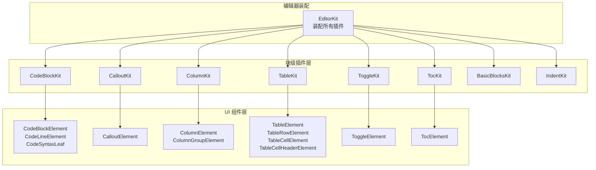
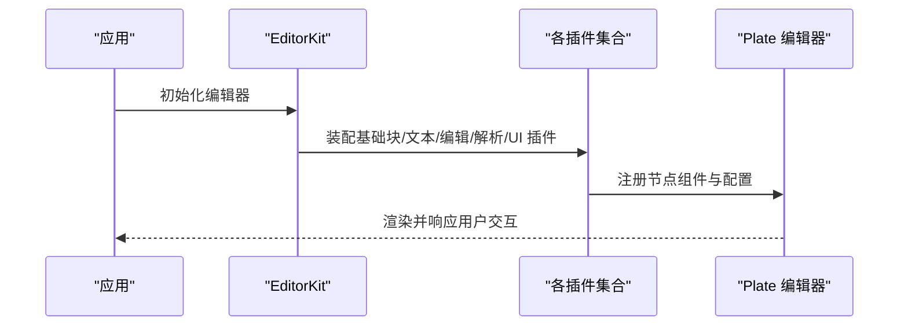
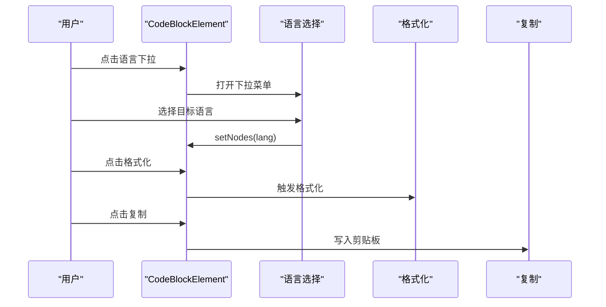
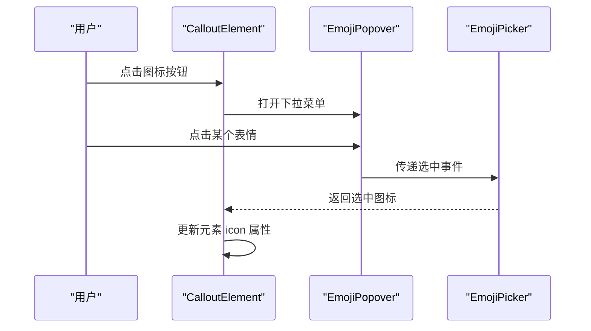
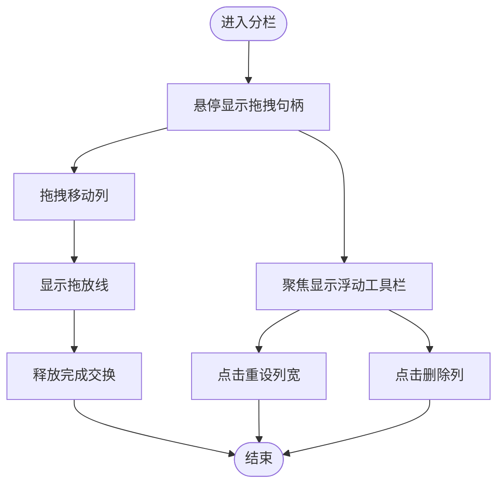
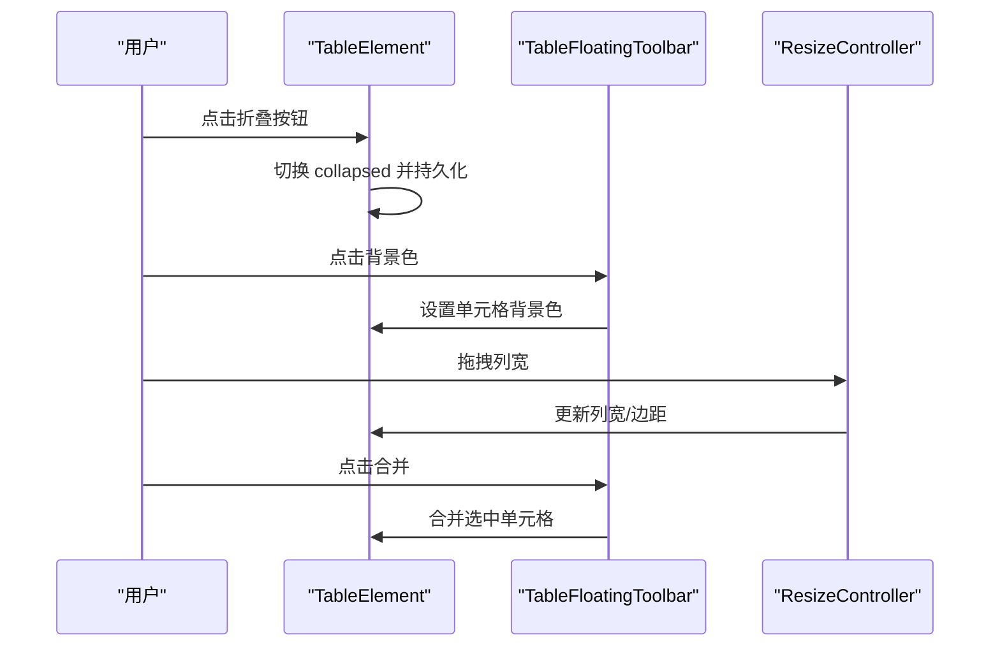
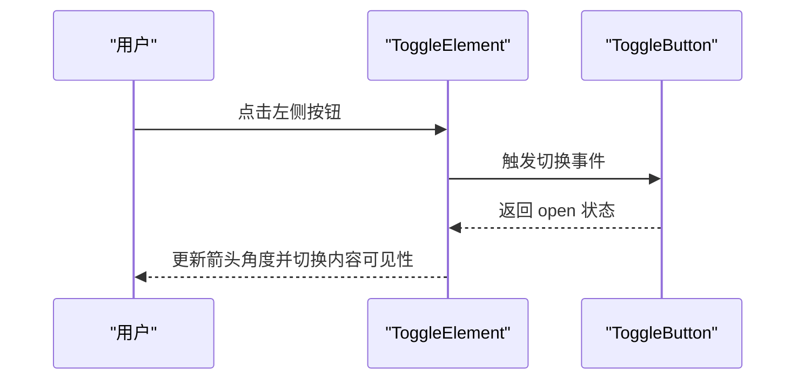
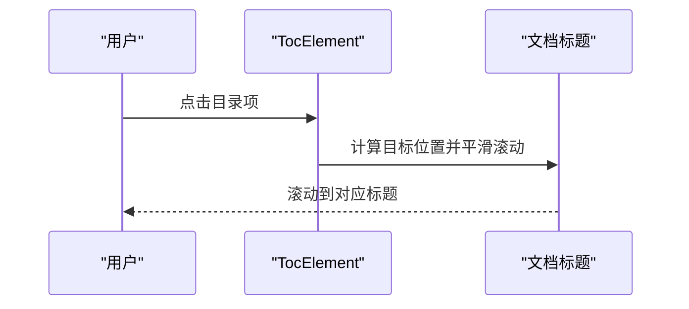
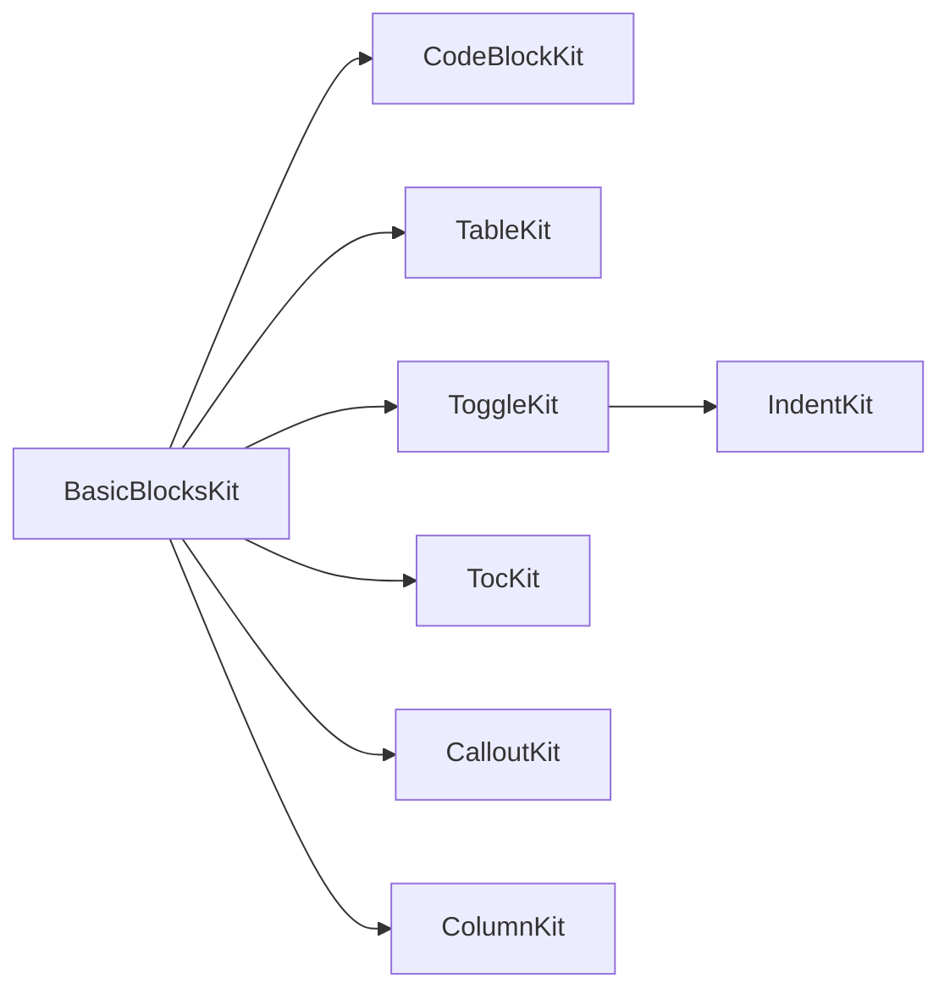
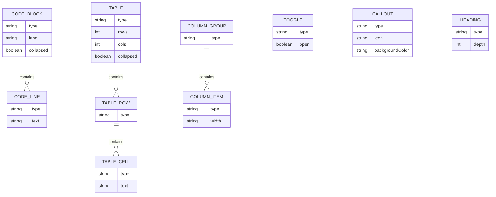

# 块级元素插件

<cite>
**本文引用的文件**
- [src/components/editor/plugins/code-block-kit.tsx](file://src/components/editor/plugins/code-block-kit.tsx)
- [src/components/ui/code-block-node.tsx](file://src/components/ui/code-block-node.tsx)
- [src/components/editor/plugins/callout-kit.tsx](file://src/components/editor/plugins/callout-kit.tsx)
- [src/components/ui/callout-node.tsx](file://src/components/ui/callout-node.tsx)
- [src/components/editor/plugins/column-kit.tsx](file://src/components/editor/plugins/column-kit.tsx)
- [src/components/ui/column-node.tsx](file://src/components/ui/column-node.tsx)
- [src/components/editor/plugins/table-kit.tsx](file://src/components/editor/plugins/table-kit.tsx)
- [src/components/ui/table-node.tsx](file://src/components/ui/table-node.tsx)
- [src/components/editor/plugins/toggle-kit.tsx](file://src/components/editor/plugins/toggle-kit.tsx)
- [src/components/ui/toggle-node.tsx](file://src/components/ui/toggle-node.tsx)
- [src/components/editor/plugins/toc-kit.tsx](file://src/components/editor/plugins/toc-kit.tsx)
- [src/components/ui/toc-node.tsx](file://src/components/ui/toc-node.tsx)
- [src/components/editor/plugins/basic-blocks-kit.tsx](file://src/components/editor/plugins/basic-blocks-kit.tsx)
- [src/components/editor/plugins/indent-kit.tsx](file://src/components/editor/plugins/indent-kit.tsx)
- [src/components/editor/editor-kit.tsx](file://src/components/editor/editor-kit.tsx)
- [src/components/editor/plate-types.ts](file://src/components/editor/plate-types.ts)
</cite>

## 目录
1. [简介](#简介)
2. [项目结构](#项目结构)
3. [核心组件](#核心组件)
4. [架构总览](#架构总览)
5. [详细组件分析](#详细组件分析)
6. [依赖分析](#依赖分析)
7. [性能考虑](#性能考虑)
8. [故障排查指南](#故障排查指南)
9. [结论](#结论)
10. [附录](#附录)

## 简介
本文件系统性地文档化 ynNote v2 中的块级元素插件体系，覆盖以下能力：
- 代码块：语法高亮、语言选择、格式化、折叠与全屏预览
- 提示框（Callout）：图标选择、背景色控制
- 分栏：拖拽调整列宽、列布局切换、删除按钮
- 表格：行列增删、单元格合并/拆分、边框样式、背景色、列宽/行高调整、折叠显示
- 折叠面板（Toggle）：可展开/收起的内容块
- 目录（TOC）：基于标题生成的导航列表，支持平滑滚动定位

文档将解释各插件的注册方式、配置项、渲染逻辑、交互行为、嵌套规则与约束，并提供使用示例、自定义配置方法、性能优化建议与最佳实践。

## 项目结构
块级元素插件采用“插件层 + UI 组件层”的分层设计：
- 插件层：在 plugins 目录中，负责注册 Plate 插件、注入配置与快捷键
- UI 组件层：在 ui 目录中，负责具体节点的渲染、交互与状态管理
- 编辑器装配：在 editor-kit.tsx 中统一装配所有插件

图表来源
- [src/components/editor/editor-kit.tsx:36-78](file://src/components/editor/editor-kit.tsx#L36-L78)
- [src/components/editor/plugins/code-block-kit.tsx:18-26](file://src/components/editor/plugins/code-block-kit.tsx#L18-L26)
- [src/components/editor/plugins/callout-kit.tsx](file://src/components/editor/plugins/callout-kit.tsx#L7)
- [src/components/editor/plugins/column-kit.tsx:7-10](file://src/components/editor/plugins/column-kit.tsx#L7-L10)
- [src/components/editor/plugins/table-kit.tsx:17-26](file://src/components/editor/plugins/table-kit.tsx#L17-L26)
- [src/components/editor/plugins/toggle-kit.tsx:8-11](file://src/components/editor/plugins/toggle-kit.tsx#L8-L11)
- [src/components/editor/plugins/toc-kit.tsx:7-14](file://src/components/editor/plugins/toc-kit.tsx#L7-L14)
- [src/components/editor/plugins/basic-blocks-kit.tsx:27-88](file://src/components/editor/plugins/basic-blocks-kit.tsx#L27-L88)
- [src/components/editor/plugins/indent-kit.tsx:6-22](file://src/components/editor/plugins/indent-kit.tsx#L6-L22)

章节来源
- [src/components/editor/editor-kit.tsx:36-78](file://src/components/editor/editor-kit.tsx#L36-L78)

## 核心组件
- 代码块插件：注册 CodeBlockPlugin、CodeLinePlugin、CodeSyntaxPlugin，绑定 CodeBlockElement、CodeLineElement、CodeSyntaxLeaf，并配置低亮（lowlight）与快捷键
- 提示框插件：注册 CalloutPlugin，绑定 CalloutElement
- 分栏插件：注册 ColumnPlugin、ColumnItemPlugin，绑定 ColumnGroupElement、ColumnElement
- 表格插件：注册 TablePlugin、TableRowPlugin、TableCellPlugin、TableCellHeaderPlugin，绑定 TableElement、TableRowElement、TableCellElement、TableCellHeaderElement，并配置初始宽度
- 折叠面板插件：注册 TogglePlugin，绑定 ToggleElement，并复用 IndentKit
- 目录插件：注册 TocPlugin，绑定 TocElement，并配置顶部偏移
- 基础块插件：注册段落、标题、引用线、水平分割线等基础块节点
- 缩进插件：为多种节点类型注入缩进能力

章节来源
- [src/components/editor/plugins/code-block-kit.tsx:18-26](file://src/components/editor/plugins/code-block-kit.tsx#L18-L26)
- [src/components/editor/plugins/callout-kit.tsx](file://src/components/editor/plugins/callout-kit.tsx#L7)
- [src/components/editor/plugins/column-kit.tsx:7-10](file://src/components/editor/plugins/column-kit.tsx#L7-L10)
- [src/components/editor/plugins/table-kit.tsx:17-26](file://src/components/editor/plugins/table-kit.tsx#L17-L26)
- [src/components/editor/plugins/toggle-kit.tsx:8-11](file://src/components/editor/plugins/toggle-kit.tsx#L8-L11)
- [src/components/editor/plugins/toc-kit.tsx:7-14](file://src/components/editor/plugins/toc-kit.tsx#L7-L14)
- [src/components/editor/plugins/basic-blocks-kit.tsx:27-88](file://src/components/editor/plugins/basic-blocks-kit.tsx#L27-L88)
- [src/components/editor/plugins/indent-kit.tsx:6-22](file://src/components/editor/plugins/indent-kit.tsx#L6-L22)

## 架构总览
编辑器通过 EditorKit 将所有插件装配到 Plate 编辑器中，形成统一的块级元素生态。各插件在注册时指定节点组件与配置，UI 组件负责渲染与交互；同时，部分插件会组合其他插件（如 ToggleKit 复用 IndentKit），体现模块化与组合式设计。

图表来源
- [src/components/editor/editor-kit.tsx:36-78](file://src/components/editor/editor-kit.tsx#L36-L78)

## 详细组件分析

### 代码块插件（CodeBlock）
- 功能特性
  - 语法高亮：使用 lowlight 创建语法着色器，结合 CodeSyntaxLeaf 渲染 token 类名
  - 语言选择：内置语言列表，支持搜索与选择
  - 代码格式化：调用格式化函数进行美化
  - 折叠与全屏：支持折叠展示与全屏预览模式
  - 复制功能：一键复制代码或全屏内容
- 配置选项
  - node.component：绑定 CodeBlockElement
  - options.lowlight：传入 lowlight 实例
  - shortcuts.toggle：默认快捷键
- 渲染逻辑
  - 顶部工具栏：折叠/展开、全屏、格式化、语言选择、复制
  - 内容区：按行渲染，支持自动换行与打印避页断
  - 折叠态：仅显示前若干字符的摘要
  - 全屏态：独立遮罩层，支持双击退出
- 交互行为
  - 点击折叠/展开按钮切换 collapsed 状态，并持久化到节点属性
  - 语言选择通过 setNodes 更新 lang 属性
  - 复制按钮写入剪贴板并反馈状态
- 使用示例
  - 在编辑器中插入代码块后，使用语言下拉选择语言，点击格式化按钮美化代码，或点击折叠按钮隐藏代码内容
- 自定义配置
  - 更换低亮主题：替换 lowlight 实例
  - 扩展语言列表：在语言数组中添加新条目
  - 快捷键：修改 shortcuts.toggle 的按键映射
- 嵌套规则与约束
  - 代码块内为行节点（code_line），行内为纯文本节点
  - 不允许在代码块内部再嵌套其他块级节点
- 性能优化
  - 语言选择使用受控搜索，避免全量渲染
  - 折叠态仅渲染摘要，减少 DOM 节点数量
  - 全屏预览按需渲染，关闭后销毁遮罩层

图表来源
- [src/components/ui/code-block-node.tsx:224-301](file://src/components/ui/code-block-node.tsx#L224-L301)
- [src/components/ui/code-block-node.tsx:303-336](file://src/components/ui/code-block-node.tsx#L303-L336)
- [src/components/editor/plugins/code-block-kit.tsx:18-26](file://src/components/editor/plugins/code-block-kit.tsx#L18-L26)

章节来源
- [src/components/editor/plugins/code-block-kit.tsx:18-26](file://src/components/editor/plugins/code-block-kit.tsx#L18-L26)
- [src/components/ui/code-block-node.tsx:33-222](file://src/components/ui/code-block-node.tsx#L33-L222)

### 提示框插件（Callout）
- 功能特性
  - 图标选择：通过 EmojiPopover 与 EmojiPicker 选择提示框图标
  - 背景色控制：通过元素属性 backgroundColor 设置背景色
  - 上下文菜单：启用数据属性以支持右键上下文菜单
- 配置选项
  - node.component：绑定 CalloutElement
- 渲染逻辑
  - 外层容器：flex 布局，左侧为图标，右侧为内容
  - 图标区域：可点击按钮，展示当前图标，支持下拉选择
  - 内容区域：children 占满剩余空间
- 交互行为
  - 点击图标按钮打开下拉菜单，选择后更新元素 icon 属性
  - 支持右键上下文菜单触发
- 使用示例
  - 插入提示框后，点击左侧图标按钮选择表情符号，设置背景色以突出显示
- 自定义配置
  - 背景色：通过元素属性 backgroundColor 传入
  - 图标：通过元素属性 icon 传入
- 嵌套规则与约束
  - 提示框内容为富文本节点，可嵌套段落、链接、强调等文本标记
- 性能优化
  - 下拉菜单按需渲染，关闭时清理状态

图表来源
- [src/components/ui/callout-node.tsx:13-64](file://src/components/ui/callout-node.tsx#L13-L64)
- [src/components/editor/plugins/callout-kit.tsx](file://src/components/editor/plugins/callout-kit.tsx#L7)

章节来源
- [src/components/editor/plugins/callout-kit.tsx](file://src/components/editor/plugins/callout-kit.tsx#L7)
- [src/components/ui/callout-node.tsx:13-64](file://src/components/ui/callout-node.tsx#L13-L64)

### 分栏插件（Column）
- 功能特性
  - 列布局：支持双列、三列、左右双列、双侧双列等多种布局
  - 拖拽调整：使用拖拽句柄移动列顺序，使用拖放线指示插入位置
  - 浮动工具栏：聚焦最后一列时显示列操作按钮（重设列宽、删除列）
  - 删除按钮：通过 useRemoveNodeButton 注入删除能力
- 配置选项
  - node.component：绑定 ColumnGroupElement、ColumnElement
- 渲染逻辑
  - 列容器：ColumnElement 包裹内容，支持宽度样式
  - 拖拽句柄：悬停显示，提示“拖拽移动列”
  - 拖放线：指示插入位置
  - 浮动工具栏：根据焦点与选中状态显示
- 交互行为
  - 点击列宽按钮重设列宽比例
  - 点击删除按钮删除当前列
  - 拖拽列交换位置（同级路径限制）
- 使用示例
  - 插入分栏后，点击浮动工具栏中的列数按钮快速设置布局，或拖拽列调整顺序
- 自定义配置
  - 列宽：通过 setColumns 更新 widths
  - 只读模式：禁用交互，仅显示
- 嵌套规则与约束
  - ColumnGroupElement 下只能直接包含 ColumnElement
  - 拖拽限制在同一父路径下进行
- 性能优化
  - 拖拽预览与拖放线按需渲染
  - 工具栏仅在聚焦且选中时显示

图表来源
- [src/components/ui/column-node.tsx:41-97](file://src/components/ui/column-node.tsx#L41-L97)
- [src/components/ui/column-node.tsx:140-226](file://src/components/ui/column-node.tsx#L140-L226)

章节来源
- [src/components/editor/plugins/column-kit.tsx:7-10](file://src/components/editor/plugins/column-kit.tsx#L7-L10)
- [src/components/ui/column-node.tsx:41-226](file://src/components/ui/column-node.tsx#L41-L226)

### 表格插件（Table）
- 功能特性
  - 行列管理：增删行/列、合并/拆分单元格
  - 边框样式：支持上下左右全部边框、无边框等
  - 背景色：为单元格设置背景色
  - 列宽/行高调整：支持拖拽调整列宽、行高
  - 折叠显示：支持折叠表格，仅显示行列信息
  - 浮动工具栏：聚焦时显示合并/拆分、背景色等操作
- 配置选项
  - TablePlugin.options.initialTableWidth：初始表格宽度
  - node.component：绑定 TableElement、TableRowElement、TableCellElement、TableCellHeaderElement
- 渲染逻辑
  - 表格容器：TableElement 外层包裹，支持滚动与折叠
  - 列宽：通过 colgroup 与 CSS 变量动态设置
  - 折叠态：显示“行×列”统计信息
  - 工具栏：根据选中状态与合并/拆分能力显示
- 交互行为
  - 点击折叠按钮切换 collapsed 状态
  - 拖拽列宽：支持延迟模式处理大表格
  - 合并/拆分：根据可用状态启用对应按钮
  - 背景色：通过颜色下拉菜单设置
- 使用示例
  - 插入表格后，使用浮动工具栏设置背景色，拖拽调整列宽，或点击合并按钮合并单元格
- 自定义配置
  - 初始宽度：通过 TablePlugin.options.initialTableWidth 设置
  - 最小列宽：通过插件选项 minColumnWidth 控制
  - 延迟列宽调整：当单元格数量超过阈值时启用延迟模式
- 嵌套规则与约束
  - 表格内嵌套行（tr），行内嵌套单元格（td/th）
  - 合并/拆分仅对相邻单元格有效
- 性能优化
  - 大表格启用延迟列宽调整，避免频繁重排
  - 拖拽过程使用覆盖尺寸，完成后一次性提交

图表来源
- [src/components/ui/table-node.tsx:553-744](file://src/components/ui/table-node.tsx#L553-L744)
- [src/components/ui/table-node.tsx:746-800](file://src/components/ui/table-node.tsx#L746-L800)
- [src/components/editor/plugins/table-kit.tsx:17-26](file://src/components/editor/plugins/table-kit.tsx#L17-L26)

章节来源
- [src/components/editor/plugins/table-kit.tsx:17-26](file://src/components/editor/plugins/table-kit.tsx#L17-L26)
- [src/components/ui/table-node.tsx:553-800](file://src/components/ui/table-node.tsx#L553-L800)

### 折叠面板插件（Toggle）
- 功能特性
  - 展开/收起：通过按钮旋转指示当前状态
  - 缩进联动：复用 IndentKit，支持多级缩进
- 配置选项
  - node.component：绑定 ToggleElement
  - IndentKit.targetPlugins：为目标节点类型注入缩进
- 渲染逻辑
  - 外层容器：PlateElement，左侧绝对定位按钮
  - 按钮：基于 useToggleButtonState 与 useToggleButton 获取 open 状态与事件
- 交互行为
  - 点击按钮切换 open 状态
  - 与缩进插件配合，支持层级缩进
- 使用示例
  - 插入折叠面板后，点击左侧箭头展开/收起内容
- 自定义配置
  - 缩进偏移：通过 IndentKit.options.offset 调整
  - 目标节点：通过 IndentKit.inject.targetPlugins 指定
- 嵌套规则与约束
  - 折叠面板内容为富文本节点，可嵌套段落、列表等
- 性能优化
  - 按钮状态通过状态钩子管理，避免重复渲染

图表来源
- [src/components/ui/toggle-node.tsx:10-35](file://src/components/ui/toggle-node.tsx#L10-L35)
- [src/components/editor/plugins/toggle-kit.tsx:8-11](file://src/components/editor/plugins/toggle-kit.tsx#L8-L11)
- [src/components/editor/plugins/indent-kit.tsx:6-22](file://src/components/editor/plugins/indent-kit.tsx#L6-L22)

章节来源
- [src/components/editor/plugins/toggle-kit.tsx:8-11](file://src/components/editor/plugins/toggle-kit.tsx#L8-L11)
- [src/components/ui/toggle-node.tsx:10-35](file://src/components/ui/toggle-node.tsx#L10-L35)

### 目录插件（Toc）
- 功能特性
  - 标题提取：从文档中提取各级标题生成目录
  - 导航跳转：点击目录项平滑滚动到对应标题
  - 深度样式：不同层级标题使用不同左侧缩进
- 配置选项
  - TocPlugin.options.topOffset：滚动偏移量
  - node.component：绑定 TocElement
- 渲染逻辑
  - 列表：遍历 headingList，生成按钮项
  - 深度样式：根据 depth 应用不同左侧内边距
  - 无标题提示：当没有标题时显示提示文案
- 交互行为
  - 点击目录项：调用 useTocElement 的 onClick，执行平滑滚动
- 使用示例
  - 在文档中插入多个标题后，插入目录节点即可自动生成导航
- 自定义配置
  - 滚动偏移：通过 TocPlugin.options.topOffset 调整
- 嵌套规则与约束
  - 目录节点独立存在，不参与正文内容嵌套
- 性能优化
  - 无标题时不渲染列表，避免空渲染

图表来源
- [src/components/ui/toc-node.tsx:23-54](file://src/components/ui/toc-node.tsx#L23-L54)
- [src/components/editor/plugins/toc-kit.tsx:7-14](file://src/components/editor/plugins/toc-kit.tsx#L7-L14)

章节来源
- [src/components/editor/plugins/toc-kit.tsx:7-14](file://src/components/editor/plugins/toc-kit.tsx#L7-L14)
- [src/components/ui/toc-node.tsx:23-54](file://src/components/ui/toc-node.tsx#L23-L54)

## 依赖分析
- 插件装配顺序
  - 基础块插件（BasicBlocksKit）与媒体、数学、日期、链接、提及等元素插件先注册
  - 代码块、表格、折叠面板、目录、提示框、分栏等块级元素插件随后注册
  - 文本样式（BasicMarksKit、FontKit）、块样式（ListKit、AlignKit、LineHeightKit）、编辑增强（SlashKit、AutoformatKit、DndKit、EmojiKit、ExitBreakKit）等插件穿插注册
  - 解析器（DocxKit、MarkdownKit）与 UI 插件（BlockPlaceholderKit、FixedToolbarKit、FloatingToolbarKit）最后注册
- 组合依赖
  - ToggleKit 组合 IndentKit，为多种节点类型注入缩进
  - 各 UI 组件依赖 PlateElement/PlateLeaf 与 Plate Hooks 进行渲染与状态管理
- 外部依赖
  - @platejs/* 生态：提供插件与 React 绑定
  - lucide-react：提供图标
  - class-variance-authority：用于变体样式

图表来源
- [src/components/editor/editor-kit.tsx:36-78](file://src/components/editor/editor-kit.tsx#L36-L78)
- [src/components/editor/plugins/toggle-kit.tsx:8-11](file://src/components/editor/plugins/toggle-kit.tsx#L8-L11)
- [src/components/editor/plugins/indent-kit.tsx:6-22](file://src/components/editor/plugins/indent-kit.tsx#L6-L22)

章节来源
- [src/components/editor/editor-kit.tsx:36-78](file://src/components/editor/editor-kit.tsx#L36-L78)

## 性能考虑
- 大表格优化
  - 当单元格数量超过阈值时启用延迟列宽调整，避免频繁重排
  - 使用覆盖尺寸在拖拽过程中即时反馈，完成后一次性提交
- 代码块优化
  - 折叠态仅渲染摘要，减少 DOM 节点数量
  - 语言选择使用受控搜索，避免全量渲染
- 表格渲染
  - 使用 CSS 变量与 colgroup 动态设置列宽，减少样式计算
  - 滚动容器与折叠态降低渲染压力
- 交互反馈
  - 拖拽句柄与拖放线按需渲染，工具栏仅在聚焦时显示

## 故障排查指南
- 代码块语言不生效
  - 检查是否正确调用 setNodes 更新 lang 属性
  - 确认 lowlight 实例已正确初始化
- 表格列宽调整异常
  - 检查最小列宽与边距设置
  - 确认延迟模式阈值与实际单元格数量匹配
- 折叠面板无法展开
  - 检查 useToggleButtonState 与 useToggleButton 的返回值
  - 确认缩进插件已正确注入目标节点类型
- 目录无标题
  - 确保文档中存在标题节点，或检查 TocPlugin 的 topOffset 设置
- 分栏拖拽无效
  - 检查拖拽句柄与拖放线的渲染条件
  - 确认拖拽限制在同一父路径下

章节来源
- [src/components/ui/code-block-node.tsx:277-284](file://src/components/ui/code-block-node.tsx#L277-L284)
- [src/components/ui/table-node.tsx:574-577](file://src/components/ui/table-node.tsx#L574-L577)
- [src/components/ui/toggle-node.tsx:11-13](file://src/components/ui/toggle-node.tsx#L11-L13)
- [src/components/ui/toc-node.tsx:23-54](file://src/components/ui/toc-node.tsx#L23-L54)
- [src/components/ui/column-node.tsx:51-60](file://src/components/ui/column-node.tsx#L51-L60)

## 结论
本块级元素插件体系通过清晰的分层设计与模块化组合，提供了完整的块级内容创作能力。各插件在注册时明确绑定 UI 组件与配置，UI 组件则专注于渲染与交互，整体具备良好的扩展性与可维护性。建议在实际使用中结合业务场景合理配置快捷键、样式与交互行为，并关注大表格与代码块的性能优化策略。

## 附录
- 数据模型与嵌套关系
  - 代码块：code_block -> code_line* -> text*
  - 表格：table -> tr* -> td*/th*
  - 分栏：column_group -> column_item*
  - 折叠面板：toggle -> 内容（富文本）
  - 目录：toc -> headingList（标题项）
  - 提示框：callout -> 内容（富文本）

图表来源
- [src/components/editor/plate-types.ts:45-53](file://src/components/editor/plate-types.ts#L45-L53)
- [src/components/editor/plate-types.ts:130-138](file://src/components/editor/plate-types.ts#L130-L138)
- [src/components/editor/plate-types.ts:140-142](file://src/components/editor/plate-types.ts#L140-L142)
- [src/components/editor/plate-types.ts:25-27](file://src/components/editor/plate-types.ts#L25-L27)
- [src/components/editor/plate-types.ts:148-163](file://src/components/editor/plate-types.ts#L148-L163)