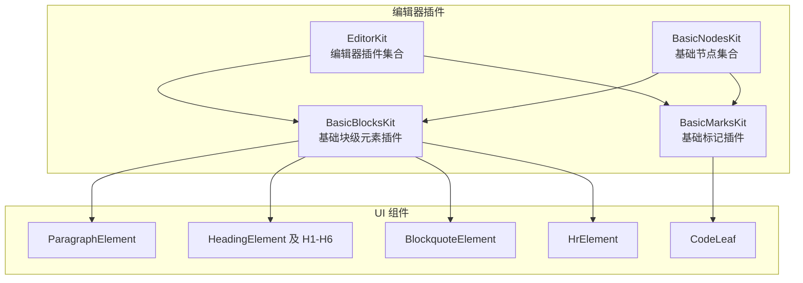
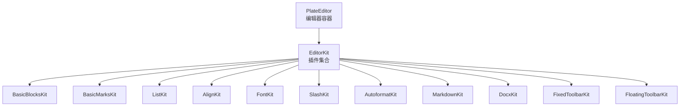
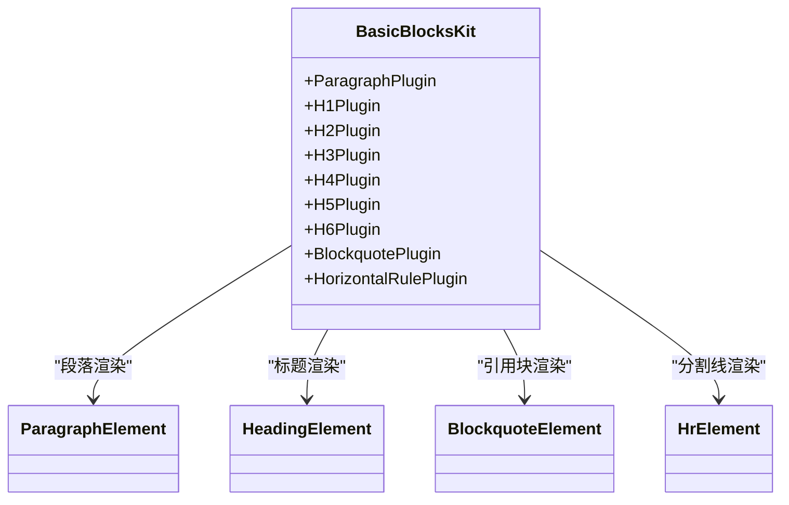
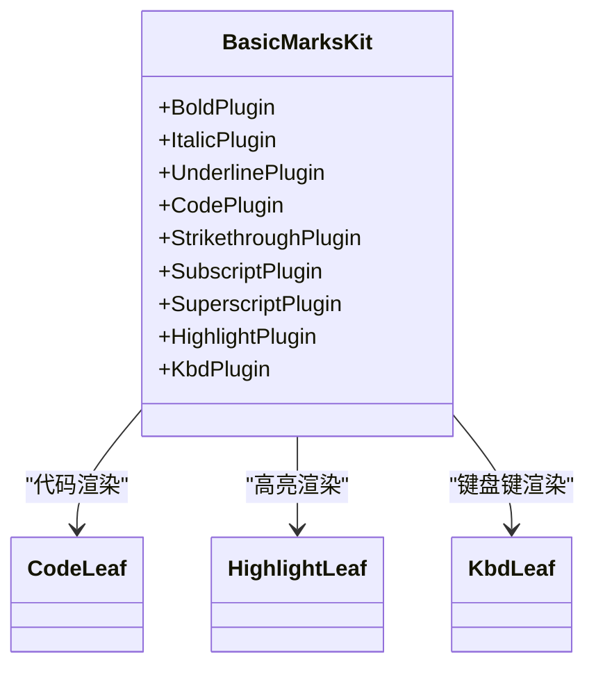
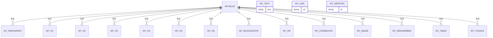
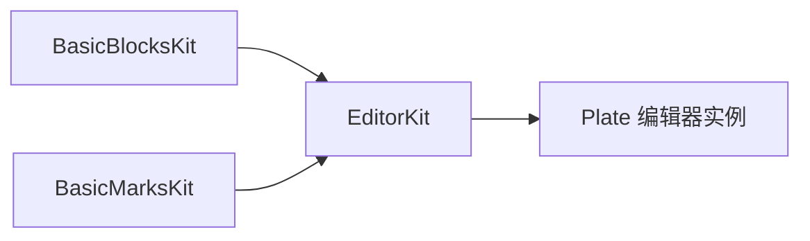

# 基础插件

<cite>
**本文引用的文件**
- [basic-blocks-kit.tsx](file://src/components/editor/plugins/basic-blocks-kit.tsx)
- [basic-blocks-base-kit.tsx](file://src/components/editor/plugins/basic-blocks-base-kit.tsx)
- [basic-marks-kit.tsx](file://src/components/editor/plugins/basic-marks-kit.tsx)
- [basic-marks-base-kit.tsx](file://src/components/editor/plugins/basic-marks-base-kit.tsx)
- [basic-nodes-kit.tsx](file://src/components/editor/plugins/basic-nodes-kit.tsx)
- [editor-kit.tsx](file://src/components/editor/editor-kit.tsx)
- [plate-editor.tsx](file://src/components/editor/plate-editor.tsx)
- [plate-types.ts](file://src/components/editor/plate-types.ts)
- [paragraph-node.tsx](file://src/components/ui/paragraph-node.tsx)
- [heading-node.tsx](file://src/components/ui/heading-node.tsx)
- [blockquote-node.tsx](file://src/components/ui/blockquote-node.tsx)
- [hr-node.tsx](file://src/components/ui/hr-node.tsx)
- [code-node.tsx](file://src/components/ui/code-node.tsx)
- [heading-node-static.tsx](file://src/components/ui/heading-node-static.tsx)
- [blockquote-node-static.tsx](file://src/components/ui/blockquote-node-static.tsx)
</cite>

## 目录
1. [简介](#简介)
2. [项目结构](#项目结构)
3. [核心组件](#核心组件)
4. [架构总览](#架构总览)
5. [详细组件分析](#详细组件分析)
6. [依赖关系分析](#依赖关系分析)
7. [性能考量](#性能考量)
8. [故障排查指南](#故障排查指南)
9. [结论](#结论)
10. [附录](#附录)

## 简介
本文件系统性地文档化基础插件：基础块级元素插件（BasicBlocksKit）与基础标记插件（BasicMarksKit）。内容涵盖：
- 节点类型定义与渲染规则
- 插件配置项（如快捷键、断行规则）
- 与高级插件的组合关系与依赖
- 插件注册机制与执行顺序
- 使用示例与自定义方法
- 执行顺序与优先级设置建议

## 项目结构
基础插件位于编辑器插件目录中，并通过 EditorKit 统一注册到 Plate 编辑器实例中；同时，静态版本的基础插件用于静态渲染场景。

图表来源
- [basic-blocks-kit.tsx:27-88](file://src/components/editor/plugins/basic-blocks-kit.tsx#L27-L88)
- [basic-marks-kit.tsx:19-41](file://src/components/editor/plugins/basic-marks-kit.tsx#L19-L41)
- [basic-nodes-kit.tsx:3-6](file://src/components/editor/plugins/basic-nodes-kit.tsx#L3-L6)
- [editor-kit.tsx:36-78](file://src/components/editor/editor-kit.tsx#L36-L78)

章节来源
- [editor-kit.tsx:1-83](file://src/components/editor/editor-kit.tsx#L1-L83)
- [basic-blocks-kit.tsx:1-89](file://src/components/editor/plugins/basic-blocks-kit.tsx#L1-L89)
- [basic-marks-kit.tsx:1-42](file://src/components/editor/plugins/basic-marks-kit.tsx#L1-L42)
- [basic-nodes-kit.tsx:1-7](file://src/components/editor/plugins/basic-nodes-kit.tsx#L1-L7)

## 核心组件
- 基础块级元素插件（BasicBlocksKit）
  - 包含段落、标题（H1-H6）、引用块、水平分割线等节点插件。
  - 每个节点插件可配置渲染组件、断行规则与快捷键。
- 基础标记插件（BasicMarksKit）
  - 包含加粗、斜体、下划线、代码、删除线、上标、下标、高亮、键盘键等标记插件。
  - 部分标记支持自定义渲染组件与快捷键。
- 基础节点集合（BasicNodesKit）
  - 将 BasicBlocksKit 与 BasicMarksKit 合并为一个集合，便于快速引入。
- 静态基础插件（BaseBasicBlocksKit/BaseBasicMarksKit）
  - 对应静态渲染场景（非交互），使用静态 UI 组件。

章节来源
- [basic-blocks-kit.tsx:27-88](file://src/components/editor/plugins/basic-blocks-kit.tsx#L27-L88)
- [basic-marks-kit.tsx:19-41](file://src/components/editor/plugins/basic-marks-kit.tsx#L19-L41)
- [basic-nodes-kit.tsx:3-6](file://src/components/editor/plugins/basic-nodes-kit.tsx#L3-L6)
- [basic-blocks-base-kit.tsx:25-35](file://src/components/editor/plugins/basic-blocks-base-kit.tsx#L25-L35)
- [basic-marks-base-kit.tsx:17-27](file://src/components/editor/plugins/basic-marks-base-kit.tsx#L17-L27)

## 架构总览
基础插件通过 EditorKit 注册到 Plate 编辑器，形成“块级元素 + 标记 + 行为扩展 + 解析器 + UI 工具栏”的完整能力集。BasicNodesKit 提供基础节点能力，可与高级插件（列表、对齐、字体、表格、数学公式、日期、链接、提及、媒体等）叠加使用。

图表来源
- [plate-editor.tsx:79-82](file://src/components/editor/plate-editor.tsx#L79-L82)
- [editor-kit.tsx:36-78](file://src/components/editor/editor-kit.tsx#L36-L78)

章节来源
- [plate-editor.tsx:63-175](file://src/components/editor/plate-editor.tsx#L63-L175)
- [editor-kit.tsx:1-83](file://src/components/editor/editor-kit.tsx#L1-L83)

## 详细组件分析

### 基础块级元素插件（BasicBlocksKit）
- 节点类型与渲染
  - 段落：使用 ParagraphElement 渲染，样式简洁，适合正文段落。
  - 标题：HeadingElement 及 H1–H6 组件，按变体渲染不同层级样式。
  - 引用块：BlockquoteElement，左侧边框与斜体样式。
  - 水平分割线：HrElement，支持选中态与焦点态视觉反馈。
- 断行规则与快捷键
  - 标题节点在空内容时支持“重置为空段落”的断行规则。
  - 各标题与引用块提供快捷键切换（例如 mod+alt+1 至 6，mod+shift+.）。
- 配置要点
  - 通过 configure(node: { component }, rules, shortcuts) 设置渲染组件与行为。
  - withComponent(component) 用于直接绑定静态组件（在静态渲染场景使用）。

图表来源
- [basic-blocks-kit.tsx:27-88](file://src/components/editor/plugins/basic-blocks-kit.tsx#L27-L88)
- [paragraph-node.tsx:8-14](file://src/components/ui/paragraph-node.tsx#L8-L14)
- [heading-node.tsx:21-34](file://src/components/ui/heading-node.tsx#L21-L34)
- [blockquote-node.tsx:5-13](file://src/components/ui/blockquote-node.tsx#L5-L13)
- [hr-node.tsx:13-32](file://src/components/ui/hr-node.tsx#L13-L32)

章节来源
- [basic-blocks-kit.tsx:1-89](file://src/components/editor/plugins/basic-blocks-kit.tsx#L1-L89)
- [paragraph-node.tsx:1-15](file://src/components/ui/paragraph-node.tsx#L1-L15)
- [heading-node.tsx:1-59](file://src/components/ui/heading-node.tsx#L1-L59)
- [blockquote-node.tsx:1-14](file://src/components/ui/blockquote-node.tsx#L1-L14)
- [hr-node.tsx:1-33](file://src/components/ui/hr-node.tsx#L1-L33)

### 基础标记插件（BasicMarksKit）
- 节点类型与渲染
  - 加粗、斜体、下划线：默认渲染。
  - 代码：CodeLeaf，内联代码样式。
  - 删除线、上标、下标：默认渲染。
  - 高亮：HighlightLeaf，强调文本背景。
  - 键盘键：KbdLeaf，按键样式。
- 快捷键与组件绑定
  - 代码、高亮、删除线、上标、下标等支持快捷键切换。
  - 通过 configure 或 withComponent 自定义渲染组件。

图表来源
- [basic-marks-kit.tsx:19-41](file://src/components/editor/plugins/basic-marks-kit.tsx#L19-L41)
- [code-node.tsx:6-16](file://src/components/ui/code-node.tsx#L6-L16)

章节来源
- [basic-marks-kit.tsx:1-42](file://src/components/editor/plugins/basic-marks-kit.tsx#L1-L42)
- [code-node.tsx:1-17](file://src/components/ui/code-node.tsx#L1-L17)

### 基础节点集合（BasicNodesKit）
- 将 BasicBlocksKit 与 BasicMarksKit 合并，便于一次性引入基础节点能力。
- 适用于希望快速启用基础块级与标记功能的场景。

章节来源
- [basic-nodes-kit.tsx:1-7](file://src/components/editor/plugins/basic-nodes-kit.tsx#L1-L7)

### 静态基础插件（BaseBasicBlocksKit/BaseBasicMarksKit）
- 用于静态渲染场景（如导出、预览），使用静态 UI 组件（SlateElement/SlateLeaf）。
- 保持与交互版一致的节点语义与样式映射。

章节来源
- [basic-blocks-base-kit.tsx:1-36](file://src/components/editor/plugins/basic-blocks-base-kit.tsx#L1-L36)
- [basic-marks-base-kit.tsx:1-28](file://src/components/editor/plugins/basic-marks-base-kit.tsx#L1-L28)
- [heading-node-static.tsx:20-36](file://src/components/ui/heading-node-static.tsx#L20-L36)
- [blockquote-node-static.tsx:3-11](file://src/components/ui/blockquote-node-static.tsx#L3-L11)

### 节点类型定义与行为特性
- 类型定义
  - 在 plate-types.ts 中定义了丰富的节点类型接口，包括块级元素（段落、标题、引用、分割线、代码块、图片、媒体、表格、切换式区块）与文本标记（富文本、链接、提及、提及输入）。
- 行为特性
  - 标题节点支持断行规则（空内容时重置为空段落）。
  - 水平分割线支持选中态与焦点态视觉反馈。
  - 富文本类型扩展了多种标记属性（基础标记、注释文本、字体标记等）。

图表来源
- [plate-types.ts:25-164](file://src/components/editor/plate-types.ts#L25-L164)

章节来源
- [plate-types.ts:1-164](file://src/components/editor/plate-types.ts#L1-L164)

## 依赖关系分析
- 插件注册与组合
  - EditorKit 将基础插件与其他高级插件（列表、对齐、字体、Markdown/DOCX 解析、工具栏等）统一组织。
  - BasicNodesKit 作为基础能力入口，可与高级插件叠加使用。
- 依赖链路
  - 基础插件依赖 @platejs/basic-nodes 与 platejs 的插件基类。
  - UI 组件依赖 PlateElement/PlateLeaf 与静态渲染组件。
- 执行顺序
  - EditorKit 内部数组顺序即为插件注册顺序，影响事件处理与渲染优先级。

图表来源
- [editor-kit.tsx:36-78](file://src/components/editor/editor-kit.tsx#L36-L78)
- [plate-editor.tsx:79-82](file://src/components/editor/plate-editor.tsx#L79-L82)

章节来源
- [editor-kit.tsx:1-83](file://src/components/editor/editor-kit.tsx#L1-L83)
- [plate-editor.tsx:63-175](file://src/components/editor/plate-editor.tsx#L63-L175)

## 性能考量
- 结构化比较
  - 编辑器内部使用结构化值比较（不依赖 JSON 序列化）来判断内容是否变化，减少不必要的保存状态更新与重渲染。
- 建议
  - 在自定义插件中尽量避免频繁触发全局状态变更。
  - 合理拆分插件集合，按需加载，降低初始注册开销。

章节来源
- [plate-editor.tsx:16-61](file://src/components/editor/plate-editor.tsx#L16-L61)

## 故障排查指南
- 常见问题
  - 快捷键无效：检查插件是否正确注册且未被后续插件覆盖。
  - 标题断行异常：确认断行规则配置是否生效（空内容重置为空段落）。
  - 渲染样式错乱：核对 UI 组件的 className 与 PlateElement/PlateLeaf 的包裹关系。
- 定位方法
  - 逐步注释 EditorKit 中的插件集合，定位冲突插件。
  - 检查节点类型定义是否与实际渲染组件匹配。

章节来源
- [basic-blocks-kit.tsx:27-88](file://src/components/editor/plugins/basic-blocks-kit.tsx#L27-L88)
- [basic-marks-kit.tsx:19-41](file://src/components/editor/plugins/basic-marks-kit.tsx#L19-L41)
- [plate-types.ts:25-164](file://src/components/editor/plate-types.ts#L25-L164)

## 结论
基础插件提供了编辑器中最常用的块级元素与标记能力，配合 EditorKit 可快速构建完整的编辑体验。通过合理配置断行规则与快捷键、选择合适的渲染组件，可在保证一致性的同时满足多样化的排版需求。与高级插件的组合使用可进一步增强功能性与可用性。

## 附录

### 使用示例与自定义方法
- 快速启用基础节点
  - 将 BasicNodesKit 或分别引入 BasicBlocksKit 与 BasicMarksKit。
- 自定义渲染组件
  - 使用 withComponent 或 configure(node: { component }) 替换默认 UI 组件。
- 自定义快捷键
  - 在 configure 中设置 shortcuts.toggle.keys，确保与系统快捷键策略兼容。
- 自定义断行规则
  - 为标题节点配置 rules.break.empty 为 "reset"，实现空内容断行重置。

章节来源
- [basic-blocks-kit.tsx:27-88](file://src/components/editor/plugins/basic-blocks-kit.tsx#L27-L88)
- [basic-marks-kit.tsx:19-41](file://src/components/editor/plugins/basic-marks-kit.tsx#L19-L41)
- [basic-nodes-kit.tsx:3-6](file://src/components/editor/plugins/basic-nodes-kit.tsx#L3-L6)

### 执行顺序与优先级设置
- 插件注册顺序即为执行顺序
  - EditorKit 数组中的先后顺序决定插件的注册与调用优先级。
- 建议
  - 将基础节点置于更前位置，确保其行为与渲染规则先于高级插件生效。
  - 若存在冲突（如快捷键重复），调整相关插件的注册顺序或修改快捷键配置。

章节来源
- [editor-kit.tsx:36-78](file://src/components/editor/editor-kit.tsx#L36-L78)