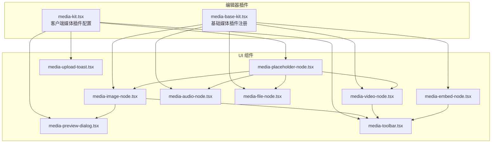
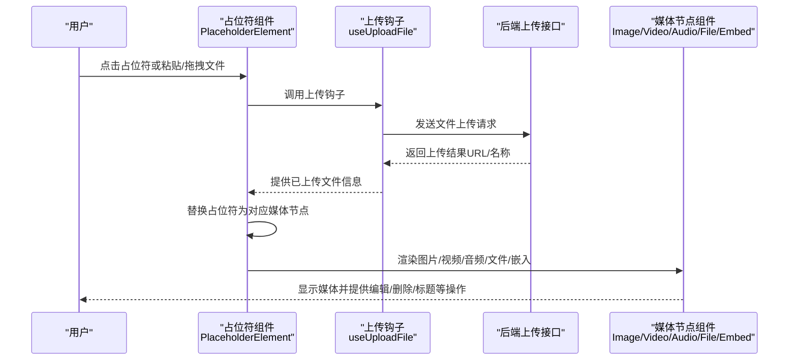
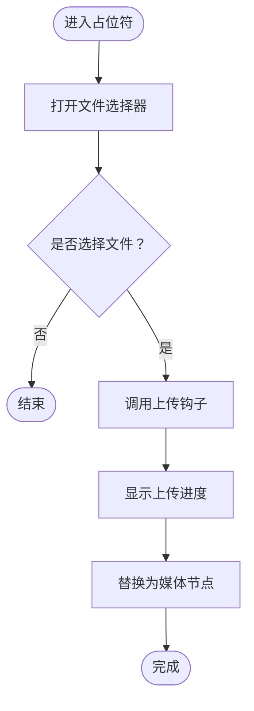
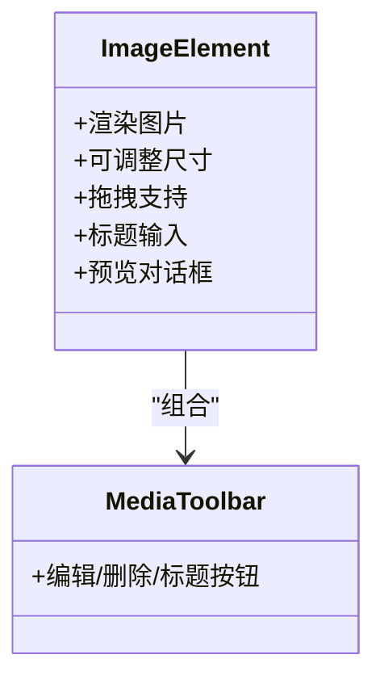
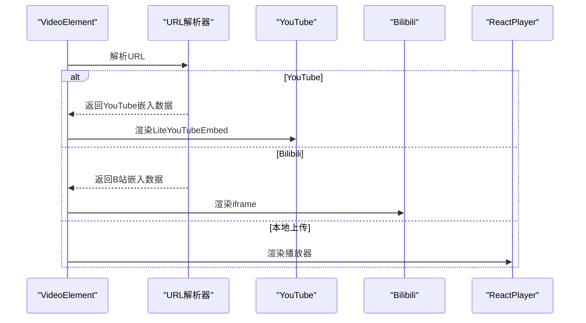
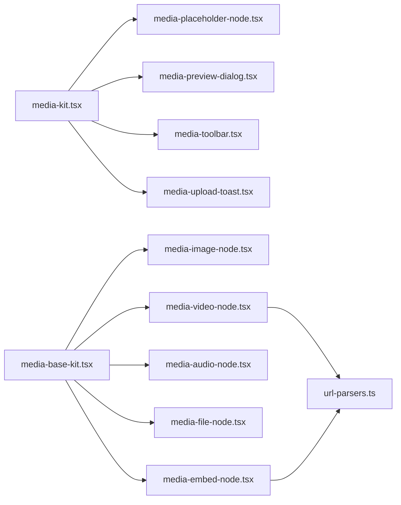

# 媒体内容插件

<cite>
**本文引用的文件**
- [README.md](file://README.md)
- [media-base-kit.tsx](file://src/components/editor/plugins/media-base-kit.tsx)
- [media-kit.tsx](file://src/components/editor/plugins/media-kit.tsx)
- [media-image-node.tsx](file://src/components/ui/media-image-node.tsx)
- [media-video-node.tsx](file://src/components/ui/media-video-node.tsx)
- [media-audio-node.tsx](file://src/components/ui/media-audio-node.tsx)
- [media-file-node.tsx](file://src/components/ui/media-file-node.tsx)
- [media-embed-node.tsx](file://src/components/ui/media-embed-node.tsx)
- [media-placeholder-node.tsx](file://src/components/ui/media-placeholder-node.tsx)
- [media-preview-dialog.tsx](file://src/components/ui/media-preview-dialog.tsx)
- [media-upload-toast.tsx](file://src/components/ui/media-upload-toast.tsx)
- [media-toolbar.tsx](file://src/components/ui/media-toolbar.tsx)
- [url-parsers.ts](file://src/lib/url-parsers.ts)
</cite>

## 目录
1. [简介](#简介)
2. [项目结构](#项目结构)
3. [核心组件](#核心组件)
4. [架构总览](#架构总览)
5. [详细组件分析](#详细组件分析)
6. [依赖关系分析](#依赖关系分析)
7. [性能考虑](#性能考虑)
8. [故障排查指南](#故障排查指南)
9. [结论](#结论)
10. [附录](#附录)

## 简介
本文件系统性地文档化了 ynote-v2 中的媒体内容插件实现，覆盖图片、视频、音频、文件与嵌入式内容的插入、预览、编辑与管理能力。文档重点包括：
- 媒体节点的渲染与交互（图片、视频、音频、文件、嵌入）
- 上传流程、占位符机制与错误提示
- 尺寸控制、可调整容器与缩放工具
- 格式支持与第三方嵌入（如 YouTube、Bilibili、推文等）
- 懒加载与性能优化策略
- 自定义扩展与第三方集成方法
- 安全处理与访问控制建议

## 项目结构
媒体插件由“编辑器插件配置”和“UI 渲染组件”两部分组成：
- 插件层：负责注册媒体类型、占位符行为、上传限制与渲染钩子
- UI 层：负责具体媒体元素的展示、交互与工具栏

**图表来源**
- [media-base-kit.tsx:17-31](file://src/components/editor/plugins/media-base-kit.tsx#L17-L31)
- [media-kit.tsx:23-83](file://src/components/editor/plugins/media-kit.tsx#L23-L83)
- [media-image-node.tsx:20-79](file://src/components/ui/media-image-node.tsx#L20-L79)
- [media-video-node.tsx:23-134](file://src/components/ui/media-video-node.tsx#L23-L134)
- [media-audio-node.tsx:11-38](file://src/components/ui/media-audio-node.tsx#L11-L38)
- [media-file-node.tsx:12-46](file://src/components/ui/media-file-node.tsx#L12-L46)
- [media-embed-node.tsx:24-141](file://src/components/ui/media-embed-node.tsx#L24-L141)
- [media-placeholder-node.tsx:71-205](file://src/components/ui/media-placeholder-node.tsx#L71-L205)
- [media-preview-dialog.tsx:29-145](file://src/components/ui/media-preview-dialog.tsx#L29-L145)
- [media-toolbar.tsx:37-115](file://src/components/ui/media-toolbar.tsx#L37-L115)
- [media-upload-toast.tsx:8-68](file://src/components/ui/media-upload-toast.tsx#L8-L68)

**章节来源**
- [media-base-kit.tsx:1-32](file://src/components/editor/plugins/media-base-kit.tsx#L1-L32)
- [media-kit.tsx:1-84](file://src/components/editor/plugins/media-kit.tsx#L1-L84)

## 核心组件
- 基础媒体插件注册：通过基础插件注册图片、视频、音频、文件、嵌入与占位符，并绑定静态渲染组件
- 客户端媒体插件配置：启用可上传占位符、设置各类媒体的上传限制、配置预览对话框与上传提示

关键职责与行为：
- 图片：支持拖拽、可调整尺寸、带标题与缩放手柄
- 视频：支持 YouTube、Bilibili、本地上传播放；可调整宽高范围
- 音频：内嵌播放控件
- 文件：下载链接与标题
- 嵌入：支持视频与推文，自动解析并生成嵌入链接

**章节来源**
- [media-base-kit.tsx:17-31](file://src/components/editor/plugins/media-base-kit.tsx#L17-L31)
- [media-kit.tsx:23-83](file://src/components/editor/plugins/media-kit.tsx#L23-L83)

## 架构总览
媒体插件采用“插件注册 + 组件渲染”的分层设计，结合 Plate.js 的媒体生态与第三方库实现丰富媒体体验。

**图表来源**
- [media-placeholder-node.tsx:78-140](file://src/components/ui/media-placeholder-node.tsx#L78-L140)
- [media-kit.tsx:23-75](file://src/components/editor/plugins/media-kit.tsx#L23-L75)
- [media-image-node.tsx:20-79](file://src/components/ui/media-image-node.tsx#L20-L79)
- [media-video-node.tsx:23-134](file://src/components/ui/media-video-node.tsx#L23-L134)
- [media-audio-node.tsx:11-38](file://src/components/ui/media-audio-node.tsx#L11-L38)
- [media-file-node.tsx:12-46](file://src/components/ui/media-file-node.tsx#L12-L46)
- [media-embed-node.tsx:24-141](file://src/components/ui/media-embed-node.tsx#L24-L141)

## 详细组件分析

### 媒体占位符与上传流程
- 占位符类型映射：按媒体类型（图片、视频、音频、文件）定义 accept 列表与文案
- 文件选择与多文件处理：使用文件选择器，支持多选并批量插入
- 上传状态与进度：显示上传中文件名、大小与百分比
- 替换逻辑：上传完成后移除占位符并插入对应媒体节点，保留初始宽高与占位符 ID

**图表来源**
- [media-placeholder-node.tsx:89-104](file://src/components/ui/media-placeholder-node.tsx#L89-L104)
- [media-placeholder-node.tsx:106-140](file://src/components/ui/media-placeholder-node.tsx#L106-L140)

**章节来源**
- [media-placeholder-node.tsx:18-69](file://src/components/ui/media-placeholder-node.tsx#L18-L69)
- [media-placeholder-node.tsx:71-205](file://src/components/ui/media-placeholder-node.tsx#L71-L205)

### 图片节点
- 可调整尺寸：提供左右拖拽手柄，支持对齐与只读模式
- 拖拽排序：集成拖拽能力，拖拽时降低透明度
- 标题编辑：支持聚焦态下的标题输入
- 预览对话框：点击图片打开全屏预览，支持缩放与切换

**图表来源**
- [media-image-node.tsx:20-79](file://src/components/ui/media-image-node.tsx#L20-L79)
- [media-toolbar.tsx:37-115](file://src/components/ui/media-toolbar.tsx#L37-L115)
- [media-preview-dialog.tsx:29-145](file://src/components/ui/media-preview-dialog.tsx#L29-L145)

**章节来源**
- [media-image-node.tsx:1-80](file://src/components/ui/media-image-node.tsx#L1-L80)
- [media-toolbar.tsx:1-116](file://src/components/ui/media-toolbar.tsx#L1-L116)
- [media-preview-dialog.tsx:1-153](file://src/components/ui/media-preview-dialog.tsx#L1-L153)

### 视频节点
- 多源支持：YouTube、Bilibili、其他视频源；本地上传使用播放器
- 嵌入解析：集成 URL 解析器，支持 Twitter、视频与 Bilibili
- 尺寸约束：根据内容类型设置最小/最大宽度，推文有固定宽度

**图表来源**
- [media-video-node.tsx:23-134](file://src/components/ui/media-video-node.tsx#L23-L134)
- [url-parsers.ts:12-69](file://src/lib/url-parsers.ts#L12-L69)

**章节来源**
- [media-video-node.tsx:1-135](file://src/components/ui/media-video-node.tsx#L1-L135)
- [url-parsers.ts:1-70](file://src/lib/url-parsers.ts#L1-L70)

### 音频节点
- 内嵌播放控件：提供原生音频播放器
- 标题编辑：支持为音频添加标题

**章节来源**
- [media-audio-node.tsx:1-39](file://src/components/ui/media-audio-node.tsx#L1-L39)

### 文件节点
- 下载链接：以可点击链接形式展示，支持 download 属性
- 标题编辑：支持为文件添加标题

**章节来源**
- [media-file-node.tsx:1-47](file://src/components/ui/media-file-node.tsx#L1-L47)

### 嵌入节点
- 多平台嵌入：视频（YouTube、其他）、推文、Bilibili
- 自适应宽高：根据提供商设置不同的宽高比
- 工具栏：支持编辑链接、标题与删除

**章节来源**
- [media-embed-node.tsx:1-142](file://src/components/ui/media-embed-node.tsx#L1-L142)
- [media-toolbar.tsx:1-116](file://src/components/ui/media-toolbar.tsx#L1-L116)

### 工具栏与预览
- 浮动工具栏：在选中媒体且未处于预览时显示，支持编辑链接、标题与删除
- 预览对话框：图片全屏预览，支持缩放、切换与关闭

**章节来源**
- [media-toolbar.tsx:1-116](file://src/components/ui/media-toolbar.tsx#L1-L116)
- [media-preview-dialog.tsx:1-153](file://src/components/ui/media-preview-dialog.tsx#L1-L153)

## 依赖关系分析
- 插件注册：基础插件注册图片/视频/音频/文件/嵌入与占位符，并绑定静态组件
- 客户端配置：启用上传占位符、设置各类型上传限制、配置预览与上传提示
- 第三方库：@platejs/media、@platejs/resizable、@platejs/dnd、react-lite-youtube-embed、react-player、react-tweet
- 工具函数：URL 解析器用于 Bilibili 嵌入

**图表来源**
- [media-kit.tsx:23-83](file://src/components/editor/plugins/media-kit.tsx#L23-L83)
- [media-base-kit.tsx:17-31](file://src/components/editor/plugins/media-base-kit.tsx#L17-L31)
- [media-placeholder-node.tsx:71-205](file://src/components/ui/media-placeholder-node.tsx#L71-L205)
- [media-preview-dialog.tsx:29-145](file://src/components/ui/media-preview-dialog.tsx#L29-L145)
- [media-toolbar.tsx:37-115](file://src/components/ui/media-toolbar.tsx#L37-L115)
- [media-upload-toast.tsx:8-68](file://src/components/ui/media-upload-toast.tsx#L8-L68)
- [media-video-node.tsx:23-134](file://src/components/ui/media-video-node.tsx#L23-L134)
- [media-embed-node.tsx:24-141](file://src/components/ui/media-embed-node.tsx#L24-L141)
- [url-parsers.ts:12-69](file://src/lib/url-parsers.ts#L12-L69)

**章节来源**
- [media-base-kit.tsx:1-32](file://src/components/editor/plugins/media-base-kit.tsx#L1-L32)
- [media-kit.tsx:1-84](file://src/components/editor/plugins/media-kit.tsx#L1-L84)

## 性能考虑
- 懒加载与延迟初始化
  - 视频节点在编辑器挂载后再渲染本地上传视频，避免不必要的初始化开销
  - 嵌入节点仅在需要时渲染对应 iframe 或 LiteYouTubeEmbed
- 资源释放
  - 图片上传预览使用对象 URL 并在卸载时回收
- 交互优化
  - 拖拽时降低透明度，提升视觉反馈
  - 预览对话框使用固定定位与遮罩层，减少重排
- 体积控制
  - 占位符配置针对不同媒体类型设置最大文件数与大小，防止大文件占用过多带宽与存储

**章节来源**
- [media-video-node.tsx:40-40](file://src/components/ui/media-video-node.tsx#L40-L40)
- [media-placeholder-node.tsx:220-227](file://src/components/ui/media-placeholder-node.tsx#L220-L227)
- [media-kit.tsx:48-71](file://src/components/editor/plugins/media-kit.tsx#L48-L71)

## 故障排查指南
- 上传失败与错误提示
  - 使用上传错误提示组件，根据错误码弹出相应提示（文件大小/类型不合法、超出数量/大小限制等）
- 占位符未替换
  - 检查上传钩子返回值与占位符替换逻辑
- 媒体无法预览
  - 确认预览对话框状态与图片资源可用性
- 嵌入链接无效
  - 检查 URL 解析器是否正确识别目标平台并生成嵌入地址

**章节来源**
- [media-upload-toast.tsx:8-68](file://src/components/ui/media-upload-toast.tsx#L8-L68)
- [media-placeholder-node.tsx:114-140](file://src/components/ui/media-placeholder-node.tsx#L114-L140)
- [media-preview-dialog.tsx:29-145](file://src/components/ui/media-preview-dialog.tsx#L29-L145)
- [url-parsers.ts:12-69](file://src/lib/url-parsers.ts#L12-L69)

## 结论
该媒体插件通过清晰的插件注册与 UI 组件分离，实现了对图片、视频、音频、文件与嵌入内容的统一管理。其上传流程、占位符机制、尺寸控制与第三方嵌入支持构成了完整的富媒体编辑体验。配合懒加载与资源释放策略，可在保证交互流畅的同时兼顾性能与可维护性。

## 附录

### 配置选项与尺寸控制
- 上传限制（示例键值）
  - 图片：最大文件数、最大文件大小、媒体类型、最小文件数
  - 视频：最大文件数、最大文件大小、媒体类型、最小文件数
  - 音频：最大文件数、最大文件大小、媒体类型、最小文件数
  - 其他文件（PDF/文本/压缩包/Office）：最大文件数、最大文件大小、媒体类型、最小文件数
- 尺寸控制
  - 图片/嵌入：可调整宽度，支持对齐与只读模式
  - 视频：根据内容类型设置最小/最大宽度，推文有固定宽度
- 标题与编辑
  - 所有媒体支持标题输入与编辑/删除工具栏

**章节来源**
- [media-kit.tsx:32-75](file://src/components/editor/plugins/media-kit.tsx#L32-L75)
- [media-image-node.tsx:34-61](file://src/components/ui/media-image-node.tsx#L34-L61)
- [media-video-node.tsx:54-61](file://src/components/ui/media-video-node.tsx#L54-L61)
- [media-embed-node.tsx:51-57](file://src/components/ui/media-embed-node.tsx#L51-L57)

### 自定义扩展与第三方集成
- 新增媒体类型
  - 在基础插件中注册新类型并绑定静态组件
  - 在客户端插件中配置上传限制与渲染钩子
- 嵌入平台扩展
  - 在 URL 解析器中新增解析规则，返回标准嵌入数据结构
- UI 组件扩展
  - 为新类型编写渲染组件，复用工具栏与预览能力

**章节来源**
- [media-base-kit.tsx:17-31](file://src/components/editor/plugins/media-base-kit.tsx#L17-L31)
- [media-kit.tsx:23-83](file://src/components/editor/plugins/media-kit.tsx#L23-L83)
- [url-parsers.ts:12-69](file://src/lib/url-parsers.ts#L12-L69)

### 安全处理与访问控制
- 上传安全
  - 服务端应校验文件类型与大小，拒绝非法内容
  - 对上传路径进行随机化命名，避免路径暴露
- 嵌入安全
  - 仅允许可信域名的嵌入，必要时对 iframe 进行 sandbox 限制
- 访问控制
  - 对私有内容增加鉴权与权限检查
  - 对外链嵌入设置 referrer 策略与 CORS 控制

[本节为通用实践建议，无需特定文件引用]