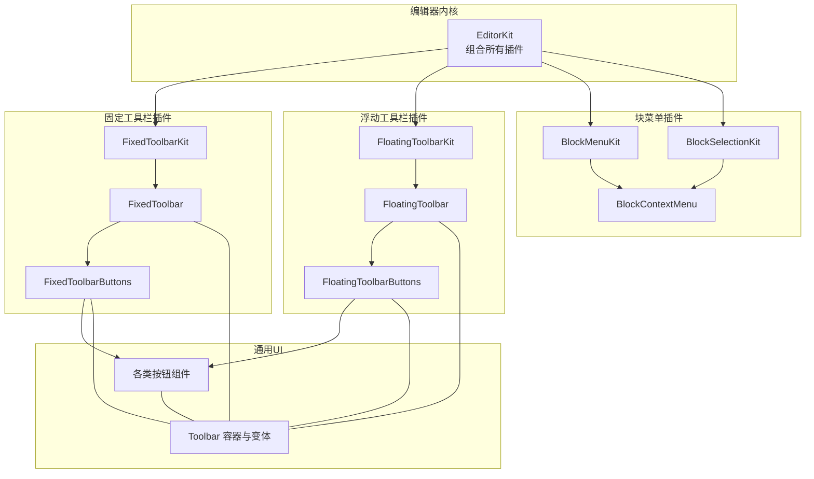
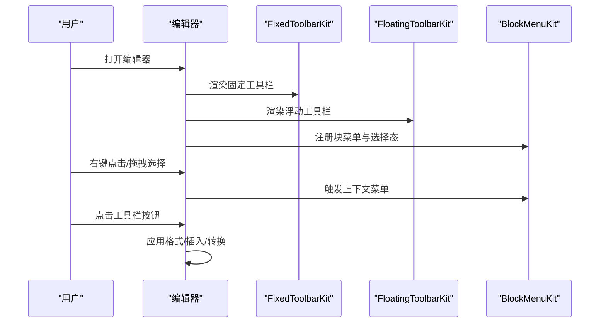
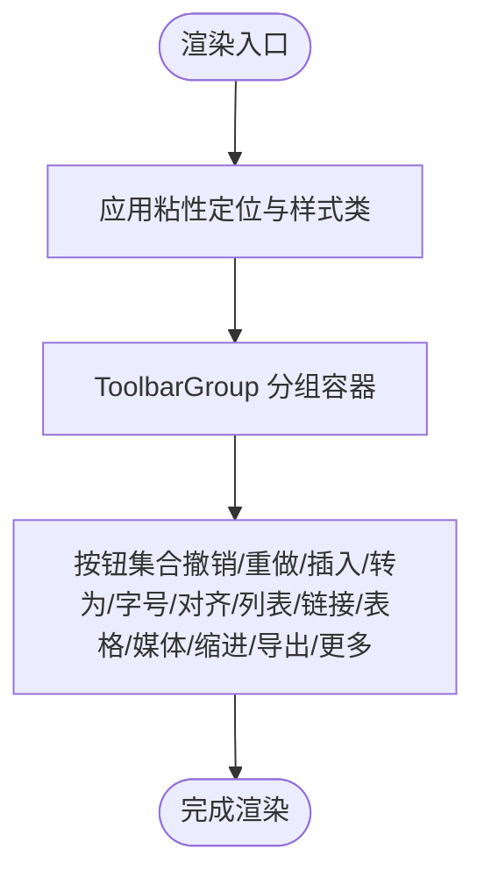
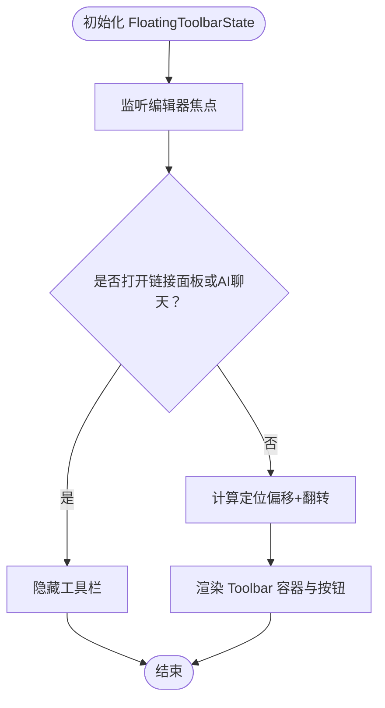
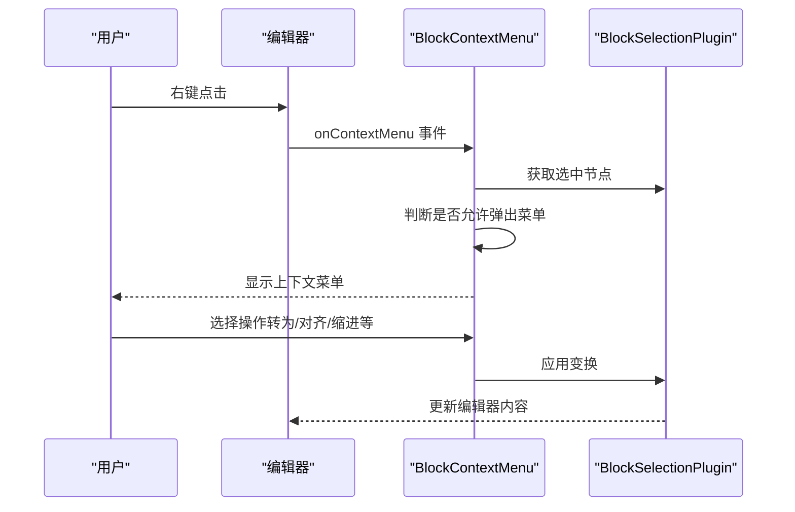
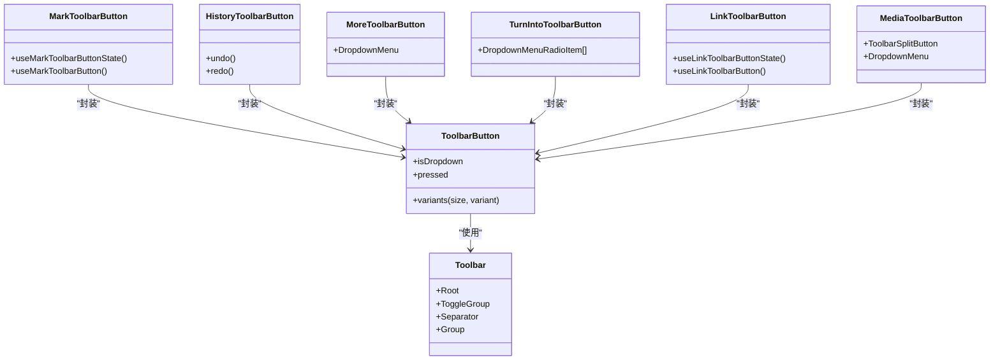
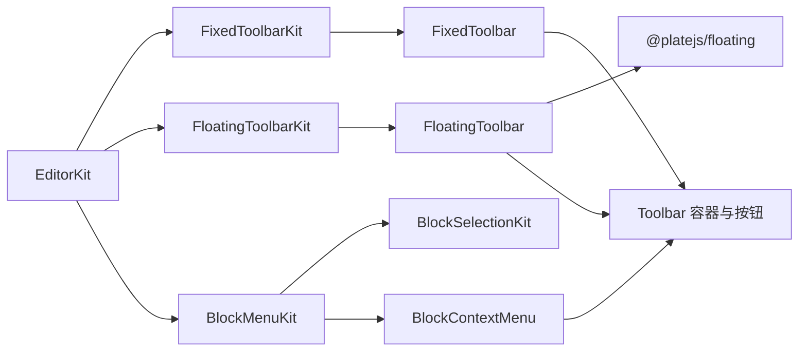

# 工具栏插件

<cite>
**本文引用的文件**
- [src/components/editor/plugins/fixed-toolbar-kit.tsx](file://src/components/editor/plugins/fixed-toolbar-kit.tsx)
- [src/components/editor/plugins/floating-toolbar-kit.tsx](file://src/components/editor/plugins/floating-toolbar-kit.tsx)
- [src/components/editor/plugins/block-menu-kit.tsx](file://src/components/editor/plugins/block-menu-kit.tsx)
- [src/components/editor/plugins/block-selection-kit.tsx](file://src/components/editor/plugins/block-selection-kit.tsx)
- [src/components/editor/editor-kit.tsx](file://src/components/editor/editor-kit.tsx)
- [src/components/ui/fixed-toolbar.tsx](file://src/components/ui/fixed-toolbar.tsx)
- [src/components/ui/floating-toolbar.tsx](file://src/components/ui/floating-toolbar.tsx)
- [src/components/ui/fixed-toolbar-buttons.tsx](file://src/components/ui/fixed-toolbar-buttons.tsx)
- [src/components/ui/floating-toolbar-buttons.tsx](file://src/components/ui/floating-toolbar-buttons.tsx)
- [src/components/ui/toolbar.tsx](file://src/components/ui/toolbar.tsx)
- [src/components/ui/block-context-menu.tsx](file://src/components/ui/block-context-menu.tsx)
- [src/components/ui/mark-toolbar-button.tsx](file://src/components/ui/mark-toolbar-button.tsx)
- [src/components/ui/history-toolbar-button.tsx](file://src/components/ui/history-toolbar-button.tsx)
- [src/components/ui/more-toolbar-button.tsx](file://src/components/ui/more-toolbar-button.tsx)
- [src/components/ui/turn-into-toolbar-button.tsx](file://src/components/ui/turn-into-toolbar-button.tsx)
- [src/components/ui/link-toolbar-button.tsx](file://src/components/ui/link-toolbar-button.tsx)
- [src/components/ui/media-toolbar-button.tsx](file://src/components/ui/media-toolbar-button.tsx)
</cite>

## 目录
1. [简介](#简介)
2. [项目结构](#项目结构)
3. [核心组件](#核心组件)
4. [架构总览](#架构总览)
5. [详细组件分析](#详细组件分析)
6. [依赖关系分析](#依赖关系分析)
7. [性能考量](#性能考量)
8. [故障排查指南](#故障排查指南)
9. [结论](#结论)
10. [附录](#附录)

## 简介
本文件系统性地文档化了 ynote-v2 编辑器中的工具栏插件体系，包括固定工具栏、浮动工具栏与块菜单（上下文菜单）三大部分。文档覆盖以下主题：
- 设计与实现：固定工具栏的粘性定位、浮动工具栏的智能定位与隐藏策略、块菜单的触发与操作集合
- 配置与扩展：按钮配置、事件处理、样式定制与可访问性提示
- 定位策略与显示逻辑：基于 Plate.js 的渲染钩子与 @platejs/floating 的定位中间件
- 自定义按钮与功能扩展：通过 Toolbar 组件体系与 Plate 插件机制进行扩展
- 响应式与移动端适配：工具栏在不同设备上的表现与交互优化
- 同步机制：工具栏状态与编辑器内容、选区、只读状态的联动

## 项目结构
工具栏相关代码主要分布在两个层次：
- 插件层：以 Plate 插件形式注册工具栏 UI，负责在编辑器中插入工具栏 DOM
- UI 层：提供通用的工具栏容器、按钮、分组与样式变体，并封装具体功能按钮

图表来源
- [src/components/editor/editor-kit.tsx:36-78](file://src/components/editor/editor-kit.tsx#L36-L78)
- [src/components/editor/plugins/fixed-toolbar-kit.tsx:8-19](file://src/components/editor/plugins/fixed-toolbar-kit.tsx#L8-L19)
- [src/components/editor/plugins/floating-toolbar-kit.tsx:8-19](file://src/components/editor/plugins/floating-toolbar-kit.tsx#L8-L19)
- [src/components/editor/plugins/block-menu-kit.tsx:9-14](file://src/components/editor/plugins/block-menu-kit.tsx#L9-L14)
- [src/components/editor/plugins/block-selection-kit.tsx:8-26](file://src/components/editor/plugins/block-selection-kit.tsx#L8-L26)
- [src/components/ui/fixed-toolbar.tsx:7-17](file://src/components/ui/fixed-toolbar.tsx#L7-L17)
- [src/components/ui/floating-toolbar.tsx:23-86](file://src/components/ui/floating-toolbar.tsx#L23-L86)
- [src/components/ui/toolbar.tsx:18-389](file://src/components/ui/toolbar.tsx#L18-L389)

章节来源
- [src/components/editor/editor-kit.tsx:36-78](file://src/components/editor/editor-kit.tsx#L36-L78)

## 核心组件
- 固定工具栏插件：通过 Plate 插件在“可编辑区域之前”注入固定工具栏，使用 FixedToolbar 作为容器，内部放置 FixedToolbarButtons
- 浮动工具栏插件：通过 Plate 插件在“可编辑区域之后”注入浮动工具栏，使用 FloatingToolbar 作为容器，内部放置 FloatingToolbarButtons
- 块菜单插件：结合 BlockMenuPlugin 与 BlockSelectionKit，在编辑器根节点下方渲染 BlockContextMenu，支持右键菜单与触摸设备兼容

章节来源
- [src/components/editor/plugins/fixed-toolbar-kit.tsx:8-19](file://src/components/editor/plugins/fixed-toolbar-kit.tsx#L8-L19)
- [src/components/editor/plugins/floating-toolbar-kit.tsx:8-19](file://src/components/editor/plugins/floating-toolbar-kit.tsx#L8-L19)
- [src/components/editor/plugins/block-menu-kit.tsx:9-14](file://src/components/editor/plugins/block-menu-kit.tsx#L9-L14)
- [src/components/editor/plugins/block-selection-kit.tsx:8-26](file://src/components/editor/plugins/block-selection-kit.tsx#L8-L26)

## 架构总览
工具栏插件的运行时流程如下：
- EditorKit 将固定工具栏、浮动工具栏与块菜单插件统一注册到编辑器实例
- 固定工具栏在编辑器上方以粘性定位显示；浮动工具栏根据光标位置与内容布局自动计算最佳位置，并在特定条件（如链接面板或 AI 聊天打开）下隐藏
- 块菜单在编辑器根节点处监听右键事件，按需弹出上下文菜单，支持“转为”、“对齐”、“缩进/外缩进”等操作

图表来源
- [src/components/editor/editor-kit.tsx:36-78](file://src/components/editor/editor-kit.tsx#L36-L78)
- [src/components/editor/plugins/fixed-toolbar-kit.tsx:8-19](file://src/components/editor/plugins/fixed-toolbar-kit.tsx#L8-L19)
- [src/components/editor/plugins/floating-toolbar-kit.tsx:8-19](file://src/components/editor/plugins/floating-toolbar-kit.tsx#L8-L19)
- [src/components/editor/plugins/block-menu-kit.tsx:9-14](file://src/components/editor/plugins/block-menu-kit.tsx#L9-L14)

## 详细组件分析

### 固定工具栏（FixedToolbar）
- 定位策略：使用粘性定位，顶部固定，随页面滚动保持可见
- 显示逻辑：在编辑器“可编辑区域之前”渲染，宽度占满父容器，背景半透明并启用模糊效果
- 按钮组织：通过 FixedToolbarButtons 分组排列，包含撤销/重做、插入/转为、字号、对齐、列表、链接、表格、媒体、缩进、导出、更多等

图表来源
- [src/components/ui/fixed-toolbar.tsx:7-17](file://src/components/ui/fixed-toolbar.tsx#L7-L17)
- [src/components/ui/fixed-toolbar-buttons.tsx:43-104](file://src/components/ui/fixed-toolbar-buttons.tsx#L43-L104)
- [src/components/ui/toolbar.tsx:264-283](file://src/components/ui/toolbar.tsx#L264-L283)

章节来源
- [src/components/ui/fixed-toolbar.tsx:7-17](file://src/components/ui/fixed-toolbar.tsx#L7-L17)
- [src/components/ui/fixed-toolbar-buttons.tsx:43-104](file://src/components/ui/fixed-toolbar-buttons.tsx#L43-L104)

### 浮动工具栏（FloatingToolbar）
- 定位策略：基于 @platejs/floating 的 useFloatingToolbarState/useFloatingToolbar，支持偏移、翻转（flip）与多回退方向，自动避开视口边缘
- 显示逻辑：当编辑器获得焦点且未处于链接面板或 AI 聊天打开状态时显示；否则隐藏
- 按钮组织：聚焦于内联标记（加粗、斜体、下划线、删除线、代码、高亮）、公式、链接与“更多”菜单

图表来源
- [src/components/ui/floating-toolbar.tsx:36-64](file://src/components/ui/floating-toolbar.tsx#L36-L64)
- [src/components/ui/floating-toolbar.tsx:70-86](file://src/components/ui/floating-toolbar.tsx#L70-L86)
- [src/components/ui/floating-toolbar-buttons.tsx:21-73](file://src/components/ui/floating-toolbar-buttons.tsx#L21-L73)

章节来源
- [src/components/ui/floating-toolbar.tsx:36-64](file://src/components/ui/floating-toolbar.tsx#L36-L64)
- [src/components/ui/floating-toolbar.tsx:70-86](file://src/components/ui/floating-toolbar.tsx#L70-L86)
- [src/components/ui/floating-toolbar-buttons.tsx:21-73](file://src/components/ui/floating-toolbar-buttons.tsx#L21-L73)

### 块菜单（BlockContextMenu）
- 触发方式：在编辑器根节点上监听右键事件；触摸设备默认不弹出菜单，避免误触
- 功能集合：删除、复制、转为（段落/标题/引用/代码块等）、缩进/外缩进、对齐（左/居中/右）
- 与选择态联动：基于 BlockSelectionPlugin 获取当前选中块，批量应用变换

图表来源
- [src/components/ui/block-context-menu.tsx:24-183](file://src/components/ui/block-context-menu.tsx#L24-L183)
- [src/components/editor/plugins/block-selection-kit.tsx:8-26](file://src/components/editor/plugins/block-selection-kit.tsx#L8-L26)
- [src/components/editor/plugins/block-menu-kit.tsx:9-14](file://src/components/editor/plugins/block-menu-kit.tsx#L9-L14)

章节来源
- [src/components/ui/block-context-menu.tsx:24-183](file://src/components/ui/block-context-menu.tsx#L24-L183)
- [src/components/editor/plugins/block-selection-kit.tsx:8-26](file://src/components/editor/plugins/block-selection-kit.tsx#L8-L26)
- [src/components/editor/plugins/block-menu-kit.tsx:9-14](file://src/components/editor/plugins/block-menu-kit.tsx#L9-L14)

### 通用工具栏容器与按钮体系（Toolbar 与按钮）
- Toolbar 容器：提供根元素、分隔符、切换组、分组容器等基础能力
- 按钮变体：通过 cva 定义尺寸与外观变体，支持下拉箭头、分割按钮等复合形态
- 可访问性：内置 Tooltip 包装器，支持延迟挂载与侧偏移控制
- 典型按钮：
  - MarkToolbarButton：内联标记按钮（加粗、斜体、下划线等），基于 useMarkToolbarButtonState/useMarkToolbarButton
  - HistoryToolbarButton：撤销/重做按钮，基于编辑器历史栈状态禁用/启用
  - MoreToolbarButton：更多菜单，提供键盘输入、上标/下标等快捷插入
  - TurnIntoToolbarButton：将当前块转为其他类型（标题、列表、代码块等）
  - LinkToolbarButton：链接按钮，集成 @platejs/link 的状态管理
  - MediaToolbarButton：媒体插入（图片/视频/音频/文件），支持上传与 URL 插入

图表来源
- [src/components/ui/toolbar.tsx:18-389](file://src/components/ui/toolbar.tsx#L18-L389)
- [src/components/ui/mark-toolbar-button.tsx:8-20](file://src/components/ui/mark-toolbar-button.tsx#L8-L20)
- [src/components/ui/history-toolbar-button.tsx:9-51](file://src/components/ui/history-toolbar-button.tsx#L9-L51)
- [src/components/ui/more-toolbar-button.tsx:24-80](file://src/components/ui/more-toolbar-button.tsx#L24-L80)
- [src/components/ui/turn-into-toolbar-button.tsx:136-198](file://src/components/ui/turn-into-toolbar-button.tsx#L136-L198)
- [src/components/ui/link-toolbar-button.tsx:12-23](file://src/components/ui/link-toolbar-button.tsx#L12-L23)
- [src/components/ui/media-toolbar-button.tsx:79-228](file://src/components/ui/media-toolbar-button.tsx#L79-L228)

章节来源
- [src/components/ui/toolbar.tsx:18-389](file://src/components/ui/toolbar.tsx#L18-L389)
- [src/components/ui/mark-toolbar-button.tsx:8-20](file://src/components/ui/mark-toolbar-button.tsx#L8-L20)
- [src/components/ui/history-toolbar-button.tsx:9-51](file://src/components/ui/history-toolbar-button.tsx#L9-L51)
- [src/components/ui/more-toolbar-button.tsx:24-80](file://src/components/ui/more-toolbar-button.tsx#L24-L80)
- [src/components/ui/turn-into-toolbar-button.tsx:136-198](file://src/components/ui/turn-into-toolbar-button.tsx#L136-L198)
- [src/components/ui/link-toolbar-button.tsx:12-23](file://src/components/ui/link-toolbar-button.tsx#L12-L23)
- [src/components/ui/media-toolbar-button.tsx:79-228](file://src/components/ui/media-toolbar-button.tsx#L79-L228)

## 依赖关系分析
- 插件注册顺序影响渲染位置：固定工具栏在“beforeEditable”，浮动工具栏在“afterEditable”
- 浮动工具栏依赖 @platejs/floating 的定位与状态管理，同时受编辑器焦点与特定插件状态（如链接模式、AI 聊天）影响
- 块菜单依赖 BlockMenuPlugin 与 BlockSelectionPlugin，结合触摸设备检测决定是否启用右键菜单

图表来源
- [src/components/editor/editor-kit.tsx:36-78](file://src/components/editor/editor-kit.tsx#L36-L78)
- [src/components/editor/plugins/fixed-toolbar-kit.tsx:8-19](file://src/components/editor/plugins/fixed-toolbar-kit.tsx#L8-L19)
- [src/components/editor/plugins/floating-toolbar-kit.tsx:8-19](file://src/components/editor/plugins/floating-toolbar-kit.tsx#L8-L19)
- [src/components/editor/plugins/block-menu-kit.tsx:9-14](file://src/components/editor/plugins/block-menu-kit.tsx#L9-L14)
- [src/components/editor/plugins/block-selection-kit.tsx:8-26](file://src/components/editor/plugins/block-selection-kit.tsx#L8-L26)
- [src/components/ui/floating-toolbar.tsx:3-16](file://src/components/ui/floating-toolbar.tsx#L3-L16)

章节来源
- [src/components/editor/editor-kit.tsx:36-78](file://src/components/editor/editor-kit.tsx#L36-L78)
- [src/components/ui/floating-toolbar.tsx:3-16](file://src/components/ui/floating-toolbar.tsx#L3-L16)

## 性能考量
- 浮动工具栏的定位计算包含偏移与翻转中间件，建议在内容密集场景下避免过度频繁的重排；可通过减少不必要的 children 或使用虚拟化手段降低渲染压力
- 固定工具栏仅在编辑器上方渲染一次，性能开销较低；注意避免在按钮组中引入重型子组件
- 块菜单在触摸设备默认关闭，减少误触与额外渲染；右键事件仅在非只读与允许上下文菜单时触发
- 按钮状态查询（如撤销/重做可用性、标记激活状态）基于编辑器选择器与状态钩子，避免手动轮询导致的重复渲染

## 故障排查指南
- 浮动工具栏不显示
  - 检查编辑器是否获得焦点
  - 确认未处于链接面板或 AI 聊天打开状态
  - 查看定位中间件参数（偏移、翻转回退方向、视口边界）
- 固定工具栏样式异常
  - 确认粘性定位与背景模糊类是否正确应用
  - 检查按钮组的分隔符与间距类
- 块菜单不弹出
  - 触摸设备默认禁用右键菜单，确认设备类型
  - 检查只读状态与数据集属性（如禁止右键）
- 按钮不可用
  - 撤销/重做按钮需依据编辑器历史栈长度判断
  - 内联标记按钮需依据当前选区的标记状态判断

章节来源
- [src/components/ui/floating-toolbar.tsx:36-64](file://src/components/ui/floating-toolbar.tsx#L36-L64)
- [src/components/ui/fixed-toolbar.tsx:7-17](file://src/components/ui/fixed-toolbar.tsx#L7-L17)
- [src/components/ui/block-context-menu.tsx:24-183](file://src/components/ui/block-context-menu.tsx#L24-L183)
- [src/components/ui/history-toolbar-button.tsx:13-16](file://src/components/ui/history-toolbar-button.tsx#L13-L16)

## 结论
该工具栏插件体系以 Plate 插件为核心，结合 @platejs/floating 提供的智能定位能力，实现了固定与浮动两种工具栏形态，并通过块菜单增强块级操作体验。通用的 Toolbar 容器与按钮体系保证了良好的可扩展性与一致性。通过合理的定位策略、显示逻辑与状态同步，工具栏在桌面与移动端均能提供流畅的编辑体验。

## 附录

### 工具栏按钮配置与事件处理清单
- 撤销/重做：基于编辑器历史栈状态禁用/启用，点击执行对应操作
- 内联标记：基于 useMarkToolbarButtonState/useMarkToolbarButton 管理激活态与点击行为
- 更多菜单：提供键盘输入、上标/下标等快捷插入
- 转为菜单：根据当前块类型动态展示目标类型列表，支持图标与关键词匹配
- 链接按钮：集成 @platejs/link 的状态管理
- 媒体按钮：支持上传与 URL 插入，提供分割按钮与下拉菜单

章节来源
- [src/components/ui/history-toolbar-button.tsx:9-51](file://src/components/ui/history-toolbar-button.tsx#L9-L51)
- [src/components/ui/mark-toolbar-button.tsx:8-20](file://src/components/ui/mark-toolbar-button.tsx#L8-L20)
- [src/components/ui/more-toolbar-button.tsx:24-80](file://src/components/ui/more-toolbar-button.tsx#L24-L80)
- [src/components/ui/turn-into-toolbar-button.tsx:136-198](file://src/components/ui/turn-into-toolbar-button.tsx#L136-L198)
- [src/components/ui/link-toolbar-button.tsx:12-23](file://src/components/ui/link-toolbar-button.tsx#L12-L23)
- [src/components/ui/media-toolbar-button.tsx:79-228](file://src/components/ui/media-toolbar-button.tsx#L79-L228)

### 样式定制与可访问性
- 使用 ToolbarButton 的 size/variant 变体与 isDropdown/presse 等属性控制外观与交互
- Tooltip 包装器支持延迟挂载与侧偏移，提升移动端可读性
- 下拉菜单采用模态关闭策略，避免与工具栏外部交互冲突

章节来源
- [src/components/ui/toolbar.tsx:67-87](file://src/components/ui/toolbar.tsx#L67-L87)
- [src/components/ui/toolbar.tsx:298-328](file://src/components/ui/toolbar.tsx#L298-L328)
- [src/components/ui/toolbar.tsx:330-354](file://src/components/ui/toolbar.tsx#L330-L354)

### 响应式与移动端适配
- 固定工具栏：溢出时启用横向滚动条，确保按钮可访问
- 浮动工具栏：限制最大宽度，避免遮挡编辑内容；翻转中间件自动调整位置
- 块菜单：触摸设备禁用右键菜单，避免误触；支持子菜单展开

章节来源
- [src/components/ui/fixed-toolbar.tsx:7-17](file://src/components/ui/fixed-toolbar.tsx#L7-L17)
- [src/components/ui/floating-toolbar.tsx:75-79](file://src/components/ui/floating-toolbar.tsx#L75-L79)
- [src/components/ui/block-context-menu.tsx:58-60](file://src/components/ui/block-context-menu.tsx#L58-L60)

### 自定义按钮与功能扩展
- 新增按钮：基于 ToolbarButton/ToolbarGroup/ToolbarMenuGroup 组合，参考现有按钮组件的实现模式
- 扩展浮动/固定按钮组：在 FixedToolbarButtons/FloatingToolbarButtons 中添加新的按钮分组
- 与编辑器联动：通过 useEditorRef/useEditorSelector/usePlateState 等钩子获取编辑器状态，实现按钮的启用/禁用与显示逻辑

章节来源
- [src/components/ui/fixed-toolbar-buttons.tsx:43-104](file://src/components/ui/fixed-toolbar-buttons.tsx#L43-L104)
- [src/components/ui/floating-toolbar-buttons.tsx:21-73](file://src/components/ui/floating-toolbar-buttons.tsx#L21-L73)
- [src/components/ui/toolbar.tsx:18-389](file://src/components/ui/toolbar.tsx#L18-L389)