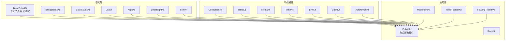
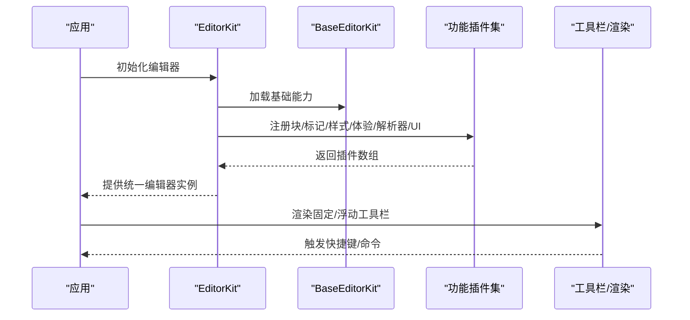
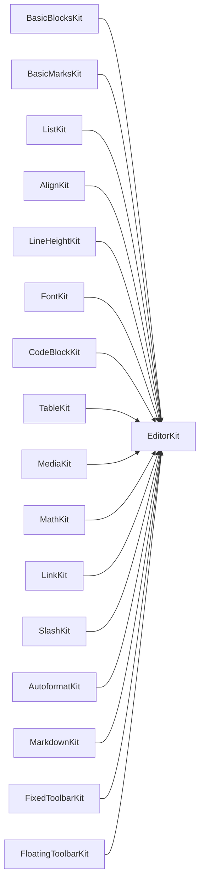

# 编辑器插件系统

<cite>
**本文引用的文件**
- [src/components/editor/editor-kit.tsx](file://src/components/editor/editor-kit.tsx)
- [src/components/editor/editor-base-kit.tsx](file://src/components/editor/editor-base-kit.tsx)
- [src/components/editor/plugins/basic-blocks-kit.tsx](file://src/components/editor/plugins/basic-blocks-kit.tsx)
- [src/components/editor/plugins/basic-marks-kit.tsx](file://src/components/editor/plugins/basic-marks-kit.tsx)
- [src/components/editor/plugins/code-block-kit.tsx](file://src/components/editor/plugins/code-block-kit.tsx)
- [src/components/editor/plugins/table-kit.tsx](file://src/components/editor/plugins/table-kit.tsx)
- [src/components/editor/plugins/media-kit.tsx](file://src/components/editor/plugins/media-kit.tsx)
- [src/components/editor/plugins/math-kit.tsx](file://src/components/editor/plugins/math-kit.tsx)
- [src/components/editor/plugins/link-kit.tsx](file://src/components/editor/plugins/link-kit.tsx)
- [src/components/editor/plugins/list-kit.tsx](file://src/components/editor/plugins/list-kit.tsx)
- [src/components/editor/plugins/fixed-toolbar-kit.tsx](file://src/components/editor/plugins/fixed-toolbar-kit.tsx)
- [src/components/editor/plugins/floating-toolbar-kit.tsx](file://src/components/editor/plugins/floating-toolbar-kit.tsx)
- [src/components/editor/plugins/slash-kit.tsx](file://src/components/editor/plugins/slash-kit.tsx)
- [src/components/editor/plugins/autoformat-kit.tsx](file://src/components/editor/plugins/autoformat-kit.tsx)
- [src/components/editor/plugins/markdown-kit.tsx](file://src/components/editor/plugins/markdown-kit.tsx)
</cite>

## 目录
1. [简介](#简介)
2. [项目结构](#项目结构)
3. [核心组件](#核心组件)
4. [架构总览](#架构总览)
5. [详细组件分析](#详细组件分析)
6. [依赖分析](#依赖分析)
7. [性能考虑](#性能考虑)
8. [故障排查指南](#故障排查指南)
9. [结论](#结论)
10. [附录](#附录)

## 简介
本文件系统性梳理编辑器插件体系，围绕 EditorKit 插件集合的组织与配置展开，解释插件系统的架构设计与扩展机制，文档化基础插件、块级元素插件、内联标记插件、列表与样式、媒体与数学公式、链接与自动格式化、Markdown 解析与工具栏等模块的功能特性与交互关系。同时给出插件注册、配置与生命周期管理的实践建议，以及性能优化与调试方法，并提供可操作的定制与扩展示例路径。

## 项目结构
编辑器插件系统采用“分层聚合”的组织方式：
- 基础层（BaseEditorKit）：定义通用的基础节点与标记插件集合，便于在不同场景下复用与组合。
- 应用层（EditorKit）：在基础层之上叠加编辑体验相关插件（如自动格式化、光标覆盖、菜单、拖拽、表情、退出断行等），以及解析器（Markdown、DOCX）与 UI 工具栏。
- 插件目录：每个功能域独立成套 Kit 文件，清晰分离职责，降低耦合度。

图表来源
- [src/components/editor/editor-kit.tsx:36-78](file://src/components/editor/editor-kit.tsx#L36-L78)
- [src/components/editor/editor-base-kit.tsx:20-39](file://src/components/editor/editor-base-kit.tsx#L20-L39)

章节来源
- [src/components/editor/editor-kit.tsx:1-83](file://src/components/editor/editor-kit.tsx#L1-L83)
- [src/components/editor/editor-base-kit.tsx:1-40](file://src/components/editor/editor-base-kit.tsx#L1-L40)

## 核心组件
- EditorKit：应用层插件聚合器，按“元素/标记/块样式/编辑体验/解析器/UI”顺序组织，确保渲染与行为的协调。
- BaseEditorKit：基础能力集合，包含基础块节点、代码块、表格、切换、目录、媒体、标注、列布局、数学、日期、链接、提及、基础标记、字体、列表、对齐、行高等。
- 各功能 Kit：以数组形式导出一组插件配置，统一通过 configure/withComponent 挂载 UI 组件或设置快捷键、渲染钩子等。

章节来源
- [src/components/editor/editor-kit.tsx:36-78](file://src/components/editor/editor-kit.tsx#L36-L78)
- [src/components/editor/editor-base-kit.tsx:20-39](file://src/components/editor/editor-base-kit.tsx#L20-L39)

## 架构总览
EditorKit 将多个 Kit 按功能域拼接，形成完整的编辑器能力矩阵。其执行顺序遵循“元素 → 标记 → 块样式 → 编辑体验 → 解析器 → UI”的层次，既保证了渲染优先级，也避免了相互干扰。

图表来源
- [src/components/editor/editor-kit.tsx:36-78](file://src/components/editor/editor-kit.tsx#L36-L78)
- [src/components/editor/editor-base-kit.tsx:20-39](file://src/components/editor/editor-base-kit.tsx#L20-L39)

## 详细组件分析

### 基础块级元素插件（BasicBlocksKit）
- 职责：提供段落、标题（H1-H6）、引用块、水平分割线等基础块级元素。
- 关键点：通过 configure 设置节点组件、快捷键与断行规则；使用 withComponent 挂载自定义渲染组件。
- 典型行为：空内容断行时重置为段落，提升输入连续性。

章节来源
- [src/components/editor/plugins/basic-blocks-kit.tsx:27-88](file://src/components/editor/plugins/basic-blocks-kit.tsx#L27-L88)

### 基础内联标记插件（BasicMarksKit）
- 职责：提供加粗、斜体、下划线、代码、删除线、上/下标、高亮、键盘键等常用标记。
- 关键点：部分标记通过 configure 设置快捷键；代码与高亮标记绑定自定义渲染组件。

章节来源
- [src/components/editor/plugins/basic-marks-kit.tsx:19-41](file://src/components/editor/plugins/basic-marks-kit.tsx#L19-L41)

### 代码块插件（CodeBlockKit）
- 职责：支持代码块、代码行、语法高亮。
- 关键点：集成 lowlight 进行多语言语法高亮；通过 configure 设置默认快捷键与低亮实例；行与语法节点分别挂载组件。

章节来源
- [src/components/editor/plugins/code-block-kit.tsx:18-26](file://src/components/editor/plugins/code-block-kit.tsx#L18-L26)

### 表格插件（TableKit）
- 职责：提供表格、行、单元格、表头等表格元素。
- 关键点：通过 configure 设置初始宽度；各节点通过 withComponent 挂载 UI 组件。

章节来源
- [src/components/editor/plugins/table-kit.tsx:17-26](file://src/components/editor/plugins/table-kit.tsx#L17-L26)

### 媒体插件（MediaKit）
- 职责：支持图片、视频、音频、文件、嵌入媒体、占位符上传、标题说明等。
- 关键点：禁用上传插入模式，改由占位符触发上传流程；为不同媒体类型配置上传限制；通过 render.afterEditable 注入预览对话框与上传提示；启用标题说明功能并限定允许类型。

章节来源
- [src/components/editor/plugins/media-kit.tsx:23-83](file://src/components/editor/plugins/media-kit.tsx#L23-L83)

### 数学公式插件（MathKit）
- 职责：支持行内公式与块级公式。
- 关键点：通过 withComponent 挂载公式渲染组件。

章节来源
- [src/components/editor/plugins/math-kit.tsx:10-13](file://src/components/editor/plugins/math-kit.tsx#L10-L13)

### 链接插件（LinkKit）
- 职责：提供链接节点与悬浮工具栏。
- 关键点：通过 configure 设置渲染钩子，将链接节点与悬浮工具栏注入到编辑器上下文中。

章节来源
- [src/components/editor/plugins/link-kit.tsx:8-15](file://src/components/editor/plugins/link-kit.tsx#L8-L15)

### 列表与样式插件（ListKit）
- 职责：提供有序/无序列表与任务列表，结合缩进能力实现层级结构。
- 关键点：通过 inject.targetPlugins 将列表注入到标题、段落、引用块、代码块、切换块、图片等目标节点；render.belowNodes 挂载列表渲染组件；依赖 IndentKit 实现缩进。

章节来源
- [src/components/editor/plugins/list-kit.tsx:9-26](file://src/components/editor/plugins/list-kit.tsx#L9-L26)

### 固定/浮动工具栏（FixedToolbarKit / FloatingToolbarKit）
- 职责：在编辑器前后注入固定与浮动工具栏，承载按钮与交互。
- 关键点：通过 createPlatePlugin 的 render 钩子注入 UI 组件。

章节来源
- [src/components/editor/plugins/fixed-toolbar-kit.tsx:8-19](file://src/components/editor/plugins/fixed-toolbar-kit.tsx#L8-L19)
- [src/components/editor/plugins/floating-toolbar-kit.tsx:8-19](file://src/components/editor/plugins/floating-toolbar-kit.tsx#L8-L19)

### 斜杠命令插件（SlashKit）
- 职责：提供斜杠命令入口与输入界面，支持快速插入块级元素。
- 关键点：通过 configure 的 triggerQuery 控制在代码块中禁用触发；输入组件通过 withComponent 挂载。

章节来源
- [src/components/editor/plugins/slash-kit.tsx:8-18](file://src/components/editor/plugins/slash-kit.tsx#L8-L18)

### 自动格式化（AutoformatKit）
- 职责：提供智能快捷键自动格式化，涵盖标记、块、列表、数学、法律符号、引号等规则。
- 关键点：通过 configure(options.rules) 注册规则；在规则中使用 query 排除代码块环境；format 回调中可直接操作编辑器状态，实现复杂转换逻辑。

章节来源
- [src/components/editor/plugins/autoformat-kit.tsx:211-236](file://src/components/editor/plugins/autoformat-kit.tsx#L211-L236)

### Markdown 解析（MarkdownKit）
- 职责：将 Markdown 文本解析为编辑器可识别的节点树，支持数学、GFM、MDX、提及等扩展。
- 关键点：通过 configure(options.remarkPlugins) 注入 remark 插件。

章节来源
- [src/components/editor/plugins/markdown-kit.tsx:5-11](file://src/components/editor/plugins/markdown-kit.tsx#L5-L11)

## 依赖分析
- 组件内聚与解耦：每个 Kit 独立维护自身插件数组，仅通过 EditorKit 聚合，降低跨模块耦合。
- 执行顺序：EditorKit 中的数组顺序即为加载顺序，先元素后标记，再样式与编辑体验，最后解析器与 UI，确保渲染与交互的一致性。
- 外部依赖：大量使用 Plate.js 生态（@platejs/*）与第三方库（lowlight、remark-*），通过 configure/withComponent 与 UI 组件桥接。

图表来源
- [src/components/editor/editor-kit.tsx:36-78](file://src/components/editor/editor-kit.tsx#L36-L78)

章节来源
- [src/components/editor/editor-kit.tsx:36-78](file://src/components/editor/editor-kit.tsx#L36-L78)

## 性能考虑
- 按需加载：将重型插件（如代码块语法高亮、Markdown 解析）置于应用层，避免在基础层引入不必要的开销。
- 渲染优化：通过 withComponent 将 UI 组件拆分为细粒度组件，减少不必要的重渲染。
- 规则过滤：在自动格式化与斜杠命令中使用 query 或条件判断，避免在不适用的上下文（如代码块）执行昂贵操作。
- 缓存策略：对语法高亮等计算结果进行缓存，减少重复处理。

## 故障排查指南
- 快捷键冲突：检查多个插件是否在同一键位上注册快捷键，必要时调整某插件的快捷键配置。
- 渲染异常：确认 withComponent 的组件是否正确挂载，且与节点类型匹配；检查 render 钩子的注入位置。
- 自动格式化失效：确认 query 条件是否排除了当前上下文；核对 format 回调中的编辑器操作是否正确。
- 列表注入失败：检查 inject.targetPlugins 是否包含目标节点类型，确保渲染组件与节点一一对应。
- 媒体上传问题：核对占位符配置与上传限制，确认 afterEditable 的提示组件已正确渲染。

## 结论
该插件系统通过“基础层 + 应用层”的双层结构实现了高内聚、低耦合的模块化设计；EditorKit 作为聚合器，清晰地定义了插件的加载顺序与职责边界。借助丰富的功能 Kit 与统一的配置接口，开发者可以快速扩展新能力，同时保持良好的性能与可维护性。

## 附录

### 插件开发规范与最佳实践
- 统一命名：Kit 文件命名为 {Feature}-kit.tsx，导出常量名为 {Feature}Kit。
- 配置优先：优先使用 configure(options) 定义行为，再通过 withComponent 挂载 UI。
- 查询过滤：在可能影响性能的场景（如自动格式化、斜杠命令）加入 query 过滤。
- 组件解耦：UI 组件尽量无副作用，通过 props 传递状态与回调。
- 文档与测试：为 Kit 添加简要注释说明用途与关键配置项；为关键行为编写最小可验证用例。

### 插件生命周期与注册要点
- 注册阶段：在 Kit 内完成插件配置与组件挂载，返回插件数组。
- 加载阶段：EditorKit 按顺序合并各 Kit，形成最终插件集合。
- 运行阶段：插件在编辑器运行时生效，响应用户输入、快捷键与渲染钩子。

### 性能优化与调试方法
- 性能优化
  - 使用 React.memo 包装高频 UI 组件。
  - 对语法高亮与 Markdown 解析结果进行缓存。
  - 在自动格式化规则中尽早 return，避免无效计算。
- 调试方法
  - 使用浏览器开发者工具观察渲染树与事件流。
  - 在关键回调中打印上下文信息（如当前节点类型、编辑器状态）。
  - 逐步注释掉部分 Kit，定位性能瓶颈所在。

### 定制与扩展示例（路径指引）
- 新增块级元素
  - 参考：[src/components/editor/plugins/basic-blocks-kit.tsx:27-88](file://src/components/editor/plugins/basic-blocks-kit.tsx#L27-L88)
  - 步骤：定义节点插件 → 配置组件 → 导出 Kit 数组 → 在 EditorKit 中聚合
- 新增内联标记
  - 参考：[src/components/editor/plugins/basic-marks-kit.tsx:19-41](file://src/components/editor/plugins/basic-marks-kit.tsx#L19-L41)
  - 步骤：选择基础标记插件 → 配置快捷键与渲染 → 导出 Kit 数组 → 在 EditorKit 中聚合
- 新增列表样式
  - 参考：[src/components/editor/plugins/list-kit.tsx:9-26](file://src/components/editor/plugins/list-kit.tsx#L9-L26)
  - 步骤：引入缩进 Kit → 配置 inject.targetPlugins → 挂载渲染组件 → 在 EditorKit 中聚合
- 新增工具栏
  - 参考：[src/components/editor/plugins/fixed-toolbar-kit.tsx:8-19](file://src/components/editor/plugins/fixed-toolbar-kit.tsx#L8-L19)
  - 步骤：使用 createPlatePlugin 创建渲染钩子 → 挂载按钮组件 → 在 EditorKit 中聚合
- 新增自动格式化规则
  - 参考：[src/components/editor/plugins/autoformat-kit.tsx:211-236](file://src/components/editor/plugins/autoformat-kit.tsx#L211-L236)
  - 步骤：定义规则数组 → 在 configure 中注册 → 使用 query 过滤上下文 → 在 format 中操作编辑器
- 新增 Markdown 扩展
  - 参考：[src/components/editor/plugins/markdown-kit.tsx:5-11](file://src/components/editor/plugins/markdown-kit.tsx#L5-L11)
  - 步骤：添加 remark 插件 → 在 configure.options.remarkPlugins 中注册