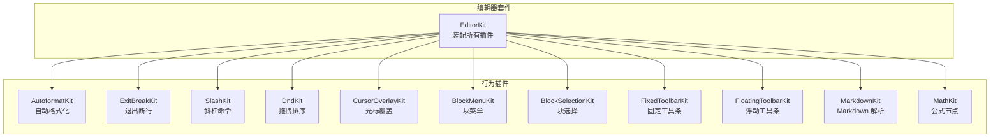
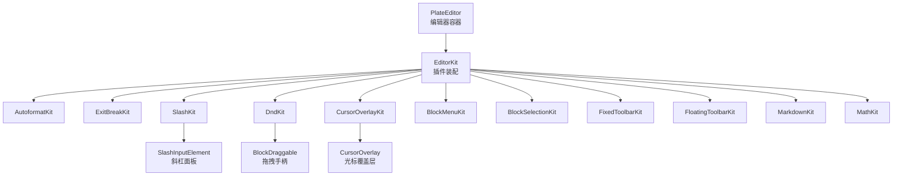
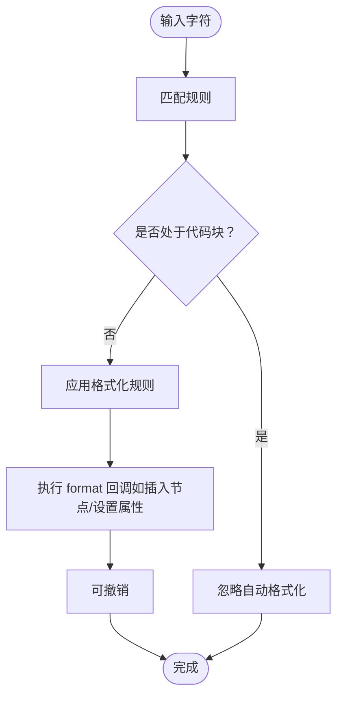
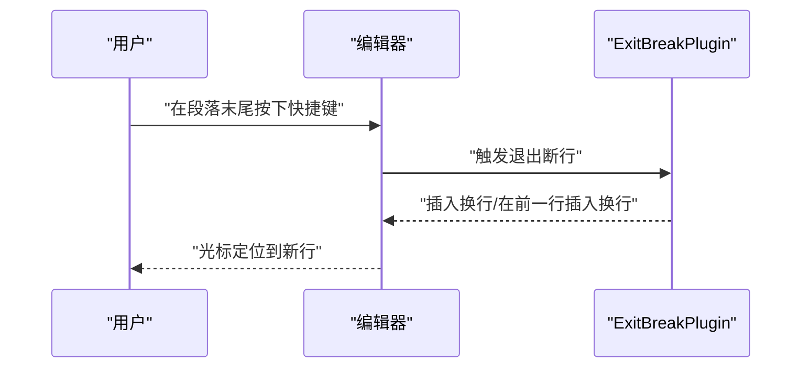
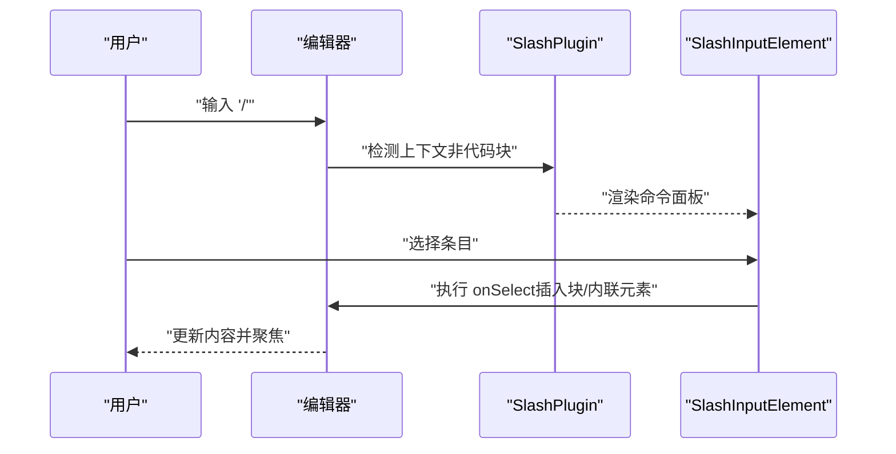
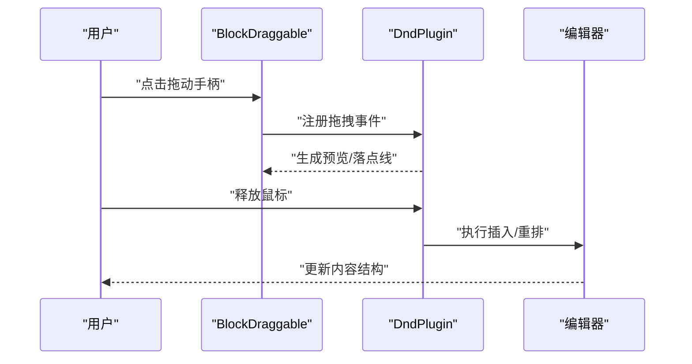
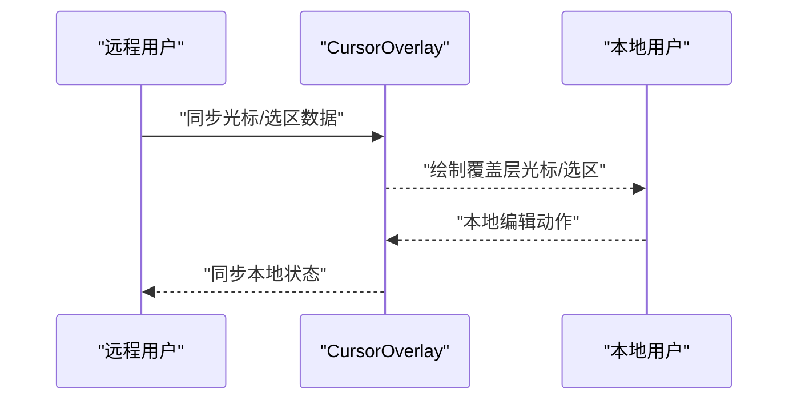
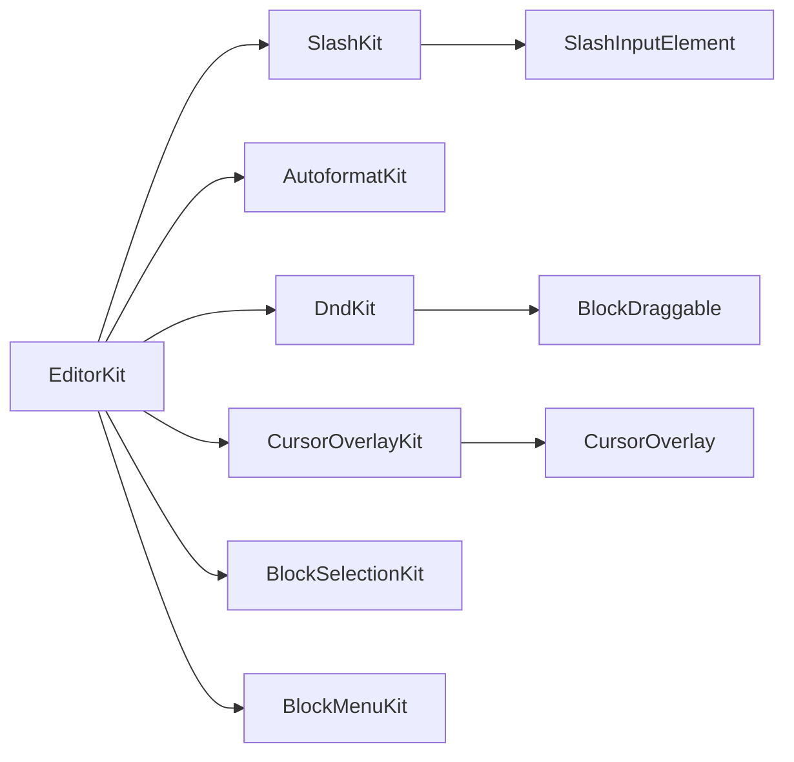

# 编辑行为插件

<cite>
**本文引用的文件**
- [src/components/editor/plugins/autoformat-kit.tsx](file://src/components/editor/plugins/autoformat-kit.tsx)
- [src/components/editor/plugins/exit-break-kit.tsx](file://src/components/editor/plugins/exit-break-kit.tsx)
- [src/components/editor/plugins/slash-kit.tsx](file://src/components/editor/plugins/slash-kit.tsx)
- [src/components/editor/plugins/dnd-kit.tsx](file://src/components/editor/plugins/dnd-kit.tsx)
- [src/components/editor/plugins/cursor-overlay-kit.tsx](file://src/components/editor/plugins/cursor-overlay-kit.tsx)
- [src/components/editor/plugins/block-menu-kit.tsx](file://src/components/editor/plugins/block-menu-kit.tsx)
- [src/components/editor/plugins/block-selection-kit.tsx](file://src/components/editor/plugins/block-selection-kit.tsx)
- [src/components/editor/plugins/fixed-toolbar-kit.tsx](file://src/components/editor/plugins/fixed-toolbar-kit.tsx)
- [src/components/editor/plugins/floating-toolbar-kit.tsx](file://src/components/editor/plugins/floating-toolbar-kit.tsx)
- [src/components/editor/plugins/markdown-kit.tsx](file://src/components/editor/plugins/markdown-kit.tsx)
- [src/components/editor/plugins/math-kit.tsx](file://src/components/editor/plugins/math-kit.tsx)
- [src/components/editor/plate-editor.tsx](file://src/components/editor/plate-editor.tsx)
- [src/components/editor/editor-kit.tsx](file://src/components/editor/editor-kit.tsx)
- [src/components/ui/cursor-overlay.tsx](file://src/components/ui/cursor-overlay.tsx)
- [src/components/ui/slash-node.tsx](file://src/components/ui/slash-node.tsx)
- [src/components/ui/block-draggable.tsx](file://src/components/ui/block-draggable.tsx)
</cite>

## 目录
1. [简介](#简介)
2. [项目结构](#项目结构)
3. [核心组件](#核心组件)
4. [架构总览](#架构总览)
5. [详细组件分析](#详细组件分析)
6. [依赖关系分析](#依赖关系分析)
7. [性能考量](#性能考量)
8. [故障排查指南](#故障排查指南)
9. [结论](#结论)
10. [附录](#附录)

## 简介
本文件系统性梳理编辑行为插件，涵盖自动格式化、退出断行、斜杠命令、拖拽排序、光标覆盖等能力。文档从行为规则、触发条件、配置项、优先级与冲突处理、使用示例与自定义方法、优化与调试技巧等方面展开，帮助开发者与使用者高效理解与扩展编辑体验。

## 项目结构
编辑行为插件以“套件”形式组织，统一在编辑器套件中装配，形成可组合、可扩展的插件体系。编辑器套件将基础节点、样式、编辑行为、解析器与UI工具条等模块按类别分组装配，确保行为插件与其他模块协同工作。



图表来源
- [src/components/editor/editor-kit.tsx:36-78](file://src/components/editor/editor-kit.tsx#L36-L78)

章节来源
- [src/components/editor/editor-kit.tsx:1-83](file://src/components/editor/editor-kit.tsx#L1-L83)

## 核心组件
- 自动格式化（AutoformatKit）
  - 规则类型：标记（粗体、斜体、下划线、删除线、上标、下标、高亮、行内代码）与块级（标题、引用、代码块、分割线、列表）。
  - 触发方式：输入匹配字符序列后自动转换；支持正则匹配列表编号。
  - 配置要点：禁用在代码块内触发；启用撤销删除；内置多类语言符号与数学符号规则。
  - 典型场景：快速生成标题、列表、引用、代码块等，减少手动键入与切换成本。
  
- 退出断行（ExitBreakKit）
  - 行为：在段落末尾按快捷键插入换行或在前一行插入换行。
  - 快捷键：插入换行与在前一行插入换行分别绑定不同组合键。
  - 场景：快速在段落间插入空行，避免频繁移动光标。
  
- 斜杠命令（SlashKit）
  - 行为：在非代码块中输入“/”触发命令面板，提供块级元素、高级块、内联元素的快速插入。
  - 触发条件：编辑器不在代码块上下文中。
  - 面板内容：分组展示文本、标题、列表、表格、引用、公式、日期等。
  - 场景：零记忆成本插入复杂块元素。
  
- 拖拽排序（DndKit + BlockDraggable）
  - 行为：通过拖拽手柄对块进行排序；支持多选拖拽、预览、列与表格内的拖拽限制。
  - 交互：拖拽时显示预览、悬停时出现落点线；右键菜单集成块选择。
  - 场景：可视化调整内容顺序，提升结构编辑效率。
  
- 光标覆盖（CursorOverlayKit + CursorOverlay）
  - 行为：渲染远程用户的光标与选区覆盖层，区分光标与选区状态。
  - 特性：跳过多单元格表格选择；支持拖拽时的视觉反馈。
  - 场景：协作编辑时直观感知他人光标位置与选区范围。

章节来源
- [src/components/editor/plugins/autoformat-kit.tsx:18-237](file://src/components/editor/plugins/autoformat-kit.tsx#L18-L237)
- [src/components/editor/plugins/exit-break-kit.tsx:5-12](file://src/components/editor/plugins/exit-break-kit.tsx#L5-L12)
- [src/components/editor/plugins/slash-kit.tsx:8-18](file://src/components/editor/plugins/slash-kit.tsx#L8-L18)
- [src/components/editor/plugins/dnd-kit.tsx:10-27](file://src/components/editor/plugins/dnd-kit.tsx#L10-L27)
- [src/components/editor/plugins/cursor-overlay-kit.tsx:7-13](file://src/components/editor/plugins/cursor-overlay-kit.tsx#L7-L13)
- [src/components/ui/cursor-overlay.tsx:14-76](file://src/components/ui/cursor-overlay.tsx#L14-L76)
- [src/components/ui/slash-node.tsx:55-237](file://src/components/ui/slash-node.tsx#L55-L237)
- [src/components/ui/block-draggable.tsx:30-188](file://src/components/ui/block-draggable.tsx#L30-L188)

## 架构总览
编辑器通过 EditorKit 将行为插件与节点、样式、解析器、UI 工具条等模块统一装配。行为插件之间通过编辑器上下文与插件 API 协同，避免相互干扰，并在特定上下文（如代码块）中进行条件性启用/禁用。



图表来源
- [src/components/editor/plate-editor.tsx:79-82](file://src/components/editor/plate-editor.tsx#L79-L82)
- [src/components/editor/editor-kit.tsx:36-78](file://src/components/editor/editor-kit.tsx#L36-L78)
- [src/components/ui/slash-node.tsx:196-237](file://src/components/ui/slash-node.tsx#L196-L237)
- [src/components/ui/block-draggable.tsx:30-188](file://src/components/ui/block-draggable.tsx#L30-L188)
- [src/components/ui/cursor-overlay.tsx:14-76](file://src/components/ui/cursor-overlay.tsx#L14-L76)

## 详细组件分析

### 自动格式化（AutoformatKit）
- 行为规则
  - 标记类：支持多种组合快捷键生成加粗、斜体、下划线、删除线、上下标、高亮、行内代码等。
  - 块级类：支持标题、引用、代码块、分割线、无序/有序/待办列表等。
  - 列表编号：支持正则匹配数字开头的有序列表。
  - 上下文过滤：在代码块内禁用自动格式化，避免误触。
- 触发条件
  - 输入匹配规则中的触发字符串或正则表达式。
  - 在非代码块上下文中生效。
- 配置项
  - 启用撤销删除：在自动格式化后允许撤销。
  - 规则集合：包含多类语言符号、数学符号、法律符号等。
- 使用示例
  - 输入“### ”快速生成三级标题。
  - 输入“> ”生成引用块。
  - 输入“```”插入空代码块。
  - 输入“* ”或“- ”生成无序列表。
  - 输入“1. ”或“1) ”生成有序列表。
  - 输入“[] ”或“[x] ”生成待办列表项。
- 自定义方法
  - 新增规则：在规则数组中添加新的 AutoformatRule，设置 match/mode/type/format/query。
  - 调整上下文：通过 query 过滤当前节点类型（如排除代码块）。
  - 扩展格式化逻辑：format 回调中执行插入/设置节点操作。



图表来源
- [src/components/editor/plugins/autoformat-kit.tsx:211-237](file://src/components/editor/plugins/autoformat-kit.tsx#L211-L237)

章节来源
- [src/components/editor/plugins/autoformat-kit.tsx:18-237](file://src/components/editor/plugins/autoformat-kit.tsx#L18-L237)

### 退出断行（ExitBreakKit）
- 行为
  - 在段落末尾按下快捷键插入换行或在前一行插入换行。
- 配置
  - 插入换行与在前一行插入换行分别绑定不同组合键。
- 使用示例
  - 在段落末尾按住组合键插入空行，便于继续输入。
- 自定义方法
  - 修改 shortcuts 中的 keys 值以适配不同平台/团队习惯。



图表来源
- [src/components/editor/plugins/exit-break-kit.tsx:5-12](file://src/components/editor/plugins/exit-break-kit.tsx#L5-L12)

章节来源
- [src/components/editor/plugins/exit-break-kit.tsx:5-12](file://src/components/editor/plugins/exit-break-kit.tsx#L5-L12)

### 斜杠命令（SlashKit + SlashInputElement）
- 行为
  - 在非代码块中输入“/”打开命令面板，支持分组选择块级/内联元素。
- 触发条件
  - 编辑器上下文不在代码块内。
- 面板内容
  - 基础块：文本、标题、列表、切换、代码块、表格、引用、提示框等。
  - 高级块：目录、三栏布局、公式、绘图等。
  - 内联：日期、行内公式等。
- 使用示例
  - 输入“/”后选择“代码块”，快速插入代码块。
  - 输入“/”后选择“表格”，快速插入表格。
  - 输入“/”后选择“日期”，插入当前日期。
- 自定义方法
  - 扩展 groups：新增分组与条目，设置 onSelect 执行插入逻辑。
  - 修改触发查询：通过 triggerQuery 控制触发上下文。



图表来源
- [src/components/editor/plugins/slash-kit.tsx:8-18](file://src/components/editor/plugins/slash-kit.tsx#L8-L18)
- [src/components/ui/slash-node.tsx:196-237](file://src/components/ui/slash-node.tsx#L196-L237)

章节来源
- [src/components/editor/plugins/slash-kit.tsx:8-18](file://src/components/editor/plugins/slash-kit.tsx#L8-L18)
- [src/components/ui/slash-node.tsx:55-237](file://src/components/ui/slash-node.tsx#L55-L237)

### 拖拽排序（DndKit + BlockDraggable）
- 行为
  - 通过拖拽手柄对块进行排序；支持多选拖拽、预览、列与表格内的拖拽限制。
  - 右键菜单集成块选择；拖拽时显示落点线。
- 配置
  - 启用滚动器；支持拖拽文件到占位符区域插入媒体。
  - 渲染 DndProvider 包裹整个编辑器。
- 使用示例
  - 点击并拖动块左侧手柄，将块移动到目标位置。
  - 按住 Shift 或右键拖动进行多选块拖拽。
- 自定义方法
  - 调整 onDropFiles 的插入逻辑。
  - 通过 BlockDraggable 的路径判断控制可拖拽范围（根、列、表格层级）。



图表来源
- [src/components/editor/plugins/dnd-kit.tsx:10-27](file://src/components/editor/plugins/dnd-kit.tsx#L10-L27)
- [src/components/ui/block-draggable.tsx:72-188](file://src/components/ui/block-draggable.tsx#L72-L188)

章节来源
- [src/components/editor/plugins/dnd-kit.tsx:10-27](file://src/components/editor/plugins/dnd-kit.tsx#L10-L27)
- [src/components/ui/block-draggable.tsx:30-188](file://src/components/ui/block-draggable.tsx#L30-L188)

### 光标覆盖（CursorOverlayKit + CursorOverlay）
- 行为
  - 渲染远程用户的光标与选区覆盖层，区分光标与选区状态。
  - 跳过多单元格表格选择，避免重复覆盖。
- 使用示例
  - 多人协作时，实时看到他人的光标位置与选区范围。
- 自定义方法
  - 通过 render.afterEditable 注入自定义覆盖层组件。
  - 调整样式与透明度以适配主题。



图表来源
- [src/components/editor/plugins/cursor-overlay-kit.tsx:7-13](file://src/components/editor/plugins/cursor-overlay-kit.tsx#L7-L13)
- [src/components/ui/cursor-overlay.tsx:14-76](file://src/components/ui/cursor-overlay.tsx#L14-L76)

章节来源
- [src/components/editor/plugins/cursor-overlay-kit.tsx:7-13](file://src/components/editor/plugins/cursor-overlay-kit.tsx#L7-L13)
- [src/components/ui/cursor-overlay.tsx:14-76](file://src/components/ui/cursor-overlay.tsx#L14-L76)

### 块菜单与块选择（BlockMenuKit + BlockSelectionKit）
- 行为
  - 块菜单：在块上方渲染右键菜单，提供上下文相关操作。
  - 块选择：支持右键菜单选择、Shift/右键多选、拖拽手柄聚焦。
- 使用示例
  - 右键点击块打开菜单，快速复制/删除/提升/下沉等。
  - 按住 Shift 或右键拖动进行多块选择。
- 自定义方法
  - 通过 BlockContextMenu 组件扩展菜单项。
  - 调整 isSelectable 过滤不可选择的节点类型。

章节来源
- [src/components/editor/plugins/block-menu-kit.tsx:9-14](file://src/components/editor/plugins/block-menu-kit.tsx#L9-L14)
- [src/components/editor/plugins/block-selection-kit.tsx:8-26](file://src/components/editor/plugins/block-selection-kit.tsx#L8-L26)

### 工具条（FixedToolbarKit + FloatingToolbarKit）
- 行为
  - 固定工具条：在编辑器上方固定显示常用格式化按钮。
  - 浮动工具条：根据选区动态显示格式化按钮。
- 使用示例
  - 选中文本后，浮动工具条自动显示加粗、斜体、链接等按钮。
- 自定义方法
  - 替换按钮组件或扩展按钮组。

章节来源
- [src/components/editor/plugins/fixed-toolbar-kit.tsx:8-19](file://src/components/editor/plugins/fixed-toolbar-kit.tsx#L8-L19)
- [src/components/editor/plugins/floating-toolbar-kit.tsx:8-19](file://src/components/editor/plugins/floating-toolbar-kit.tsx#L8-L19)

### Markdown 与公式（MarkdownKit + MathKit）
- MarkdownKit
  - 集成 remark-math、remark-gfm、remark-mdx、remark-mention 等插件，增强 Markdown 解析能力。
- MathKit
  - 提供行内公式与块级公式的节点组件，支持 LaTeX 输入与渲染。
- 使用示例
  - 输入行内公式与块级公式，自动渲染为数学表达式。
- 自定义方法
  - 调整 remarkPlugins 以扩展解析器生态。

章节来源
- [src/components/editor/plugins/markdown-kit.tsx:5-11](file://src/components/editor/plugins/markdown-kit.tsx#L5-L11)
- [src/components/editor/plugins/math-kit.tsx:10-13](file://src/components/editor/plugins/math-kit.tsx#L10-L13)

## 依赖关系分析
- 插件装配顺序
  - 节点与样式：基础块、代码块、表格、列表、对齐、行高、字体等。
  - 编辑行为：斜杠命令、自动格式化、光标覆盖、块菜单、拖拽、表情、退出断行、尾随块。
  - 解析器：DOCX、Markdown。
  - UI：块占位、固定/浮动工具条。
- 关键依赖链
  - EditorKit 统一装配各插件。
  - SlashInputElement 依赖 SlashPlugin 的触发查询与上下文过滤。
  - BlockDraggable 依赖 DndPlugin 与 BlockSelectionPlugin。
  - CursorOverlay 依赖 CursorOverlayPlugin 与编辑器引用。
- 冲突与优先级
  - 代码块上下文过滤：自动格式化与斜杠命令均在代码块内禁用，避免冲突。
  - 拖拽与块选择：通过路径层级判断与类型过滤，避免在表格/列等特殊节点内拖拽。
  - 工具条与块菜单：互不冲突，分别在不同时机呈现。



图表来源
- [src/components/editor/editor-kit.tsx:36-78](file://src/components/editor/editor-kit.tsx#L36-L78)
- [src/components/ui/slash-node.tsx:196-237](file://src/components/ui/slash-node.tsx#L196-L237)
- [src/components/ui/block-draggable.tsx:30-188](file://src/components/ui/block-draggable.tsx#L30-L188)
- [src/components/ui/cursor-overlay.tsx:14-76](file://src/components/ui/cursor-overlay.tsx#L14-L76)

章节来源
- [src/components/editor/editor-kit.tsx:36-78](file://src/components/editor/editor-kit.tsx#L36-L78)

## 性能考量
- 结构化比较
  - 编辑器使用结构化值比较，避免全量 JSON 序列化带来的开销，仅在内容变化时触发保存状态更新。
- 拖拽预览优化
  - 拖拽预览克隆 DOM 并移除数据属性，减少识别错误；对水平滚动进行补偿，保证预览位置准确。
- 选区覆盖优化
  - 跳过多单元格表格选择，避免重复绘制；仅在需要时渲染覆盖层矩形与光标线。
- 工具条渲染
  - 浮动工具条按需显示，减少不必要的 DOM 更新。

章节来源
- [src/components/editor/plate-editor.tsx:16-61](file://src/components/editor/plate-editor.tsx#L16-L61)
- [src/components/ui/block-draggable.tsx:358-456](file://src/components/ui/block-draggable.tsx#L358-L456)
- [src/components/ui/cursor-overlay.tsx:37-47](file://src/components/ui/cursor-overlay.tsx#L37-L47)

## 故障排查指南
- 自动格式化未生效
  - 检查是否处于代码块上下文；确认触发字符串与规则匹配。
  - 查看 query 是否正确过滤了代码块类型。
- 斜杠命令无法触发
  - 确认 triggerQuery 返回非代码块上下文。
  - 检查 SlashInputElement 是否正确渲染。
- 拖拽无效或异常
  - 检查 BlockDraggable 的路径层级判断与不可拖拽类型过滤。
  - 确认 DndProvider 是否包裹编辑器根节点。
- 光标覆盖显示异常
  - 检查 CursorOverlay 的上下文过滤（多单元格表格）。
  - 确认编辑器引用与样式类名是否正确。
- 保存状态不更新
  - 确认结构化比较逻辑是否被调用；检查 baselineContentRef 是否正确更新。

章节来源
- [src/components/editor/plugins/autoformat-kit.tsx:228-232](file://src/components/editor/plugins/autoformat-kit.tsx#L228-L232)
- [src/components/editor/plugins/slash-kit.tsx:11-14](file://src/components/editor/plugins/slash-kit.tsx#L11-L14)
- [src/components/ui/block-draggable.tsx:33-65](file://src/components/ui/block-draggable.tsx#L33-L65)
- [src/components/ui/cursor-overlay.tsx:37-47](file://src/components/ui/cursor-overlay.tsx#L37-L47)
- [src/components/editor/plate-editor.tsx:84-99](file://src/components/editor/plate-editor.tsx#L84-L99)

## 结论
编辑行为插件通过自动格式化、斜杠命令、拖拽排序、退出断行与光标覆盖等能力，显著提升了编辑效率与协作体验。它们以插件化方式装配于编辑器套件，遵循上下文过滤与条件启用策略，避免冲突并保持良好性能。通过合理的配置与自定义，可进一步贴合团队工作流与产品需求。

## 附录
- 快速参考
  - 自动格式化：在非代码块中输入特定字符序列触发。
  - 斜杠命令：输入“/”打开命令面板，选择所需块/内联元素。
  - 拖拽排序：点击块左侧手柄拖动，支持多选与预览。
  - 退出断行：在段落末尾使用快捷键插入换行。
  - 光标覆盖：协作时查看远程用户光标与选区。
- 建议实践
  - 在团队内统一快捷键与命令面板关键词，降低学习成本。
  - 对自动格式化规则进行精简与本地化，避免过度自动。
  - 在复杂表格/列结构中谨慎启用拖拽，必要时增加层级限制。
  - 定期评估结构化比较与渲染性能，确保大文档场景流畅。