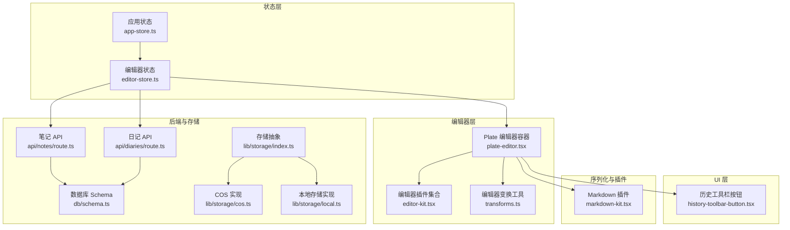
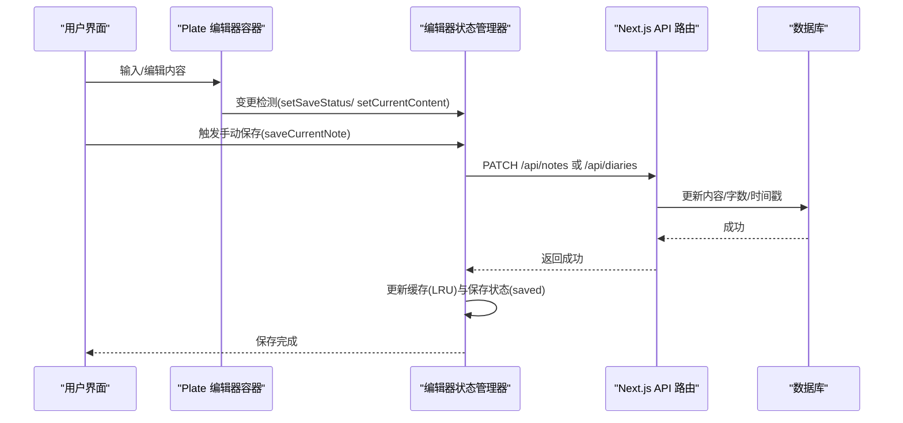
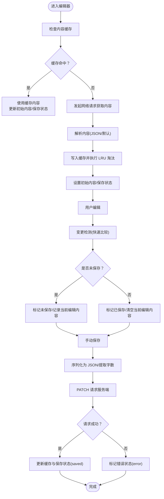
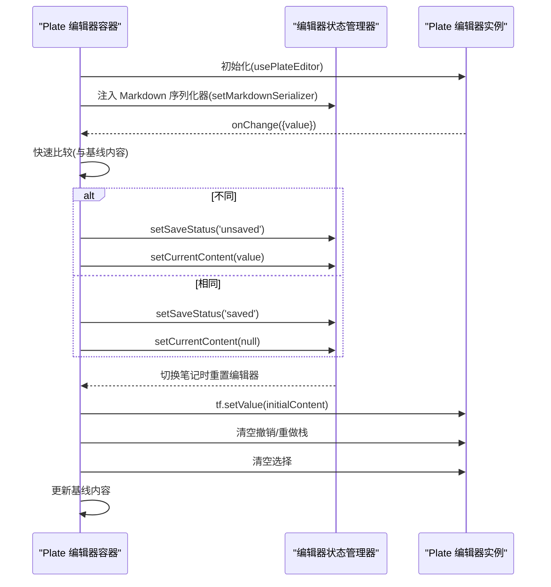
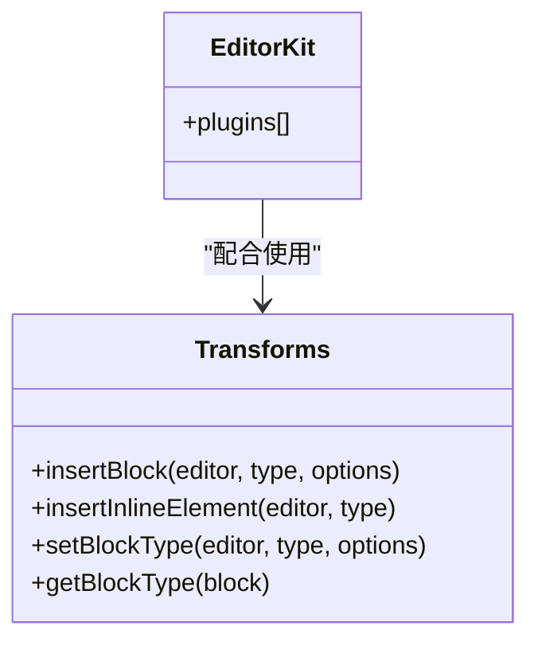
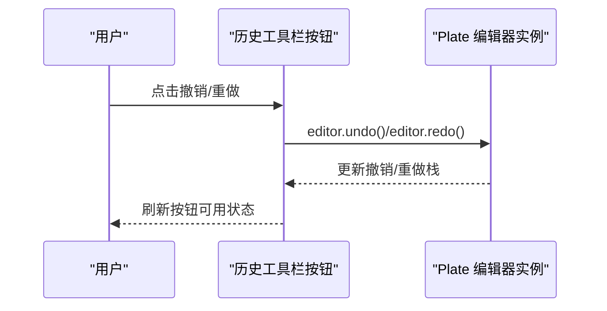
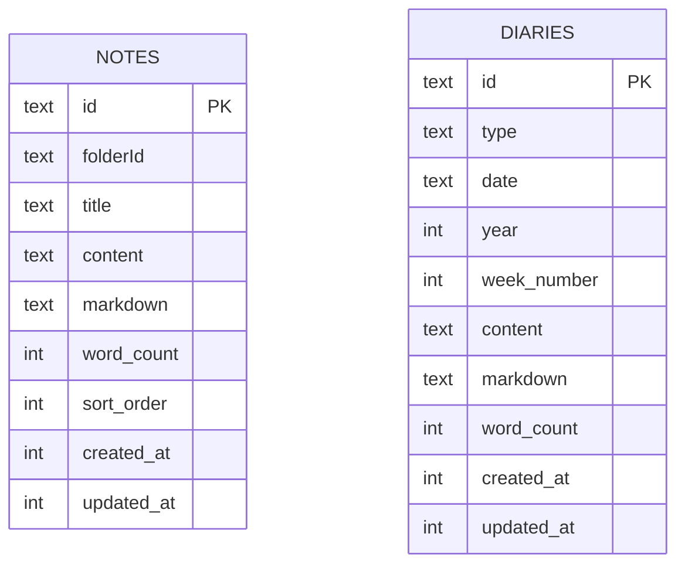
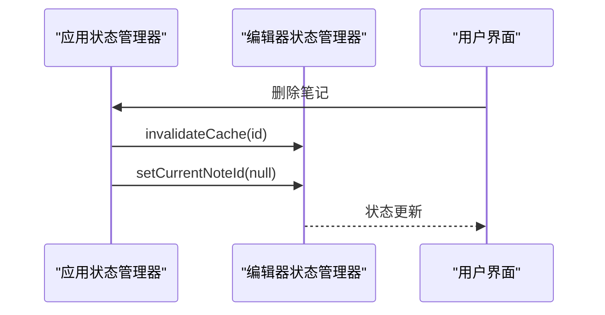
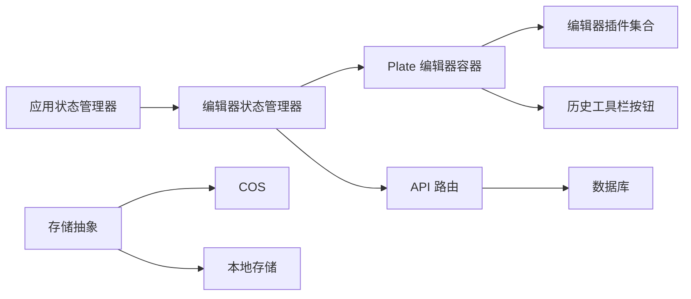

# 编辑器状态管理

<cite>
**本文引用的文件**   
- [src/stores/editor-store.ts](file://src/stores/editor-store.ts)
- [src/components/editor/plate-editor.tsx](file://src/components/editor/plate-editor.tsx)
- [src/components/editor/editor-kit.tsx](file://src/components/editor/editor-kit.tsx)
- [src/components/editor/transforms.ts](file://src/components/editor/transforms.ts)
- [src/components/ui/history-toolbar-button.tsx](file://src/components/ui/history-toolbar-button.tsx)
- [src/components/editor/plugins/markdown-kit.tsx](file://src/components/editor/plugins/markdown-kit.tsx)
- [src/stores/app-store.ts](file://src/stores/app-store.ts)
- [src/types/index.ts](file://src/types/index.ts)
- [src/app/api/notes/route.ts](file://src/app/api/notes/route.ts)
- [src/app/api/diaries/route.ts](file://src/app/api/diaries/route.ts)
- [src/db/schema.ts](file://src/db/schema.ts)
- [src/lib/storage/index.ts](file://src/lib/storage/index.ts)
- [src/lib/storage/cos.ts](file://src/lib/storage/cos.ts)
- [src/lib/storage/local.ts](file://src/lib/storage/local.ts)
</cite>

## 目录
1. [引言](#引言)
2. [项目结构](#项目结构)
3. [核心组件](#核心组件)
4. [架构总览](#架构总览)
5. [详细组件分析](#详细组件分析)
6. [依赖关系分析](#依赖关系分析)
7. [性能考量](#性能考量)
8. [故障排查指南](#故障排查指南)
9. [结论](#结论)
10. [附录](#附录)

## 引言
本文件系统性阐述编辑器状态管理的设计与实现，覆盖以下主题：
- 状态存储与持久化：基于 Zustand 的编辑器状态、内容缓存与服务器端持久化
- 数据流与变更检测：编辑器值的快速比较、保存状态机与增量更新
- 历史记录与撤销重做：基于 Plate 的撤销栈与工具栏按钮集成
- 快照与版本控制：缓存中的内容快照与 LRU 淘汰策略
- 优化与内存管理：缓存大小限制、去抖与批量操作
- 调试与监控：状态可视化、错误日志与加载态反馈
- 跨组件状态共享：Zustand Store 与 Plate Editor 的协作模式

## 项目结构
围绕“编辑器状态管理”的关键目录与文件如下：
- 状态层：src/stores/editor-store.ts（编辑器全局状态）、src/stores/app-store.ts（应用级树与笔记元数据）
- 编辑器层：src/components/editor/plate-editor.tsx（编辑器容器与变更检测）、src/components/editor/editor-kit.tsx（插件集合）、src/components/editor/transforms.ts（块/内联插入与类型切换）
- 工具栏与历史：src/components/ui/history-toolbar-button.tsx（撤销/重做按钮）
- 插件与序列化：src/components/editor/plugins/markdown-kit.tsx（Markdown 解析/导出）
- 类型与常量：src/types/index.ts（保存状态枚举等）
- API 与数据库：src/app/api/notes/route.ts、src/app/api/diaries/route.ts、src/db/schema.ts（后端接口与表结构）
- 存储抽象：src/lib/storage/index.ts、src/lib/storage/cos.ts、src/lib/storage/local.ts（本地/云存储）

**图表来源**
- [src/stores/editor-store.ts:88-280](file://src/stores/editor-store.ts#L88-L280)
- [src/stores/app-store.ts:49-317](file://src/stores/app-store.ts#L49-L317)
- [src/components/editor/plate-editor.tsx:63-174](file://src/components/editor/plate-editor.tsx#L63-L174)
- [src/components/editor/editor-kit.tsx:36-83](file://src/components/editor/editor-kit.tsx#L36-L83)
- [src/components/editor/transforms.ts:87-128](file://src/components/editor/transforms.ts#L87-L128)
- [src/components/ui/history-toolbar-button.tsx:9-51](file://src/components/ui/history-toolbar-button.tsx#L9-L51)
- [src/components/editor/plugins/markdown-kit.tsx:5-11](file://src/components/editor/plugins/markdown-kit.tsx#L5-L11)
- [src/app/api/notes/route.ts:10-85](file://src/app/api/notes/route.ts#L10-L85)
- [src/app/api/diaries/route.ts:6-44](file://src/app/api/diaries/route.ts#L6-L44)
- [src/db/schema.ts:27-104](file://src/db/schema.ts#L27-L104)
- [src/lib/storage/index.ts:12-29](file://src/lib/storage/index.ts#L12-L29)
- [src/lib/storage/cos.ts:11-61](file://src/lib/storage/cos.ts#L11-L61)
- [src/lib/storage/local.ts:7-28](file://src/lib/storage/local.ts#L7-L28)

**章节来源**
- [src/stores/editor-store.ts:88-280](file://src/stores/editor-store.ts#L88-L280)
- [src/stores/app-store.ts:49-317](file://src/stores/app-store.ts#L49-L317)
- [src/components/editor/plate-editor.tsx:63-174](file://src/components/editor/plate-editor.tsx#L63-L174)
- [src/components/editor/editor-kit.tsx:36-83](file://src/components/editor/editor-kit.tsx#L36-L83)
- [src/components/editor/transforms.ts:87-128](file://src/components/editor/transforms.ts#L87-L128)
- [src/components/ui/history-toolbar-button.tsx:9-51](file://src/components/ui/history-toolbar-button.tsx#L9-L51)
- [src/components/editor/plugins/markdown-kit.tsx:5-11](file://src/components/editor/plugins/markdown-kit.tsx#L5-L11)
- [src/app/api/notes/route.ts:10-85](file://src/app/api/notes/route.ts#L10-L85)
- [src/app/api/diaries/route.ts:6-44](file://src/app/api/diaries/route.ts#L6-L44)
- [src/db/schema.ts:27-104](file://src/db/schema.ts#L27-L104)
- [src/lib/storage/index.ts:12-29](file://src/lib/storage/index.ts#L12-L29)
- [src/lib/storage/cos.ts:11-61](file://src/lib/storage/cos.ts#L11-L61)
- [src/lib/storage/local.ts:7-28](file://src/lib/storage/local.ts#L7-L28)

## 核心组件
- 编辑器状态管理器（Zustand）：负责当前笔记 ID、编辑类型、初始内容、当前编辑内容、Markdown 序列化器回调、保存状态、字数统计、加载态以及内容缓存（LRU）与缓存淘汰逻辑。
- Plate 编辑器容器：封装 Plate 编辑器实例，设置插件、监听变更、进行快速值比较以驱动保存状态与当前编辑内容；在笔记切换时重置编辑器、清空撤销栈、滚动到顶部并更新基线内容。
- 编辑器插件集合：集中注册基础块、代码块、表格、切换、目录、媒体、公式、日期、链接、提及、列表、对齐、行高、Markdown 解析/导出、占位符、固定/浮动工具栏等。
- 编辑器变换工具：提供块/内联元素插入、块类型切换、列表样式设置、三栏布局切换、代码块切换等能力。
- 历史工具栏按钮：基于 Plate 的撤销/重做栈，暴露禁用状态与点击事件。
- 应用状态管理器：维护标签页、文件树、选中项、搜索结果、树加载态，以及文件夹/笔记 CRUD 操作；在删除笔记时联动清理编辑器缓存与当前笔记 ID。

**章节来源**
- [src/stores/editor-store.ts:88-280](file://src/stores/editor-store.ts#L88-L280)
- [src/components/editor/plate-editor.tsx:63-174](file://src/components/editor/plate-editor.tsx#L63-L174)
- [src/components/editor/editor-kit.tsx:36-83](file://src/components/editor/editor-kit.tsx#L36-L83)
- [src/components/editor/transforms.ts:87-128](file://src/components/editor/transforms.ts#L87-L128)
- [src/components/ui/history-toolbar-button.tsx:9-51](file://src/components/ui/history-toolbar-button.tsx#L9-L51)
- [src/stores/app-store.ts:49-317](file://src/stores/app-store.ts#L49-L317)

## 架构总览
编辑器状态管理采用“Zustand 全局状态 + Plate 编辑器 + 后端持久化”的分层设计：
- 状态层：Zustand Store 维护编辑器状态与缓存，提供加载、保存、缓存失效等动作。
- 编辑器层：Plate 提供富文本编辑能力与撤销栈；自定义比较函数避免昂贵的 JSON 比较。
- 工具层：编辑器变换工具与插件增强编辑体验；历史按钮直接调用 Plate 的撤销/重做。
- 持久化层：通过 Next.js API Route 访问数据库（Drizzle ORM），支持笔记与日记的读取、创建与更新；内容缓存与服务端内容保持一致。

**图表来源**
- [src/components/editor/plate-editor.tsx:84-99](file://src/components/editor/plate-editor.tsx#L84-L99)
- [src/stores/editor-store.ts:204-275](file://src/stores/editor-store.ts#L204-L275)
- [src/app/api/notes/route.ts:10-85](file://src/app/api/notes/route.ts#L10-L85)
- [src/db/schema.ts:27-104](file://src/db/schema.ts#L27-L104)

## 详细组件分析

### 编辑器状态管理器（Zustand）
- 关键字段与职责
  - 当前笔记 ID、编辑类型：决定加载/保存路径与序列化策略
  - 初始内容与当前编辑内容：前者来自缓存/服务端，后者用于增量保存
  - Markdown 序列化器回调：由 Plate 编辑器注入，用于生成 Markdown
  - 保存状态：saved/saving/unsaved/error 驱动 UI 与自动保存策略
  - 字数统计：从编辑内容提取纯文本计算
  - 加载态：显示加载指示
  - 内容缓存（Map）与 LRU 淘汰：按访问时间淘汰最旧条目
- 加载流程（笔记/日记）
  - 先查缓存命中则更新初始内容与保存状态
  - 缓存未命中则发起网络请求，解析内容并写入缓存
- 保存流程
  - 将当前编辑内容序列化为 JSON，计算字数
  - 若未显式传入 Markdown，则尝试使用编辑器提供的序列化器
  - 发起 PATCH 请求至对应 API（笔记或日记），成功后更新缓存与保存状态
- 缓存管理
  - 提供缓存失效接口，配合应用层删除笔记时清理

**图表来源**
- [src/stores/editor-store.ts:114-155](file://src/stores/editor-store.ts#L114-L155)
- [src/stores/editor-store.ts:157-198](file://src/stores/editor-store.ts#L157-L198)
- [src/stores/editor-store.ts:204-275](file://src/stores/editor-store.ts#L204-L275)
- [src/stores/editor-store.ts:66-77](file://src/stores/editor-store.ts#L66-L77)

**章节来源**
- [src/stores/editor-store.ts:88-280](file://src/stores/editor-store.ts#L88-L280)

### Plate 编辑器容器与变更检测
- 快速比较算法
  - 对节点进行结构化比较，避免昂贵的 JSON 比较
  - 支持文本节点与嵌套子节点递归比较
- 变更处理
  - onChange 中根据是否与基线内容相等，更新保存状态与当前编辑内容
  - 在笔记切换时重置编辑器值、清空撤销/重做栈、取消选择、滚动到顶部，并更新基线内容
- Markdown 序列化器
  - 在挂载时注入编辑器的 Markdown 序列化器回调，供状态管理器使用

**图表来源**
- [src/components/editor/plate-editor.tsx:79-82](file://src/components/editor/plate-editor.tsx#L79-L82)
- [src/components/editor/plate-editor.tsx:84-99](file://src/components/editor/plate-editor.tsx#L84-L99)
- [src/components/editor/plate-editor.tsx:101-136](file://src/components/editor/plate-editor.tsx#L101-L136)
- [src/components/editor/plate-editor.tsx:138-144](file://src/components/editor/plate-editor.tsx#L138-L144)
- [src/components/editor/plate-editor.tsx:146-153](file://src/components/editor/plate-editor.tsx#L146-L153)

**章节来源**
- [src/components/editor/plate-editor.tsx:63-174](file://src/components/editor/plate-editor.tsx#L63-L174)

### 编辑器插件与变换工具
- 插件集合
  - 基础块、代码块、表格、切换、目录、媒体、公式、日期、链接、提及
  - 标记（字体、字号、颜色）、列表、对齐、行高
  - 编辑辅助（斜杠菜单、自动格式化、光标覆盖、块菜单、拖拽、表情、退出断行）
  - 解析器（DOCX、Markdown）
  - UI（占位符、固定/浮动工具栏）
- 变换工具
  - 块插入：支持列表、三栏布局、音频/视频/文件占位符、图片/嵌入媒体、表格、目录、Excalidraw
  - 内联插入：日期、行间公式、链接
  - 块类型切换：列表样式、代码块、三栏布局等
  - UPSERT 语义：若当前块为空且类型相同则复用

**图表来源**
- [src/components/editor/editor-kit.tsx:36-83](file://src/components/editor/editor-kit.tsx#L36-L83)
- [src/components/editor/transforms.ts:87-128](file://src/components/editor/transforms.ts#L87-L128)
- [src/components/editor/transforms.ts:157-193](file://src/components/editor/transforms.ts#L157-L193)
- [src/components/editor/transforms.ts:195-208](file://src/components/editor/transforms.ts#L195-L208)

**章节来源**
- [src/components/editor/editor-kit.tsx:36-83](file://src/components/editor/editor-kit.tsx#L36-L83)
- [src/components/editor/transforms.ts:87-128](file://src/components/editor/transforms.ts#L87-L128)
- [src/components/editor/transforms.ts:157-193](file://src/components/editor/transforms.ts#L157-L193)
- [src/components/editor/transforms.ts:195-208](file://src/components/editor/transforms.ts#L195-L208)

### 历史记录与撤销重做
- 基于 Plate 的撤销/重做栈
  - 撤销按钮：当撤销栈为空时禁用
  - 重做按钮：当重做栈为空时禁用
- 编辑器重置时清空撤销/重做栈，防止跨笔记的历史污染

**图表来源**
- [src/components/ui/history-toolbar-button.tsx:9-51](file://src/components/ui/history-toolbar-button.tsx#L9-L51)
- [src/components/editor/plate-editor.tsx:111-115](file://src/components/editor/plate-editor.tsx#L111-L115)

**章节来源**
- [src/components/ui/history-toolbar-button.tsx:9-51](file://src/components/ui/history-toolbar-button.tsx#L9-L51)
- [src/components/editor/plate-editor.tsx:111-115](file://src/components/editor/plate-editor.tsx#L111-L115)

### 持久化机制与恢复策略
- 服务端接口
  - 笔记：GET 获取列表，POST 创建，PATCH 更新（内容、字数、Markdown）
  - 日记：GET 获取年度列表，PATCH 更新
- 数据库 Schema
  - notes 表：id、folderId、title、content、markdown、wordCount、排序与时间戳
  - diaries 表：id、type、date、year、weekNumber、content、markdown、wordCount、时间戳
- 恢复策略
  - 切换笔记时重置编辑器值、清空撤销栈、滚动到顶部，确保新内容正确渲染
  - 缓存命中时直接恢复初始内容，减少网络请求

**图表来源**
- [src/db/schema.ts:27-104](file://src/db/schema.ts#L27-L104)

**章节来源**
- [src/app/api/notes/route.ts:10-85](file://src/app/api/notes/route.ts#L10-L85)
- [src/app/api/diaries/route.ts:6-44](file://src/app/api/diaries/route.ts#L6-L44)
- [src/db/schema.ts:27-104](file://src/db/schema.ts#L27-L104)
- [src/components/editor/plate-editor.tsx:108-131](file://src/components/editor/plate-editor.tsx#L108-L131)

### 跨组件状态共享与通信
- Zustand Store：作为单一事实来源，被编辑器与应用层共同消费
- Plate 编辑器通过 Hook 访问 Store，实现“值变化 -> 状态更新 -> UI 反应”
- 应用层在删除笔记时，调用编辑器 Store 的缓存失效与当前笔记 ID 清理，保证状态一致性

**图表来源**
- [src/stores/app-store.ts:298-316](file://src/stores/app-store.ts#L298-L316)
- [src/stores/editor-store.ts:277-279](file://src/stores/editor-store.ts#L277-L279)

**章节来源**
- [src/stores/app-store.ts:298-316](file://src/stores/app-store.ts#L298-L316)
- [src/stores/editor-store.ts:277-279](file://src/stores/editor-store.ts#L277-L279)

## 依赖关系分析
- 组件耦合
  - Plate 编辑器容器依赖编辑器状态管理器与插件集合
  - 历史工具栏按钮依赖 Plate 编辑器实例
  - 应用状态管理器依赖编辑器状态管理器以清理缓存
- 外部依赖
  - Zustand：状态管理
  - Plate：富文本编辑与撤销栈
  - Drizzle ORM：SQLite 访问
  - Next.js API Routes：后端接口
  - 存储抽象：COS/本地存储

**图表来源**
- [src/stores/editor-store.ts:88-280](file://src/stores/editor-store.ts#L88-L280)
- [src/components/editor/plate-editor.tsx:63-174](file://src/components/editor/plate-editor.tsx#L63-L174)
- [src/components/editor/editor-kit.tsx:36-83](file://src/components/editor/editor-kit.tsx#L36-L83)
- [src/components/ui/history-toolbar-button.tsx:9-51](file://src/components/ui/history-toolbar-button.tsx#L9-L51)
- [src/stores/app-store.ts:49-317](file://src/stores/app-store.ts#L49-L317)
- [src/app/api/notes/route.ts:10-85](file://src/app/api/notes/route.ts#L10-L85)
- [src/app/api/diaries/route.ts:6-44](file://src/app/api/diaries/route.ts#L6-L44)
- [src/db/schema.ts:27-104](file://src/db/schema.ts#L27-L104)
- [src/lib/storage/index.ts:12-29](file://src/lib/storage/index.ts#L12-L29)
- [src/lib/storage/cos.ts:11-61](file://src/lib/storage/cos.ts#L11-L61)
- [src/lib/storage/local.ts:7-28](file://src/lib/storage/local.ts#L7-L28)

**章节来源**
- [src/stores/editor-store.ts:88-280](file://src/stores/editor-store.ts#L88-L280)
- [src/components/editor/plate-editor.tsx:63-174](file://src/components/editor/plate-editor.tsx#L63-L174)
- [src/components/editor/editor-kit.tsx:36-83](file://src/components/editor/editor-kit.tsx#L36-L83)
- [src/components/ui/history-toolbar-button.tsx:9-51](file://src/components/ui/history-toolbar-button.tsx#L9-L51)
- [src/stores/app-store.ts:49-317](file://src/stores/app-store.ts#L49-L317)
- [src/app/api/notes/route.ts:10-85](file://src/app/api/notes/route.ts#L10-L85)
- [src/app/api/diaries/route.ts:6-44](file://src/app/api/diaries/route.ts#L6-L44)
- [src/db/schema.ts:27-104](file://src/db/schema.ts#L27-L104)
- [src/lib/storage/index.ts:12-29](file://src/lib/storage/index.ts#L12-L29)
- [src/lib/storage/cos.ts:11-61](file://src/lib/storage/cos.ts#L11-L61)
- [src/lib/storage/local.ts:7-28](file://src/lib/storage/local.ts#L7-L28)

## 性能考量
- 变更检测优化
  - 使用结构化比较替代 JSON 比较，降低 CPU 开销
- 缓存策略
  - LRU 缓存上限（固定常量），按访问时间淘汰最旧条目，平衡内存占用与命中率
- 批量与乐观更新
  - 文件夹展开/折叠、归档/解档等操作采用乐观更新并在后台异步提交，提升交互流畅度
- 序列化与字数统计
  - 仅在保存时进行深度遍历提取文本计算字数，避免频繁计算

[本节为通用性能建议，不直接分析具体文件]

## 故障排查指南
- 保存失败
  - 检查保存状态是否变为 error；查看网络请求返回码与响应体
  - 确认编辑器序列化器是否可用；必要时提供显式 Markdown
- 缓存异常
  - 删除笔记后确认编辑器缓存是否失效；检查当前笔记 ID 是否被清空
- 加载卡顿
  - 查看 isLoadingContent 是否持续为真；检查网络请求与解析逻辑
- 撤销/重做异常
  - 切换笔记后撤销/重做栈是否被清空；确认编辑器值是否正确重置

**章节来源**
- [src/stores/editor-store.ts:204-275](file://src/stores/editor-store.ts#L204-L275)
- [src/stores/app-store.ts:298-316](file://src/stores/app-store.ts#L298-L316)
- [src/components/editor/plate-editor.tsx:108-131](file://src/components/editor/plate-editor.tsx#L108-L131)

## 结论
该编辑器状态管理系统通过 Zustand 统一管理编辑器状态与缓存，结合 Plate 的高效撤销栈与插件生态，实现了高性能、可扩展的富文本编辑体验。通过明确的数据流与变更检测机制，系统在保证用户体验的同时兼顾了性能与可靠性。后续可在以下方面进一步优化：
- 增加自动保存策略与冲突合并
- 引入更细粒度的状态订阅与选择器
- 完善调试工具与状态快照导出

[本节为总结性内容，不直接分析具体文件]

## 附录
- 类型定义
  - 保存状态枚举：saved/saving/unsaved/error
  - 笔记/日记元数据与详情结构
- 存储抽象
  - 自动选择 COS 或本地存储，统一上传、删除与 URL 生成接口

**章节来源**
- [src/types/index.ts:33-74](file://src/types/index.ts#L33-L74)
- [src/lib/storage/index.ts:12-29](file://src/lib/storage/index.ts#L12-L29)
- [src/lib/storage/cos.ts:11-61](file://src/lib/storage/cos.ts#L11-L61)
- [src/lib/storage/local.ts:7-28](file://src/lib/storage/local.ts#L7-L28)