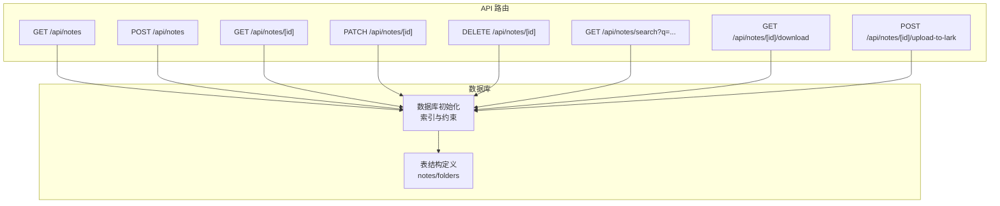
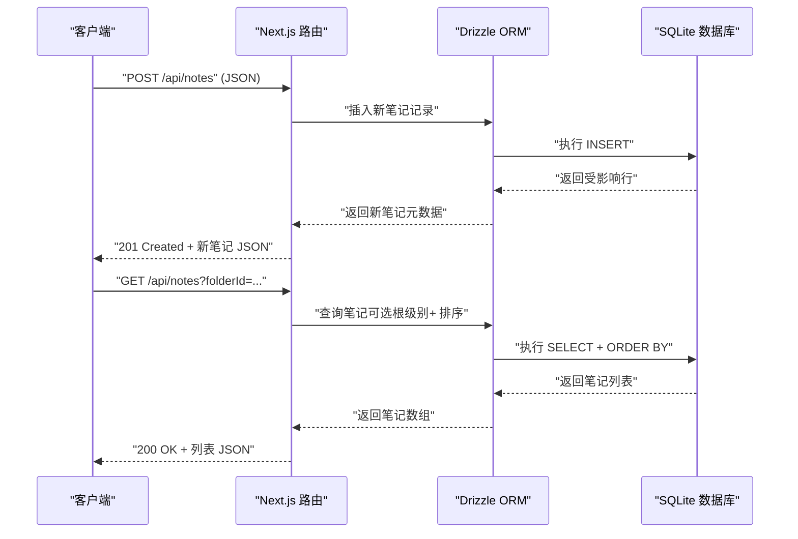
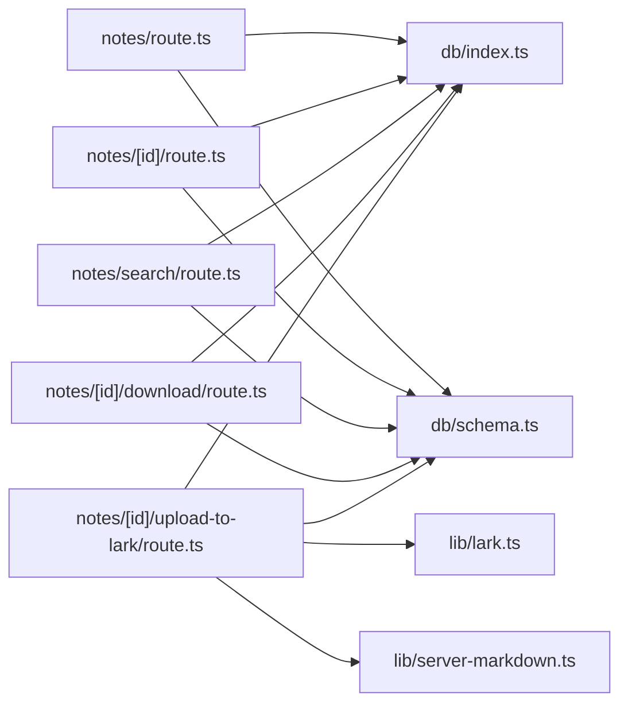

# 笔记 CRUD 操作

<cite>
**本文引用的文件**
- [src/app/api/notes/route.ts](file://src/app/api/notes/route.ts)
- [src/app/api/notes/[id]/route.ts](file://src/app/api/notes/[id]/route.ts)
- [src/app/api/notes/search/route.ts](file://src/app/api/notes/search/route.ts)
- [src/app/api/notes/[id]/download/route.ts](file://src/app/api/notes/[id]/download/route.ts)
- [src/app/api/notes/[id]/upload-to-lark/route.ts](file://src/app/api/notes/[id]/upload-to-lark/route.ts)
- [src/db/schema.ts](file://src/db/schema.ts)
- [src/db/index.ts](file://src/db/index.ts)
- [src/types/index.ts](file://src/types/index.ts)
</cite>

## 目录
1. [简介](#简介)
2. [项目结构](#项目结构)
3. [核心组件](#核心组件)
4. [架构总览](#架构总览)
5. [详细组件分析](#详细组件分析)
6. [依赖关系分析](#依赖关系分析)
7. [性能考量](#性能考量)
8. [故障排查指南](#故障排查指南)
9. [结论](#结论)
10. [附录](#附录)

## 简介
本文件系统性地文档化了笔记的 CRUD（创建、读取、更新、删除）操作，涵盖：
- API 接口规范：HTTP 方法、URL 模式、请求参数与响应格式
- 标题校验规则、字符限制与非法字符过滤机制
- 排序机制与根级别笔记处理逻辑
- 错误处理策略与状态码说明
- 数据库操作与事务处理说明
- 笔记 ID 生成机制与唯一性保证
- 实际调用示例与响应数据格式
- 扩展能力：笔记搜索、下载与飞书导入

## 项目结构
笔记相关 API 位于 Next.js App Router 的路由层，数据访问通过 Drizzle ORM 访问 SQLite 数据库。核心文件组织如下：
- 路由层：notes 列表与单条笔记的 CRUD、搜索、下载、飞书导入
- 数据层：Drizzle 表定义与数据库初始化
- 类型定义：NoteMeta/NoteDetail 等接口

图表来源
- [src/app/api/notes/route.ts:10-40](file://src/app/api/notes/route.ts#L10-L40)
- [src/app/api/notes/[id]/route.ts](file://src/app/api/notes/[id]/route.ts#L9-L27)
- [src/db/index.ts:47-75](file://src/db/index.ts#L47-L75)
- [src/db/schema.ts:27-39](file://src/db/schema.ts#L27-L39)

章节来源
- [src/app/api/notes/route.ts:1-86](file://src/app/api/notes/route.ts#L1-L86)
- [src/app/api/notes/[id]/route.ts](file://src/app/api/notes/[id]/route.ts#L1-L104)
- [src/app/api/notes/search/route.ts:1-44](file://src/app/api/notes/search/route.ts#L1-L44)
- [src/app/api/notes/[id]/download/route.ts](file://src/app/api/notes/[id]/download/route.ts#L1-L33)
- [src/app/api/notes/[id]/upload-to-lark/route.ts](file://src/app/api/notes/[id]/upload-to-lark/route.ts#L1-L299)
- [src/db/schema.ts:27-39](file://src/db/schema.ts#L27-L39)
- [src/db/index.ts:47-75](file://src/db/index.ts#L47-L75)

## 核心组件
- 笔记列表与创建：支持按文件夹筛选、根级别笔记查询、排序与创建
- 单条笔记读取、更新、删除：支持字段级更新、标题校验、移动到文件夹或根级别
- 搜索：基于标题/内容/Markdown 的模糊匹配
- 下载：导出 Markdown 文件
- 飞书导入：将笔记导入飞书云空间并轮询导入结果

章节来源
- [src/app/api/notes/route.ts:10-85](file://src/app/api/notes/route.ts#L10-L85)
- [src/app/api/notes/[id]/route.ts](file://src/app/api/notes/[id]/route.ts#L9-L103)
- [src/app/api/notes/search/route.ts:6-43](file://src/app/api/notes/search/route.ts#L6-L43)
- [src/app/api/notes/[id]/download/route.ts](file://src/app/api/notes/[id]/download/route.ts#L6-L32)
- [src/app/api/notes/[id]/upload-to-lark/route.ts](file://src/app/api/notes/[id]/upload-to-lark/route.ts#L221-L298)

## 架构总览
笔记 CRUD 的端到端流程如下：

图表来源
- [src/app/api/notes/route.ts:10-40](file://src/app/api/notes/route.ts#L10-L40)
- [src/db/index.ts:47-75](file://src/db/index.ts#L47-L75)

## 详细组件分析

### 笔记列表与创建（GET/POST）
- GET /api/notes
  - 查询参数
    - folderId: string（可选）。传入 "root" 表示查询根级别笔记（folderId 为空），传入具体 ID 查询该文件夹下的笔记
  - 返回
    - 数组：包含 id、folderId、title、wordCount、sortOrder、createdAt、updatedAt
    - 排序：先按 sortOrder 升序，再按 createdAt 升序
  - 错误
    - 服务器内部错误：500 + { error: "获取笔记列表失败" }

- POST /api/notes
  - 请求体字段
    - title: string（可选）。若未提供或为空，服务端默认为“未命名笔记”
    - folderId: string|null（可选）。不提供时为 null，表示根级别笔记
    - sortOrder: number（可选）。默认 0
    - 其他字段（如 content/markdown/wordCount）在创建时不会写入，保持 null/0
  - 标题校验
    - 长度限制：不超过 100 字符
    - 非法字符过滤：禁止包含 / \ : * ? " < > |
  - 响应
    - 201 Created + 新笔记 JSON（包含 id、folderId、title、wordCount、sortOrder、createdAt、updatedAt）
  - 错误
    - 标题过长/非法字符：400 + { error: "..."}
    - 服务器内部错误：500 + { error: "创建笔记失败" }

章节来源
- [src/app/api/notes/route.ts:10-40](file://src/app/api/notes/route.ts#L10-L40)
- [src/app/api/notes/route.ts:42-85](file://src/app/api/notes/route.ts#L42-L85)

### 单条笔记读取、更新、删除（GET/PATCH/DELETE）
- GET /api/notes/[id]
  - 路径参数
    - id: string（必填）
  - 返回
    - 笔记完整记录（含 content/markdown/wordCount 等）
  - 错误
    - 不存在：404 + { error: "笔记不存在" }
    - 服务器内部错误：500 + { error: "获取笔记失败" }

- PATCH /api/notes/[id]
  - 路径参数
    - id: string（必填）
  - 支持更新字段（均可选）
    - title: string（非空且长度<=100，不允许非法字符）
    - content: string|null
    - markdown: string|null
    - wordCount: number
    - sortOrder: number
    - folderId: string|null（允许移动到文件夹或设为根级别）
  - 响应
    - 更新后的完整笔记记录
  - 错误
    - 不存在：404 + { error: "笔记不存在" }
    - 标题为空/过长/非法字符：400 + { error: "..."}
    - 服务器内部错误：500 + { error: "更新笔记失败" }

- DELETE /api/notes/[id]
  - 路径参数
    - id: string（必填）
  - 响应
    - { success: true }
  - 错误
    - 不存在：404 + { error: "笔记不存在" }
    - 服务器内部错误：500 + { error: "删除笔记失败" }

章节来源
- [src/app/api/notes/[id]/route.ts](file://src/app/api/notes/[id]/route.ts#L9-L27)
- [src/app/api/notes/[id]/route.ts](file://src/app/api/notes/[id]/route.ts#L29-L82)
- [src/app/api/notes/[id]/route.ts](file://src/app/api/notes/[id]/route.ts#L84-L103)

### 搜索（GET /api/notes/search?q=...）
- 查询参数
  - q: string（必填，空白将返回空列表）
- 匹配范围
  - title、content、markdown 任意一列包含关键词即命中
- 响应
  - { notes: [...] }，数组元素为笔记元数据（id、folderId、title、wordCount、sortOrder、createdAt、updatedAt）
- 错误
  - 服务器内部错误：500 + { error: "搜索笔记失败" }

章节来源
- [src/app/api/notes/search/route.ts:6-43](file://src/app/api/notes/search/route.ts#L6-L43)

### 下载（GET /api/notes/[id]/download）
- 功能
  - 将笔记导出为 Markdown 文件（若无 markdown，则以标题作为文件名并生成基础 Markdown）
- 响应
  - Content-Type: text/markdown; charset=utf-8
  - Content-Disposition: attachment; filename*=UTF-8''...
  - 若笔记不存在：404 + { error: "笔记不存在" }
  - 服务器内部错误：500 + { error: "下载失败" }

章节来源
- [src/app/api/notes/[id]/download/route.ts](file://src/app/api/notes/[id]/download/route.ts#L6-L32)

### 飞书导入（POST /api/notes/[id]/upload-to-lark）
- 功能
  - 将笔记内容序列化为 Markdown 并上传至飞书云盘，创建导入任务并轮询状态，最终返回飞书文档链接
- 前置条件
  - 需配置 LARK_APP_ID、LARK_APP_SECRET；可配置飞书文件夹 token（可选）
- 流程
  1) 校验配置与笔记存在性
  2) 获取 tenant_access_token
  3) 将 Markdown 转为 ArrayBuffer
  4) 上传文件到飞书云盘，获得 file_token
  5) 创建导入任务，获得 ticket
  6) 轮询导入状态，直到成功或失败
- 响应
  - 成功：{ success: true, url: "https://feishu.cn/docx/...", message: "..." }
  - 失败：500 + { error: "..." }

章节来源
- [src/app/api/notes/[id]/upload-to-lark/route.ts](file://src/app/api/notes/[id]/upload-to-lark/route.ts#L221-L298)

### 数据模型与类型
- 数据模型（notes 表）
  - id: text（主键）
  - folderId: text（外键 references folders.id，删除时设为 null）
  - title: text（默认 "未命名笔记"）
  - content: text（可空）
  - markdown: text（可空）
  - wordCount: integer（默认 0）
  - sortOrder: integer（默认 0）
  - createdAt/updatedAt: integer（时间戳）

- 类型定义（NoteMeta/NoteDetail）
  - NoteMeta：id、folderId、title、wordCount、sortOrder、createdAt、updatedAt
  - NoteDetail：在 NoteMeta 基础上增加 content、markdown

章节来源
- [src/db/schema.ts:27-39](file://src/db/schema.ts#L27-L39)
- [src/types/index.ts:12-25](file://src/types/index.ts#L12-L25)

### 排序机制与根级别笔记处理
- 排序
  - 列表查询默认按 sortOrder 升序，再按 createdAt 升序
- 根级别笔记
  - 通过 folderId 参数控制：传入 "root" 查询 folderId 为 NULL 的笔记；传入具体 ID 查询对应文件夹下笔记；不传则查询全部

章节来源
- [src/app/api/notes/route.ts:27-34](file://src/app/api/notes/route.ts#L27-L34)

### 标题验证规则与非法字符过滤
- 长度限制：不超过 100 字符
- 非法字符过滤：禁止包含 / \ : * ? " < > |
- 应用场景
  - 创建与更新时均进行校验
  - 下载时对文件名进行替换（/ \ : * ? " < > | 替换为 _）

章节来源
- [src/app/api/notes/route.ts:7-8](file://src/app/api/notes/route.ts#L7-L8)
- [src/app/api/notes/[id]/route.ts](file://src/app/api/notes/[id]/route.ts#L6-L7)
- [src/app/api/notes/[id]/download/route.ts](file://src/app/api/notes/[id]/download/route.ts#L20)

### 错误处理策略与状态码
- 通用错误响应
  - 结构：{ error: "..." }
  - 常见状态码
    - 400：请求参数无效（如标题过长/非法字符、缺少必要字段）
    - 404：资源不存在（如笔记不存在）
    - 500：服务器内部错误
- 特定场景
  - 列表/搜索/下载/导入：统一采用上述模式
  - 创建/更新/删除：遵循相应业务语义的状态码

章节来源
- [src/app/api/notes/route.ts:36-38](file://src/app/api/notes/route.ts#L36-L38)
- [src/app/api/notes/route.ts:82-84](file://src/app/api/notes/route.ts#L82-L84)
- [src/app/api/notes/[id]/route.ts](file://src/app/api/notes/[id]/route.ts#L18-L20)
- [src/app/api/notes/[id]/route.ts](file://src/app/api/notes/[id]/route.ts#L39-L41)
- [src/app/api/notes/[id]/route.ts](file://src/app/api/notes/[id]/route.ts#L93-L95)
- [src/app/api/notes/search/route.ts:39-42](file://src/app/api/notes/search/route.ts#L39-L42)
- [src/app/api/notes/[id]/download/route.ts](file://src/app/api/notes/[id]/download/route.ts#L28-L31)
- [src/app/api/notes/[id]/upload-to-lark/route.ts](file://src/app/api/notes/[id]/upload-to-lark/route.ts#L226-L231)
- [src/app/api/notes/[id]/upload-to-lark/route.ts](file://src/app/api/notes/[id]/upload-to-lark/route.ts#L290-L297)

### 数据库操作与事务处理
- 初始化
  - 数据库路径通过环境变量 DATABASE_PATH 控制，默认 ./data/ynote.db
  - 启用 WAL 模式与外键约束
  - 自动创建表与索引（notes/folders/file_attachments 等）
- 事务
  - 当前实现未显式使用事务块；Drizzle ORM 在单条 INSERT/UPDATE/DELETE 中通常以原子方式执行
  - 如需跨多表一致性操作，建议在应用层封装事务（当前未见此类需求）

章节来源
- [src/db/index.ts:8-25](file://src/db/index.ts#L8-L25)
- [src/db/index.ts:163-168](file://src/db/index.ts#L163-L168)
- [src/db/index.ts:47-75](file://src/db/index.ts#L47-L75)

### 笔记 ID 生成机制与唯一性保证
- ID 生成
  - 使用 nanoid 生成全局唯一字符串 ID
- 唯一性保证
  - 数据库层为主键约束（id text primary key）
  - 与文件夹/附件等外键关系通过 Drizzle 定义与 SQLite 外键约束保障

章节来源
- [src/app/api/notes/route.ts](file://src/app/api/notes/route.ts#L61)
- [src/db/schema.ts](file://src/db/schema.ts#L28)
- [src/db/index.ts:47-57](file://src/db/index.ts#L47-L57)

### API 调用示例与响应格式
以下示例展示常见场景的调用方式与响应结构（仅示意，非代码片段）：
- 创建笔记
  - 请求：POST /api/notes
  - 请求体：{ title: "我的笔记", folderId: "xxx", sortOrder: 1 }
  - 响应：201 + { id, folderId, title, wordCount, sortOrder, createdAt, updatedAt }
- 获取笔记列表
  - 请求：GET /api/notes?folderId=root
  - 响应：200 + [{ id, folderId, title, wordCount, sortOrder, createdAt, updatedAt }, ...]
- 更新笔记
  - 请求：PATCH /api/notes/[id]
  - 请求体：{ title: "新标题", sortOrder: 2, folderId: null }
  - 响应：200 + 更新后的完整笔记对象
- 删除笔记
  - 请求：DELETE /api/notes/[id]
  - 响应：200 + { success: true }
- 搜索笔记
  - 请求：GET /api/notes/search?q=关键词
  - 响应：200 + { notes: [...] }
- 下载笔记
  - 请求：GET /api/notes/[id]/download
  - 响应：200 + text/markdown 文件流
- 飞书导入
  - 请求：POST /api/notes/[id]/upload-to-lark
  - 响应：200 + { success: true, url: "...", message: "..." }

章节来源
- [src/app/api/notes/route.ts:42-85](file://src/app/api/notes/route.ts#L42-L85)
- [src/app/api/notes/[id]/route.ts](file://src/app/api/notes/[id]/route.ts#L29-L82)
- [src/app/api/notes/search/route.ts:6-43](file://src/app/api/notes/search/route.ts#L6-L43)
- [src/app/api/notes/[id]/download/route.ts](file://src/app/api/notes/[id]/download/route.ts#L6-L32)
- [src/app/api/notes/[id]/upload-to-lark/route.ts](file://src/app/api/notes/[id]/upload-to-lark/route.ts#L221-L298)

## 依赖关系分析

图表来源
- [src/app/api/notes/route.ts:1-5](file://src/app/api/notes/route.ts#L1-L5)
- [src/app/api/notes/[id]/route.ts](file://src/app/api/notes/[id]/route.ts#L1-L4)
- [src/app/api/notes/search/route.ts:1-4](file://src/app/api/notes/search/route.ts#L1-L4)
- [src/app/api/notes/[id]/download/route.ts](file://src/app/api/notes/[id]/download/route.ts#L1-L4)
- [src/app/api/notes/[id]/upload-to-lark/route.ts](file://src/app/api/notes/[id]/upload-to-lark/route.ts#L1-L6)
- [src/db/index.ts:1-3](file://src/db/index.ts#L1-L3)
- [src/db/schema.ts:1-3](file://src/db/schema.ts#L1-L3)

章节来源
- [src/app/api/notes/route.ts:1-5](file://src/app/api/notes/route.ts#L1-L5)
- [src/app/api/notes/[id]/route.ts](file://src/app/api/notes/[id]/route.ts#L1-L4)
- [src/app/api/notes/search/route.ts:1-4](file://src/app/api/notes/search/route.ts#L1-L4)
- [src/app/api/notes/[id]/download/route.ts](file://src/app/api/notes/[id]/download/route.ts#L1-L4)
- [src/app/api/notes/[id]/upload-to-lark/route.ts](file://src/app/api/notes/[id]/upload-to-lark/route.ts#L1-L6)
- [src/db/index.ts:1-3](file://src/db/index.ts#L1-L3)
- [src/db/schema.ts:1-3](file://src/db/schema.ts#L1-L3)

## 性能考量
- 查询优化
  - notes 表已建立 folder_id 索引，按 folderId 查询具备良好性能
  - 列表查询默认排序为复合索引顺序，避免额外排序开销
- 写入优化
  - 单条 INSERT/UPDATE/DELETE 为原子操作，避免频繁事务切换
- 搜索优化
  - 搜索对 title/content/markdown 进行 OR 条件匹配，建议在高频关键词场景下考虑全文检索或缓存策略
- 导入性能
  - 飞书导入为外部 API 调用，受网络与服务端处理时间影响，当前实现采用轮询查询状态

[本节为通用性能建议，不直接分析特定文件]

## 故障排查指南
- 常见问题与定位
  - 404：确认笔记 ID 是否正确，或是否已被删除
  - 400：检查标题长度与非法字符；确认必需字段是否缺失
  - 500：查看服务端日志，关注数据库连接与 SQL 执行异常
- 数据库相关
  - 确认 DATABASE_PATH 指向有效路径，数据库文件可读写
  - 检查 WAL 模式与外键约束是否启用
- 飞书导入
  - 确认 LARK_APP_ID/LARK_APP_SECRET 已配置
  - 关注导入任务轮询超时与失败原因

章节来源
- [src/app/api/notes/[id]/route.ts](file://src/app/api/notes/[id]/route.ts#L18-L20)
- [src/app/api/notes/[id]/route.ts](file://src/app/api/notes/[id]/route.ts#L39-L41)
- [src/app/api/notes/[id]/route.ts](file://src/app/api/notes/[id]/route.ts#L93-L95)
- [src/db/index.ts:16-18](file://src/db/index.ts#L16-L18)
- [src/app/api/notes/[id]/upload-to-lark/route.ts](file://src/app/api/notes/[id]/upload-to-lark/route.ts#L226-L231)
- [src/app/api/notes/[id]/upload-to-lark/route.ts](file://src/app/api/notes/[id]/upload-to-lark/route.ts#L290-L297)

## 结论
本文件对笔记 CRUD 操作进行了全面文档化，覆盖了接口规范、数据校验、排序与根级别处理、错误处理、数据库设计与 ID 生成机制，并提供了扩展能力（搜索、下载、飞书导入）的说明。建议在生产环境中结合缓存与全文检索进一步优化搜索性能，并在需要强一致性的场景引入显式事务封装。

[本节为总结性内容，不直接分析特定文件]

## 附录
- 环境变量
  - DATABASE_PATH：数据库文件路径（默认 ./data/ynote.db）
  - LARK_APP_ID、LARK_APP_SECRET：飞书导入所需配置
  - AUTH_SECRET_KEY：初始化管理员用户密码哈希（可选）
- 索引与约束
  - notes.id 主键
  - notes.folder_id 外键（删除时设为 NULL）
  - idx_notes_folder_id：加速按文件夹查询

章节来源
- [src/db/index.ts](file://src/db/index.ts#L8)
- [src/db/index.ts:16-18](file://src/db/index.ts#L16-L18)
- [src/db/index.ts:73-75](file://src/db/index.ts#L73-L75)
- [src/db/schema.ts:28-31](file://src/db/schema.ts#L28-L31)