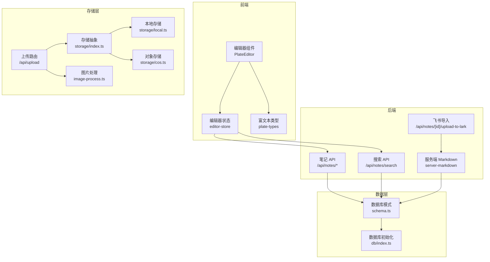
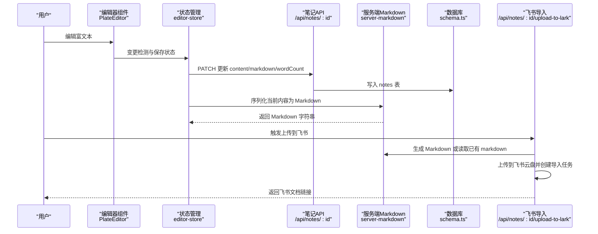
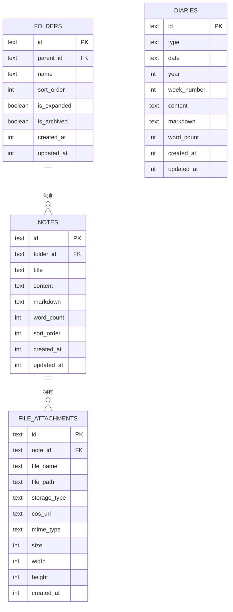
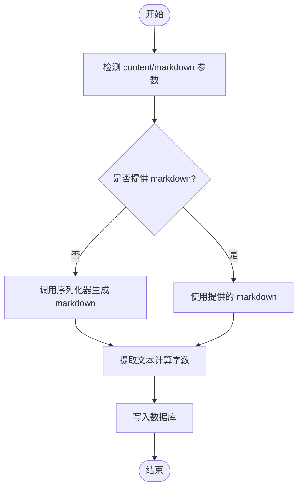
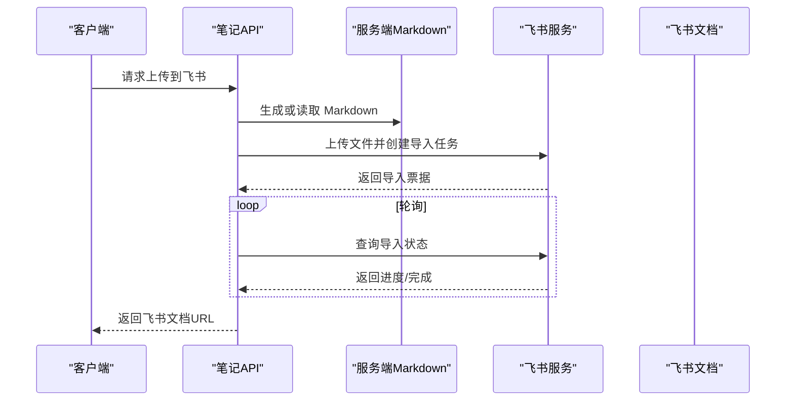
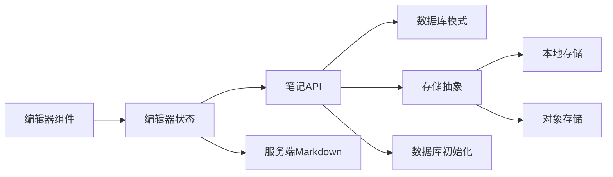

# 笔记内容管理

<cite>
**本文引用的文件**
- [src/db/schema.ts](file://src/db/schema.ts)
- [src/db/index.ts](file://src/db/index.ts)
- [src/types/index.ts](file://src/types/index.ts)
- [src/components/editor/plate-types.ts](file://src/components/editor/plate-types.ts)
- [src/components/editor/plugins/markdown-kit.tsx](file://src/components/editor/plugins/markdown-kit.tsx)
- [src/lib/server-markdown.ts](file://src/lib/server-markdown.ts)
- [src/components/editor/plate-editor.tsx](file://src/components/editor/plate-editor.tsx)
- [src/stores/editor-store.ts](file://src/stores/editor-store.ts)
- [src/app/api/notes/route.ts](file://src/app/api/notes/route.ts)
- [src/app/api/notes/[id]/route.ts](file://src/app/api/notes/[id]/route.ts)
- [src/app/api/notes/search/route.ts](file://src/app/api/notes/search/route.ts)
- [src/app/api/notes/[id]/upload-to-lark/route.ts](file://src/app/api/notes/[id]/upload-to-lark/route.ts)
- [src/lib/storage/index.ts](file://src/lib/storage/index.ts)
- [src/lib/storage/local.ts](file://src/lib/storage/local.ts)
- [src/lib/storage/cos.ts](file://src/lib/storage/cos.ts)
- [src/lib/image-process.ts](file://src/lib/image-process.ts)
- [src/app/api/upload/route.ts](file://src/app/api/upload/route.ts)
</cite>

## 目录
1. [简介](#简介)
2. [项目结构](#项目结构)
3. [核心组件](#核心组件)
4. [架构总览](#架构总览)
5. [详细组件分析](#详细组件分析)
6. [依赖关系分析](#依赖关系分析)
7. [性能考量](#性能考量)
8. [故障排查指南](#故障排查指南)
9. [结论](#结论)
10. [附录](#附录)

## 简介
本文件面向“笔记内容管理”主题，系统性梳理笔记数据结构、富文本与纯文本的双向转换、Markdown 解析与渲染、版本与历史记录、同步与冲突处理、存储与压缩优化、安全检查与清理、迁移与备份恢复，以及最佳实践与性能优化建议。文档以仓库现有实现为依据，结合数据库模式、编辑器类型定义、服务端 Markdown 序列化、前端编辑器与状态管理、API 接口与存储抽象等模块进行深入分析。

## 项目结构
项目采用前后端同构的 Next.js 架构，笔记内容相关的核心目录与文件如下：
- 数据层：SQLite 模式定义与初始化、索引与迁移
- 类型层：笔记元数据与详情接口定义
- 编辑器层：Plate.js 富文本类型与插件配置、编辑器组件与序列化回调
- 服务端：笔记 API、搜索 API、Markdown 序列化工具、飞书导入流程
- 存储层：本地与对象存储抽象、图片处理与上传路由

图表来源
- [src/components/editor/plate-editor.tsx:63-174](file://src/components/editor/plate-editor.tsx#L63-L174)
- [src/stores/editor-store.ts:88-280](file://src/stores/editor-store.ts#L88-L280)
- [src/components/editor/plate-types.ts:1-164](file://src/components/editor/plate-types.ts#L1-L164)
- [src/app/api/notes/route.ts:1-86](file://src/app/api/notes/route.ts#L1-L86)
- [src/app/api/notes/search/route.ts:1-44](file://src/app/api/notes/search/route.ts#L1-L44)
- [src/app/api/notes/[id]/upload-to-lark/route.ts](file://src/app/api/notes/[id]/upload-to-lark/route.ts#L1-L322)
- [src/lib/server-markdown.ts:1-138](file://src/lib/server-markdown.ts#L1-L138)
- [src/db/schema.ts:27-39](file://src/db/schema.ts#L27-L39)
- [src/db/index.ts:1-171](file://src/db/index.ts#L1-L171)
- [src/lib/storage/index.ts:1-29](file://src/lib/storage/index.ts#L1-L29)
- [src/lib/storage/local.ts:1-28](file://src/lib/storage/local.ts#L1-L28)
- [src/lib/storage/cos.ts:1-61](file://src/lib/storage/cos.ts#L1-L61)
- [src/lib/image-process.ts:1-20](file://src/lib/image-process.ts#L1-L20)
- [src/app/api/upload/route.ts:1-126](file://src/app/api/upload/route.ts#L1-L126)

章节来源
- [src/db/schema.ts:1-105](file://src/db/schema.ts#L1-L105)
- [src/db/index.ts:1-171](file://src/db/index.ts#L1-L171)
- [src/types/index.ts:1-74](file://src/types/index.ts#L1-L74)
- [src/components/editor/plate-types.ts:1-164](file://src/components/editor/plate-types.ts#L1-L164)
- [src/components/editor/plugins/markdown-kit.tsx:1-12](file://src/components/editor/plugins/markdown-kit.tsx#L1-L12)
- [src/lib/server-markdown.ts:1-138](file://src/lib/server-markdown.ts#L1-L138)
- [src/components/editor/plate-editor.tsx:1-175](file://src/components/editor/plate-editor.tsx#L1-L175)
- [src/stores/editor-store.ts:1-281](file://src/stores/editor-store.ts#L1-L281)
- [src/app/api/notes/route.ts:1-86](file://src/app/api/notes/route.ts#L1-L86)
- [src/app/api/notes/[id]/route.ts](file://src/app/api/notes/[id]/route.ts#L1-L104)
- [src/app/api/notes/search/route.ts:1-44](file://src/app/api/notes/search/route.ts#L1-L44)
- [src/app/api/notes/[id]/upload-to-lark/route.ts](file://src/app/api/notes/[id]/upload-to-lark/route.ts#L1-L322)
- [src/lib/storage/index.ts:1-29](file://src/lib/storage/index.ts#L1-L29)
- [src/lib/storage/local.ts:1-28](file://src/lib/storage/local.ts#L1-L28)
- [src/lib/storage/cos.ts:1-61](file://src/lib/storage/cos.ts#L1-L61)
- [src/lib/image-process.ts:1-20](file://src/lib/image-process.ts#L1-L20)
- [src/app/api/upload/route.ts:1-126](file://src/app/api/upload/route.ts#L1-L126)

## 核心组件
- 数据模型与存储
  - 笔记表包含富文本 JSON、Markdown 文本、字数统计、排序与时间戳字段，支持按文件夹归档与排序。
  - 日记表同样具备富文本与 Markdown 字段，便于统一管理。
  - 数据库初始化时创建表、索引，并执行迁移（如新增归档字段）。
- 富文本类型与插件
  - 定义了丰富的富文本节点类型（标题、段落、代码块、表格、图片、媒体嵌入、切换块等），并提供基础插件集合。
  - 前端与服务端均使用 Plate.js 的 Markdown 插件链，确保序列化一致性。
- 编辑器与状态管理
  - 编辑器组件负责内容变更检测、基线值维护、序列化回调注册与保存流程。
  - 状态管理包含当前编辑项、初始内容、当前编辑内容、Markdown 序列化器、保存状态、字数统计与 LRU 内容缓存。
- API 与同步
  - 提供笔记列表、创建、查询、更新、删除与全文检索接口。
  - 支持将笔记导出为 Markdown 并上传至飞书文档，实现跨平台同步。
- 存储与压缩
  - 抽象存储提供本地与对象存储两种实现，上传路由对图片进行 WebP 压缩与尺寸调整，其他媒体保持原格式。
  - 附件表记录文件名、路径、类型、大小与维度信息，便于展示与清理。

章节来源
- [src/db/schema.ts:27-39](file://src/db/schema.ts#L27-L39)
- [src/db/schema.ts:93-104](file://src/db/schema.ts#L93-L104)
- [src/db/index.ts:27-158](file://src/db/index.ts#L27-L158)
- [src/components/editor/plate-types.ts:25-164](file://src/components/editor/plate-types.ts#L25-L164)
- [src/components/editor/plugins/markdown-kit.tsx:1-12](file://src/components/editor/plugins/markdown-kit.tsx#L1-L12)
- [src/components/editor/plate-editor.tsx:63-174](file://src/components/editor/plate-editor.tsx#L63-L174)
- [src/stores/editor-store.ts:88-280](file://src/stores/editor-store.ts#L88-L280)
- [src/app/api/notes/route.ts:1-86](file://src/app/api/notes/route.ts#L1-L86)
- [src/app/api/notes/[id]/route.ts](file://src/app/api/notes/[id]/route.ts#L1-L104)
- [src/app/api/notes/search/route.ts:1-44](file://src/app/api/notes/search/route.ts#L1-L44)
- [src/app/api/notes/[id]/upload-to-lark/route.ts](file://src/app/api/notes/[id]/upload-to-lark/route.ts#L1-L322)
- [src/lib/storage/index.ts:1-29](file://src/lib/storage/index.ts#L1-L29)
- [src/lib/storage/local.ts:1-28](file://src/lib/storage/local.ts#L1-L28)
- [src/lib/storage/cos.ts:1-61](file://src/lib/storage/cos.ts#L1-L61)
- [src/lib/image-process.ts:1-20](file://src/lib/image-process.ts#L1-L20)
- [src/app/api/upload/route.ts:1-126](file://src/app/api/upload/route.ts#L1-L126)

## 架构总览
下图展示了从用户编辑到持久化、序列化与外部同步的整体流程。

图表来源
- [src/components/editor/plate-editor.tsx:84-99](file://src/components/editor/plate-editor.tsx#L84-L99)
- [src/stores/editor-store.ts:204-275](file://src/stores/editor-store.ts#L204-L275)
- [src/app/api/notes/[id]/route.ts](file://src/app/api/notes/[id]/route.ts#L29-L82)
- [src/lib/server-markdown.ts:85-137](file://src/lib/server-markdown.ts#L85-L137)
- [src/db/schema.ts:27-39](file://src/db/schema.ts#L27-L39)
- [src/app/api/notes/[id]/upload-to-lark/route.ts](file://src/app/api/notes/[id]/upload-to-lark/route.ts#L236-L322)

## 详细组件分析

### 数据结构与存储格式
- 笔记表字段
  - id、folderId、title、content(JSON)、markdown、wordCount、sortOrder、createdAt、updatedAt。
  - content 为富文本 JSON 结构，markdown 为纯文本 Markdown。
- 日记表字段
  - 含 type/date/year/weekNumber 以支持日/周日记，同时具备 content 与 markdown 字段。
- 数据库初始化与迁移
  - 初始化时创建表与索引，若缺失列则执行 ALTER 迁移。
  - 使用 WAL 模式与外键约束提升并发与一致性。
- 类型定义
  - NoteMeta/NoteDetail/Heading/SaveStatus/AppTab/Tag/Idea/IdeaImage/DiaryEntry 等接口明确前后端交互契约。

图表来源
- [src/db/schema.ts:10-25](file://src/db/schema.ts#L10-L25)
- [src/db/schema.ts:27-39](file://src/db/schema.ts#L27-L39)
- [src/db/schema.ts:41-55](file://src/db/schema.ts#L41-L55)
- [src/db/schema.ts:93-104](file://src/db/schema.ts#L93-L104)

章节来源
- [src/db/schema.ts:1-105](file://src/db/schema.ts#L1-L105)
- [src/db/index.ts:27-158](file://src/db/index.ts#L27-L158)
- [src/types/index.ts:1-74](file://src/types/index.ts#L1-L74)

### 富文本与纯文本转换机制
- 前端序列化
  - 编辑器组件在挂载时注册 Markdown 序列化器，保存时调用该回调生成 Markdown。
  - 字数统计通过递归提取文本节点计算。
- 服务端序列化
  - 提供 serializeToMarkdown 与 serializeNoteToMarkdown，基于 Plate.js 的 Markdown 插件链与 remark 插件（数学公式、GFM、Mention、MDX）。
  - 支持为笔记添加标题前缀，避免重复标题。
- 插件链
  - 前端与服务端共享 Markdown 插件配置，保证序列化结果一致。

图表来源
- [src/stores/editor-store.ts:204-275](file://src/stores/editor-store.ts#L204-L275)
- [src/lib/server-markdown.ts:85-137](file://src/lib/server-markdown.ts#L85-L137)
- [src/components/editor/plugins/markdown-kit.tsx:1-12](file://src/components/editor/plugins/markdown-kit.tsx#L1-L12)

章节来源
- [src/components/editor/plate-editor.tsx:146-153](file://src/components/editor/plate-editor.tsx#L146-L153)
- [src/stores/editor-store.ts:204-275](file://src/stores/editor-store.ts#L204-L275)
- [src/lib/server-markdown.ts:85-137](file://src/lib/server-markdown.ts#L85-L137)
- [src/components/editor/plugins/markdown-kit.tsx:1-12](file://src/components/editor/plugins/markdown-kit.tsx#L1-L12)

### Markdown 解析与渲染
- 解析
  - 服务端使用 Plate.js 的 Markdown 插件链与 remark 生态，支持数学公式、表格、脚注、Mention 等扩展。
- 渲染
  - 前端编辑器基于 Plate.js 插件集，支持块级元素、内联样式、列表、代码块、链接、图片、表格、媒体嵌入、切换块等。
  - 通过类型定义 MyValue/MyBlockElement 等，确保节点结构与渲染行为一致。

章节来源
- [src/lib/server-markdown.ts:1-138](file://src/lib/server-markdown.ts#L1-L138)
- [src/components/editor/plate-types.ts:1-164](file://src/components/editor/plate-types.ts#L1-L164)
- [src/components/editor/plugins/markdown-kit.tsx:1-12](file://src/components/editor/plugins/markdown-kit.tsx#L1-L12)

### 版本控制与历史记录管理
- 历史记录
  - 编辑器组件在笔记切换时清空撤销/重做历史，防止跨笔记状态污染。
  - 保存后以当前内容作为基线值，用于后续变更检测。
- 版本控制
  - 当前实现未见独立的“版本表”或“历史快照表”，笔记仅保留单次内容与更新时间戳。
  - 若需增强版本控制，可在现有 notes 表基础上增加版本表或引入增量日志。

章节来源
- [src/components/editor/plate-editor.tsx:102-136](file://src/components/editor/plate-editor.tsx#L102-L136)
- [src/stores/editor-store.ts:140-144](file://src/stores/editor-store.ts#L140-L144)

### 内容同步与冲突解决机制
- 飞书导入
  - 通过租户访问令牌获取、目标文件夹路径构建、Markdown Buffer 上传、导入任务创建与轮询，最终返回飞书文档链接。
  - 若笔记已有 markdown 则直接使用，否则从富文本序列化生成。
- 冲突处理
  - 当前未实现双向冲突合并逻辑，建议在导入后对比标题/内容差异，必要时提示用户确认覆盖或合并。

图表来源
- [src/app/api/notes/[id]/upload-to-lark/route.ts](file://src/app/api/notes/[id]/upload-to-lark/route.ts#L236-L322)
- [src/lib/server-markdown.ts:116-137](file://src/lib/server-markdown.ts#L116-L137)

章节来源
- [src/app/api/notes/[id]/upload-to-lark/route.ts](file://src/app/api/notes/[id]/upload-to-lark/route.ts#L1-L322)
- [src/lib/server-markdown.ts:85-137](file://src/lib/server-markdown.ts#L85-L137)

### 内容压缩与存储优化策略
- 图片压缩
  - 使用 Sharp 对图片进行最大宽度限制与 WebP 转码，降低体积与带宽占用。
- 上传路由
  - 根据文件类型选择压缩或直传策略，设置不同最大文件大小阈值。
- 存储抽象
  - 支持本地与对象存储（COS），可按需切换与扩展。
- 附件表
  - 记录文件名、路径、类型、大小与维度，便于展示与清理。

章节来源
- [src/lib/image-process.ts:1-20](file://src/lib/image-process.ts#L1-L20)
- [src/app/api/upload/route.ts:1-126](file://src/app/api/upload/route.ts#L1-L126)
- [src/lib/storage/index.ts:1-29](file://src/lib/storage/index.ts#L1-L29)
- [src/lib/storage/local.ts:1-28](file://src/lib/storage/local.ts#L1-L28)
- [src/lib/storage/cos.ts:1-61](file://src/lib/storage/cos.ts#L1-L61)
- [src/db/schema.ts:41-55](file://src/db/schema.ts#L41-L55)

### 内容安全检查与清理机制
- 标题校验
  - 创建/更新接口对标题长度与非法字符进行校验，避免路径注入与异常。
- 富文本安全
  - 当前未见专门的富文本 HTML/CSS/JS 清理逻辑，建议在序列化为 Markdown 或渲染前引入白名单清理策略。
- 附件清理
  - 删除笔记时级联删除附件；上传路由提供删除接口，便于定期清理无效文件。

章节来源
- [src/app/api/notes/route.ts:42-85](file://src/app/api/notes/route.ts#L42-L85)
- [src/app/api/notes/[id]/route.ts](file://src/app/api/notes/[id]/route.ts#L29-L82)
- [src/db/schema.ts:41-55](file://src/db/schema.ts#L41-L55)
- [src/app/api/upload/route.ts:1-126](file://src/app/api/upload/route.ts#L1-L126)

### 内容迁移与备份恢复
- 数据库迁移
  - 初始化时自动创建表与索引，并对旧表执行列迁移（如新增 is_archived）。
- 备份
  - SQLite 数据库存放在可配置路径，可通过复制数据库文件实现备份。
- 恢复
  - 恢复时重建表结构与索引，确保兼容新版本字段。

章节来源
- [src/db/index.ts:27-158](file://src/db/index.ts#L27-L158)

## 依赖关系分析
- 组件耦合
  - 编辑器组件依赖状态管理与类型定义；状态管理依赖 API 与序列化工具。
  - API 层依赖数据库模式与存储抽象；存储抽象依赖具体实现。
- 外部依赖
  - Plate.js 与 remark 生态用于富文本与 Markdown 处理。
  - better-sqlite3 与 drizzle-orm 用于 ORM 映射与事务控制。
  - Sharp 用于图片处理；COS SDK 用于对象存储。

图表来源
- [src/components/editor/plate-editor.tsx:63-174](file://src/components/editor/plate-editor.tsx#L63-L174)
- [src/stores/editor-store.ts:88-280](file://src/stores/editor-store.ts#L88-L280)
- [src/app/api/notes/[id]/route.ts](file://src/app/api/notes/[id]/route.ts#L29-L82)
- [src/lib/server-markdown.ts:85-137](file://src/lib/server-markdown.ts#L85-L137)
- [src/db/schema.ts:27-39](file://src/db/schema.ts#L27-L39)
- [src/db/index.ts:1-171](file://src/db/index.ts#L1-L171)
- [src/lib/storage/index.ts:1-29](file://src/lib/storage/index.ts#L1-L29)
- [src/lib/storage/local.ts:1-28](file://src/lib/storage/local.ts#L1-L28)
- [src/lib/storage/cos.ts:1-61](file://src/lib/storage/cos.ts#L1-L61)

章节来源
- [src/components/editor/plate-editor.tsx:1-175](file://src/components/editor/plate-editor.tsx#L1-L175)
- [src/stores/editor-store.ts:1-281](file://src/stores/editor-store.ts#L1-L281)
- [src/app/api/notes/[id]/route.ts](file://src/app/api/notes/[id]/route.ts#L1-L104)
- [src/lib/server-markdown.ts:1-138](file://src/lib/server-markdown.ts#L1-L138)
- [src/db/schema.ts:1-105](file://src/db/schema.ts#L1-L105)
- [src/db/index.ts:1-171](file://src/db/index.ts#L1-L171)
- [src/lib/storage/index.ts:1-29](file://src/lib/storage/index.ts#L1-L29)
- [src/lib/storage/local.ts:1-28](file://src/lib/storage/local.ts#L1-L28)
- [src/lib/storage/cos.ts:1-61](file://src/lib/storage/cos.ts#L1-L61)

## 性能考量
- 编辑器性能
  - 使用结构化比较函数替代 JSON 序列化，减少不必要的保存与渲染开销。
  - LRU 内容缓存降低重复加载成本，建议合理设置缓存大小上限。
- 序列化性能
  - 服务端序列化仅在需要时触发，避免频繁计算。
  - 图片压缩在上传阶段完成，减少运行时 CPU 占用。
- 数据库性能
  - 使用 WAL 模式与外键约束；为常用查询字段建立索引（文件夹、笔记、附件、日记唯一索引）。
- 网络与存储
  - 对象存储上传采用异步回调，避免阻塞主线程；本地存储适合小规模部署。

章节来源
- [src/components/editor/plate-editor.tsx:16-61](file://src/components/editor/plate-editor.tsx#L16-L61)
- [src/stores/editor-store.ts:7-77](file://src/stores/editor-store.ts#L7-L77)
- [src/db/index.ts:17-18](file://src/db/index.ts#L17-L18)
- [src/lib/image-process.ts:1-20](file://src/lib/image-process.ts#L1-L20)

## 故障排查指南
- 编辑器无响应或保存失败
  - 检查序列化器是否正确注册；查看保存状态变化与错误提示。
  - 确认网络请求返回状态码与错误信息。
- 富文本显示异常
  - 核对富文本 JSON 结构是否符合类型定义；检查插件链配置是否一致。
- Markdown 生成为空
  - 确认 content 是否为有效 JSON；检查服务端序列化错误日志。
- 飞书导入失败
  - 检查租户令牌获取、文件夹路径构建、上传与导入任务状态轮询。
- 存储问题
  - 本地存储路径权限；对象存储密钥配置；上传文件大小与类型限制。

章节来源
- [src/stores/editor-store.ts:204-275](file://src/stores/editor-store.ts#L204-L275)
- [src/lib/server-markdown.ts:104-107](file://src/lib/server-markdown.ts#L104-L107)
- [src/app/api/notes/[id]/upload-to-lark/route.ts](file://src/app/api/notes/[id]/upload-to-lark/route.ts#L241-L321)
- [src/lib/storage/index.ts:15-28](file://src/lib/storage/index.ts#L15-L28)
- [src/app/api/upload/route.ts:8-126](file://src/app/api/upload/route.ts#L8-L126)

## 结论
本项目以 SQLite 为核心存储，结合 Plate.js 富文本编辑与 Markdown 序列化，实现了笔记内容的高效管理与跨平台同步。当前实现聚焦于富文本与 Markdown 的双向转换、基础版本与历史记录、存储优化与安全校验。为进一步完善，建议补充独立版本表、冲突合并策略、富文本安全清理与更完善的备份恢复方案。

## 附录
- 最佳实践
  - 保存前进行富文本结构校验与最小化序列化。
  - 使用 LRU 缓存与增量更新减少网络与数据库压力。
  - 在导入外部平台前进行内容去重与冲突提示。
  - 对图片与大文件进行压缩与分片上传。
- 性能优化建议
  - 前端：结构化比较、批量保存、延迟序列化。
  - 后端：连接池、索引优化、WAL 模式、只读副本。
  - 存储：CDN 加速、冷热分层、生命周期管理。