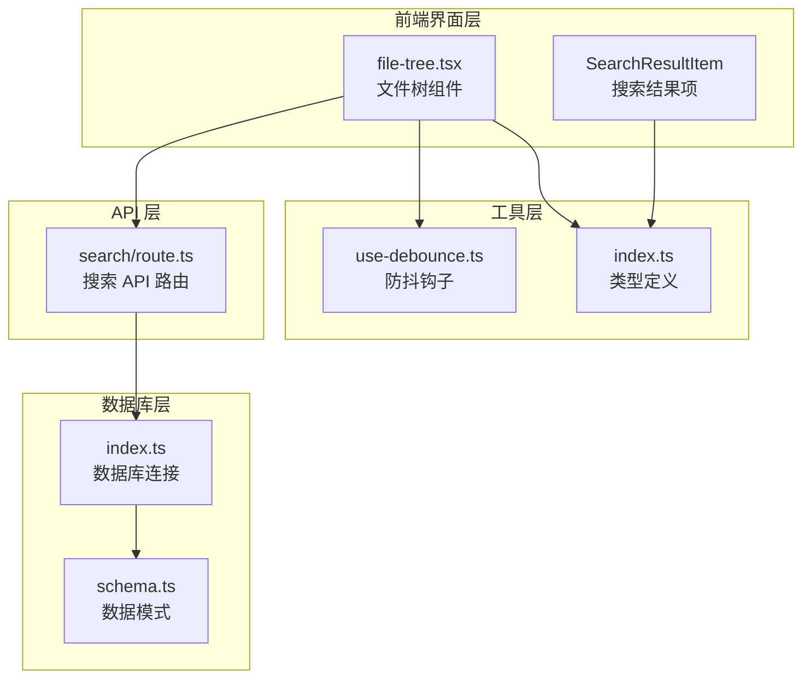
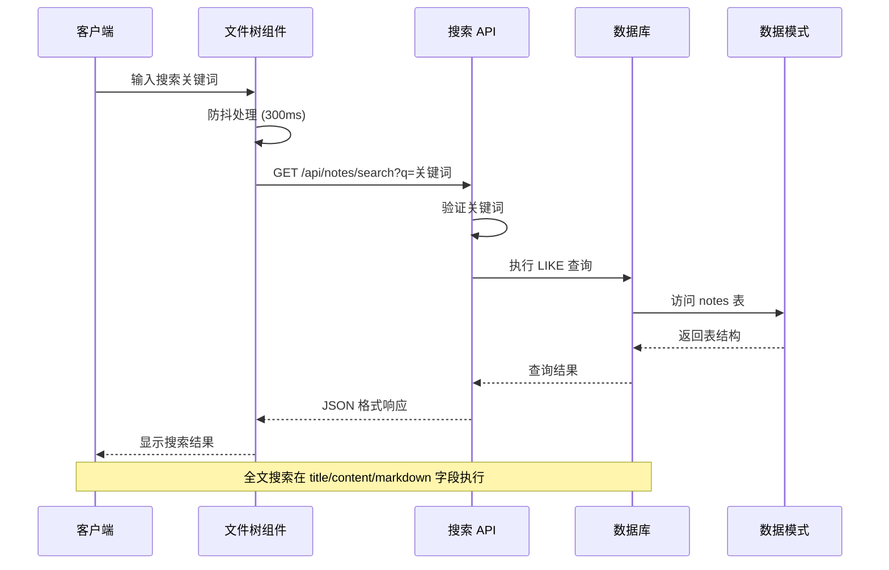
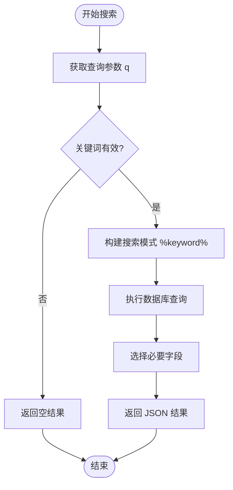
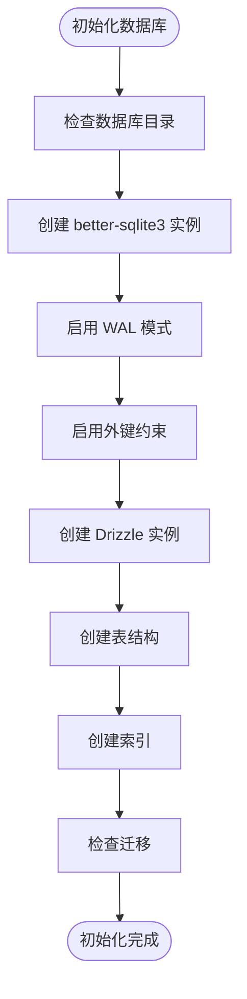
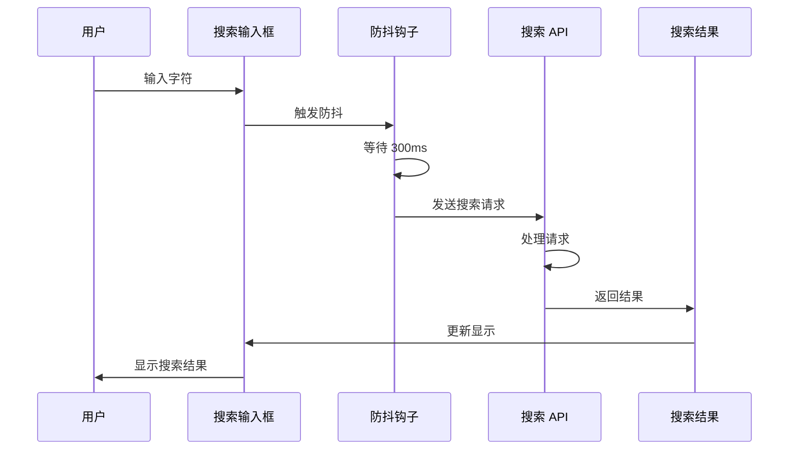
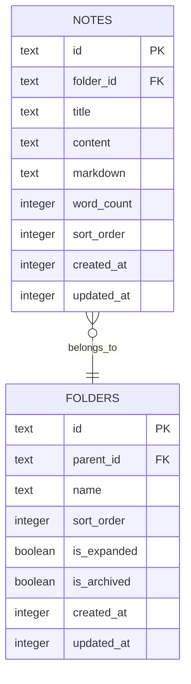
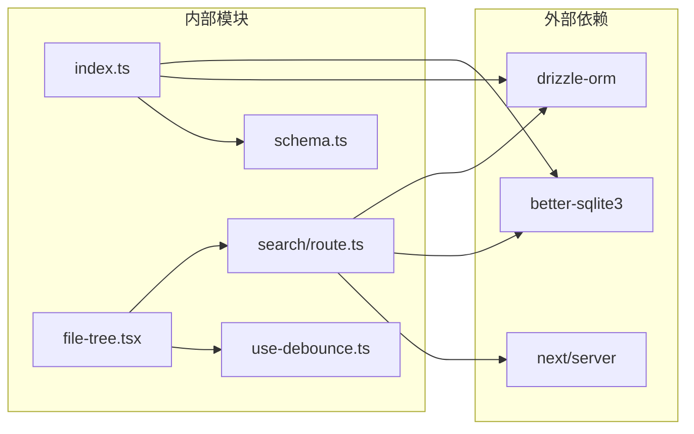

# 笔记搜索功能

<cite>
**本文档引用的文件**
- [src/app/api/notes/search/route.ts](file://src/app/api/notes/search/route.ts)
- [src/db/schema.ts](file://src/db/schema.ts)
- [src/db/index.ts](file://src/db/index.ts)
- [src/components/file-tree/file-tree.tsx](file://src/components/file-tree/file-tree.tsx)
- [src/hooks/use-debounce.ts](file://src/hooks/use-debounce.ts)
- [src/types/index.ts](file://src/types/index.ts)
- [package.json](file://package.json)
</cite>

## 目录
1. [简介](#简介)
2. [项目结构](#项目结构)
3. [核心组件](#核心组件)
4. [架构概览](#架构概览)
5. [详细组件分析](#详细组件分析)
6. [依赖关系分析](#依赖关系分析)
7. [性能考虑](#性能考虑)
8. [故障排除指南](#故障排除指南)
9. [结论](#结论)
10. [附录](#附录)

## 简介

ynote-v2 是一个基于 Next.js 构建的笔记应用，提供了完整的笔记搜索功能。该功能实现了全文搜索机制，支持在笔记标题、内容和 Markdown 文本中进行关键词匹配，并通过 SQLite 数据库存储和检索数据。

当前的搜索实现采用简单的字符串匹配策略，虽然功能相对基础，但为后续的功能扩展和性能优化奠定了良好的基础。

## 项目结构

笔记搜索功能主要分布在以下模块中：



**图表来源**
- [src/components/file-tree/file-tree.tsx:87-122](file://src/components/file-tree/file-tree.tsx#L87-L122)
- [src/app/api/notes/search/route.ts:1-43](file://src/app/api/notes/search/route.ts#L1-L43)
- [src/db/index.ts:160-171](file://src/db/index.ts#L160-L171)

**章节来源**
- [src/components/file-tree/file-tree.tsx:1-325](file://src/components/file-tree/file-tree.tsx#L1-L325)
- [src/app/api/notes/search/route.ts:1-43](file://src/app/api/notes/search/route.ts#L1-L43)
- [src/db/index.ts:1-171](file://src/db/index.ts#L1-L171)

## 核心组件

### 搜索 API 路由

搜索功能的核心是位于 `/api/notes/search` 的路由处理器，它实现了以下功能：

- 接收查询参数 `q` 作为搜索关键词
- 对关键词进行验证和清理
- 在数据库中执行多字段搜索
- 返回标准化的搜索结果

### 数据库模式

笔记表结构包含以下关键字段：
- `title`: 笔记标题（用于标题匹配）
- `content`: 笔记内容（用于全文搜索）
- `markdown`: Markdown 格式内容（用于格式化文本搜索）

### 前端搜索组件

文件树组件集成了实时搜索功能，包括：
- 搜索输入框和清除功能
- 防抖搜索机制（300ms 延迟）
- 实时搜索结果显示
- 搜索状态管理

**章节来源**
- [src/app/api/notes/search/route.ts:6-43](file://src/app/api/notes/search/route.ts#L6-L43)
- [src/db/schema.ts:27-39](file://src/db/schema.ts#L27-L39)
- [src/components/file-tree/file-tree.tsx:87-122](file://src/components/file-tree/file-tree.tsx#L87-L122)

## 架构概览

笔记搜索功能采用分层架构设计，确保了清晰的关注点分离：



**图表来源**
- [src/components/file-tree/file-tree.tsx:87-122](file://src/components/file-tree/file-tree.tsx#L87-L122)
- [src/app/api/notes/search/route.ts:6-43](file://src/app/api/notes/search/route.ts#L6-L43)
- [src/db/index.ts:160-171](file://src/db/index.ts#L160-L171)

## 详细组件分析

### 搜索 API 实现

搜索 API 采用了简洁而有效的实现方式：

#### 关键实现要点

1. **参数处理**: 从 URL 查询参数中提取关键词
2. **输入验证**: 检查关键词是否为空或只包含空白字符
3. **查询构建**: 使用 OR 条件在三个字段上执行模糊匹配
4. **结果筛选**: 只返回必要的字段以减少传输数据量

#### 查询逻辑分析



**图表来源**
- [src/app/api/notes/search/route.ts:6-43](file://src/app/api/notes/search/route.ts#L6-L43)

**章节来源**
- [src/app/api/notes/search/route.ts:6-43](file://src/app/api/notes/search/route.ts#L6-L43)

### 数据库连接和初始化

数据库系统使用 better-sqlite3 和 Drizzle ORM 进行管理：

#### 数据库配置特性

- **WAL 模式**: 提供更好的并发读取性能
- **外键约束**: 确保数据完整性
- **索引优化**: 为常用查询字段建立索引
- **单例模式**: 确保数据库连接的唯一性和效率

#### 初始化流程



**图表来源**
- [src/db/index.ts:10-25](file://src/db/index.ts#L10-L25)
- [src/db/index.ts:27-158](file://src/db/index.ts#L27-L158)

**章节来源**
- [src/db/index.ts:1-171](file://src/db/index.ts#L1-L171)

### 前端搜索集成

文件树组件实现了完整的搜索用户界面：

#### 搜索功能特性

1. **实时搜索**: 用户输入时自动触发搜索
2. **防抖机制**: 300ms 延迟避免频繁请求
3. **搜索状态**: 显示搜索进度和结果数量
4. **结果展示**: 清晰的结果列表和交互

#### 搜索流程



**图表来源**
- [src/components/file-tree/file-tree.tsx:87-122](file://src/components/file-tree/file-tree.tsx#L87-L122)
- [src/hooks/use-debounce.ts:3-18](file://src/hooks/use-debounce.ts#L3-L18)

**章节来源**
- [src/components/file-tree/file-tree.tsx:87-122](file://src/components/file-tree/file-tree.tsx#L87-L122)
- [src/hooks/use-debounce.ts:1-19](file://src/hooks/use-debounce.ts#L1-L19)

### 数据模型分析

搜索功能涉及的主要数据模型：



**图表来源**
- [src/db/schema.ts:27-39](file://src/db/schema.ts#L27-L39)
- [src/db/schema.ts:10-25](file://src/db/schema.ts#L10-L25)

**章节来源**
- [src/db/schema.ts:1-105](file://src/db/schema.ts#L1-L105)
- [src/types/index.ts:12-25](file://src/types/index.ts#L12-L25)

## 依赖关系分析

搜索功能的依赖关系相对简单且清晰：



**图表来源**
- [package.json:65-65](file://package.json#L65-L65)
- [package.json:58-58](file://package.json#L58-L58)
- [package.json:72-72](file://package.json#L72-L72)

**章节来源**
- [package.json:1-119](file://package.json#L1-L119)

## 性能考虑

### 当前性能状况

当前的搜索实现具有以下性能特点：

#### 优势
- **简单高效**: 基于 LIKE 操作符的简单查询
- **内存友好**: 只选择必要字段返回
- **实时响应**: 防抖机制避免频繁请求
- **轻量级**: 不需要额外的搜索引擎

#### 性能瓶颈
- **全表扫描**: LIKE 操作符可能导致全表扫描
- **索引限制**: 缺少针对搜索字段的专用索引
- **字符串匹配**: 基于字符串的模糊匹配效率有限

### 优化建议

#### 短期优化
1. **添加搜索索引**
   ```sql
   CREATE INDEX idx_notes_search ON notes(title, content, markdown);
   ```

2. **查询优化**
   - 限制返回结果数量
   - 添加排序和分页支持

3. **缓存策略**
   - 实现查询结果缓存
   - 缓存热门搜索词

#### 长期规划
1. **全文搜索引擎集成**
   - Elasticsearch 或 Apache Lucene
   - 支持复杂查询语法

2. **向量搜索**
   - 基于语义相似度的搜索
   - 支持自然语言查询

3. **分布式搜索**
   - 支持大规模数据集
   - 水平扩展能力

## 故障排除指南

### 常见问题及解决方案

#### 搜索无结果
1. **检查关键词长度**: 确保关键词至少包含 2 个字符
2. **验证数据库连接**: 确认数据库文件存在且可访问
3. **检查表结构**: 验证 notes 表的字段是否存在

#### 性能问题
1. **数据库优化**: 运行 ANALYZE 命令优化查询计划
2. **索引重建**: 重新创建搜索相关索引
3. **查询限制**: 添加 LIMIT 子句限制结果数量

#### 前端问题
1. **网络请求**: 检查 API 端点是否可达
2. **防抖设置**: 确认防抖延迟设置合理
3. **错误处理**: 查看浏览器控制台错误信息

**章节来源**
- [src/app/api/notes/search/route.ts:39-42](file://src/app/api/notes/search/route.ts#L39-L42)
- [src/components/file-tree/file-tree.tsx:103-107](file://src/components/file-tree/file-tree.tsx#L103-L107)

## 结论

ynote-v2 的笔记搜索功能提供了一个简洁而实用的解决方案。当前实现基于 SQLite 的 LIKE 操作符，具有以下特点：

### 优势
- **实现简单**: 代码简洁，易于理解和维护
- **部署便利**: 无需额外的搜索引擎服务
- **实时性强**: 防抖机制提供良好的用户体验
- **资源友好**: 内存和 CPU 使用量较低

### 局限性
- **性能限制**: 大数据集上的搜索速度较慢
- **功能单一**: 仅支持基本的字符串匹配
- **扩展困难**: 难以添加高级搜索功能

### 发展方向
建议在未来版本中：
1. 实现更高效的搜索算法
2. 添加高级搜索功能（布尔查询、范围查询等）
3. 优化性能以支持更大规模的数据集
4. 增强搜索结果的相关性排序

## 附录

### API 接口规范

#### 搜索端点
- **URL**: `/api/notes/search`
- **方法**: `GET`
- **查询参数**:
  - `q` (必需): 搜索关键词

#### 请求示例
```
GET /api/notes/search?q=JavaScript
```

#### 响应格式
```json
{
  "notes": [
    {
      "id": "string",
      "folderId": "string|null",
      "title": "string",
      "wordCount": number,
      "sortOrder": number,
      "createdAt": number,
      "updatedAt": number
    }
  ]
}
```

### 开发环境配置

#### 依赖安装
```bash
npm install drizzle-orm better-sqlite3
```

#### 数据库初始化
```bash
npx drizzle-kit generate
npx drizzle-kit migrate
```

### 扩展开发指南

#### 自定义搜索字段
1. 修改数据库模式以添加新字段
2. 更新搜索 API 以包含新字段
3. 更新前端组件以显示新字段

#### 性能优化
1. 添加适当的数据库索引
2. 实现查询结果缓存
3. 优化防抖参数

#### 功能增强
1. 添加搜索历史记录
2. 实现搜索建议功能
3. 支持高级查询语法