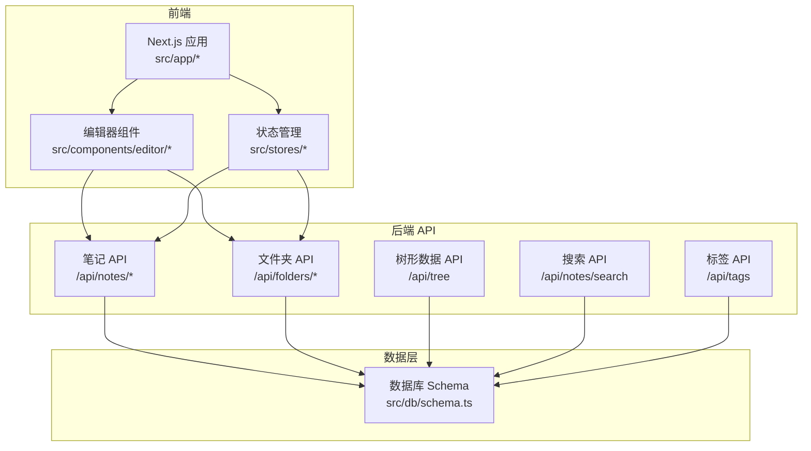
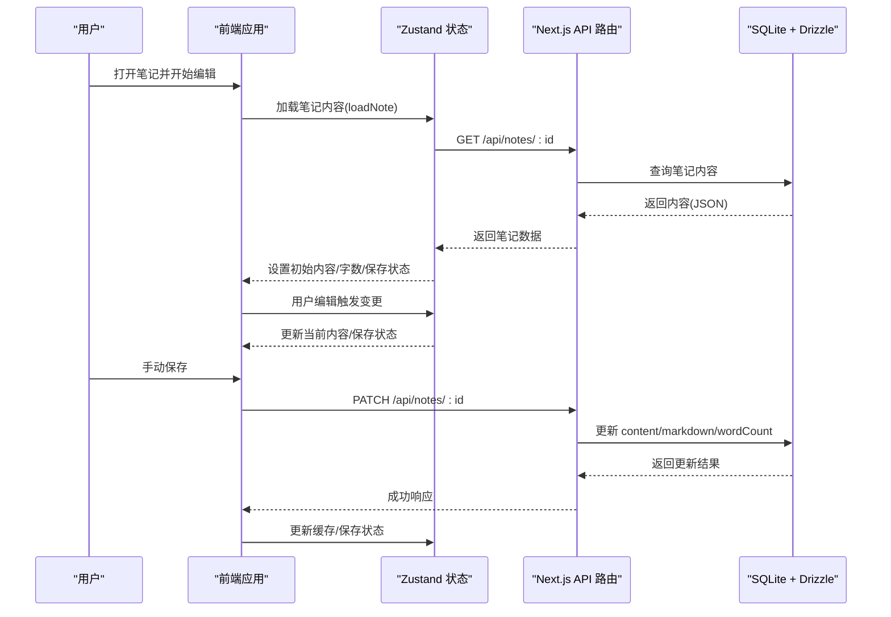
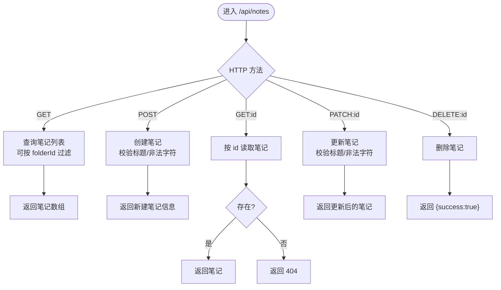
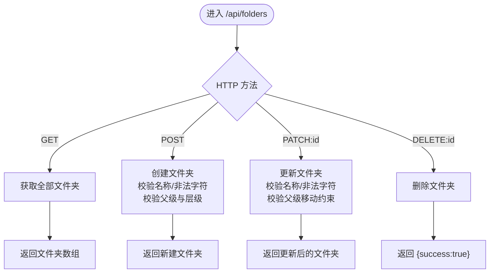
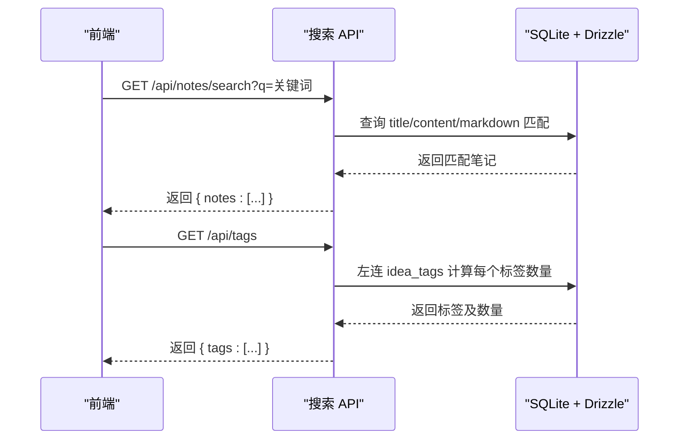
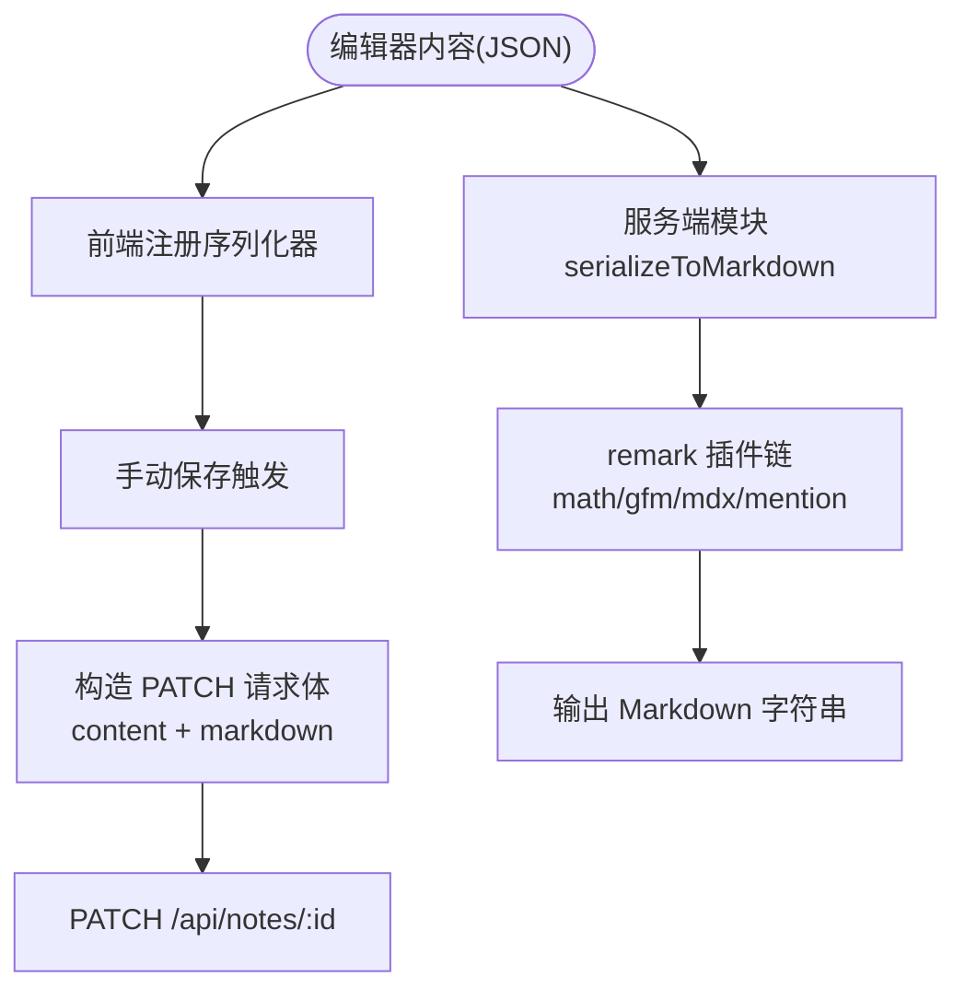
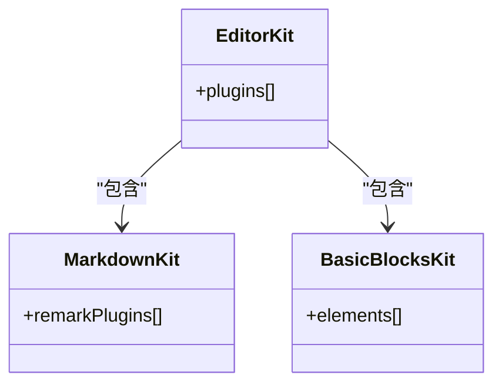
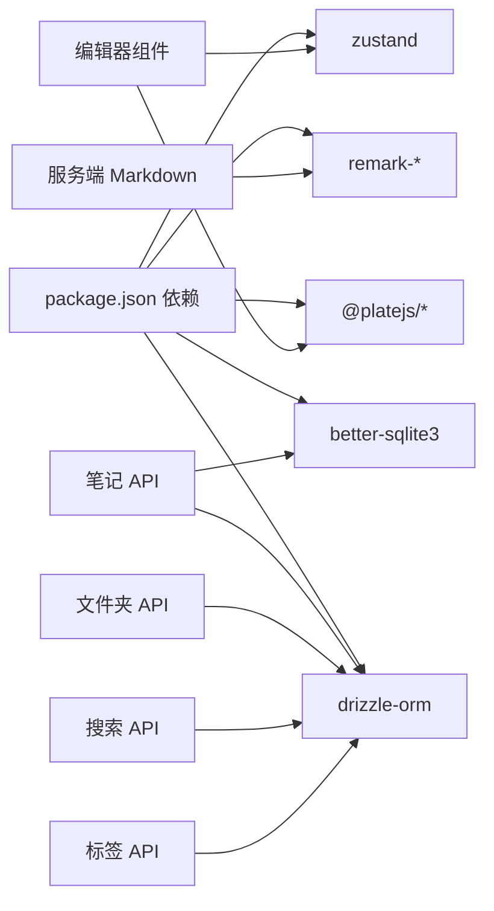

# 笔记管理系统

<cite>
**本文引用的文件**
- [README.md](file://README.md)
- [package.json](file://package.json)
- [src/db/schema.ts](file://src/db/schema.ts)
- [src/app/api/notes/route.ts](file://src/app/api/notes/route.ts)
- [src/app/api/notes/[id]/route.ts](file://src/app/api/notes/[id]/route.ts)
- [src/app/api/notes/search/route.ts](file://src/app/api/notes/search/route.ts)
- [src/app/api/folders/route.ts](file://src/app/api/folders/route.ts)
- [src/app/api/folders/[id]/route.ts](file://src/app/api/folders/[id]/route.ts)
- [src/app/api/tree/route.ts](file://src/app/api/tree/route.ts)
- [src/app/api/tags/route.ts](file://src/app/api/tags/route.ts)
- [src/components/editor/plate-editor.tsx](file://src/components/editor/plate-editor.tsx)
- [src/components/editor/editor-kit.tsx](file://src/components/editor/editor-kit.tsx)
- [src/components/editor/plugins/markdown-kit.tsx](file://src/components/editor/plugins/markdown-kit.tsx)
- [src/components/editor/plugins/basic-blocks-kit.tsx](file://src/components/editor/plugins/basic-blocks-kit.tsx)
- [src/lib/server-markdown.ts](file://src/lib/server-markdown.ts)
- [src/stores/editor-store.ts](file://src/stores/editor-store.ts)
</cite>

## 目录
1. [简介](#简介)
2. [项目结构](#项目结构)
3. [核心组件](#核心组件)
4. [架构总览](#架构总览)
5. [详细组件分析](#详细组件分析)
6. [依赖关系分析](#依赖关系分析)
7. [性能考虑](#性能考虑)
8. [故障排查指南](#故障排查指南)
9. [结论](#结论)
10. [附录：API 接口规范](#附录api-接口规范)

## 简介
本项目是一个基于 Next.js 的笔记管理系统，采用 SQLite 数据库存储，使用 Drizzle ORM 进行数据库操作；前端编辑器基于 Plate.js（即“platejs”），通过丰富的插件体系实现富文本编辑与内容序列化；后端提供 REST 风格 API，覆盖笔记的 CRUD、文件夹层级管理、全文搜索与标签统计等能力。

## 项目结构
- 前端应用位于 src/app，采用 App Router 结构，页面与 API 路由并存于同一目录层次。
- 编辑器相关代码集中在 src/components/editor，包含编辑器核心、插件集合与工具模块。
- 数据层位于 src/db，包含数据库 Schema 定义与连接初始化。
- 全局状态管理使用 Zustand，集中于 src/stores。
- 服务端 Markdown 序列化在 src/lib 下提供独立模块，便于服务端渲染或导出场景使用。

图表来源
- [src/app/api/notes/route.ts:1-86](file://src/app/api/notes/route.ts#L1-L86)
- [src/app/api/folders/route.ts:1-75](file://src/app/api/folders/route.ts#L1-L75)
- [src/app/api/tree/route.ts:1-36](file://src/app/api/tree/route.ts#L1-L36)
- [src/app/api/notes/search/route.ts:1-44](file://src/app/api/notes/search/route.ts#L1-L44)
- [src/app/api/tags/route.ts:1-28](file://src/app/api/tags/route.ts#L1-L28)
- [src/db/schema.ts:1-105](file://src/db/schema.ts#L1-L105)

章节来源
- [README.md:1-37](file://README.md#L1-L37)
- [package.json:1-119](file://package.json#L1-L119)

## 核心组件
- 数据模型与关系
  - 用户、文件夹、笔记、附件、想法、标签、日记等表，其中文件夹与笔记存在外键关联，支持笔记归档至文件夹或置于根目录。
- 编辑器与插件系统
  - 使用 Plate.js 作为核心编辑器，通过 EditorKit 组合多种插件（块级元素、内联样式、列表、表格、媒体、数学公式、Markdown 导入导出、工具栏等）。
- 状态与缓存
  - 使用 Zustand 管理当前编辑笔记、初始内容、保存状态、字数统计与 LRU 内容缓存，提升切换与保存体验。
- 服务端 Markdown 序列化
  - 提供独立的服务器端 Markdown 序列化模块，用于将 Plate JSON 内容转换为 Markdown 字符串，支持数学、GFM、Mention 等 remark 插件。

章节来源
- [src/db/schema.ts:1-105](file://src/db/schema.ts#L1-L105)
- [src/components/editor/editor-kit.tsx:1-83](file://src/components/editor/editor-kit.tsx#L1-L83)
- [src/stores/editor-store.ts:1-281](file://src/stores/editor-store.ts#L1-L281)
- [src/lib/server-markdown.ts:1-138](file://src/lib/server-markdown.ts#L1-L138)

## 架构总览
系统采用前后端分离的 API 设计：前端负责 UI 与交互，后端提供 REST 接口；编辑器内容以 Plate JSON 存储，同时生成 Markdown 以便导出与展示；状态管理与缓存减少网络往返与重复计算。

图表来源
- [src/stores/editor-store.ts:114-155](file://src/stores/editor-store.ts#L114-L155)
- [src/app/api/notes/[id]/route.ts:29-L82](file://src/app/api/notes/[id]/route.ts#L29-L82)

## 详细组件分析

### 笔记 CRUD 实现
- 列表查询
  - 支持按 folderId 查询，root 表示无文件夹的笔记；返回字段包含 id、folderId、title、wordCount、sortOrder、createdAt、updatedAt。
- 创建笔记
  - 可选 folderId（null 表示根目录），标题长度限制与非法字符校验，排序序号可选，默认 0；返回新建笔记的必要信息。
- 读取笔记
  - 按 id 获取单篇笔记，不存在时返回 404。
- 更新笔记
  - 支持更新标题、内容、Markdown、字数、排序、文件夹；标题必填且校验规则同创建。
- 删除笔记
  - 按 id 删除，不存在返回 404。

图表来源
- [src/app/api/notes/route.ts:10-40](file://src/app/api/notes/route.ts#L10-L40)
- [src/app/api/notes/route.ts:42-86](file://src/app/api/notes/route.ts#L42-L86)
- [src/app/api/notes/[id]/route.ts:9-L27](file://src/app/api/notes/[id]/route.ts#L9-L27)
- [src/app/api/notes/[id]/route.ts:29-L82](file://src/app/api/notes/[id]/route.ts#L29-L82)
- [src/app/api/notes/[id]/route.ts:84-L104](file://src/app/api/notes/[id]/route.ts#L84-L104)

章节来源
- [src/app/api/notes/route.ts:1-86](file://src/app/api/notes/route.ts#L1-L86)
- [src/app/api/notes/[id]/route.ts:1-L104](file://src/app/api/notes/[id]/route.ts#L1-L104)

### 文件夹组织与层级管理
- 列表查询
  - 返回所有文件夹，按排序与创建时间升序排列。
- 创建文件夹
  - 名称必填且校验长度与非法字符；支持设置 parentId，强制最多两级深度（仅根级文件夹可有子文件夹）。
- 更新文件夹
  - 支持重命名、排序、展开/归档状态；支持移动到新父级，禁止自环与将含子文件夹的文件夹移动到其他文件夹下。
- 删除文件夹
  - 通过 Drizzle cascade 删除，子项随父级一并移除。

图表来源
- [src/app/api/folders/route.ts:19-32](file://src/app/api/folders/route.ts#L19-L32)
- [src/app/api/folders/route.ts:34-75](file://src/app/api/folders/route.ts#L34-L75)
- [src/app/api/folders/[id]/route.ts:9-L79](file://src/app/api/folders/[id]/route.ts#L9-L79)
- [src/app/api/folders/[id]/route.ts:81-L101](file://src/app/api/folders/[id]/route.ts#L81-L101)

章节来源
- [src/app/api/folders/route.ts:1-75](file://src/app/api/folders/route.ts#L1-L75)
- [src/app/api/folders/[id]/route.ts:1-L101](file://src/app/api/folders/[id]/route.ts#L1-L101)

### 搜索功能实现
- 全文搜索
  - 支持关键词 q，模糊匹配标题、内容与 Markdown 字段，返回匹配的笔记列表。
- 标签过滤
  - 提供标签列表接口，聚合每个标签关联的想法数量，便于前端筛选。

图表来源
- [src/app/api/notes/search/route.ts:6-44](file://src/app/api/notes/search/route.ts#L6-L44)
- [src/app/api/tags/route.ts:6-28](file://src/app/api/tags/route.ts#L6-L28)

章节来源
- [src/app/api/notes/search/route.ts:1-44](file://src/app/api/notes/search/route.ts#L1-L44)
- [src/app/api/tags/route.ts:1-28](file://src/app/api/tags/route.ts#L1-L28)

### 内容序列化与 Markdown 转换
- 前端序列化
  - 编辑器初始化时注册 Markdown 序列化器，保存时可直接调用该回调生成 Markdown。
- 服务端序列化
  - 独立模块创建服务器端编辑器，加载基础节点与 Markdown 插件，使用 remark 生态（数学、GFM、MDX、Mention）进行序列化，支持为笔记添加标题前缀。

图表来源
- [src/components/editor/plate-editor.tsx:146-153](file://src/components/editor/plate-editor.tsx#L146-L153)
- [src/stores/editor-store.ts:204-275](file://src/stores/editor-store.ts#L204-L275)
- [src/lib/server-markdown.ts:85-108](file://src/lib/server-markdown.ts#L85-L108)
- [src/lib/server-markdown.ts:116-137](file://src/lib/server-markdown.ts#L116-L137)

章节来源
- [src/components/editor/plate-editor.tsx:1-175](file://src/components/editor/plate-editor.tsx#L1-L175)
- [src/stores/editor-store.ts:1-281](file://src/stores/editor-store.ts#L1-L281)
- [src/lib/server-markdown.ts:1-138](file://src/lib/server-markdown.ts#L1-L138)

### 编辑器插件系统与自定义
- 插件组合
  - EditorKit 将基础块、代码块、表格、折叠、目录、媒体、提示、列布局、数学、日期、链接、提及、列表、对齐、行高、自动格式化、光标覆盖、块菜单、拖拽、表情、退出断行、占位符、固定/浮动工具栏等插件整合。
- Markdown 插件
  - MarkdownKit 配置 remark 插件链，支持数学公式、GFM、MDX、Mention 等。
- 基础块插件
  - BasicBlocksKit 定义标题、引用、水平线等块级元素及其快捷键与组件映射。

图表来源
- [src/components/editor/editor-kit.tsx:36-78](file://src/components/editor/editor-kit.tsx#L36-L78)
- [src/components/editor/plugins/markdown-kit.tsx:5-11](file://src/components/editor/plugins/markdown-kit.tsx#L5-L11)
- [src/components/editor/plugins/basic-blocks-kit.tsx:27-88](file://src/components/editor/plugins/basic-blocks-kit.tsx#L27-L88)

章节来源
- [src/components/editor/editor-kit.tsx:1-83](file://src/components/editor/editor-kit.tsx#L1-L83)
- [src/components/editor/plugins/markdown-kit.tsx:1-12](file://src/components/editor/plugins/markdown-kit.tsx#L1-L12)
- [src/components/editor/plugins/basic-blocks-kit.tsx:1-89](file://src/components/editor/plugins/basic-blocks-kit.tsx#L1-L89)

### 性能优化与缓存机制
- 内容缓存（LRU）
  - 使用 Map 存储最近访问的笔记内容与字数，达到上限后逐出最久未使用条目，显著降低重复加载成本。
- 快速比较
  - 编辑器内部使用结构化比较函数避免频繁 JSON 序列化，仅在内容变化时标记未保存。
- 保存流程
  - 保存时递归提取文本计算字数，优先使用已注册的 Markdown 序列化器，失败时回退为空字符串，保证稳定性。

章节来源
- [src/stores/editor-store.ts:66-77](file://src/stores/editor-store.ts#L66-L77)
- [src/stores/editor-store.ts:114-155](file://src/stores/editor-store.ts#L114-L155)
- [src/stores/editor-store.ts:204-275](file://src/stores/editor-store.ts#L204-L275)
- [src/components/editor/plate-editor.tsx:16-61](file://src/components/editor/plate-editor.tsx#L16-L61)

## 依赖关系分析
- 外部依赖
  - 编辑器与插件：@platejs/* 系列、remark-* 生态、lucide-react、radix-ui 等。
  - 数据库：better-sqlite3、drizzle-orm。
  - 状态管理：zustand。
- 内部依赖
  - 编辑器组件依赖插件集合与状态存储；API 路由依赖数据库 Schema；服务端 Markdown 模块独立于前端运行。

图表来源
- [package.json:13-99](file://package.json#L13-L99)
- [src/components/editor/plate-editor.tsx:1-11](file://src/components/editor/plate-editor.tsx#L1-L11)
- [src/app/api/notes/route.ts:1-6](file://src/app/api/notes/route.ts#L1-L6)
- [src/lib/server-markdown.ts:6-10](file://src/lib/server-markdown.ts#L6-L10)

章节来源
- [package.json:1-119](file://package.json#L1-L119)

## 性能考虑
- 减少网络往返：通过 LRU 缓存复用已加载内容，避免重复请求。
- 低开销比较：编辑器变更检测使用结构化比较，避免昂贵的 JSON 比较。
- 懒加载与延迟初始化：编辑器容器在首次有内容时再初始化，减少首屏压力。
- 合理的排序与索引：数据库查询按排序与创建时间排序，确保列表稳定与可预测。

## 故障排查指南
- 笔记/文件夹不存在
  - 当按 id 查询返回 404 时，检查资源是否已被删除或 ID 是否正确。
- 标题/名称非法
  - 标题或名称包含非法字符或超长会返回 400，需按后端校验规则修正。
- 文件夹层级错误
  - 移动文件夹时若违反两级深度或自环约束，会返回 400；请确认父级有效性与层级限制。
- 保存失败
  - 保存时若序列化失败，会记录错误但不中断流程；可在前端查看保存状态并重试。

章节来源
- [src/app/api/notes/[id]/route.ts:18-L26](file://src/app/api/notes/[id]/route.ts#L18-L26)
- [src/app/api/folders/[id]/route.ts:18-L21](file://src/app/api/folders/[id]/route.ts#L18-L21)
- [src/app/api/folders/[id]/route.ts:45-L69](file://src/app/api/folders/[id]/route.ts#L45-L69)
- [src/lib/server-markdown.ts:104-108](file://src/lib/server-markdown.ts#L104-L108)

## 结论
本系统以 Plate.js 为核心构建富文本编辑体验，结合 Drizzle ORM 与 SQLite 实现高效的数据持久化；通过插件化架构与服务端 Markdown 序列化，满足笔记的创建、编辑、检索与导出需求；配合 LRU 缓存与结构化比较等优化手段，在保证功能完整性的同时兼顾性能与可维护性。

## 附录：API 接口规范

### 笔记 API
- 获取笔记列表
  - 方法：GET
  - 路径：/api/notes
  - 查询参数：folderId（可选，root 表示根目录）
  - 响应：笔记数组（包含 id、folderId、title、wordCount、sortOrder、createdAt、updatedAt）
  - 错误：500 时返回错误信息
- 创建笔记
  - 方法：POST
  - 路径：/api/notes
  - 请求体字段：folderId（可选）、title（可选，最大长度 100，不允许特定非法字符）、sortOrder（可选）
  - 响应：新建笔记信息（id、folderId、title、wordCount、sortOrder、createdAt、updatedAt）
  - 错误：400（标题非法/超长/含非法字符）、500
- 获取单篇笔记
  - 方法：GET
  - 路径：/api/notes/[id]
  - 响应：笔记对象
  - 错误：404（笔记不存在）、500
- 更新笔记
  - 方法：PATCH
  - 路径：/api/notes/[id]
  - 请求体字段：title（必填且校验）、content、markdown、wordCount、sortOrder、folderId（可为 null）
  - 响应：更新后的笔记对象
  - 错误：404/400/500
- 删除笔记
  - 方法：DELETE
  - 路径：/api/notes/[id]
  - 响应：{ success: true }
  - 错误：404/500

章节来源
- [src/app/api/notes/route.ts:10-40](file://src/app/api/notes/route.ts#L10-L40)
- [src/app/api/notes/route.ts:42-86](file://src/app/api/notes/route.ts#L42-L86)
- [src/app/api/notes/[id]/route.ts:9-L27](file://src/app/api/notes/[id]/route.ts#L9-L27)
- [src/app/api/notes/[id]/route.ts:29-L82](file://src/app/api/notes/[id]/route.ts#L29-L82)
- [src/app/api/notes/[id]/route.ts:84-L104](file://src/app/api/notes/[id]/route.ts#L84-L104)

### 文件夹 API
- 获取文件夹列表
  - 方法：GET
  - 路径：/api/folders
  - 响应：文件夹数组（按排序与创建时间升序）
  - 错误：500
- 创建文件夹
  - 方法：POST
  - 路径：/api/folders
  - 请求体字段：name（必填，长度限制与非法字符校验）、parentId（可选，仅允许根级文件夹有子文件夹）、sortOrder（可选）
  - 响应：新建文件夹对象
  - 错误：400（名称非法/超长/非法字符/父级无效/层级超限）、500
- 更新文件夹
  - 方法：PATCH
  - 路径：/api/folders/[id]
  - 请求体字段：name（必填且校验）、sortOrder、isExpanded、isArchived、parentId（可为 null 或有效父级）
  - 响应：更新后的文件夹对象
  - 错误：404/400/500
- 删除文件夹
  - 方法：DELETE
  - 路径：/api/folders/[id]
  - 响应：{ success: true }
  - 错误：404/500

章节来源
- [src/app/api/folders/route.ts:19-32](file://src/app/api/folders/route.ts#L19-L32)
- [src/app/api/folders/route.ts:34-75](file://src/app/api/folders/route.ts#L34-L75)
- [src/app/api/folders/[id]/route.ts:9-L79](file://src/app/api/folders/[id]/route.ts#L9-L79)
- [src/app/api/folders/[id]/route.ts:81-L101](file://src/app/api/folders/[id]/route.ts#L81-L101)

### 树形数据 API
- 获取树形结构
  - 方法：GET
  - 路径：/api/tree
  - 响应：{ folders: [...], notes: [...] }
  - 错误：500

章节来源
- [src/app/api/tree/route.ts:6-35](file://src/app/api/tree/route.ts#L6-L35)

### 搜索 API
- 全文搜索
  - 方法：GET
  - 路径：/api/notes/search
  - 查询参数：q（关键词）
  - 响应：{ notes: [...] }（匹配标题、内容、Markdown）
  - 错误：500

章节来源
- [src/app/api/notes/search/route.ts:6-44](file://src/app/api/notes/search/route.ts#L6-L44)

### 标签 API
- 获取标签列表
  - 方法：GET
  - 路径：/api/tags
  - 响应：{ tags: [{ id, name, count }] }（按数量降序）
  - 错误：500

章节来源
- [src/app/api/tags/route.ts:6-28](file://src/app/api/tags/route.ts#L6-L28)