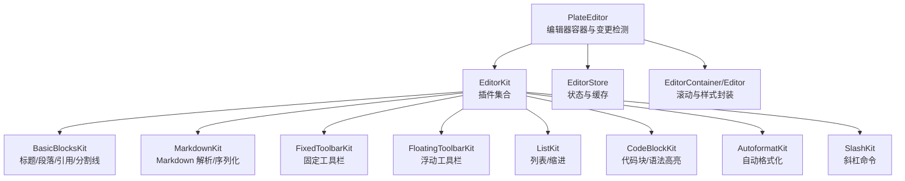
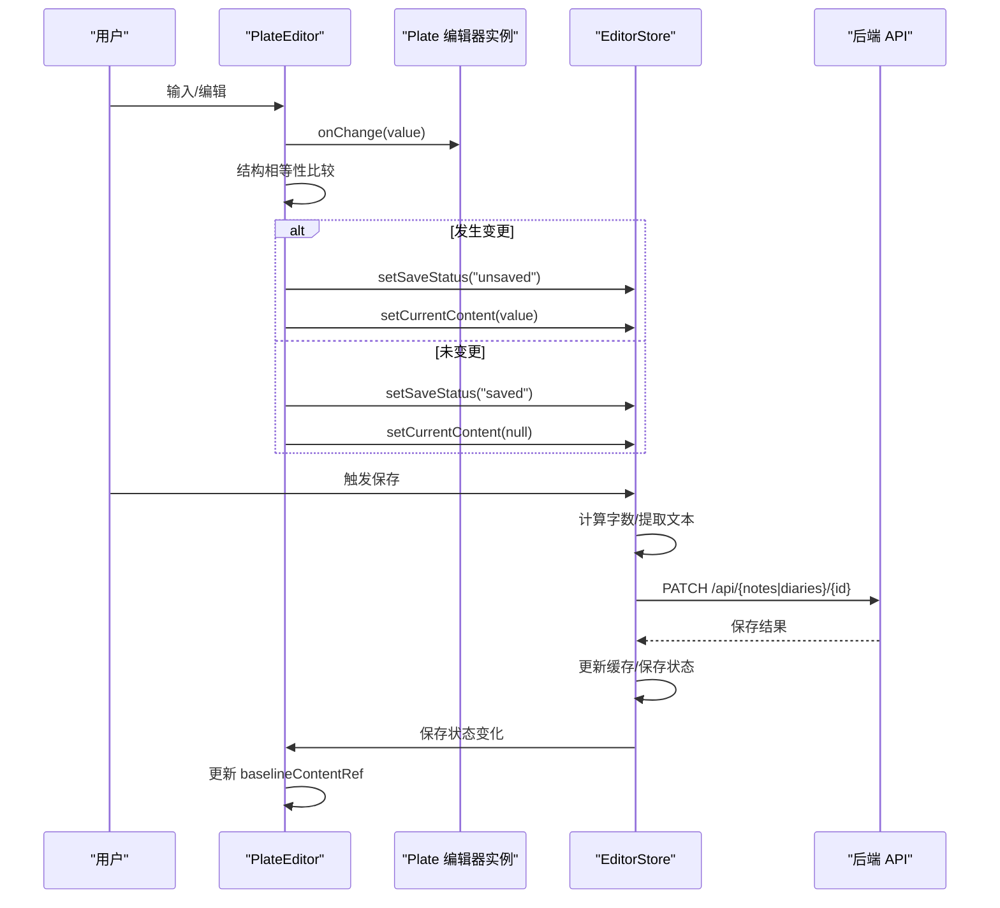
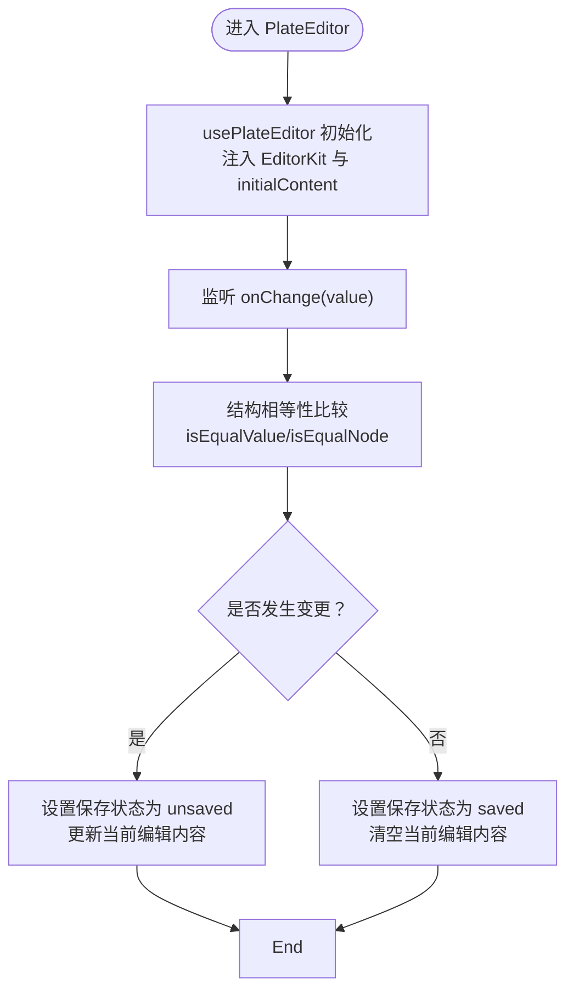
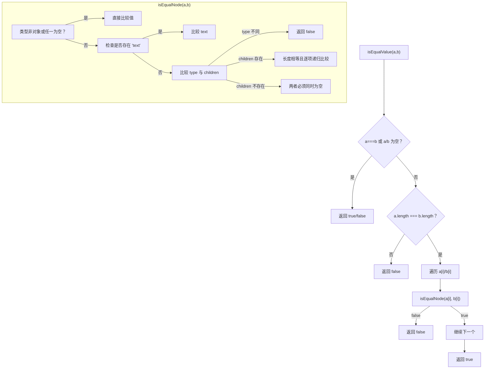
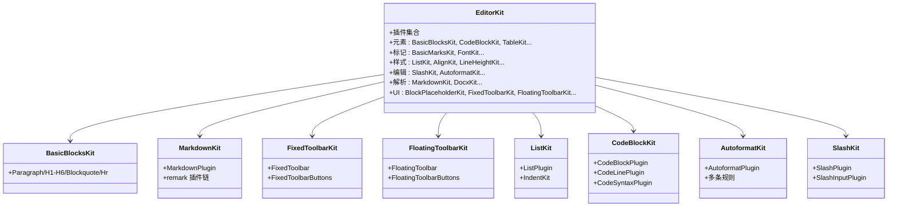
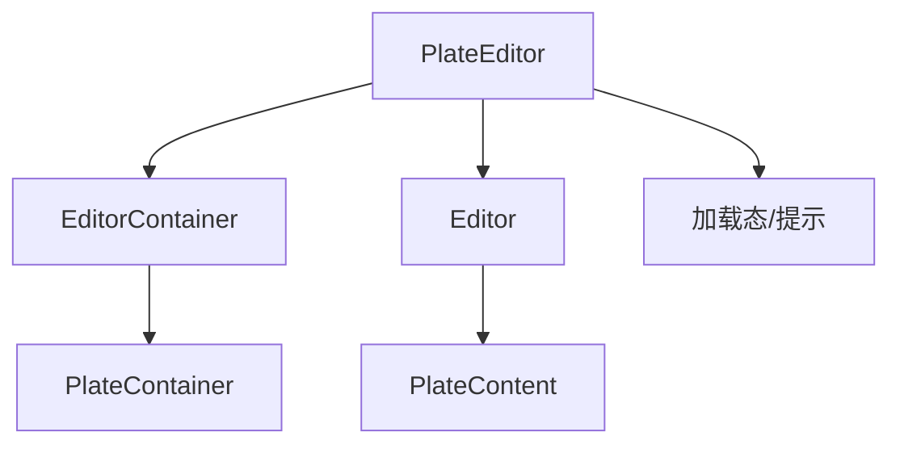
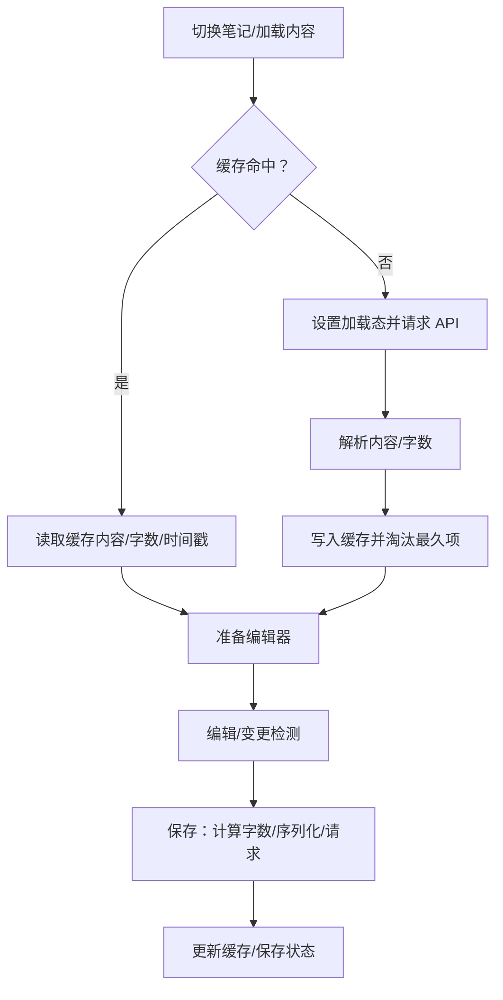
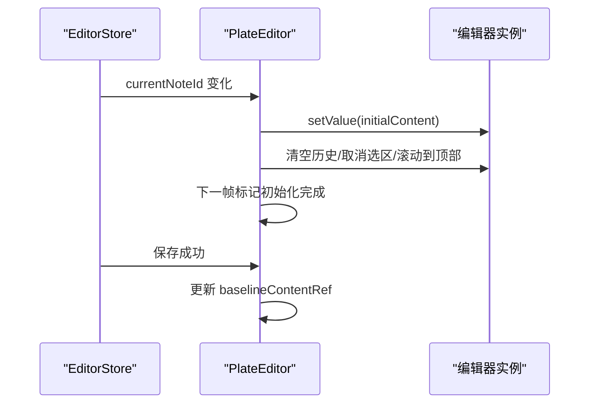
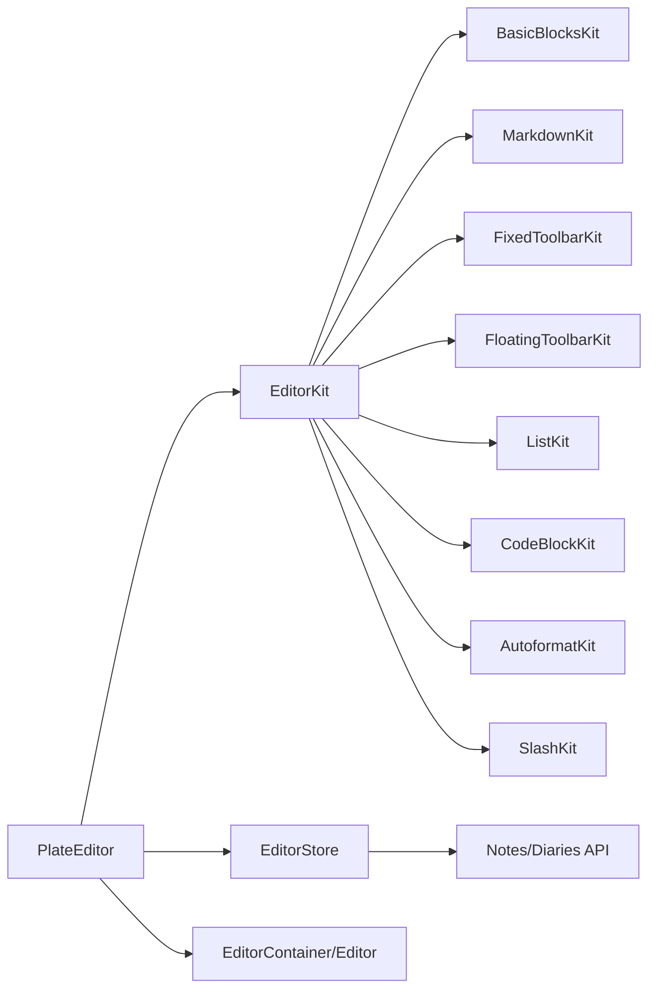

# Plate 编辑器核心

<cite>
**本文引用的文件**
- [plate-editor.tsx](file://src/components/editor/plate-editor.tsx)
- [editor-kit.tsx](file://src/components/editor/editor-kit.tsx)
- [editor-base-kit.tsx](file://src/components/editor/editor-base-kit.tsx)
- [plate-types.ts](file://src/components/editor/plate-types.ts)
- [editor-store.ts](file://src/stores/editor-store.ts)
- [basic-blocks-kit.tsx](file://src/components/editor/plugins/basic-blocks-kit.tsx)
- [markdown-kit.tsx](file://src/components/editor/plugins/markdown-kit.tsx)
- [fixed-toolbar-kit.tsx](file://src/components/editor/plugins/fixed-toolbar-kit.tsx)
- [floating-toolbar-kit.tsx](file://src/components/editor/plugins/floating-toolbar-kit.tsx)
- [list-kit.tsx](file://src/components/editor/plugins/list-kit.tsx)
- [code-block-kit.tsx](file://src/components/editor/plugins/code-block-kit.tsx)
- [autoformat-kit.tsx](file://src/components/editor/plugins/autoformat-kit.tsx)
- [slash-kit.tsx](file://src/components/editor/plugins/slash-kit.tsx)
- [editor.tsx](file://src/components/ui/editor.tsx)
- [index.ts](file://src/types/index.ts)
</cite>

## 目录
1. [简介](#简介)
2. [项目结构](#项目结构)
3. [核心组件](#核心组件)
4. [架构总览](#架构总览)
5. [详细组件分析](#详细组件分析)
6. [依赖分析](#依赖分析)
7. [性能考虑](#性能考虑)
8. [故障排查指南](#故障排查指南)
9. [结论](#结论)
10. [附录](#附录)

## 简介
本文件面向 Plate 编辑器核心组件的使用者与维护者，系统化阐述 PlateEditor 的实现原理与运行机制，覆盖以下主题：
- 编辑器初始化流程与插件系统集成
- 值比较算法与结构相等性判断
- 状态管理与缓存策略
- 内容变更检测机制（含快速比较）
- 生命周期管理（笔记切换、历史记录清理、滚动控制）
- 编辑器容器实现（滚动行为、加载态显示）
- 性能优化策略（渲染与内存）
- 配置示例与常见问题解决

## 项目结构
围绕编辑器的核心文件组织如下：
- 编辑器容器与渲染：PlateEditor 负责初始化、变更检测、生命周期与 UI 展示
- 插件系统：EditorKit 汇聚各功能插件，形成完整的编辑能力集合
- 类型定义：plate-types 定义了编辑器节点与文本类型，确保类型安全
- 状态与缓存：editor-store 提供全局状态、缓存与保存逻辑
- UI 容器：editor.tsx 封装 Plate 容器与内容区域，统一滚动与样式
- 典型插件：basic-blocks、markdown、fixed/floating-toolbar、list、code-block、autoformat、slash 等

**图表来源**
- [plate-editor.tsx:63-175](file://src/components/editor/plate-editor.tsx#L63-L175)
- [editor-kit.tsx:36-78](file://src/components/editor/editor-kit.tsx#L36-L78)
- [editor.tsx:36-113](file://src/components/ui/editor.tsx#L36-L113)
- [editor-store.ts:88-281](file://src/stores/editor-store.ts#L88-L281)

**章节来源**
- [plate-editor.tsx:63-175](file://src/components/editor/plate-editor.tsx#L63-L175)
- [editor-kit.tsx:36-78](file://src/components/editor/editor-kit.tsx#L36-L78)
- [editor.tsx:36-113](file://src/components/ui/editor.tsx#L36-L113)
- [editor-store.ts:88-281](file://src/stores/editor-store.ts#L88-L281)

## 核心组件
- PlateEditor：负责编辑器初始化、值比较、变更检测、笔记切换生命周期、历史记录清理、滚动控制与加载态展示
- EditorKit：聚合所有功能插件（元素、标记、块级样式、编辑体验、解析器、UI 工具栏），形成可复用的编辑器套件
- EditorStore：集中管理当前笔记、初始内容、当前编辑内容、保存状态、字数统计、加载状态与 LRU 内容缓存，并提供手动保存与缓存失效
- EditorContainer/Editor：封装 Plate 容器与内容区域，统一滚动行为、占位符样式与变体
- 类型系统：plate-types 定义节点类型与富文本类型，保证编辑器数据结构一致

关键职责与交互要点：
- 初始化：通过 usePlateEditor 创建编辑器实例并注入 EditorKit；将 initialContent 设置为编辑器初始值
- 变更检测：onChange 回调中使用结构相等性比较函数，避免深度序列化带来的性能损耗
- 笔记切换：当 currentNoteId 改变时，重置编辑器值、清空历史、取消选区、滚动到顶部，并在下一帧标记初始化完成
- 保存后同步：保存成功后更新 baselineContentRef，确保后续变更检测准确
- 序列化：注册 markdown 序列化器，支持导出 markdown 文本
- UI：无笔记时显示提示，加载内容时显示旋转加载图标

**章节来源**
- [plate-editor.tsx:63-175](file://src/components/editor/plate-editor.tsx#L63-L175)
- [editor-kit.tsx:36-78](file://src/components/editor/editor-kit.tsx#L36-L78)
- [plate-types.ts:25-164](file://src/components/editor/plate-types.ts#L25-L164)
- [editor-store.ts:88-281](file://src/stores/editor-store.ts#L88-L281)
- [editor.tsx:36-113](file://src/components/ui/editor.tsx#L36-L113)

## 架构总览
下图展示了从用户输入到状态持久化的端到端流程。

**图表来源**
- [plate-editor.tsx:84-153](file://src/components/editor/plate-editor.tsx#L84-L153)
- [editor-store.ts:204-275](file://src/stores/editor-store.ts#L204-L275)

## 详细组件分析

### PlateEditor 组件
- 初始化与插件注入：通过 usePlateEditor 创建编辑器实例，传入 EditorKit 作为插件集合，初始值为 initialContent
- 变更检测：onChange 中使用结构相等性比较函数，先进行快速路径（引用相等、长度相等、文本节点直接比较），再递归比较子节点，避免 JSON.stringify 带来的性能开销
- 生命周期与笔记切换：当 currentNoteId 变化时，重置编辑器值、清空历史、取消选区、滚动到顶部，并在下一帧标记初始化完成，防止跨笔记状态污染
- 保存后同步：保存成功后将 baselineContentRef 更新为当前编辑器 children，确保后续比较准确
- 序列化器注册：在编辑器实例可用后注册 markdown 序列化器，组件卸载时清理
- 加载态与提示：无笔记 ID 显示提示文案；加载内容时显示旋转加载图标

**图表来源**
- [plate-editor.tsx:79-99](file://src/components/editor/plate-editor.tsx#L79-L99)
- [plate-editor.tsx:16-61](file://src/components/editor/plate-editor.tsx#L16-L61)

**章节来源**
- [plate-editor.tsx:63-175](file://src/components/editor/plate-editor.tsx#L63-L175)

### 值比较算法与结构相等性
- 快速路径：若两个值引用相同或其中一方为空，直接返回结果；若长度不同，直接判定不相等
- 递归比较：逐项比较节点数组；对于对象节点，先比较类型，再比较 children 数组长度与每个子节点
- 文本节点特判：若节点包含 text 字段，则直接比较 text 值
- 时间复杂度：O(N)，N 为节点总数；空间复杂度：O(D)，D 为最大嵌套深度（递归栈）

**图表来源**
- [plate-editor.tsx:16-61](file://src/components/editor/plate-editor.tsx#L16-L61)

**章节来源**
- [plate-editor.tsx:16-61](file://src/components/editor/plate-editor.tsx#L16-L61)

### 编辑器配置与插件系统
- EditorKit：按“元素/标记/块级样式/编辑体验/解析器/UI 工具栏”分层聚合插件，形成完整能力矩阵
- 基础能力：BasicBlocksKit 提供标题、段落、引用、分割线等基础块级节点
- 样式与标记：BasicMarksKit、FontKit、LineHeightKit 等提供加粗、斜体、字体、行高等
- 列表与缩进：ListKit 与 IndentKit 协作，支持有序/无序列表与缩进
- 代码块：CodeBlockKit 提供代码块节点、行节点与语法高亮
- 自动格式化：AutoformatKit 定义多种快捷规则（标题、引用、代码块、列表、标点与数学符号等）
- 斜杠命令：SlashKit 提供上下文命令触发
- Markdown 解析：MarkdownKit 注入 remark 插件链，支持数学公式、表格、提及等扩展
- 固定/浮动工具栏：FixedToolbarKit 与 FloatingToolbarKit 分别在编辑器前后与周围渲染工具栏

**图表来源**
- [editor-kit.tsx:36-78](file://src/components/editor/editor-kit.tsx#L36-L78)
- [basic-blocks-kit.tsx:27-88](file://src/components/editor/plugins/basic-blocks-kit.tsx#L27-L88)
- [markdown-kit.tsx:5-11](file://src/components/editor/plugins/markdown-kit.tsx#L5-L11)
- [fixed-toolbar-kit.tsx:8-19](file://src/components/editor/plugins/fixed-toolbar-kit.tsx#L8-L19)
- [floating-toolbar-kit.tsx:8-19](file://src/components/editor/plugins/floating-toolbar-kit.tsx#L8-L19)
- [list-kit.tsx:9-26](file://src/components/editor/plugins/list-kit.tsx#L9-L26)
- [code-block-kit.tsx:18-26](file://src/components/editor/plugins/code-block-kit.tsx#L18-L26)
- [autoformat-kit.tsx:211-236](file://src/components/editor/plugins/autoformat-kit.tsx#L211-L236)
- [slash-kit.tsx:8-18](file://src/components/editor/plugins/slash-kit.tsx#L8-L18)

**章节来源**
- [editor-kit.tsx:36-78](file://src/components/editor/editor-kit.tsx#L36-L78)
- [basic-blocks-kit.tsx:27-88](file://src/components/editor/plugins/basic-blocks-kit.tsx#L27-L88)
- [markdown-kit.tsx:5-11](file://src/components/editor/plugins/markdown-kit.tsx#L5-L11)
- [fixed-toolbar-kit.tsx:8-19](file://src/components/editor/plugins/fixed-toolbar-kit.tsx#L8-L19)
- [floating-toolbar-kit.tsx:8-19](file://src/components/editor/plugins/floating-toolbar-kit.tsx#L8-L19)
- [list-kit.tsx:9-26](file://src/components/editor/plugins/list-kit.tsx#L9-L26)
- [code-block-kit.tsx:18-26](file://src/components/editor/plugins/code-block-kit.tsx#L18-L26)
- [autoformat-kit.tsx:211-236](file://src/components/editor/plugins/autoformat-kit.tsx#L211-L236)
- [slash-kit.tsx:8-18](file://src/components/editor/plugins/slash-kit.tsx#L8-L18)

### 编辑器容器与滚动行为
- EditorContainer：基于 PlateContainer，提供多种变体（默认、演示、评论、选择等），统一滚动行为与焦点样式
- Editor：基于 PlateContent，禁用默认样式，通过变体控制尺寸、内边距与占位符样式
- 加载态：在 isLoadingContent 为真时显示旋转加载图标，避免误触编辑
- 无笔记提示：当 currentNoteId 为空时显示提示文案

**图表来源**
- [editor.tsx:36-113](file://src/components/ui/editor.tsx#L36-L113)
- [plate-editor.tsx:155-173](file://src/components/editor/plate-editor.tsx#L155-L173)

**章节来源**
- [editor.tsx:36-113](file://src/components/ui/editor.tsx#L36-L113)
- [plate-editor.tsx:155-173](file://src/components/editor/plate-editor.tsx#L155-L173)

### 状态管理与缓存策略
- 状态字段：currentNoteId、editingType、initialContent、currentContent、markdownSerializer、saveStatus、wordCount、isLoadingContent、contentCache
- 缓存策略：LRU，最大容量 20；命中则刷新时间戳，未命中则从 API 获取并写入缓存，淘汰最久未访问项
- 加载流程：loadNote/loadDiary 先查缓存，缓存缺失时设置 isLoadingContent 并发起请求，成功后写回缓存并更新状态
- 保存流程：计算字数、序列化 markdown（可选或自动）、PATCH 请求，成功后更新缓存与保存状态
- 切换笔记：switchToNote 更新 currentNoteId；笔记切换时会重置编辑器状态并清理历史

**图表来源**
- [editor-store.ts:114-155](file://src/stores/editor-store.ts#L114-L155)
- [editor-store.ts:157-198](file://src/stores/editor-store.ts#L157-L198)
- [editor-store.ts:204-275](file://src/stores/editor-store.ts#L204-L275)

**章节来源**
- [editor-store.ts:88-281](file://src/stores/editor-store.ts#L88-L281)

### 编辑器生命周期管理
- 笔记切换：currentNoteId 变化时，重置编辑器值、清空历史（undos/redos）、取消选区、滚动到顶部，并在下一帧标记初始化完成
- 保存后同步：保存成功后将 baselineContentRef 更新为当前 children，避免后续比较误判
- 序列化器注册：在编辑器可用后注册 markdown 序列化器，组件卸载时清理，防止泄漏

**图表来源**
- [plate-editor.tsx:101-144](file://src/components/editor/plate-editor.tsx#L101-L144)

**章节来源**
- [plate-editor.tsx:101-144](file://src/components/editor/plate-editor.tsx#L101-L144)

### 内容变更检测机制
- 触发时机：onChange(value) 回调
- 检测策略：结构相等性比较，避免 JSON.stringify 导致的性能与稳定性问题
- 状态联动：变更时 setSaveStatus('unsaved') 并 setCurrentContent(value)；未变更时 setSaveStatus('saved') 且清空当前编辑内容

**章节来源**
- [plate-editor.tsx:84-99](file://src/components/editor/plate-editor.tsx#L84-L99)

## 依赖分析
- 组件耦合
  - PlateEditor 依赖 EditorKit、EditorStore、EditorContainer/Editor
  - EditorKit 依赖各功能插件模块
  - EditorStore 依赖 API 接口与缓存策略
- 外部依赖
  - PlateJS：编辑器核心、插件系统、序列化与历史管理
  - remark 生态：Markdown 解析与扩展
  - Zustand：轻量状态管理
- 循环依赖
  - 当前结构未见循环导入；插件以聚合方式引入，避免相互依赖

**图表来源**
- [plate-editor.tsx:63-175](file://src/components/editor/plate-editor.tsx#L63-L175)
- [editor-kit.tsx:36-78](file://src/components/editor/editor-kit.tsx#L36-L78)
- [editor-store.ts:133-154](file://src/stores/editor-store.ts#L133-L154)

**章节来源**
- [plate-editor.tsx:63-175](file://src/components/editor/plate-editor.tsx#L63-L175)
- [editor-kit.tsx:36-78](file://src/components/editor/editor-kit.tsx#L36-L78)
- [editor-store.ts:133-154](file://src/stores/editor-store.ts#L133-L154)

## 性能考虑
- 渲染优化
  - 使用结构相等性比较替代 JSON.stringify，降低大文档比较成本
  - 在笔记切换时仅在下一帧标记初始化完成，避免首帧抖动
  - Editor 禁用默认样式，减少不必要的重绘
- 内存管理
  - 编辑器切换时清空历史（undos/redos）与取消选区，避免跨笔记状态残留
  - LRU 缓存限制最大容量，定期淘汰最久未访问项
  - 组件卸载时清理 markdown 序列化器回调，防止闭包泄漏
- I/O 优化
  - 缓存命中优先读取，减少网络请求
  - 保存时仅传输必要字段（content、wordCount、markdown），避免冗余数据

[本节为通用建议，无需特定文件引用]

## 故障排查指南
- 无法保存或保存状态异常
  - 检查保存状态流转：保存中 -> 保存成功/错误 -> 更新缓存与状态
  - 确认 markdown 序列化器已注册并在组件卸载时清理
  - 参考保存流程与状态更新路径
- 切换笔记后历史仍存在或选区异常
  - 确认切换逻辑已清空历史与取消选区，并滚动到顶部
  - 确保在下一帧标记初始化完成，避免旧状态影响
- 大文档编辑卡顿
  - 确认使用结构相等性比较，避免频繁 JSON 序列化
  - 检查缓存命中率，必要时调整缓存大小或淘汰策略
- 加载态不消失
  - 确认 isLoadingContent 在加载完成后被正确置为 false
  - 检查 API 返回状态与错误处理分支

**章节来源**
- [plate-editor.tsx:101-153](file://src/components/editor/plate-editor.tsx#L101-L153)
- [editor-store.ts:204-275](file://src/stores/editor-store.ts#L204-L275)

## 结论
PlateEditor 通过结构相等性比较、插件化能力矩阵与集中式状态管理，实现了高性能、可扩展的富文本编辑体验。其生命周期设计确保了笔记切换时的状态隔离与历史清理，UI 容器提供了统一的滚动与样式控制。结合 LRU 缓存与序列化器注册机制，整体具备良好的性能与可维护性。

[本节为总结，无需特定文件引用]

## 附录

### 配置示例与最佳实践
- 启用/禁用编辑器
  - 通过 Editor 的 variant 与 disabled 控制外观与交互
- 自定义工具栏
  - 在 EditorKit 中增删工具栏插件，如 FixedToolbarKit/FloatingToolbarKit
- 扩展节点类型
  - 在 plate-types 中新增自定义节点接口，配合 UI 组件与插件配置
- 自动格式化规则
  - 在 AutoformatKit 中添加/修改规则，注意排除代码块上下文
- Markdown 解析
  - 在 MarkdownKit 中追加 remark 插件，确保与编辑器节点映射一致

**章节来源**
- [editor.tsx:53-113](file://src/components/ui/editor.tsx#L53-L113)
- [editor-kit.tsx:36-78](file://src/components/editor/editor-kit.tsx#L36-L78)
- [plate-types.ts:25-164](file://src/components/editor/plate-types.ts#L25-L164)
- [autoformat-kit.tsx:211-236](file://src/components/editor/plugins/autoformat-kit.tsx#L211-L236)
- [markdown-kit.tsx:5-11](file://src/components/editor/plugins/markdown-kit.tsx#L5-L11)