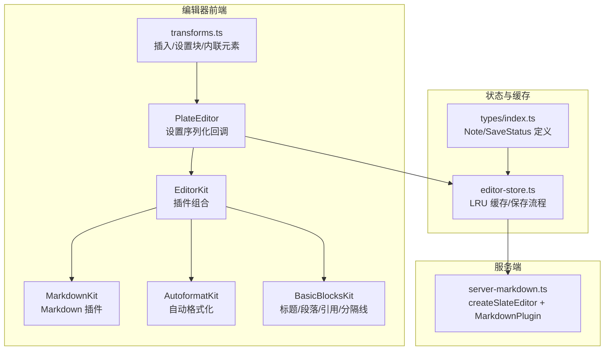
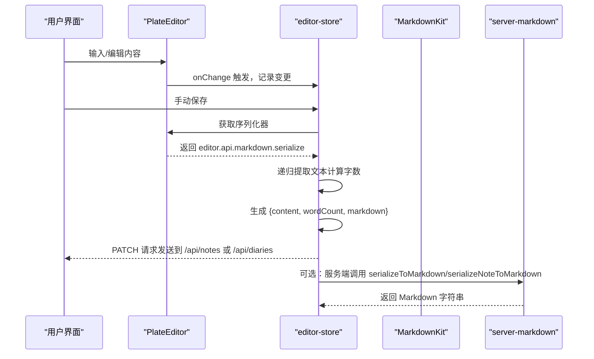
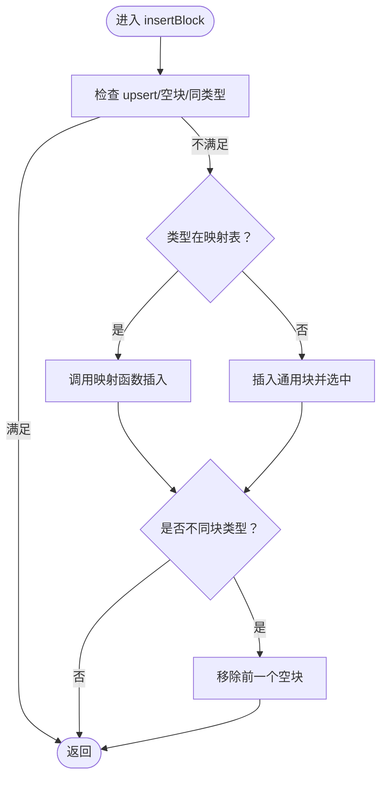
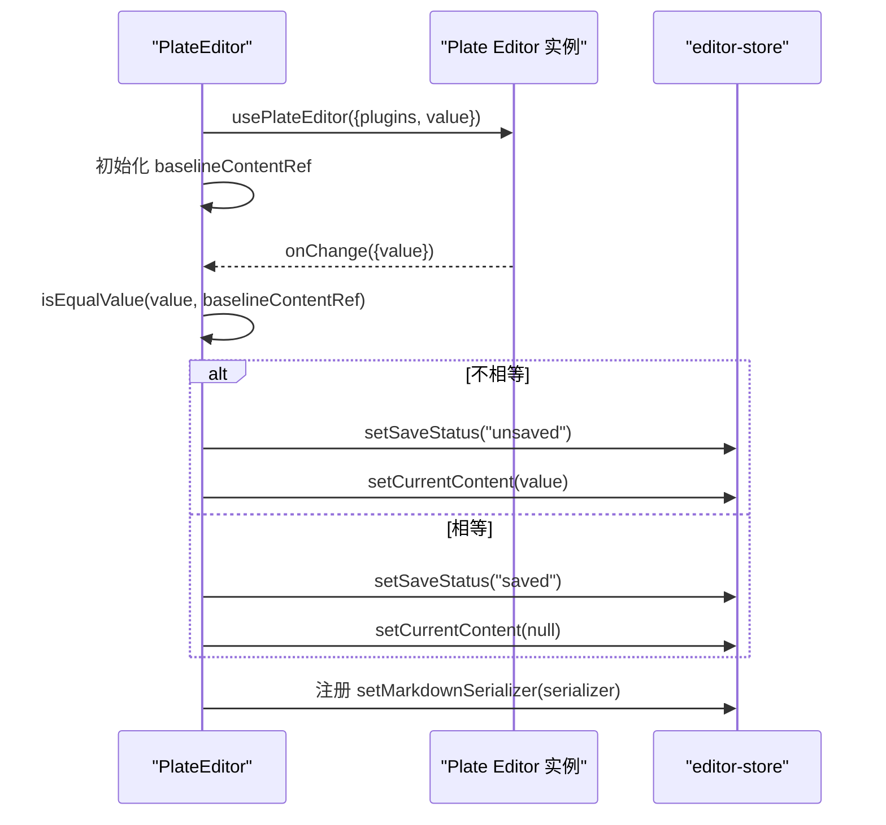
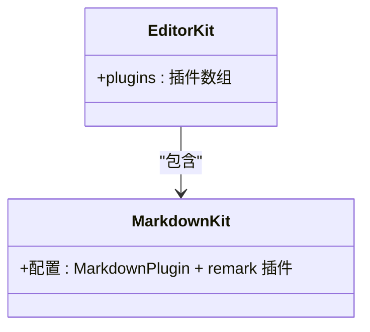
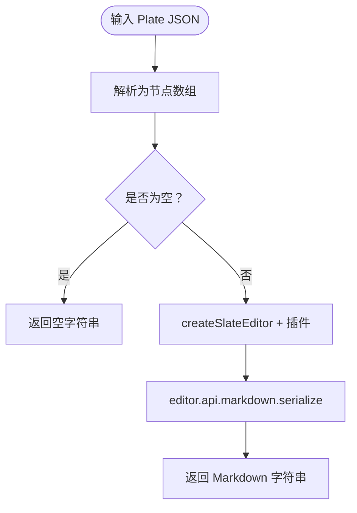
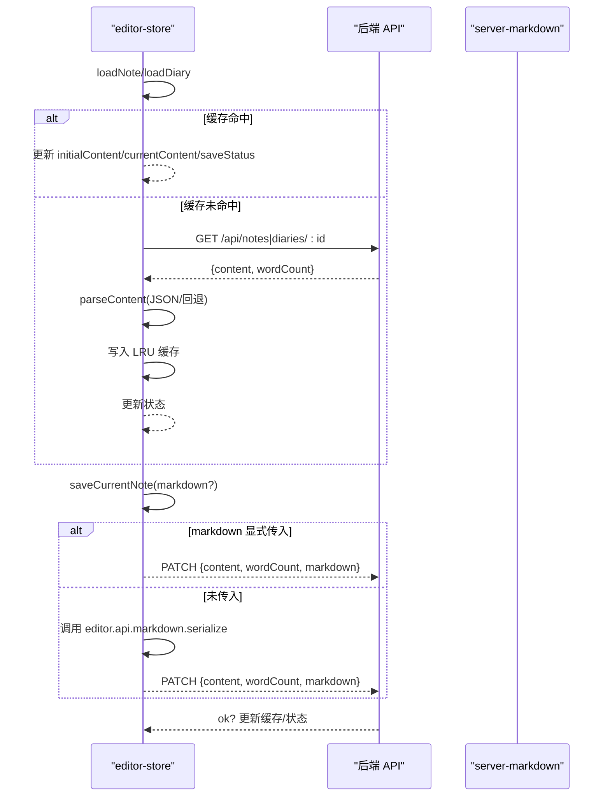
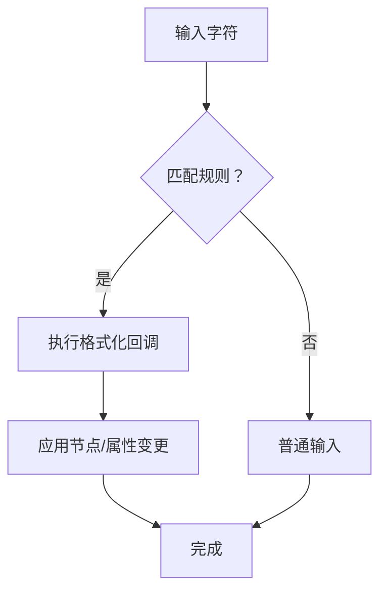
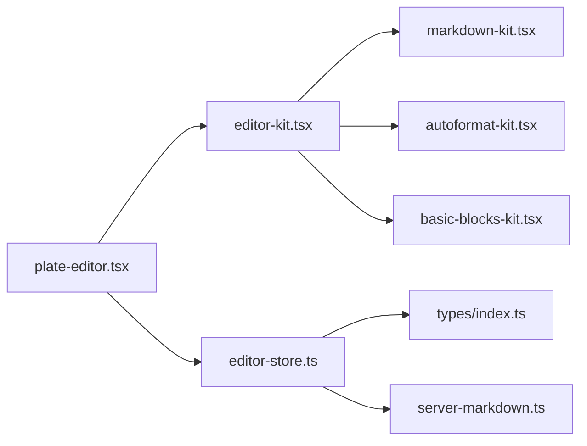

# 内容转换机制

<cite>
**本文引用的文件**
- [src/components/editor/transforms.ts](file://src/components/editor/transforms.ts)
- [src/components/editor/plate-editor.tsx](file://src/components/editor/plate-editor.tsx)
- [src/components/editor/editor-kit.tsx](file://src/components/editor/editor-kit.tsx)
- [src/components/editor/plugins/markdown-kit.tsx](file://src/components/editor/plugins/markdown-kit.tsx)
- [src/components/editor/plugins/basic-blocks-kit.tsx](file://src/components/editor/plugins/basic-blocks-kit.tsx)
- [src/components/editor/plugins/autoformat-kit.tsx](file://src/components/editor/plugins/autoformat-kit.tsx)
- [src/lib/server-markdown.ts](file://src/lib/server-markdown.ts)
- [src/stores/editor-store.ts](file://src/stores/editor-store.ts)
- [src/types/index.ts](file://src/types/index.ts)
</cite>

## 目录
1. [引言](#引言)
2. [项目结构](#项目结构)
3. [核心组件](#核心组件)
4. [架构总览](#架构总览)
5. [详细组件分析](#详细组件分析)
6. [依赖关系分析](#依赖关系分析)
7. [性能考量](#性能考量)
8. [故障排查指南](#故障排查指南)
9. [结论](#结论)
10. [附录](#附录)

## 引言
本文件系统性阐述 ynNote v2 的“内容转换机制”，聚焦于编辑器内部值格式（Plate JSON）与外部 Markdown 格式之间的双向转换流程，涵盖序列化与反序列化、节点遍历与属性映射、Markdown 解析器集成（含语法支持与扩展）、内容变换函数（插入/删除/格式化）、数据验证与错误处理、性能优化策略（增量转换与缓存）、自定义扩展点以及与服务器端 Markdown 处理的集成与同步。

## 项目结构
围绕内容转换的核心模块分布如下：
- 编辑器内核与插件：Plate.js 生态，通过 EditorKit 组合基础块元素、标记、列表、自动格式化、Markdown 插件等。
- 转换与序列化：编辑器侧使用 editor.api.markdown.serialize；服务端使用 createSlateEditor + MarkdownPlugin + remark 插件链进行序列化。
- 状态与缓存：编辑器状态与内容缓存由 Zustand store 管理，支持 LRU 缓存与手动保存时的增量序列化。
- 类型定义：NoteMeta/NoteDetail/SaveStatus 等类型支撑前后端一致的数据契约。

图表来源
- [src/components/editor/plate-editor.tsx:63-175](file://src/components/editor/plate-editor.tsx#L63-L175)
- [src/components/editor/editor-kit.tsx:36-78](file://src/components/editor/editor-kit.tsx#L36-L78)
- [src/components/editor/plugins/markdown-kit.tsx:5-11](file://src/components/editor/plugins/markdown-kit.tsx#L5-L11)
- [src/components/editor/plugins/autoformat-kit.tsx:211-237](file://src/components/editor/plugins/autoformat-kit.tsx#L211-L237)
- [src/components/editor/plugins/basic-blocks-kit.tsx:27-89](file://src/components/editor/plugins/basic-blocks-kit.tsx#L27-L89)
- [src/stores/editor-store.ts:88-281](file://src/stores/editor-store.ts#L88-L281)
- [src/lib/server-markdown.ts:85-137](file://src/lib/server-markdown.ts#L85-L137)
- [src/types/index.ts:12-33](file://src/types/index.ts#L12-L33)

章节来源
- [src/components/editor/plate-editor.tsx:63-175](file://src/components/editor/plate-editor.tsx#L63-L175)
- [src/components/editor/editor-kit.tsx:36-78](file://src/components/editor/editor-kit.tsx#L36-L78)
- [src/stores/editor-store.ts:88-281](file://src/stores/editor-store.ts#L88-L281)
- [src/lib/server-markdown.ts:85-137](file://src/lib/server-markdown.ts#L85-L137)
- [src/types/index.ts:12-33](file://src/types/index.ts#L12-L33)

## 核心组件
- 编辑器序列化回调：PlateEditor 在挂载后注册 editor.api.markdown.serialize 作为 Markdown 序列化器，供手动保存时使用。
- 内容变换函数：transforms.ts 提供插入块/内联元素、设置块类型、块类型识别等能力，统一通过 editor.tf 与 editor.api 进行节点操作。
- Markdown 插件：MarkdownKit 配置 MarkdownPlugin 并启用 remark-math、remark-gfm、remark-mdx、remark-mention 等插件，确保服务端与客户端一致的 Markdown 语义。
- 服务端序列化：server-markdown.ts 使用 createSlateEditor + 基础节点插件 + MarkdownPlugin，将 Plate JSON 转为 Markdown 字符串，并可追加标题前缀。
- 状态与缓存：editor-store.ts 管理当前笔记、初始内容、变更内容、保存状态、字数统计、内容缓存（LRU），并在保存时生成 Markdown 并更新缓存。
- 类型契约：NoteMeta/NoteDetail/SaveStatus 等类型保证前后端字段一致性。

章节来源
- [src/components/editor/plate-editor.tsx:146-153](file://src/components/editor/plate-editor.tsx#L146-L153)
- [src/components/editor/transforms.ts:29-207](file://src/components/editor/transforms.ts#L29-L207)
- [src/components/editor/plugins/markdown-kit.tsx:5-11](file://src/components/editor/plugins/markdown-kit.tsx#L5-L11)
- [src/lib/server-markdown.ts:85-137](file://src/lib/server-markdown.ts#L85-L137)
- [src/stores/editor-store.ts:88-281](file://src/stores/editor-store.ts#L88-L281)
- [src/types/index.ts:12-33](file://src/types/index.ts#L12-L33)

## 架构总览
编辑器内部以 Plate JSON 表示富文本内容，对外通过 MarkdownKit 与 editor.api.markdown.serialize 输出 Markdown。服务端通过 server-markdown.ts 使用相同的 MarkdownPlugin 与 remark 插件链，确保两端语义一致。保存流程中，编辑器侧可直接调用已注册的序列化器，或在未显式传入时由服务端生成。

图表来源
- [src/components/editor/plate-editor.tsx:84-99](file://src/components/editor/plate-editor.tsx#L84-L99)
- [src/stores/editor-store.ts:204-275](file://src/stores/editor-store.ts#L204-L275)
- [src/components/editor/plugins/markdown-kit.tsx:5-11](file://src/components/editor/plugins/markdown-kit.tsx#L5-L11)
- [src/lib/server-markdown.ts:85-137](file://src/lib/server-markdown.ts#L85-L137)

## 详细组件分析

### 组件一：内容变换与节点操作（transforms.ts）
- 功能要点
  - 插入块元素：根据类型映射表插入列表、三栏布局、音视频占位、媒体、公式、目录等；若未命中映射则插入通用块。
  - 插入内联元素：日期、行内公式、链接触发浮动工具条。
  - 设置块类型：统一处理列表样式、代码块切换、三栏布局切换等；对非同类型块进行清理。
  - 块类型识别：从节点中解析出列表类型（有序/无序/任务清单）或普通类型。
- 关键路径
  - 插入块：insertBlock → insertBlockMap/insertInlineMap → editor.tf.insertNodes
  - 设置块：setBlockType → setBlockMap → editor.tf.setNodes
  - 类型识别：getBlockType → 判断 listType 优先级
- 错误与边界
  - 若当前块为空且 upsert=true，则不插入新块，避免重复。
  - 对列表属性先 unset，再按目标类型设置，保证状态一致。

图表来源
- [src/components/editor/transforms.ts:87-122](file://src/components/editor/transforms.ts#L87-L122)

章节来源
- [src/components/editor/transforms.ts:29-207](file://src/components/editor/transforms.ts#L29-L207)

### 组件二：编辑器渲染与序列化回调（plate-editor.tsx）
- 功能要点
  - 快速比较编辑器值：isEqualValue/equalNode 递归对比，避免 JSON.stringify 的性能开销。
  - 初始化与切换笔记：重置编辑器值、清空历史、取消选择、滚动至顶部。
  - 注册序列化器：将 editor.api.markdown.serialize 暴露给 store，用于手动保存。
- 性能细节
  - 结构相等性比较，减少不必要的保存状态切换。
  - 切换笔记时清理历史，防止跨笔记撤销污染。

图表来源
- [src/components/editor/plate-editor.tsx:63-153](file://src/components/editor/plate-editor.tsx#L63-L153)

章节来源
- [src/components/editor/plate-editor.tsx:63-175](file://src/components/editor/plate-editor.tsx#L63-L175)

### 组件三：插件组合与 Markdown 集成（editor-kit.tsx、markdown-kit.tsx）
- 功能要点
  - EditorKit 将基础块、代码块、表格、折叠、目录、媒体、提示、列表、对齐、字体、自动格式化、Markdown 等插件聚合。
  - MarkdownKit 配置 MarkdownPlugin，并启用 remark-math、remark-gfm、remark-mdx、remark-mention。
- 影响范围
  - 客户端渲染与序列化均依赖该插件集，确保语义一致。

图表来源
- [src/components/editor/editor-kit.tsx:36-78](file://src/components/editor/editor-kit.tsx#L36-L78)
- [src/components/editor/plugins/markdown-kit.tsx:5-11](file://src/components/editor/plugins/markdown-kit.tsx#L5-L11)

章节来源
- [src/components/editor/editor-kit.tsx:36-78](file://src/components/editor/editor-kit.tsx#L36-L78)
- [src/components/editor/plugins/markdown-kit.tsx:5-11](file://src/components/editor/plugins/markdown-kit.tsx#L5-L11)

### 组件四：服务端 Markdown 序列化（server-markdown.ts）
- 功能要点
  - 创建服务端编辑器：使用 createSlateEditor + 基础节点插件 + MarkdownPlugin。
  - remark 插件链：remark-math、remark-gfm、remark-mdx、remark-mention。
  - 序列化：serializeToMarkdown/serializeNoteToMarkdown，后者可添加标题前缀并避免重复。
- 错误处理
  - try/catch 包裹，失败时返回空字符串并记录日志。

图表来源
- [src/lib/server-markdown.ts:85-108](file://src/lib/server-markdown.ts#L85-L108)
- [src/lib/server-markdown.ts:116-137](file://src/lib/server-markdown.ts#L116-L137)

章节来源
- [src/lib/server-markdown.ts:85-137](file://src/lib/server-markdown.ts#L85-L137)

### 组件五：状态管理与缓存（editor-store.ts）
- 功能要点
  - 加载笔记/日记：优先读取 LRU 缓存，未命中则请求 API，解析 JSON，写入缓存并更新状态。
  - 手动保存：序列化 Plate JSON 为 Markdown（若未显式传入），计算字数，PATCH 到对应 API，成功后更新缓存。
  - 缓存淘汰：LRU 最多保留固定数量条目，按最久未使用淘汰。
- 数据验证与错误处理
  - parseContent：空值/解析失败时回退为默认段落。
  - 保存流程：网络错误/接口失败时设置 saveStatus='error'，并保持 currentContent 以便重试。
- 增量转换
  - onChange 使用结构相等性比较，仅在内容真正变化时标记为未保存，减少无效序列化。

图表来源
- [src/stores/editor-store.ts:114-155](file://src/stores/editor-store.ts#L114-L155)
- [src/stores/editor-store.ts:157-198](file://src/stores/editor-store.ts#L157-L198)
- [src/stores/editor-store.ts:204-275](file://src/stores/editor-store.ts#L204-L275)

章节来源
- [src/stores/editor-store.ts:88-281](file://src/stores/editor-store.ts#L88-L281)

### 组件六：Markdown 自动格式化（autoformat-kit.tsx）
- 功能要点
  - 支持块级：标题、引用、代码块、水平分割线、列表（无序/有序/任务清单）。
  - 支持标记：粗体、斜体、下划线、删除线、上标/下标、高亮、代码。
  - 自动格式化规则：通过 AutoformatPlugin 配置，结合正则匹配与格式化回调。
  - 上下文限制：在代码块内禁用自动格式化，避免误触。
- 扩展点
  - 可新增自定义规则，或调整现有规则的匹配字符串与模式。

图表来源
- [src/components/editor/plugins/autoformat-kit.tsx:211-237](file://src/components/editor/plugins/autoformat-kit.tsx#L211-L237)

章节来源
- [src/components/editor/plugins/autoformat-kit.tsx:18-237](file://src/components/editor/plugins/autoformat-kit.tsx#L18-L237)

### 组件七：基础块元素（basic-blocks-kit.tsx）
- 功能要点
  - 提供标题（H1-H6）、段落、引用、水平分割线的基础节点与组件映射。
  - 配置快捷键与断行规则，提升编辑效率。
- 作用
  - 与 MarkdownKit 协作，确保标题/段落/引用等在序列化时具备正确语义。

章节来源
- [src/components/editor/plugins/basic-blocks-kit.tsx:27-89](file://src/components/editor/plugins/basic-blocks-kit.tsx#L27-L89)

## 依赖关系分析
- 编辑器侧
  - PlateEditor 依赖 EditorKit（含 MarkdownKit、AutoformatKit、BasicBlocksKit 等）。
  - transforms.ts 依赖 @platejs/* 插件生态，统一通过 editor.tf 与 editor.api 操作节点。
- 服务端侧
  - server-markdown.ts 依赖 @platejs/markdown 与 remark 插件，构建基础节点插件集合，复用 Markdown 语义。
- 状态与类型
  - editor-store.ts 依赖 types/index.ts 中的 NoteMeta/NoteDetail/SaveStatus 等类型，确保字段一致性。

图表来源
- [src/components/editor/plate-editor.tsx:63-175](file://src/components/editor/plate-editor.tsx#L63-L175)
- [src/components/editor/editor-kit.tsx:36-78](file://src/components/editor/editor-kit.tsx#L36-L78)
- [src/components/editor/plugins/markdown-kit.tsx:5-11](file://src/components/editor/plugins/markdown-kit.tsx#L5-L11)
- [src/components/editor/plugins/autoformat-kit.tsx:211-237](file://src/components/editor/plugins/autoformat-kit.tsx#L211-L237)
- [src/components/editor/plugins/basic-blocks-kit.tsx:27-89](file://src/components/editor/plugins/basic-blocks-kit.tsx#L27-L89)
- [src/stores/editor-store.ts:88-281](file://src/stores/editor-store.ts#L88-L281)
- [src/types/index.ts:12-33](file://src/types/index.ts#L12-L33)
- [src/lib/server-markdown.ts:85-137](file://src/lib/server-markdown.ts#L85-L137)

章节来源
- [src/components/editor/plate-editor.tsx:63-175](file://src/components/editor/plate-editor.tsx#L63-L175)
- [src/components/editor/editor-kit.tsx:36-78](file://src/components/editor/editor-kit.tsx#L36-L78)
- [src/stores/editor-store.ts:88-281](file://src/stores/editor-store.ts#L88-L281)
- [src/lib/server-markdown.ts:85-137](file://src/lib/server-markdown.ts#L85-L137)
- [src/types/index.ts:12-33](file://src/types/index.ts#L12-L33)

## 性能考量
- 结构相等性比较：在 PlateEditor 中使用自定义比较函数替代 JSON.stringify，显著降低大文档变更检测成本。
- LRU 缓存：editor-store.ts 维护固定容量的 LRU 缓存，按时间戳淘汰最旧条目，减少重复加载与解析。
- 增量保存：仅在内容结构发生变化时标记为未保存，避免频繁序列化与网络请求。
- 服务端序列化：server-markdown.ts 仅在需要时调用，避免不必要的 CPU 开销。
- 自动格式化上下文限制：在代码块内禁用自动格式化，减少误触发与回滚成本。

## 故障排查指南
- 序列化失败
  - 现象：保存时生成的 Markdown 为空或报错。
  - 排查：确认 editor.api.markdown.serialize 是否已注册；检查 editor-store 中的序列化调用；查看 server-markdown.ts 的 try/catch 日志。
- 内容解析异常
  - 现象：笔记/日记加载后显示异常。
  - 排查：parseContent 回退逻辑会将纯文本包装为段落，确认后端返回的 content 是否为合法 JSON；检查 API 响应状态。
- 保存状态异常
  - 现象：始终显示“保存中”或“错误”。
  - 排查：检查 PATCH 请求的响应码与 body；确认 saveStatus 的更新分支；查看 editor-store 的错误分支。
- 缓存不生效
  - 现象：切换笔记后仍显示旧内容。
  - 排查：确认 loadNote/loadDiary 的缓存命中逻辑；检查 contentCache 的写入与淘汰时机。

章节来源
- [src/lib/server-markdown.ts:104-107](file://src/lib/server-markdown.ts#L104-L107)
- [src/stores/editor-store.ts:204-275](file://src/stores/editor-store.ts#L204-L275)
- [src/stores/editor-store.ts:114-155](file://src/stores/editor-store.ts#L114-L155)

## 结论
本项目通过 EditorKit 的插件化设计与 MarkdownKit 的 remark 插件链，实现了编辑器内部 Plate JSON 与外部 Markdown 的高保真转换；配合 transforms.ts 的统一节点操作、PlateEditor 的高效变更检测、editor-store 的 LRU 缓存与增量保存，以及 server-markdown.ts 的服务端一致性序列化，形成了完整的“内容转换机制”。未来可在以下方面持续演进：扩展自定义 Markdown 规则、引入更细粒度的增量序列化、增强服务端与客户端的版本控制与冲突解决。

## 附录
- 自定义扩展点
  - MarkdownKit：新增 remark 插件或调整现有插件顺序，影响序列化语义。
  - AutoformatKit：新增/修改自动格式化规则，需考虑上下文限制。
  - transforms.ts：扩展 insertBlockMap/insertInlineMap 与 setBlockMap，覆盖更多节点类型。
- 与服务器端的集成
  - 服务端通过 server-markdown.ts 与客户端共享 Markdown 语义，适合在导出、预览、同步场景复用。
  - 版本控制建议：在 NoteDetail 中增加版本号字段，保存时携带版本号以支持并发写入与冲突检测。