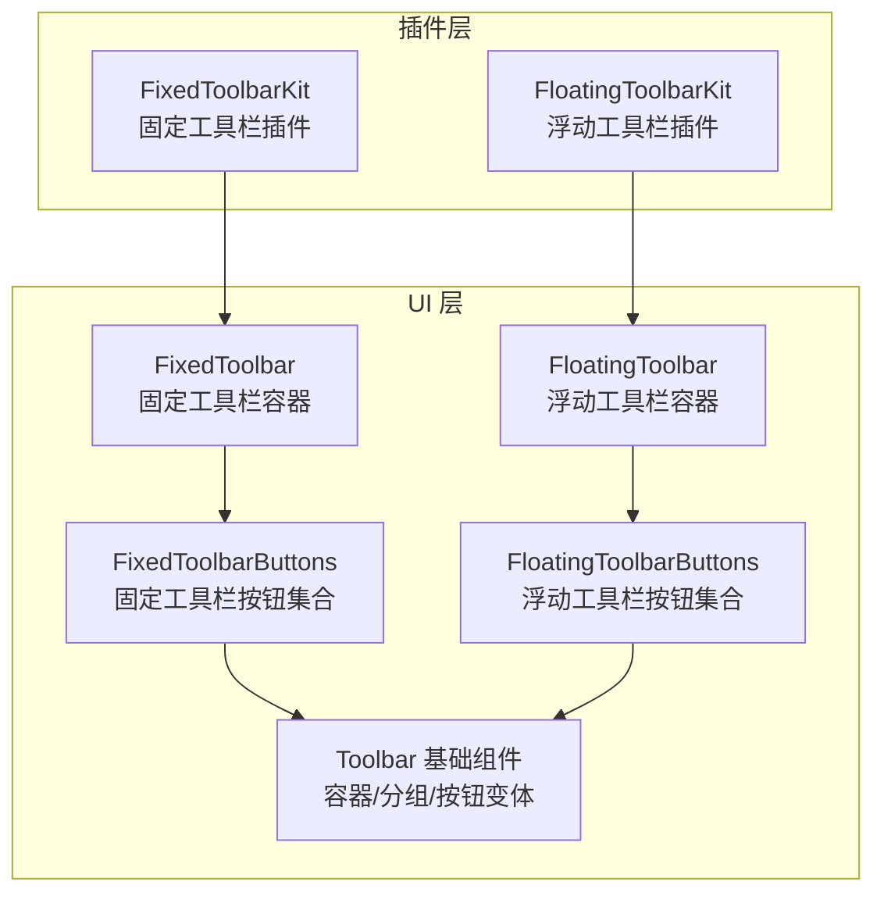
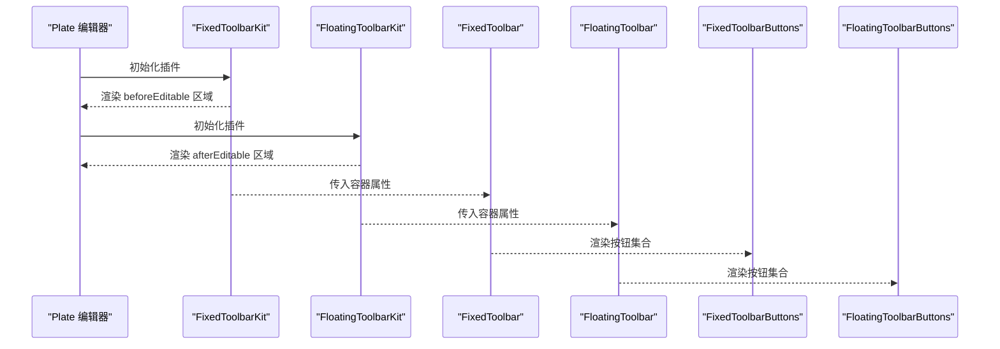
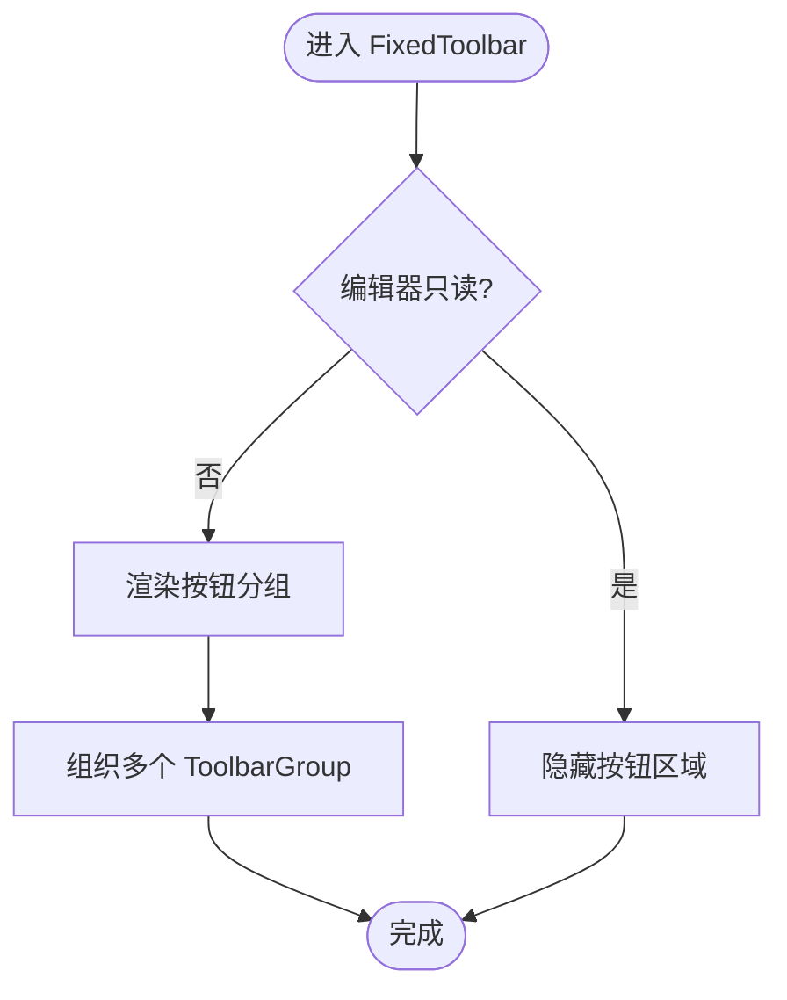
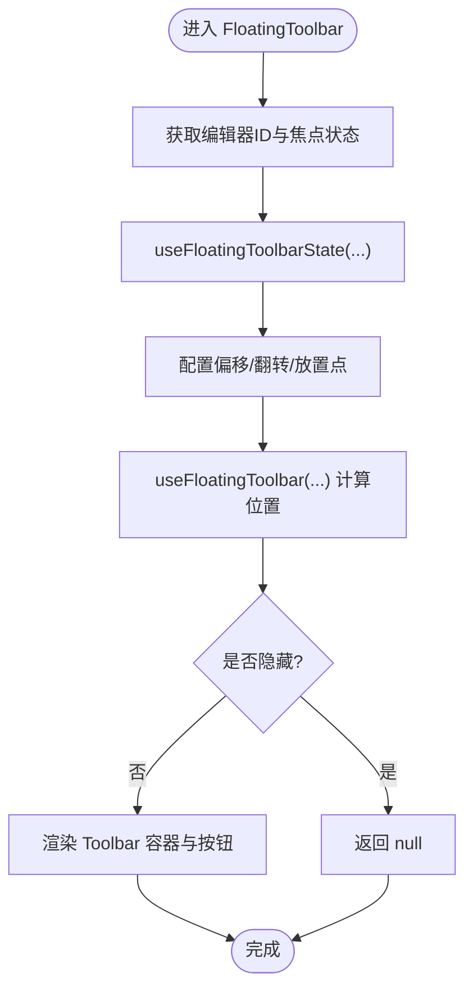
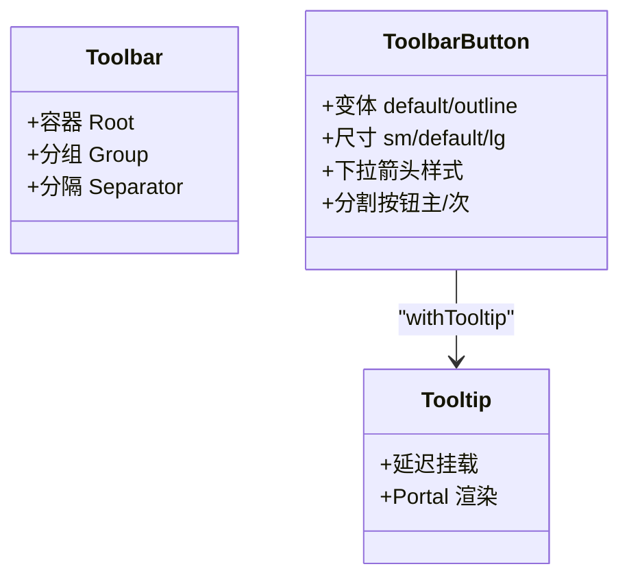
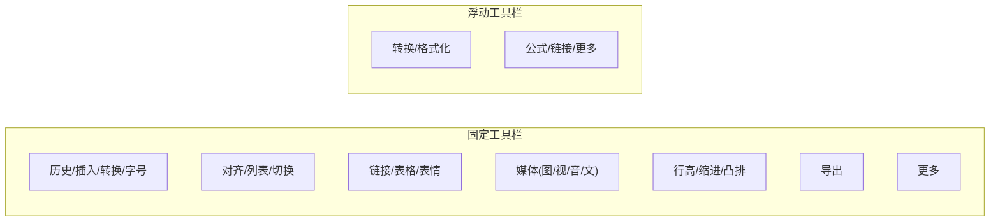
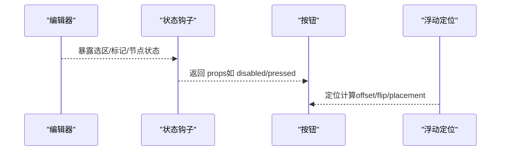
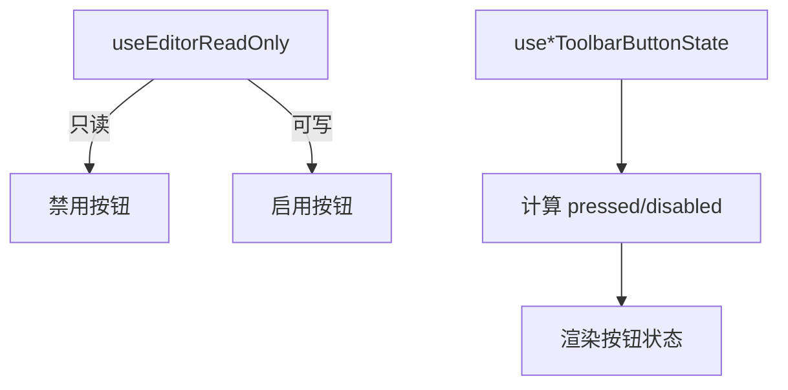
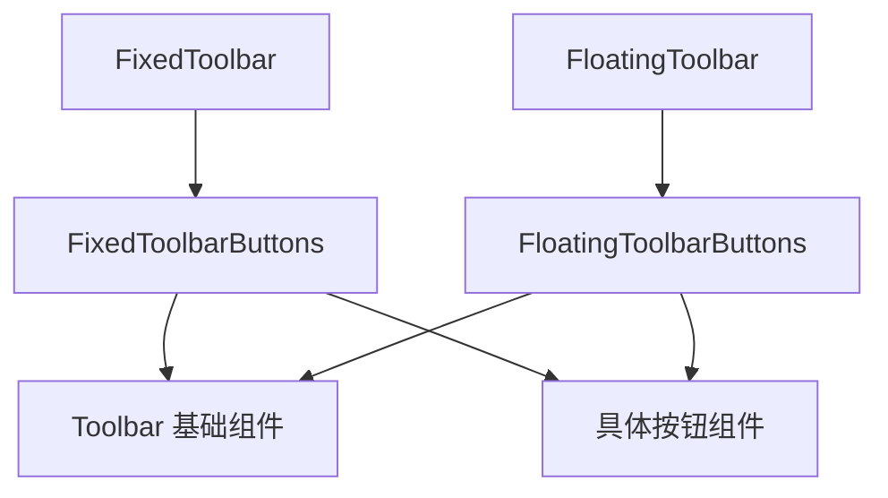

# 工具栏实现

<cite>
**本文引用的文件**
- [src/components/editor/plugins/fixed-toolbar-kit.tsx](file://src/components/editor/plugins/fixed-toolbar-kit.tsx)
- [src/components/editor/plugins/floating-toolbar-kit.tsx](file://src/components/editor/plugins/floating-toolbar-kit.tsx)
- [src/components/ui/fixed-toolbar.tsx](file://src/components/ui/fixed-toolbar.tsx)
- [src/components/ui/floating-toolbar.tsx](file://src/components/ui/floating-toolbar.tsx)
- [src/components/ui/fixed-toolbar-buttons.tsx](file://src/components/ui/fixed-toolbar-buttons.tsx)
- [src/components/ui/floating-toolbar-buttons.tsx](file://src/components/ui/floating-toolbar-buttons.tsx)
- [src/components/ui/toolbar.tsx](file://src/components/ui/toolbar.tsx)
- [src/components/ui/more-toolbar-button.tsx](file://src/components/ui/more-toolbar-button.tsx)
- [src/components/ui/mark-toolbar-button.tsx](file://src/components/ui/mark-toolbar-button.tsx)
- [src/components/ui/link-toolbar-button.tsx](file://src/components/ui/link-toolbar-button.tsx)
- [src/components/ui/media-toolbar-button.tsx](file://src/components/ui/media-toolbar-button.tsx)
- [src/components/ui/list-toolbar-button.tsx](file://src/components/ui/list-toolbar-button.tsx)
- [src/components/ui/indent-toolbar-button.tsx](file://src/components/ui/indent-toolbar-button.tsx)
- [src/components/ui/align-toolbar-button.tsx](file://src/components/ui/align-toolbar-button.tsx)
- [src/components/ui/font-size-toolbar-button.tsx](file://src/components/ui/font-size-toolbar-button.tsx)
- [src/components/ui/line-height-toolbar-button.tsx](file://src/components/ui/line-height-toolbar-button.tsx)
- [src/components/ui/toggle-toolbar-button.tsx](file://src/components/ui/toggle-toolbar-button.tsx)
- [src/components/ui/table-toolbar-button.tsx](file://src/components/ui/table-toolbar-button.tsx)
</cite>

## 目录
1. [简介](#简介)
2. [项目结构](#项目结构)
3. [核心组件](#核心组件)
4. [架构总览](#架构总览)
5. [详细组件分析](#详细组件分析)
6. [依赖关系分析](#依赖关系分析)
7. [性能考虑](#性能考虑)
8. [故障排查指南](#故障排查指南)
9. [结论](#结论)
10. [附录](#附录)

## 简介
本文件系统性地文档化编辑器工具栏的实现，重点覆盖两类工具栏：固定工具栏与浮动工具栏。内容涵盖设计理念与实现差异、按钮组织结构（格式化、插入、特殊功能）、定位与显示逻辑（光标跟踪与视口适配）、状态管理（启用/禁用与选区高亮）、响应式设计（移动端与触摸支持）、自定义指南（按钮添加、样式定制、行为扩展）、性能优化（渲染节流与内存管理）以及与编辑器插件的集成方式。

## 项目结构
工具栏体系由“插件层”和“UI 层”两部分组成：
- 插件层：通过 PlateJS 插件系统挂载固定/浮动工具栏，负责在编辑器生命周期中渲染对应 UI 组件。
- UI 层：提供通用工具栏容器、按钮变体、分组与提示等基础能力，并按需组合出固定/浮动工具栏的具体按钮集合。

**图表来源**
- [src/components/editor/plugins/fixed-toolbar-kit.tsx:8-19](file://src/components/editor/plugins/fixed-toolbar-kit.tsx#L8-L19)
- [src/components/editor/plugins/floating-toolbar-kit.tsx:8-19](file://src/components/editor/plugins/floating-toolbar-kit.tsx#L8-L19)
- [src/components/ui/fixed-toolbar.tsx:7-17](file://src/components/ui/fixed-toolbar.tsx#L7-L17)
- [src/components/ui/floating-toolbar.tsx:23-86](file://src/components/ui/floating-toolbar.tsx#L23-L86)
- [src/components/ui/toolbar.tsx:18-283](file://src/components/ui/toolbar.tsx#L18-L283)

**章节来源**
- [src/components/editor/plugins/fixed-toolbar-kit.tsx:1-20](file://src/components/editor/plugins/fixed-toolbar-kit.tsx#L1-L20)
- [src/components/editor/plugins/floating-toolbar-kit.tsx:1-20](file://src/components/editor/plugins/floating-toolbar-kit.tsx#L1-L20)
- [src/components/ui/fixed-toolbar.tsx:1-18](file://src/components/ui/fixed-toolbar.tsx#L1-L18)
- [src/components/ui/floating-toolbar.tsx:1-87](file://src/components/ui/floating-toolbar.tsx#L1-L87)
- [src/components/ui/toolbar.tsx:1-389](file://src/components/ui/toolbar.tsx#L1-L389)

## 核心组件
- 固定工具栏容器：使用粘性定位，随页面滚动保持在顶部，背景模糊，适配编辑器首屏。
- 浮动工具栏容器：基于 @platejs/floating 的定位策略，自动翻转与偏移，避免遮挡与越界。
- 通用工具栏基础：提供容器、分组、按钮变体、分割按钮、提示等通用能力。
- 按钮集合：固定/浮动工具栏分别组织不同按钮集合，覆盖格式化、插入、特殊功能三大类。

**章节来源**
- [src/components/ui/fixed-toolbar.tsx:7-17](file://src/components/ui/fixed-toolbar.tsx#L7-L17)
- [src/components/ui/floating-toolbar.tsx:23-86](file://src/components/ui/floating-toolbar.tsx#L23-L86)
- [src/components/ui/toolbar.tsx:18-283](file://src/components/ui/toolbar.tsx#L18-L283)
- [src/components/ui/fixed-toolbar-buttons.tsx:43-105](file://src/components/ui/fixed-toolbar-buttons.tsx#L43-L105)
- [src/components/ui/floating-toolbar-buttons.tsx:21-74](file://src/components/ui/floating-toolbar-buttons.tsx#L21-L74)

## 架构总览
固定与浮动工具栏共享同一套 UI 能力，差异主要体现在挂载位置、定位策略与可见性控制上。

**图表来源**
- [src/components/editor/plugins/fixed-toolbar-kit.tsx:8-19](file://src/components/editor/plugins/fixed-toolbar-kit.tsx#L8-L19)
- [src/components/editor/plugins/floating-toolbar-kit.tsx:8-19](file://src/components/editor/plugins/floating-toolbar-kit.tsx#L8-L19)
- [src/components/ui/fixed-toolbar.tsx:7-17](file://src/components/ui/fixed-toolbar.tsx#L7-L17)
- [src/components/ui/floating-toolbar.tsx:23-86](file://src/components/ui/floating-toolbar.tsx#L23-L86)
- [src/components/ui/fixed-toolbar-buttons.tsx:43-105](file://src/components/ui/fixed-toolbar-buttons.tsx#L43-L105)
- [src/components/ui/floating-toolbar-buttons.tsx:21-74](file://src/components/ui/floating-toolbar-buttons.tsx#L21-L74)

## 详细组件分析

### 固定工具栏（FixedToolbar）
- 定位与外观：粘性定位，顶部固定，宽度占满，背景模糊，带边框与圆角，适合编辑器首屏。
- 可见性：仅在编辑器可写时展示按钮组；只读模式下不显示。
- 按钮组织：历史操作、插入/转换/字号、对齐/列表/切换、链接/表格/表情、媒体插入、缩进/行高等、导出、更多菜单等。

**图表来源**
- [src/components/ui/fixed-toolbar.tsx:7-17](file://src/components/ui/fixed-toolbar.tsx#L7-L17)
- [src/components/ui/fixed-toolbar-buttons.tsx:43-105](file://src/components/ui/fixed-toolbar-buttons.tsx#L43-L105)

**章节来源**
- [src/components/ui/fixed-toolbar.tsx:1-18](file://src/components/ui/fixed-toolbar.tsx#L1-L18)
- [src/components/ui/fixed-toolbar-buttons.tsx:1-105](file://src/components/ui/fixed-toolbar-buttons.tsx#L1-L105)

### 浮动工具栏（FloatingToolbar）
- 定位与适配：使用 useFloatingToolbar 与 useFloatingToolbarState，支持偏移、翻转、多放置点回退，避免遮挡与越界；当存在浮层（如链接输入、AI 对话）时自动隐藏。
- 可见性：根据焦点编辑器 ID、是否打开相关浮层决定显示/隐藏。
- 按钮组织：聚焦于常用格式化（加粗/斜体/下划线/删除线/代码/高亮/公式/链接），右侧“更多”菜单。

**图表来源**
- [src/components/ui/floating-toolbar.tsx:36-64](file://src/components/ui/floating-toolbar.tsx#L36-L64)
- [src/components/ui/floating-toolbar.tsx:70-86](file://src/components/ui/floating-toolbar.tsx#L70-L86)

**章节来源**
- [src/components/ui/floating-toolbar.tsx:1-87](file://src/components/ui/floating-toolbar.tsx#L1-L87)
- [src/components/ui/floating-toolbar-buttons.tsx:1-74](file://src/components/ui/floating-toolbar-buttons.tsx#L1-L74)

### 通用工具栏基础（Toolbar）
- 容器与分组：提供根容器、分隔符、垂直分隔线、按钮组包装。
- 按钮变体：统一的按钮样式变体（默认/描边）、尺寸（小/中/大）、下拉箭头样式、分割按钮主次项。
- 提示系统：withTooltip 高阶组件，延迟挂载以避免 SSR 不一致，Portal 渲染提示内容。
- 可访问性：基于 Radix UI Toolbar，提供 ToggleItem、ToggleGroup 等语义化控件。

**图表来源**
- [src/components/ui/toolbar.tsx:18-283](file://src/components/ui/toolbar.tsx#L18-L283)
- [src/components/ui/toolbar.tsx:298-354](file://src/components/ui/toolbar.tsx#L298-L354)

**章节来源**
- [src/components/ui/toolbar.tsx:1-389](file://src/components/ui/toolbar.tsx#L1-L389)

### 按钮组织结构
- 格式化按钮：MarkToolbarButton（加粗/斜体/下划线/删除线/代码/高亮），FontColorToolbarButton（颜色选择器）、FontColorToolbarButton（字体颜色）、LineHeightToolbarButton（行高）、AlignToolbarButton（对齐）。
- 插入按钮：InsertToolbarButton（插入块级节点）、TurnIntoToolbarButton（块类型转换）、FontSizeToolbarButton（字号微调/下拉）、MediaToolbarButton（图片/视频/音频/文件上传或链接插入）。
- 特殊功能按钮：LinkToolbarButton（链接）、TableToolbarButton（表格插入与行列/单元格操作）、ToggleToolbarButton（折叠/展开）、HistoryToolbarButton（撤销/重做）、IndentToolbarButton/OutdentToolbarButton（缩进/凸排）、ExportToolbarButton（导出）、MoreToolbarButton（更多快捷项）。

**图表来源**
- [src/components/ui/fixed-toolbar-buttons.tsx:46-99](file://src/components/ui/fixed-toolbar-buttons.tsx#L46-L99)
- [src/components/ui/floating-toolbar-buttons.tsx:24-71](file://src/components/ui/floating-toolbar-buttons.tsx#L24-L71)

**章节来源**
- [src/components/ui/fixed-toolbar-buttons.tsx:1-105](file://src/components/ui/fixed-toolbar-buttons.tsx#L1-L105)
- [src/components/ui/floating-toolbar-buttons.tsx:1-74](file://src/components/ui/floating-toolbar-buttons.tsx#L1-L74)

### 光标跟踪与视口适配
- 光标跟踪：按钮状态通过 PlateJS 的状态钩子（如 useMarkToolbarButtonState、useIndentTodoToolBarButtonState 等）从编辑器状态推导，确保按钮启用/禁用与当前选区一致。
- 视口适配：浮动工具栏通过中间件实现偏移与翻转，支持多种回退放置点，避免遮挡；固定工具栏采用粘性定位，始终位于编辑器首屏。

**图表来源**
- [src/components/ui/mark-toolbar-button.tsx:8-20](file://src/components/ui/mark-toolbar-button.tsx#L8-L20)
- [src/components/ui/list-toolbar-button.tsx:194-205](file://src/components/ui/list-toolbar-button.tsx#L194-L205)
- [src/components/ui/floating-toolbar.tsx:36-64](file://src/components/ui/floating-toolbar.tsx#L36-L64)

**章节来源**
- [src/components/ui/mark-toolbar-button.tsx:1-21](file://src/components/ui/mark-toolbar-button.tsx#L1-L21)
- [src/components/ui/list-toolbar-button.tsx:1-206](file://src/components/ui/list-toolbar-button.tsx#L1-L206)
- [src/components/ui/floating-toolbar.tsx:36-64](file://src/components/ui/floating-toolbar.tsx#L36-L64)

### 状态管理（启用/禁用与选区高亮）
- 启用/禁用：按钮通过 useEditorReadOnly 判断编辑器只读状态；各按钮内部通过 use*ToolbarButtonState 获取当前状态，如 Mark/列表/缩进/表格等。
- 选区高亮：按钮的 pressed 状态与当前节点/标记状态联动，例如 MarkToolbarButton、ListToolbarSplitButton 等。

**图表来源**
- [src/components/ui/fixed-toolbar-buttons.tsx:44-44](file://src/components/ui/fixed-toolbar-buttons.tsx#L44-L44)
- [src/components/ui/mark-toolbar-button.tsx:16-17](file://src/components/ui/mark-toolbar-button.tsx#L16-L17)
- [src/components/ui/list-toolbar-button.tsx:197-198](file://src/components/ui/list-toolbar-button.tsx#L197-L198)

**章节来源**
- [src/components/ui/fixed-toolbar-buttons.tsx:44-44](file://src/components/ui/fixed-toolbar-buttons.tsx#L44-L44)
- [src/components/ui/mark-toolbar-button.tsx:1-21](file://src/components/ui/mark-toolbar-button.tsx#L1-L21)
- [src/components/ui/list-toolbar-button.tsx:194-205](file://src/components/ui/list-toolbar-button.tsx#L194-L205)

### 响应式设计与触摸支持
- 响应式：固定工具栏容器使用“溢出自动横向滚动”，避免按钮过多时换行；浮动工具栏限制最大宽度，避免超长内容溢出。
- 移动端：按钮尺寸提供 sm/default/lg 三种规格，配合下拉菜单与分割按钮减少移动端空间占用。
- 触摸支持：按钮与菜单均基于 Radix UI，具备键盘与触控友好的交互语义；媒体插入支持文件选择与 URL 输入两种路径。

**章节来源**
- [src/components/ui/fixed-toolbar.tsx:11-14](file://src/components/ui/fixed-toolbar.tsx#L11-L14)
- [src/components/ui/floating-toolbar.tsx:75-79](file://src/components/ui/floating-toolbar.tsx#L75-L79)
- [src/components/ui/toolbar.tsx:67-87](file://src/components/ui/toolbar.tsx#L67-L87)
- [src/components/ui/media-toolbar-button.tsx:100-144](file://src/components/ui/media-toolbar-button.tsx#L100-L144)

### 自定义指南
- 添加新按钮：参考 MarkToolbarButton/LinkToolbarButton 的模式，使用对应的 use*ToolbarButtonState 与 use*ToolbarButton，封装为 ToolbarButton 子组件。
- 样式定制：通过 ToolbarButton 的 size/variant 与 cn 组合自定义尺寸与外观；分组与分隔线使用 ToolbarGroup/ToolbarSeparator。
- 行为扩展：在按钮内部通过 editor.tf 或插件 Transform 执行编辑器操作；复杂交互可结合 DropdownMenu/Popover/AlertDialog 实现。

**章节来源**
- [src/components/ui/mark-toolbar-button.tsx:8-20](file://src/components/ui/mark-toolbar-button.tsx#L8-L20)
- [src/components/ui/link-toolbar-button.tsx:12-23](file://src/components/ui/link-toolbar-button.tsx#L12-L23)
- [src/components/ui/toolbar.tsx:67-112](file://src/components/ui/toolbar.tsx#L67-L112)
- [src/components/ui/toolbar.tsx:264-283](file://src/components/ui/toolbar.tsx#L264-L283)

### 性能优化
- 渲染节流：浮动工具栏通过中间件与状态计算避免频繁重排；按钮状态通过状态钩子按需更新，减少无效渲染。
- 内存管理：工具栏组件均为客户端组件，遵循 React 生命周期；下拉菜单与提示使用 Portal 渲染，避免深层嵌套导致的重复挂载。
- 复杂交互：媒体插入与表格操作涉及多层弹窗与状态，建议在外部统一管理对话框状态，避免重复实例化。

**章节来源**
- [src/components/ui/floating-toolbar.tsx:36-64](file://src/components/ui/floating-toolbar.tsx#L36-L64)
- [src/components/ui/media-toolbar-button.tsx:146-161](file://src/components/ui/media-toolbar-button.tsx#L146-L161)
- [src/components/ui/table-toolbar-button.tsx:36-52](file://src/components/ui/table-toolbar-button.tsx#L36-L52)

### 与编辑器插件的集成
- 插件挂载：FixedToolbarKit/FloatingToolbarKit 使用 PlateJS 的 createPlatePlugin 在编辑器渲染前/后注入工具栏。
- 插件能力：按钮内部广泛使用 @platejs/* 插件提供的状态钩子与 Transform，如 basic-styles、list、indent、table、link、media 等。
- 焦点与浮层：FloatingToolbar 会检测特定浮层（如链接输入、AI 对话）以决定是否隐藏，保证交互一致性。

**章节来源**
- [src/components/editor/plugins/fixed-toolbar-kit.tsx:8-19](file://src/components/editor/plugins/fixed-toolbar-kit.tsx#L8-L19)
- [src/components/editor/plugins/floating-toolbar-kit.tsx:8-19](file://src/components/editor/plugins/floating-toolbar-kit.tsx#L8-L19)
- [src/components/ui/floating-toolbar.tsx:32-40](file://src/components/ui/floating-toolbar.tsx#L32-L40)

## 依赖关系分析
- 固定工具栏依赖：FixedToolbar -> FixedToolbarButtons -> Toolbar 基础组件。
- 浮动工具栏依赖：FloatingToolbar -> FloatingToolbarButtons -> Toolbar 基础组件。
- 按钮依赖：各按钮组件依赖 ToolbarButton/ToolbarGroup/Tooltip/DropdownMenu/Popover 等基础 UI 组件。

**图表来源**
- [src/components/ui/fixed-toolbar.tsx:7-17](file://src/components/ui/fixed-toolbar.tsx#L7-L17)
- [src/components/ui/floating-toolbar.tsx:23-86](file://src/components/ui/floating-toolbar.tsx#L23-L86)
- [src/components/ui/fixed-toolbar-buttons.tsx:43-105](file://src/components/ui/fixed-toolbar-buttons.tsx#L43-L105)
- [src/components/ui/floating-toolbar-buttons.tsx:21-74](file://src/components/ui/floating-toolbar-buttons.tsx#L21-L74)
- [src/components/ui/toolbar.tsx:18-283](file://src/components/ui/toolbar.tsx#L18-L283)

**章节来源**
- [src/components/ui/toolbar.tsx:1-389](file://src/components/ui/toolbar.tsx#L1-L389)

## 性能考虑
- 按钮状态订阅：尽量使用精确的状态选择器，避免全局状态变更触发不必要的重渲染。
- 浮动定位：合理设置偏移与翻转参数，减少布局抖动；在大量按钮时优先使用“更多”菜单收起次要功能。
- DOM 结构：使用 ToolbarGroup 与分隔线减少无意义的包裹层级，提升渲染效率。

## 故障排查指南
- 工具栏不显示
  - 检查编辑器是否处于只读模式；固定工具栏在只读时不渲染按钮区域。
  - 检查浮动工具栏是否被其他浮层遮挡或隐藏。
- 按钮状态异常
  - 确认 use*ToolbarButtonState 是否正确绑定到当前编辑器；检查选区是否为空或跨块。
- 浮动工具栏位置异常
  - 检查 floatingOptions 的偏移/翻转/放置点配置；确认容器是否有固定/绝对定位影响定位。
- 媒体插入失败
  - 检查文件选择器权限与 URL 格式；确认 PlaceholderPlugin 正确注入 Transform。

**章节来源**
- [src/components/ui/fixed-toolbar-buttons.tsx:44-44](file://src/components/ui/fixed-toolbar-buttons.tsx#L44-L44)
- [src/components/ui/floating-toolbar.tsx:32-40](file://src/components/ui/floating-toolbar.tsx#L32-L40)
- [src/components/ui/media-toolbar-button.tsx:176-186](file://src/components/ui/media-toolbar-button.tsx#L176-L186)

## 结论
本工具栏体系通过“插件层 + UI 层”的清晰分层，实现了固定与浮动两种定位策略的统一抽象。通用工具栏基础提供了丰富的按钮变体与交互能力，配合各插件的状态钩子，能够高效地实现格式化、插入与特殊功能的完整覆盖。在性能与可用性方面，通过状态订阅、定位中间件与响应式设计，满足桌面与移动端的多样化需求。

## 附录
- 快速对照表
  - 固定工具栏：适合首屏高频操作，粘性定位，横向滚动。
  - 浮动工具栏：聚焦常用格式化，自动避让，适合选区内快速操作。
  - 通用能力：Toolbar 容器、分组、按钮变体、分割按钮、提示系统。
  - 按钮分类：格式化（Mark/对齐/行高/颜色）、插入（媒体/表格/链接/字号）、特殊（撤销/重做/缩进/导出/更多）。