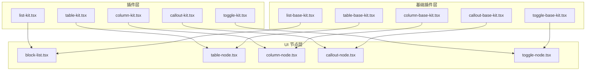
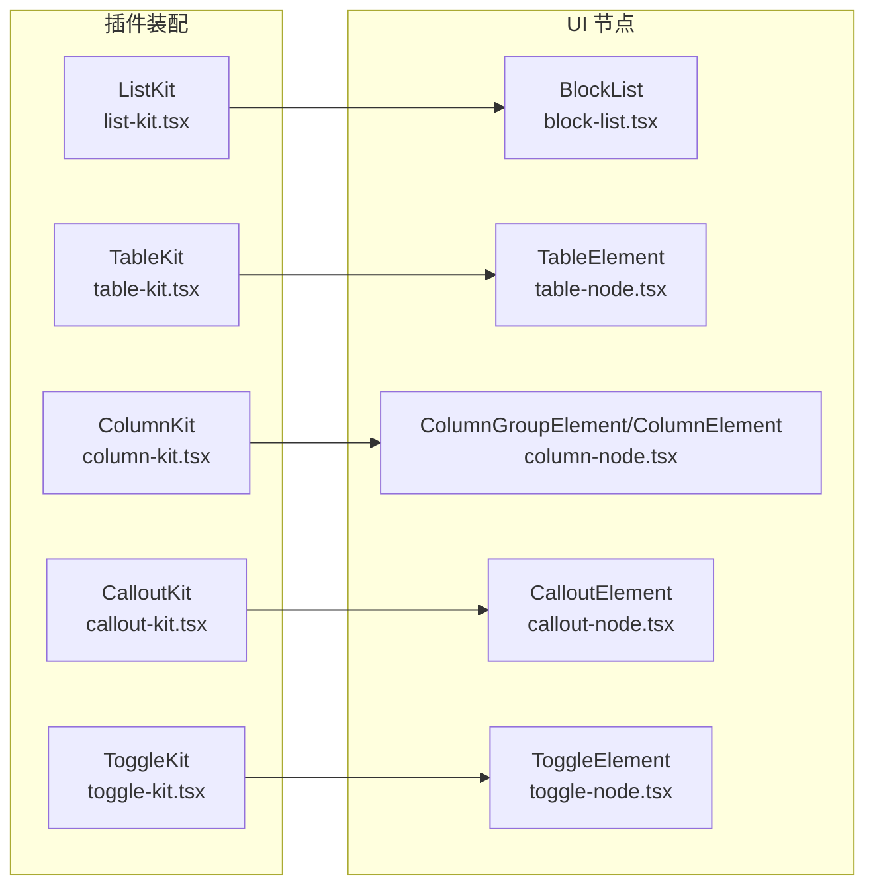
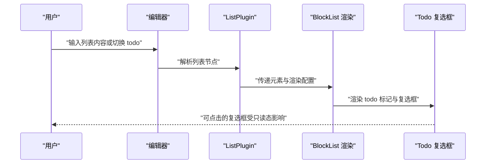
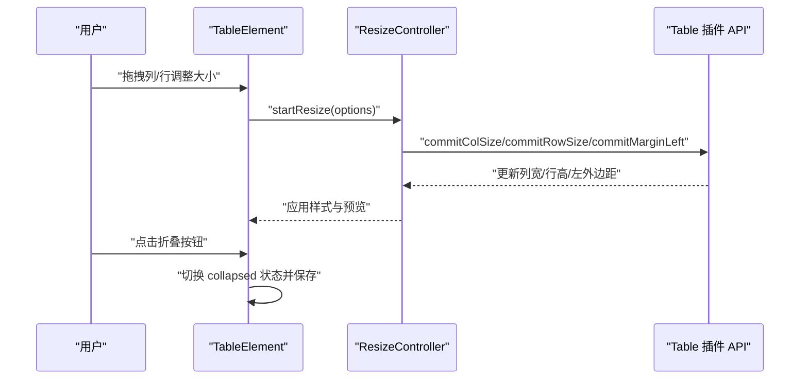
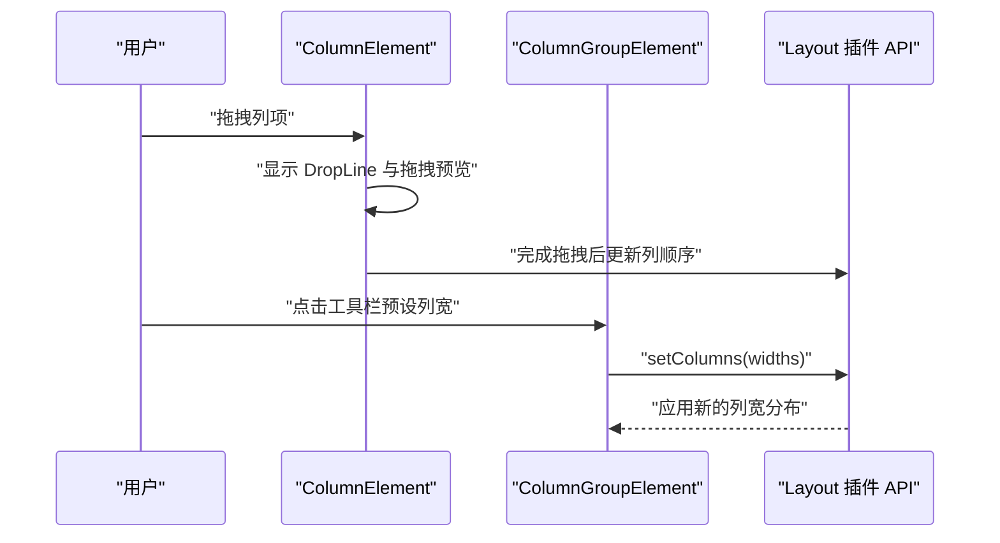
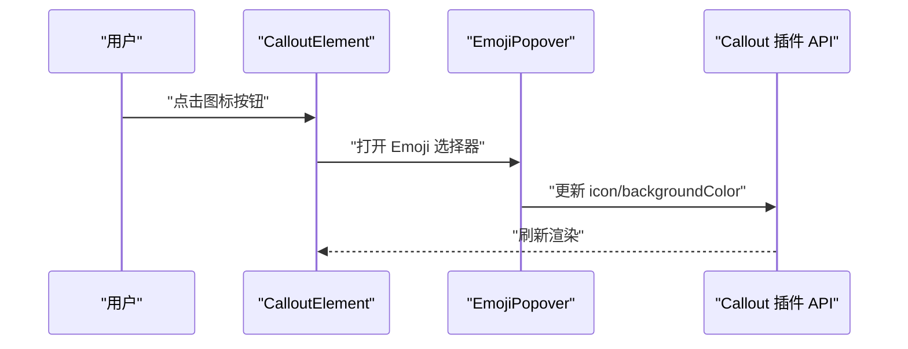
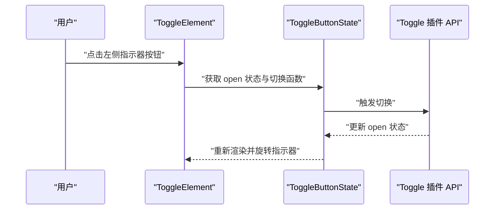
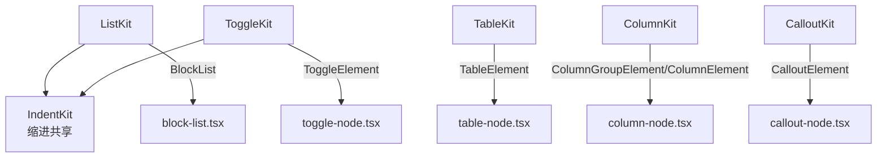

# 交互式插件

<cite>
**本文引用的文件**
- [list-kit.tsx](file://src/components/editor/plugins/list-kit.tsx)
- [list-base-kit.tsx](file://src/components/editor/plugins/list-base-kit.tsx)
- [table-kit.tsx](file://src/components/editor/plugins/table-kit.tsx)
- [table-base-kit.tsx](file://src/components/editor/plugins/table-base-kit.tsx)
- [column-kit.tsx](file://src/components/editor/plugins/column-kit.tsx)
- [column-base-kit.tsx](file://src/components/editor/plugins/column-base-kit.tsx)
- [callout-kit.tsx](file://src/components/editor/plugins/callout-kit.tsx)
- [callout-base-kit.tsx](file://src/components/editor/plugins/callout-base-kit.tsx)
- [toggle-kit.tsx](file://src/components/editor/plugins/toggle-kit.tsx)
- [toggle-base-kit.tsx](file://src/components/editor/plugins/toggle-base-kit.tsx)
- [block-list.tsx](file://src/components/ui/block-list.tsx)
- [table-node.tsx](file://src/components/ui/table-node.tsx)
- [column-node.tsx](file://src/components/ui/column-node.tsx)
- [callout-node.tsx](file://src/components/ui/callout-node.tsx)
- [toggle-node.tsx](file://src/components/ui/toggle-node.tsx)
</cite>

## 目录
1. [简介](#简介)
2. [项目结构](#项目结构)
3. [核心组件](#核心组件)
4. [架构总览](#架构总览)
5. [详细组件分析](#详细组件分析)
6. [依赖关系分析](#依赖关系分析)
7. [性能考量](#性能考量)
8. [故障排查指南](#故障排查指南)
9. [结论](#结论)
10. [附录：扩展与自定义](#附录扩展与自定义)

## 简介
本文件系统性地文档化交互式插件体系中的五大块级节点插件：列表（list-kit）、表格（table-kit）、多栏（column-kit）、标注（callout-kit）、折叠（toggle-kit）。内容覆盖：
- 功能与行为：有序/无序列表、嵌套与项目符号；行列操作与单元格编辑；多栏布局与拖拽；信息提示与强调；可展开内容区域。
- 交互逻辑：鼠标拖拽、浮动工具栏、键盘焦点与快捷键建议、上下文菜单。
- 可访问性与体验：焦点可见性、键盘可达、视觉反馈、状态指示。
- 扩展与自定义：如何基于现有 kit 开发新插件、修改渲染与行为。

## 项目结构
插件以“kit”形式组织，分别在 plugins 目录下提供运行时（带交互）与基础（静态）两套实现，UI 组件位于 ui 目录中，负责具体节点元素的渲染与交互控制。

图表来源
- [list-kit.tsx:9-26](file://src/components/editor/plugins/list-kit.tsx#L9-L26)
- [table-kit.tsx:17-26](file://src/components/editor/plugins/table-kit.tsx#L17-L26)
- [column-kit.tsx:7-10](file://src/components/editor/plugins/column-kit.tsx#L7-L10)
- [callout-kit.tsx](file://src/components/editor/plugins/callout-kit.tsx#L7)
- [toggle-kit.tsx:8-11](file://src/components/editor/plugins/toggle-kit.tsx#L8-L11)
- [block-list.tsx:32-53](file://src/components/ui/block-list.tsx#L32-L53)
- [table-node.tsx:553-744](file://src/components/ui/table-node.tsx#L553-L744)
- [column-node.tsx:41-96](file://src/components/ui/column-node.tsx#L41-L96)
- [callout-node.tsx:13-64](file://src/components/ui/callout-node.tsx#L13-L64)
- [toggle-node.tsx:10-35](file://src/components/ui/toggle-node.tsx#L10-L35)

章节来源
- [list-kit.tsx:1-27](file://src/components/editor/plugins/list-kit.tsx#L1-L27)
- [table-kit.tsx:1-27](file://src/components/editor/plugins/table-kit.tsx#L1-L27)
- [column-kit.tsx:1-11](file://src/components/editor/plugins/column-kit.tsx#L1-L11)
- [callout-kit.tsx:1-8](file://src/components/editor/plugins/callout-kit.tsx#L1-L8)
- [toggle-kit.tsx:1-12](file://src/components/editor/plugins/toggle-kit.tsx#L1-L12)

## 核心组件
- 列表（list-kit）
  - 支持有序/无序列表、任务项（todo）等，通过注入到标题、段落、引用、代码块、折叠等节点类型。
  - 渲染使用自定义 BlockList，支持 todo 复选框与样式穿透。
- 表格（table-kit）
  - 提供表格、行、单元格、表头的节点与组件映射，支持初始宽度、列宽/行高调整、边框与背景色、合并/拆分单元格、折叠显示。
- 多栏（column-kit）
  - 提供列组与列项的节点与组件映射，支持列宽设置、拖拽移动、插入位置预览。
- 标注（callout-kit）
  - 提供带图标与背景色的提示容器，支持图标选择器与背景色设置。
- 折叠（toggle-kit）
  - 提供可展开/收起的内容区域，带旋转指示器与状态切换。

章节来源
- [list-kit.tsx:9-26](file://src/components/editor/plugins/list-kit.tsx#L9-L26)
- [list-base-kit.tsx:7-23](file://src/components/editor/plugins/list-base-kit.tsx#L7-L23)
- [table-kit.tsx:17-26](file://src/components/editor/plugins/table-kit.tsx#L17-L26)
- [table-base-kit.tsx:15-24](file://src/components/editor/plugins/table-base-kit.tsx#L15-L24)
- [column-kit.tsx:7-10](file://src/components/editor/plugins/column-kit.tsx#L7-L10)
- [column-base-kit.tsx:8-11](file://src/components/editor/plugins/column-base-kit.tsx#L8-L11)
- [callout-kit.tsx](file://src/components/editor/plugins/callout-kit.tsx#L7)
- [callout-base-kit.tsx:5-7](file://src/components/editor/plugins/callout-base-kit.tsx#L5-L7)
- [toggle-kit.tsx:8-11](file://src/components/editor/plugins/toggle-kit.tsx#L8-L11)
- [toggle-base-kit.tsx:5-7](file://src/components/editor/plugins/toggle-base-kit.tsx#L5-L7)

## 架构总览
以下图展示插件与 UI 节点之间的装配关系与职责边界：

图表来源
- [list-kit.tsx:9-26](file://src/components/editor/plugins/list-kit.tsx#L9-L26)
- [table-kit.tsx:17-26](file://src/components/editor/plugins/table-kit.tsx#L17-L26)
- [column-kit.tsx:7-10](file://src/components/editor/plugins/column-kit.tsx#L7-L10)
- [callout-kit.tsx](file://src/components/editor/plugins/callout-kit.tsx#L7)
- [toggle-kit.tsx:8-11](file://src/components/editor/plugins/toggle-kit.tsx#L8-L11)
- [block-list.tsx:32-53](file://src/components/ui/block-list.tsx#L32-L53)
- [table-node.tsx:553-744](file://src/components/ui/table-node.tsx#L553-L744)
- [column-node.tsx:41-96](file://src/components/ui/column-node.tsx#L41-L96)
- [callout-node.tsx:13-64](file://src/components/ui/callout-node.tsx#L13-L64)
- [toggle-node.tsx:10-35](file://src/components/ui/toggle-node.tsx#L10-L35)

## 详细组件分析

### 列表插件（list-kit）
- 注入目标：标题、段落、引用、代码块、折叠、图片等节点类型，确保列表可在这些上下文中插入与嵌套。
- 渲染策略：通过 BlockList 包装，根据元素的有序/无序类型渲染为 ol/ul，并支持自定义标记与 todo 样式。
- 交互要点：
  - todo 项具备复选框状态管理与只读态下的交互限制。
  - 列表起始编号与样式类型由元素属性驱动。
- 嵌套与项目符号：
  - 基于 Plate 的列表插件机制，支持多层级嵌套。
  - 项目符号类型由元素的样式类型字段决定。

图表来源
- [list-kit.tsx:9-26](file://src/components/editor/plugins/list-kit.tsx#L9-L26)
- [block-list.tsx:32-85](file://src/components/ui/block-list.tsx#L32-L85)

章节来源
- [list-kit.tsx:9-26](file://src/components/editor/plugins/list-kit.tsx#L9-L26)
- [list-base-kit.tsx:7-23](file://src/components/editor/plugins/list-base-kit.tsx#L7-L23)
- [block-list.tsx:32-85](file://src/components/ui/block-list.tsx#L32-L85)

### 表格插件（table-kit）
- 节点映射：表格、行、单元格、表头分别绑定到 TableElement、TableRowElement、TableCellElement、TableCellHeaderElement。
- 关键能力：
  - 初始表格宽度配置。
  - 列宽/行高动态调整（含延迟模式以提升大表格性能）。
  - 边框与背景色设置、单元格合并/拆分、块级选择与拖拽指示。
  - 折叠显示：可折叠整张表格，仅显示尺寸摘要。
- 浮动工具栏：在聚焦末尾、可合并/拆分或折叠时自动弹出，提供颜色、合并、拆分等操作入口。

图表来源
- [table-kit.tsx:17-26](file://src/components/editor/plugins/table-kit.tsx#L17-L26)
- [table-node.tsx:553-744](file://src/components/ui/table-node.tsx#L553-L744)
- [table-node.tsx:177-551](file://src/components/ui/table-node.tsx#L177-L551)

章节来源
- [table-kit.tsx:17-26](file://src/components/editor/plugins/table-kit.tsx#L17-L26)
- [table-base-kit.tsx:15-24](file://src/components/editor/plugins/table-base-kit.tsx#L15-L24)
- [table-node.tsx:553-744](file://src/components/ui/table-node.tsx#L553-L744)

### 多栏插件（column-kit）
- 节点映射：列组与列项分别绑定到 ColumnGroupElement 与 ColumnElement。
- 能力概览：
  - 拖拽移动列：支持水平方向拖拽与放置线指示。
  - 预设列宽方案：双栏、三栏、左右双栏、内外双栏等。
  - 浮动工具栏：在聚焦末尾且选中时弹出，提供列宽快速设置与删除。
- 交互细节：
  - 拖拽句柄与悬浮提示，仅在非只读与非块选择区域可见。
  - DropLine 在允许插入的位置给出视觉占位。

图表来源
- [column-kit.tsx:7-10](file://src/components/editor/plugins/column-kit.tsx#L7-L10)
- [column-node.tsx:41-96](file://src/components/ui/column-node.tsx#L41-L96)
- [column-node.tsx:150-226](file://src/components/ui/column-node.tsx#L150-L226)

章节来源
- [column-kit.tsx:7-10](file://src/components/editor/plugins/column-kit.tsx#L7-L10)
- [column-base-kit.tsx:8-11](file://src/components/editor/plugins/column-base-kit.tsx#L8-L11)
- [column-node.tsx:41-96](file://src/components/ui/column-node.tsx#L41-L96)

### 标注插件（callout-kit）
- 节点映射：CalloutElement 绑定到 Callout 插件。
- 能力概览：
  - 图标选择：内置 Emoji 选择器，支持图标即时切换。
  - 背景色设置：通过背景色工具应用到容器。
  - 上下文菜单：启用右键菜单支持。
- 交互细节：
  - 图标按钮为非可编辑区域，避免干扰输入。
  - 容器背景色直接作用于元素样式。

图表来源
- [callout-kit.tsx](file://src/components/editor/plugins/callout-kit.tsx#L7)
- [callout-node.tsx:13-64](file://src/components/ui/callout-node.tsx#L13-L64)

章节来源
- [callout-kit.tsx](file://src/components/editor/plugins/callout-kit.tsx#L7)
- [callout-base-kit.tsx:5-7](file://src/components/editor/plugins/callout-base-kit.tsx#L5-L7)
- [callout-node.tsx:13-64](file://src/components/ui/callout-node.tsx#L13-L64)

### 折叠插件（toggle-kit）
- 节点映射：ToggleElement 绑定到 Toggle 插件。
- 能力概览：
  - 展开/收起：通过按钮切换 open 状态，指示器旋转。
  - 与缩进 Kit 共享：继承缩进行为，便于嵌套。
- 交互细节：
  - 按钮为绝对定位，不参与内容编辑。
  - 状态切换通过插件提供的状态钩子驱动。

图表来源
- [toggle-kit.tsx:8-11](file://src/components/editor/plugins/toggle-kit.tsx#L8-L11)
- [toggle-node.tsx:10-35](file://src/components/ui/toggle-node.tsx#L10-L35)

章节来源
- [toggle-kit.tsx:8-11](file://src/components/editor/plugins/toggle-kit.tsx#L8-L11)
- [toggle-base-kit.tsx:5-7](file://src/components/editor/plugins/toggle-base-kit.tsx#L5-L7)
- [toggle-node.tsx:10-35](file://src/components/ui/toggle-node.tsx#L10-L35)

## 依赖关系分析
- 插件装配与 UI 组件解耦：kit 文件仅负责注册插件与组件映射，具体渲染与交互由对应 UI 组件实现。
- 共享能力：
  - 列表与折叠均引入缩进 Kit，保证嵌套与缩进一致性。
  - 表格、多栏、标注、折叠均使用 Plate 的选择、拖拽、可调整等通用能力。
- 可替换性：通过 withComponent 将插件与 UI 组件绑定，便于替换或扩展。

图表来源
- [list-kit.tsx:9-26](file://src/components/editor/plugins/list-kit.tsx#L9-L26)
- [toggle-kit.tsx:8-11](file://src/components/editor/plugins/toggle-kit.tsx#L8-L11)
- [table-kit.tsx:17-26](file://src/components/editor/plugins/table-kit.tsx#L17-L26)
- [column-kit.tsx:7-10](file://src/components/editor/plugins/column-kit.tsx#L7-L10)
- [callout-kit.tsx](file://src/components/editor/plugins/callout-kit.tsx#L7)
- [block-list.tsx:32-53](file://src/components/ui/block-list.tsx#L32-L53)
- [table-node.tsx:553-744](file://src/components/ui/table-node.tsx#L553-L744)
- [column-node.tsx:41-96](file://src/components/ui/column-node.tsx#L41-L96)
- [callout-node.tsx:13-64](file://src/components/ui/callout-node.tsx#L13-L64)
- [toggle-node.tsx:10-35](file://src/components/ui/toggle-node.tsx#L10-L35)

章节来源
- [list-kit.tsx:9-26](file://src/components/editor/plugins/list-kit.tsx#L9-L26)
- [toggle-kit.tsx:8-11](file://src/components/editor/plugins/toggle-kit.tsx#L8-L11)
- [table-kit.tsx:17-26](file://src/components/editor/plugins/table-kit.tsx#L17-L26)
- [column-kit.tsx:7-10](file://src/components/editor/plugins/column-kit.tsx#L7-L10)
- [callout-kit.tsx](file://src/components/editor/plugins/callout-kit.tsx#L7)

## 性能考量
- 表格列宽调整的延迟模式：当表格单元格数量超过阈值时，采用延迟渲染指示器以减少指针事件开销。
- 列宽/行高变更采用“覆盖值 + 最终提交”的方式，避免频繁重排。
- 列表与折叠等节点渲染尽量使用轻量组件包装，减少不必要的重渲染。

章节来源
- [table-node.tsx:574-577](file://src/components/ui/table-node.tsx#L574-L577)
- [table-node.tsx:327-433](file://src/components/ui/table-node.tsx#L327-L433)

## 故障排查指南
- 列表渲染异常
  - 检查元素是否正确设置为有序/无序类型，以及 BlockList 是否被正确注入。
  - 确认 todo 样式类型与复选框状态钩子可用。
- 表格无法调整大小
  - 确认已启用非选择区域的控制栏，检查列宽数组与最小宽度配置。
  - 大表格场景下确认延迟模式是否生效。
- 多栏拖拽无效
  - 检查拖拽句柄与 DropLine 是否在非只读与非块选择区域可见。
  - 确认列组与列项的路径与父节点一致。
- 标注图标不显示
  - 检查图标选择器是否正确初始化，确认元素 icon 字段存在。
- 折叠区域不可展开
  - 检查按钮状态钩子与 open 状态是否同步，确认指示器旋转逻辑。

章节来源
- [block-list.tsx:32-85](file://src/components/ui/block-list.tsx#L32-L85)
- [table-node.tsx:553-744](file://src/components/ui/table-node.tsx#L553-L744)
- [column-node.tsx:41-96](file://src/components/ui/column-node.tsx#L41-L96)
- [callout-node.tsx:13-64](file://src/components/ui/callout-node.tsx#L13-L64)
- [toggle-node.tsx:10-35](file://src/components/ui/toggle-node.tsx#L10-L35)

## 结论
上述五大插件通过统一的 kit 与 UI 节点架构，实现了从基础渲染到复杂交互的完整闭环。它们在保持一致的扩展点与可替换性的同时，针对各自领域提供了丰富的交互与可访问性支持。建议在二次开发中遵循“插件装配 + UI 组件”的分离原则，优先利用现有工具栏与上下文菜单能力，确保一致的用户体验。

## 附录：扩展与自定义
- 自定义列表样式
  - 在 BlockList 中新增样式类型映射，扩展 li 与 marker 渲染。
  - 参考路径：[block-list.tsx:19-30](file://src/components/ui/block-list.tsx#L19-L30)
- 自定义表格工具栏
  - 在 TableElement 的浮动工具栏中添加新按钮与处理逻辑。
  - 参考路径：[table-node.tsx:746-800](file://src/components/ui/table-node.tsx#L746-L800)
- 自定义多栏布局
  - 在 ColumnGroupElement 的工具栏中增加新的列宽方案。
  - 参考路径：[column-node.tsx:171-226](file://src/components/ui/column-node.tsx#L171-L226)
- 自定义标注图标与颜色
  - 使用 Emoji 选择器与背景色工具，扩展图标集与默认色板。
  - 参考路径：[callout-node.tsx:19-64](file://src/components/ui/callout-node.tsx#L19-L64)
- 自定义折叠行为
  - 通过 Toggle 插件的状态钩子扩展更多交互（如动画、持久化）。
  - 参考路径：[toggle-node.tsx:10-35](file://src/components/ui/toggle-node.tsx#L10-L35)