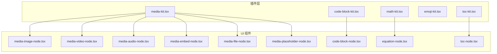
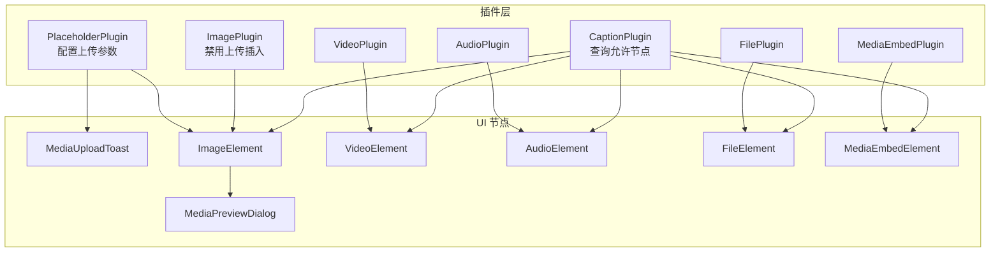
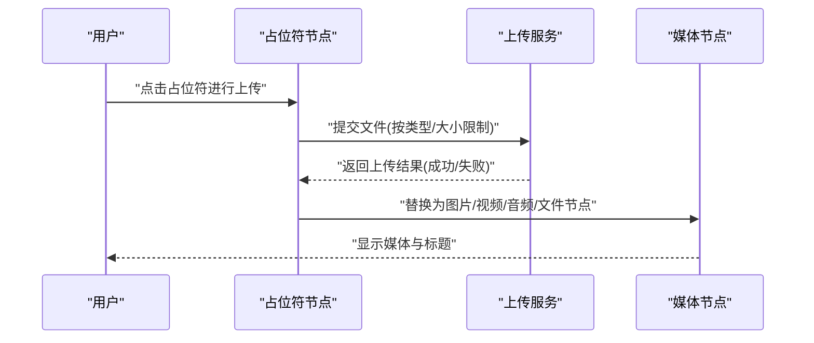
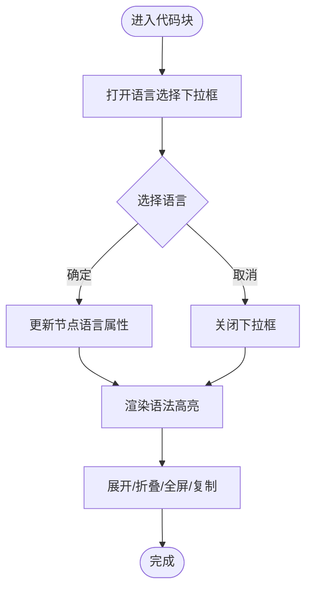
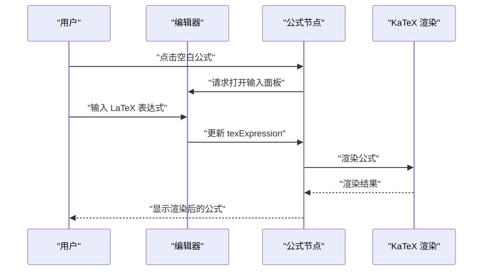
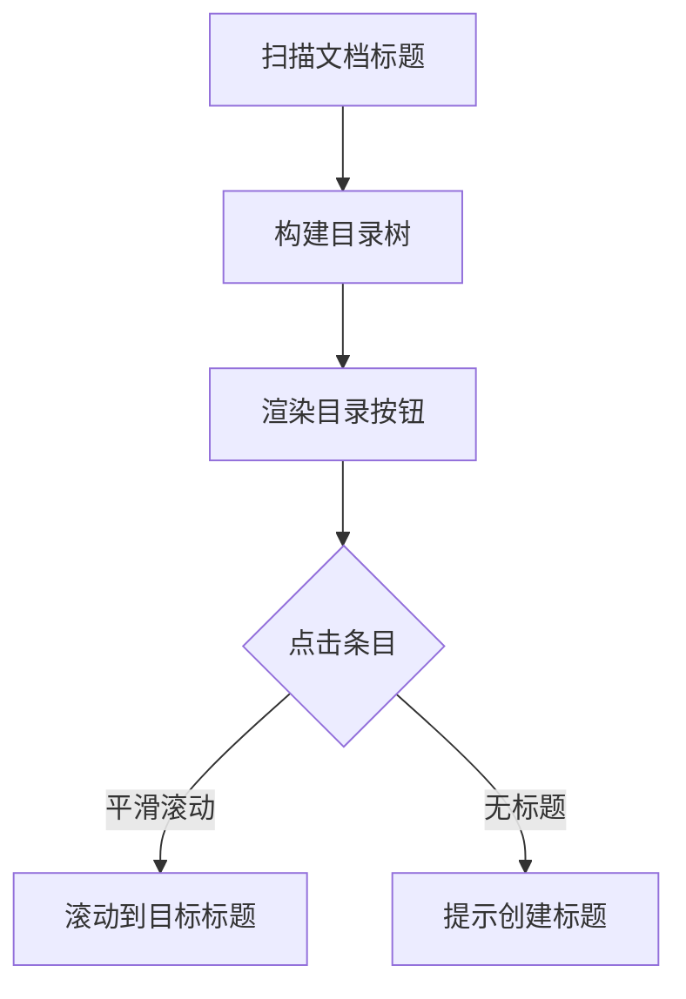
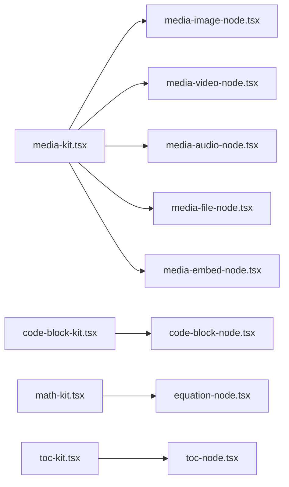

# 内容增强插件

<cite>
**本文引用的文件**
- [src/components/editor/plugins/media-kit.tsx](file://src/components/editor/plugins/media-kit.tsx)
- [src/components/editor/plugins/media-base-kit.tsx](file://src/components/editor/plugins/media-base-kit.tsx)
- [src/components/ui/media-image-node.tsx](file://src/components/ui/media-image-node.tsx)
- [src/components/ui/media-video-node.tsx](file://src/components/ui/media-video-node.tsx)
- [src/components/ui/media-audio-node.tsx](file://src/components/ui/media-audio-node.tsx)
- [src/components/ui/media-embed-node.tsx](file://src/components/ui/media-embed-node.tsx)
- [src/components/ui/media-file-node.tsx](file://src/components/ui/media-file-node.tsx)
- [src/components/ui/media-placeholder-node.tsx](file://src/components/ui/media-placeholder-node.tsx)
- [src/components/ui/media-preview-dialog.tsx](file://src/components/ui/media-preview-dialog.tsx)
- [src/components/ui/media-upload-toast.tsx](file://src/components/ui/media-upload-toast.tsx)
- [src/components/editor/plugins/code-block-kit.tsx](file://src/components/editor/plugins/code-block-kit.tsx)
- [src/components/editor/plugins/code-block-base-kit.tsx](file://src/components/editor/plugins/code-block-base-kit.tsx)
- [src/components/ui/code-block-node.tsx](file://src/components/ui/code-block-node.tsx)
- [src/components/editor/plugins/math-kit.tsx](file://src/components/editor/plugins/math-kit.tsx)
- [src/components/editor/plugins/math-base-kit.tsx](file://src/components/editor/plugins/math-base-kit.tsx)
- [src/components/ui/equation-node.tsx](file://src/components/ui/equation-node.tsx)
- [src/components/editor/plugins/emoji-kit.tsx](file://src/components/editor/plugins/emoji-kit.tsx)
- [src/components/editor/plugins/toc-kit.tsx](file://src/components/editor/plugins/toc-kit.tsx)
- [src/components/editor/plugins/toc-base-kit.tsx](file://src/components/editor/plugins/toc-base-kit.tsx)
- [src/components/ui/toc-node.tsx](file://src/components/ui/toc-node.tsx)
</cite>

## 目录
1. [简介](#简介)
2. [项目结构](#项目结构)
3. [核心组件](#核心组件)
4. [架构总览](#架构总览)
5. [详细组件分析](#详细组件分析)
6. [依赖关系分析](#依赖关系分析)
7. [性能考量](#性能考量)
8. [故障排查指南](#故障排查指南)
9. [结论](#结论)
10. [附录](#附录)

## 简介
本文件系统性梳理内容增强插件体系，覆盖媒体插件（media-kit）、代码块插件（code-block-kit）、数学公式插件（math-kit）、表情符号插件（emoji-kit）与目录插件（toc-kit）。文档重点说明各插件的功能边界、配置项、文件上传与云存储集成思路、插件间协作与冲突规避策略，并给出安全与性能优化建议。

## 项目结构
- 插件层：位于编辑器插件目录，负责注册 Plate 插件与默认行为配置。
- UI 层：位于组件 UI 目录，负责具体节点渲染、交互与状态管理。
- 基础插件层：提供静态渲染版本的基础实现，便于在只读或静态场景使用。

**图表来源**
- [src/components/editor/plugins/media-kit.tsx](file://src/components/editor/plugins/media-kit.tsx)
- [src/components/editor/plugins/code-block-kit.tsx](file://src/components/editor/plugins/code-block-kit.tsx)
- [src/components/editor/plugins/math-kit.tsx](file://src/components/editor/plugins/math-kit.tsx)
- [src/components/editor/plugins/toc-kit.tsx](file://src/components/editor/plugins/toc-kit.tsx)
- [src/components/ui/media-image-node.tsx](file://src/components/ui/media-image-node.tsx)
- [src/components/ui/media-video-node.tsx](file://src/components/ui/media-video-node.tsx)
- [src/components/ui/media-audio-node.tsx](file://src/components/ui/media-audio-node.tsx)
- [src/components/ui/media-embed-node.tsx](file://src/components/ui/media-embed-node.tsx)
- [src/components/ui/media-file-node.tsx](file://src/components/ui/media-file-node.tsx)
- [src/components/ui/media-placeholder-node.tsx](file://src/components/ui/media-placeholder-node.tsx)
- [src/components/ui/code-block-node.tsx](file://src/components/ui/code-block-node.tsx)
- [src/components/ui/equation-node.tsx](file://src/components/ui/equation-node.tsx)
- [src/components/ui/toc-node.tsx](file://src/components/ui/toc-node.tsx)

**章节来源**
- [src/components/editor/plugins/media-kit.tsx](file://src/components/editor/plugins/media-kit.tsx)
- [src/components/editor/plugins/code-block-kit.tsx](file://src/components/editor/plugins/code-block-kit.tsx)
- [src/components/editor/plugins/math-kit.tsx](file://src/components/editor/plugins/math-kit.tsx)
- [src/components/editor/plugins/emoji-kit.tsx](file://src/components/editor/plugins/emoji-kit.tsx)
- [src/components/editor/plugins/toc-kit.tsx](file://src/components/editor/plugins/toc-kit.tsx)

## 核心组件
- 媒体插件（media-kit）
  - 支持图片、视频、音频、文件与嵌入媒体的插入与展示；提供占位符上传配置与标题（caption）支持。
  - 关键配置：禁用直接上传插入、上传限制（数量、大小、类型）、占位符渲染与预览对话框。
- 代码块插件（code-block-kit）
  - 提供代码块、代码行与语法高亮的组合；支持语言选择、格式化、复制与全屏预览。
- 数学公式插件（math-kit）
  - 提供行内与块级公式输入与渲染；基于 KaTeX 渲染，支持弹出式输入面板。
- 表情符号插件（emoji-kit）
  - 基于 emoji-mart 数据源，提供表情选择与输入组件。
- 目录插件（toc-kit）
  - 自动生成文档标题层级目录，支持平滑滚动导航与层级缩进样式。

**章节来源**
- [src/components/editor/plugins/media-kit.tsx](file://src/components/editor/plugins/media-kit.tsx)
- [src/components/editor/plugins/code-block-kit.tsx](file://src/components/editor/plugins/code-block-kit.tsx)
- [src/components/editor/plugins/math-kit.tsx](file://src/components/editor/plugins/math-kit.tsx)
- [src/components/editor/plugins/emoji-kit.tsx](file://src/components/editor/plugins/emoji-kit.tsx)
- [src/components/editor/plugins/toc-kit.tsx](file://src/components/editor/plugins/toc-kit.tsx)

## 架构总览
以下图示展示插件层如何通过 configure/withComponent 将 UI 组件注入到 Plate 的节点渲染流程中，并说明媒体插件的上传与占位符机制。

**图表来源**
- [src/components/editor/plugins/media-kit.tsx](file://src/components/editor/plugins/media-kit.tsx)
- [src/components/ui/media-image-node.tsx](file://src/components/ui/media-image-node.tsx)
- [src/components/ui/media-video-node.tsx](file://src/components/ui/media-video-node.tsx)
- [src/components/ui/media-audio-node.tsx](file://src/components/ui/media-audio-node.tsx)
- [src/components/ui/media-embed-node.tsx](file://src/components/ui/media-embed-node.tsx)
- [src/components/ui/media-file-node.tsx](file://src/components/ui/media-file-node.tsx)
- [src/components/ui/media-preview-dialog.tsx](file://src/components/ui/media-preview-dialog.tsx)
- [src/components/ui/media-upload-toast.tsx](file://src/components/ui/media-upload-toast.tsx)

## 详细组件分析

### 媒体插件（media-kit）
- 功能要点
  - 图片：禁用直接上传插入，使用预览对话框与可调整尺寸的显示组件；支持拖拽与对齐。
  - 视频：支持嵌入（YouTube、Bilibili 等）与本地上传播放；提供可调整尺寸与标题。
  - 音频：本地上传播放控件与标题。
  - 文件：通用文件节点与标题。
  - 占位符上传：统一配置上传类型、数量、大小与媒体类型；上传后以 Toast 提示；支持预览对话框。
  - 标题（Caption）：对图片、视频、音频、文件与嵌入媒体开放。
- 关键配置
  - 上传限制：图片、视频、音频、PDF、文本等分别设置最大数量、大小与媒体类型。
  - 上传触发：占位符渲染后触发上传流程；上传成功后替换为真实媒体节点。
  - 预览与提示：预览对话框用于确认插入；上传 Toast 用于反馈进度与结果。
- 与云存储集成思路
  - 在占位符上传配置处接入文件上传接口，返回可访问的资源地址后替换节点。
  - 对嵌入链接，解析平台 URL 并生成对应嵌入组件。
- 安全与性能
  - 严格限制上传大小与类型，避免大文件与恶意文件。
  - 视频/图片懒加载与尺寸控制，减少首屏压力。
  - 使用 CDN 加速静态资源访问。

**图表来源**
- [src/components/editor/plugins/media-kit.tsx](file://src/components/editor/plugins/media-kit.tsx)
- [src/components/ui/media-upload-toast.tsx](file://src/components/ui/media-upload-toast.tsx)
- [src/components/ui/media-preview-dialog.tsx](file://src/components/ui/media-preview-dialog.tsx)

**章节来源**
- [src/components/editor/plugins/media-kit.tsx](file://src/components/editor/plugins/media-kit.tsx)
- [src/components/ui/media-image-node.tsx](file://src/components/ui/media-image-node.tsx)
- [src/components/ui/media-video-node.tsx](file://src/components/ui/media-video-node.tsx)
- [src/components/ui/media-audio-node.tsx](file://src/components/ui/media-audio-node.tsx)
- [src/components/ui/media-file-node.tsx](file://src/components/ui/media-file-node.tsx)
- [src/components/ui/media-embed-node.tsx](file://src/components/ui/media-embed-node.tsx)

### 代码块插件（code-block-kit）
- 功能要点
  - 代码块：折叠/展开、全屏预览、语言选择、格式化与复制。
  - 代码行：逐行渲染。
  - 语法高亮：基于 lowlight 与多种语言列表。
- 交互细节
  - 语言选择：搜索与过滤语言列表，选中后更新节点语言属性。
  - 复制：一键复制完整代码内容。
  - 全屏：双击退出，支持自动换行与自适应宽度。
- 性能建议
  - 大段代码块启用折叠与全屏模式，避免一次性渲染过多节点。
  - 仅在需要时进行语法高亮，避免不必要的计算。

**图表来源**
- [src/components/editor/plugins/code-block-kit.tsx](file://src/components/editor/plugins/code-block-kit.tsx)
- [src/components/ui/code-block-node.tsx](file://src/components/ui/code-block-node.tsx)

**章节来源**
- [src/components/editor/plugins/code-block-kit.tsx](file://src/components/editor/plugins/code-block-kit.tsx)
- [src/components/ui/code-block-node.tsx](file://src/components/ui/code-block-node.tsx)

### 数学公式插件（math-kit）
- 功能要点
  - 行内与块级公式：分别提供输入与渲染组件。
  - 输入面板：弹出式输入框，支持占位符与完成按钮。
  - 渲染：基于 KaTeX，支持宏与错误颜色等配置。
- 交互细节
  - 选中公式时弹出输入面板；行内公式在光标选中时自动打开。
  - 输入完成后关闭面板并恢复焦点或块级选择。
- 性能建议
  - 公式渲染按需进行，避免在大量公式场景下重复重排。
  - 对复杂表达式采用延迟渲染策略。

**图表来源**
- [src/components/editor/plugins/math-kit.tsx](file://src/components/editor/plugins/math-kit.tsx)
- [src/components/ui/equation-node.tsx](file://src/components/ui/equation-node.tsx)

**章节来源**
- [src/components/editor/plugins/math-kit.tsx](file://src/components/editor/plugins/math-kit.tsx)
- [src/components/ui/equation-node.tsx](file://src/components/ui/equation-node.tsx)

### 表情符号插件（emoji-kit）
- 功能要点
  - 基于 emoji-mart 数据源，提供表情选择与输入组件。
  - 与 Plate 的 Emoji 插件结合，实现输入与渲染。
- 集成方式
  - 插件配置中注入数据源；输入组件负责弹出选择面板与插入。

**章节来源**
- [src/components/editor/plugins/emoji-kit.tsx](file://src/components/editor/plugins/emoji-kit.tsx)

### 目录插件（toc-kit）
- 功能要点
  - 自动扫描文档中的标题层级，生成目录列表。
  - 点击条目触发平滑滚动至对应标题位置。
  - 根据标题深度应用不同左侧缩进样式。
- 配置
  - 顶部偏移量（topOffset）用于滚动定位时避开固定头部。

**图表来源**
- [src/components/editor/plugins/toc-kit.tsx](file://src/components/editor/plugins/toc-kit.tsx)
- [src/components/ui/toc-node.tsx](file://src/components/ui/toc-node.tsx)

**章节来源**
- [src/components/editor/plugins/toc-kit.tsx](file://src/components/editor/plugins/toc-kit.tsx)
- [src/components/ui/toc-node.tsx](file://src/components/ui/toc-node.tsx)

## 依赖关系分析
- 插件层与 UI 层解耦：插件层仅负责注册与配置，UI 层负责渲染与交互。
- 媒体插件依赖第三方媒体解析与播放组件（如 YouTube 嵌入与播放器），注意跨域与隐私合规。
- 数学公式依赖 KaTeX，注意渲染性能与错误处理。
- 代码块依赖 lowlight 与语言列表，注意打包体积与按需加载。

**图表来源**
- [src/components/editor/plugins/media-kit.tsx](file://src/components/editor/plugins/media-kit.tsx)
- [src/components/editor/plugins/code-block-kit.tsx](file://src/components/editor/plugins/code-block-kit.tsx)
- [src/components/editor/plugins/math-kit.tsx](file://src/components/editor/plugins/math-kit.tsx)
- [src/components/editor/plugins/toc-kit.tsx](file://src/components/editor/plugins/toc-kit.tsx)
- [src/components/ui/media-image-node.tsx](file://src/components/ui/media-image-node.tsx)
- [src/components/ui/media-video-node.tsx](file://src/components/ui/media-video-node.tsx)
- [src/components/ui/media-audio-node.tsx](file://src/components/ui/media-audio-node.tsx)
- [src/components/ui/media-file-node.tsx](file://src/components/ui/media-file-node.tsx)
- [src/components/ui/media-embed-node.tsx](file://src/components/ui/media-embed-node.tsx)
- [src/components/ui/code-block-node.tsx](file://src/components/ui/code-block-node.tsx)
- [src/components/ui/equation-node.tsx](file://src/components/ui/equation-node.tsx)
- [src/components/ui/toc-node.tsx](file://src/components/ui/toc-node.tsx)

## 性能考量
- 媒体
  - 图片与视频懒加载，限制最大宽高与缓存策略。
  - 视频上传采用分片或流式传输，避免阻塞主线程。
- 代码块
  - 仅在可见区域渲染与高亮，长代码块默认折叠。
  - 语言列表搜索使用防抖与虚拟滚动。
- 数学公式
  - 公式渲染异步执行，错误时降级显示原始 TeX。
- 目录
  - 标题扫描与滚动事件节流，避免频繁重排。
- 通用
  - 使用 React.memo 与 useMemo 缓存昂贵计算。
  - 按需加载第三方库，减少初始包体。

## 故障排查指南
- 媒体上传失败
  - 检查上传限制（数量/大小/类型）是否满足要求。
  - 确认上传回调已正确替换占位符节点。
  - 查看上传 Toast 是否报错。
- 媒体无法播放
  - 确认资源地址可访问且跨域允许。
  - 检查嵌入平台（YouTube/Bilibili）的链接有效性。
- 代码块高亮异常
  - 确认语言值在支持列表中，必要时回退到 plaintext。
  - 检查低亮初始化与打包是否完整。
- 数学公式不显示
  - 检查 KaTeX 渲染选项与错误颜色配置。
  - 确认输入面板已正确打开并写入 texExpression。
- 目录为空
  - 确保文档中存在标题节点，检查 topOffset 设置是否合理。

**章节来源**
- [src/components/editor/plugins/media-kit.tsx](file://src/components/editor/plugins/media-kit.tsx)
- [src/components/ui/media-upload-toast.tsx](file://src/components/ui/media-upload-toast.tsx)
- [src/components/ui/code-block-node.tsx](file://src/components/ui/code-block-node.tsx)
- [src/components/ui/equation-node.tsx](file://src/components/ui/equation-node.tsx)
- [src/components/ui/toc-node.tsx](file://src/components/ui/toc-node.tsx)

## 结论
本插件体系通过清晰的插件层与 UI 层分离，实现了媒体、代码、公式、表情与目录等丰富的内容增强能力。配合严格的上传限制、合理的渲染策略与交互设计，可在保证体验的同时兼顾性能与安全。建议在生产环境中进一步完善上传鉴权、资源压缩与缓存策略，并持续监控第三方依赖的更新与兼容性。

## 附录
- 基础插件（静态渲染）
  - 媒体基础插件：提供静态图片、视频、音频、文件与嵌入媒体的基础渲染。
  - 代码块基础插件：提供静态代码块、代码行与语法叶的渲染。
  - 数学公式基础插件：提供静态公式与行内公式的渲染。
  - 目录基础插件：提供静态目录节点渲染。
- 插件协作与冲突规避
  - 各插件独立注册，互不干扰；若出现冲突，优先检查节点类型与渲染组件映射。
  - 建议在统一编辑器初始化处集中注册，避免重复或遗漏。

**章节来源**
- [src/components/editor/plugins/media-base-kit.tsx](file://src/components/editor/plugins/media-base-kit.tsx)
- [src/components/editor/plugins/code-block-base-kit.tsx](file://src/components/editor/plugins/code-block-base-kit.tsx)
- [src/components/editor/plugins/math-base-kit.tsx](file://src/components/editor/plugins/math-base-kit.tsx)
- [src/components/editor/plugins/toc-base-kit.tsx](file://src/components/editor/plugins/toc-base-kit.tsx)