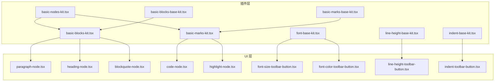
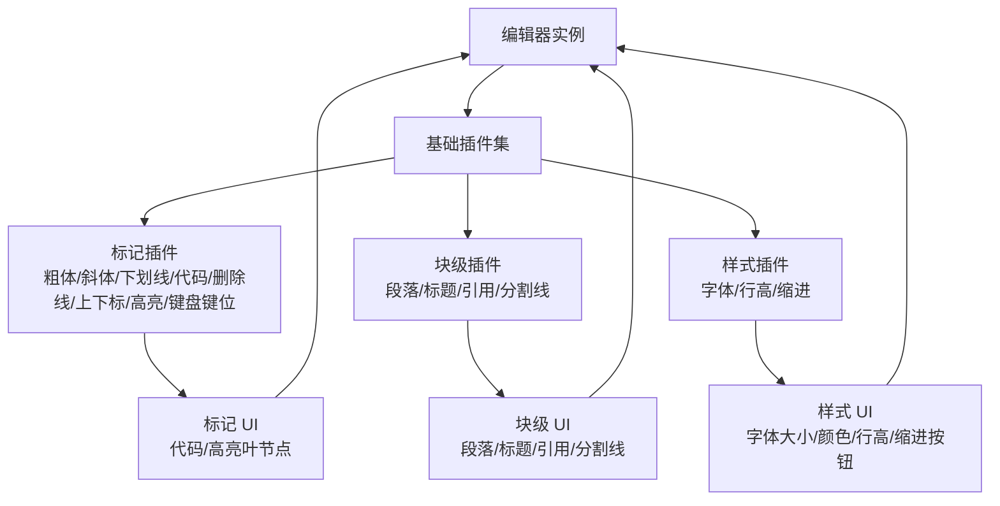
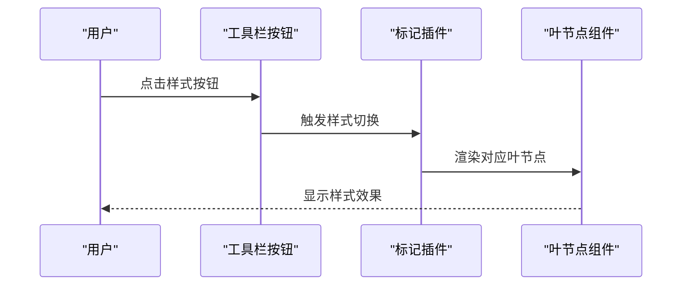
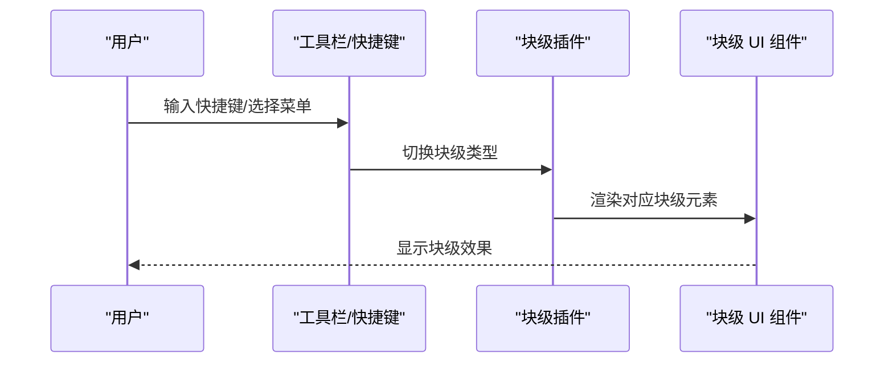
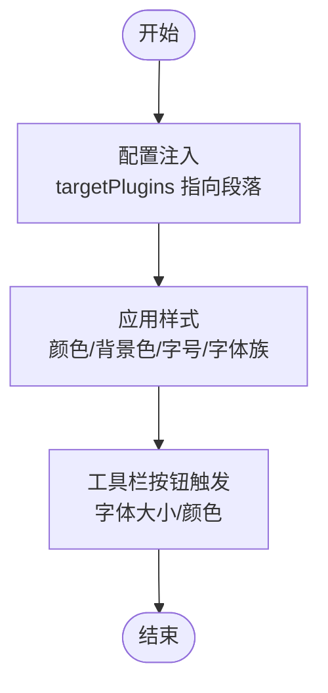
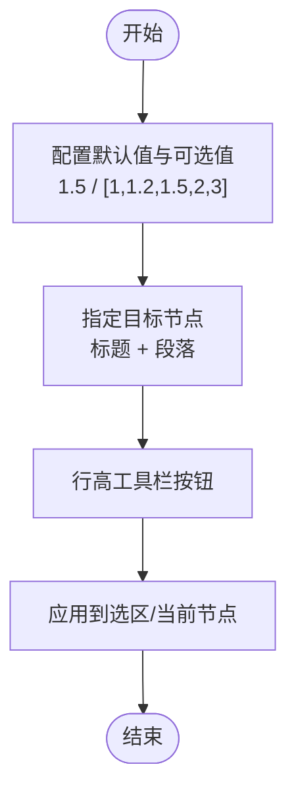
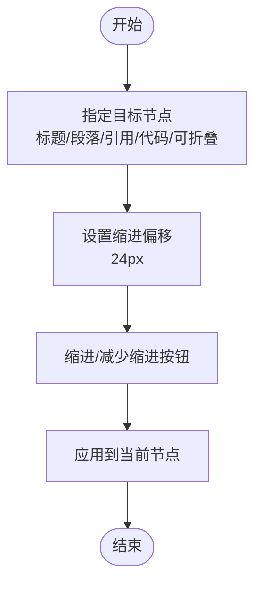
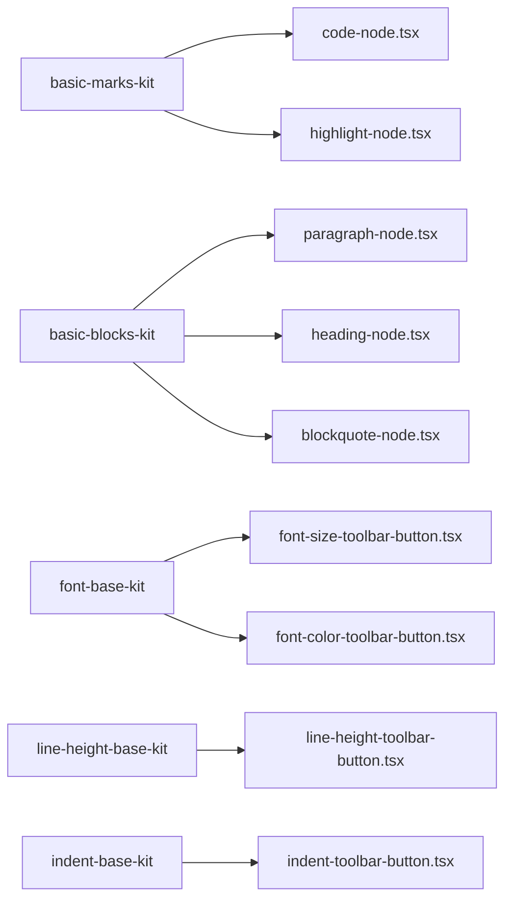

# 基础插件集合

<cite>
**本文档引用的文件**
- [basic-marks-kit.tsx](file://src/components/editor/plugins/basic-marks-kit.tsx)
- [basic-blocks-kit.tsx](file://src/components/editor/plugins/basic-blocks-kit.tsx)
- [basic-nodes-kit.tsx](file://src/components/editor/plugins/basic-nodes-kit.tsx)
- [font-base-kit.tsx](file://src/components/editor/plugins/font-base-kit.tsx)
- [line-height-base-kit.tsx](file://src/components/editor/plugins/line-height-base-kit.tsx)
- [indent-base-kit.tsx](file://src/components/editor/plugins/indent-base-kit.tsx)
- [basic-marks-base-kit.tsx](file://src/components/editor/plugins/basic-marks-base-kit.tsx)
- [basic-blocks-base-kit.tsx](file://src/components/editor/plugins/basic-blocks-base-kit.tsx)
- [paragraph-node.tsx](file://src/components/ui/paragraph-node.tsx)
- [heading-node.tsx](file://src/components/ui/heading-node.tsx)
- [blockquote-node.tsx](file://src/components/ui/blockquote-node.tsx)
- [code-node.tsx](file://src/components/ui/code-node.tsx)
- [highlight-node.tsx](file://src/components/ui/highlight-node.tsx)
- [font-size-toolbar-button.tsx](file://src/components/ui/font-size-toolbar-button.tsx)
- [font-color-toolbar-button.tsx](file://src/components/ui/font-color-toolbar-button.tsx)
- [line-height-toolbar-button.tsx](file://src/components/ui/line-height-toolbar-button.tsx)
- [indent-toolbar-button.tsx](file://src/components/ui/indent-toolbar-button.tsx)
</cite>

## 目录
1. [简介](#简介)
2. [项目结构](#项目结构)
3. [核心组件](#核心组件)
4. [架构总览](#架构总览)
5. [详细组件分析](#详细组件分析)
6. [依赖关系分析](#依赖关系分析)
7. [性能考虑](#性能考虑)
8. [故障排查指南](#故障排查指南)
9. [结论](#结论)
10. [附录](#附录)

## 简介
本文件系统性地文档化基础插件集合，覆盖以下方面：
- 基础标记插件（basic-marks-kit）：粗体、斜体、下划线、代码、删除线、上/下标、高亮与键盘键位等文本样式。
- 基础块级元素插件（basic-blocks-kit）：段落、标题（H1–H6）、引用块、水平分割线等块级元素。
- 基础节点插件（basic-nodes-kit）：组合块级与标记插件，形成统一的基础编辑能力入口。
- 字体基础插件（font-base-kit）：字体大小、颜色、背景色、字体族的样式管理。
- 行高基础插件（line-height-base-kit）：行高默认值与可选范围的配置。
- 缩进基础插件（indent-base-kit）：针对多种节点类型的缩进层级控制。

同时提供各插件的配置要点、使用示例与扩展建议，帮助开发者快速集成与定制。

## 项目结构
基础插件位于编辑器插件目录中，分别以“kit”形式组织，便于按功能域组合使用；配套的 UI 组件负责渲染节点与工具栏按钮。

图表来源
- [basic-marks-kit.tsx:1-42](file://src/components/editor/plugins/basic-marks-kit.tsx#L1-L42)
- [basic-blocks-kit.tsx:1-89](file://src/components/editor/plugins/basic-blocks-kit.tsx#L1-L89)
- [basic-nodes-kit.tsx:1-7](file://src/components/editor/plugins/basic-nodes-kit.tsx#L1-L7)
- [font-base-kit.tsx:1-20](file://src/components/editor/plugins/font-base-kit.tsx#L1-L20)
- [line-height-base-kit.tsx:1-15](file://src/components/editor/plugins/line-height-base-kit.tsx#L1-L15)
- [indent-base-kit.tsx:1-20](file://src/components/editor/plugins/indent-base-kit.tsx#L1-L20)
- [basic-marks-base-kit.tsx:1-28](file://src/components/editor/plugins/basic-marks-base-kit.tsx#L1-L28)
- [basic-blocks-base-kit.tsx:1-36](file://src/components/editor/plugins/basic-blocks-base-kit.tsx#L1-L36)
- [paragraph-node.tsx:1-15](file://src/components/ui/paragraph-node.tsx#L1-L15)
- [heading-node.tsx:1-59](file://src/components/ui/heading-node.tsx#L1-L59)
- [blockquote-node.tsx:1-14](file://src/components/ui/blockquote-node.tsx#L1-L14)
- [code-node.tsx:1-17](file://src/components/ui/code-node.tsx#L1-L17)
- [highlight-node.tsx:1-13](file://src/components/ui/highlight-node.tsx#L1-L13)
- [font-size-toolbar-button.tsx:1-153](file://src/components/ui/font-size-toolbar-button.tsx#L1-L153)
- [font-color-toolbar-button.tsx:1-831](file://src/components/ui/font-color-toolbar-button.tsx#L1-L831)
- [line-height-toolbar-button.tsx:1-70](file://src/components/ui/line-height-toolbar-button.tsx#L1-L70)
- [indent-toolbar-button.tsx:1-32](file://src/components/ui/indent-toolbar-button.tsx#L1-L32)

章节来源
- [basic-marks-kit.tsx:1-42](file://src/components/editor/plugins/basic-marks-kit.tsx#L1-L42)
- [basic-blocks-kit.tsx:1-89](file://src/components/editor/plugins/basic-blocks-kit.tsx#L1-L89)
- [basic-nodes-kit.tsx:1-7](file://src/components/editor/plugins/basic-nodes-kit.tsx#L1-L7)
- [font-base-kit.tsx:1-20](file://src/components/editor/plugins/font-base-kit.tsx#L1-L20)
- [line-height-base-kit.tsx:1-15](file://src/components/editor/plugins/line-height-base-kit.tsx#L1-L15)
- [indent-base-kit.tsx:1-20](file://src/components/editor/plugins/indent-base-kit.tsx#L1-L20)
- [basic-marks-base-kit.tsx:1-28](file://src/components/editor/plugins/basic-marks-base-kit.tsx#L1-L28)
- [basic-blocks-base-kit.tsx:1-36](file://src/components/editor/plugins/basic-blocks-base-kit.tsx#L1-L36)

## 核心组件
- 基础标记插件（basic-marks-kit）
  - 能力：粗体、斜体、下划线、代码、删除线、上/下标、高亮、键盘键位。
  - 配置：为部分插件设置快捷键与自定义渲染组件（如代码与高亮叶节点）。
  - 使用：在编辑器初始化时注入该数组，即可启用对应文本样式。
  - 扩展：新增叶节点样式时，参考代码与高亮叶节点的封装方式，提供自定义组件并通过 configure/withComponent 注入。

- 基础块级元素插件（basic-blocks-kit）
  - 能力：段落、标题（H1–H6）、引用块、水平分割线。
  - 配置：为标题与引用块设置快捷键与断行规则；为段落设置默认样式类名。
  - 使用：注入到编辑器后，支持通过快捷键或菜单切换至相应块级类型。
  - 扩展：新增块级类型时，提供对应的 UI 元素组件，并在 configure 中绑定组件与规则。

- 基础节点插件（basic-nodes-kit）
  - 能力：聚合块级与标记插件，形成统一的基础节点能力入口。
  - 使用：直接作为编辑器 kit 导入，避免重复声明。

- 字体基础插件（font-base-kit）
  - 能力：字体大小、颜色、背景色、字体族。
  - 配置：通过 inject 将样式注入到指定目标插件（如段落），并统一配置。
  - 使用：结合工具栏按钮（字体大小/颜色）进行交互式修改。
  - 扩展：可调整注入目标与默认值，以适配不同主题或内容类型。

- 行高基础插件（line-height-base-kit）
  - 能力：设置行高默认值与可用取值范围。
  - 配置：通过 inject 指定目标节点类型（标题与段落），并设置默认与有效值。
  - 使用：通过行高工具栏按钮选择行高，或在插入新节点时应用默认行高。
  - 扩展：根据排版需求调整默认值与可选范围。

- 缩进基础插件（indent-base-kit）
  - 能力：对标题、段落、引用块、代码块、可折叠容器等节点进行缩进控制。
  - 配置：通过 inject 指定目标节点类型，设置缩进偏移量（像素）。
  - 使用：通过缩进/减少缩进工具栏按钮进行层级调整。
  - 扩展：根据内容结构需要，增减目标节点类型或调整偏移量。

章节来源
- [basic-marks-kit.tsx:19-41](file://src/components/editor/plugins/basic-marks-kit.tsx#L19-L41)
- [basic-blocks-kit.tsx:27-88](file://src/components/editor/plugins/basic-blocks-kit.tsx#L27-L88)
- [basic-nodes-kit.tsx:3-6](file://src/components/editor/plugins/basic-nodes-kit.tsx#L3-L6)
- [font-base-kit.tsx:10-19](file://src/components/editor/plugins/font-base-kit.tsx#L10-L19)
- [line-height-base-kit.tsx:4-14](file://src/components/editor/plugins/line-height-base-kit.tsx#L4-L14)
- [indent-base-kit.tsx:4-19](file://src/components/editor/plugins/indent-base-kit.tsx#L4-L19)

## 架构总览
基础插件通过“插件层 + UI 层”的分层设计实现：
- 插件层：定义节点类型、行为与快捷键，负责数据模型与操作逻辑。
- UI 层：提供渲染组件与工具栏按钮，负责用户交互与视觉呈现。
- 组合层：通过 kit 文件聚合插件，形成可直接使用的编辑器能力包。

图表来源
- [basic-marks-kit.tsx:1-42](file://src/components/editor/plugins/basic-marks-kit.tsx#L1-L42)
- [basic-blocks-kit.tsx:1-89](file://src/components/editor/plugins/basic-blocks-kit.tsx#L1-L89)
- [font-base-kit.tsx:1-20](file://src/components/editor/plugins/font-base-kit.tsx#L1-L20)
- [line-height-base-kit.tsx:1-15](file://src/components/editor/plugins/line-height-base-kit.tsx#L1-L15)
- [indent-base-kit.tsx:1-20](file://src/components/editor/plugins/indent-base-kit.tsx#L1-L20)
- [code-node.tsx:1-17](file://src/components/ui/code-node.tsx#L1-L17)
- [highlight-node.tsx:1-13](file://src/components/ui/highlight-node.tsx#L1-L13)
- [paragraph-node.tsx:1-15](file://src/components/ui/paragraph-node.tsx#L1-L15)
- [heading-node.tsx:1-59](file://src/components/ui/heading-node.tsx#L1-L59)
- [blockquote-node.tsx:1-14](file://src/components/ui/blockquote-node.tsx#L1-L14)
- [font-size-toolbar-button.tsx:1-153](file://src/components/ui/font-size-toolbar-button.tsx#L1-L153)
- [font-color-toolbar-button.tsx:1-831](file://src/components/ui/font-color-toolbar-button.tsx#L1-L831)
- [line-height-toolbar-button.tsx:1-70](file://src/components/ui/line-height-toolbar-button.tsx#L1-L70)
- [indent-toolbar-button.tsx:1-32](file://src/components/ui/indent-toolbar-button.tsx#L1-L32)

## 详细组件分析

### 基础标记插件（basic-marks-kit）
- 功能概览
  - 提供常用文本样式：粗体、斜体、下划线、代码、删除线、上/下标、高亮、键盘键位。
  - 为代码与高亮样式提供自定义叶节点组件，确保渲染一致性。
  - 为多个插件配置快捷键，提升输入效率。
- 关键实现点
  - 代码样式：通过 configure 指定自定义组件与快捷键。
  - 高亮样式：通过 configure 指定自定义组件与快捷键。
  - 上/下标与删除线：通过 configure 设置快捷键。
  - 键盘键位：通过 withComponent 绑定静态组件。
- 使用示例
  - 在编辑器初始化时将该数组注入，即可启用对应样式功能。
- 扩展方法
  - 新增叶节点样式时，提供自定义组件并在插件中通过 configure/withComponent 注入。
  - 可根据需要调整快捷键组合，避免与系统或其他插件冲突。

图表来源
- [basic-marks-kit.tsx:19-41](file://src/components/editor/plugins/basic-marks-kit.tsx#L19-L41)
- [code-node.tsx:6-15](file://src/components/ui/code-node.tsx#L6-L15)
- [highlight-node.tsx:6-11](file://src/components/ui/highlight-node.tsx#L6-L11)

章节来源
- [basic-marks-kit.tsx:1-42](file://src/components/editor/plugins/basic-marks-kit.tsx#L1-L42)
- [code-node.tsx:1-17](file://src/components/ui/code-node.tsx#L1-L17)
- [highlight-node.tsx:1-13](file://src/components/ui/highlight-node.tsx#L1-L13)

### 基础块级元素插件（basic-blocks-kit）
- 功能概览
  - 支持段落、标题（H1–H6）、引用块、水平分割线。
  - 为标题与引用块配置快捷键与断行规则，提升输入体验。
  - 为段落提供默认样式类名，保证基础排版一致。
- 关键实现点
  - 标题：通过 configure 绑定 UI 组件与快捷键；设置空内容时重置为段落的规则。
  - 引用块：通过 configure 绑定 UI 组件与快捷键。
  - 水平分割线：通过 withComponent 绑定 UI 组件。
  - 段落：通过 withComponent 绑定 UI 组件。
- 使用示例
  - 在编辑器初始化时注入该数组，即可启用块级元素切换与快捷键。
- 扩展方法
  - 新增块级类型时，提供 UI 元素组件并在 configure 中绑定；可设置断行规则与快捷键。

图表来源
- [basic-blocks-kit.tsx:27-88](file://src/components/editor/plugins/basic-blocks-kit.tsx#L27-L88)
- [paragraph-node.tsx:8-13](file://src/components/ui/paragraph-node.tsx#L8-L13)
- [heading-node.tsx:21-34](file://src/components/ui/heading-node.tsx#L21-L34)
- [blockquote-node.tsx:5-12](file://src/components/ui/blockquote-node.tsx#L5-L12)

章节来源
- [basic-blocks-kit.tsx:1-89](file://src/components/editor/plugins/basic-blocks-kit.tsx#L1-L89)
- [paragraph-node.tsx:1-15](file://src/components/ui/paragraph-node.tsx#L1-L15)
- [heading-node.tsx:1-59](file://src/components/ui/heading-node.tsx#L1-L59)
- [blockquote-node.tsx:1-14](file://src/components/ui/blockquote-node.tsx#L1-L14)

### 基础节点插件（basic-nodes-kit）
- 功能概览
  - 聚合基础块级与标记插件，形成统一的基础节点能力入口。
- 使用示例
  - 直接导入该数组作为编辑器 kit，避免重复声明。

章节来源
- [basic-nodes-kit.tsx:1-7](file://src/components/editor/plugins/basic-nodes-kit.tsx#L1-L7)

### 字体基础插件（font-base-kit）
- 功能概览
  - 管理字体大小、颜色、背景色、字体族。
  - 通过 inject 将样式注入到指定目标插件（如段落），统一配置。
- 关键实现点
  - 注入配置：targetPlugins 指向段落插件，确保样式作用于段落节点。
  - 插件组合：包含颜色、背景色、字号、字体族四个插件。
- 使用示例
  - 结合字体大小与颜色工具栏按钮进行交互式修改。
- 扩展方法
  - 可调整注入目标插件与默认值，以适配不同主题或内容类型。

图表来源
- [font-base-kit.tsx:10-19](file://src/components/editor/plugins/font-base-kit.tsx#L10-L19)
- [font-size-toolbar-button.tsx:45-82](file://src/components/ui/font-size-toolbar-button.tsx#L45-L82)
- [font-color-toolbar-button.tsx:32-95](file://src/components/ui/font-color-toolbar-button.tsx#L32-L95)

章节来源
- [font-base-kit.tsx:1-20](file://src/components/editor/plugins/font-base-kit.tsx#L1-L20)
- [font-size-toolbar-button.tsx:1-153](file://src/components/ui/font-size-toolbar-button.tsx#L1-L153)
- [font-color-toolbar-button.tsx:1-831](file://src/components/ui/font-color-toolbar-button.tsx#L1-L831)

### 行高基础插件（line-height-base-kit）
- 功能概览
  - 设置行高默认值与可用取值范围。
  - 通过 inject 指定目标节点类型（标题与段落）。
- 关键实现点
  - 默认值：1.5。
  - 可选值：1、1.2、1.5、2、3。
  - 目标节点：标题与段落。
- 使用示例
  - 通过行高工具栏按钮选择行高，或在插入新节点时应用默认行高。
- 扩展方法
  - 根据排版需求调整默认值与可选范围。

图表来源
- [line-height-base-kit.tsx:4-14](file://src/components/editor/plugins/line-height-base-kit.tsx#L4-L14)
- [line-height-toolbar-button.tsx:21-68](file://src/components/ui/line-height-toolbar-button.tsx#L21-L68)

章节来源
- [line-height-base-kit.tsx:1-15](file://src/components/editor/plugins/line-height-base-kit.tsx#L1-L15)
- [line-height-toolbar-button.tsx:1-70](file://src/components/ui/line-height-toolbar-button.tsx#L1-L70)

### 缩进基础插件（indent-base-kit）
- 功能概览
  - 对标题、段落、引用块、代码块、可折叠容器等节点进行缩进控制。
- 关键实现点
  - 目标节点：标题、段落、引用块、代码块、可折叠容器。
  - 缩进偏移：24 像素。
- 使用示例
  - 通过缩进/减少缩进工具栏按钮进行层级调整。
- 扩展方法
  - 根据内容结构需要，增减目标节点类型或调整偏移量。

图表来源
- [indent-base-kit.tsx:4-19](file://src/components/editor/plugins/indent-base-kit.tsx#L4-L19)
- [indent-toolbar-button.tsx:9-31](file://src/components/ui/indent-toolbar-button.tsx#L9-L31)

章节来源
- [indent-base-kit.tsx:1-20](file://src/components/editor/plugins/indent-base-kit.tsx#L1-L20)
- [indent-toolbar-button.tsx:1-32](file://src/components/ui/indent-toolbar-button.tsx#L1-L32)

## 依赖关系分析
- 插件与 UI 的耦合
  - 块级与标记插件通过 withComponent/withComponent 方法绑定 UI 组件，实现“行为 + 视觉”的解耦。
- 工具栏与插件的联动
  - 工具栏按钮通过插件 API 获取/设置节点属性，实现交互式样式修改。
- 注入机制
  - 字体与行高插件通过 inject 将样式作用于目标节点，避免硬编码样式。

图表来源
- [basic-marks-kit.tsx:1-42](file://src/components/editor/plugins/basic-marks-kit.tsx#L1-L42)
- [basic-blocks-kit.tsx:1-89](file://src/components/editor/plugins/basic-blocks-kit.tsx#L1-L89)
- [font-base-kit.tsx:1-20](file://src/components/editor/plugins/font-base-kit.tsx#L1-L20)
- [line-height-base-kit.tsx:1-15](file://src/components/editor/plugins/line-height-base-kit.tsx#L1-L15)
- [indent-base-kit.tsx:1-20](file://src/components/editor/plugins/indent-base-kit.tsx#L1-L20)
- [code-node.tsx:1-17](file://src/components/ui/code-node.tsx#L1-L17)
- [highlight-node.tsx:1-13](file://src/components/ui/highlight-node.tsx#L1-L13)
- [paragraph-node.tsx:1-15](file://src/components/ui/paragraph-node.tsx#L1-L15)
- [heading-node.tsx:1-59](file://src/components/ui/heading-node.tsx#L1-L59)
- [blockquote-node.tsx:1-14](file://src/components/ui/blockquote-node.tsx#L1-L14)
- [font-size-toolbar-button.tsx:1-153](file://src/components/ui/font-size-toolbar-button.tsx#L1-L153)
- [font-color-toolbar-button.tsx:1-831](file://src/components/ui/font-color-toolbar-button.tsx#L1-L831)
- [line-height-toolbar-button.tsx:1-70](file://src/components/ui/line-height-toolbar-button.tsx#L1-L70)
- [indent-toolbar-button.tsx:1-32](file://src/components/ui/indent-toolbar-button.tsx#L1-L32)

## 性能考虑
- 组件懒加载：工具栏按钮与 UI 组件采用客户端渲染，避免不必要的服务端开销。
- 注入范围控制：通过 inject 精准限定样式作用范围，减少全局样式计算。
- 快捷键优先：为常用操作配置快捷键，降低工具栏点击成本，提升输入效率。
- 扩展建议：新增插件时尽量复用现有 UI 组件与工具栏按钮模式，减少重复开发与维护成本。

## 故障排查指南
- 快捷键无效
  - 检查插件是否正确注入，确认快捷键配置未被其他插件覆盖。
  - 确认工具栏按钮与插件 API 的绑定关系正常。
- 样式不生效
  - 检查 inject 的 targetPlugins 是否包含目标节点类型。
  - 确认 UI 组件的类名与样式未被外部样式覆盖。
- 行高/缩进异常
  - 检查行高插件的默认值与可选范围配置。
  - 检查缩进插件的目标节点类型与偏移量设置。
- 自定义样式组件未渲染
  - 确认 withComponent/withComponent 的调用顺序与参数正确。
  - 检查组件导出与导入路径是否一致。

章节来源
- [font-base-kit.tsx:10-19](file://src/components/editor/plugins/font-base-kit.tsx#L10-L19)
- [line-height-base-kit.tsx:4-14](file://src/components/editor/plugins/line-height-base-kit.tsx#L4-L14)
- [indent-base-kit.tsx:4-19](file://src/components/editor/plugins/indent-base-kit.tsx#L4-L19)
- [font-size-toolbar-button.tsx:45-82](file://src/components/ui/font-size-toolbar-button.tsx#L45-L82)
- [font-color-toolbar-button.tsx:32-95](file://src/components/ui/font-color-toolbar-button.tsx#L32-L95)
- [line-height-toolbar-button.tsx:21-68](file://src/components/ui/line-height-toolbar-button.tsx#L21-L68)
- [indent-toolbar-button.tsx:9-31](file://src/components/ui/indent-toolbar-button.tsx#L9-L31)

## 结论
基础插件集合通过清晰的分层设计与可配置的注入机制，提供了稳定且易扩展的编辑器基础能力。开发者可基于此快速构建满足业务需求的富文本编辑体验，并通过工具栏按钮与 UI 组件实现直观的交互式编辑。

## 附录
- 常用配置清单
  - 字体基础插件：注入目标（段落）、默认样式（颜色/背景/字号/字体族）。
  - 行高基础插件：默认值（1.5）、可选值（1/1.2/1.5/2/3）、目标节点（标题/段落）。
  - 缩进基础插件：目标节点（标题/段落/引用/代码/可折叠）、偏移量（24px）。
- 使用建议
  - 在编辑器初始化时统一注入基础插件集，避免遗漏关键能力。
  - 为常用操作配置快捷键，提升用户体验。
  - 根据内容类型与主题风格调整默认值与可选范围。