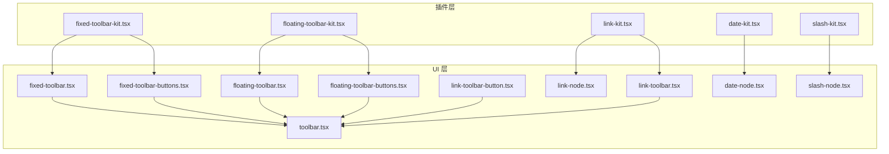
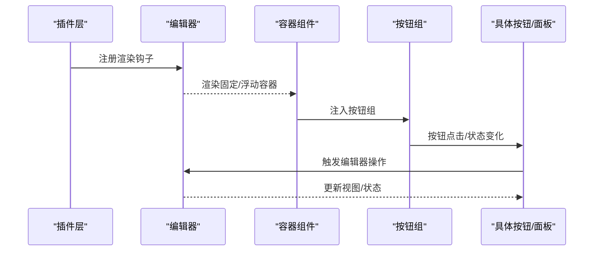
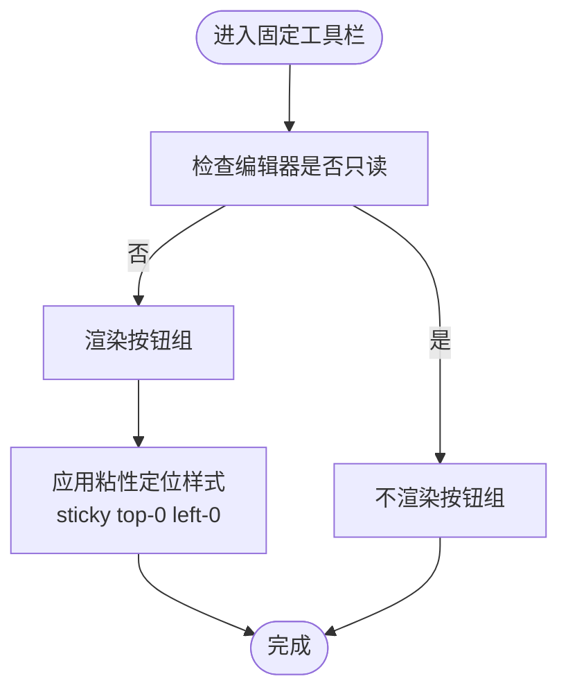
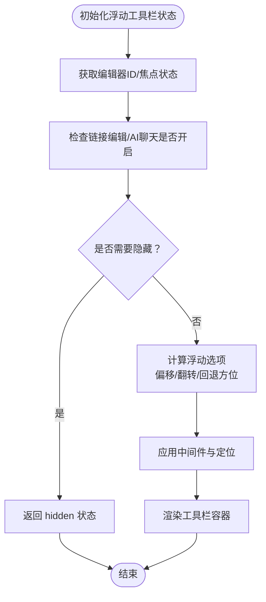
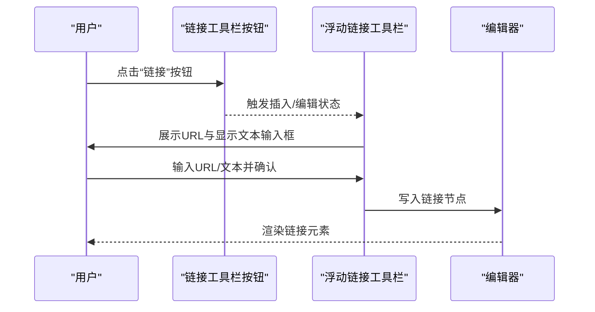
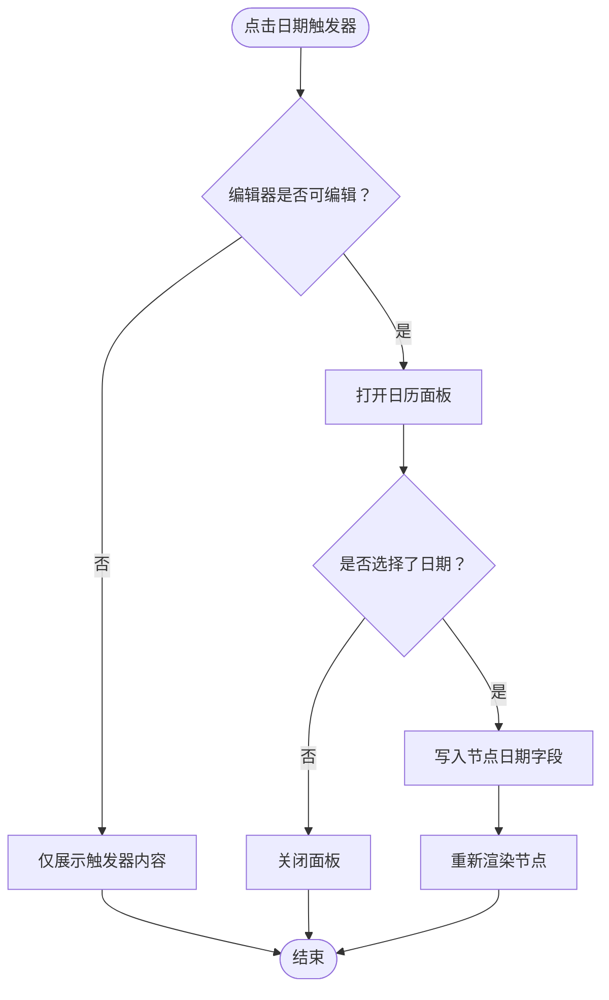
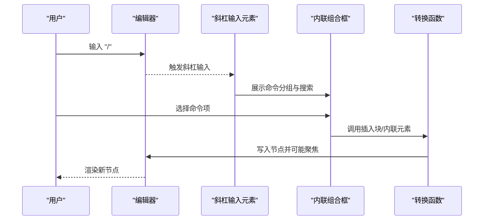
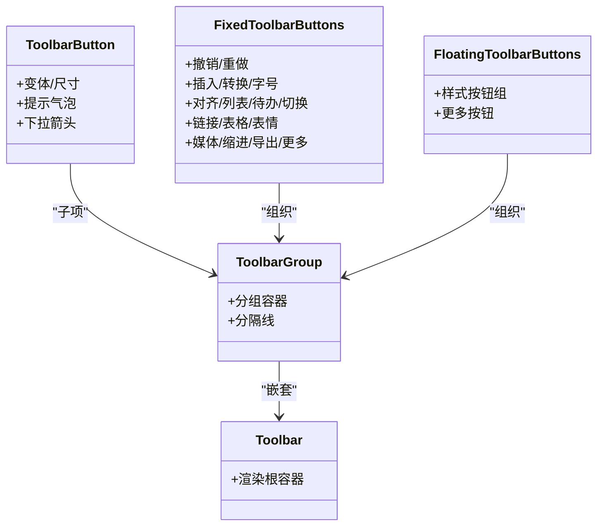
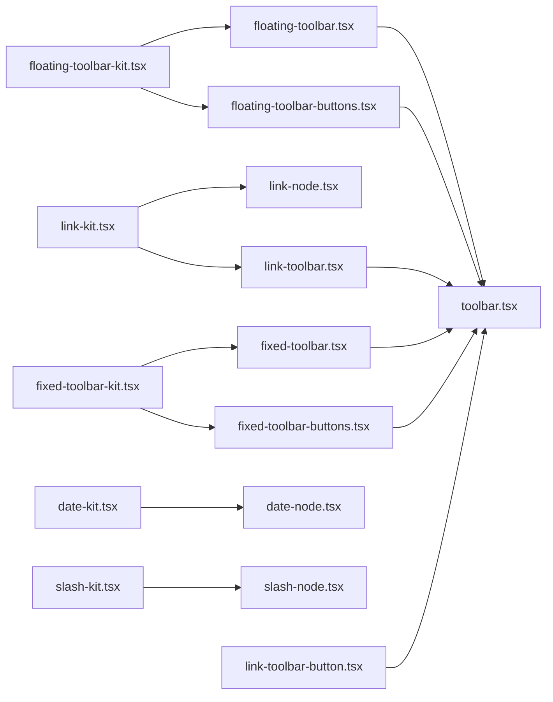

# 工具栏插件

<cite>
**本文引用的文件**
- [src/components/editor/plugins/fixed-toolbar-kit.tsx](file://src/components/editor/plugins/fixed-toolbar-kit.tsx)
- [src/components/editor/plugins/floating-toolbar-kit.tsx](file://src/components/editor/plugins/floating-toolbar-kit.tsx)
- [src/components/editor/plugins/link-kit.tsx](file://src/components/editor/plugins/link-kit.tsx)
- [src/components/editor/plugins/date-kit.tsx](file://src/components/editor/plugins/date-kit.tsx)
- [src/components/editor/plugins/slash-kit.tsx](file://src/components/editor/plugins/slash-kit.tsx)
- [src/components/ui/fixed-toolbar.tsx](file://src/components/ui/fixed-toolbar.tsx)
- [src/components/ui/floating-toolbar.tsx](file://src/components/ui/floating-toolbar.tsx)
- [src/components/ui/link-toolbar.tsx](file://src/components/ui/link-toolbar.tsx)
- [src/components/ui/link-node.tsx](file://src/components/ui/link-node.tsx)
- [src/components/ui/date-node.tsx](file://src/components/ui/date-node.tsx)
- [src/components/ui/slash-node.tsx](file://src/components/ui/slash-node.tsx)
- [src/components/ui/fixed-toolbar-buttons.tsx](file://src/components/ui/fixed-toolbar-buttons.tsx)
- [src/components/ui/floating-toolbar-buttons.tsx](file://src/components/ui/floating-toolbar-buttons.tsx)
- [src/components/ui/link-toolbar-button.tsx](file://src/components/ui/link-toolbar-button.tsx)
- [src/components/ui/toolbar.tsx](file://src/components/ui/toolbar.tsx)
</cite>

## 目录
1. [简介](#简介)
2. [项目结构](#项目结构)
3. [核心组件](#核心组件)
4. [架构总览](#架构总览)
5. [详细组件分析](#详细组件分析)
6. [依赖关系分析](#依赖关系分析)
7. [性能考虑](#性能考虑)
8. [故障排查指南](#故障排查指南)
9. [结论](#结论)
10. [附录：扩展开发最佳实践与示例路径](#附录扩展开发最佳实践与示例路径)

## 简介
本文件系统性梳理编辑器工具栏相关插件与组件，重点覆盖以下能力：
- 固定工具栏插件（fixed-toolbar-kit）的定位与显示逻辑
- 浮动工具栏插件（floating-toolbar-kit）的动态显示与位置计算
- 链接插件（link-kit）的 URL 输入、验证与插入流程
- 日期插件（date-kit）的日期选择器与格式化输出
- 斜杠命令插件（slash-kit）的智能提示与命令执行
- 工具栏按钮的配置、图标定制与响应式设计
- 性能优化策略与内存管理建议
- 工具栏扩展开发的最佳实践与示例代码路径

## 项目结构
工具栏相关代码主要分布在两个层次：
- 插件层：以“kit”形式封装 Plate 插件，负责注册渲染钩子与节点组件
- UI 层：以独立组件形式实现工具栏容器、按钮组、按钮与弹出面板等

图表来源
- [src/components/editor/plugins/fixed-toolbar-kit.tsx:1-20](file://src/components/editor/plugins/fixed-toolbar-kit.tsx#L1-L20)
- [src/components/editor/plugins/floating-toolbar-kit.tsx:1-20](file://src/components/editor/plugins/floating-toolbar-kit.tsx#L1-L20)
- [src/components/editor/plugins/link-kit.tsx:1-16](file://src/components/editor/plugins/link-kit.tsx#L1-L16)
- [src/components/editor/plugins/date-kit.tsx:1-8](file://src/components/editor/plugins/date-kit.tsx#L1-L8)
- [src/components/editor/plugins/slash-kit.tsx:1-19](file://src/components/editor/plugins/slash-kit.tsx#L1-L19)
- [src/components/ui/fixed-toolbar.tsx:1-18](file://src/components/ui/fixed-toolbar.tsx#L1-L18)
- [src/components/ui/floating-toolbar.tsx:1-87](file://src/components/ui/floating-toolbar.tsx#L1-L87)
- [src/components/ui/fixed-toolbar-buttons.tsx:1-105](file://src/components/ui/fixed-toolbar-buttons.tsx#L1-L105)
- [src/components/ui/floating-toolbar-buttons.tsx:1-74](file://src/components/ui/floating-toolbar-buttons.tsx#L1-L74)
- [src/components/ui/link-toolbar-button.tsx:1-24](file://src/components/ui/link-toolbar-button.tsx#L1-L24)
- [src/components/ui/link-toolbar.tsx:1-207](file://src/components/ui/link-toolbar.tsx#L1-L207)
- [src/components/ui/link-node.tsx:1-30](file://src/components/ui/link-node.tsx#L1-L30)
- [src/components/ui/date-node.tsx:1-96](file://src/components/ui/date-node.tsx#L1-L96)
- [src/components/ui/slash-node.tsx:1-238](file://src/components/ui/slash-node.tsx#L1-L238)
- [src/components/ui/toolbar.tsx:1-389](file://src/components/ui/toolbar.tsx#L1-L389)

章节来源
- [src/components/editor/plugins/fixed-toolbar-kit.tsx:1-20](file://src/components/editor/plugins/fixed-toolbar-kit.tsx#L1-L20)
- [src/components/editor/plugins/floating-toolbar-kit.tsx:1-20](file://src/components/editor/plugins/floating-toolbar-kit.tsx#L1-L20)
- [src/components/editor/plugins/link-kit.tsx:1-16](file://src/components/editor/plugins/link-kit.tsx#L1-L16)
- [src/components/editor/plugins/date-kit.tsx:1-8](file://src/components/editor/plugins/date-kit.tsx#L1-L8)
- [src/components/editor/plugins/slash-kit.tsx:1-19](file://src/components/editor/plugins/slash-kit.tsx#L1-L19)

## 核心组件
- 固定工具栏插件：通过 Plate 的渲染钩子在可编辑区域前挂载固定工具栏容器，并注入固定按钮组
- 浮动工具栏插件：通过 Plate 的渲染钩子在可编辑区域后挂载浮动工具栏容器，并注入浮动按钮组
- 链接插件：注册链接节点组件与浮动链接工具栏，支持插入、编辑、打开与移除链接
- 日期插件：注册日期节点组件，提供日历选择器与本地化日期展示
- 斜杠命令插件：注册斜杠输入元素与命令分组，提供智能提示与命令执行

章节来源
- [src/components/editor/plugins/fixed-toolbar-kit.tsx:8-19](file://src/components/editor/plugins/fixed-toolbar-kit.tsx#L8-L19)
- [src/components/editor/plugins/floating-toolbar-kit.tsx:8-19](file://src/components/editor/plugins/floating-toolbar-kit.tsx#L8-L19)
- [src/components/editor/plugins/link-kit.tsx:8-15](file://src/components/editor/plugins/link-kit.tsx#L8-L15)
- [src/components/editor/plugins/date-kit.tsx:7-7](file://src/components/editor/plugins/date-kit.tsx#L7-L7)
- [src/components/editor/plugins/slash-kit.tsx:8-18](file://src/components/editor/plugins/slash-kit.tsx#L8-L18)

## 架构总览
下图展示了从插件到 UI 组件的调用链路与数据流。

图表来源
- [src/components/editor/plugins/fixed-toolbar-kit.tsx:8-19](file://src/components/editor/plugins/fixed-toolbar-kit.tsx#L8-L19)
- [src/components/editor/plugins/floating-toolbar-kit.tsx:8-19](file://src/components/editor/plugins/floating-toolbar-kit.tsx#L8-L19)
- [src/components/ui/fixed-toolbar.tsx:7-16](file://src/components/ui/fixed-toolbar.tsx#L7-L16)
- [src/components/ui/floating-toolbar.tsx:23-85](file://src/components/ui/floating-toolbar.tsx#L23-L85)
- [src/components/ui/fixed-toolbar-buttons.tsx:43-104](file://src/components/ui/fixed-toolbar-buttons.tsx#L43-L104)
- [src/components/ui/floating-toolbar-buttons.tsx:21-73](file://src/components/ui/floating-toolbar-buttons.tsx#L21-L73)

## 详细组件分析

### 固定工具栏插件与定位显示
- 定位：使用“sticky + top-0 + left-0”的容器样式，确保在滚动时保持在视口顶部
- 显示：容器内部嵌入固定按钮组；按钮组根据只读状态决定是否渲染
- 响应式：按钮组采用“隐藏-显示”机制，仅当存在可用按钮时才显示分组与分隔线

图表来源
- [src/components/ui/fixed-toolbar.tsx:7-16](file://src/components/ui/fixed-toolbar.tsx#L7-L16)
- [src/components/ui/fixed-toolbar-buttons.tsx:43-104](file://src/components/ui/fixed-toolbar-buttons.tsx#L43-L104)

章节来源
- [src/components/editor/plugins/fixed-toolbar-kit.tsx:8-19](file://src/components/editor/plugins/fixed-toolbar-kit.tsx#L8-L19)
- [src/components/ui/fixed-toolbar.tsx:7-16](file://src/components/ui/fixed-toolbar.tsx#L7-L16)
- [src/components/ui/fixed-toolbar-buttons.tsx:43-104](file://src/components/ui/fixed-toolbar-buttons.tsx#L43-L104)

### 浮动工具栏插件与动态显示及位置计算
- 动态显示：基于编辑器焦点、链接编辑模式与 AI 聊天面板状态决定是否隐藏
- 位置计算：使用浮动工具库的状态与中间件，设置偏移与翻转策略，支持多回退方位
- 可见性：当 hidden 为真时不渲染，避免无意义的 DOM 占位

图表来源
- [src/components/ui/floating-toolbar.tsx:31-64](file://src/components/ui/floating-toolbar.tsx#L31-L64)
- [src/components/ui/floating-toolbar.tsx:66-85](file://src/components/ui/floating-toolbar.tsx#L66-L85)

章节来源
- [src/components/editor/plugins/floating-toolbar-kit.tsx:8-19](file://src/components/editor/plugins/floating-toolbar-kit.tsx#L8-L19)
- [src/components/ui/floating-toolbar.tsx:23-85](file://src/components/ui/floating-toolbar.tsx#L23-L85)

### 链接插件：URL 输入、验证与插入
- 节点渲染：链接元素使用 a 标签并应用强调样式
- 浮动工具栏：提供 URL 输入框与显示文本输入框；支持编辑/查看两种模式；提供打开链接与移除链接操作
- 位置策略：根据评论/建议激活状态调整初始方位，其余场景默认底部起始
- 验证与插入：通过表单输入属性阻止回车默认行为，交由平台处理插入逻辑

图表来源
- [src/components/ui/link-toolbar-button.tsx:12-23](file://src/components/ui/link-toolbar-button.tsx#L12-L23)
- [src/components/ui/link-toolbar.tsx:40-168](file://src/components/ui/link-toolbar.tsx#L40-L168)
- [src/components/ui/link-node.tsx:10-29](file://src/components/ui/link-node.tsx#L10-L29)

章节来源
- [src/components/editor/plugins/link-kit.tsx:8-15](file://src/components/editor/plugins/link-kit.tsx#L8-L15)
- [src/components/ui/link-toolbar.tsx:40-168](file://src/components/ui/link-toolbar.tsx#L40-L168)
- [src/components/ui/link-node.tsx:10-29](file://src/components/ui/link-node.tsx#L10-L29)

### 日期插件：日期选择器与格式化输出
- 节点渲染：在只读状态下直接展示触发器；在可编辑状态下包裹弹出层
- 日期格式化：支持“今天/昨天/明天”等相对文案，否则使用本地化长日期格式
- 交互流程：选择日期后通过编辑器转换函数更新节点的日期字段

图表来源
- [src/components/ui/date-node.tsx:16-95](file://src/components/ui/date-node.tsx#L16-L95)

章节来源
- [src/components/editor/plugins/date-kit.tsx:7-7](file://src/components/editor/plugins/date-kit.tsx#L7-L7)
- [src/components/ui/date-node.tsx:16-95](file://src/components/ui/date-node.tsx#L16-L95)

### 斜杠命令插件：智能提示与命令执行
- 触发条件：在非代码块上下文中触发斜杠输入
- 命令分组：按“基础块/高级块/内联”组织命令项，支持关键词匹配与图标
- 执行逻辑：根据命令类型调用插入块或内联元素的转换函数，部分命令可选择是否聚焦编辑器

图表来源
- [src/components/editor/plugins/slash-kit.tsx:9-18](file://src/components/editor/plugins/slash-kit.tsx#L9-L18)
- [src/components/ui/slash-node.tsx:196-237](file://src/components/ui/slash-node.tsx#L196-L237)

章节来源
- [src/components/editor/plugins/slash-kit.tsx:8-18](file://src/components/editor/plugins/slash-kit.tsx#L8-L18)
- [src/components/ui/slash-node.tsx:42-194](file://src/components/ui/slash-node.tsx#L42-L194)

### 工具栏按钮的配置、图标定制与响应式设计
- 按钮容器：统一的工具栏容器组件，提供分组、分隔线、提示气泡等通用能力
- 固定按钮组：包含撤销/重做、插入/转换、字号、对齐、列表、表格、媒体、缩进、导出、更多等
- 浮动按钮组：聚焦常用样式（加粗/斜体/下划线/删除线/代码/高亮/公式/链接）
- 图标定制：使用 Lucide 图标库，按钮组件支持传入任意 SVG 作为图标
- 响应式设计：按钮组采用“有按钮才显示”的策略，配合分隔线与增长容器实现自适应布局

图表来源
- [src/components/ui/toolbar.tsx:18-389](file://src/components/ui/toolbar.tsx#L18-L389)
- [src/components/ui/fixed-toolbar-buttons.tsx:43-104](file://src/components/ui/fixed-toolbar-buttons.tsx#L43-L104)
- [src/components/ui/floating-toolbar-buttons.tsx:21-73](file://src/components/ui/floating-toolbar-buttons.tsx#L21-L73)

章节来源
- [src/components/ui/toolbar.tsx:18-389](file://src/components/ui/toolbar.tsx#L18-L389)
- [src/components/ui/fixed-toolbar-buttons.tsx:43-104](file://src/components/ui/fixed-toolbar-buttons.tsx#L43-L104)
- [src/components/ui/floating-toolbar-buttons.tsx:21-73](file://src/components/ui/floating-toolbar-buttons.tsx#L21-L73)

## 依赖关系分析
- 插件层依赖 UI 层组件进行渲染与交互
- UI 层组件依赖 Plate 的状态钩子与转换函数
- 浮动工具栏依赖浮动中间件与编辑器上下文
- 链接工具栏依赖链接插件提供的状态与输入组件

图表来源
- [src/components/editor/plugins/fixed-toolbar-kit.tsx:8-19](file://src/components/editor/plugins/fixed-toolbar-kit.tsx#L8-L19)
- [src/components/editor/plugins/floating-toolbar-kit.tsx:8-19](file://src/components/editor/plugins/floating-toolbar-kit.tsx#L8-L19)
- [src/components/editor/plugins/link-kit.tsx:8-15](file://src/components/editor/plugins/link-kit.tsx#L8-L15)
- [src/components/editor/plugins/date-kit.tsx:7-7](file://src/components/editor/plugins/date-kit.tsx#L7-L7)
- [src/components/editor/plugins/slash-kit.tsx:8-18](file://src/components/editor/plugins/slash-kit.tsx#L8-L18)
- [src/components/ui/fixed-toolbar.tsx:7-16](file://src/components/ui/fixed-toolbar.tsx#L7-L16)
- [src/components/ui/floating-toolbar.tsx:23-85](file://src/components/ui/floating-toolbar.tsx#L23-L85)
- [src/components/ui/fixed-toolbar-buttons.tsx:43-104](file://src/components/ui/fixed-toolbar-buttons.tsx#L43-L104)
- [src/components/ui/floating-toolbar-buttons.tsx:21-73](file://src/components/ui/floating-toolbar-buttons.tsx#L21-L73)
- [src/components/ui/link-toolbar.tsx:40-168](file://src/components/ui/link-toolbar.tsx#L40-L168)
- [src/components/ui/link-node.tsx:10-29](file://src/components/ui/link-node.tsx#L10-L29)
- [src/components/ui/date-node.tsx:16-95](file://src/components/ui/date-node.tsx#L16-L95)
- [src/components/ui/slash-node.tsx:196-237](file://src/components/ui/slash-node.tsx#L196-L237)
- [src/components/ui/toolbar.tsx:18-389](file://src/components/ui/toolbar.tsx#L18-L389)

章节来源
- [src/components/editor/plugins/fixed-toolbar-kit.tsx:8-19](file://src/components/editor/plugins/fixed-toolbar-kit.tsx#L8-L19)
- [src/components/editor/plugins/floating-toolbar-kit.tsx:8-19](file://src/components/editor/plugins/floating-toolbar-kit.tsx#L8-L19)
- [src/components/editor/plugins/link-kit.tsx:8-15](file://src/components/editor/plugins/link-kit.tsx#L8-L15)
- [src/components/editor/plugins/date-kit.tsx:7-7](file://src/components/editor/plugins/date-kit.tsx#L7-L7)
- [src/components/editor/plugins/slash-kit.tsx:8-18](file://src/components/editor/plugins/slash-kit.tsx#L8-L18)

## 性能考虑
- 按需渲染
  - 固定/浮动工具栏在只读模式下不渲染按钮组，减少 DOM 开销
  - 浮动工具栏在特定模式（如链接编辑、AI 聊天）下隐藏，避免不必要的计算
- 计算复用
  - 链接工具栏的浮动选项通过 useMemo 缓存，降低每次渲染的开销
- 中间件优化
  - 浮动工具栏使用偏移与翻转中间件，减少布局抖动；合理设置回退方位，提升可见性
- 事件与状态
  - 使用 Plate 提供的状态钩子与转换函数，避免手动遍历编辑器树带来的性能损耗
- 内存管理
  - 合理使用 React 的 memo 与 useMemo，避免在渲染过程中创建新的对象
  - 在工具栏组件中避免在渲染期间进行昂贵计算，尽量将计算前置或缓存

## 故障排查指南
- 工具栏不显示
  - 检查是否处于只读模式或被条件隐藏（如链接编辑/AI 聊天开启）
  - 确认插件已正确注册渲染钩子
- 浮动工具栏位置异常
  - 检查中间件配置（偏移、翻转、回退方位）是否合理
  - 确认容器层级与 z-index 设置
- 链接工具栏无法输入
  - 确认表单输入属性未被其他逻辑覆盖
  - 检查链接节点是否正确渲染
- 日期选择无效
  - 确认日历选择回调是否触发编辑器转换函数
  - 检查节点日期字段的数据类型与更新时机

章节来源
- [src/components/ui/floating-toolbar.tsx:31-64](file://src/components/ui/floating-toolbar.tsx#L31-L64)
- [src/components/ui/link-toolbar.tsx:93-96](file://src/components/ui/link-toolbar.tsx#L93-L96)
- [src/components/ui/date-node.tsx:80-87](file://src/components/ui/date-node.tsx#L80-L87)

## 结论
本工具栏体系通过插件层与 UI 层的清晰分离，实现了固定与浮动工具栏的稳定定位与动态显示；链接与日期插件提供了直观的输入与渲染体验；斜杠命令插件则以模块化的命令分组提升了可扩展性。借助 Plate 的状态与转换机制，整体具备良好的性能与可维护性。

## 附录：扩展开发最佳实践与示例路径
- 新增按钮
  - 复用工具栏按钮组件与样式变体，确保一致的交互与外观
  - 示例路径：[src/components/ui/toolbar.tsx:123-178](file://src/components/ui/toolbar.tsx#L123-L178)
- 自定义图标
  - 使用任意 SVG 作为按钮图标，保持尺寸与语义化标签
  - 示例路径：[src/components/ui/floating-toolbar-buttons.tsx:31-61](file://src/components/ui/floating-toolbar-buttons.tsx#L31-L61)
- 响应式布局
  - 利用按钮组的“有按钮才显示”机制与分隔线，实现自适应排列
  - 示例路径：[src/components/ui/toolbar.tsx:264-283](file://src/components/ui/toolbar.tsx#L264-L283)
- 浮动面板位置
  - 使用浮动中间件设置偏移与翻转，必要时配置回退方位
  - 示例路径：[src/components/ui/floating-toolbar.tsx:42-56](file://src/components/ui/floating-toolbar.tsx#L42-L56)
- 链接面板交互
  - 通过平台提供的插入/编辑状态与输入组件，保证一致性
  - 示例路径：[src/components/ui/link-toolbar.tsx:66-92](file://src/components/ui/link-toolbar.tsx#L66-L92)
- 日期面板集成
  - 将日历组件与编辑器转换函数结合，确保数据写入正确
  - 示例路径：[src/components/ui/date-node.tsx:74-91](file://src/components/ui/date-node.tsx#L74-L91)
- 斜杠命令扩展
  - 在命令分组中新增条目，指定图标、关键词与选择回调
  - 示例路径：[src/components/ui/slash-node.tsx:55-194](file://src/components/ui/slash-node.tsx#L55-L194)