# 插件系统架构

<cite>
**本文引用的文件**
- [src/components/editor/editor-kit.tsx](file://src/components/editor/editor-kit.tsx)
- [src/components/editor/plugins/autoformat-kit.tsx](file://src/components/editor/plugins/autoformat-kit.tsx)
- [src/components/editor/plugins/basic-blocks-kit.tsx](file://src/components/editor/plugins/basic-blocks-kit.tsx)
- [src/components/editor/plugins/code-block-kit.tsx](file://src/components/editor/plugins/code-block-kit.tsx)
- [src/components/editor/plugins/list-kit.tsx](file://src/components/editor/plugins/list-kit.tsx)
- [src/components/editor/plugins/link-kit.tsx](file://src/components/editor/plugins/link-kit.tsx)
- [src/components/editor/plugins/media-kit.tsx](file://src/components/editor/plugins/media-kit.tsx)
- [src/components/editor/plugins/table-kit.tsx](file://src/components/editor/plugins/table-kit.tsx)
- [src/components/editor/plugins/toc-kit.tsx](file://src/components/editor/plugins/toc-kit.tsx)
- [src/components/editor/plugins/slash-kit.tsx](file://src/components/editor/plugins/slash-kit.tsx)
- [src/components/editor/plugins/fixed-toolbar-kit.tsx](file://src/components/editor/plugins/fixed-toolbar-kit.tsx)
- [src/components/editor/plugins/floating-toolbar-kit.tsx](file://src/components/editor/plugins/floating-toolbar-kit.tsx)
- [src/components/editor/plugins/mention-kit.tsx](file://src/components/editor/plugins/mention-kit.tsx)
- [src/components/editor/plate-types.ts](file://src/components/editor/plate-types.ts)
</cite>

## 目录
1. [引言](#引言)
2. [项目结构](#项目结构)
3. [核心组件](#核心组件)
4. [架构总览](#架构总览)
5. [详细组件分析](#详细组件分析)
6. [依赖关系分析](#依赖关系分析)
7. [性能考量](#性能考量)
8. [故障排查指南](#故障排查指南)
9. [结论](#结论)
10. [附录：插件开发指南与最佳实践](#附录插件开发指南与最佳实践)

## 引言
本文件面向编辑器插件系统的架构与实现，聚焦于插件注册机制、依赖管理、插件间协作（优先级与冲突处理）、生命周期管理（初始化/激活/销毁）、扩展点（钩子与事件）以及性能优化策略。通过对现有插件集合（标记插件、列表插件、块级元素插件、表格、媒体、链接、目录、自动格式化、智能提示等）的深入分析，帮助开发者快速理解并高效扩展编辑器能力。

## 项目结构
编辑器插件系统位于 src/components/editor 目录下，采用“按功能域分层 + 按插件类型聚合”的组织方式：
- 核心装配入口：editor-kit.tsx 负责统一导入与组装所有插件，形成完整的 EditorKit。
- 插件分组：
  - 块级元素与基础节点：basic-blocks-kit.tsx、code-block-kit.tsx、table-kit.tsx、toc-kit.tsx 等
  - 列表与缩进：list-kit.tsx
  - 链接与提及：link-kit.tsx、mention-kit.tsx
  - 工具栏：fixed-toolbar-kit.tsx、floating-toolbar-kit.tsx
  - 编辑体验增强：slash-kit.tsx、autoformat-kit.tsx、media-kit.tsx
  - 类型定义：plate-types.tsx 定义了编辑器值与节点类型的强类型接口
- 组件层：各插件通过 withComponent 或 render 注入 UI 组件，形成“逻辑插件 + 视图组件”的解耦。

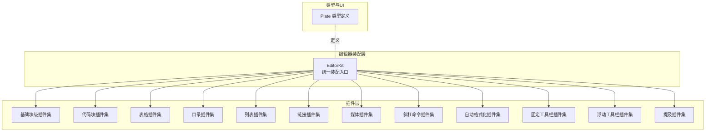

图表来源
- [src/components/editor/editor-kit.tsx:36-78](file://src/components/editor/editor-kit.tsx#L36-L78)
- [src/components/editor/plate-types.ts:148-164](file://src/components/editor/plate-types.ts#L148-L164)

章节来源
- [src/components/editor/editor-kit.tsx:1-83](file://src/components/editor/editor-kit.tsx#L1-L83)
- [src/components/editor/plate-types.ts:1-164](file://src/components/editor/plate-types.ts#L1-L164)

## 核心组件
- EditorKit：集中式装配器，负责将各插件集按顺序拼装，形成最终编辑器实例。装配顺序体现了插件间的优先级与依赖关系。
- Plate 类型系统：通过 platejs 的类型别名与自定义接口，定义了丰富的节点类型（标题、段落、代码块、表格、图片、链接、提及、目录等），确保编辑器内部数据结构的强类型约束。
- 插件集模块：每个插件集以数组形式导出，包含插件配置、渲染注入与快捷键绑定，便于按需启用或替换。

章节来源
- [src/components/editor/editor-kit.tsx:36-78](file://src/components/editor/editor-kit.tsx#L36-L78)
- [src/components/editor/plate-types.ts:25-164](file://src/components/editor/plate-types.ts#L25-L164)

## 架构总览
编辑器插件系统采用“装配器 + 插件集 + 类型系统”的三层架构：
- 装配器（EditorKit）：决定插件加载顺序、组合策略与默认行为。
- 插件集（Plugin Kits）：封装具体功能（如自动格式化、列表、表格、媒体等），每个插件集可独立维护与测试。
- 类型系统（Plate Types）：提供强类型的数据模型与节点接口，保证插件间协作的一致性与可维护性。

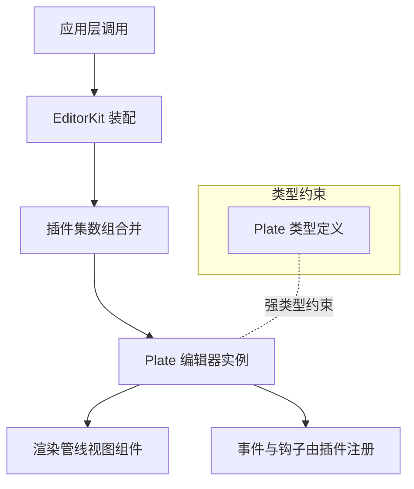

图表来源
- [src/components/editor/editor-kit.tsx:36-78](file://src/components/editor/editor-kit.tsx#L36-L78)
- [src/components/editor/plate-types.ts:148-164](file://src/components/editor/plate-types.ts#L148-L164)

## 详细组件分析

### 自动格式化插件集（AutoformatKit）
- 功能概述：提供基于规则的自动格式化能力，覆盖标记（粗体、斜体、高亮等）、块级元素（标题、引用、代码块、分割线）与列表（无序、有序、任务清单）。
- 关键机制：
  - 规则注册：通过 AutoformatPlugin.configure 注册多类 AutoformatRule，涵盖匹配字符串、正则匹配、模式（mark/block）与格式化回调。
  - 上下文过滤：在规则中通过查询函数排除在代码块内的自动格式化，避免误触。
  - 列表切换：使用 toggleList 实现列表类型切换与任务项状态管理。
- 典型流程（自动格式化触发）：

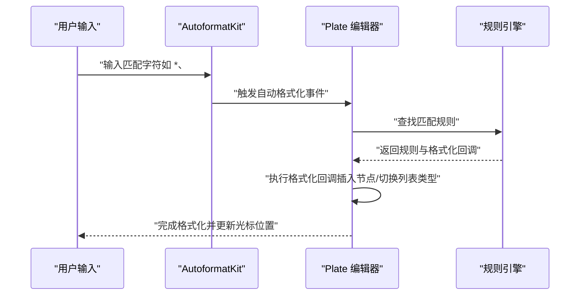

图表来源
- [src/components/editor/plugins/autoformat-kit.tsx:211-237](file://src/components/editor/plugins/autoformat-kit.tsx#L211-L237)
- [src/components/editor/plugins/autoformat-kit.tsx:158-209](file://src/components/editor/plugins/autoformat-kit.tsx#L158-L209)

章节来源
- [src/components/editor/plugins/autoformat-kit.tsx:1-237](file://src/components/editor/plugins/autoformat-kit.tsx#L1-L237)

### 基础块级元素插件集（BasicBlocksKit）
- 功能概述：提供标题（H1-H6）、段落、引用块、水平分割线等基础块级元素的节点与快捷键绑定。
- 关键机制：
  - 节点组件注入：通过 withComponent/ configure.node.component 将 UI 组件与节点类型关联。
  - 快捷键：为每个标题类型绑定 mod+alt+数字的快捷键，提升输入效率。
  - 规则配置：部分节点配置 break 行为（如空内容时重置为段落），提升交互一致性。
- 典型流程（快捷键切换标题）：

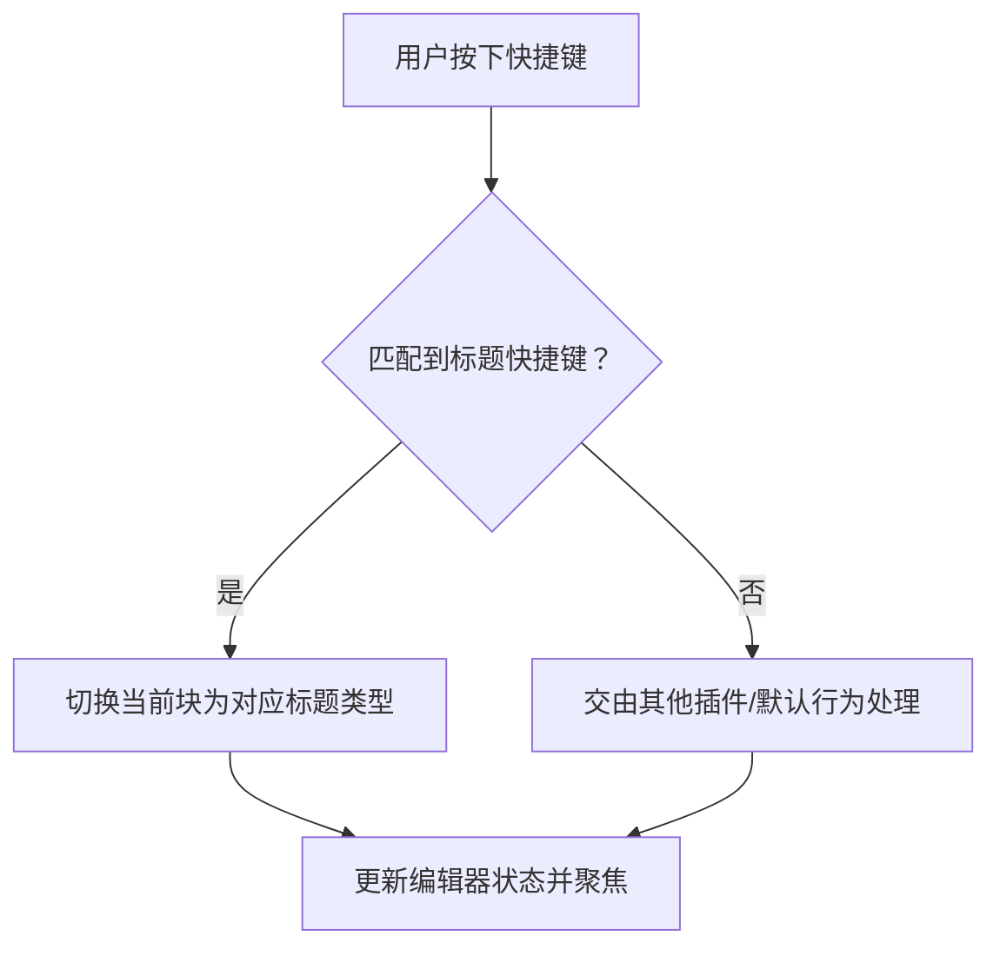

图表来源
- [src/components/editor/plugins/basic-blocks-kit.tsx:27-89](file://src/components/editor/plugins/basic-blocks-kit.tsx#L27-L89)

章节来源
- [src/components/editor/plugins/basic-blocks-kit.tsx:1-89](file://src/components/editor/plugins/basic-blocks-kit.tsx#L1-L89)

### 列表插件集（ListKit）
- 功能概述：提供列表（无序、有序、任务清单）与缩进控制，支持在多种目标节点下方渲染列表。
- 关键机制：
  - 目标注入：通过 inject.targetPlugins 指定可在哪些节点下方插入列表。
  - 渲染注入：通过 render.belowNodes 注入 BlockList 组件，提供列表可视化与交互。
  - 依赖组合：与 IndentKit 协作，实现列表层级与缩进联动。
- 典型流程（在段落下方插入列表）：

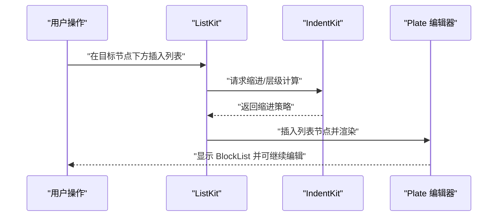

图表来源
- [src/components/editor/plugins/list-kit.tsx:9-27](file://src/components/editor/plugins/list-kit.tsx#L9-L27)

章节来源
- [src/components/editor/plugins/list-kit.tsx:1-27](file://src/components/editor/plugins/list-kit.tsx#L1-L27)

### 代码块插件集（CodeBlockKit）
- 功能概述：提供代码块、代码行与语法高亮能力，支持快捷键切换与低亮度（lowlight）语法解析。
- 关键机制：
  - 语法高亮：通过 lowlight 初始化高亮引擎，结合 CodeSyntaxLeaf 实现实时语法着色。
  - 节点组件：分别注入 CodeBlockElement、CodeLineElement、CodeSyntaxLeaf。
  - 快捷键：绑定 mod+alt+8 快速切换代码块。
- 典型流程（切换为代码块）：

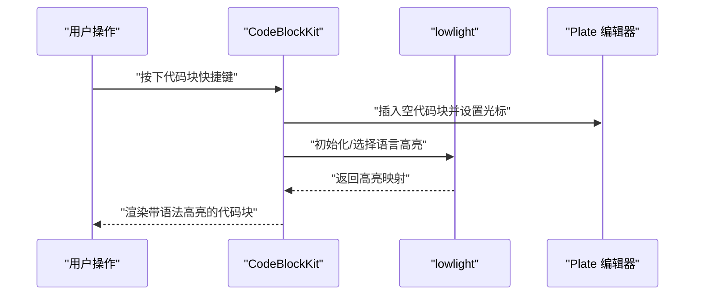

图表来源
- [src/components/editor/plugins/code-block-kit.tsx:18-27](file://src/components/editor/plugins/code-block-kit.tsx#L18-L27)

章节来源
- [src/components/editor/plugins/code-block-kit.tsx:1-27](file://src/components/editor/plugins/code-block-kit.tsx#L1-L27)

### 表格插件集（TableKit）
- 功能概述：提供表格、行、单元格与表头的节点与组件注入，支持初始宽度配置。
- 关键机制：
  - 组件注入：TableElement、TableRowElement、TableCellElement、TableCellHeaderElement 分别与节点类型绑定。
  - 配置项：initialTableWidth 控制表格初始宽度，提升用户体验。
- 典型流程（插入表格）：

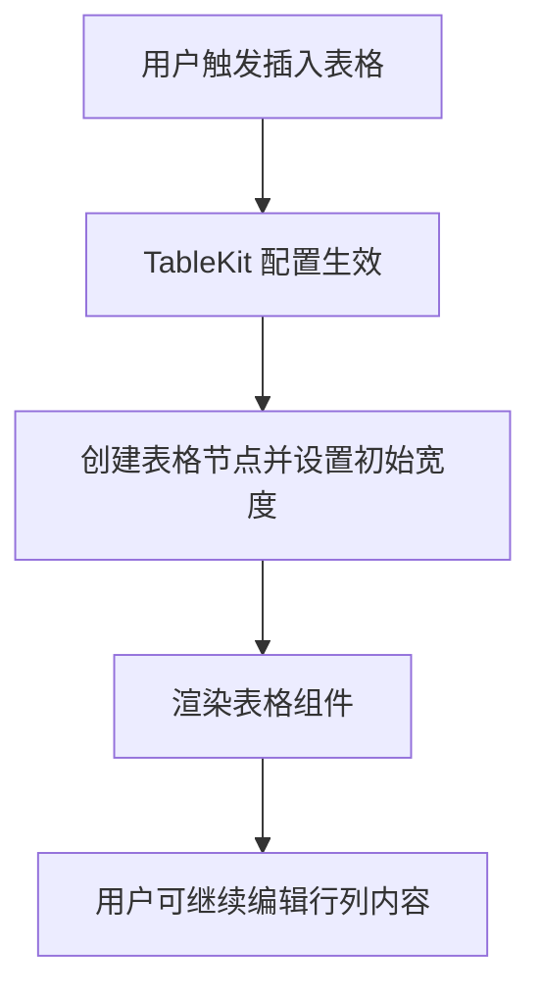

图表来源
- [src/components/editor/plugins/table-kit.tsx:17-27](file://src/components/editor/plugins/table-kit.tsx#L17-L27)

章节来源
- [src/components/editor/plugins/table-kit.tsx:1-27](file://src/components/editor/plugins/table-kit.tsx#L1-L27)

### 链接插件集（LinkKit）
- 功能概述：提供链接节点与悬浮工具栏，支持链接编辑与预览。
- 关键机制：
  - 节点组件：LinkElement 与 LinkFloatingToolbar 注入，提供编辑与悬浮交互。
  - 渲染注入：afterEditable 渲染悬浮工具栏，提升可用性。
- 典型流程（编辑链接）：

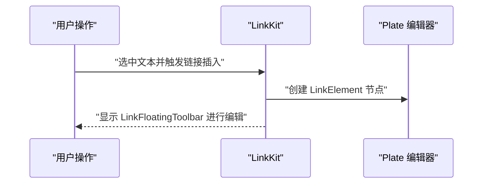

图表来源
- [src/components/editor/plugins/link-kit.tsx:8-16](file://src/components/editor/plugins/link-kit.tsx#L8-L16)

章节来源
- [src/components/editor/plugins/link-kit.tsx:1-16](file://src/components/editor/plugins/link-kit.tsx#L1-L16)

### 媒体插件集（MediaKit）
- 功能概述：提供图片、视频、音频、文件与嵌入媒体的节点与上传/预览能力，支持占位符与字幕。
- 关键机制：
  - 上传配置：针对不同媒体类型设置最大文件数、大小与媒体类型，统一通过 Placeholder 与 Upload 组件反馈。
  - 预览与对话框：afterEditable 渲染 MediaPreviewDialog 与 MediaUploadToast，改善上传体验。
  - 字幕与可调整属性：CaptionPlugin 与可调整属性（TResizableProps）增强媒体编辑能力。
- 典型流程（上传图片）：

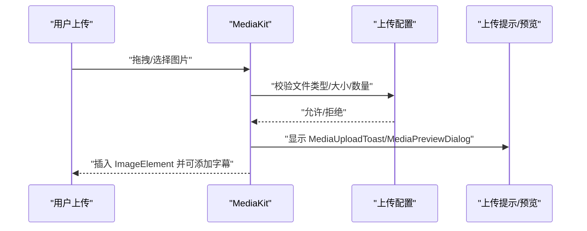

图表来源
- [src/components/editor/plugins/media-kit.tsx:23-84](file://src/components/editor/plugins/media-kit.tsx#L23-L84)

章节来源
- [src/components/editor/plugins/media-kit.tsx:1-84](file://src/components/editor/plugins/media-kit.tsx#L1-L84)

### 目录插件集（TocKit）
- 功能概述：提供目录生成与滚动定位能力，支持顶部偏移配置。
- 关键机制：
  - 组件注入：TocElement 与 TocPlugin 配合，生成目录树并支持滚动同步。
  - 配置项：topOffset 控制滚动偏移，提升阅读体验。
- 典型流程（生成目录）：

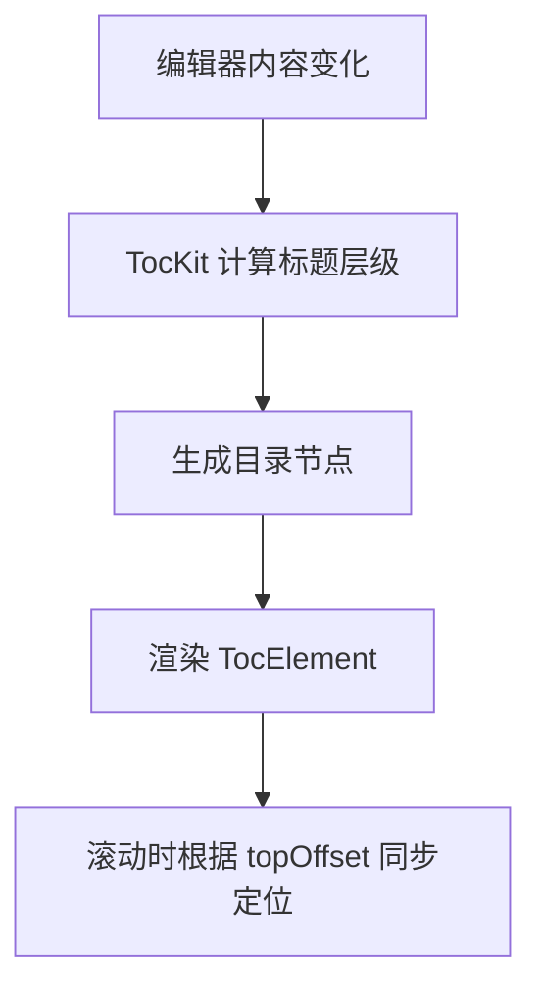

图表来源
- [src/components/editor/plugins/toc-kit.tsx:7-15](file://src/components/editor/plugins/toc-kit.tsx#L7-L15)

章节来源
- [src/components/editor/plugins/toc-kit.tsx:1-15](file://src/components/editor/plugins/toc-kit.tsx#L1-L15)

### 斜杠命令插件集（SlashKit）
- 功能概述：提供“/”触发的命令面板，支持快速插入块级元素与功能命令。
- 关键机制：
  - 触发条件：通过 triggerQuery 在代码块内禁用斜杠命令，避免干扰。
  - 组件注入：SlashInputElement 提供命令输入界面。
- 典型流程（触发斜杠命令）：

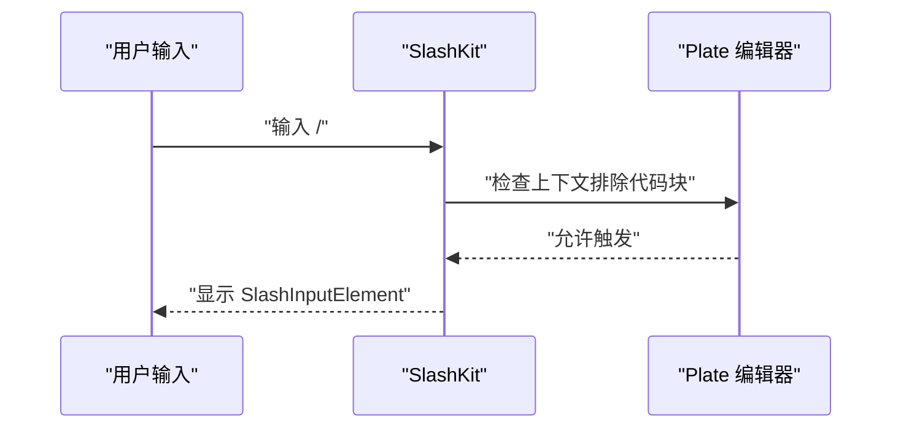

图表来源
- [src/components/editor/plugins/slash-kit.tsx:8-19](file://src/components/editor/plugins/slash-kit.tsx#L8-L19)

章节来源
- [src/components/editor/plugins/slash-kit.tsx:1-19](file://src/components/editor/plugins/slash-kit.tsx#L1-L19)

### 固定/浮动工具栏插件集（FixedToolbarKit/FloatingToolbarKit）
- 功能概述：提供固定与浮动两套工具栏，分别在可编辑区域前后或悬浮显示，承载常用操作按钮。
- 关键机制：
  - createPlatePlugin：通过 render.afterEditable/beforeEditable 注入工具栏组件。
  - 与按钮组件解耦：工具栏内部通过按钮集合组件承载具体功能。
- 典型流程（显示浮动工具栏）：

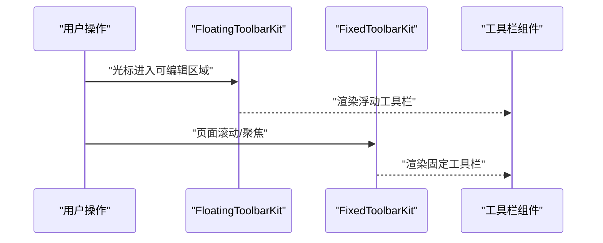

图表来源
- [src/components/editor/plugins/floating-toolbar-kit.tsx:8-20](file://src/components/editor/plugins/floating-toolbar-kit.tsx#L8-L20)
- [src/components/editor/plugins/fixed-toolbar-kit.tsx:8-20](file://src/components/editor/plugins/fixed-toolbar-kit.tsx#L8-L20)

章节来源
- [src/components/editor/plugins/floating-toolbar-kit.tsx:1-20](file://src/components/editor/plugins/floating-toolbar-kit.tsx#L1-L20)
- [src/components/editor/plugins/fixed-toolbar-kit.tsx:1-20](file://src/components/editor/plugins/fixed-toolbar-kit.tsx#L1-L20)

### 提及插件集（MentionKit）
- 功能概述：提供 @ 触发的提及功能，支持触发前缀字符模式与输入组件注入。
- 关键机制：
  - 触发模式：通过 triggerPreviousCharPattern 支持空格、引号等边界字符。
  - 组件注入：MentionElement 与 MentionInputElement 分别用于展示与输入。
- 典型流程（触发提及）：

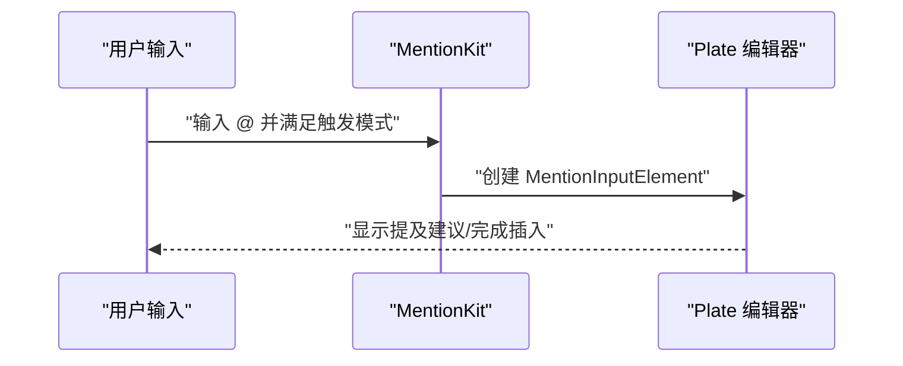

图表来源
- [src/components/editor/plugins/mention-kit.tsx:10-18](file://src/components/editor/plugins/mention-kit.tsx#L10-L18)

章节来源
- [src/components/editor/plugins/mention-kit.tsx:1-18](file://src/components/editor/plugins/mention-kit.tsx#L1-L18)

## 依赖关系分析
- 装配顺序决定优先级：EditorKit 中的数组顺序即插件注册顺序，影响事件传播与钩子执行先后。
- 插件间耦合度：
  - 列表插件依赖缩进插件（IndentKit）以实现层级与缩进联动。
  - 自动格式化与斜杠命令在代码块上下文中相互避让（通过查询函数排除）。
  - 媒体插件与上传/预览组件通过渲染注入解耦。
- 类型系统约束：plate-types.tsx 定义的节点类型与属性，确保各插件在数据层面保持一致，降低耦合风险。

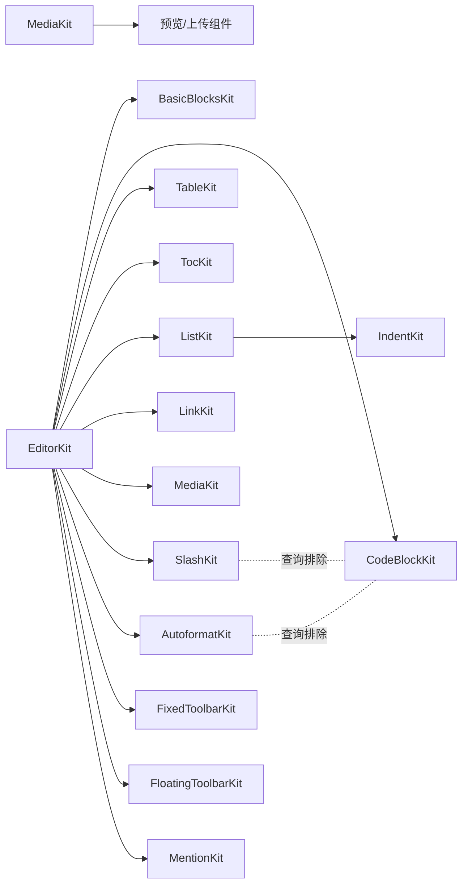

图表来源
- [src/components/editor/editor-kit.tsx:36-78](file://src/components/editor/editor-kit.tsx#L36-L78)
- [src/components/editor/plugins/list-kit.tsx:6-10](file://src/components/editor/plugins/list-kit.tsx#L6-L10)
- [src/components/editor/plugins/autoformat-kit.tsx:225-233](file://src/components/editor/plugins/autoformat-kit.tsx#L225-L233)
- [src/components/editor/plugins/slash-kit.tsx:11-15](file://src/components/editor/plugins/slash-kit.tsx#L11-L15)

章节来源
- [src/components/editor/editor-kit.tsx:36-78](file://src/components/editor/editor-kit.tsx#L36-L78)
- [src/components/editor/plugins/list-kit.tsx:6-10](file://src/components/editor/plugins/list-kit.tsx#L6-L10)
- [src/components/editor/plugins/autoformat-kit.tsx:225-233](file://src/components/editor/plugins/autoformat-kit.tsx#L225-L233)
- [src/components/editor/plugins/slash-kit.tsx:11-15](file://src/components/editor/plugins/slash-kit.tsx#L11-L15)

## 性能考量
- 规则与查询开销：自动格式化与斜杠命令均通过查询函数进行上下文判断，应尽量简化查询逻辑，避免深度遍历。
- 组件渲染：工具栏与媒体上传/预览组件通过渲染注入，建议按需渲染与懒加载，减少首屏压力。
- 语法高亮：lowlight 初始化成本较高，建议在首次需要时按需初始化，或复用已初始化实例。
- 列表与表格：复杂表格与深层列表可能带来渲染与事件处理开销，建议限制初始规模并延迟加载。
- 类型系统：强类型定义有助于编译期优化与减少运行时错误，但需注意类型推导复杂度。

## 故障排查指南
- 自动格式化未生效
  - 检查规则是否被排除（如在代码块内）。参考路径：[src/components/editor/plugins/autoformat-kit.tsx:225-233](file://src/components/editor/plugins/autoformat-kit.tsx#L225-L233)
  - 确认匹配字符串或正则是否正确。
- 斜杠命令无法触发
  - 检查 triggerQuery 是否排除了当前上下文（如代码块）。参考路径：[src/components/editor/plugins/slash-kit.tsx:11-15](file://src/components/editor/plugins/slash-kit.tsx#L11-L15)
- 列表层级异常
  - 确认是否正确引入 IndentKit 且与 ListKit 组合。参考路径：[src/components/editor/plugins/list-kit.tsx:6-10](file://src/components/editor/plugins/list-kit.tsx#L6-L10)
- 媒体上传失败
  - 检查上传配置（文件类型、大小、数量）与 afterEditable 组件是否正确渲染。参考路径：[src/components/editor/plugins/media-kit.tsx:32-75](file://src/components/editor/plugins/media-kit.tsx#L32-L75)
- 工具栏不显示
  - 确认渲染注入位置（beforeEditable/afterEditable）与组件是否正确挂载。参考路径：[src/components/editor/plugins/fixed-toolbar-kit.tsx:11-17](file://src/components/editor/plugins/fixed-toolbar-kit.tsx#L11-L17)、[src/components/editor/plugins/floating-toolbar-kit.tsx:11-17](file://src/components/editor/plugins/floating-toolbar-kit.tsx#L11-L17)

章节来源
- [src/components/editor/plugins/autoformat-kit.tsx:225-233](file://src/components/editor/plugins/autoformat-kit.tsx#L225-L233)
- [src/components/editor/plugins/slash-kit.tsx:11-15](file://src/components/editor/plugins/slash-kit.tsx#L11-L15)
- [src/components/editor/plugins/list-kit.tsx:6-10](file://src/components/editor/plugins/list-kit.tsx#L6-L10)
- [src/components/editor/plugins/media-kit.tsx:32-75](file://src/components/editor/plugins/media-kit.tsx#L32-L75)
- [src/components/editor/plugins/fixed-toolbar-kit.tsx:11-17](file://src/components/editor/plugins/fixed-toolbar-kit.tsx#L11-L17)
- [src/components/editor/plugins/floating-toolbar-kit.tsx:11-17](file://src/components/editor/plugins/floating-toolbar-kit.tsx#L11-L17)

## 结论
该插件系统通过 EditorKit 统一装配、插件集模块化与强类型定义，实现了清晰的职责分离与良好的扩展性。自动格式化、列表、表格、媒体、链接、目录、工具栏与提及等功能均以插件形式提供，既可独立启用，也可按需组合。遵循装配顺序与上下文查询策略，可有效避免冲突并提升性能。

## 附录：插件开发指南与最佳实践
- 插件模板
  - 使用 createPlatePlugin 或具体插件包提供的 configure/withComponent 形式导出插件数组。
  - 在 EditorKit 中按功能域分组加入装配顺序，明确优先级与依赖。
  - 参考现有插件的结构与命名风格，保持一致性。
- 最佳实践
  - 明确上下文查询：在规则或触发器中使用查询函数排除不适用场景（如代码块）。
  - 组件解耦：通过渲染注入与组件化 UI，降低插件与视图的耦合。
  - 快捷键设计：遵循平台约定（如 mod+alt+数字），避免与系统快捷键冲突。
  - 性能优化：避免在渲染中做重型计算；必要时使用懒加载与缓存。
- 调试技巧
  - 使用最小可复现示例验证规则与触发器。
  - 逐步注释/启用插件，定位冲突来源。
  - 利用类型系统进行编译期检查，减少运行时错误。
- 现有插件功能特性概览
  - 自动格式化：标记、块级、列表与特殊符号的自动转换。
  - 智能提示：斜杠命令与提及输入。
  - 快捷键支持：标题、代码块、列表等常用操作的键盘快捷方式。
  - 媒体上传与预览：图片、视频、音频、文件与嵌入媒体的上传与展示。
  - 目录生成：基于标题层级的目录构建与滚动同步。