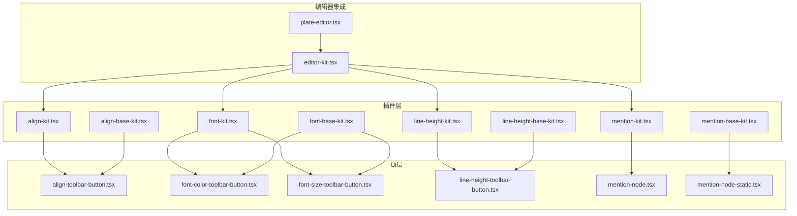
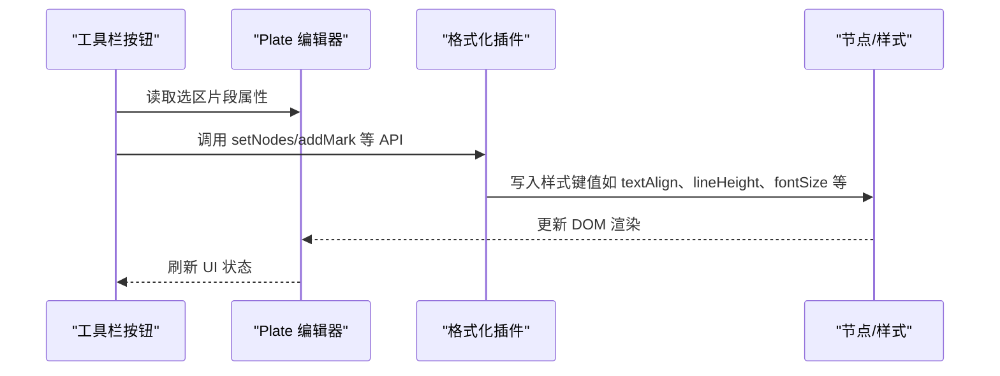
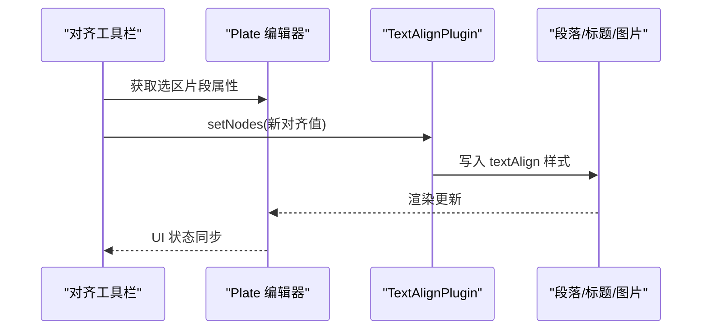
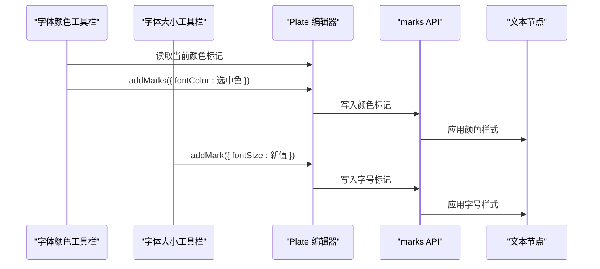
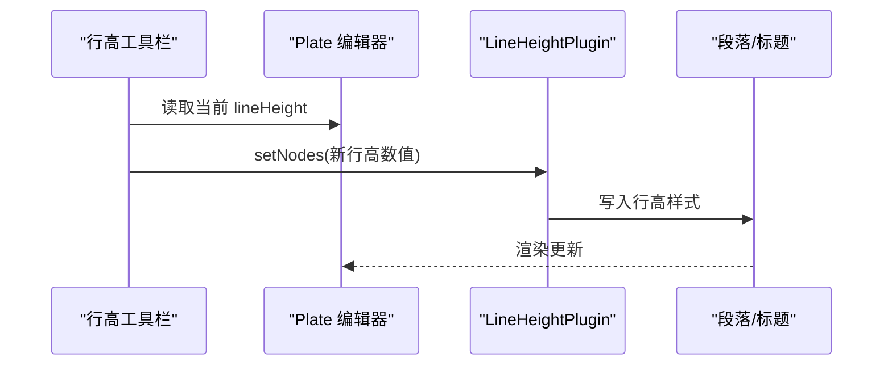
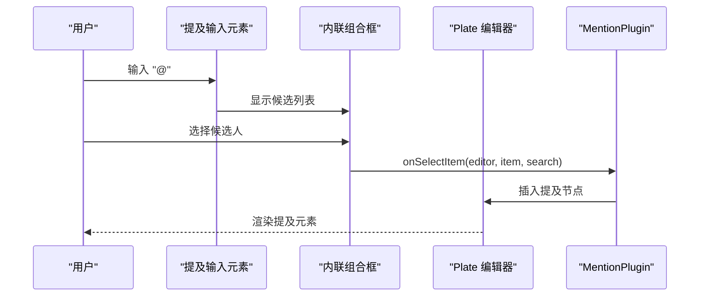
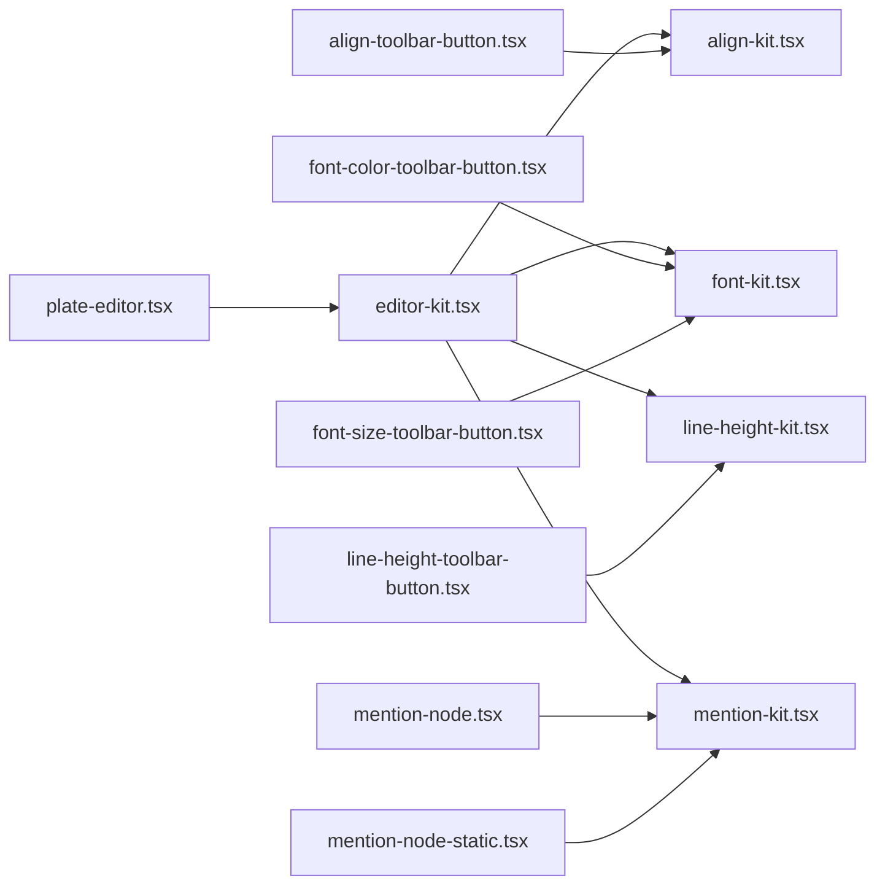

# 文本格式化插件

<cite>
**本文引用的文件**
- [align-kit.tsx](file://src/components/editor/plugins/align-kit.tsx)
- [align-base-kit.tsx](file://src/components/editor/plugins/align-base-kit.tsx)
- [font-kit.tsx](file://src/components/editor/plugins/font-kit.tsx)
- [font-base-kit.tsx](file://src/components/editor/plugins/font-base-kit.tsx)
- [line-height-kit.tsx](file://src/components/editor/plugins/line-height-kit.tsx)
- [line-height-base-kit.tsx](file://src/components/editor/plugins/line-height-base-kit.tsx)
- [mention-kit.tsx](file://src/components/editor/plugins/mention-kit.tsx)
- [mention-base-kit.tsx](file://src/components/editor/plugins/mention-base-kit.tsx)
- [align-toolbar-button.tsx](file://src/components/ui/align-toolbar-button.tsx)
- [font-color-toolbar-button.tsx](file://src/components/ui/font-color-toolbar-button.tsx)
- [font-size-toolbar-button.tsx](file://src/components/ui/font-size-toolbar-button.tsx)
- [line-height-toolbar-button.tsx](file://src/components/ui/line-height-toolbar-button.tsx)
- [mention-node.tsx](file://src/components/ui/mention-node.tsx)
- [mention-node-static.tsx](file://src/components/ui/mention-node-static.tsx)
- [editor-kit.tsx](file://src/components/editor/editor-kit.tsx)
- [plate-editor.tsx](file://src/components/editor/plate-editor.tsx)
</cite>

## 目录
1. [简介](#简介)
2. [项目结构](#项目结构)
3. [核心组件](#核心组件)
4. [架构总览](#架构总览)
5. [详细组件分析](#详细组件分析)
6. [依赖关系分析](#依赖关系分析)
7. [性能考虑](#性能考虑)
8. [故障排查指南](#故障排查指南)
9. [结论](#结论)
10. [附录：使用示例与最佳实践](#附录使用示例与最佳实践)

## 简介
本文件系统性地文档化 ynNote 编辑器中的文本格式化相关插件，重点覆盖以下能力：
- 对齐插件（align-kit）：支持左对齐、居中、右对齐、两端对齐等文本对齐方式。
- 字体插件（font-kit）：统一管理字体颜色、背景色、字号与字体族的样式标记。
- 行高插件（line-height-kit）：控制段落与标题的行高倍数。
- 提及插件（mention-kit）：通过 @ 符号触发用户提及，提供输入组合框与选人交互。

文档将从架构、数据流、处理逻辑、事件与集成方式等方面进行深入解析，并提供使用示例、性能优化建议与常见问题解决方案。

## 项目结构
文本格式化相关代码主要分布在两个层次：
- 插件层：位于 src/components/editor/plugins，定义各插件的配置与注入目标。
- UI 层：位于 src/components/ui，提供工具栏按钮与节点渲染组件，用于与编辑器交互。

**图表来源**
- [align-kit.tsx:1-19](file://src/components/editor/plugins/align-kit.tsx#L1-L19)
- [font-kit.tsx:1-29](file://src/components/editor/plugins/font-kit.tsx#L1-L29)
- [line-height-kit.tsx:1-17](file://src/components/editor/plugins/line-height-kit.tsx#L1-L17)
- [mention-kit.tsx:1-18](file://src/components/editor/plugins/mention-kit.tsx#L1-L18)
- [align-base-kit.tsx:1-17](file://src/components/editor/plugins/align-base-kit.tsx#L1-L17)
- [font-base-kit.tsx:1-20](file://src/components/editor/plugins/font-base-kit.tsx#L1-L20)
- [line-height-base-kit.tsx:1-15](file://src/components/editor/plugins/line-height-base-kit.tsx#L1-L15)
- [mention-base-kit.tsx:1-8](file://src/components/editor/plugins/mention-base-kit.tsx#L1-L8)
- [align-toolbar-button.tsx:1-86](file://src/components/ui/align-toolbar-button.tsx#L1-L86)
- [font-color-toolbar-button.tsx:1-831](file://src/components/ui/font-color-toolbar-button.tsx#L1-L831)
- [font-size-toolbar-button.tsx:1-153](file://src/components/ui/font-size-toolbar-button.tsx#L1-L153)
- [line-height-toolbar-button.tsx:1-70](file://src/components/ui/line-height-toolbar-button.tsx#L1-L70)
- [mention-node.tsx:1-195](file://src/components/ui/mention-node.tsx#L1-L195)
- [mention-node-static.tsx:1-37](file://src/components/ui/mention-node-static.tsx#L1-L37)
- [editor-kit.tsx:1-83](file://src/components/editor/editor-kit.tsx#L1-L83)
- [plate-editor.tsx:1-175](file://src/components/editor/plate-editor.tsx#L1-L175)

**章节来源**
- [editor-kit.tsx:1-83](file://src/components/editor/editor-kit.tsx#L1-L83)
- [plate-editor.tsx:1-175](file://src/components/editor/plate-editor.tsx#L1-L175)

## 核心组件
本节概述四大插件的职责与关键配置要点：
- 对齐插件（align-kit）
  - 注入目标：段落、标题、图片、媒体嵌入等节点类型。
  - 默认值与有效值：默认对齐为“start”，有效值包含 left、center、right、justify 等。
  - 集成方式：在编辑器 Kit 中以插件数组形式注册。
- 字体插件（font-kit）
  - 组成：字体颜色、背景色、字号、字体族四个子插件。
  - 注入目标：默认针对段落节点。
  - 默认值：字体颜色默认黑色；字号、字体族、背景色按插件默认行为处理。
- 行高插件（line-height-kit）
  - 注入目标：标题与段落节点。
  - 默认值与有效值：默认行高 1.5，可选 1、1.2、1.5、2、3。
- 提及插件（mention-kit）
  - 触发条件：前一字符满足正则模式（空格、引号或字符串开头）时触发。
  - 组件绑定：提及元素与输入元素分别绑定到 UI 组件。

**章节来源**
- [align-kit.tsx:1-19](file://src/components/editor/plugins/align-kit.tsx#L1-L19)
- [font-kit.tsx:1-29](file://src/components/editor/plugins/font-kit.tsx#L1-L29)
- [line-height-kit.tsx:1-17](file://src/components/editor/plugins/line-height-kit.tsx#L1-L17)
- [mention-kit.tsx:1-18](file://src/components/editor/plugins/mention-kit.tsx#L1-L18)

## 架构总览
编辑器通过 EditorKit 将各插件装配到 Plate 编辑器实例中，UI 工具栏按钮通过 Plate 的 React API 读取/写入当前选区的样式属性，实现所见即所得的格式化操作。

**图表来源**
- [align-toolbar-button.tsx:44-84](file://src/components/ui/align-toolbar-button.tsx#L44-L84)
- [line-height-toolbar-button.tsx:21-68](file://src/components/ui/line-height-toolbar-button.tsx#L21-L68)
- [font-size-toolbar-button.tsx:45-91](file://src/components/ui/font-size-toolbar-button.tsx#L45-L91)
- [font-color-toolbar-button.tsx:32-129](file://src/components/ui/font-color-toolbar-button.tsx#L32-L129)
- [plate-editor.tsx:79-82](file://src/components/editor/plate-editor.tsx#L79-L82)

## 详细组件分析

### 对齐插件（align-kit）
- 插件配置
  - 注入节点：标题、段落、图片、媒体嵌入等。
  - 节点属性：默认对齐为“start”，样式键为 textAlign，有效值集合包含多种对齐方式。
- UI 交互
  - 工具栏按钮提供下拉菜单，支持左对齐、居中、右对齐、两端对齐。
  - 选区片段属性读取当前对齐状态，点击后调用 setNodes 应用新对齐。
- 数据流
  - 从选区片段读取 align 值 → 用户选择 → 写回节点 → 视图更新。

**图表来源**
- [align-toolbar-button.tsx:44-84](file://src/components/ui/align-toolbar-button.tsx#L44-L84)
- [align-kit.tsx:6-18](file://src/components/editor/plugins/align-kit.tsx#L6-L18)

**章节来源**
- [align-kit.tsx:1-19](file://src/components/editor/plugins/align-kit.tsx#L1-L19)
- [align-toolbar-button.tsx:1-86](file://src/components/ui/align-toolbar-button.tsx#L1-L86)

### 字体插件（font-kit）
- 插件组成
  - 字体颜色、背景色、字号、字体族四个子插件，均注入段落节点。
- UI 交互
  - 字体颜色：提供颜色选择器，支持默认色板与自定义颜色，支持清除。
  - 字体大小：支持 +/- 步进调整、弹出列表快速选择、手动输入并校验范围。
- 数据流
  - 读取当前选区标记值 → 用户选择/输入 → addMark/removeMarks 应用 → 视图更新。

**图表来源**
- [font-color-toolbar-button.tsx:32-129](file://src/components/ui/font-color-toolbar-button.tsx#L32-L129)
- [font-size-toolbar-button.tsx:45-91](file://src/components/ui/font-size-toolbar-button.tsx#L45-L91)
- [font-kit.tsx:16-28](file://src/components/editor/plugins/font-kit.tsx#L16-L28)

**章节来源**
- [font-kit.tsx:1-29](file://src/components/editor/plugins/font-kit.tsx#L1-L29)
- [font-color-toolbar-button.tsx:1-831](file://src/components/ui/font-color-toolbar-button.tsx#L1-L831)
- [font-size-toolbar-button.tsx:1-153](file://src/components/ui/font-size-toolbar-button.tsx#L1-L153)

### 行高插件（line-height-kit）
- 插件配置
  - 注入节点：标题与段落。
  - 默认行高 1.5，有效值集合为 1、1.2、1.5、2、3。
- UI 交互
  - 下拉菜单展示可选项，选中项带勾选指示。
  - 通过 lineHeight.setNodes 写入数值型行高。

**图表来源**
- [line-height-toolbar-button.tsx:21-68](file://src/components/ui/line-height-toolbar-button.tsx#L21-L68)
- [line-height-kit.tsx:6-16](file://src/components/editor/plugins/line-height-kit.tsx#L6-L16)

**章节来源**
- [line-height-kit.tsx:1-17](file://src/components/editor/plugins/line-height-kit.tsx#L1-L17)
- [line-height-toolbar-button.tsx:1-70](file://src/components/ui/line-height-toolbar-button.tsx#L1-L70)

### 提及插件（mention-kit）
- 插件配置
  - 触发条件：前一字符满足正则（空格、引号或字符串开头）。
  - 组件绑定：提及元素与输入元素分别绑定到 UI 组件。
- UI 交互
  - 输入元素内嵌组合框，触发 @ 后显示候选列表。
  - 选中项后通过 onSelectItem 写入编辑器内容。
- 数据流
  - 用户输入 @ → 触发组合框 → 选择候选人 → 写入提及节点 → 视图更新。

**图表来源**
- [mention-node.tsx:78-117](file://src/components/ui/mention-node.tsx#L78-L117)
- [mention-kit.tsx:10-17](file://src/components/editor/plugins/mention-kit.tsx#L10-L17)

**章节来源**
- [mention-kit.tsx:1-18](file://src/components/editor/plugins/mention-kit.tsx#L1-L18)
- [mention-node.tsx:1-195](file://src/components/ui/mention-node.tsx#L1-L195)
- [mention-node-static.tsx:1-37](file://src/components/ui/mention-node-static.tsx#L1-L37)

## 依赖关系分析
- 插件到 UI 的依赖
  - 对齐：align-toolbar-button 依赖 TextAlignPlugin 并通过 setNodes 写入 textAlign。
  - 字体：font-color-toolbar-button 与 font-size-toolbar-button 分别依赖 marks API 与 fontSize 插件。
  - 行高：line-height-toolbar-button 依赖 lineHeight 插件并写入数值。
  - 提及：mention-node 与 mention-node-static 分别绑定 MentionPlugin 的元素与输入组件。
- 编辑器集成
  - editor-kit 将各插件数组展开注册到 Plate 编辑器。
  - plate-editor 使用 usePlateEditor 初始化编辑器实例并传入 EditorKit。

**图表来源**
- [editor-kit.tsx:36-78](file://src/components/editor/editor-kit.tsx#L36-L78)
- [plate-editor.tsx:79-82](file://src/components/editor/plate-editor.tsx#L79-L82)

**章节来源**
- [editor-kit.tsx:1-83](file://src/components/editor/editor-kit.tsx#L1-L83)
- [plate-editor.tsx:1-175](file://src/components/editor/plate-editor.tsx#L1-L175)

## 性能考虑
- 结构化比较
  - 编辑器变更检测采用结构化对比函数，避免昂贵的 JSON 序列化，减少不必要的保存与重渲染。
- 工具栏组件优化
  - 字体颜色选择器使用 React.memo 与浅比较，降低重渲染成本。
  - 自定义颜色输入采用防抖回调，限制频繁写入。
- 插件注入范围
  - 字体与行高仅注入段落节点，避免对大量节点重复计算样式。
- 建议
  - 在大规模文档中，尽量缩小选区范围再应用样式，减少批量更新。
  - 使用组合框输入时，建议限制候选集规模或启用分页/搜索过滤。

**章节来源**
- [plate-editor.tsx:16-61](file://src/components/editor/plate-editor.tsx#L16-L61)
- [font-color-toolbar-button.tsx:180-186](file://src/components/ui/font-color-toolbar-button.tsx#L180-L186)

## 故障排查指南
- 对齐不生效
  - 检查注入节点是否正确（标题、段落、图片、媒体嵌入）。
  - 确认工具栏按钮读取的选区片段属性是否为空或冲突。
- 字体颜色/字号未更新
  - 确认 marks API 是否返回当前选区标记值。
  - 手动输入字号时需确保在允许范围内（例如 1–100），否则会回退焦点。
- 行高无效
  - 确认当前选区节点类型在注入目标范围内。
  - 仅支持预设的有效值，超出范围会被忽略。
- 提及无法触发
  - 检查触发前一字符正则是否匹配当前上下文。
  - 确认组合框触发符与输入元素绑定是否正确。
- 保存状态异常
  - 若跨笔记切换导致历史残留，确认是否清除了编辑器历史记录与选区。

**章节来源**
- [align-toolbar-button.tsx:44-84](file://src/components/ui/align-toolbar-button.tsx#L44-L84)
- [font-size-toolbar-button.tsx:66-82](file://src/components/ui/font-size-toolbar-button.tsx#L66-L82)
- [line-height-toolbar-button.tsx:21-68](file://src/components/ui/line-height-toolbar-button.tsx#L21-L68)
- [mention-node.tsx:78-117](file://src/components/ui/mention-node.tsx#L78-L117)
- [plate-editor.tsx:102-136](file://src/components/editor/plate-editor.tsx#L102-L136)

## 结论
本文档梳理了对齐、字体、行高与提及四大文本格式化插件的实现与集成方式。通过对插件配置、UI 交互、数据流与错误排查的系统化说明，读者可以快速理解并扩展编辑器的格式化能力。建议在生产环境中结合结构化比较与组件优化策略，持续提升编辑体验与性能表现。

## 附录：使用示例与最佳实践
- 快速启用格式化工具
  - 在编辑器初始化时引入 EditorKit，即可自动装配对齐、字体、行高与提及插件。
  - 工具栏按钮通过 Plate 的 React API 读取/写入样式，无需额外监听器。
- 最佳实践
  - 将样式作用域限定在需要的节点类型上，避免全局样式污染。
  - 对于大文档，优先使用局部选区应用样式，减少重排与重绘。
  - 提及功能建议配合搜索与分页，控制候选数量，提升交互流畅度。
- 常见场景
  - 批量设置段落对齐：在段落选区内打开对齐工具栏，选择目标对齐方式。
  - 统一字号与颜色：在段落选区内设置字号与颜色，避免影响标题层级。
  - 行高一致性：在标题与段落中保持一致的行高，提升阅读体验。
  - 提及用户：在合适位置输入 @，从候选中选择目标用户并确认插入。

**章节来源**
- [editor-kit.tsx:36-78](file://src/components/editor/editor-kit.tsx#L36-L78)
- [plate-editor.tsx:79-82](file://src/components/editor/plate-editor.tsx#L79-L82)
- [align-toolbar-button.tsx:44-84](file://src/components/ui/align-toolbar-button.tsx#L44-L84)
- [font-size-toolbar-button.tsx:45-91](file://src/components/ui/font-size-toolbar-button.tsx#L45-L91)
- [line-height-toolbar-button.tsx:21-68](file://src/components/ui/line-height-toolbar-button.tsx#L21-L68)
- [mention-node.tsx:78-117](file://src/components/ui/mention-node.tsx#L78-L117)