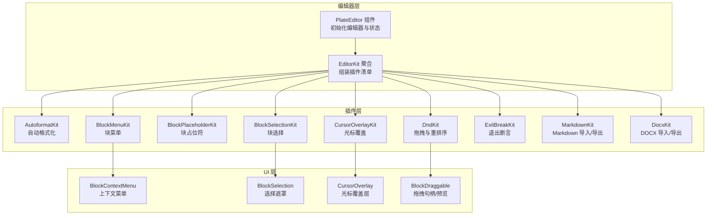
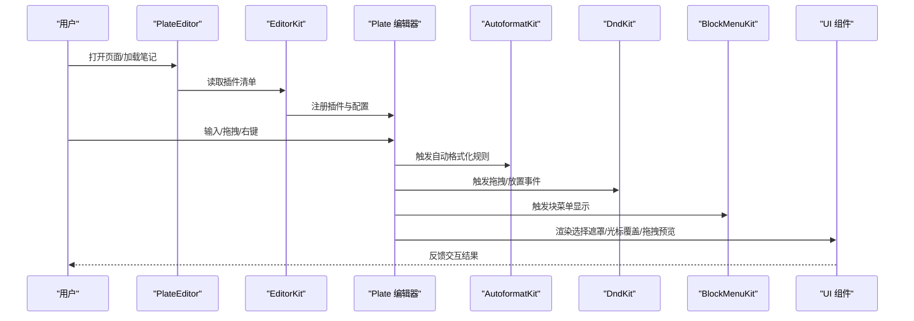
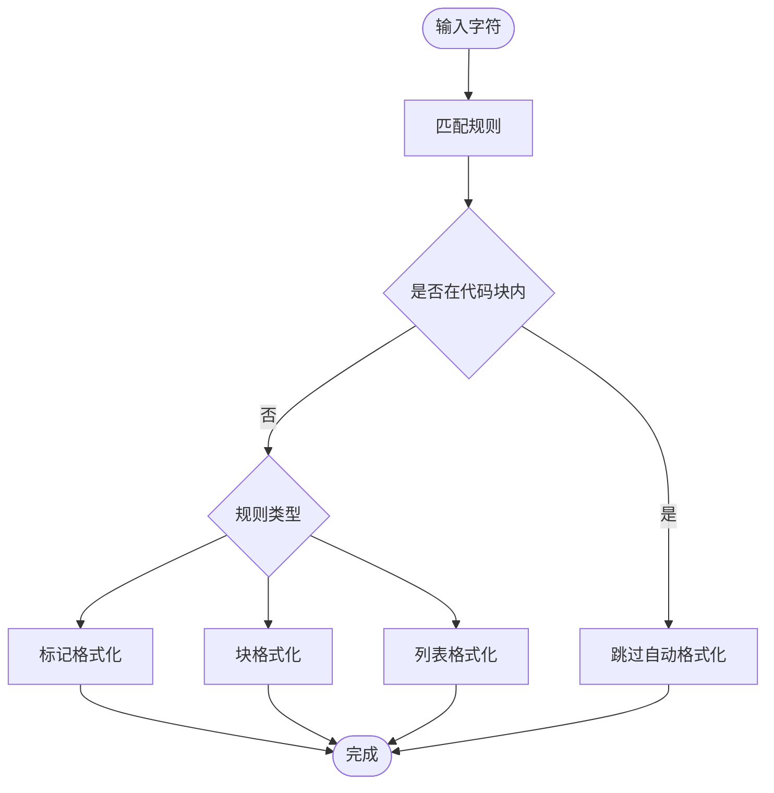
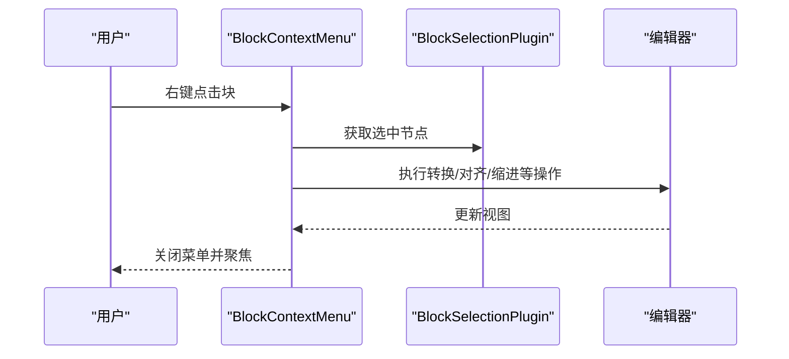
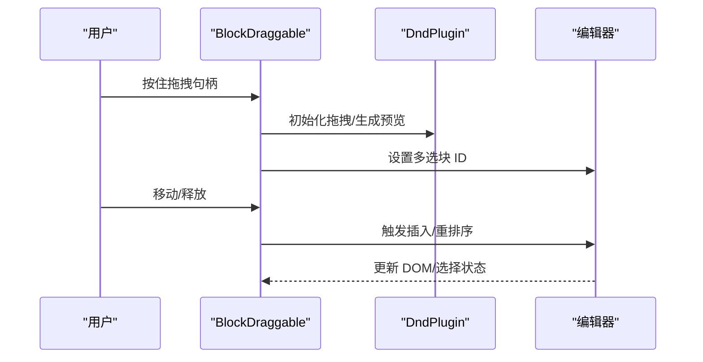
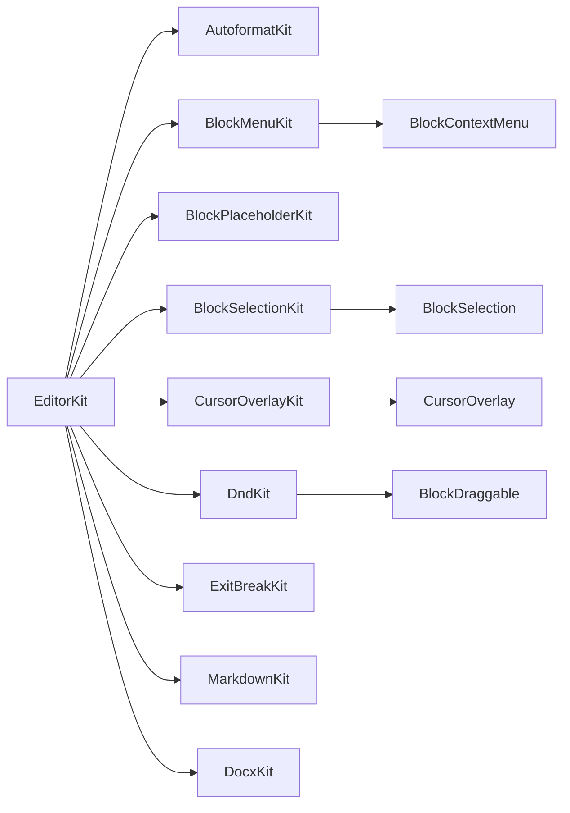

# 高级插件

<cite>
**本文引用的文件**
- [src/components/editor/plugins/autoformat-kit.tsx](file://src/components/editor/plugins/autoformat-kit.tsx)
- [src/components/editor/plugins/block-menu-kit.tsx](file://src/components/editor/plugins/block-menu-kit.tsx)
- [src/components/editor/plugins/block-placeholder-kit.tsx](file://src/components/editor/plugins/block-placeholder-kit.tsx)
- [src/components/editor/plugins/block-selection-kit.tsx](file://src/components/editor/plugins/block-selection-kit.tsx)
- [src/components/editor/plugins/cursor-overlay-kit.tsx](file://src/components/editor/plugins/cursor-overlay-kit.tsx)
- [src/components/editor/plugins/dnd-kit.tsx](file://src/components/editor/plugins/dnd-kit.tsx)
- [src/components/editor/plugins/exit-break-kit.tsx](file://src/components/editor/plugins/exit-break-kit.tsx)
- [src/components/editor/plugins/markdown-kit.tsx](file://src/components/editor/plugins/markdown-kit.tsx)
- [src/components/editor/plugins/docx-kit.tsx](file://src/components/editor/plugins/docx-kit.tsx)
- [src/components/ui/block-context-menu.tsx](file://src/components/ui/block-context-menu.tsx)
- [src/components/ui/block-selection.tsx](file://src/components/ui/block-selection.tsx)
- [src/components/ui/cursor-overlay.tsx](file://src/components/ui/cursor-overlay.tsx)
- [src/components/ui/block-draggable.tsx](file://src/components/ui/block-draggable.tsx)
- [src/components/editor/editor-kit.tsx](file://src/components/editor/editor-kit.tsx)
- [src/components/editor/plate-editor.tsx](file://src/components/editor/plate-editor.tsx)
- [src/components/editor/plate-types.ts](file://src/components/editor/plate-types.ts)
</cite>

## 目录
1. [简介](#简介)
2. [项目结构](#项目结构)
3. [核心组件](#核心组件)
4. [架构总览](#架构总览)
5. [详细组件分析](#详细组件分析)
6. [依赖关系分析](#依赖关系分析)
7. [性能考量](#性能考量)
8. [故障排查指南](#故障排查指南)
9. [结论](#结论)
10. [附录：配置与扩展指南](#附录配置与扩展指南)

## 简介
本文件面向高级用户与插件开发者，系统性梳理并文档化以下高级插件的功能、实现与集成方式：
- 自动格式化插件（autoformat-kit）：基于规则的智能格式转换与块级/标记自动补全。
- 块菜单插件（block-menu-kit）：块级元素的上下文菜单与“转为”能力。
- 块占位符插件（block-placeholder-kit）：空块提示与引导输入。
- 块选择插件（block-selection-kit）：块级选择与多选支持。
- 光标覆盖插件（cursor-overlay-kit）：多人协作光标与选择可视化。
- 拖拽插件（dnd-kit）：拖放与重排序，含文件拖入插入。
- 退出断言插件（exit-break-kit）：键盘导航与换行行为控制。
- Markdown 导入导出插件（markdown-kit）与 DOCX 插件（docx-kit）：文档格式转换。

同时给出配置项说明、扩展开发建议与常见问题排查路径。

## 项目结构
高级插件位于编辑器目录下，通过统一的 EditorKit 聚合注册，并在 PlateEditor 中初始化。各插件以独立模块形式存在，便于按需启用/禁用与组合。

图表来源
- [src/components/editor/plate-editor.tsx:63-82](file://src/components/editor/plate-editor.tsx#L63-L82)
- [src/components/editor/editor-kit.tsx:36-78](file://src/components/editor/editor-kit.tsx#L36-L78)
- [src/components/editor/plugins/block-menu-kit.tsx:9-14](file://src/components/editor/plugins/block-menu-kit.tsx#L9-L14)
- [src/components/ui/block-context-menu.tsx:24-183](file://src/components/ui/block-context-menu.tsx#L24-L183)
- [src/components/ui/block-selection.tsx:23-42](file://src/components/ui/block-selection.tsx#L23-L42)
- [src/components/ui/cursor-overlay.tsx:14-24](file://src/components/ui/cursor-overlay.tsx#L14-L24)
- [src/components/ui/block-draggable.tsx:30-70](file://src/components/ui/block-draggable.tsx#L30-L70)

章节来源
- [src/components/editor/plate-editor.tsx:63-82](file://src/components/editor/plate-editor.tsx#L63-L82)
- [src/components/editor/editor-kit.tsx:36-78](file://src/components/editor/editor-kit.tsx#L36-L78)

## 核心组件
- 自动格式化插件（AutoformatKit）
  - 功能：提供标记（粗体/斜体/删除线等）、块（标题/引用/代码块/分隔线/列表）与智能引号、标点、法律文本、箭头、数学公式等规则驱动的自动格式转换；在代码块内禁用自动格式化。
  - 关键点：规则数组聚合、查询条件排除代码块、列表切换与任务列表节点属性设置。
- 块菜单插件（BlockMenuKit）
  - 功能：在可选区域渲染上下文菜单，支持“删除/复制/转为/缩进/外缩进/对齐”等操作；与块选择插件联动。
- 块占位符插件（BlockPlaceholderKit）
  - 功能：为段落等块类型提供占位提示文本；仅在顶层块生效。
- 块选择插件（BlockSelectionKit）
  - 功能：启用块级选择与右键菜单；定义可选择性与渲染自定义选择遮罩。
- 光标覆盖插件（CursorOverlayKit）
  - 功能：渲染远程光标与选择区域，区分拖拽与普通选择；跳过多单元格表格选择。
- 拖拽插件（DndKit）
  - 功能：启用拖拽重排序、拖入文件插入媒体；提供拖拽句柄、拖拽预览与放置线。
- 退出断言插件（ExitBreakKit）
  - 功能：配置在编辑器内按快捷键插入/在前插入新块的行为。
- Markdown 插件（MarkdownKit）
  - 功能：配置 Markdown 解析/序列化插件集合（数学、GFM、Mention 等）。
- DOCX 插件（DocxKit）
  - 功能：DOCX 导入与样式内联处理（结合 Juice）。

章节来源
- [src/components/editor/plugins/autoformat-kit.tsx:211-237](file://src/components/editor/plugins/autoformat-kit.tsx#L211-L237)
- [src/components/editor/plugins/block-menu-kit.tsx:9-14](file://src/components/editor/plugins/block-menu-kit.tsx#L9-L14)
- [src/components/editor/plugins/block-placeholder-kit.tsx:6-17](file://src/components/editor/plugins/block-placeholder-kit.tsx#L6-L17)
- [src/components/editor/plugins/block-selection-kit.tsx:8-26](file://src/components/editor/plugins/block-selection-kit.tsx#L8-L26)
- [src/components/editor/plugins/cursor-overlay-kit.tsx:7-13](file://src/components/editor/plugins/cursor-overlay-kit.tsx#L7-L13)
- [src/components/editor/plugins/dnd-kit.tsx:10-27](file://src/components/editor/plugins/dnd-kit.tsx#L10-L27)
- [src/components/editor/plugins/exit-break-kit.tsx:5-12](file://src/components/editor/plugins/exit-break-kit.tsx#L5-L12)
- [src/components/editor/plugins/markdown-kit.tsx:5-11](file://src/components/editor/plugins/markdown-kit.tsx#L5-L11)
- [src/components/editor/plugins/docx-kit.tsx:3-6](file://src/components/editor/plugins/docx-kit.tsx#L3-L6)

## 架构总览
高级插件通过 EditorKit 统一装配，PlateEditor 负责初始化编辑器实例与状态管理。插件之间通过 Plate 的 API/Transforms 协作，UI 层组件负责渲染与交互。

图表来源
- [src/components/editor/plate-editor.tsx:79-82](file://src/components/editor/plate-editor.tsx#L79-L82)
- [src/components/editor/editor-kit.tsx:36-78](file://src/components/editor/editor-kit.tsx#L36-L78)
- [src/components/editor/plugins/autoformat-kit.tsx:211-237](file://src/components/editor/plugins/autoformat-kit.tsx#L211-L237)
- [src/components/editor/plugins/dnd-kit.tsx:10-27](file://src/components/editor/plugins/dnd-kit.tsx#L10-L27)
- [src/components/editor/plugins/block-menu-kit.tsx:9-14](file://src/components/editor/plugins/block-menu-kit.tsx#L9-L14)
- [src/components/ui/block-selection.tsx:23-42](file://src/components/ui/block-selection.tsx#L23-L42)
- [src/components/ui/cursor-overlay.tsx:14-24](file://src/components/ui/cursor-overlay.tsx#L14-L24)
- [src/components/ui/block-draggable.tsx:72-188](file://src/components/ui/block-draggable.tsx#L72-L188)

## 详细组件分析

### 自动格式化插件（AutoformatKit）
- 规则分类
  - 标记类：支持多种粗体/斜体/下划线/删除线/上标/下标/高亮/行内代码等组合。
  - 块类：标题、引用、代码块、分隔线等。
  - 列表类：无序/有序/任务列表，支持数字列表起始值与复选框状态。
  - 其他：智能引号、标点、法律文本、HTML 法律符号、箭头、数学公式等。
- 行为特性
  - 在代码块内禁用自动格式化，避免误触发。
  - 列表切换使用统一 API，任务列表节点包含复选状态。
  - 分隔线格式化后自动插入下一个段落节点。
- 复杂度与性能
  - 规则映射与查询函数在初始化时构建，运行时按需匹配，复杂度与规则数量线性相关。
- 错误处理
  - 匹配失败或格式化函数异常会回退到默认行为，不阻断编辑流程。

图表来源
- [src/components/editor/plugins/autoformat-kit.tsx:211-237](file://src/components/editor/plugins/autoformat-kit.tsx#L211-L237)
- [src/components/editor/plugins/autoformat-kit.tsx:18-89](file://src/components/editor/plugins/autoformat-kit.tsx#L18-L89)
- [src/components/editor/plugins/autoformat-kit.tsx:91-156](file://src/components/editor/plugins/autoformat-kit.tsx#L91-L156)
- [src/components/editor/plugins/autoformat-kit.tsx:158-209](file://src/components/editor/plugins/autoformat-kit.tsx#L158-L209)

章节来源
- [src/components/editor/plugins/autoformat-kit.tsx:18-237](file://src/components/editor/plugins/autoformat-kit.tsx#L18-L237)

### 块菜单插件（BlockMenuKit）
- 组成
  - 依赖块选择插件以获取当前选中节点。
  - 渲染自定义上下文菜单组件，支持“删除/复制/转为/缩进/外缩进/对齐”等。
- 交互流程
  - 右键触发显示菜单；菜单项调用编辑器 Transform API 对选中块进行操作。
  - 支持触摸设备时直接透传子节点，避免误触。

图表来源
- [src/components/editor/plugins/block-menu-kit.tsx:9-14](file://src/components/editor/plugins/block-menu-kit.tsx#L9-L14)
- [src/components/ui/block-context-menu.tsx:24-183](file://src/components/ui/block-context-menu.tsx#L24-L183)

章节来源
- [src/components/editor/plugins/block-menu-kit.tsx:1-15](file://src/components/editor/plugins/block-menu-kit.tsx#L1-L15)
- [src/components/ui/block-context-menu.tsx:31-178](file://src/components/ui/block-context-menu.tsx#L31-L178)

### 块占位符插件（BlockPlaceholderKit）
- 功能
  - 为顶层段落块提供占位提示文本，提升首次输入体验。
- 限制
  - 仅作用于顶层块（根节点），避免嵌套层级中的干扰。

章节来源
- [src/components/editor/plugins/block-placeholder-kit.tsx:6-17](file://src/components/editor/plugins/block-placeholder-kit.tsx#L6-L17)

### 块选择插件（BlockSelectionKit）
- 功能
  - 启用块级选择与右键菜单；定义不可选择的元素类型（列容器、代码行、表格单元）。
  - 渲染自定义选择遮罩组件，根据拖拽状态动态调整透明度。
- 与拖拽的关系
  - 选择遮罩会与拖拽状态联动，避免拖拽过程中遮挡视觉反馈。

章节来源
- [src/components/editor/plugins/block-selection-kit.tsx:8-26](file://src/components/editor/plugins/block-selection-kit.tsx#L8-L26)
- [src/components/ui/block-selection.tsx:23-42](file://src/components/ui/block-selection.tsx#L23-L42)

### 光标覆盖插件（CursorOverlayKit）
- 功能
  - 渲染远程用户的光标与选择区域，区分拖拽与普通选择。
  - 跳过多单元格表格选择，避免与表格内置选择冲突。
- 视觉样式
  - 选择区域与光标采用不同颜色与透明度，保证可读性。

章节来源
- [src/components/editor/plugins/cursor-overlay-kit.tsx:7-13](file://src/components/editor/plugins/cursor-overlay-kit.tsx#L7-L13)
- [src/components/ui/cursor-overlay.tsx:14-76](file://src/components/ui/cursor-overlay.tsx#L14-L76)

### 拖拽插件（DndKit）
- 功能
  - 启用拖拽重排序与拖入文件插入媒体。
  - 提供拖拽句柄、拖拽预览（含滚动补偿与相邻间距计算）、放置线。
- 交互细节
  - 支持多选拖拽，生成多个克隆元素作为预览。
  - 拖拽句柄在鼠标悬停时计算预览顶部偏移，确保视觉对齐。
  - 文件拖入时通过占位符插件插入媒体节点。

图表来源
- [src/components/editor/plugins/dnd-kit.tsx:10-27](file://src/components/editor/plugins/dnd-kit.tsx#L10-L27)
- [src/components/ui/block-draggable.tsx:72-188](file://src/components/ui/block-draggable.tsx#L72-L188)
- [src/components/ui/block-draggable.tsx:358-456](file://src/components/ui/block-draggable.tsx#L358-L456)
- [src/components/ui/block-draggable.tsx:458-504](file://src/components/ui/block-draggable.tsx#L458-L504)

章节来源
- [src/components/editor/plugins/dnd-kit.tsx:1-28](file://src/components/editor/plugins/dnd-kit.tsx#L1-L28)
- [src/components/ui/block-draggable.tsx:30-70](file://src/components/ui/block-draggable.tsx#L30-L70)

### 退出断言插件（ExitBreakKit）
- 功能
  - 配置在编辑器内按快捷键插入/在前插入新块的行为，提升键盘导航效率。

章节来源
- [src/components/editor/plugins/exit-break-kit.tsx:5-12](file://src/components/editor/plugins/exit-break-kit.tsx#L5-L12)

### Markdown 插件（MarkdownKit）
- 功能
  - 配置 Markdown 解析/序列化插件集合，支持数学公式、任务列表、Mention 等扩展语法。

章节来源
- [src/components/editor/plugins/markdown-kit.tsx:5-11](file://src/components/editor/plugins/markdown-kit.tsx#L5-L11)

### DOCX 插件（DocxKit）
- 功能
  - DOCX 导入与样式内联处理，提升从外部文档粘贴的兼容性。

章节来源
- [src/components/editor/plugins/docx-kit.tsx:3-6](file://src/components/editor/plugins/docx-kit.tsx#L3-L6)

## 依赖关系分析
- 插件聚合
  - EditorKit 将所有插件按“元素/标记/块样式/编辑/解析/UI”分组装配，确保加载顺序与依赖满足。
- 组件耦合
  - 上下文菜单依赖块选择 API；拖拽句柄依赖 Dnd 与块选择 API；光标覆盖依赖远程状态。
- 外部依赖
  - 使用 PlateJS 生态与 react-dnd 进行拖拽；使用 remark 家族插件处理 Markdown。

图表来源
- [src/components/editor/editor-kit.tsx:36-78](file://src/components/editor/editor-kit.tsx#L36-L78)
- [src/components/editor/plugins/block-menu-kit.tsx:9-14](file://src/components/editor/plugins/block-menu-kit.tsx#L9-L14)
- [src/components/ui/block-context-menu.tsx:24-183](file://src/components/ui/block-context-menu.tsx#L24-L183)
- [src/components/ui/block-selection.tsx:23-42](file://src/components/ui/block-selection.tsx#L23-L42)
- [src/components/ui/cursor-overlay.tsx:14-24](file://src/components/ui/cursor-overlay.tsx#L14-L24)
- [src/components/ui/block-draggable.tsx:30-70](file://src/components/ui/block-draggable.tsx#L30-L70)

章节来源
- [src/components/editor/editor-kit.tsx:36-78](file://src/components/editor/editor-kit.tsx#L36-L78)

## 性能考量
- 自动格式化
  - 规则映射在初始化阶段完成，运行时匹配成本低；建议保持规则数量合理，避免过度复杂导致匹配耗时。
- 拖拽预览
  - 克隆 DOM 并应用滚动补偿，注意大文档场景下的 DOM 操作开销；可通过减少预览元素数量或延迟生成优化。
- 光标覆盖
  - 多用户场景下渲染大量光标与选择区域可能带来重绘压力，建议在移动端或低性能设备上适当简化样式。
- 值比较
  - 编辑器内部使用结构化比较避免全量序列化，降低保存判断成本。

## 故障排查指南
- 自动格式化未生效
  - 检查是否处于代码块内（自动格式化在代码块内被禁用）。
  - 确认规则匹配字符串与正则表达式是否正确。
- 块菜单不显示
  - 确认右键事件未被只读或禁用标志阻止；检查触摸设备模式下的分支逻辑。
- 拖拽无效
  - 确认目标块路径层级允许拖拽（顶层/列/表格内允许）；检查不可拖拽类型列表。
  - 检查 DndProvider 是否正确包裹编辑器根节点。
- 光标覆盖异常
  - 多单元格表格选择会被跳过，属预期行为；确认非表格场景下是否正常渲染。
- Markdown/DOCX 导入导出失败
  - 检查 remark 插件配置与版本兼容性；DOCX 导入需确保网络环境与服务端支持。

章节来源
- [src/components/editor/plugins/autoformat-kit.tsx:228-233](file://src/components/editor/plugins/autoformat-kit.tsx#L228-L233)
- [src/components/ui/block-context-menu.tsx:73-88](file://src/components/ui/block-context-menu.tsx#L73-L88)
- [src/components/ui/block-draggable.tsx:33-65](file://src/components/ui/block-draggable.tsx#L33-L65)
- [src/components/ui/cursor-overlay.tsx:38-47](file://src/components/ui/cursor-overlay.tsx#L38-L47)
- [src/components/editor/plugins/markdown-kit.tsx:5-11](file://src/components/editor/plugins/markdown-kit.tsx#L5-L11)
- [src/components/editor/plugins/docx-kit.tsx:3-6](file://src/components/editor/plugins/docx-kit.tsx#L3-L6)

## 结论
上述高级插件围绕“智能输入、块级交互、协作可视化、拖拽重排与格式转换”五大方向构建，配合 EditorKit 的模块化装配，形成可扩展、可维护的编辑器能力体系。建议在生产环境中结合业务需求裁剪插件集合并关注性能与可访问性。

## 附录：配置与扩展指南
- 配置项总览
  - 自动格式化：规则数组、查询条件、格式化回调（列表/分隔线/代码块）。
  - 块菜单：渲染组件、右键触发、菜单项动作（删除/复制/转为/缩进/对齐）。
  - 块占位符：占位类名、占位文本、生效路径条件。
  - 块选择：可选择性过滤、渲染自定义遮罩。
  - 光标覆盖：渲染组件、样式与选择样式分离。
  - 拖拽：启用滚动、文件拖入回调、拖拽预览与放置线。
  - 退出断言：插入/在前插入快捷键。
  - Markdown/DOCX：remark 插件集合与样式内联。
- 扩展开发建议
  - 新增规则：遵循现有规则结构，提供 match/mode/type/format/query 字段。
  - 新增菜单项：在上下文菜单组件中添加子菜单项并绑定 Transform API。
  - 自定义遮罩：基于已有的遮罩组件风格扩展样式与动画。
  - 拖拽增强：在拖拽句柄中扩展多选逻辑与预览样式，必要时引入节流/防抖。
  - 类型安全：参考 plate-types.ts 的类型定义，确保新增节点类型与属性符合约定。

章节来源
- [src/components/editor/plugins/autoformat-kit.tsx:211-237](file://src/components/editor/plugins/autoformat-kit.tsx#L211-L237)
- [src/components/editor/plugins/block-menu-kit.tsx:9-14](file://src/components/editor/plugins/block-menu-kit.tsx#L9-L14)
- [src/components/editor/plugins/block-placeholder-kit.tsx:6-17](file://src/components/editor/plugins/block-placeholder-kit.tsx#L6-L17)
- [src/components/editor/plugins/block-selection-kit.tsx:8-26](file://src/components/editor/plugins/block-selection-kit.tsx#L8-L26)
- [src/components/editor/plugins/cursor-overlay-kit.tsx:7-13](file://src/components/editor/plugins/cursor-overlay-kit.tsx#L7-L13)
- [src/components/editor/plugins/dnd-kit.tsx:10-27](file://src/components/editor/plugins/dnd-kit.tsx#L10-L27)
- [src/components/editor/plugins/exit-break-kit.tsx:5-12](file://src/components/editor/plugins/exit-break-kit.tsx#L5-L12)
- [src/components/editor/plugins/markdown-kit.tsx:5-11](file://src/components/editor/plugins/markdown-kit.tsx#L5-L11)
- [src/components/editor/plugins/docx-kit.tsx:3-6](file://src/components/editor/plugins/docx-kit.tsx#L3-L6)
- [src/components/editor/plate-types.ts:25-164](file://src/components/editor/plate-types.ts#L25-L164)