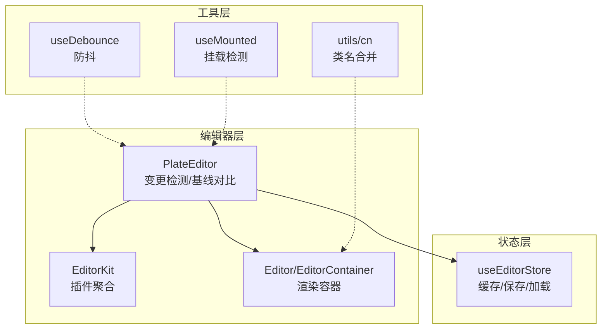
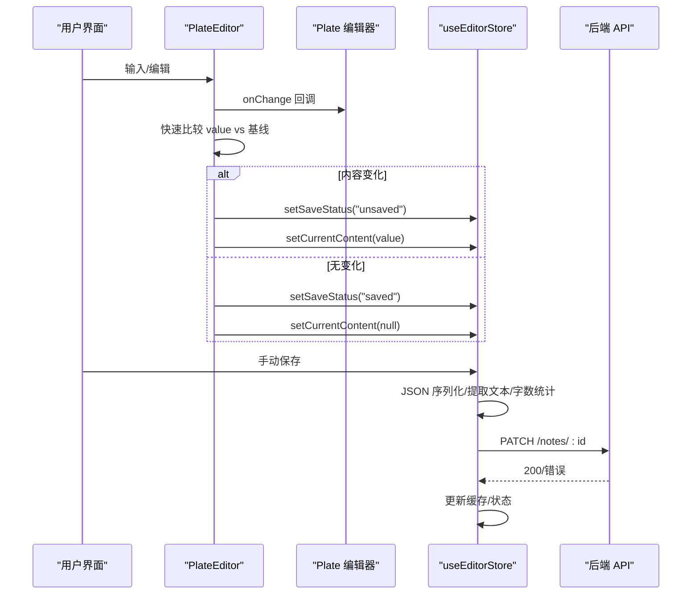
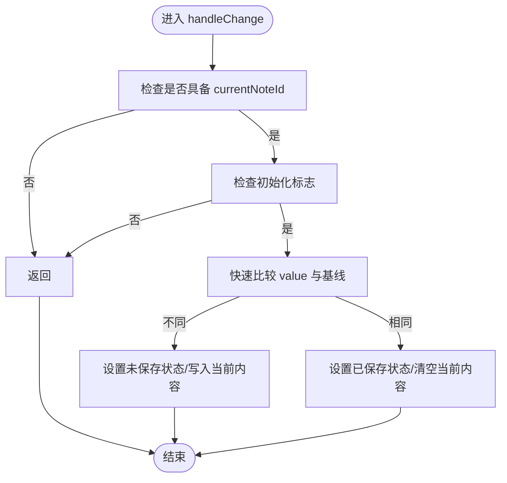
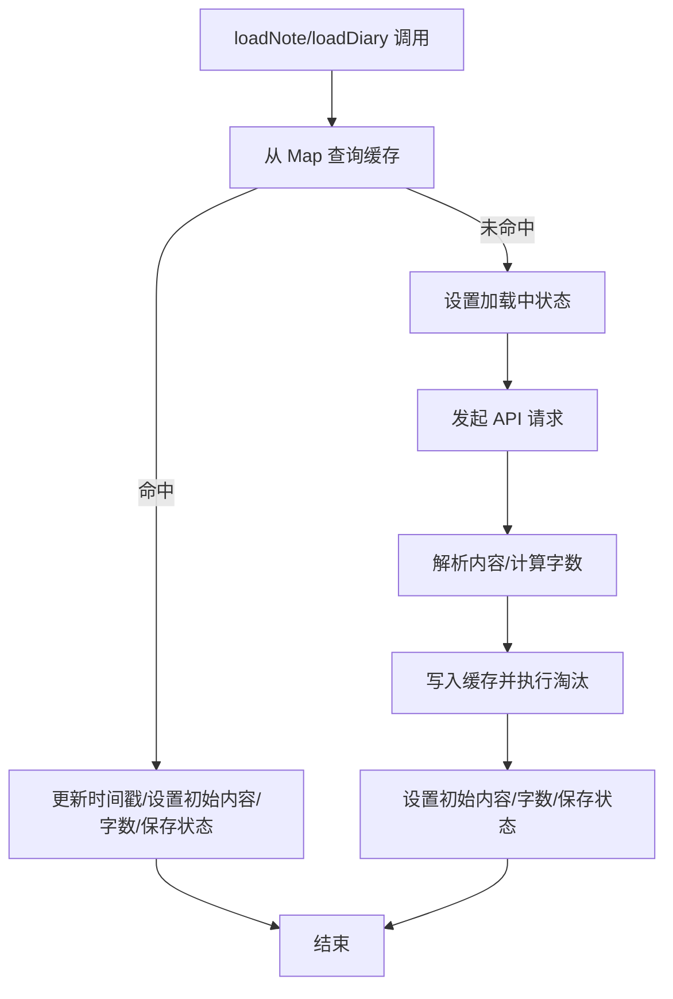
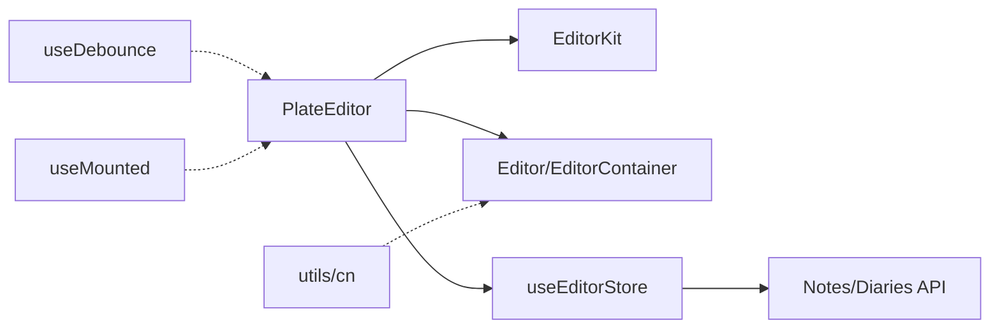
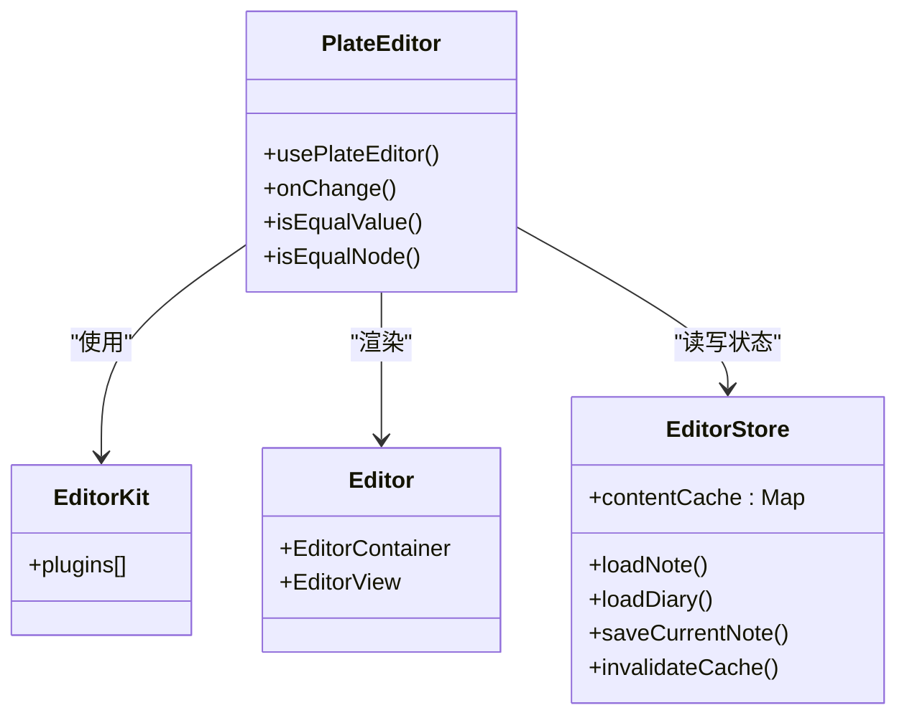

# 编辑器性能优化

<cite>
**本文引用的文件**
- [src/components/editor/plate-editor.tsx](file://src/components/editor/plate-editor.tsx)
- [src/components/editor/editor-kit.tsx](file://src/components/editor/editor-kit.tsx)
- [src/stores/editor-store.ts](file://src/stores/editor-store.ts)
- [src/hooks/use-debounce.ts](file://src/hooks/use-debounce.ts)
- [src/components/ui/editor.tsx](file://src/components/ui/editor.tsx)
- [src/lib/utils.ts](file://src/lib/utils.ts)
- [src/components/editor/plugins/slash-kit.tsx](file://src/components/editor/plugins/slash-kit.tsx)
- [src/components/editor/plugins/autoformat-kit.tsx](file://src/components/editor/plugins/autoformat-kit.tsx)
- [src/components/ui/block-list.tsx](file://src/components/ui/block-list.tsx)
- [src/hooks/use-mounted.ts](file://src/hooks/use-mounted.ts)
</cite>

## 目录
1. [引言](#引言)
2. [项目结构](#项目结构)
3. [核心组件](#核心组件)
4. [架构总览](#架构总览)
5. [详细组件分析](#详细组件分析)
6. [依赖关系分析](#依赖关系分析)
7. [性能考量](#性能考量)
8. [故障排查指南](#故障排查指南)
9. [结论](#结论)
10. [附录](#附录)

## 引言
本文件聚焦于编辑器的性能优化策略，围绕以下主题展开：渲染性能（虚拟滚动与增量渲染）、内容变更检测（快速比较与脏检查）、内存管理（实例缓存与垃圾回收优化）、大文档处理（懒加载与分段渲染）、事件处理（防抖与节流）、性能监控与分析、编辑器扩展对性能的影响评估与优化建议，以及与状态管理系统（Zustand）的性能集成与订阅管理。

## 项目结构
编辑器采用 Plate.js 作为核心渲染引擎，结合自定义 UI 组件与 Zustand 状态管理。编辑器页面通过 PlateEditor 组件挂载，EditorKit 聚合插件集合，Editor 与 EditorContainer 提供容器与内容渲染，编辑状态由 useEditorStore 管理，并通过 Markdown 序列化器支持导出。

图示来源
- [src/components/editor/plate-editor.tsx:63-175](file://src/components/editor/plate-editor.tsx#L63-L175)
- [src/components/editor/editor-kit.tsx:36-83](file://src/components/editor/editor-kit.tsx#L36-L83)
- [src/stores/editor-store.ts:88-281](file://src/stores/editor-store.ts#L88-L281)
- [src/hooks/use-debounce.ts:1-19](file://src/hooks/use-debounce.ts#L1-L19)
- [src/hooks/use-mounted.ts:1-12](file://src/hooks/use-mounted.ts#L1-L12)
- [src/lib/utils.ts:1-7](file://src/lib/utils.ts#L1-L7)
- [src/components/ui/editor.tsx:36-131](file://src/components/ui/editor.tsx#L36-L131)

章节来源
- [src/components/editor/plate-editor.tsx:1-175](file://src/components/editor/plate-editor.tsx#L1-L175)
- [src/components/editor/editor-kit.tsx:1-83](file://src/components/editor/editor-kit.tsx#L1-L83)
- [src/stores/editor-store.ts:1-281](file://src/stores/editor-store.ts#L1-L281)
- [src/components/ui/editor.tsx:1-131](file://src/components/ui/editor.tsx#L1-L131)
- [src/hooks/use-debounce.ts:1-19](file://src/hooks/use-debounce.ts#L1-L19)
- [src/hooks/use-mounted.ts:1-12](file://src/hooks/use-mounted.ts#L1-L12)
- [src/lib/utils.ts:1-7](file://src/lib/utils.ts#L1-L7)

## 核心组件
- PlateEditor：负责编辑器初始化、变更检测（快速比较）、基线内容维护、保存后同步基线、Markdown 序列化回调注册、切换笔记时的重置与滚动复位。
- EditorKit：聚合所有编辑器插件（块级元素、标记、列表、表格、媒体、数学公式、自动格式化、光标覆盖、菜单等），统一配置与导出类型。
- useEditorStore：Zustand 状态存储，提供笔记加载（含缓存命中/淘汰）、手动保存（序列化、字数统计、API 提交）、缓存失效、当前内容与初始内容管理。
- Editor/EditorContainer：基于 Plate 的容器与内容渲染组件，提供多种变体与样式控制，避免默认样式开销。
- 工具钩子：useDebounce（输入/搜索/滚动等高频事件的防抖）、useMounted（仅在客户端渲染，避免首屏闪烁与 SSR 不一致）。

章节来源
- [src/components/editor/plate-editor.tsx:63-175](file://src/components/editor/plate-editor.tsx#L63-L175)
- [src/components/editor/editor-kit.tsx:36-83](file://src/components/editor/editor-kit.tsx#L36-L83)
- [src/stores/editor-store.ts:88-281](file://src/stores/editor-store.ts#L88-L281)
- [src/components/ui/editor.tsx:36-131](file://src/components/ui/editor.tsx#L36-L131)
- [src/hooks/use-debounce.ts:1-19](file://src/hooks/use-debounce.ts#L1-L19)
- [src/hooks/use-mounted.ts:1-12](file://src/hooks/use-mounted.ts#L1-L12)

## 架构总览
编辑器采用“插件化 + 状态驱动 + 快速比较”的架构，以减少不必要的重渲染与计算，提升交互流畅度与大文档处理能力。

图示来源
- [src/components/editor/plate-editor.tsx:84-99](file://src/components/editor/plate-editor.tsx#L84-L99)
- [src/stores/editor-store.ts:204-275](file://src/stores/editor-store.ts#L204-L275)

## 详细组件分析

### 渲染性能与增量渲染
- 容器与内容分离：EditorContainer 提供滚动与选择区域，Editor 专注内容渲染，避免默认样式带来的额外开销。
- 变更检测优化：PlateEditor 使用自定义快速比较函数，避免 JSON.stringify 的高成本，仅在结构变化时触发保存状态更新与内容写入。
- 插件聚合：EditorKit 将大量功能插件集中配置，减少动态导入与运行时拼装的开销；按需启用特性可进一步降低渲染负担。
- 懒加载与分段渲染建议：对于超长文档，可结合虚拟滚动（如外部库）与分段渲染（将内容拆分为多个片段，按需渲染可见区域），减少一次性 DOM 节点数量。

章节来源
- [src/components/ui/editor.tsx:36-131](file://src/components/ui/editor.tsx#L36-L131)
- [src/components/editor/plate-editor.tsx:12-61](file://src/components/editor/plate-editor.tsx#L12-L61)
- [src/components/editor/editor-kit.tsx:36-83](file://src/components/editor/editor-kit.tsx#L36-L83)

### 内容变更检测与脏检查
- 自定义结构比较：通过递归比较节点类型与子节点长度，优先短路判断，显著降低比较成本。
- 基线内容维护：每次保存成功后，将当前内容写回基线，确保后续变更检测准确。
- 脏检查策略：仅在值发生变化时更新保存状态与当前内容，避免重复序列化与网络请求。

图示来源
- [src/components/editor/plate-editor.tsx:84-99](file://src/components/editor/plate-editor.tsx#L84-L99)
- [src/components/editor/plate-editor.tsx:12-61](file://src/components/editor/plate-editor.tsx#L12-L61)

章节来源
- [src/components/editor/plate-editor.tsx:12-61](file://src/components/editor/plate-editor.tsx#L12-L61)
- [src/components/editor/plate-editor.tsx:84-99](file://src/components/editor/plate-editor.tsx#L84-L99)

### 内存管理与实例缓存
- LRU 缓存：useEditorStore 维护 Map 形式的内容缓存，带时间戳与容量上限，超出阈值时淘汰最久未使用项，降低重复解析与网络请求。
- 缓存读取路径：先查缓存，命中则直接设置初始内容与字数统计，未命中再发起网络请求并写入缓存。
- 缓存失效：提供显式失效接口，便于跨笔记切换或内容变更后的清理。

图示来源
- [src/stores/editor-store.ts:114-155](file://src/stores/editor-store.ts#L114-L155)
- [src/stores/editor-store.ts:157-198](file://src/stores/editor-store.ts#L157-L198)
- [src/stores/editor-store.ts:66-77](file://src/stores/editor-store.ts#L66-L77)

章节来源
- [src/stores/editor-store.ts:7-13](file://src/stores/editor-store.ts#L7-L13)
- [src/stores/editor-store.ts:66-77](file://src/stores/editor-store.ts#L66-L77)
- [src/stores/editor-store.ts:114-155](file://src/stores/editor-store.ts#L114-L155)
- [src/stores/editor-store.ts:157-198](file://src/stores/editor-store.ts#L157-L198)

### 大文档处理最佳实践
- 懒加载：按需加载笔记内容，避免同时渲染多个文档。
- 分段渲染：将长文档拆分为若干段，仅渲染可视区域及前后缓冲区，减少 DOM 节点数量。
- 虚拟滚动：结合外部虚拟滚动库，仅渲染可见行，滚动时复用节点，显著降低重排与重绘成本。
- 插件裁剪：仅启用必要的插件集，减少渲染与事件处理开销。

章节来源
- [src/components/editor/editor-kit.tsx:36-83](file://src/components/editor/editor-kit.tsx#L36-L83)
- [src/components/ui/editor.tsx:36-131](file://src/components/ui/editor.tsx#L36-L131)

### 事件处理的性能考虑（防抖与节流）
- 防抖：对高频输入、搜索、滚动等事件使用防抖，降低变更检测与保存频率，避免抖动导致的卡顿。
- 节流：对实时预览、滚动位置同步等场景使用节流，限制回调频率。
- 条件渲染：结合 useMounted 仅在客户端执行副作用，避免 SSR 期间的无效计算。

章节来源
- [src/hooks/use-debounce.ts:1-19](file://src/hooks/use-debounce.ts#L1-L19)
- [src/hooks/use-mounted.ts:1-12](file://src/hooks/use-mounted.ts#L1-L12)

### 性能监控与分析
- 渲染时间测量：在 handleChange 前后记录时间戳，统计单次变更到保存的耗时；对保存流程同样记录序列化与网络请求耗时。
- 内存使用跟踪：利用浏览器开发者工具的 Memory 面板观察堆内存峰值与垃圾回收频率；关注缓存 Map 的大小与淘汰行为。
- 关键指标：每秒变更次数、平均序列化耗时、保存成功率、缓存命中率、DOM 节点数与重排次数。

章节来源
- [src/components/editor/plate-editor.tsx:84-99](file://src/components/editor/plate-editor.tsx#L84-L99)
- [src/stores/editor-store.ts:204-275](file://src/stores/editor-store.ts#L204-L275)

### 编辑器扩展的性能影响评估与优化建议
- 插件评估：统计每个插件对渲染树深度与事件处理链路的影响，优先保留高频使用的插件。
- 条件启用：根据上下文（如代码块内禁用某些自动格式化规则）动态启用/禁用插件，减少不必要计算。
- 示例：自动格式化插件在代码块内禁用，避免误触；Slash 命令在特定上下文中延迟初始化。

章节来源
- [src/components/editor/plugins/autoformat-kit.tsx:211-237](file://src/components/editor/plugins/autoformat-kit.tsx#L211-L237)
- [src/components/editor/plugins/slash-kit.tsx:8-19](file://src/components/editor/plugins/slash-kit.tsx#L8-L19)

### 与状态管理系统的性能集成
- 状态粒度：将变更检测与保存状态拆分为独立字段，避免无关状态引发的重渲染。
- 订阅管理：仅在需要时订阅编辑器状态，减少 Store 订阅者数量；批量更新时使用原子操作减少中间态。
- 序列化回调：由 PlateEditor 注册 Markdown 序列化器，避免在渲染路径中进行昂贵的转换。

章节来源
- [src/stores/editor-store.ts:88-281](file://src/stores/editor-store.ts#L88-L281)
- [src/components/editor/plate-editor.tsx:146-153](file://src/components/editor/plate-editor.tsx#L146-L153)

## 依赖关系分析
- PlateEditor 依赖 EditorKit 提供插件集合，依赖 Editor/EditorContainer 进行渲染，依赖 useEditorStore 管理状态与缓存。
- useEditorStore 依赖 JSON 解析与 API 接口，内部实现 LRU 缓存与字数统计逻辑。
- 工具层提供通用的类名合并与防抖/挂载检测，降低渲染与副作用开销。

图示来源
- [src/components/editor/plate-editor.tsx:63-175](file://src/components/editor/plate-editor.tsx#L63-L175)
- [src/components/editor/editor-kit.tsx:36-83](file://src/components/editor/editor-kit.tsx#L36-L83)
- [src/stores/editor-store.ts:88-281](file://src/stores/editor-store.ts#L88-L281)
- [src/components/ui/editor.tsx:36-131](file://src/components/ui/editor.tsx#L36-L131)
- [src/hooks/use-debounce.ts:1-19](file://src/hooks/use-debounce.ts#L1-L19)
- [src/hooks/use-mounted.ts:1-12](file://src/hooks/use-mounted.ts#L1-L12)
- [src/lib/utils.ts:1-7](file://src/lib/utils.ts#L1-L7)

章节来源
- [src/components/editor/plate-editor.tsx:63-175](file://src/components/editor/plate-editor.tsx#L63-L175)
- [src/stores/editor-store.ts:88-281](file://src/stores/editor-store.ts#L88-L281)

## 性能考量
- 渲染路径最小化：仅在必要时更新保存状态与当前内容，避免重复序列化与网络请求。
- 缓存策略：LRU 缓存与容量上限控制内存占用；命中率直接影响首屏与切换体验。
- 插件裁剪：按需启用插件，减少渲染树复杂度与事件处理链路。
- 高频事件：使用防抖/节流降低变更检测与保存频率，改善滚动与输入体验。
- 大文档：结合虚拟滚动与分段渲染，控制 DOM 节点数量与重排范围。

## 故障排查指南
- 保存失败：检查保存状态与错误分支，确认序列化器可用性与网络请求结果；查看缓存更新是否成功。
- 切换笔记异常：确认历史撤销栈清空与选区清除逻辑是否执行；检查基线内容是否正确写回。
- 性能退化：通过时间戳统计定位瓶颈；检查缓存命中率与淘汰策略；评估插件数量与启用条件。

章节来源
- [src/stores/editor-store.ts:204-275](file://src/stores/editor-store.ts#L204-L275)
- [src/components/editor/plate-editor.tsx:101-144](file://src/components/editor/plate-editor.tsx#L101-L144)

## 结论
通过“快速比较 + LRU 缓存 + 插件裁剪 + 防抖节流 + 虚拟滚动”的组合策略，可在保证交互流畅的同时有效支撑大文档场景。建议持续监控关键指标，定期评估插件与状态粒度，确保系统在长期使用中的稳定性与性能表现。

## 附录
- 类型与组件关系概览（简化）

图示来源
- [src/components/editor/plate-editor.tsx:63-175](file://src/components/editor/plate-editor.tsx#L63-L175)
- [src/components/editor/editor-kit.tsx:36-83](file://src/components/editor/editor-kit.tsx#L36-L83)
- [src/stores/editor-store.ts:88-281](file://src/stores/editor-store.ts#L88-L281)
- [src/components/ui/editor.tsx:88-131](file://src/components/ui/editor.tsx#L88-L131)